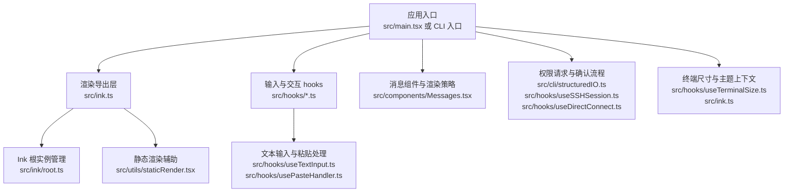
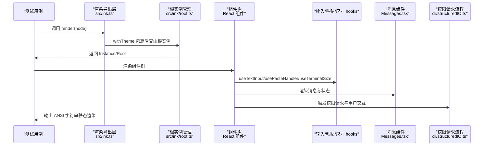
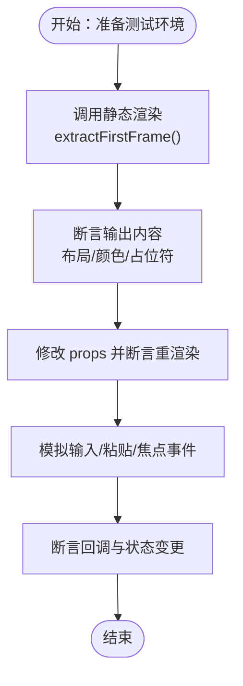
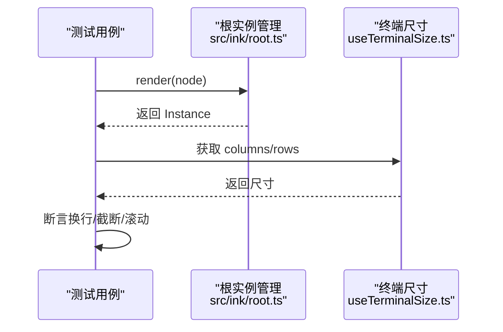
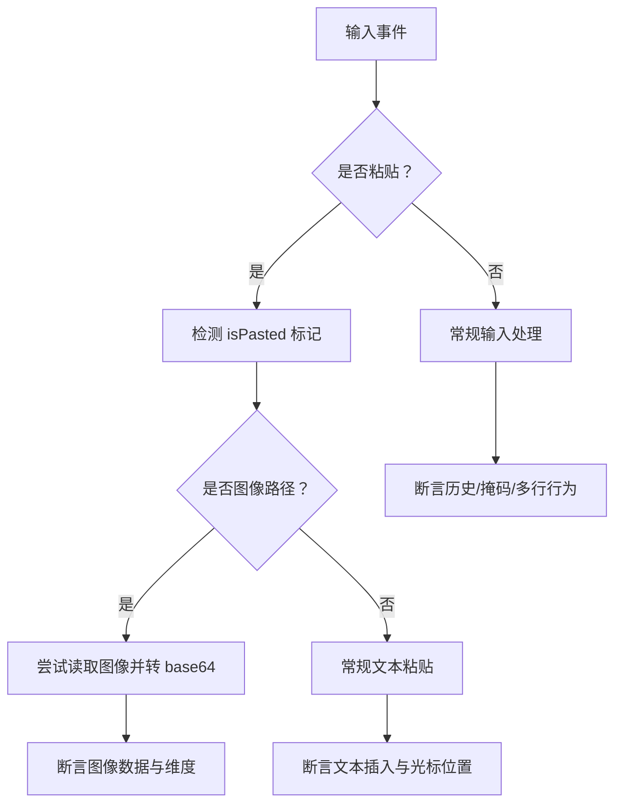
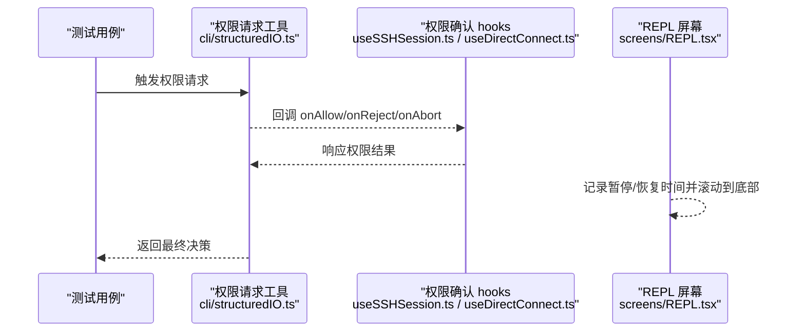
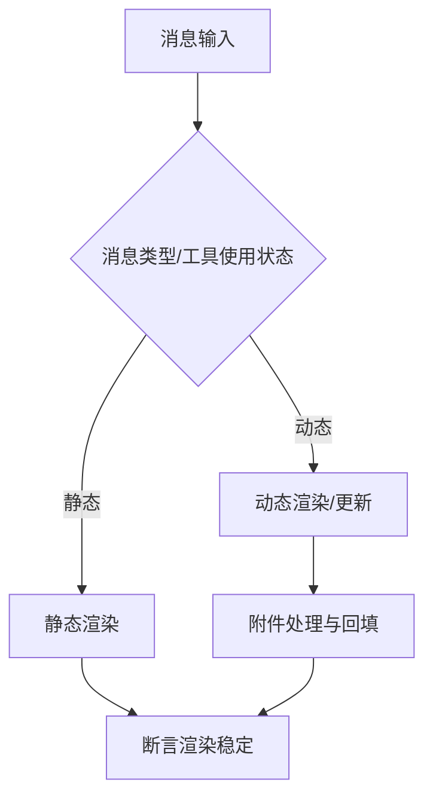
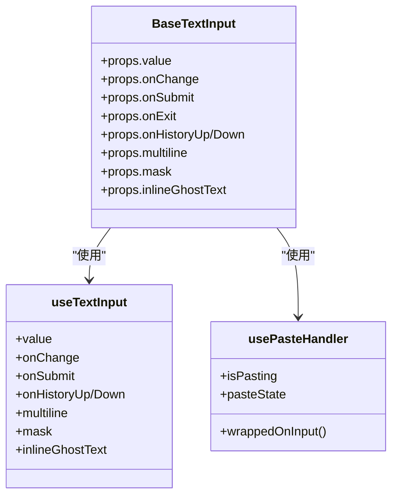
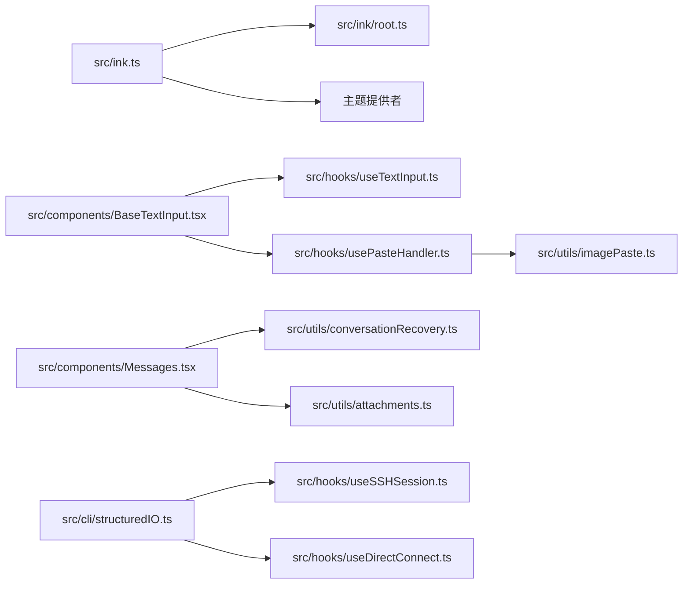

# UI 测试

<cite>
**本文引用的文件**   
- [src/ink.ts](file://src/ink.ts)
- [src/ink/root.ts](file://src/ink/root.ts)
- [src/utils/staticRender.tsx](file://src/utils/staticRender.tsx)
- [src/hooks/useTerminalSize.ts](file://src/hooks/useTerminalSize.ts)
- [src/hooks/useTextInput.ts](file://src/hooks/useTextInput.ts)
- [src/hooks/usePasteHandler.ts](file://src/hooks/usePasteHandler.ts)
- [src/utils/imagePaste.ts](file://src/utils/imagePaste.ts)
- [src/components/BaseTextInput.tsx](file://src/components/BaseTextInput.tsx)
- [src/components/Messages.tsx](file://src/components/Messages.tsx)
- [src/screens/REPL.tsx](file://src/screens/REPL.tsx)
- [src/cli/structuredIO.ts](file://src/cli/structuredIO.ts)
- [src/hooks/useSSHSession.ts](file://src/hooks/useSSHSession.ts)
- [src/hooks/useDirectConnect.ts](file://src/hooks/useDirectConnect.ts)
- [src/utils/conversationRecovery.ts](file://src/utils/conversationRecovery.ts)
- [src/utils/attachments.ts](file://src/utils/attachments.ts)
- [src/commands/init-verifiers.ts](file://src/commands/init-verifiers.ts)
- [package.json](file://package.json)
- [tsconfig.json](file://tsconfig.json)
</cite>

## 目录
1. [引言](#引言)
2. [项目结构](#项目结构)
3. [核心组件](#核心组件)
4. [架构总览](#架构总览)
5. [详细组件分析](#详细组件分析)
6. [依赖分析](#依赖分析)
7. [性能考量](#性能考量)
8. [故障排查指南](#故障排查指南)
9. [结论](#结论)
10. [附录](#附录)

## 引言
本文件面向 Claude Code 的 UI 测试，系统化阐述测试策略与框架选择，覆盖 React 组件测试、Ink 终端组件测试、用户交互测试、权限对话框测试、消息组件测试、输入组件测试、UI 一致性测试（视觉回归与响应式）、无障碍与跨浏览器兼容性测试，以及自动化与截图对比策略。文档同时提供可落地的测试用例示例与最佳实践，帮助测试团队在保证质量的同时提升效率。

## 项目结构
- 前端运行时采用 Ink 作为终端 UI 框架，提供基于 React 的终端组件生态与渲染能力。
- 核心入口通过统一的渲染导出模块集中暴露 Ink 能力与主题包装。
- 输入与交互由自研 hooks 提供，如文本输入、粘贴处理、终端尺寸等。
- 权限请求与确认流程贯穿 CLI 与屏幕组件，形成闭环的用户决策链路。
- 消息渲染与附件处理逻辑集中在消息组件与工具函数中，支持多种消息类型与状态。

**图表来源**
- [src/ink.ts:1-86](file://src/ink.ts#L1-L86)
- [src/ink/root.ts:44-184](file://src/ink/root.ts#L44-L184)
- [src/utils/staticRender.tsx:1-85](file://src/utils/staticRender.tsx#L1-L85)
- [src/hooks/useTextInput.ts:35-90](file://src/hooks/useTextInput.ts#L35-L90)
- [src/hooks/usePasteHandler.ts:1-241](file://src/hooks/usePasteHandler.ts#L1-L241)
- [src/components/Messages.tsx:769-806](file://src/components/Messages.tsx#L769-L806)
- [src/cli/structuredIO.ts:611-859](file://src/cli/structuredIO.ts#L611-L859)
- [src/hooks/useSSHSession.ts:109-146](file://src/hooks/useSSHSession.ts#L109-L146)
- [src/hooks/useDirectConnect.ts:114-148](file://src/hooks/useDirectConnect.ts#L114-L148)
- [src/hooks/useTerminalSize.ts:1-15](file://src/hooks/useTerminalSize.ts#L1-L15)

**章节来源**
- [src/ink.ts:1-86](file://src/ink.ts#L1-L86)
- [src/ink/root.ts:44-184](file://src/ink/root.ts#L44-L184)
- [src/utils/staticRender.tsx:1-85](file://src/utils/staticRender.tsx#L1-L85)
- [src/hooks/useTerminalSize.ts:1-15](file://src/hooks/useTerminalSize.ts#L1-L15)
- [src/hooks/useTextInput.ts:35-90](file://src/hooks/useTextInput.ts#L35-L90)
- [src/hooks/usePasteHandler.ts:1-241](file://src/hooks/usePasteHandler.ts#L1-L241)
- [src/components/Messages.tsx:769-806](file://src/components/Messages.tsx#L769-L806)
- [src/cli/structuredIO.ts:611-859](file://src/cli/structuredIO.ts#L611-L859)
- [src/hooks/useSSHSession.ts:109-146](file://src/hooks/useSSHSession.ts#L109-L146)
- [src/hooks/useDirectConnect.ts:114-148](file://src/hooks/useDirectConnect.ts#L114-L148)

## 核心组件
- 渲染与根实例：统一导出 Ink 渲染与根实例能力，并以 ThemeProvider 包裹确保主题一致。
- 静态渲染：提供一次性渲染并提取首帧内容的能力，便于终端输出的字符串化与断言。
- 输入与粘贴：封装文本输入、历史导航、掩码、多行、图像粘贴等交互细节。
- 消息渲染：根据消息类型、流式状态、工具使用状态决定是否静态渲染或保持动态更新。
- 权限请求：结合 CLI 工具调用与 hooks，实现权限请求、用户交互、决策与结果回传。
- 终端尺寸：提供终端宽高上下文，支撑响应式布局与断言。

**章节来源**
- [src/ink.ts:18-31](file://src/ink.ts#L18-L31)
- [src/utils/staticRender.tsx:74-85](file://src/utils/staticRender.tsx#L74-L85)
- [src/hooks/useTextInput.ts:35-90](file://src/hooks/useTextInput.ts#L35-L90)
- [src/hooks/usePasteHandler.ts:30-241](file://src/hooks/usePasteHandler.ts#L30-L241)
- [src/components/Messages.tsx:769-806](file://src/components/Messages.tsx#L769-L806)
- [src/hooks/useTerminalSize.ts:7-15](file://src/hooks/useTerminalSize.ts#L7-L15)

## 架构总览
下图展示 UI 测试涉及的关键路径：从渲染入口到组件树、输入处理、消息渲染与权限决策，以及终端输出的静态化断言。

**图表来源**
- [src/ink.ts:18-31](file://src/ink.ts#L18-L31)
- [src/ink/root.ts:76-157](file://src/ink/root.ts#L76-L157)
- [src/utils/staticRender.tsx:74-85](file://src/utils/staticRender.tsx#L74-L85)
- [src/hooks/useTextInput.ts:73-90](file://src/hooks/useTextInput.ts#L73-L90)
- [src/hooks/usePasteHandler.ts:30-241](file://src/hooks/usePasteHandler.ts#L30-L241)
- [src/components/Messages.tsx:769-806](file://src/components/Messages.tsx#L769-L806)
- [src/cli/structuredIO.ts:611-859](file://src/cli/structuredIO.ts#L611-L859)

## 详细组件分析

### React 组件测试策略
- 组件渲染测试：使用静态渲染工具提取首帧 ANSI 内容，断言布局、颜色、占位符等。
- 属性传递测试：验证 props 变更触发的重渲染与样式变化。
- 事件处理测试：模拟键盘输入、粘贴、焦点切换等事件，断言回调与状态变更。
- 主题与上下文：通过 ThemeProvider 包裹，确保主题变量在断言中一致。

**图表来源**
- [src/utils/staticRender.tsx:62-69](file://src/utils/staticRender.tsx#L62-L69)
- [src/ink.ts:14-16](file://src/ink.ts#L14-L16)

**章节来源**
- [src/utils/staticRender.tsx:74-85](file://src/utils/staticRender.tsx#L74-L85)
- [src/ink.ts:14-16](file://src/ink.ts#L14-L16)

### Ink 终端组件测试策略
- 根实例复用：通过根实例管理避免重复创建实例，确保连续渲染一致性。
- 同步更新标记：识别并提取首帧内容，避免多帧输出干扰断言。
- 终端尺寸：读取终端宽高，断言换行、截断与滚动行为。

**图表来源**
- [src/ink/root.ts:76-157](file://src/ink/root.ts#L76-L157)
- [src/hooks/useTerminalSize.ts:7-15](file://src/hooks/useTerminalSize.ts#L7-L15)

**章节来源**
- [src/ink/root.ts:76-157](file://src/ink/root.ts#L76-L157)
- [src/hooks/useTerminalSize.ts:7-15](file://src/hooks/useTerminalSize.ts#L7-L15)

### 用户交互测试策略
- 文本输入：断言值变更、历史上下翻、清空、掩码、多行、光标移动禁用等。
- 粘贴操作：区分普通粘贴与图像粘贴，检测粘贴阈值、剪贴板图像、拖拽路径等。
- 快捷键：断言组合键、Esc 双击、上下键游标移动禁用等行为。

**图表来源**
- [src/hooks/usePasteHandler.ts:214-241](file://src/hooks/usePasteHandler.ts#L214-L241)
- [src/utils/imagePaste.ts:190-238](file://src/utils/imagePaste.ts#L190-L238)
- [src/hooks/useTextInput.ts:73-90](file://src/hooks/useTextInput.ts#L73-L90)

**章节来源**
- [src/hooks/usePasteHandler.ts:30-241](file://src/hooks/usePasteHandler.ts#L30-L241)
- [src/utils/imagePaste.ts:190-238](file://src/utils/imagePaste.ts#L190-L238)
- [src/hooks/useTextInput.ts:35-90](file://src/hooks/useTextInput.ts#L35-L90)

### 权限对话框测试策略
- 请求与决策：结合 CLI 工具调用与 hooks，验证请求发起、用户交互、允许/拒绝/中止三种路径。
- 屏幕暂停计时：REPL 屏幕对权限覆盖层出现/消失进行滚动锚定与暂停计时，需断言时间累积与滚动行为。
- 远程与本地差异：本地与远程会话的 onAllow/onReject/onAbort 行为不同，需分别断言。

**图表来源**
- [src/cli/structuredIO.ts:611-859](file://src/cli/structuredIO.ts#L611-L859)
- [src/hooks/useSSHSession.ts:109-146](file://src/hooks/useSSHSession.ts#L109-L146)
- [src/hooks/useDirectConnect.ts:114-148](file://src/hooks/useDirectConnect.ts#L114-L148)
- [src/screens/REPL.tsx:2069-2096](file://src/screens/REPL.tsx#L2069-L2096)

**章节来源**
- [src/cli/structuredIO.ts:611-859](file://src/cli/structuredIO.ts#L611-L859)
- [src/hooks/useSSHSession.ts:109-146](file://src/hooks/useSSHSession.ts#L109-L146)
- [src/hooks/useDirectConnect.ts:114-148](file://src/hooks/useDirectConnect.ts#L114-L148)
- [src/screens/REPL.tsx:2069-2096](file://src/screens/REPL.tsx#L2069-L2096)

### 消息组件测试策略
- 渲染策略：根据消息类型与工具使用状态决定静态/动态渲染，断言渲染时机与内容稳定性。
- 附件处理：断言附件类型迁移、显示路径回填、并发安全与语义化附件生成。
- 消息状态：断言思考中、流式中、完成态、错误态等状态下的 UI 表现。

**图表来源**
- [src/components/Messages.tsx:769-806](file://src/components/Messages.tsx#L769-L806)
- [src/utils/conversationRecovery.ts:76-121](file://src/utils/conversationRecovery.ts#L76-L121)
- [src/utils/attachments.ts:904-946](file://src/utils/attachments.ts#L904-L946)

**章节来源**
- [src/components/Messages.tsx:769-806](file://src/components/Messages.tsx#L769-L806)
- [src/utils/conversationRecovery.ts:76-121](file://src/utils/conversationRecovery.ts#L76-L121)
- [src/utils/attachments.ts:904-946](file://src/utils/attachments.ts#L904-L946)

### 输入组件测试策略
- 文本输入：断言值变更、历史记录、清空、掩码、多行、光标位置、内联占位符。
- 快捷键：断言组合键、Esc 双击、上下键游标移动禁用等。
- 粘贴操作：断言阈值判断、图像路径识别、剪贴板图像读取与转换。

**图表来源**
- [src/components/BaseTextInput.tsx:40-91](file://src/components/BaseTextInput.tsx#L40-L91)
- [src/hooks/useTextInput.ts:35-90](file://src/hooks/useTextInput.ts#L35-L90)
- [src/hooks/usePasteHandler.ts:30-241](file://src/hooks/usePasteHandler.ts#L30-L241)

**章节来源**
- [src/components/BaseTextInput.tsx:40-91](file://src/components/BaseTextInput.tsx#L40-L91)
- [src/hooks/useTextInput.ts:35-90](file://src/hooks/useTextInput.ts#L35-L90)
- [src/hooks/usePasteHandler.ts:30-241](file://src/hooks/usePasteHandler.ts#L30-L241)

### UI 一致性测试方法
- 视觉回归测试：将终端输出字符串化后与基线快照对比，识别布局、颜色、截断等变化。
- 响应式设计测试：通过终端尺寸上下文断言换行、截断与滚动行为，覆盖窄/宽窗口场景。
- 自动化与截图对比：结合静态渲染与终端尺寸，构建可重复的断言矩阵，减少人工干预。

**章节来源**
- [src/utils/staticRender.tsx:74-85](file://src/utils/staticRender.tsx#L74-L85)
- [src/hooks/useTerminalSize.ts:7-15](file://src/hooks/useTerminalSize.ts#L7-L15)

### 无障碍与跨浏览器兼容性测试
- 无障碍：断言焦点管理、键盘可达性、屏幕阅读器友好的文本与链接。
- 跨浏览器兼容：通过终端抽象层统一输出，避免浏览器差异；若涉及 Web UI，建议使用浏览器自动化工具进行验证。

**章节来源**
- [src/ink.ts:71-85](file://src/ink.ts#L71-L85)

### 测试框架与工具选择
- 测试运行时：Node.js（版本要求见工程配置）。
- 类型与编译：TypeScript（包含 JSX 支持）。
- 建议的浏览器验证工具：Playwright（推荐），或 Chrome DevTools MCP、Claude Chrome 扩展（按项目初始化向导配置）。

**章节来源**
- [package.json:13-18](file://package.json#L13-L18)
- [tsconfig.json:1-36](file://tsconfig.json#L1-36)
- [src/commands/init-verifiers.ts:58-164](file://src/commands/init-verifiers.ts#L58-L164)

## 依赖分析
- 渲染导出层依赖根实例管理与主题提供者，确保组件树具备一致的主题与渲染上下文。
- 输入与粘贴处理依赖终端输入解析与剪贴板读取，需关注平台差异（如 macOS 图像粘贴）。
- 消息渲染依赖消息状态与附件工具，需关注并发安全与类型迁移。
- 权限请求依赖 CLI 工具与 hooks，需关注本地与远程会话的差异行为。

**图表来源**
- [src/ink.ts:18-31](file://src/ink.ts#L18-L31)
- [src/ink/root.ts:76-157](file://src/ink/root.ts#L76-L157)
- [src/components/BaseTextInput.tsx:40-91](file://src/components/BaseTextInput.tsx#L40-L91)
- [src/hooks/useTextInput.ts:73-90](file://src/hooks/useTextInput.ts#L73-L90)
- [src/hooks/usePasteHandler.ts:30-241](file://src/hooks/usePasteHandler.ts#L30-L241)
- [src/utils/imagePaste.ts:190-238](file://src/utils/imagePaste.ts#L190-L238)
- [src/components/Messages.tsx:769-806](file://src/components/Messages.tsx#L769-L806)
- [src/utils/conversationRecovery.ts:76-121](file://src/utils/conversationRecovery.ts#L76-L121)
- [src/utils/attachments.ts:904-946](file://src/utils/attachments.ts#L904-L946)
- [src/cli/structuredIO.ts:611-859](file://src/cli/structuredIO.ts#L611-L859)
- [src/hooks/useSSHSession.ts:109-146](file://src/hooks/useSSHSession.ts#L109-L146)
- [src/hooks/useDirectConnect.ts:114-148](file://src/hooks/useDirectConnect.ts#L114-L148)

**章节来源**
- [src/ink.ts:18-31](file://src/ink.ts#L18-L31)
- [src/ink/root.ts:76-157](file://src/ink/root.ts#L76-L157)
- [src/components/BaseTextInput.tsx:40-91](file://src/components/BaseTextInput.tsx#L40-L91)
- [src/hooks/useTextInput.ts:73-90](file://src/hooks/useTextInput.ts#L73-L90)
- [src/hooks/usePasteHandler.ts:30-241](file://src/hooks/usePasteHandler.ts#L30-L241)
- [src/utils/imagePaste.ts:190-238](file://src/utils/imagePaste.ts#L190-L238)
- [src/components/Messages.tsx:769-806](file://src/components/Messages.tsx#L769-L806)
- [src/utils/conversationRecovery.ts:76-121](file://src/utils/conversationRecovery.ts#L76-L121)
- [src/utils/attachments.ts:904-946](file://src/utils/attachments.ts#L904-L946)
- [src/cli/structuredIO.ts:611-859](file://src/cli/structuredIO.ts#L611-L859)
- [src/hooks/useSSHSession.ts:109-146](file://src/hooks/useSSHSession.ts#L109-L146)
- [src/hooks/useDirectConnect.ts:114-148](file://src/hooks/useDirectConnect.ts#L114-L148)

## 性能考量
- 渲染性能：利用静态渲染提取首帧，减少不必要的多帧输出开销。
- 输入处理：粘贴阈值与去抖机制降低高频输入带来的重渲染压力。
- 消息渲染：根据工具使用状态与流式状态决定静态/动态渲染，平衡实时性与性能。
- 终端尺寸：按需获取尺寸，避免频繁测量导致的抖动。

## 故障排查指南
- 静态渲染无输出：检查是否正确提取首帧同步更新标记，确认输出流列数设置。
- 粘贴异常：确认 isPasted 标记、阈值与平台图像读取逻辑，检查剪贴板访问权限。
- 权限请求超时：检查中断信号合并、工具调用与 hooks 回调，确保及时响应。
- 消息渲染不更新：检查工具使用 ID、流式状态与 PostToolUse hooks 解析。

**章节来源**
- [src/utils/staticRender.tsx:62-69](file://src/utils/staticRender.tsx#L62-L69)
- [src/hooks/usePasteHandler.ts:214-241](file://src/hooks/usePasteHandler.ts#L214-L241)
- [src/cli/structuredIO.ts:611-859](file://src/cli/structuredIO.ts#L611-L859)
- [src/components/Messages.tsx:769-806](file://src/components/Messages.tsx#L769-L806)

## 结论
通过将 Ink 渲染、静态输出、输入/粘贴处理、消息渲染与权限请求流程系统化地纳入测试体系，可以有效保障 Claude Code 在终端环境下的 UI 质量。结合视觉回归与响应式测试，辅以浏览器自动化工具，能够进一步提升 UI 一致性与跨环境兼容性。建议在持续集成中引入自动化断言矩阵，配合基线快照与终端尺寸断言，形成稳定的 UI 测试流水线。

## 附录
- 测试用例示例（路径参考）
  - 组件渲染测试：[src/utils/staticRender.tsx:74-85](file://src/utils/staticRender.tsx#L74-L85)
  - 输入与粘贴测试：[src/hooks/useTextInput.ts:73-90](file://src/hooks/useTextInput.ts#L73-L90)、[src/hooks/usePasteHandler.ts:30-241](file://src/hooks/usePasteHandler.ts#L30-L241)
  - 权限请求测试：[src/cli/structuredIO.ts:611-859](file://src/cli/structuredIO.ts#L611-L859)、[src/hooks/useSSHSession.ts:109-146](file://src/hooks/useSSHSession.ts#L109-L146)、[src/hooks/useDirectConnect.ts:114-148](file://src/hooks/useDirectConnect.ts#L114-L148)
  - 消息渲染测试：[src/components/Messages.tsx:769-806](file://src/components/Messages.tsx#L769-L806)
  - 终端尺寸测试：[src/hooks/useTerminalSize.ts:7-15](file://src/hooks/useTerminalSize.ts#L7-L15)
  - 浏览器验证工具初始化：[src/commands/init-verifiers.ts:58-164](file://src/commands/init-verifiers.ts#L58-L164)