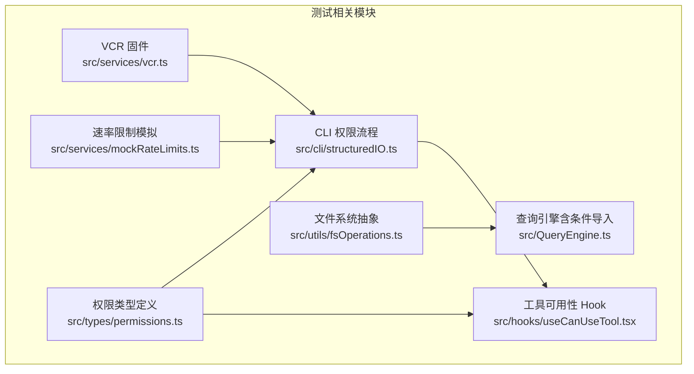
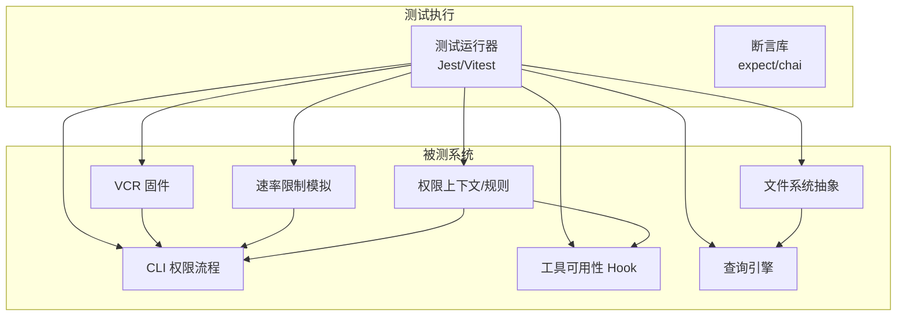
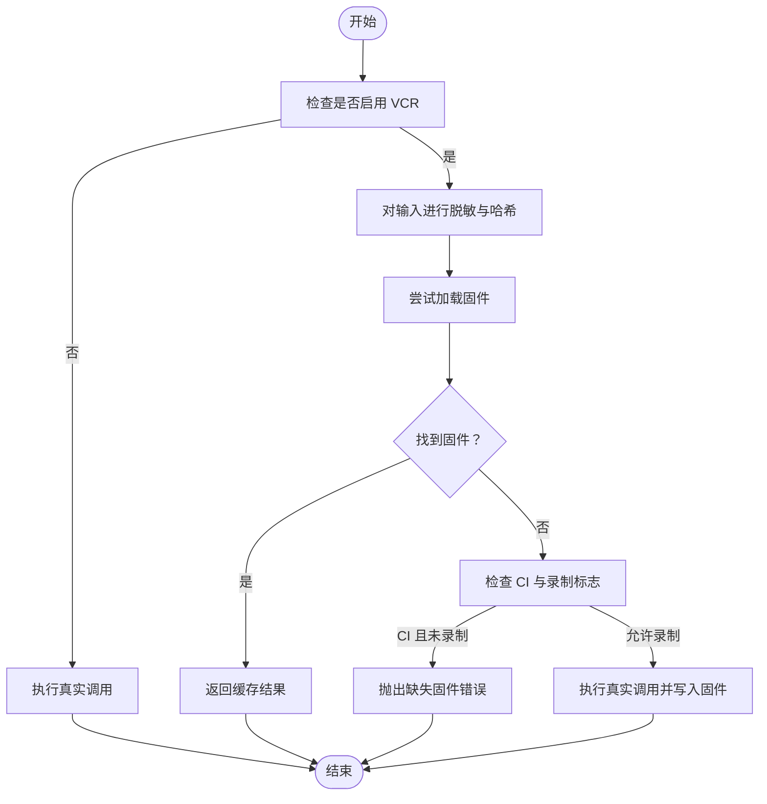
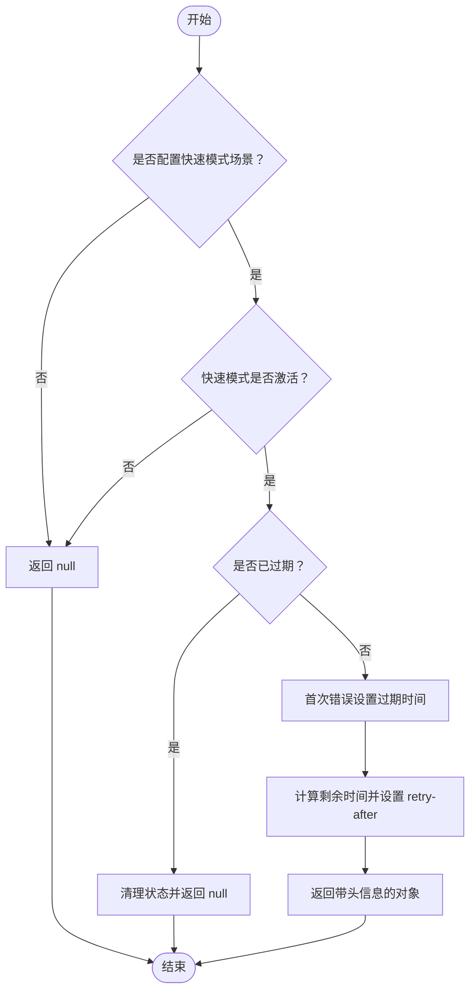
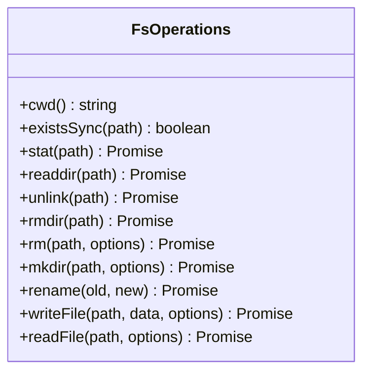
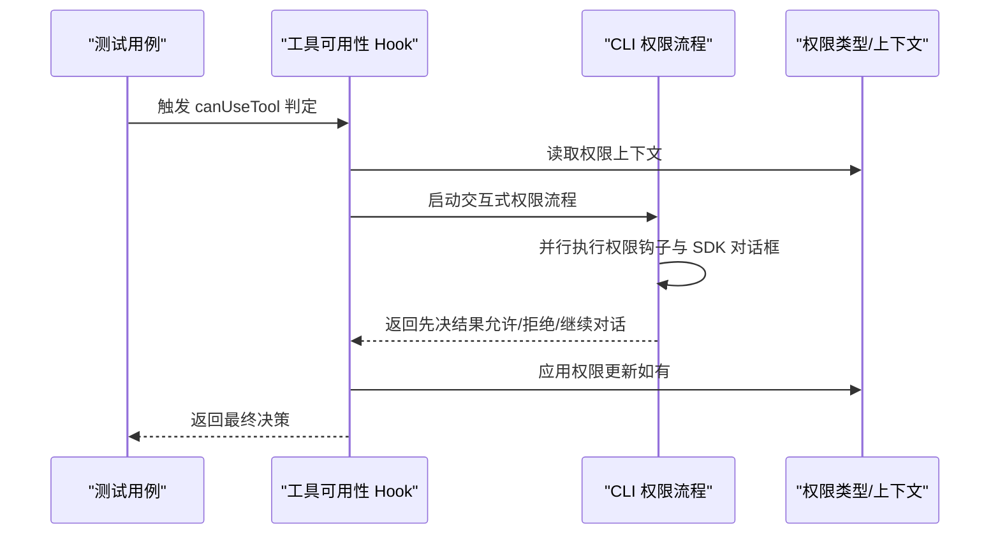
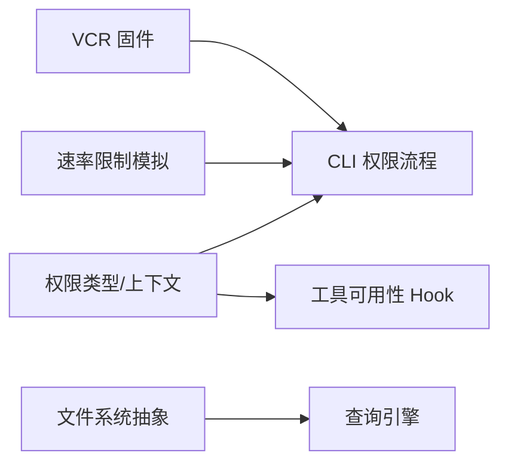

# 单元测试

<cite>
**本文引用的文件**
- [package.json](file://package.json)
- [QUICKSTART.md](file://QUICKSTART.md)
- [README.md](file://README.md)
- [src/services/vcr.ts](file://src/services/vcr.ts)
- [src/services/mockRateLimits.ts](file://src/services/mockRateLimits.ts)
- [src/cli/structuredIO.ts](file://src/cli/structuredIO.ts)
- [src/types/permissions.ts](file://src/types/permissions.ts)
- [src/hooks/useCanUseTool.tsx](file://src/hooks/useCanUseTool.tsx)
- [src/utils/fsOperations.ts](file://src/utils/fsOperations.ts)
- [src/QueryEngine.ts](file://src/QueryEngine.ts)
</cite>

## 目录
1. [简介](#简介)
2. [项目结构](#项目结构)
3. [核心组件](#核心组件)
4. [架构总览](#架构总览)
5. [详细组件分析](#详细组件分析)
6. [依赖分析](#依赖分析)
7. [性能考虑](#性能考虑)
8. [故障排查指南](#故障排查指南)
9. [结论](#结论)
10. [附录](#附录)

## 简介
本技术文档面向 Claude Code 的单元测试实践，聚焦于测试框架配置与设置、测试环境搭建、测试运行器配置、断言库使用、工具单元测试策略（功能测试、权限检查测试、工具执行测试）、服务单元测试方法（API 客户端测试、工具执行器测试、权限系统测试）、组件单元测试策略（React 组件测试、Hook 测试、工具权限测试）、测试数据管理与模拟策略（测试数据生成、外部依赖模拟、异步操作测试）、具体测试用例示例（工具权限、文件操作、网络请求等）、测试覆盖率与质量标准、以及测试调试技巧与常见问题解决方案。

## 项目结构
本仓库为研究用途提供的源码，包含命令行、服务层、工具层、类型定义、权限系统、CLI 权限流程、VCR 录放机制、速率限制模拟、文件系统抽象等模块。测试相关的关键点包括：
- 测试运行器与断言：当前仓库未直接提供测试脚本或测试运行器配置，建议在本地或 CI 中引入 Jest 或 Vitest，并结合 ts-jest 或相应编译器适配。
- 测试数据与外部依赖：通过 VCR 固件机制与速率限制模拟实现稳定的外部依赖行为；文件系统通过抽象接口支持替换实现。
- 权限与工具执行：CLI 层提供权限请求与钩子并发决策流程；权限上下文类型定义清晰，便于构造测试场景。

**图表来源**
- [src/services/vcr.ts:38-134](file://src/services/vcr.ts#L38-L134)
- [src/services/mockRateLimits.ts:828-882](file://src/services/mockRateLimits.ts#L828-L882)
- [src/utils/fsOperations.ts:1-39](file://src/utils/fsOperations.ts#L1-L39)
- [src/types/permissions.ts:415-441](file://src/types/permissions.ts#L415-L441)
- [src/cli/structuredIO.ts:550-859](file://src/cli/structuredIO.ts#L550-L859)
- [src/hooks/useCanUseTool.tsx:151-183](file://src/hooks/useCanUseTool.tsx#L151-L183)
- [src/QueryEngine.ts:109-119](file://src/QueryEngine.ts#L109-L119)

**章节来源**
- [package.json:1-21](file://package.json#L1-L21)
- [QUICKSTART.md:24-94](file://QUICKSTART.md#L24-L94)
- [README.md:15-206](file://README.md#L15-L206)

## 核心组件
- VCR 固件机制：用于稳定网络请求输出与令牌计数结果，支持跨平台路径归一化与时间戳、UUID 等动态内容脱敏，避免 CI 不一致。
- 速率限制模拟：提供快速模式速率限制场景、订阅类型与用户类型判定、重试头计算等，便于测试不同速率限制状态。
- 文件系统抽象：以接口形式封装常用文件操作，便于在测试中注入虚拟实现或内存实现。
- 权限类型与上下文：定义工具权限规则来源、模式、工作目录扩展、自动化检查前置等，支撑权限系统测试。
- CLI 权限流程：并行执行权限钩子与 SDK 对话框，先到先决，失败时回退或取消，支持中断传播。
- 工具可用性 Hook：根据分类器与交互式权限流程决定是否允许工具使用，处理中断与错误。
- 查询引擎：包含条件导入逻辑，便于在测试中排除特定模块或注入替身。

**章节来源**
- [src/services/vcr.ts:38-406](file://src/services/vcr.ts#L38-L406)
- [src/services/mockRateLimits.ts:828-882](file://src/services/mockRateLimits.ts#L828-L882)
- [src/utils/fsOperations.ts:1-39](file://src/utils/fsOperations.ts#L1-L39)
- [src/types/permissions.ts:415-441](file://src/types/permissions.ts#L415-L441)
- [src/cli/structuredIO.ts:550-859](file://src/cli/structuredIO.ts#L550-L859)
- [src/hooks/useCanUseTool.tsx:151-183](file://src/hooks/useCanUseTool.tsx#L151-L183)
- [src/QueryEngine.ts:109-119](file://src/QueryEngine.ts#L109-L119)

## 架构总览
下图展示了测试相关组件之间的交互关系，重点体现 VCR 固件、速率限制模拟、文件系统抽象、权限上下文与 CLI 权限流程之间的协作。

**图表来源**
- [src/services/vcr.ts:38-134](file://src/services/vcr.ts#L38-L134)
- [src/services/mockRateLimits.ts:828-882](file://src/services/mockRateLimits.ts#L828-L882)
- [src/utils/fsOperations.ts:1-39](file://src/utils/fsOperations.ts#L1-L39)
- [src/types/permissions.ts:415-441](file://src/types/permissions.ts#L415-L441)
- [src/cli/structuredIO.ts:550-859](file://src/cli/structuredIO.ts#L550-L859)
- [src/hooks/useCanUseTool.tsx:151-183](file://src/hooks/useCanUseTool.tsx#L151-L183)
- [src/QueryEngine.ts:109-119](file://src/QueryEngine.ts#L109-L119)

## 详细组件分析

### VCR 固件机制（API 输出与令牌计数缓存）
- 功能要点
  - 输入去水印：对消息、工具输入进行脱敏，替换工作目录、配置目录、UUID、时间戳等动态值，确保跨平台与跨运行的一致性。
  - 固件命名：基于输入哈希生成固定文件名，便于缓存命中与 CI 录制。
  - 缓存读取：优先从 fixtures 目录读取，缺失则执行真实调用并写入固件。
  - CI 安全：在 CI 且未开启录制时，缺失固件会抛出明确提示，防止静默失败。
- 测试策略
  - 使用环境变量控制录制与读取，确保本地可更新固件，CI 只读。
  - 针对不同输入组合（消息、工具列表）分别生成固件，覆盖边界场景。
  - 跨平台路径与时间戳处理需单独验证，确保一致性。

**图表来源**
- [src/services/vcr.ts:38-134](file://src/services/vcr.ts#L38-L134)
- [src/services/vcr.ts:302-406](file://src/services/vcr.ts#L302-L406)

**章节来源**
- [src/services/vcr.ts:38-134](file://src/services/vcr.ts#L38-L134)
- [src/services/vcr.ts:302-406](file://src/services/vcr.ts#L302-L406)

### 速率限制模拟（快速模式与账单访问）
- 功能要点
  - 快速模式速率限制：可配置持续时间与过期时间，动态计算 retry-after 头，仅在快速模式激活时触发。
  - 账单访问模拟：针对特定用户类型（如内部员工）可模拟账单访问权限。
  - 场景复用：通过全局状态与辅助函数在多个测试用例中复用相同场景。
- 测试策略
  - 分别测试“未激活快速模式”“已过期”“仍在冷却中”“有权限访问”等分支。
  - 检查返回头的正确性与过期时间计算逻辑。
  - 结合 VCR 与速率限制模拟，稳定网络请求与速率限制交互。

**图表来源**
- [src/services/mockRateLimits.ts:843-882](file://src/services/mockRateLimits.ts#L843-L882)

**章节来源**
- [src/services/mockRateLimits.ts:828-882](file://src/services/mockRateLimits.ts#L828-L882)

### 文件系统抽象（FsOperations 接口）
- 功能要点
  - 提供常用同步/异步文件操作的抽象接口，便于替换实现（如内存实现、虚拟文件系统）。
  - 支持工作目录、存在性检查、统计、目录遍历、删除等。
- 测试策略
  - 通过注入替身实现隔离测试，避免真实文件系统副作用。
  - 覆盖异常路径（不存在、权限不足、路径非法）与边界情况（空目录、深层路径）。

**图表来源**
- [src/utils/fsOperations.ts:1-39](file://src/utils/fsOperations.ts#L1-L39)

**章节来源**
- [src/utils/fsOperations.ts:1-39](file://src/utils/fsOperations.ts#L1-L39)

### 权限系统与工具可用性（类型、上下文、Hook）
- 权限类型与上下文
  - 定义权限模式、额外工作目录、规则来源映射、是否绕过权限模式、是否避免权限提示等字段，支撑复杂权限策略测试。
- 工具可用性 Hook
  - 基于分类器与交互式权限流程决定是否允许工具使用，处理中断与错误，支持桥接回调与通道回调。
- CLI 权限流程
  - 并行执行权限钩子与 SDK 对话框，先到先决；若钩子提前决策，应用权限更新并刷新上下文。

**图表来源**
- [src/hooks/useCanUseTool.tsx:151-183](file://src/hooks/useCanUseTool.tsx#L151-L183)
- [src/cli/structuredIO.ts:550-859](file://src/cli/structuredIO.ts#L550-L859)
- [src/types/permissions.ts:415-441](file://src/types/permissions.ts#L415-L441)

**章节来源**
- [src/hooks/useCanUseTool.tsx:151-183](file://src/hooks/useCanUseTool.tsx#L151-L183)
- [src/cli/structuredIO.ts:550-859](file://src/cli/structuredIO.ts#L550-L859)
- [src/types/permissions.ts:415-441](file://src/types/permissions.ts#L415-L441)

### 查询引擎（条件导入与可测试性）
- 功能要点
  - 包含条件导入逻辑，便于在测试中排除特定模块（如协调者模式、紧凑压缩），减少无关分支影响。
- 测试策略
  - 在测试构建中通过特征开关或打包配置排除特定导入，确保测试专注目标模块。
  - 结合 VCR 与权限流程，验证消息提交与系统提示构建的稳定性。

**章节来源**
- [src/QueryEngine.ts:109-119](file://src/QueryEngine.ts#L109-L119)

## 依赖分析
- 组件耦合
  - CLI 权限流程依赖权限类型与上下文、VCR 固件与速率限制模拟，形成测试友好闭环。
  - 文件系统抽象为上层模块提供稳定 IO 行为，降低测试对真实文件系统的依赖。
- 外部依赖
  - VCR 固件依赖文件系统与环境变量；速率限制模拟依赖进程环境变量与时间。
- 循环依赖
  - 当前结构未见明显循环依赖；权限上下文与 Hook 之间为单向依赖。

**图表来源**
- [src/services/vcr.ts:38-134](file://src/services/vcr.ts#L38-L134)
- [src/services/mockRateLimits.ts:828-882](file://src/services/mockRateLimits.ts#L828-L882)
- [src/types/permissions.ts:415-441](file://src/types/permissions.ts#L415-L441)
- [src/cli/structuredIO.ts:550-859](file://src/cli/structuredIO.ts#L550-L859)
- [src/hooks/useCanUseTool.tsx:151-183](file://src/hooks/useCanUseTool.tsx#L151-L183)
- [src/utils/fsOperations.ts:1-39](file://src/utils/fsOperations.ts#L1-L39)
- [src/QueryEngine.ts:109-119](file://src/QueryEngine.ts#L109-L119)

**章节来源**
- [src/services/vcr.ts:38-134](file://src/services/vcr.ts#L38-L134)
- [src/services/mockRateLimits.ts:828-882](file://src/services/mockRateLimits.ts#L828-L882)
- [src/types/permissions.ts:415-441](file://src/types/permissions.ts#L415-L441)
- [src/cli/structuredIO.ts:550-859](file://src/cli/structuredIO.ts#L550-L859)
- [src/hooks/useCanUseTool.tsx:151-183](file://src/hooks/useCanUseTool.tsx#L151-L183)
- [src/utils/fsOperations.ts:1-39](file://src/utils/fsOperations.ts#L1-L39)
- [src/QueryEngine.ts:109-119](file://src/QueryEngine.ts#L109-L119)

## 性能考虑
- VCR 固件命中率：通过输入脱敏与稳定化，提升固件命中率，减少网络与计算开销。
- 速率限制模拟：在测试中预设场景，避免真实 API 调用带来的延迟与不稳定。
- 文件系统抽象：在测试中使用内存实现，避免磁盘 IO 开销与副作用。
- 并行决策：CLI 权限流程采用并行策略，缩短等待时间，提高测试吞吐。

## 故障排查指南
- 固件缺失（CI 且未录制）
  - 现象：CI 抛出缺失固件错误。
  - 处理：在本地开启录制并提交新固件，或在 CI 显式设置录制标志后重新运行。
  - 参考：[src/services/vcr.ts:71-75](file://src/services/vcr.ts#L71-L75)
- 路径与时间戳不一致
  - 现象：跨平台或跨运行固件不命中。
  - 处理：确认脱敏逻辑已覆盖工作目录、配置目录、路径分隔符、JSON 转义等。
  - 参考：[src/services/vcr.ts:302-328](file://src/services/vcr.ts#L302-L328)
- 速率限制未生效
  - 现象：快速模式未触发或 retry-after 错误。
  - 处理：检查场景配置、过期时间计算与激活状态。
  - 参考：[src/services/mockRateLimits.ts:843-882](file://src/services/mockRateLimits.ts#L843-L882)
- 权限决策异常
  - 现象：Hook 提前拒绝或交互式流程卡住。
  - 处理：检查钩子返回值、中断信号与上下文更新逻辑。
  - 参考：[src/cli/structuredIO.ts:550-859](file://src/cli/structuredIO.ts#L550-L859), [src/hooks/useCanUseTool.tsx:151-183](file://src/hooks/useCanUseTool.tsx#L151-L183)

**章节来源**
- [src/services/vcr.ts:71-75](file://src/services/vcr.ts#L71-L75)
- [src/services/vcr.ts:302-328](file://src/services/vcr.ts#L302-L328)
- [src/services/mockRateLimits.ts:843-882](file://src/services/mockRateLimits.ts#L843-L882)
- [src/cli/structuredIO.ts:550-859](file://src/cli/structuredIO.ts#L550-L859)
- [src/hooks/useCanUseTool.tsx:151-183](file://src/hooks/useCanUseTool.tsx#L151-L183)

## 结论
本仓库提供了完善的测试基础设施基础：VCR 固件、速率限制模拟、文件系统抽象、权限类型与上下文、CLI 权限流程及工具可用性 Hook。建议在现有基础上引入测试运行器与断言库，结合上述组件设计，构建覆盖工具功能、权限检查、文件操作、网络请求与异步流程的单元测试体系，并通过环境变量与替身实现稳定可控的测试环境。

## 附录
- 测试运行器与断言建议
  - 运行器：Jest 或 Vitest（支持 TypeScript 与 ES Module）。
  - 断言库：expect（Jest 内置）或 chai。
  - 编译器适配：ts-jest 或 vitest 配置 ts 模块解析。
- 测试数据与模拟
  - 使用 VCR 固件管理外部依赖输出；通过速率限制模拟控制 API 速率限制状态。
  - 使用文件系统抽象注入替身实现，隔离真实文件系统。
- 覆盖率与质量标准
  - 建议：关键模块（CLI 权限流程、权限类型、Hook、VCR、速率限制模拟、文件系统抽象）达到高覆盖率；对边界与异常路径进行充分覆盖。
- 具体测试用例示例（路径指引）
  - 工具权限：参考 [src/cli/structuredIO.ts:550-859](file://src/cli/structuredIO.ts#L550-L859) 与 [src/hooks/useCanUseTool.tsx:151-183](file://src/hooks/useCanUseTool.tsx#L151-L183)
  - 文件操作：参考 [src/utils/fsOperations.ts:1-39](file://src/utils/fsOperations.ts#L1-L39)
  - 网络请求与令牌计数：参考 [src/services/vcr.ts:38-134](file://src/services/vcr.ts#L38-L134) 与 [src/services/vcr.ts:382-406](file://src/services/vcr.ts#L382-L406)
  - 速率限制：参考 [src/services/mockRateLimits.ts:828-882](file://src/services/mockRateLimits.ts#L828-L882)