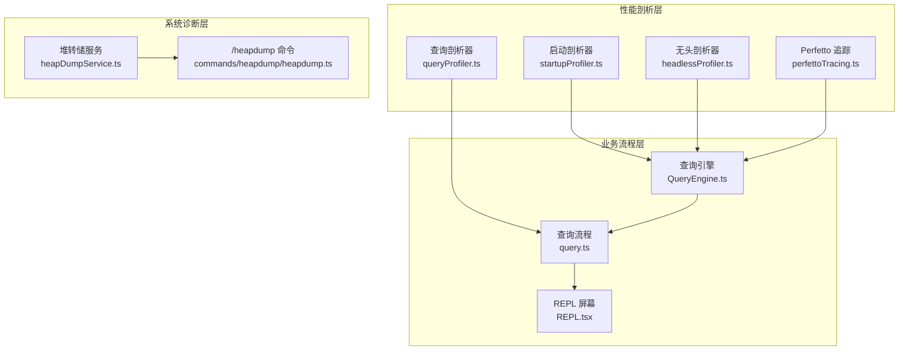
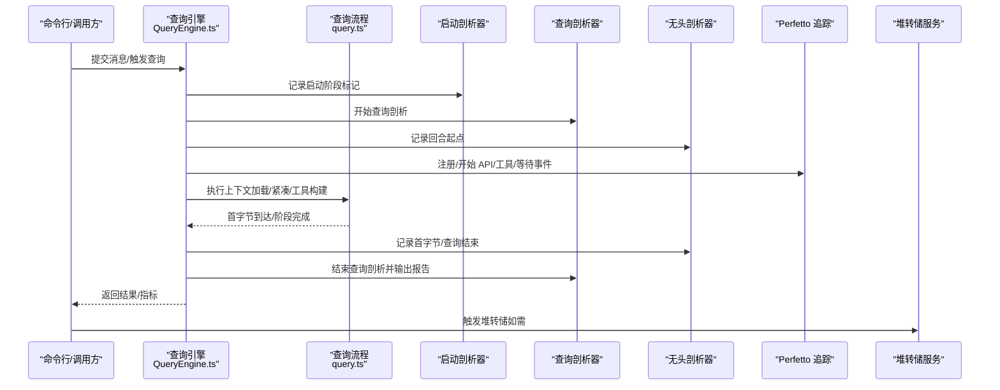
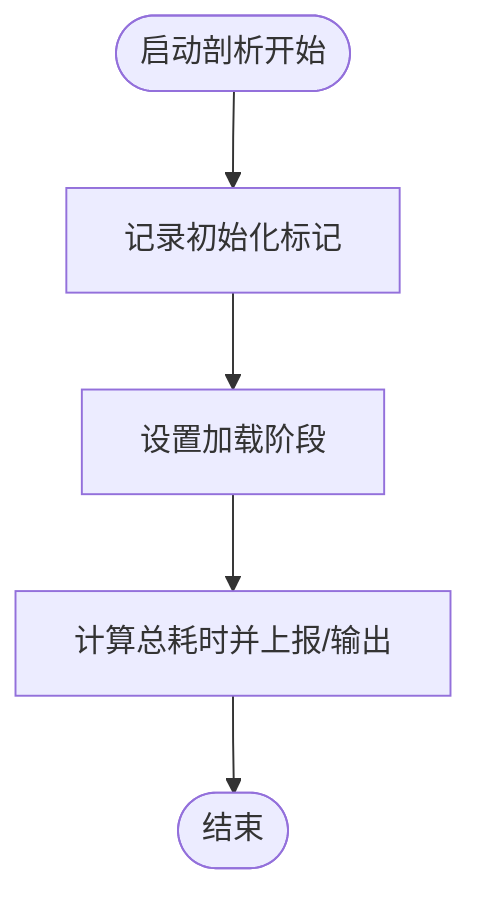
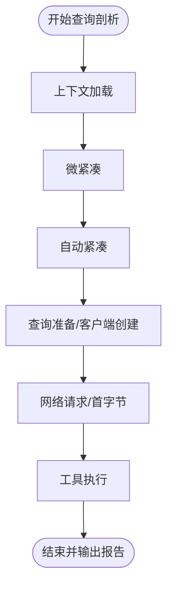
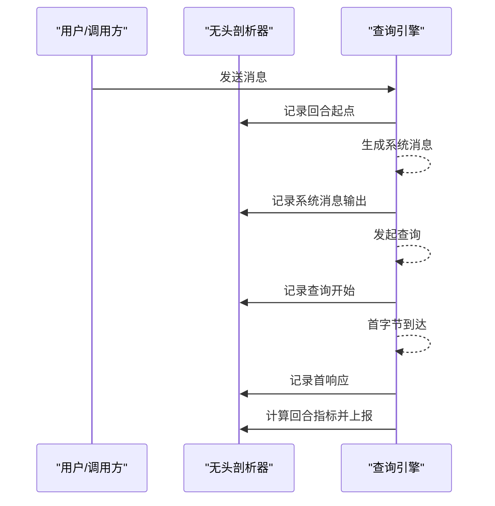
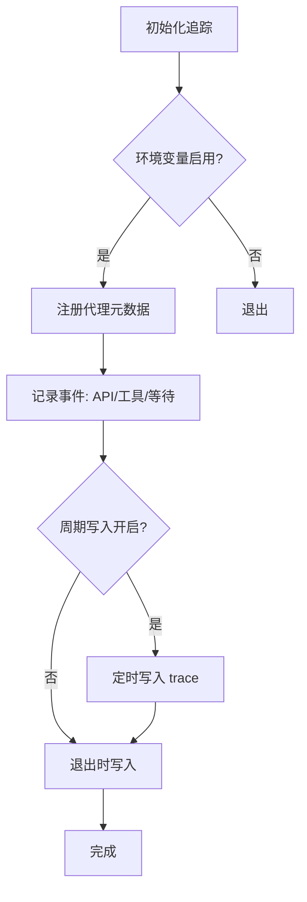
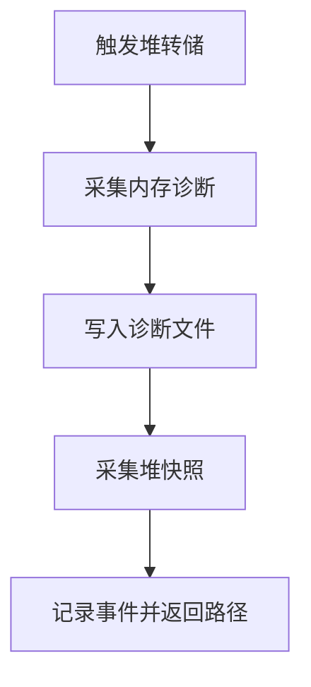
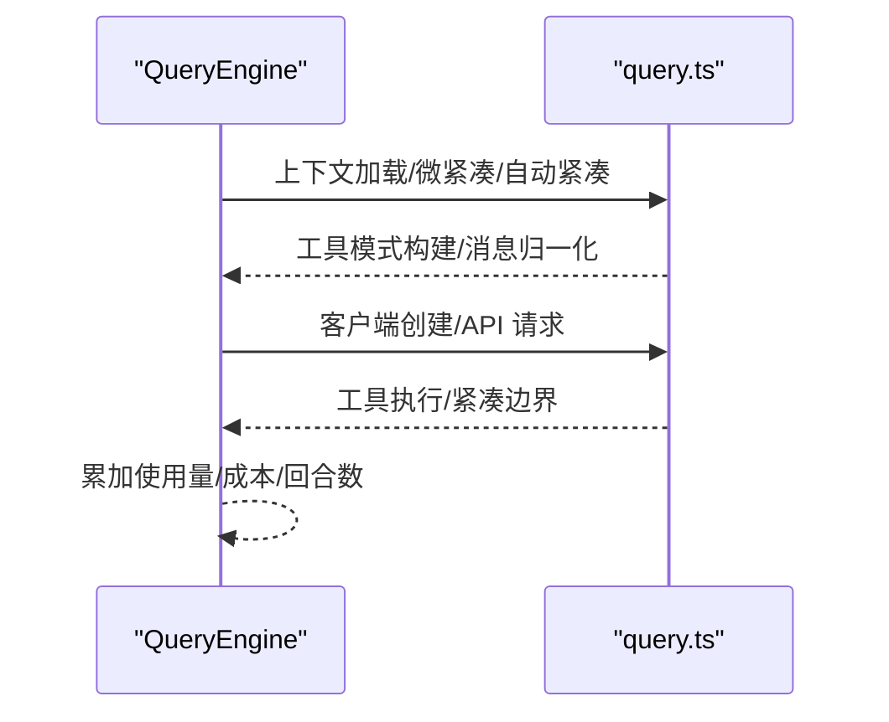
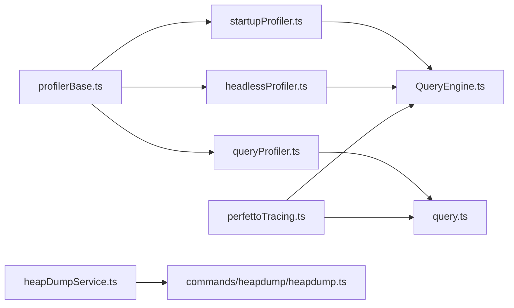

# 性能测试

<cite>
**本文引用的文件**
- [src/utils/profilerBase.ts](file://src/utils/profilerBase.ts)
- [src/utils/startupProfiler.ts](file://src/utils/startupProfiler.ts)
- [src/utils/queryProfiler.ts](file://src/utils/queryProfiler.ts)
- [src/utils/headlessProfiler.ts](file://src/utils/headlessProfiler.ts)
- [src/utils/telemetry/perfettoTracing.ts](file://src/utils/telemetry/perfettoTracing.ts)
- [src/utils/heapDumpService.ts](file://src/utils/heapDumpService.ts)
- [src/commands/heapdump/heapdump.ts](file://src/commands/heapdump/heapdump.ts)
- [src/QueryEngine.ts](file://src/QueryEngine.ts)
- [src/query.ts](file://src/query.ts)
- [src/screens/REPL.tsx](file://src/screens/REPL.tsx)
- [src/commands/perf-issue/index.js](file://src/commands/perf-issue/index.js)
</cite>

## 目录
1. [引言](#引言)
2. [项目结构](#项目结构)
3. [核心组件](#核心组件)
4. [架构总览](#架构总览)
5. [详细组件分析](#详细组件分析)
6. [依赖关系分析](#依赖关系分析)
7. [性能考量](#性能考量)
8. [故障排查指南](#故障排查指南)
9. [结论](#结论)
10. [附录](#附录)

## 引言
本文件面向 Claude Code 的性能测试与优化，围绕响应时间、内存使用、并发性能、工具与系统层面的性能测试策略展开，并结合代码库中已实现的性能剖析与诊断能力（启动/查询/无头模式剖析、Perfetto 追踪、堆转储与内存诊断），给出可操作的测试方法、自动化与持续监控建议。

## 项目结构
本项目在多处提供了性能剖析与诊断能力：
- 启动阶段：通过启动剖析器记录关键阶段并采样上报。
- 查询阶段：通过查询剖析器记录从用户输入到首字节的关键节点。
- 无头/打印模式：通过无头剖析器记录每轮对话的时序指标。
- 系统级追踪：通过 Perfetto 追踪生成 Chrome Trace 格式，可视化 API 调用、工具执行、等待等事件。
- 内存诊断：通过堆转储服务采集堆快照与内存诊断信息，辅助定位泄漏与资源占用。

图表来源
- [src/utils/startupProfiler.ts:1-195](file://src/utils/startupProfiler.ts#L1-L195)
- [src/utils/queryProfiler.ts:1-302](file://src/utils/queryProfiler.ts#L1-L302)
- [src/utils/headlessProfiler.ts:1-179](file://src/utils/headlessProfiler.ts#L1-L179)
- [src/utils/telemetry/perfettoTracing.ts:1-1121](file://src/utils/telemetry/perfettoTracing.ts#L1-L1121)
- [src/utils/heapDumpService.ts:1-271](file://src/utils/heapDumpService.ts#L1-L271)
- [src/commands/heapdump/heapdump.ts:1-17](file://src/commands/heapdump/heapdump.ts#L1-L17)
- [src/QueryEngine.ts:1-1296](file://src/QueryEngine.ts#L1-L1296)
- [src/query.ts:415-440](file://src/query.ts#L415-L440)
- [src/screens/REPL.tsx:2814-2838](file://src/screens/REPL.tsx#L2814-L2838)

章节来源
- [src/utils/startupProfiler.ts:1-195](file://src/utils/startupProfiler.ts#L1-L195)
- [src/utils/queryProfiler.ts:1-302](file://src/utils/queryProfiler.ts#L1-L302)
- [src/utils/headlessProfiler.ts:1-179](file://src/utils/headlessProfiler.ts#L1-L179)
- [src/utils/telemetry/perfettoTracing.ts:1-1121](file://src/utils/telemetry/perfettoTracing.ts#L1-L1121)
- [src/utils/heapDumpService.ts:1-271](file://src/utils/heapDumpService.ts#L1-L271)
- [src/commands/heapdump/heapdump.ts:1-17](file://src/commands/heapdump/heapdump.ts#L1-L17)
- [src/QueryEngine.ts:1-1296](file://src/QueryEngine.ts#L1-L1296)
- [src/query.ts:415-440](file://src/query.ts#L415-L440)
- [src/screens/REPL.tsx:2814-2838](file://src/screens/REPL.tsx#L2814-L2838)

## 核心组件
- 启动剖析器：基于 perf_hooks 记录启动关键阶段，支持详细报告与采样统计上报。
- 查询剖析器：记录从用户输入到首字节的完整路径，输出阶段分解与慢点提示。
- 无头剖析器：针对非交互模式的每轮对话进行时序采样，计算 TTFT、查询开销等。
- Perfetto 追踪：生成 Chrome Trace 格式的事件流，覆盖 API 请求、工具执行、等待等。
- 堆转储与内存诊断：在手动或阈值触发下采集堆快照与内存诊断，辅助泄漏定位。
- 查询引擎与查询流程：贯穿上下文加载、微紧凑、自动紧凑、工具构建、消息归一化、客户端创建、网络请求、工具执行等关键节点。

章节来源
- [src/utils/profilerBase.ts:1-46](file://src/utils/profilerBase.ts#L1-L46)
- [src/utils/startupProfiler.ts:1-195](file://src/utils/startupProfiler.ts#L1-L195)
- [src/utils/queryProfiler.ts:1-302](file://src/utils/queryProfiler.ts#L1-L302)
- [src/utils/headlessProfiler.ts:1-179](file://src/utils/headlessProfiler.ts#L1-L179)
- [src/utils/telemetry/perfettoTracing.ts:1-1121](file://src/utils/telemetry/perfettoTracing.ts#L1-L1121)
- [src/utils/heapDumpService.ts:1-271](file://src/utils/heapDumpService.ts#L1-L271)
- [src/QueryEngine.ts:1-1296](file://src/QueryEngine.ts#L1-L1296)
- [src/query.ts:415-440](file://src/query.ts#L415-L440)

## 架构总览
性能测试体系由“剖析采集—指标汇总—可视化/诊断—回归监控”闭环构成。剖析采集层以环境变量驱动；指标汇总层在查询引擎与 REPL 中产出关键时序；可视化/诊断层提供 Perfetto 与堆转储；回归监控层通过采样日志与命令行接口落地。

图表来源
- [src/utils/startupProfiler.ts:56-75](file://src/utils/startupProfiler.ts#L56-L75)
- [src/utils/queryProfiler.ts:50-93](file://src/utils/queryProfiler.ts#L50-L93)
- [src/utils/headlessProfiler.ts:62-97](file://src/utils/headlessProfiler.ts#L62-L97)
- [src/utils/telemetry/perfettoTracing.ts:253-335](file://src/utils/telemetry/perfettoTracing.ts#L253-L335)
- [src/utils/heapDumpService.ts:221-271](file://src/utils/heapDumpService.ts#L221-L271)
- [src/QueryEngine.ts:209-639](file://src/QueryEngine.ts#L209-L639)
- [src/query.ts:415-440](file://src/query.ts#L415-L440)

## 详细组件分析

### 启动性能剖析（startupProfiler）
- 关键点：模块加载、初始化、设置加载、总耗时等阶段标记。
- 输出：采样上报至统计平台；详细模式下生成文本报告并落盘。
- 测试要点：验证各阶段是否异常增长，识别冷启动瓶颈。

图表来源
- [src/utils/startupProfiler.ts:48-75](file://src/utils/startupProfiler.ts#L48-L75)
- [src/utils/startupProfiler.ts:159-194](file://src/utils/startupProfiler.ts#L159-L194)

章节来源
- [src/utils/startupProfiler.ts:1-195](file://src/utils/startupProfiler.ts#L1-L195)

### 查询性能剖析（queryProfiler）
- 关键点：用户输入接收、上下文加载、微紧凑、自动紧凑、工具模式构建、消息归一化、客户端创建、网络请求、工具执行、首字节到达等。
- 输出：相对时间线、阶段分解柱状图、慢点告警、预请求占比与网络延迟占比。
- 测试要点：对比不同场景（大上下文、复杂工具、网络波动）下的阶段耗时与首字节分布。

图表来源
- [src/utils/queryProfiler.ts:8-28](file://src/utils/queryProfiler.ts#L8-L28)
- [src/utils/queryProfiler.ts:129-211](file://src/utils/queryProfiler.ts#L129-L211)

章节来源
- [src/utils/queryProfiler.ts:1-302](file://src/utils/queryProfiler.ts#L1-L302)

### 无头/打印模式性能剖析（headlessProfiler）
- 关键点：回合起点、系统消息输出、查询开始、首响应（TTFT）、查询开销等。
- 输出：回合级指标采样上报；详细模式下输出调试日志。
- 测试要点：评估非交互模式下的端到端延迟与查询开销，便于批量任务与 CI 场景。

图表来源
- [src/utils/headlessProfiler.ts:62-97](file://src/utils/headlessProfiler.ts#L62-L97)
- [src/utils/headlessProfiler.ts:103-178](file://src/utils/headlessProfiler.ts#L103-L178)

章节来源
- [src/utils/headlessProfiler.ts:1-179](file://src/utils/headlessProfiler.ts#L1-L179)

### Perfetto 追踪（perfettoTracing）
- 功能：生成 Chrome Trace 事件，覆盖代理层级、API 请求（TTFT/TTLT/令牌数/缓存统计/消息ID/推测标志）、工具执行（名称、时长、令牌用量）、用户输入等待等。
- 使用：通过环境变量启用，支持周期写入与退出写入，最终在指定目录生成 trace 文件。
- 测试要点：用于定位长会话中的异步事件堆积、重试链路、工具串并行、UI 等待等。

图表来源
- [src/utils/telemetry/perfettoTracing.ts:253-335](file://src/utils/telemetry/perfettoTracing.ts#L253-L335)
- [src/utils/telemetry/perfettoTracing.ts:422-685](file://src/utils/telemetry/perfettoTracing.ts#L422-L685)

章节来源
- [src/utils/telemetry/perfettoTracing.ts:1-1121](file://src/utils/telemetry/perfettoTracing.ts#L1-L1121)

### 堆转储与内存诊断（heapDumpService）
- 功能：在手动或阈值触发下采集堆快照与内存诊断（RSS、堆使用、外部内存、V8 统计、句柄/请求/文件描述符、潜在泄漏指示等），并写入桌面目录。
- 测试要点：结合慢增长检测、V8 分区统计、句柄与文件描述符数量，判断泄漏类型（V8 堆 vs 原生内存）。

图表来源
- [src/utils/heapDumpService.ts:221-271](file://src/utils/heapDumpService.ts#L221-L271)
- [src/commands/heapdump/heapdump.ts:1-17](file://src/commands/heapdump/heapdump.ts#L1-L17)

章节来源
- [src/utils/heapDumpService.ts:1-271](file://src/utils/heapDumpService.ts#L1-L271)
- [src/commands/heapdump/heapdump.ts:1-17](file://src/commands/heapdump/heapdump.ts#L1-L17)

### 查询引擎与上下文压缩（QueryEngine/query）
- 关键点：fetchSystemPromptParts、微紧凑、自动紧凑、工具构建、消息归一化、客户端创建、API 循环、工具执行、紧凑边界等。
- 指标：查询引擎在 SDK 模式下产出回合耗时、API 总耗时、使用量、成本、权限拒绝次数等。
- 测试要点：评估不同上下文规模、紧凑策略对吞吐与延迟的影响。

图表来源
- [src/QueryEngine.ts:284-301](file://src/QueryEngine.ts#L284-L301)
- [src/query.ts:415-440](file://src/query.ts#L415-L440)
- [src/QueryEngine.ts:675-800](file://src/QueryEngine.ts#L675-L800)

章节来源
- [src/QueryEngine.ts:1-1296](file://src/QueryEngine.ts#L1-L1296)
- [src/query.ts:415-440](file://src/query.ts#L415-L440)

### REPL 中的 API 指标（REPL.tsx）
- 关键点：在特定环境下聚合多请求 TTFT 与 OTPS，结合回合钩子/工具/分类器耗时，形成回合级性能视图。
- 测试要点：评估多轮对话中的稳定性和吞吐变化。

章节来源
- [src/screens/REPL.tsx:2814-2838](file://src/screens/REPL.tsx#L2814-L2838)

### 性能测试目标与策略
- 响应时间测试：关注 TTFT、TTLT、查询开销、回合总耗时；通过查询/无头剖析器与 REPL 指标采集。
- 内存使用测试：结合内存诊断与堆转储，观测 RSS、堆使用、外部内存、句柄/请求/文件描述符。
- 并发性能测试：利用工具并发安全能力与并发执行组，结合 Perfetto 追踪观察事件并发与阻塞。
- 工具性能测试：记录工具执行时长、令牌用量、成功率；通过 Perfetto 工具事件与查询剖析器工具阶段。
- 系统性能测试：查询引擎阶段分解、上下文压缩效果、状态管理（消息/紧凑边界/使用量）。
- 内存泄漏检测与优化：慢增长检测、V8 分区统计、句柄/文件描述符清理、堆快照对比。
- 负载与压力测试：高并发、长时间运行、资源瓶颈（CPU/IO/网络）；结合 Perfetto 事件与内存诊断。
- 基准与回归：定义指标（TTFT/TTLT/OTPS/阶段耗时/内存峰值/句柄数），建立基线与回归阈值。
- 自动化与持续监控：通过命令行与环境变量驱动剖析/追踪/堆转储；在 CI 中定期跑基准并上报。

章节来源
- [src/utils/queryProfiler.ts:129-211](file://src/utils/queryProfiler.ts#L129-L211)
- [src/utils/headlessProfiler.ts:103-178](file://src/utils/headlessProfiler.ts#L103-L178)
- [src/utils/telemetry/perfettoTracing.ts:422-685](file://src/utils/telemetry/perfettoTracing.ts#L422-L685)
- [src/utils/heapDumpService.ts:88-212](file://src/utils/heapDumpService.ts#L88-L212)
- [src/QueryEngine.ts:618-639](file://src/QueryEngine.ts#L618-L639)

## 依赖关系分析
- 剖析基础：共享的 perf_hooks 封装与时间格式化。
- 启动/查询/无头剖析器：均依赖 perf_hooks 标记与内存快照（按需）。
- 查询引擎：串联上下文加载、紧凑、工具构建、消息归一化、客户端创建、API 循环、工具执行。
- Perfetto：跨模块事件注册与统一时间轴，避免竞态。
- 堆转储：先写诊断后写快照，降低大堆快照序列化失败风险。

图表来源
- [src/utils/profilerBase.ts:1-46](file://src/utils/profilerBase.ts#L1-L46)
- [src/utils/startupProfiler.ts:12-22](file://src/utils/startupProfiler.ts#L12-L22)
- [src/utils/queryProfiler.ts:30-32](file://src/utils/queryProfiler.ts#L30-L32)
- [src/utils/headlessProfiler.ts:20-23](file://src/utils/headlessProfiler.ts#L20-L23)
- [src/utils/telemetry/perfettoTracing.ts:25-40](file://src/utils/telemetry/perfettoTracing.ts#L25-L40)
- [src/utils/heapDumpService.ts:6-23](file://src/utils/heapDumpService.ts#L6-L23)

章节来源
- [src/utils/profilerBase.ts:1-46](file://src/utils/profilerBase.ts#L1-L46)
- [src/utils/startupProfiler.ts:12-22](file://src/utils/startupProfiler.ts#L12-L22)
- [src/utils/queryProfiler.ts:30-32](file://src/utils/queryProfiler.ts#L30-L32)
- [src/utils/headlessProfiler.ts:20-23](file://src/utils/headlessProfiler.ts#L20-L23)
- [src/utils/telemetry/perfettoTracing.ts:25-40](file://src/utils/telemetry/perfettoTracing.ts#L25-L40)
- [src/utils/heapDumpService.ts:6-23](file://src/utils/heapDumpService.ts#L6-L23)

## 性能考量
- 时间粒度：使用 perf_hooks 的 mark/getEntriesByType 获取高精度时间戳，避免轮询开销。
- 内存快照：仅在详细模式或需要时采集，减少对主流程影响。
- 事件容量控制：Perfetto 采用上限与淘汰策略，保证长时间会话的稳定性。
- 堆转储顺序：先写诊断再写快照，确保在极端情况下仍能保留有用信息。
- 指标聚合：REPL 与查询引擎提供回合级指标，便于趋势分析与回归定位。

## 故障排查指南
- 启动慢：检查启动剖析报告与阶段分解，定位导入、设置加载、初始化阶段。
- 首字节慢：查看查询剖析器的预请求占比与网络占比，结合 API 请求阶段与网络事件。
- 回合延迟高：使用无头剖析器与 REPL 指标，关注 TTFT、查询开销、工具执行耗时。
- 内存增长：启用内存诊断与堆转储，观察 RSS、堆使用、外部内存、句柄/请求/文件描述符。
- 资源泄漏：对比多次堆转储，关注 Detached Contexts、Native Contexts、文件描述符等指标。
- 长时间会话卡顿：使用 Perfetto 追踪查看事件堆积、重试链路、工具并发与等待。

章节来源
- [src/utils/startupProfiler.ts:81-119](file://src/utils/startupProfiler.ts#L81-L119)
- [src/utils/queryProfiler.ts:129-211](file://src/utils/queryProfiler.ts#L129-L211)
- [src/utils/headlessProfiler.ts:103-178](file://src/utils/headlessProfiler.ts#L103-L178)
- [src/utils/heapDumpService.ts:88-212](file://src/utils/heapDumpService.ts#L88-L212)
- [src/utils/telemetry/perfettoTracing.ts:232-247](file://src/utils/telemetry/perfettoTracing.ts#L232-L247)

## 结论
本项目提供了从启动、查询、回合到系统级追踪与内存诊断的全链路性能测试能力。通过剖析器与 Perfetto 的组合，可精准定位延迟瓶颈；通过堆转储与内存诊断，可有效发现与缓解内存问题。建议在 CI 中引入基准与回归测试，并结合自动化脚本定期执行高并发与长时间运行测试，以保障系统在生产环境中的稳定性与性能。

## 附录
- 性能测试命令与环境变量
  - 启动剖析：CLAUDE_CODE_PROFILE_STARTUP=1（详细报告）；采样上报（ANT 用户与外部用户抽样）。
  - 查询剖析：CLAUDE_CODE_PROFILE_QUERY=1（启用查询剖析器）。
  - 无头剖析：在非交互模式下自动采样回合指标。
  - Perfetto 追踪：CLAUDE_CODE_PERFETTO_TRACE=1 或指定路径；CLAUDE_CODE_PERFETTO_WRITE_INTERVAL_S 设置周期写入秒数。
  - 堆转储：/heapdump 命令触发手动堆转储；也可在内存增长达到阈值时自动触发。
- 性能指标建议
  - 响应时间：TTFT、TTLT、回合总耗时、查询开销。
  - 吞吐：OTPS（输出令牌/秒）。
  - 资源：RSS、堆使用、外部内存、句柄/请求/文件描述符。
  - 阶段：上下文加载、微紧凑、自动紧凑、工具模式构建、消息归一化、客户端创建、网络、工具执行。
- 自动化与持续监控
  - 在 CI 中设置上述环境变量与命令，定期采集指标并生成报告。
  - 对比历史基线，设定回归阈值并告警。