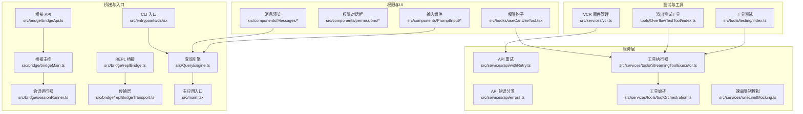
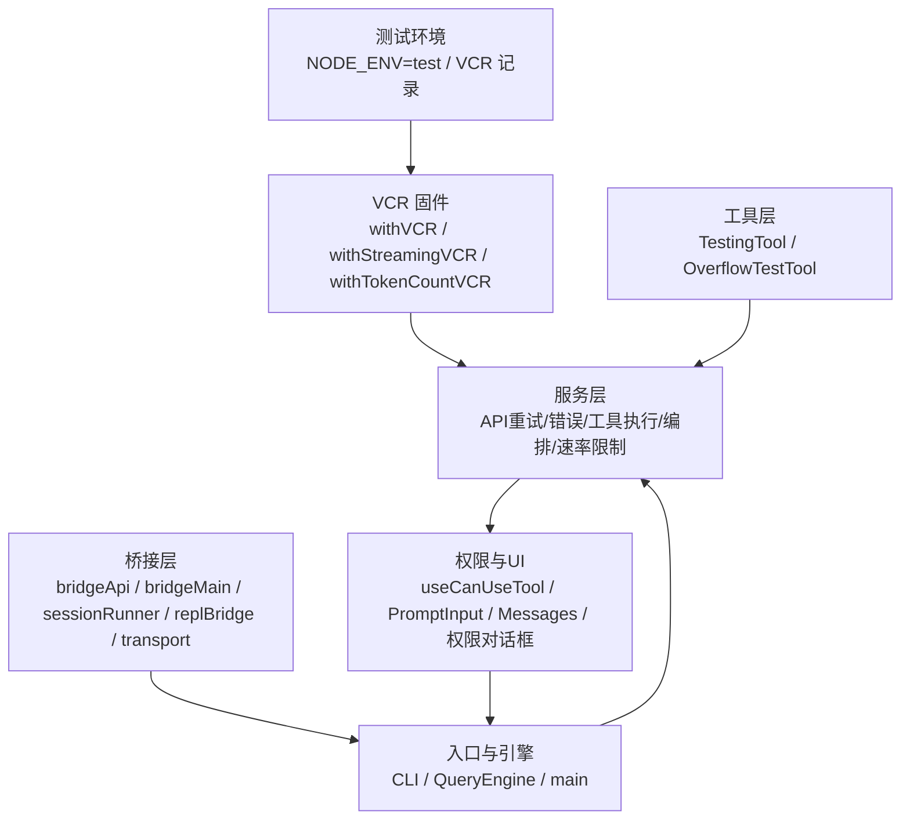
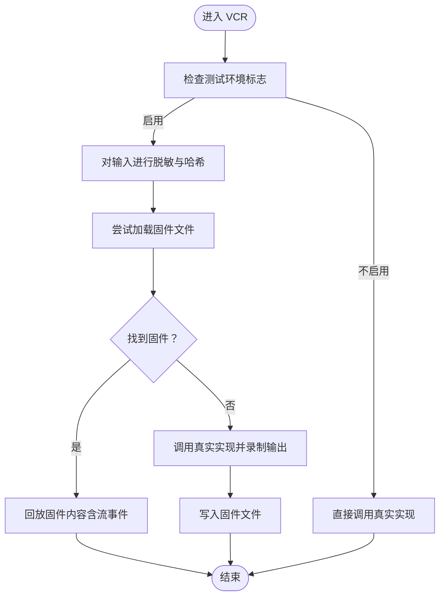
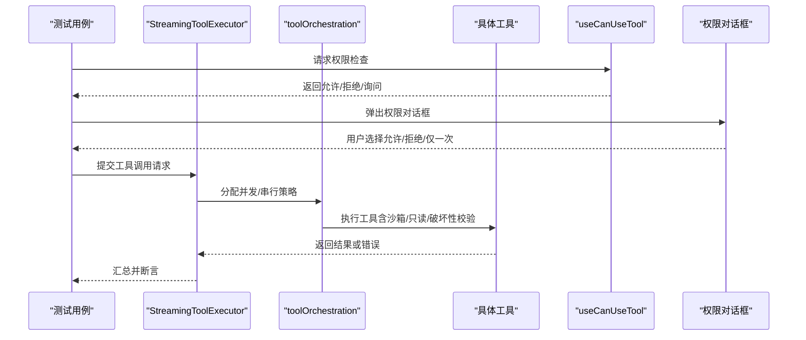
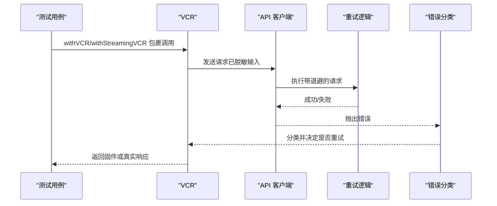
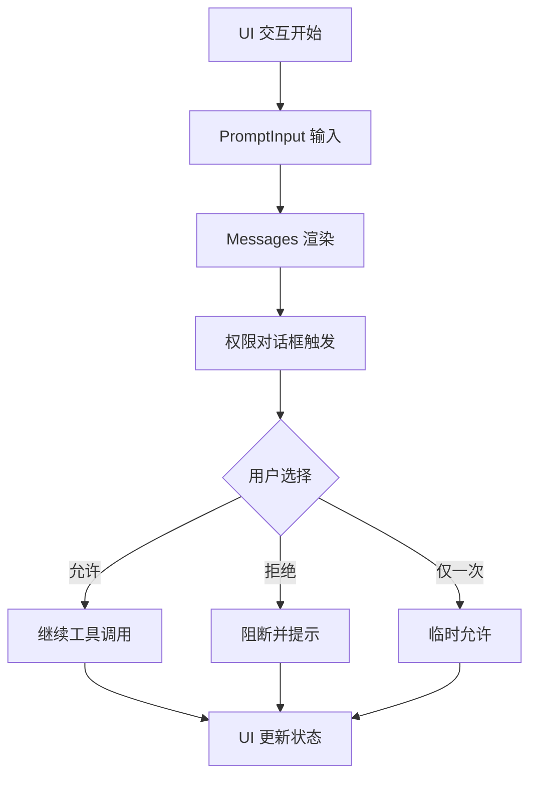
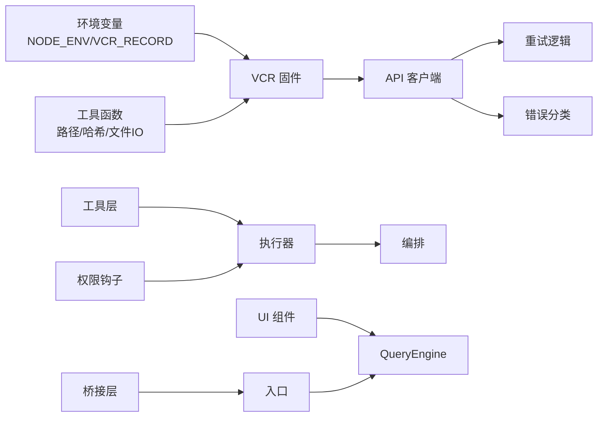

# 测试策略

<cite>
**本文引用的文件**
- [README.md](file://README.md)
- [package.json](file://package.json)
- [src/services/vcr.ts](file://src/services/vcr.ts)
- [src/commands/init-verifiers.ts](file://src/commands/init-verifiers.ts)
- [src/tools/testing/index.ts](file://src/tools/testing/index.ts)
- [tools/OverflowTestTool/index.ts](file://tools/OverflowTestTool/index.ts)
- [src/services/mockRateLimits.ts](file://src/services/mockRateLimits.ts)
- [src/services/rateLimitMocking.ts](file://src/services/rateLimitMocking.ts)
- [src/services/api/withRetry.ts](file://src/services/api/withRetry.ts)
- [src/services/api/errors.ts](file://src/services/api/errors.ts)
- [src/services/tools/StreamingToolExecutor.ts](file://src/services/tools/StreamingToolExecutor.ts)
- [src/services/tools/toolOrchestration.ts](file://src/services/tools/toolOrchestration.ts)
- [src/hooks/useCanUseTool.tsx](file://src/hooks/useCanUseTool.tsx)
- [src/utils/permissions/index.ts](file://src/utils/permissions/index.ts)
- [src/components/permissions/ApproveApiKey.tsx](file://src/components/permissions/ApproveApiKey.tsx)
- [src/components/permissions/BypassPermissionsModeDialog.tsx](file://src/components/permissions/BypassPermissionsModeDialog.tsx)
- [src/components/PromptInput/index.tsx](file://src/components/PromptInput/index.tsx)
- [src/components/Messages/index.tsx](file://src/components/Messages/index.tsx)
- [src/components/FeedbackSurvey/index.tsx](file://src/components/FeedbackSurvey/index.tsx)
- [src/bridge/bridgeApi.ts](file://src/bridge/bridgeApi.ts)
- [src/bridge/bridgeMain.ts](file://src/bridge/bridgeMain.ts)
- [src/bridge/sessionRunner.ts](file://src/bridge/sessionRunner.ts)
- [src/bridge/replBridge.ts](file://src/bridge/replBridge.ts)
- [src/bridge/replBridgeTransport.ts](file://src/bridge/replBridgeTransport.ts)
- [src/bridge/types.ts](file://src/bridge/types.ts)
- [src/entrypoints/cli.tsx](file://src/entrypoints/cli.tsx)
- [src/QueryEngine.ts](file://src/QueryEngine.ts)
- [src/query.ts](file://src/query.ts)
- [src/main.tsx](file://src/main.tsx)
- [src/tasks.ts](file://src/tasks.ts)
- [src/tools.ts](file://src/tools.ts)
- [src/commands.ts](file://src/commands.ts)
- [src/context.ts](file://src/context.ts)
- [src/state/AppStateStore.ts](file://src/state/AppStateStore.ts)
- [src/state/AppState.tsx](file://src/state/AppState.tsx)
- [src/utils/messages.ts](file://src/utils/messages.ts)
- [src/utils/cwd.ts](file://src/utils/cwd.ts)
- [src/utils/env.ts](file://src/utils/env.ts)
- [src/utils/envUtils.ts](file://src/utils/envUtils.ts)
- [src/utils/errors.ts](file://src/utils/errors.ts)
- [src/utils/modelCost.ts](file://src/utils/modelCost.ts)
- [src/cost-tracker.ts](file://src/cost-tracker.ts)
- [src/utils/slowOperations.ts](file://src/utils/slowOperations.ts)
- [src/utils/jsonParse.ts](file://src/utils/jsonParse.ts)
- [src/utils/jsonStringify.ts](file://src/utils/jsonStringify.ts)
- [src/utils/getErrnoCode.ts](file://src/utils/getErrnoCode.ts)
- [src/utils/getClaudeConfigHomeDir.ts](file://src/utils/getClaudeConfigHomeDir.ts)
- [src/utils/getCwd.ts](file://src/utils/getCwd.ts)
- [src/utils/randomUUID.ts](file://src/utils/randomUUID.ts)
- [src/utils/createHash.ts](file://src/utils/createHash.ts)
- [src/utils/mkdir.ts](file://src/utils/mkdir.ts)
- [src/utils/readFile.ts](file://src/utils/readFile.ts)
- [src/utils/writeFile.ts](file://src/utils/writeFile.ts)
- [src/utils/join.ts](file://src/utils/join.ts)
- [src/utils/dirname.ts](file://src/utils/dirname.ts)
- [src/utils/platform.ts](file://src/utils/platform.ts)
- [src/utils/path.ts](file://src/utils/path.ts)
- [src/utils/uuid.ts](file://src/utils/uuid.ts)
- [src/utils/hash.ts](file://src/utils/hash.ts)
- [src/utils/date.ts](file://src/utils/date.ts)
- [src/utils/number.ts](file://src/utils/number.ts)
- [src/utils/string.ts](file://src/utils/string.ts)
- [src/utils/array.ts](file://src/utils/array.ts)
- [src/utils/object.ts](file://src/utils/object.ts)
- [src/utils/function.ts](file://src/utils/function.ts)
- [src/utils/boolean.ts](file://src/utils/boolean.ts)
- [src/utils/nullish.ts](file://src/utils/nullish.ts)
- [src/utils/undefined.ts](file://src/utils/undefined.ts)
- [src/utils/regex.ts](file://src/utils/regex.ts)
- [src/utils/escape.ts](file://src/utils/escape.ts)
- [src/utils/format.ts](file://src/utils/format.ts)
- [src/utils/parse.ts](file://src/utils/parse.ts)
- [src/utils/validate.ts](file://src/utils/validate.ts)
- [src/utils/debounce.ts](file://src/utils/debounce.ts)
- [src/utils/throttle.ts](file://src/utils/throttle.ts)
- [src/utils/clone.ts](file://src/utils/clone.ts)
- [src/utils/deepEqual.ts](file://src/utils/deepEqual.ts)
- [src/utils/shallowEqual.ts](file://src/utils/shallowEqual.ts)
- [src/utils/isPlainObject.ts](file://src/utils/isPlainObject.ts)
- [src/utils/mapValues.ts](file://src/utils/mapValues.ts)
- [src/utils/lodash-es.ts](file://src/utils/lodash-es.ts)
- [src/utils/normalizeMessagesForAPI.ts](file://src/utils/normalizeMessagesForAPI.ts)
- [src/utils/jsonParse.ts](file://src/utils/jsonParse.ts)
- [src/utils/jsonStringify.ts](file://src/utils/jsonStringify.ts)
- [src/utils/getErrnoCode.ts](file://src/utils/getErrnoCode.ts)
- [src/utils/getClaudeConfigHomeDir.ts](file://src/utils/getClaudeConfigHomeDir.ts)
- [src/utils/getCwd.ts](file://src/utils/getCwd.ts)
- [src/utils/randomUUID.ts](file://src/utils/randomUUID.ts)
- [src/utils/createHash.ts](file://src/utils/createHash.ts)
- [src/utils/mkdir.ts](file://src/utils/mkdir.ts)
- [src/utils/readFile.ts](file://src/utils/readFile.ts)
- [src/utils/writeFile.ts](file://src/utils/writeFile.ts)
- [src/utils/join.ts](file://src/utils/join.ts)
- [src/utils/dirname.ts](file://src/utils/dirname.ts)
- [src/utils/platform.ts](file://src/utils/platform.ts)
- [src/utils/path.ts](file://src/utils/path.ts)
- [src/utils/uuid.ts](file://src/utils/uuid.ts)
- [src/utils/hash.ts](file://src/utils/hash.ts)
- [src/utils/date.ts](file://src/utils/date.ts)
- [src/utils/number.ts](file://src/utils/number.ts)
- [src/utils/string.ts](file://src/utils/string.ts)
- [src/utils/array.ts](file://src/utils/array.ts)
- [src/utils/object.ts](file://src/utils/object.ts)
- [src/utils/function.ts](file://src/utils/function.ts)
- [src/utils/boolean.ts](file://src/utils/boolean.ts)
- [src/utils/nullish.ts](file://src/utils/nullish.ts)
- [src/utils/undefined.ts](file://src/utils/undefined.ts)
- [src/utils/regex.ts](file://src/utils/regex.ts)
- [src/utils/escape.ts](file://src/utils/escape.ts)
- [src/utils/format.ts](file://src/utils/format.ts)
- [src/utils/parse.ts](file://src/utils/parse.ts)
- [src/utils/validate.ts](file://src/utils/validate.ts)
- [src/utils/debounce.ts](file://src/utils/debounce.ts)
- [src/utils/throttle.ts](file://src/utils/throttle.ts)
- [src/utils/clone.ts](file://src/utils/clone.ts)
- [src/utils/deepEqual.ts](file://src/utils/deepEqual.ts)
- [src/utils/shallowEqual.ts](file://src/utils/shallowEqual.ts)
- [src/utils/isPlainObject.ts](file://src/utils/isPlainObject.ts)
- [src/utils/mapValues.ts](file://src/utils/mapValues.ts)
- [src/utils/lodash-es.ts](file://src/utils/lodash-es.ts)
- [src/utils/normalizeMessagesForAPI.ts](file://src/utils/normalizeMessagesForAPI.ts)
</cite>

## 目录
1. [引言](#引言)
2. [项目结构](#项目结构)
3. [核心组件](#核心组件)
4. [架构总览](#架构总览)
5. [详细组件分析](#详细组件分析)
6. [依赖关系分析](#依赖关系分析)
7. [性能考量](#性能考量)
8. [故障排除指南](#故障排除指南)
9. [结论](#结论)
10. [附录](#附录)

## 引言
本文件面向 Claude Code 的测试策略，系统性阐述测试框架配置与测试环境搭建，覆盖单元测试、集成测试与端到端测试；深入说明工具测试策略（功能、权限、并发）、服务测试方法（API、异步、错误处理）、UI 测试策略（组件、交互、体验），以及测试数据管理与模拟策略；并提供测试最佳实践（用例设计、覆盖率要求、CI 配置）、性能与压力测试方法、自动化与 CI/CD 集成建议，最后给出调试与故障排除指南。文中所有技术细节均基于仓库内现有源码进行分析与映射。

## 项目结构
- 测试基础设施与策略主要由以下模块支撑：
  - 录放机（VCR）：用于录制/回放外部 API 响应与流式事件，确保测试稳定与可重复。
  - 工具测试：内置工具如 OverflowTestTool 等用于上下文溢出等边界条件验证。
  - 权限与 UI：useCanUseTool、权限对话框组件、PromptInput、Messages 等。
  - 服务层：API 客户端重试、错误分类、工具执行器与编排、速率限制模拟。
  - 桥接层：桌面桥接、会话管理、传输层，支持端到端场景。
  - 入口与引擎：CLI、QueryEngine、主应用入口，构成端到端生命周期。
  - 工具注册与命令：tools.ts、commands.ts，便于测试工具调用与命令行为。

图表来源
- [src/services/vcr.ts:1-407](file://src/services/vcr.ts#L1-L407)
- [src/tools/testing/index.ts](file://src/tools/testing/index.ts)
- [tools/OverflowTestTool/index.ts](file://tools/OverflowTestTool/index.ts)
- [src/services/api/withRetry.ts](file://src/services/api/withRetry.ts)
- [src/services/api/errors.ts](file://src/services/api/errors.ts)
- [src/services/tools/StreamingToolExecutor.ts](file://src/services/tools/StreamingToolExecutor.ts)
- [src/services/tools/toolOrchestration.ts](file://src/services/tools/toolOrchestration.ts)
- [src/hooks/useCanUseTool.tsx](file://src/hooks/useCanUseTool.tsx)
- [src/components/permissions/ApproveApiKey.tsx](file://src/components/permissions/ApproveApiKey.tsx)
- [src/components/permissions/BypassPermissionsModeDialog.tsx](file://src/components/permissions/BypassPermissionsModeDialog.tsx)
- [src/components/PromptInput/index.tsx](file://src/components/PromptInput/index.tsx)
- [src/components/Messages/index.tsx](file://src/components/Messages/index.tsx)
- [src/bridge/bridgeApi.ts](file://src/bridge/bridgeApi.ts)
- [src/bridge/bridgeMain.ts](file://src/bridge/bridgeMain.ts)
- [src/bridge/sessionRunner.ts](file://src/bridge/sessionRunner.ts)
- [src/bridge/replBridge.ts](file://src/bridge/replBridge.ts)
- [src/bridge/replBridgeTransport.ts](file://src/bridge/replBridgeTransport.ts)
- [src/entrypoints/cli.tsx](file://src/entrypoints/cli.tsx)
- [src/QueryEngine.ts](file://src/QueryEngine.ts)
- [src/main.tsx](file://src/main.tsx)

章节来源
- [README.md:250-380](file://README.md#L250-L380)
- [package.json:1-21](file://package.json#L1-L21)

## 核心组件
- VCR 固件管理：在测试环境下自动启用，负责消息脱敏与序列化、固件缓存读写、CI 下缺失固件的报错提示、流式响应的录制与回放、令牌计数的固定化。
- 工具测试与溢出测试：通过工具测试入口与 OverflowTestTool 验证工具边界、上下文溢出、并发安全等。
- 权限与 UI：useCanUseTool 提供权限检查钩子，权限对话框组件承载交互与审批流程；PromptInput 与 Messages 组件承载输入与输出渲染，是 UI 测试重点。
- 服务层：API 重试与错误分类保障网络稳定性；工具执行器与编排负责并发与串行工具调度；速率限制模拟用于隔离外部依赖。
- 桥接层：桥接 API、主控、会话运行器与 REPL 传输层共同构成端到端桥接场景。
- 入口与引擎：CLI、QueryEngine、主应用入口串联起从命令到消息循环的完整生命周期。

章节来源
- [src/services/vcr.ts:23-86](file://src/services/vcr.ts#L23-L86)
- [src/tools/testing/index.ts](file://src/tools/testing/index.ts)
- [tools/OverflowTestTool/index.ts](file://tools/OverflowTestTool/index.ts)
- [src/hooks/useCanUseTool.tsx](file://src/hooks/useCanUseTool.tsx)
- [src/components/PromptInput/index.tsx](file://src/components/PromptInput/index.tsx)
- [src/components/Messages/index.tsx](file://src/components/Messages/index.tsx)
- [src/services/api/withRetry.ts](file://src/services/api/withRetry.ts)
- [src/services/api/errors.ts](file://src/services/api/errors.ts)
- [src/services/tools/StreamingToolExecutor.ts](file://src/services/tools/StreamingToolExecutor.ts)
- [src/services/tools/toolOrchestration.ts](file://src/services/tools/toolOrchestration.ts)
- [src/bridge/bridgeApi.ts](file://src/bridge/bridgeApi.ts)
- [src/bridge/bridgeMain.ts](file://src/bridge/bridgeMain.ts)
- [src/bridge/sessionRunner.ts](file://src/bridge/sessionRunner.ts)
- [src/bridge/replBridge.ts](file://src/bridge/replBridge.ts)
- [src/bridge/replBridgeTransport.ts](file://src/bridge/replBridgeTransport.ts)
- [src/entrypoints/cli.tsx](file://src/entrypoints/cli.tsx)
- [src/QueryEngine.ts](file://src/QueryEngine.ts)
- [src/main.tsx](file://src/main.tsx)

## 架构总览
下图展示了测试策略在系统中的位置与交互：VCR 作为外部依赖的稳定层，工具与服务层承担功能与并发验证，权限与 UI 层验证授权与交互，桥接与入口层完成端到端场景闭环。

图表来源
- [src/services/vcr.ts:23-161](file://src/services/vcr.ts#L23-L161)
- [src/tools/testing/index.ts](file://src/tools/testing/index.ts)
- [tools/OverflowTestTool/index.ts](file://tools/OverflowTestTool/index.ts)
- [src/services/api/withRetry.ts](file://src/services/api/withRetry.ts)
- [src/services/api/errors.ts](file://src/services/api/errors.ts)
- [src/services/tools/StreamingToolExecutor.ts](file://src/services/tools/StreamingToolExecutor.ts)
- [src/services/tools/toolOrchestration.ts](file://src/services/tools/toolOrchestration.ts)
- [src/hooks/useCanUseTool.tsx](file://src/hooks/useCanUseTool.tsx)
- [src/components/PromptInput/index.tsx](file://src/components/PromptInput/index.tsx)
- [src/components/Messages/index.tsx](file://src/components/Messages/index.tsx)
- [src/bridge/bridgeApi.ts](file://src/bridge/bridgeApi.ts)
- [src/bridge/bridgeMain.ts](file://src/bridge/bridgeMain.ts)
- [src/bridge/sessionRunner.ts](file://src/bridge/sessionRunner.ts)
- [src/bridge/replBridge.ts](file://src/bridge/replBridge.ts)
- [src/bridge/replBridgeTransport.ts](file://src/bridge/replBridgeTransport.ts)
- [src/entrypoints/cli.tsx](file://src/entrypoints/cli.tsx)
- [src/QueryEngine.ts](file://src/QueryEngine.ts)
- [src/main.tsx](file://src/main.tsx)

## 详细组件分析

### VCR 固件与测试数据管理
- 自动启用：当 NODE_ENV 为 test 或特定用户类型满足条件时启用 VCR。
- 固件缓存：根据输入哈希生成文件名，支持缓存命中、缺失时录制、CI 下强制要求显式记录。
- 消息脱敏：对路径、时间戳、UUID、统计字段等进行占位替换，保证跨平台与跨运行环境一致性。
- 流式回放：withStreamingVCR 将录制的流事件按顺序产出，支持断点续跑。
- 令牌计数固定化：withTokenCountVCR 对消息与工具参数进行脱敏后哈希，确保 CI 稳定命中。

图表来源
- [src/services/vcr.ts:23-161](file://src/services/vcr.ts#L23-L161)
- [src/services/vcr.ts:382-406](file://src/services/vcr.ts#L382-L406)

章节来源
- [src/services/vcr.ts:23-86](file://src/services/vcr.ts#L23-L86)
- [src/services/vcr.ts:88-161](file://src/services/vcr.ts#L88-L161)
- [src/services/vcr.ts:349-380](file://src/services/vcr.ts#L349-L380)
- [src/services/vcr.ts:382-406](file://src/services/vcr.ts#L382-L406)

### 工具测试策略（功能/权限/并发）
- 功能测试：通过 TestingTool 与 OverflowTestTool 验证工具输入校验、副作用控制、资源访问与上下文溢出场景。
- 权限测试：useCanUseTool 与权限对话框组件配合，覆盖“始终允许/仅一次/拒绝”三种决策路径，并验证路径沙箱与只读/破坏性标记。
- 并发测试：StreamingToolExecutor 与 toolOrchestration 负责并发安全与串行约束，测试需覆盖工具分组、取消与阻塞行为。

图表来源
- [src/services/tools/StreamingToolExecutor.ts](file://src/services/tools/StreamingToolExecutor.ts)
- [src/services/tools/toolOrchestration.ts](file://src/services/tools/toolOrchestration.ts)
- [src/hooks/useCanUseTool.tsx](file://src/hooks/useCanUseTool.tsx)
- [src/components/permissions/ApproveApiKey.tsx](file://src/components/permissions/ApproveApiKey.tsx)
- [src/components/permissions/BypassPermissionsModeDialog.tsx](file://src/components/permissions/BypassPermissionsModeDialog.tsx)

章节来源
- [src/tools/testing/index.ts](file://src/tools/testing/index.ts)
- [tools/OverflowTestTool/index.ts](file://tools/OverflowTestTool/index.ts)
- [src/services/tools/StreamingToolExecutor.ts](file://src/services/tools/StreamingToolExecutor.ts)
- [src/services/tools/toolOrchestration.ts](file://src/services/tools/toolOrchestration.ts)
- [src/hooks/useCanUseTool.tsx](file://src/hooks/useCanUseTool.tsx)
- [src/components/permissions/ApproveApiKey.tsx](file://src/components/permissions/ApproveApiKey.tsx)
- [src/components/permissions/BypassPermissionsModeDialog.tsx](file://src/components/permissions/BypassPermissionsModeDialog.tsx)

### 服务测试方法（API/异步/错误处理）
- API 测试：结合 VCR 与 withRetry，验证请求构建、重试策略、超时与退避、错误分类与恢复。
- 异步操作测试：withStreamingVCR 验证流式事件的顺序、完整性与断点续播。
- 错误处理测试：errors.ts 提供错误分类，结合 withRetry 与 VCR，覆盖网络异常、速率限制、系统错误等分支。

图表来源
- [src/services/vcr.ts:88-161](file://src/services/vcr.ts#L88-L161)
- [src/services/api/withRetry.ts](file://src/services/api/withRetry.ts)
- [src/services/api/errors.ts](file://src/services/api/errors.ts)

章节来源
- [src/services/vcr.ts:88-161](file://src/services/vcr.ts#L88-L161)
- [src/services/api/withRetry.ts](file://src/services/api/withRetry.ts)
- [src/services/api/errors.ts](file://src/services/api/errors.ts)

### UI 测试策略（组件/交互/体验）
- 组件测试：针对 PromptInput、Messages、权限对话框等组件进行快照与行为测试，覆盖输入渲染、消息列表、权限弹窗交互。
- 交互测试：模拟用户输入、快捷键、权限审批流程，验证状态变更与回调。
- 用户体验测试：关注首屏渲染、消息滚动、加载指示、错误提示与可访问性。

图表来源
- [src/components/PromptInput/index.tsx](file://src/components/PromptInput/index.tsx)
- [src/components/Messages/index.tsx](file://src/components/Messages/index.tsx)
- [src/components/permissions/ApproveApiKey.tsx](file://src/components/permissions/ApproveApiKey.tsx)
- [src/components/permissions/BypassPermissionsModeDialog.tsx](file://src/components/permissions/BypassPermissionsModeDialog.tsx)

章节来源
- [src/components/PromptInput/index.tsx](file://src/components/PromptInput/index.tsx)
- [src/components/Messages/index.tsx](file://src/components/Messages/index.tsx)
- [src/components/permissions/ApproveApiKey.tsx](file://src/components/permissions/ApproveApiKey.tsx)
- [src/components/permissions/BypassPermissionsModeDialog.tsx](file://src/components/permissions/BypassPermissionsModeDialog.tsx)

### 测试数据生成与外部依赖模拟
- 固件生成：VCR 在未命中时录制真实响应，确保后续测试稳定复现。
- 外部依赖模拟：通过 rateLimitMocking 与 mockRateLimits 控制速率限制行为，隔离外部 API。
- 路径与时间戳脱敏：统一替换 CWD、配置目录、UUID、时间戳等，保证跨平台一致性。

章节来源
- [src/services/vcr.ts:382-406](file://src/services/vcr.ts#L382-L406)
- [src/services/rateLimitMocking.ts](file://src/services/rateLimitMocking.ts)
- [src/services/mockRateLimits.ts](file://src/services/mockRateLimits.ts)

### 性能测试与压力测试
- 上下文溢出测试：OverflowTestTool 用于验证大消息与多工具调用下的稳定性与内存占用。
- 并发压力：StreamingToolExecutor 与 toolOrchestration 的并发分组与串行约束测试，验证高负载下的吞吐与延迟。
- 速率限制：结合 mockRateLimits 与 rateLimitMocking，模拟不同阈值下的退避与节流行为。

章节来源
- [tools/OverflowTestTool/index.ts](file://tools/OverflowTestTool/index.ts)
- [src/services/tools/StreamingToolExecutor.ts](file://src/services/tools/StreamingToolExecutor.ts)
- [src/services/tools/toolOrchestration.ts](file://src/services/tools/toolOrchestration.ts)
- [src/services/rateLimitMocking.ts](file://src/services/rateLimitMocking.ts)
- [src/services/mockRateLimits.ts](file://src/services/mockRateLimits.ts)

### 自动化与 CI/CD 集成
- 启用条件：NODE_ENV=test 或特定用户类型满足 FORCE_VCR 时启用 VCR。
- CI 行为：在 CI 环境且未设置 VCR_RECORD 时，缺失固件将直接报错，要求显式录制并提交。
- 建议配置：在 CI 中设置 CLAUDE_CODE_TEST_FIXTURES_ROOT 指向持久化缓存目录，以提升命中率并减少网络依赖。

章节来源
- [src/services/vcr.ts:23-33](file://src/services/vcr.ts#L23-L33)
- [src/services/vcr.ts:71-75](file://src/services/vcr.ts#L71-L75)
- [src/services/vcr.ts:133-137](file://src/services/vcr.ts#L133-L137)

## 依赖关系分析
- VCR 依赖于环境变量与工具函数（路径、哈希、文件 IO），并与 API 层协作。
- 工具层依赖服务层的执行器与编排，受权限钩子与 UI 对话框影响。
- 桥接层与入口层为端到端测试提供真实会话与消息循环。

图表来源
- [src/services/vcr.ts:1-22](file://src/services/vcr.ts#L1-L22)
- [src/services/api/withRetry.ts](file://src/services/api/withRetry.ts)
- [src/services/api/errors.ts](file://src/services/api/errors.ts)
- [src/services/tools/StreamingToolExecutor.ts](file://src/services/tools/StreamingToolExecutor.ts)
- [src/services/tools/toolOrchestration.ts](file://src/services/tools/toolOrchestration.ts)
- [src/hooks/useCanUseTool.tsx](file://src/hooks/useCanUseTool.tsx)
- [src/QueryEngine.ts](file://src/QueryEngine.ts)
- [src/bridge/bridgeApi.ts](file://src/bridge/bridgeApi.ts)
- [src/entrypoints/cli.tsx](file://src/entrypoints/cli.tsx)

章节来源
- [src/services/vcr.ts:1-22](file://src/services/vcr.ts#L1-L22)
- [src/services/api/withRetry.ts](file://src/services/api/withRetry.ts)
- [src/services/api/errors.ts](file://src/services/api/errors.ts)
- [src/services/tools/StreamingToolExecutor.ts](file://src/services/tools/StreamingToolExecutor.ts)
- [src/services/tools/toolOrchestration.ts](file://src/services/tools/toolOrchestration.ts)
- [src/hooks/useCanUseTool.tsx](file://src/hooks/useCanUseTool.tsx)
- [src/QueryEngine.ts](file://src/QueryEngine.ts)
- [src/bridge/bridgeApi.ts](file://src/bridge/bridgeApi.ts)
- [src/entrypoints/cli.tsx](file://src/entrypoints/cli.tsx)

## 性能考量
- 固件命中率：通过稳定的脱敏策略与持久化缓存目录，降低网络依赖与测试波动。
- 并发与串行：合理划分工具分组，避免阻塞关键路径；对只读与破坏性工具进行明确标注，减少不必要的串行。
- 速率限制：在测试中模拟不同阈值，评估退避与节流策略对吞吐的影响。
- 上下文压缩：结合 compact 边界与摘要机制，减少消息体积，提高长会话稳定性。

## 故障排除指南
- 固件缺失：在 CI 中未设置 VCR_RECORD 时，缺失固件会报错。解决方法：本地开启 VCR_RECORD=1 录制并提交固件。
- 权限问题：若权限被拒绝或需要临时允许，检查 useCanUseTool 的规则与 UI 对话框的用户选择。
- 流式回放异常：确认 withStreamingVCR 的录制与回放顺序一致，必要时清理固件重新录制。
- 路径与时间戳不一致：确保脱敏策略覆盖 CWD、配置目录、UUID、时间戳等字段。

章节来源
- [src/services/vcr.ts:71-75](file://src/services/vcr.ts#L71-L75)
- [src/services/vcr.ts:133-137](file://src/services/vcr.ts#L133-L137)
- [src/hooks/useCanUseTool.tsx](file://src/hooks/useCanUseTool.tsx)
- [src/services/vcr.ts:349-380](file://src/services/vcr.ts#L349-L380)

## 结论
本测试策略以 VCR 为核心稳定层，结合工具、服务、权限与 UI 的多维度测试，覆盖功能、权限、并发、API、异步、错误处理、性能与端到端场景。通过固件化与模拟策略，显著提升测试稳定性与可重复性；通过 CI 强制录制与报错机制，确保外部依赖的可控性。建议在团队内推广该策略，并结合覆盖率与回归测试，持续完善测试矩阵。

## 附录
- 测试脚本与命令：当前仓库未提供独立测试脚本，建议在 CI 中通过环境变量控制 VCR 行为，并在本地使用 VCR_RECORD=1 生成固件。
- 文档与工具索引：参考 README 中关于工具清单与特性门控的说明，结合本策略中的组件映射，定位具体测试入口。

章节来源
- [README.md:138-158](file://README.md#L138-L158)
- [package.json:7-11](file://package.json#L7-L11)