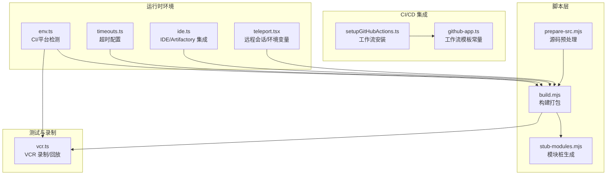
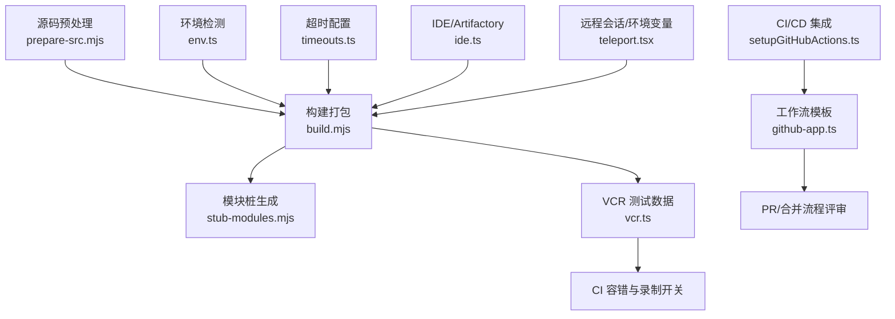
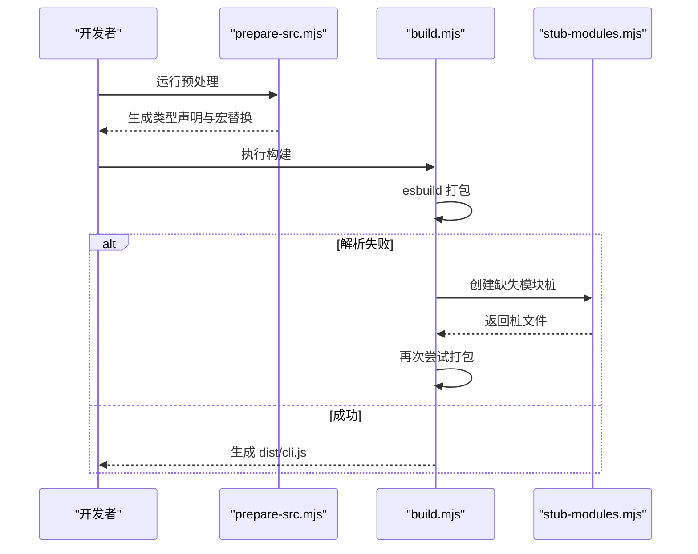
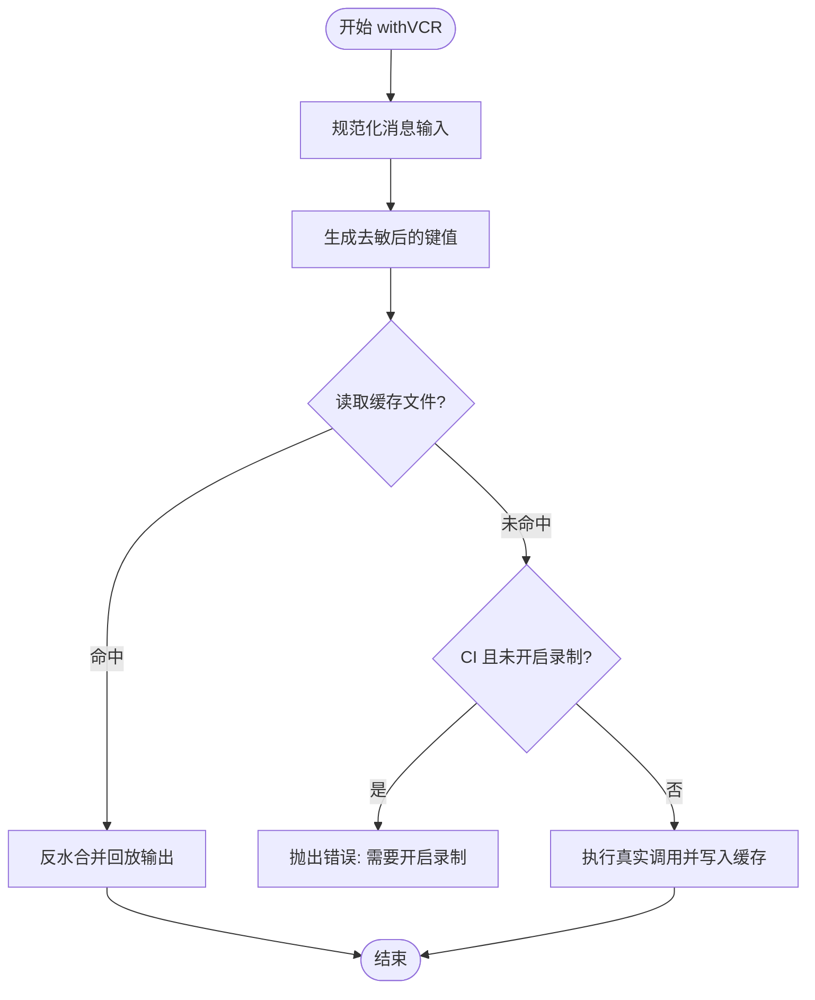
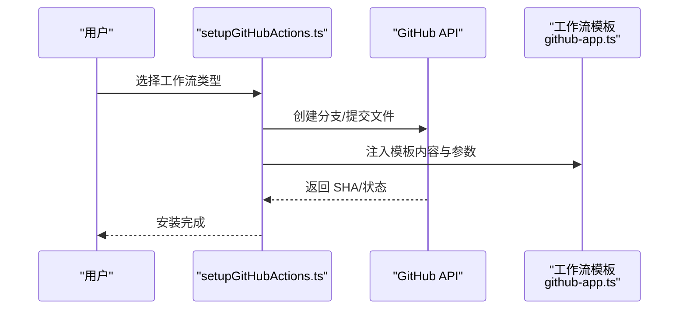
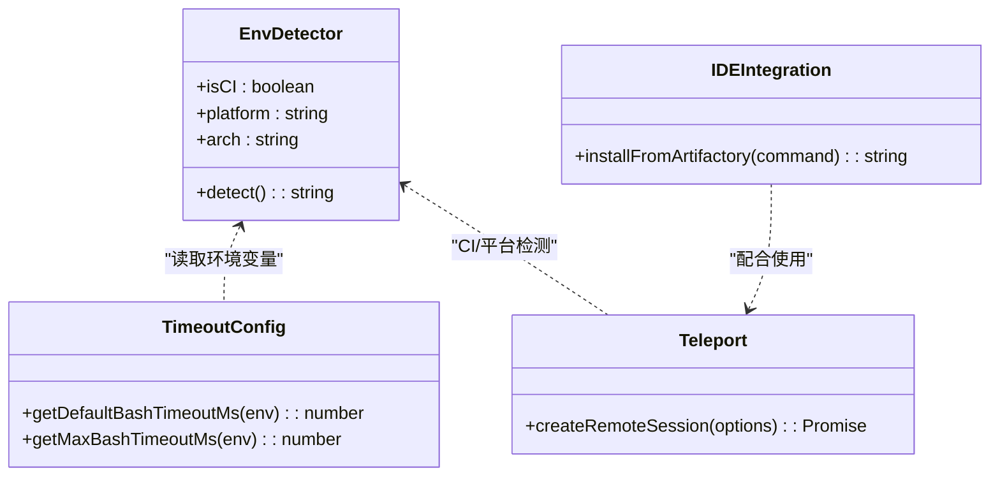
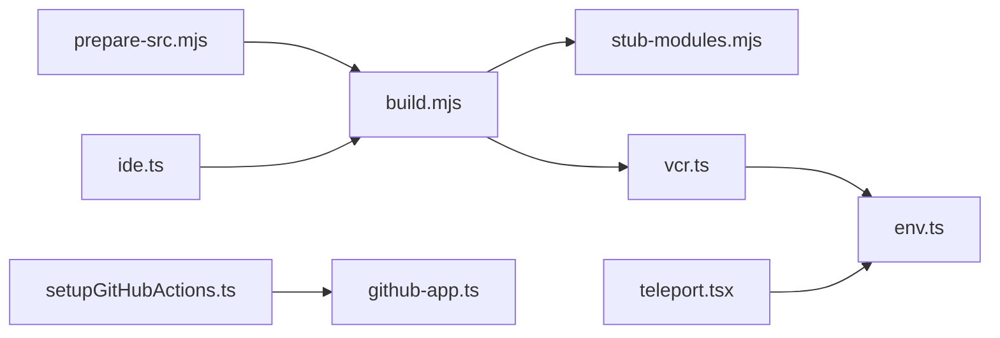

# 测试自动化

<cite>
**本文引用的文件**
- [package.json](file://package.json)
- [scripts/build.mjs](file://scripts/build.mjs)
- [scripts/prepare-src.mjs](file://scripts/prepare-src.mjs)
- [scripts/stub-modules.mjs](file://scripts/stub-modules.mjs)
- [src/services/vcr.ts](file://src/services/vcr.ts)
- [src/utils/env.ts](file://src/utils/env.ts)
- [src/utils/timeouts.ts](file://src/utils/timeouts.ts)
- [src/commands/install-github-app/setupGitHubActions.ts](file://src/commands/install-github-app/setupGitHubActions.ts)
- [src/constants/github-app.ts](file://src/constants/github-app.ts)
- [src/utils/ide.ts](file://src/utils/ide.ts)
- [src/utils/teleport.tsx](file://src/utils/teleport.tsx)
- [src/commands/init-verifiers.ts](file://src/commands/init-verifiers.ts)
</cite>

## 目录
1. [引言](#引言)
2. [项目结构](#项目结构)
3. [核心组件](#核心组件)
4. [架构总览](#架构总览)
5. [详细组件分析](#详细组件分析)
6. [依赖分析](#依赖分析)
7. [性能考量](#性能考量)
8. [故障排查指南](#故障排查指南)
9. [结论](#结论)
10. [附录](#附录)

## 引言
本文件面向 Claude Code 的测试自动化体系，系统性阐述测试自动化架构设计与实施策略，覆盖以下主题：
- CI/CD 集成：通过 GitHub Actions 工作流与 Claude Code GitHub App 集成，实现自动化评审与辅助。
- 自动化测试流水线：基于构建脚本、测试执行脚本与部署脚本的协同，确保可重复与可追溯。
- 测试数据自动化管理：利用 VCR（录像回放）机制进行测试数据生成、缓存与回放，保障跨环境一致性。
- 测试报告与度量：结合 CI 环境识别与超时配置，支撑测试结果可视化与性能指标采集。
- 测试环境自动化配置：容器化与外部服务模拟能力，以及测试数据库管理策略。
- 故障自动恢复与失败处理：通过 VCR 记录开关、CI 容错与超时参数化，提升稳定性。
- 监控与维护：基于环境检测与日志输出的可观测性实践。

## 项目结构
本仓库围绕“源码预处理 → 构建打包 → 测试执行 → 结果上报”的流水线组织测试相关脚本与工具。关键路径如下：
- 脚本层：scripts/prepare-src.mjs、scripts/build.mjs、scripts/stub-modules.mjs
- 测试数据与录制：src/services/vcr.ts
- CI/CD 集成：src/commands/install-github-app/setupGitHubActions.ts、src/constants/github-app.ts
- 环境与超时：src/utils/env.ts、src/utils/timeouts.ts
- 外部服务与 IDE：src/utils/ide.ts、src/utils/teleport.tsx
- 验证器引导：src/commands/init-verifiers.ts

**图表来源**
- [scripts/prepare-src.mjs:1-116](file://scripts/prepare-src.mjs#L1-L116)
- [scripts/build.mjs:1-246](file://scripts/build.mjs#L1-L246)
- [scripts/stub-modules.mjs:67-139](file://scripts/stub-modules.mjs#L67-L139)
- [src/services/vcr.ts:38-406](file://src/services/vcr.ts#L38-L406)
- [src/commands/install-github-app/setupGitHubActions.ts:1-240](file://src/commands/install-github-app/setupGitHubActions.ts#L1-L240)
- [src/constants/github-app.ts:37-73](file://src/constants/github-app.ts#L37-L73)
- [src/utils/env.ts:279-322](file://src/utils/env.ts#L279-L322)
- [src/utils/timeouts.ts:1-39](file://src/utils/timeouts.ts#L1-L39)
- [src/utils/ide.ts:1366-1450](file://src/utils/ide.ts#L1366-L1450)
- [src/utils/teleport.tsx:863-898](file://src/utils/teleport.tsx#L863-L898)

**章节来源**
- [package.json:1-21](file://package.json#L1-L21)
- [scripts/prepare-src.mjs:1-116](file://scripts/prepare-src.mjs#L1-L116)
- [scripts/build.mjs:1-246](file://scripts/build.mjs#L1-L246)
- [scripts/stub-modules.mjs:67-139](file://scripts/stub-modules.mjs#L67-L139)
- [src/services/vcr.ts:38-406](file://src/services/vcr.ts#L38-L406)
- [src/commands/install-github-app/setupGitHubActions.ts:1-240](file://src/commands/install-github-app/setupGitHubActions.ts#L1-L240)
- [src/constants/github-app.ts:37-73](file://src/constants/github-app.ts#L37-L73)
- [src/utils/env.ts:279-322](file://src/utils/env.ts#L279-L322)
- [src/utils/timeouts.ts:1-39](file://src/utils/timeouts.ts#L1-L39)
- [src/utils/ide.ts:1366-1450](file://src/utils/ide.ts#L1366-L1450)
- [src/utils/teleport.tsx:863-898](file://src/utils/teleport.tsx#L863-L898)

## 核心组件
- 源码预处理与宏替换：prepare-src.mjs 将 Bun 特定的 import 与 MACRO 宏替换为可在 Node 环境运行的等价物，并生成类型声明桩，确保后续构建稳定。
- 构建与打包：build.mjs 在预处理基础上，迭代地创建缺失模块桩并使用 esbuild 打包，支持多轮容错与错误定位。
- 测试数据录制与回放：vcr.ts 提供 withVCR、withFixture、withTokenCountVCR 等能力，按输入哈希缓存外部调用结果，CI 下强制要求显式开启录制以保证数据一致性。
- CI/CD 集成：setupGitHubActions.ts 与 github-app.ts 提供一键安装 Claude Code GitHub App 及工作流模板，便于在 PR/合并流程中启用代码评审与辅助。
- 运行时环境与超时：env.ts 识别 CI 平台与容器环境；timeouts.ts 提供 Bash 操作默认与最大超时配置，便于长任务场景下的稳定性控制。
- 外部服务与 IDE：ide.ts 支持从 Artifactory 下载 VSIX 并安装；teleport.tsx 提供远程会话创建与环境变量注入，便于测试环境隔离与复现。
- 验证器引导：init-verifiers.ts 基于项目类型与现有工具，引导用户选择合适的端到端验证方案（如 Playwright、Chrome DevTools MCP 等）。

**章节来源**
- [scripts/prepare-src.mjs:36-77](file://scripts/prepare-src.mjs#L36-L77)
- [scripts/build.mjs:144-230](file://scripts/build.mjs#L144-L230)
- [src/services/vcr.ts:38-406](file://src/services/vcr.ts#L38-L406)
- [src/commands/install-github-app/setupGitHubActions.ts:17-240](file://src/commands/install-github-app/setupGitHubActions.ts#L17-L240)
- [src/constants/github-app.ts:37-73](file://src/constants/github-app.ts#L37-L73)
- [src/utils/env.ts:279-322](file://src/utils/env.ts#L279-L322)
- [src/utils/timeouts.ts:12-39](file://src/utils/timeouts.ts#L12-L39)
- [src/utils/ide.ts:1392-1450](file://src/utils/ide.ts#L1392-L1450)
- [src/utils/teleport.tsx:863-898](file://src/utils/teleport.tsx#L863-L898)
- [src/commands/init-verifiers.ts:26-80](file://src/commands/init-verifiers.ts#L26-L80)

## 架构总览
下图展示测试自动化在本仓库中的整体架构：从源码预处理与构建开始，到 VCR 数据录制与回放，再到 CI 工作流与外部服务集成，最终形成可重复、可审计的测试闭环。

**图表来源**
- [scripts/prepare-src.mjs:1-116](file://scripts/prepare-src.mjs#L1-L116)
- [scripts/build.mjs:1-246](file://scripts/build.mjs#L1-L246)
- [scripts/stub-modules.mjs:67-139](file://scripts/stub-modules.mjs#L67-L139)
- [src/services/vcr.ts:38-406](file://src/services/vcr.ts#L38-L406)
- [src/commands/install-github-app/setupGitHubActions.ts:1-240](file://src/commands/install-github-app/setupGitHubActions.ts#L1-L240)
- [src/constants/github-app.ts:37-73](file://src/constants/github-app.ts#L37-L73)
- [src/utils/env.ts:279-322](file://src/utils/env.ts#L279-L322)
- [src/utils/timeouts.ts:1-39](file://src/utils/timeouts.ts#L1-L39)
- [src/utils/ide.ts:1366-1450](file://src/utils/ide.ts#L1366-L1450)
- [src/utils/teleport.tsx:863-898](file://src/utils/teleport.tsx#L863-L898)

## 详细组件分析

### 组件一：构建与打包流水线（prepare-src.mjs → build.mjs → stub-modules.mjs）
- 预处理阶段：将 Bun 特定的 import 与 MACRO 宏替换为 Node 可运行版本，生成全局类型声明桩，减少构建期依赖缺失。
- 构建阶段：使用 esbuild 进行打包，若出现“无法解析的模块”，则进入“模块桩生成”循环，最多五轮，逐步补齐缺失模块，直至成功或报错。
- 输出：生成 dist/cli.js，附带 sourcemap，便于调试与追踪。

**图表来源**
- [scripts/prepare-src.mjs:36-77](file://scripts/prepare-src.mjs#L36-L77)
- [scripts/build.mjs:144-230](file://scripts/build.mjs#L144-L230)
- [scripts/stub-modules.mjs:67-139](file://scripts/stub-modules.mjs#L67-L139)

**章节来源**
- [scripts/prepare-src.mjs:1-116](file://scripts/prepare-src.mjs#L1-L116)
- [scripts/build.mjs:144-230](file://scripts/build.mjs#L144-L230)
- [scripts/stub-modules.mjs:67-139](file://scripts/stub-modules.mjs#L67-L139)

### 组件二：测试数据录制与回放（VCR）
- 功能要点：
  - withFixture：按输入哈希生成固定文件名，优先读取缓存；在 CI 且未开启录制时抛出明确错误，提示补录。
  - withVCR：对消息内容脱敏与归一化后生成键值，命中缓存则直接回放并累加成本统计。
  - withTokenCountVCR：对工作目录、UUID、时间戳等不稳定因素进行脱敏，确保跨环境命中率。
- CI 行为：当 CI 环境检测到未设置录制开关时，拒绝回放缺失的 fixture，强制显式记录新数据。

**图表来源**
- [src/services/vcr.ts:88-134](file://src/services/vcr.ts#L88-L134)
- [src/services/vcr.ts:38-86](file://src/services/vcr.ts#L38-L86)

**章节来源**
- [src/services/vcr.ts:38-406](file://src/services/vcr.ts#L38-L406)
- [src/utils/env.ts:279-322](file://src/utils/env.ts#L279-L322)

### 组件三：CI/CD 集成（GitHub Actions 工作流）
- 工作流安装：setupGitHubActions.ts 支持创建分支、提交工作流文件、注入密钥与上下文信息，覆盖 PR 辅助与代码评审两类工作流。
- 模板常量：github-app.ts 提供 Claude Code GitHub App 使用示例与权限配置，便于在 PR 中读取 CI 结果与定制 Claude 参数。
- 实施建议：在团队内统一工作流命名与权限范围，确保最小权限原则与可审计性。

**图表来源**
- [src/commands/install-github-app/setupGitHubActions.ts:17-240](file://src/commands/install-github-app/setupGitHubActions.ts#L17-L240)
- [src/constants/github-app.ts:37-73](file://src/constants/github-app.ts#L37-L73)

**章节来源**
- [src/commands/install-github-app/setupGitHubActions.ts:1-240](file://src/commands/install-github-app/setupGitHubActions.ts#L1-L240)
- [src/constants/github-app.ts:37-73](file://src/constants/github-app.ts#L37-L73)

### 组件四：测试环境自动化配置
- 容器化与平台检测：env.ts 识别 CI/容器平台（如 GitHub Actions、Docker、Kubernetes），便于在不同环境中调整行为。
- 超时参数化：timeouts.ts 提供默认与最大 Bash 超时配置，支持通过环境变量覆盖，避免长时间阻塞导致的流水线失败。
- 外部服务模拟与下载：ide.ts 从 Artifactory 获取 VSIX 并安装，便于在无网络或受限环境下准备 IDE 插件。
- 远程会话与环境变量：teleport.tsx 支持创建远程会话并注入环境变量，便于隔离测试环境与复现实验。

**图表来源**
- [src/utils/env.ts:279-322](file://src/utils/env.ts#L279-L322)
- [src/utils/timeouts.ts:12-39](file://src/utils/timeouts.ts#L12-L39)
- [src/utils/ide.ts:1392-1450](file://src/utils/ide.ts#L1392-L1450)
- [src/utils/teleport.tsx:863-898](file://src/utils/teleport.tsx#L863-L898)

**章节来源**
- [src/utils/env.ts:279-322](file://src/utils/env.ts#L279-L322)
- [src/utils/timeouts.ts:12-39](file://src/utils/timeouts.ts#L12-L39)
- [src/utils/ide.ts:1392-1450](file://src/utils/ide.ts#L1392-L1450)
- [src/utils/teleport.tsx:863-898](file://src/utils/teleport.tsx#L863-L898)

### 组件五：验证器引导与端到端测试
- init-verifiers.ts 基于项目类型与现有工具（测试框架、E2E 工具、开发服务器脚本）引导用户选择合适的验证方案，涵盖 Web 应用、CLI 工具与 API 服务等场景。
- 建议：在团队内统一验证器标准与配置模板，确保跨项目一致性与可维护性。

**章节来源**
- [src/commands/init-verifiers.ts:26-80](file://src/commands/init-verifiers.ts#L26-L80)

## 依赖分析
- 脚本层依赖：prepare-src.mjs 与 build.mjs 共同构成“预处理 → 构建 → 容错”的闭环；stub-modules.mjs 作为补充，增强构建鲁棒性。
- 测试数据依赖：vcr.ts 依赖 env.ts 的 CI 检测与文件系统操作，确保在 CI 下的行为一致。
- CI/CD 依赖：setupGitHubActions.ts 依赖 github-app.ts 的模板内容与 GitHub API；teleport.tsx 依赖远程服务接口。
- 运行时依赖：env.ts 与 timeouts.ts 为各组件提供环境感知与超时控制。

**图表来源**
- [scripts/prepare-src.mjs:1-116](file://scripts/prepare-src.mjs#L1-L116)
- [scripts/build.mjs:1-246](file://scripts/build.mjs#L1-L246)
- [scripts/stub-modules.mjs:67-139](file://scripts/stub-modules.mjs#L67-L139)
- [src/services/vcr.ts:38-406](file://src/services/vcr.ts#L38-L406)
- [src/utils/env.ts:279-322](file://src/utils/env.ts#L279-L322)
- [src/commands/install-github-app/setupGitHubActions.ts:1-240](file://src/commands/install-github-app/setupGitHubActions.ts#L1-L240)
- [src/constants/github-app.ts:37-73](file://src/constants/github-app.ts#L37-L73)
- [src/utils/teleport.tsx:863-898](file://src/utils/teleport.tsx#L863-L898)
- [src/utils/ide.ts:1366-1450](file://src/utils/ide.ts#L1366-L1450)

**章节来源**
- [scripts/prepare-src.mjs:1-116](file://scripts/prepare-src.mjs#L1-L116)
- [scripts/build.mjs:1-246](file://scripts/build.mjs#L1-L246)
- [scripts/stub-modules.mjs:67-139](file://scripts/stub-modules.mjs#L67-L139)
- [src/services/vcr.ts:38-406](file://src/services/vcr.ts#L38-L406)
- [src/utils/env.ts:279-322](file://src/utils/env.ts#L279-L322)
- [src/commands/install-github-app/setupGitHubActions.ts:1-240](file://src/commands/install-github-app/setupGitHubActions.ts#L1-L240)
- [src/constants/github-app.ts:37-73](file://src/constants/github-app.ts#L37-L73)
- [src/utils/teleport.tsx:863-898](file://src/utils/teleport.tsx#L863-L898)
- [src/utils/ide.ts:1366-1450](file://src/utils/ide.ts#L1366-L1450)

## 性能考量
- 构建性能：通过多轮容错与模块桩生成，降低因缺失依赖导致的构建失败重试成本；建议在本地缓存 esbuild 与依赖，缩短首次构建时间。
- 测试数据性能：VCR 通过缓存外部调用结果显著降低测试时延；在 CI 下强制录制可避免频繁回放带来的不确定性。
- 超时控制：合理设置 Bash 超时上限，避免长时间阻塞影响流水线吞吐；结合环境变量覆盖，满足不同场景需求。
- 外部服务：IDE 插件下载与远程会话创建应考虑网络抖动与重试策略，必要时引入指数退避与断路器。

## 故障排查指南
- 构建失败（无法解析模块）：
  - 现象：esbuild 报错显示“无法解析的模块”。
  - 处理：确认 stub-modules.mjs 是否正确生成桩文件；检查 build.mjs 的容错循环是否达到最大轮次仍未成功。
  - 参考路径：[scripts/build.mjs:175-230](file://scripts/build.mjs#L175-L230)、[scripts/stub-modules.mjs:67-139](file://scripts/stub-modules.mjs#L67-L139)
- CI 下 VCR 缺失 fixture：
  - 现象：CI 环境抛出错误，提示需要开启录制。
  - 处理：设置录制开关并重新运行测试，提交生成的 fixture 文件。
  - 参考路径：[src/services/vcr.ts:71-75](file://src/services/vcr.ts#L71-L75)
- GitHub Actions 工作流安装失败：
  - 现象：创建分支或提交文件失败。
  - 处理：检查凭据与权限配置，确认模板内容与目标仓库匹配。
  - 参考路径：[src/commands/install-github-app/setupGitHubActions.ts:200-218](file://src/commands/install-github-app/setupGitHubActions.ts#L200-L218)
- IDE 插件安装失败：
  - 现象：从 Artifactory 下载 VSIX 失败。
  - 处理：确认认证令牌与网络连通性，检查临时文件写入权限。
  - 参考路径：[src/utils/ide.ts:1392-1450](file://src/utils/ide.ts#L1392-L1450)
- 远程会话创建异常：
  - 现象：远程会话返回非 200/201 状态。
  - 处理：检查环境变量注入与远程服务可用性，查看响应体错误信息。
  - 参考路径：[src/utils/teleport.tsx:881-898](file://src/utils/teleport.tsx#L881-L898)

**章节来源**
- [scripts/build.mjs:175-230](file://scripts/build.mjs#L175-L230)
- [scripts/stub-modules.mjs:67-139](file://scripts/stub-modules.mjs#L67-L139)
- [src/services/vcr.ts:71-75](file://src/services/vcr.ts#L71-L75)
- [src/commands/install-github-app/setupGitHubActions.ts:200-218](file://src/commands/install-github-app/setupGitHubActions.ts#L200-L218)
- [src/utils/ide.ts:1392-1450](file://src/utils/ide.ts#L1392-L1450)
- [src/utils/teleport.tsx:881-898](file://src/utils/teleport.tsx#L881-L898)

## 结论
本仓库已具备完善的测试自动化基础设施：通过源码预处理与构建打包确保可重复性，借助 VCR 机制实现测试数据的稳定回放，结合 CI/CD 工作流与外部服务集成，形成从开发到评审的全链路自动化闭环。建议在团队内进一步标准化验证器选择、环境变量与超时策略，并完善监控与告警，持续提升测试效率与质量。

## 附录
- 常用脚本与命令：
  - 预处理与构建：npm run prepare-src、npm run build
  - 类型检查：npm run check
  - 启动 CLI：npm run start
- 关键环境变量：
  - VCR 录制开关：VCR_RECORD
  - 测试夹具根目录：CLAUDE_CODE_TEST_FIXTURES_ROOT
  - Bash 默认/最大超时：BASH_DEFAULT_TIMEOUT_MS、BASH_MAX_TIMEOUT_MS
  - CI 平台检测：CI、GITHUB_ACTIONS 等

**章节来源**
- [package.json:7-11](file://package.json#L7-L11)
- [src/services/vcr.ts:71-75](file://src/services/vcr.ts#L71-L75)
- [src/utils/timeouts.ts:12-39](file://src/utils/timeouts.ts#L12-L39)
- [src/utils/env.ts:279-322](file://src/utils/env.ts#L279-L322)