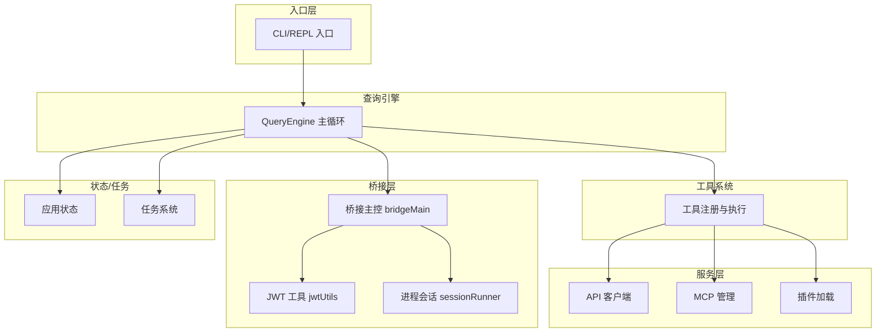
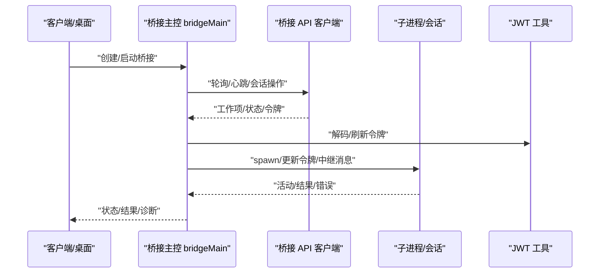
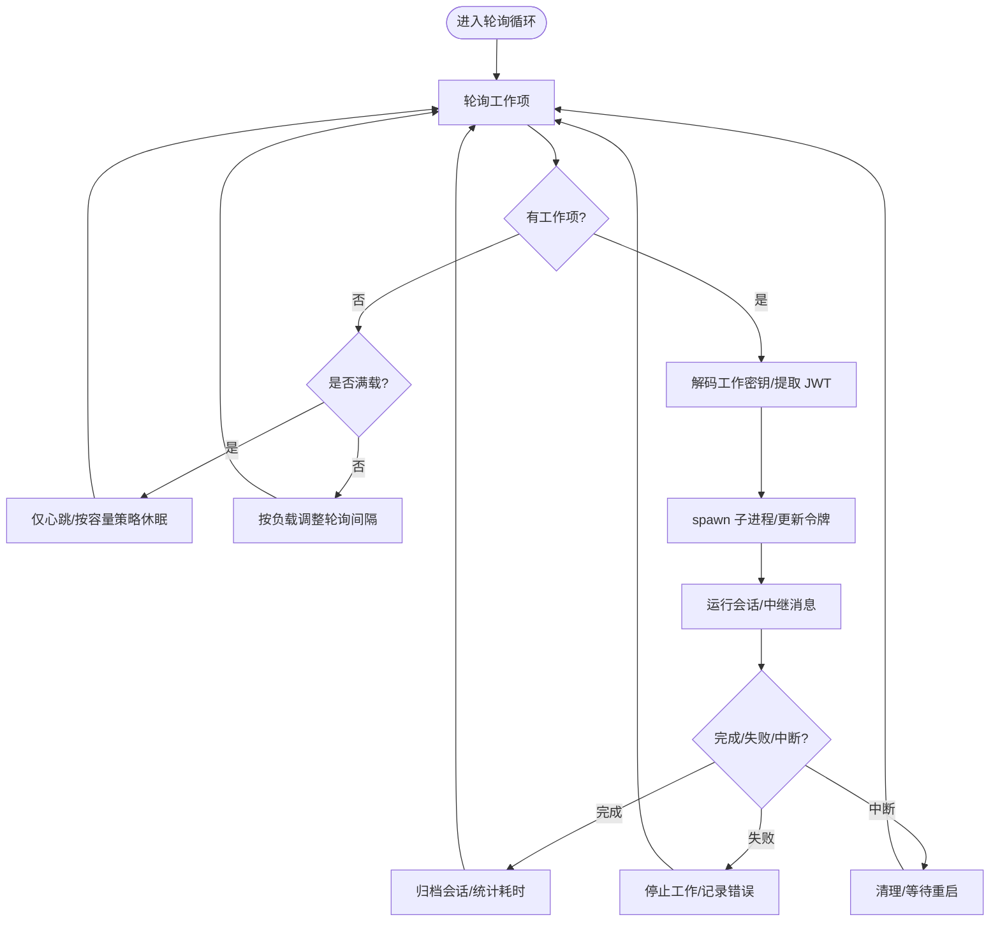
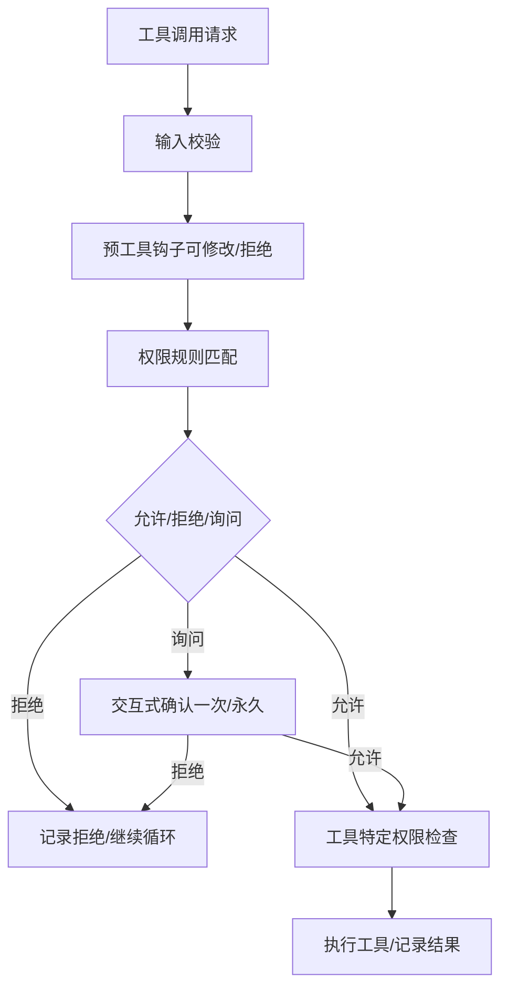
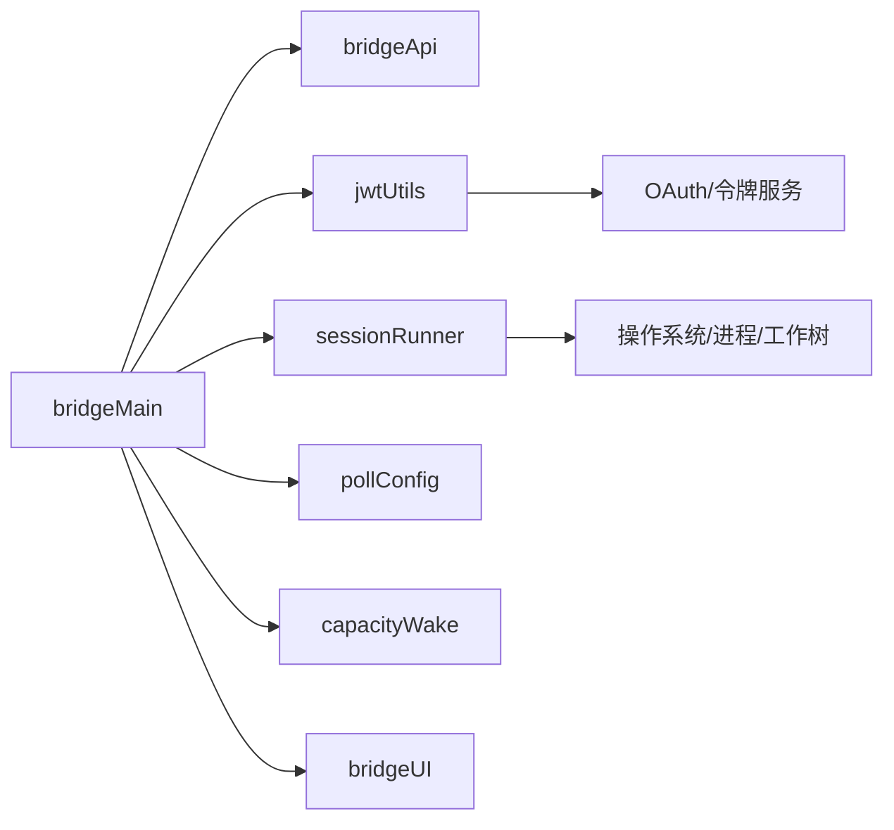

# 集成测试

<cite>
**本文引用的文件**
- [README.md](file://README.md)
- [bridgeMain.ts](file://src/bridge/bridgeMain.ts)
- [jwtUtils.ts](file://src/bridge/jwtUtils.ts)
- [TestingPermissionTool.tsx](file://src/tools/testing/TestingPermissionTool.tsx)
- [bridgeApi.ts](file://src/bridge/bridgeApi.ts)
- [bridgeConfig.ts](file://src/bridge/bridgeConfig.ts)
- [bridgeMessaging.ts](file://src/bridge/bridgeMessaging.ts)
- [sessionRunner.ts](file://src/bridge/sessionRunner.ts)
- [remoteBridgeCore.ts](file://src/bridge/remoteBridgeCore.ts)
- [replBridge.ts](file://src/bridge/replBridge.ts)
- [replBridgeTransport.ts](file://src/bridge/replBridgeTransport.ts)
- [bridgePermissionCallbacks.ts](file://src/bridge/bridgePermissionCallbacks.ts)
- [bridgeStatusUtil.ts](file://src/bridge/bridgeStatusUtil.ts)
- [trustedDevice.ts](file://src/bridge/trustedDevice.ts)
- [workSecret.ts](file://src/bridge/workSecret.ts)
- [sessionIdCompat.ts](file://src/bridge/sessionIdCompat.ts)
- [envLessBridgeConfig.ts](file://src/bridge/envLessBridgeConfig.ts)
- [flushGate.ts](file://src/bridge/flushGate.ts)
- [inboundMessages.ts](file://src/bridge/inboundMessages.ts)
- [inboundAttachments.ts](file://src/bridge/inboundAttachments.ts)
- [createSession.ts](file://src/bridge/createSession.ts)
- [codeSessionApi.ts](file://src/bridge/codeSessionApi.ts)
- [initReplBridge.ts](file://src/bridge/initReplBridge.ts)
- [pollConfig.ts](file://src/bridge/pollConfig.ts)
- [pollConfigDefaults.ts](file://src/bridge/pollConfigDefaults.ts)
- [capacityWake.ts](file://src/bridge/capacityWake.ts)
- [bridgeUI.ts](file://src/bridge/bridgeUI.ts)
- [bridgeDebug.ts](file://src/bridge/bridgeDebug.ts)
- [bridgeEnabled.ts](file://src/bridge/bridgeEnabled.ts)
- [bridgePointer.ts](file://src/bridge/bridgePointer.ts)
- [bridgeStatusUtil.ts](file://src/bridge/bridgeStatusUtil.ts)
- [debugUtils.ts](file://src/bridge/debugUtils.ts)
- [types.ts](file://src/bridge/types.ts)
- [bridgeConfig.ts](file://src/bridge/bridgeConfig.ts)
- [bridgeApi.ts](file://src/bridge/bridgeApi.ts)
- [bridgeMain.ts](file://src/bridge/bridgeMain.ts)
- [jwtUtils.ts](file://src/bridge/jwtUtils.ts)
- [sessionRunner.ts](file://src/bridge/sessionRunner.ts)
- [remoteBridgeCore.ts](file://src/bridge/remoteBridgeCore.ts)
- [replBridge.ts](file://src/bridge/replBridge.ts)
- [replBridgeTransport.ts](file://src/bridge/replBridgeTransport.ts)
- [bridgePermissionCallbacks.ts](file://src/bridge/bridgePermissionCallbacks.ts)
- [trustedDevice.ts](file://src/bridge/trustedDevice.ts)
- [workSecret.ts](file://src/bridge/workSecret.ts)
- [sessionIdCompat.ts](file://src/bridge/sessionIdCompat.ts)
- [envLessBridgeConfig.ts](file://src/bridge/envLessBridgeConfig.ts)
- [flushGate.ts](file://src/bridge/flushGate.ts)
- [inboundMessages.ts](file://src/bridge/inboundMessages.ts)
- [inboundAttachments.ts](file://src/bridge/inboundAttachments.ts)
- [createSession.ts](file://src/bridge/createSession.ts)
- [codeSessionApi.ts](file://src/bridge/codeSessionApi.ts)
- [initReplBridge.ts](file://src/bridge/initReplBridge.ts)
- [pollConfig.ts](file://src/bridge/pollConfig.ts)
- [pollConfigDefaults.ts](file://src/bridge/pollConfigDefaults.ts)
- [capacityWake.ts](file://src/bridge/capacityWake.ts)
- [bridgeUI.ts](file://src/bridge/bridgeUI.ts)
- [bridgeDebug.ts](file://src/bridge/bridgeDebug.ts)
- [bridgeEnabled.ts](file://src/bridge/bridgeEnabled.ts)
- [bridgePointer.ts](file://src/bridge/bridgePointer.ts)
- [bridgeStatusUtil.ts](file://src/bridge/bridgeStatusUtil.ts)
- [debugUtils.ts](file://src/bridge/debugUtils.ts)
- [types.ts](file://src/bridge/types.ts)
</cite>

## 目录
1. [简介](#简介)
2. [项目结构](#项目结构)
3. [核心组件](#核心组件)
4. [架构总览](#架构总览)
5. [详细组件分析](#详细组件分析)
6. [依赖关系分析](#依赖关系分析)
7. [性能考量](#性能考量)
8. [故障排查指南](#故障排查指南)
9. [结论](#结论)
10. [附录](#附录)

## 简介
本文件面向 Claude Code 的集成测试，系统性阐述设计理念、测试范围与实施策略，覆盖组件间交互、API 集成、系统级功能、桥接层（Claude Desktop 桥接、远程会话、JWT 认证）、权限系统（规则、工具权限链、安全边界）、工具集成（组合、链式、依赖）、服务集成（API、数据库、第三方服务），并提供端到端工作流示例、测试环境与数据准备建议，以及自动化与持续集成配置思路。

## 项目结构
- 代码库采用“分层 + 功能域”组织：入口层（CLI/REPL）、查询引擎（主循环）、工具系统、服务层（API 客户端、分析、MCP、插件等）、状态层（应用状态）、任务系统、桥接层（桌面/远程）。
- 桥接层是远程能力的核心载体，负责会话生命周期管理、消息中继、令牌刷新、容量唤醒、错误处理与回退重试。
- 权限系统贯穿工具调用前的预检查、规则匹配与交互式确认，确保最小授权与可审计。

图表来源
- [README.md](file://README.md)
- [bridgeMain.ts](file://src/bridge/bridgeMain.ts)
- [jwtUtils.ts](file://src/bridge/jwtUtils.ts)
- [sessionRunner.ts](file://src/bridge/sessionRunner.ts)

章节来源
- [README.md](file://README.md)

## 核心组件
- 桥接主控（bridgeMain）：会话生命周期、轮询与心跳、令牌刷新、容量唤醒、错误恢复与回退重试、日志与诊断。
- JWT 工具（jwtUtils）：解码 JWT、计算过期时间、主动刷新调度器。
- 会话运行器（sessionRunner）：子进程创建、参数传递、工作树隔离、超时与清理。
- 权限回调（bridgePermissionCallbacks）：工具调用前的权限决策与交互。
- 远程桥核（remoteBridgeCore）：远程会话抽象与传输适配。
- REPL 桥（replBridge）：REPL 场景下的桥接与传输。
- 配置与轮询（bridgeConfig/pollConfig）：连接参数、轮询间隔、容量策略。
- 信任设备与工作密钥（trustedDevice/workSecret）：设备信任与会话密钥交换。
- 会话 ID 兼容（sessionIdCompat）：跨版本会话标识映射。
- 输入消息/附件（inboundMessages/inboundAttachments）：远程输入中继。
- 代码会话 API（codeSessionApi）：代码会话相关接口。
- 初始化（initReplBridge）：REPL 桥初始化流程。
- 类型与常量（types）：桥接层统一类型定义。

章节来源
- [bridgeMain.ts](file://src/bridge/bridgeMain.ts)
- [jwtUtils.ts](file://src/bridge/jwtUtils.ts)
- [sessionRunner.ts](file://src/bridge/sessionRunner.ts)
- [bridgePermissionCallbacks.ts](file://src/bridge/bridgePermissionCallbacks.ts)
- [remoteBridgeCore.ts](file://src/bridge/remoteBridgeCore.ts)
- [replBridge.ts](file://src/bridge/replBridge.ts)
- [replBridgeTransport.ts](file://src/bridge/replBridgeTransport.ts)
- [bridgeConfig.ts](file://src/bridge/bridgeConfig.ts)
- [pollConfig.ts](file://src/bridge/pollConfig.ts)
- [trustedDevice.ts](file://src/bridge/trustedDevice.ts)
- [workSecret.ts](file://src/bridge/workSecret.ts)
- [sessionIdCompat.ts](file://src/bridge/sessionIdCompat.ts)
- [inboundMessages.ts](file://src/bridge/inboundMessages.ts)
- [inboundAttachments.ts](file://src/bridge/inboundAttachments.ts)
- [codeSessionApi.ts](file://src/bridge/codeSessionApi.ts)
- [initReplBridge.ts](file://src/bridge/initReplBridge.ts)
- [types.ts](file://src/bridge/types.ts)

## 架构总览
桥接层通过 HTTP/WS/SDK 等多种传输与远程环境交互，实现会话创建、轮询、心跳、令牌刷新与断线重连；同时在本地通过 sessionRunner 管理子进程，隔离工作树，保障安全与可恢复性。

图表来源
- [bridgeMain.ts](file://src/bridge/bridgeMain.ts)
- [bridgeApi.ts](file://src/bridge/bridgeApi.ts)
- [jwtUtils.ts](file://src/bridge/jwtUtils.ts)
- [sessionRunner.ts](file://src/bridge/sessionRunner.ts)

## 详细组件分析

### 桥接层集成测试（Claude Desktop 桥接、远程会话、JWT 认证）
- 设计理念
  - 以“会话为中心”的端到端验证：从创建、轮询、心跳、令牌刷新到结束清理全流程覆盖。
  - 多传输路径验证：HTTP、WebSocket、SDK 等，确保不同部署形态一致行为。
  - 错误注入与恢复：断网、401/403、超时、服务器回收等场景的自动重试与回退。
- 测试范围
  - 会话生命周期：创建、运行、归档、结束、清理。
  - 令牌刷新：JWT 解码、过期检测、提前刷新、v1/v2 差异处理。
  - 容量与并发：多会话并发、容量唤醒、空闲心跳、节流策略。
  - 诊断与日志：调试日志、无 PII 诊断事件、错误摘要。
- 关键流程图（轮询与心跳）

图表来源
- [bridgeMain.ts](file://src/bridge/bridgeMain.ts)
- [jwtUtils.ts](file://src/bridge/jwtUtils.ts)
- [sessionRunner.ts](file://src/bridge/sessionRunner.ts)

章节来源
- [bridgeMain.ts](file://src/bridge/bridgeMain.ts)
- [jwtUtils.ts](file://src/bridge/jwtUtils.ts)
- [sessionRunner.ts](file://src/bridge/sessionRunner.ts)
- [bridgeApi.ts](file://src/bridge/bridgeApi.ts)
- [pollConfig.ts](file://src/bridge/pollConfig.ts)
- [capacityWake.ts](file://src/bridge/capacityWake.ts)
- [bridgeUI.ts](file://src/bridge/bridgeUI.ts)
- [bridgeDebug.ts](file://src/bridge/bridgeDebug.ts)
- [debugUtils.ts](file://src/bridge/debugUtils.ts)

### 权限系统集成测试（规则、工具权限链、安全边界）
- 设计理念
  - 前置校验：输入合法性、规则匹配（总是允许/拒绝/询问）。
  - 工具特定权限：路径沙箱、只读/破坏性标记、并发安全判定。
  - 交互式确认：用户可一次性/永久放行或拒绝。
- 测试策略
  - 规则链路：alwaysAllow/alwaysDeny/alwaysAsk 组合与优先级。
  - 工具权限链：工具能力标记（并发安全、只读、破坏性）与执行路径。
  - 安全边界：路径白名单、资源访问限制、跨进程隔离。
- 示例工具（测试用途）
  - TestingPermissionTool：用于端到端测试的“总是弹出权限对话框”的工具，便于验证权限流。

图表来源
- [TestingPermissionTool.tsx](file://src/tools/testing/TestingPermissionTool.tsx)
- [bridgePermissionCallbacks.ts](file://src/bridge/bridgePermissionCallbacks.ts)

章节来源
- [TestingPermissionTool.tsx](file://src/tools/testing/TestingPermissionTool.tsx)
- [bridgePermissionCallbacks.ts](file://src/bridge/bridgePermissionCallbacks.ts)

### 工具集成测试策略（组合、链式、依赖）
- 设计理念
  - 组合测试：多工具并行/串行组合，验证并发安全与冲突处理。
  - 链式测试：工具输出作为下一个工具输入，验证数据流与错误传播。
  - 依赖测试：工具间前置条件、资源占用、互斥与顺序约束。
- 实施要点
  - 并发安全：标记为并发安全的工具应可并行执行，否则串行排队。
  - 只读/破坏性：对文件系统/网络的变更需严格控制与审计。
  - 结果映射：工具输出需正确映射到 API 块参数，保证下游可用。

章节来源
- [TestingPermissionTool.tsx](file://src/tools/testing/TestingPermissionTool.tsx)

### 服务集成测试方法（API 服务、数据库、第三方服务）
- API 服务测试
  - 轮询与心跳：验证空闲/满载策略、回退重试、错误分类（401/403/404/410/其他）。
  - 令牌刷新：OAuth 获取、v1/v2 差异、刷新链路稳定性。
  - 会话归档：完成/失败后的归档与清理。
- 数据库/持久化
  - 会话日志：JSONL 追加写入、恢复/继续/Fork 行为一致性。
  - 诊断事件：无 PII 事件上报与聚合。
- 第三方服务
  - MCP：发现、认证（OAuth/XAA/API Key）、工具注册与动态模式。
  - 分析与遥测：事件采集、GrowthBook 标志位、遥测后端。

章节来源
- [bridgeMain.ts](file://src/bridge/bridgeMain.ts)
- [bridgeApi.ts](file://src/bridge/bridgeApi.ts)
- [jwtUtils.ts](file://src/bridge/jwtUtils.ts)
- [README.md](file://README.md)

### 端到端集成测试示例（完整用户工作流）
- 示例一：桌面桥接 + 文件读取 + Bash 执行
  - 步骤
    1) 启动桥接，创建会话。
    2) 通过桥接发送“读取文件”指令。
    3) 工具执行文件读取，返回内容。
    4) 发送“在临时目录执行命令”，工具触发 BashTool。
    5) 验证结果与进度消息、权限弹窗（如需要）。
    6) 结束会话，归档并清理。
  - 关注点：权限弹窗、并发安全、只读工具、错误回退。
- 示例二：远程会话 + JWT 刷新 + 心跳保活
  - 步骤
    1) 创建远程会话，建立传输通道。
    2) 模拟令牌即将过期，触发刷新调度器。
    3) 验证 v2 通过 reconnectSession 重新派发，v1 直接更新令牌。
    4) 心跳保持活跃，空闲时仅心跳。
    5) 结束并清理。
  - 关注点：刷新缓冲、失败重试、容量唤醒。

章节来源
- [bridgeMain.ts](file://src/bridge/bridgeMain.ts)
- [jwtUtils.ts](file://src/bridge/jwtUtils.ts)
- [sessionRunner.ts](file://src/bridge/sessionRunner.ts)
- [TestingPermissionTool.tsx](file://src/tools/testing/TestingPermissionTool.tsx)

## 依赖关系分析
- 组件耦合
  - bridgeMain 依赖 bridgeApi、jwtUtils、sessionRunner、pollConfig、capacityWake、bridgeUI 等。
  - jwtUtils 与外部 OAuth/令牌服务交互，提供刷新调度。
  - sessionRunner 与 OS 进程/工作树/超时管理强耦合。
- 外部依赖
  - API 服务（远程桥接）、MCP 服务器、分析/遥测后端、第三方认证（OAuth/XAA）。
- 循环依赖
  - 当前模块以单向依赖为主，桥接主控作为协调者，避免循环。

图表来源
- [bridgeMain.ts](file://src/bridge/bridgeMain.ts)
- [bridgeApi.ts](file://src/bridge/bridgeApi.ts)
- [jwtUtils.ts](file://src/bridge/jwtUtils.ts)
- [sessionRunner.ts](file://src/bridge/sessionRunner.ts)
- [pollConfig.ts](file://src/bridge/pollConfig.ts)
- [capacityWake.ts](file://src/bridge/capacityWake.ts)
- [bridgeUI.ts](file://src/bridge/bridgeUI.ts)

章节来源
- [bridgeMain.ts](file://src/bridge/bridgeMain.ts)
- [bridgeApi.ts](file://src/bridge/bridgeApi.ts)
- [jwtUtils.ts](file://src/bridge/jwtUtils.ts)
- [sessionRunner.ts](file://src/bridge/sessionRunner.ts)
- [pollConfig.ts](file://src/bridge/pollConfig.ts)
- [capacityWake.ts](file://src/bridge/capacityWake.ts)
- [bridgeUI.ts](file://src/bridge/bridgeUI.ts)

## 性能考量
- 轮询与心跳
  - 空闲/满载/部分容量下采用不同轮询间隔，降低服务器压力。
  - 心跳仅在满载或启用时进行，避免不必要的请求。
- 刷新调度
  - 提前缓冲刷新，避免临界过期导致的抖动。
  - 失败重试上限与退避，防止雪崩。
- 并发与容量
  - 并发安全工具并行执行，非并发安全串行排队。
  - 容量唤醒减少空闲等待，提升吞吐。

章节来源
- [bridgeMain.ts](file://src/bridge/bridgeMain.ts)
- [jwtUtils.ts](file://src/bridge/jwtUtils.ts)
- [pollConfig.ts](file://src/bridge/pollConfig.ts)
- [capacityWake.ts](file://src/bridge/capacityWake.ts)

## 故障排查指南
- 常见问题
  - 401/403：令牌过期或无效，触发 reconnectSession 或更新 OAuth。
  - 404/410：环境过期或删除，终止轮询并记录致命错误。
  - 断线重连：记录断开时长与事件，恢复后继续。
  - 超时/中断：区分超时杀死与服务器/关闭中断，分别处理清理与归档。
- 诊断手段
  - 调试日志与无 PII 诊断事件。
  - 错误摘要与堆栈收集。
  - 令牌刷新链路追踪与失败计数。
- 回退策略
  - 连接/通用回退指数退避，超过阈值放弃并记录。
  - 容量唤醒与睡眠组合，避免紧循环。

章节来源
- [bridgeMain.ts](file://src/bridge/bridgeMain.ts)
- [bridgeDebug.ts](file://src/bridge/bridgeDebug.ts)
- [debugUtils.ts](file://src/bridge/debugUtils.ts)
- [bridgeStatusUtil.ts](file://src/bridge/bridgeStatusUtil.ts)

## 结论
本集成测试方案以桥接层为核心，贯通权限系统、工具链与服务层，覆盖从桌面桥接到远程会话、从 JWT 刷新到容量管理的全链路行为。通过组合/链式/依赖测试与端到端工作流验证，确保系统在真实部署形态下的稳定性、安全性与可观测性。

## 附录

### 测试环境配置与测试数据准备
- 环境变量与标志位
  - USER_TYPE、DEBUG 相关变量用于调试日志与路径。
  - GrowthBook 门控（如多会话/多环境）影响行为与回退。
- 测试数据
  - 会话日志（JSONL）：用于恢复/继续/Fork。
  - 令牌样本：含 exp 的 JWT 与 OAuth 令牌。
  - 工作密钥：包含会话信息与 JWT 的编码体。
- 传输与认证
  - 桌面/远程桥接：HTTP/WS/SDK 三种传输路径。
  - MCP：OAuth/XAA/API Key 三种认证方式。

章节来源
- [bridgeMain.ts](file://src/bridge/bridgeMain.ts)
- [pollConfig.ts](file://src/bridge/pollConfig.ts)
- [envLessBridgeConfig.ts](file://src/bridge/envLessBridgeConfig.ts)
- [trustedDevice.ts](file://src/bridge/trustedDevice.ts)
- [workSecret.ts](file://src/bridge/workSecret.ts)
- [sessionIdCompat.ts](file://src/bridge/sessionIdCompat.ts)
- [inboundMessages.ts](file://src/bridge/inboundMessages.ts)
- [inboundAttachments.ts](file://src/bridge/inboundAttachments.ts)
- [codeSessionApi.ts](file://src/bridge/codeSessionApi.ts)
- [initReplBridge.ts](file://src/bridge/initReplBridge.ts)
- [README.md](file://README.md)

### 自动化与持续集成配置
- CI 阶段建议
  - 单元/集成拆分：桥接主控、JWT 工具、会话运行器独立流水线。
  - 多传输矩阵：HTTP/WS/SDK 三类传输分别验证。
  - 错误注入矩阵：断网、401/403、超时、服务器回收。
- 触发与收敛
  - PR 触发基础测试，主分支触发全量与回归。
  - 失败收敛：失败重试、告警与人工介入。
- 报告与归档
  - 测试报告、诊断日志、会话快照归档，支持事后复盘。

[本节为通用实践建议，不直接分析具体文件]