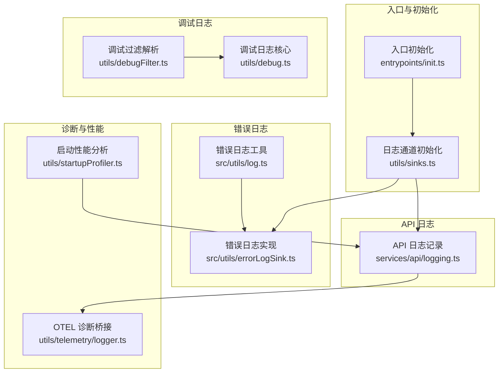
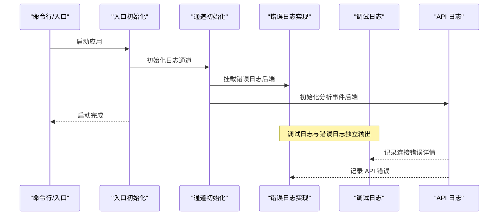
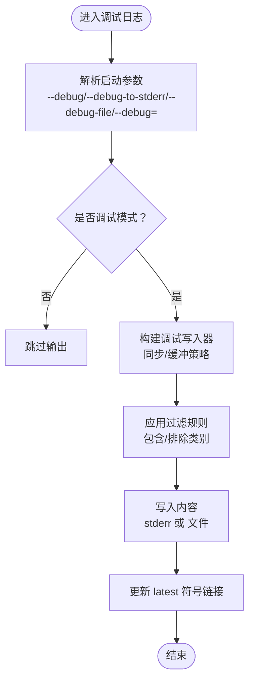
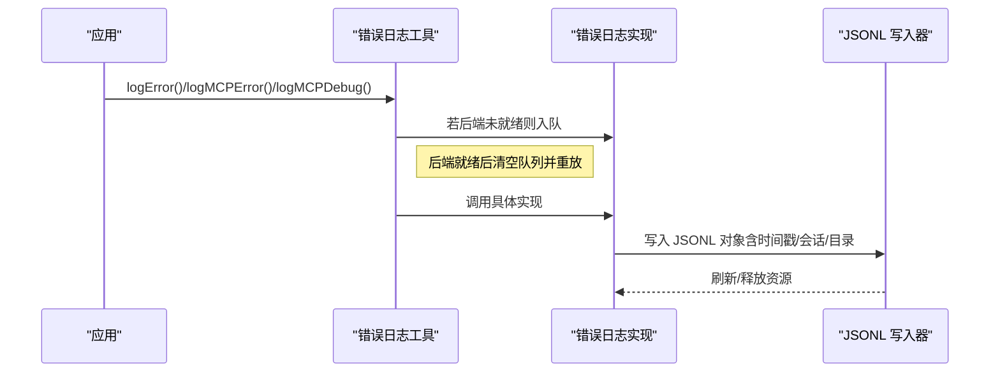
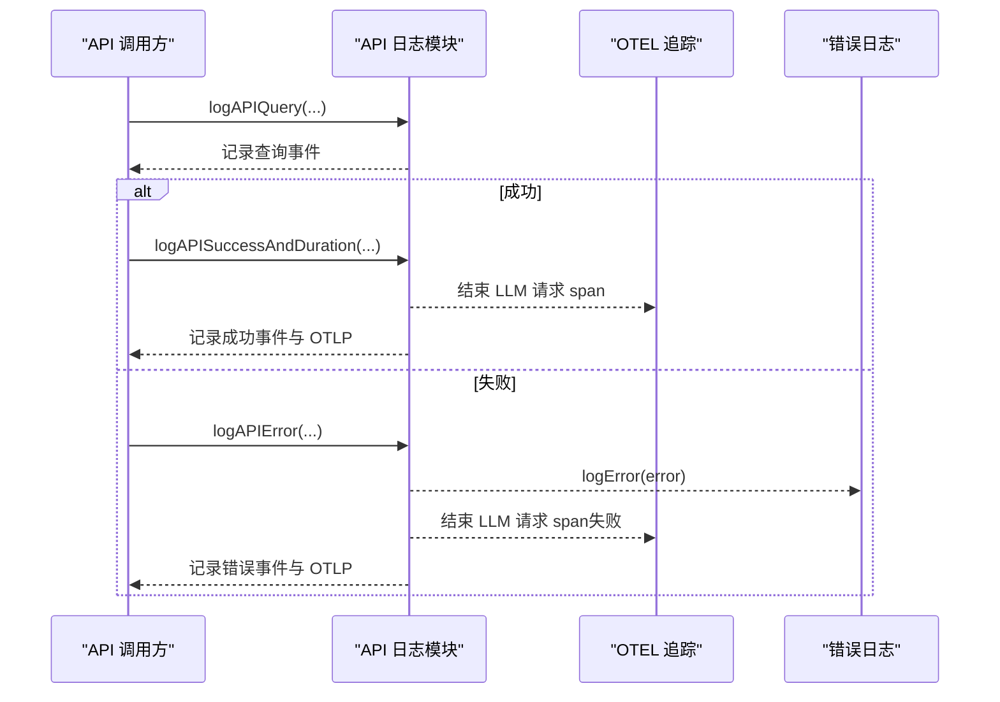
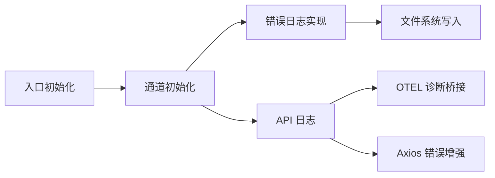

# 日志系统

<cite>
**本文引用的文件**
- [src/utils/log.ts](file://src/utils/log.ts)
- [src/utils/errorLogSink.ts](file://src/utils/errorLogSink.ts)
- [src/services/api/logging.ts](file://src/services/api/logging.ts)
- [src/utils/debug.ts](file://src/utils/debug.ts)
- [src/utils/debugFilter.ts](file://src/utils/debugFilter.ts)
- [src/utils/telemetry/logger.ts](file://src/utils/telemetry/logger.ts)
- [src/utils/sinks.ts](file://src/utils/sinks.ts)
- [src/entrypoints/init.ts](file://src/entrypoints/init.ts)
- [src/types/logs.ts](file://src/types/logs.ts)
- [src/utils/startupProfiler.ts](file://src/utils/startupProfiler.ts)
</cite>

## 目录
1. [简介](#简介)
2. [项目结构](#项目结构)
3. [核心组件](#核心组件)
4. [架构总览](#架构总览)
5. [详细组件分析](#详细组件分析)
6. [依赖关系分析](#依赖关系分析)
7. [性能考量](#性能考量)
8. [故障排查指南](#故障排查指南)
9. [结论](#结论)
10. [附录：日志配置与最佳实践](#附录日志配置与最佳实践)

## 简介
本文件面向 Claude Code 的日志系统，系统性梳理其配置机制、内部实现、API 日志记录、诊断日志与性能指标记录，并提供日志分析与优化建议。重点覆盖以下方面：
- 日志级别与输出目标（调试日志、错误日志、分析事件、OTLP 指标/追踪）
- 输出格式与时间戳处理、上下文附加（会话 ID、工作目录、版本等）
- 错误日志轮转与缓冲写入策略
- 请求/响应/错误日志在 API 层的记录与关联
- 诊断日志与启动性能分析
- 实用的过滤、搜索与聚合分析方法
- 配置最佳实践与性能优化建议

## 项目结构
日志系统由多模块协作构成：
- 调试日志：通过调试器接口输出到标准错误或文件，支持过滤与轮转
- 错误日志：以 JSONL 格式落盘，带时间戳、会话 ID、工作目录等上下文
- API 日志：封装请求/响应/错误事件，统一上报分析平台与 OTLP
- 启动性能日志：基于性能标记计算阶段耗时并上报
- 诊断日志：对 OpenTelemetry 诊断输出进行桥接与降噪

图表来源
- [src/entrypoints/init.ts:26-340](file://src/entrypoints/init.ts#L26-L340)
- [src/utils/sinks.ts:1-16](file://src/utils/sinks.ts#L1-L16)
- [src/utils/debug.ts:163-207](file://src/utils/debug.ts#L163-L207)
- [src/utils/debugFilter.ts:16-44](file://src/utils/debugFilter.ts#L16-L44)
- [src/utils/log.ts:158-203](file://src/utils/log.ts#L158-L203)
- [src/utils/errorLogSink.ts:225-235](file://src/utils/errorLogSink.ts#L225-L235)
- [src/services/api/logging.ts:171-233](file://src/services/api/logging.ts#L171-L233)
- [src/utils/telemetry/logger.ts:1-27](file://src/utils/telemetry/logger.ts#L1-L27)
- [src/utils/startupProfiler.ts:159-194](file://src/utils/startupProfiler.ts#L159-L194)

章节来源
- [src/entrypoints/init.ts:26-340](file://src/entrypoints/init.ts#L26-L340)
- [src/utils/sinks.ts:1-16](file://src/utils/sinks.ts#L1-L16)
- [src/utils/debug.ts:163-207](file://src/utils/debug.ts#L163-L207)
- [src/utils/debugFilter.ts:16-44](file://src/utils/debugFilter.ts#L16-L44)
- [src/utils/log.ts:158-203](file://src/utils/log.ts#L158-L203)
- [src/utils/errorLogSink.ts:225-235](file://src/utils/errorLogSink.ts#L225-L235)
- [src/services/api/logging.ts:171-233](file://src/services/api/logging.ts#L171-L233)
- [src/utils/telemetry/logger.ts:1-27](file://src/utils/telemetry/logger.ts#L1-L27)
- [src/utils/startupProfiler.ts:159-194](file://src/utils/startupProfiler.ts#L159-L194)

## 核心组件
- 调试日志（--debug/--debug-file）：支持按类别过滤、输出到 stderr 或文件、自动维护“latest”符号链接
- 错误日志（JSONL）：按日期分文件，带时间戳、会话 ID、工作目录、版本等上下文；支持 MCP 服务器专用日志
- API 日志：统一记录请求参数、响应耗时、令牌用量、错误类型、网关识别、Beta 追踪输出等
- 诊断日志：将 OTEL 诊断输出映射为应用日志，便于问题定位
- 启动性能日志：基于性能标记计算阶段耗时并上报

章节来源
- [src/utils/debug.ts:104-121](file://src/utils/debug.ts#L104-L121)
- [src/utils/debug.ts:163-207](file://src/utils/debug.ts#L163-L207)
- [src/utils/errorLogSink.ts:29-38](file://src/utils/errorLogSink.ts#L29-L38)
- [src/utils/errorLogSink.ts:111-126](file://src/utils/errorLogSink.ts#L111-L126)
- [src/services/api/logging.ts:171-233](file://src/services/api/logging.ts#L171-L233)
- [src/utils/telemetry/logger.ts:4-26](file://src/utils/telemetry/logger.ts#L4-L26)
- [src/utils/startupProfiler.ts:159-194](file://src/utils/startupProfiler.ts#L159-L194)

## 架构总览
日志系统采用“通道初始化 + 多后端”的架构：
- 初始化阶段挂载错误日志与分析事件通道
- 调试日志与错误日志分别走不同路径：前者面向用户可观察性，后者面向持久化与问题复现
- API 层在成功/失败场景下统一记录事件，同时联动 OTLP 与 Beta 追踪

图表来源
- [src/entrypoints/init.ts:26-340](file://src/entrypoints/init.ts#L26-L340)
- [src/utils/sinks.ts:13-16](file://src/utils/sinks.ts#L13-L16)
- [src/utils/errorLogSink.ts:225-235](file://src/utils/errorLogSink.ts#L225-L235)
- [src/services/api/logging.ts:284-292](file://src/services/api/logging.ts#L284-L292)

## 详细组件分析

### 调试日志与过滤
- 启动参数支持：
  - --debug：启用调试模式
  - --debug-to-stderr/-d2e：强制输出到标准错误
  - --debug-file=路径 或 --debug-file 跟随路径：输出到指定文件
  - --debug=过滤串：按类别过滤（如 api,hooks 或 !file,!1p），不支持混用包含与排除
- 写入策略：
  - 启动时同步写入，避免进程退出导致异步写丢失
  - 非启动时采用缓冲写入（默认约 1 秒刷新，最大缓冲 100 行）
  - 自动维护“latest”符号链接，便于 tail 查看最新日志
- 上下文：
  - NODE 版本信息、测试环境限制、ANT 用户类型差异

图表来源
- [src/utils/debug.ts:75-102](file://src/utils/debug.ts#L75-L102)
- [src/utils/debug.ts:104-121](file://src/utils/debug.ts#L104-L121)
- [src/utils/debug.ts:163-207](file://src/utils/debug.ts#L163-L207)
- [src/utils/debugFilter.ts:16-44](file://src/utils/debugFilter.ts#L16-L44)

章节来源
- [src/utils/debug.ts:75-102](file://src/utils/debug.ts#L75-L102)
- [src/utils/debug.ts:104-121](file://src/utils/debug.ts#L104-L121)
- [src/utils/debug.ts:163-207](file://src/utils/debug.ts#L163-L207)
- [src/utils/debugFilter.ts:16-44](file://src/utils/debugFilter.ts#L16-L44)

### 错误日志（JSONL）与轮转
- 输出目标：
  - 全局错误日志：按日期命名的 .jsonl 文件，位于缓存目录 errors 下
  - MCP 服务器日志：按服务器名分目录，同日期命名
- 写入策略：
  - 延迟初始化：首次写入时确保目录存在，随后使用缓冲写入器（默认 1 秒刷新，缓冲上限 50）
  - 只对 ANT 用户开放持久化写入
  - 统一字段：timestamp、sessionId、cwd、userType、version
- 队列与挂载：
  - 在错误日志后端未就绪前，事件被入队；后端就绪后立即清空队列
  - 初始化顺序要求：先初始化错误日志后端，再初始化分析事件后端

图表来源
- [src/utils/log.ts:109-134](file://src/utils/log.ts#L109-L134)
- [src/utils/log.ts:158-203](file://src/utils/log.ts#L158-L203)
- [src/utils/errorLogSink.ts:85-109](file://src/utils/errorLogSink.ts#L85-L109)
- [src/utils/errorLogSink.ts:111-126](file://src/utils/errorLogSink.ts#L111-L126)
- [src/utils/errorLogSink.ts:225-235](file://src/utils/errorLogSink.ts#L225-L235)

章节来源
- [src/utils/log.ts:109-134](file://src/utils/log.ts#L109-L134)
- [src/utils/log.ts:158-203](file://src/utils/log.ts#L158-L203)
- [src/utils/errorLogSink.ts:29-38](file://src/utils/errorLogSink.ts#L29-L38)
- [src/utils/errorLogSink.ts:85-109](file://src/utils/errorLogSink.ts#L85-L109)
- [src/utils/errorLogSink.ts:111-126](file://src/utils/errorLogSink.ts#L111-L126)
- [src/utils/errorLogSink.ts:225-235](file://src/utils/errorLogSink.ts#L225-L235)

### API 日志记录（请求/响应/错误）
- 请求日志：
  - 记录模型、消息长度、温度、权限模式、查询来源、思考模式、努力等级、快速模式、前置请求 ID 等
- 成功日志：
  - 记录输入/输出令牌、缓存读写令牌、TTFT、耗时、请求 ID、停止原因、成本、回退非流式情况、全局缓存策略、文本/思考内容长度、工具调用输入长度分布、连接器文本块数、快速模式、上一次请求 ID、环境元数据、自上次调用间隔等
- 错误日志：
  - 提取连接错误细节（SSL/网络错误码与消息）、客户端请求 ID（x-client-request-id）用于服务端日志定位
  - 分类 API 错误类型、识别网关（如 litellm、helicone、portkey、cloudflare-ai-gateway、kong、braintrust、databricks）
  - 结合 Beta 追踪输出模型输出/思考输出/工具调用标记
- OTLP 事件：
  - 成功/失败均记录 OTLP 事件，便于外部可观测性平台采集

图表来源
- [src/services/api/logging.ts:171-233](file://src/services/api/logging.ts#L171-L233)
- [src/services/api/logging.ts:235-396](file://src/services/api/logging.ts#L235-L396)
- [src/services/api/logging.ts:581-788](file://src/services/api/logging.ts#L581-L788)

章节来源
- [src/services/api/logging.ts:171-233](file://src/services/api/logging.ts#L171-L233)
- [src/services/api/logging.ts:235-396](file://src/services/api/logging.ts#L235-L396)
- [src/services/api/logging.ts:581-788](file://src/services/api/logging.ts#L581-L788)

### 诊断日志与 OTEL 诊断桥接
- 将 OTEL 诊断日志映射为应用层错误/警告日志，便于统一查看
- 仅在必要时输出，避免噪声

章节来源
- [src/utils/telemetry/logger.ts:4-26](file://src/utils/telemetry/logger.ts#L4-L26)

### 启动性能日志
- 基于性能标记（Performance Mark）计算各阶段耗时，仅对采样会话上报
- 上报字段包含各阶段耗时与标记数量，便于定位启动瓶颈

章节来源
- [src/utils/startupProfiler.ts:159-194](file://src/utils/startupProfiler.ts#L159-L194)

## 依赖关系分析
- 初始化顺序：
  - 必须先初始化错误日志后端，再初始化分析事件后端，保证事件不丢失
- 组件耦合：
  - 错误日志工具与实现解耦，通过“通道”接口注入
  - 调试日志与错误日志互不影响，各自独立缓冲与落盘
- 外部依赖：
  - Axios 用于增强 API 错误上下文（URL、状态、服务端消息）
  - OpenTelemetry 用于指标/追踪与诊断桥接

图表来源
- [src/entrypoints/init.ts:26-340](file://src/entrypoints/init.ts#L26-L340)
- [src/utils/sinks.ts:13-16](file://src/utils/sinks.ts#L13-L16)
- [src/utils/errorLogSink.ts:13-22](file://src/utils/errorLogSink.ts#L13-L22)
- [src/services/api/logging.ts:284-292](file://src/services/api/logging.ts#L284-L292)

章节来源
- [src/entrypoints/init.ts:26-340](file://src/entrypoints/init.ts#L26-L340)
- [src/utils/sinks.ts:13-16](file://src/utils/sinks.ts#L13-L16)
- [src/utils/errorLogSink.ts:13-22](file://src/utils/errorLogSink.ts#L13-L22)
- [src/services/api/logging.ts:284-292](file://src/services/api/logging.ts#L284-L292)

## 性能考量
- 缓冲写入：
  - 调试日志：默认约 1 秒刷新，缓冲上限 100 行；启动时强制同步写入，避免退出丢失
  - 错误日志：默认约 1 秒刷新，缓冲上限 50 行
- I/O 策略：
  - 首次写入自动创建目录，减少异常开销
  - ANT 用户才写入持久化日志，避免非必要磁盘 IO
- 追踪与事件：
  - API 成功/失败均记录 OTLP 事件，注意在高并发场景下的事件量控制
- 启动性能：
  - 仅对采样会话记录启动阶段耗时，避免对普通用户造成额外开销

章节来源
- [src/utils/debug.ts:163-207](file://src/utils/debug.ts#L163-L207)
- [src/utils/errorLogSink.ts:89-109](file://src/utils/errorLogSink.ts#L89-L109)
- [src/utils/startupProfiler.ts:159-194](file://src/utils/startupProfiler.ts#L159-L194)

## 故障排查指南
- 如何查看调试日志
  - 启动时添加 --debug 或 --debug-file=路径
  - 使用 --debug=过滤串限制输出类别
  - 使用 --debug-to-stderr/-d2e 强制输出到标准错误
- 如何查看错误日志
  - 错误日志按日期分文件，位于缓存目录 errors 下
  - MCP 服务器日志按服务器名分目录，同日期命名
- 如何定位 API 错误
  - 查看调试日志中的连接错误详情（SSL/网络错误码与消息）
  - 若提供 x-client-request-id，可用于服务端日志定位
  - 错误分类与网关识别有助于快速定位问题来源
- 如何分析启动性能
  - 仅对采样会话记录启动阶段耗时，关注各阶段耗时字段

章节来源
- [src/utils/debug.ts:75-102](file://src/utils/debug.ts#L75-L102)
- [src/utils/debug.ts:104-121](file://src/utils/debug.ts#L104-L121)
- [src/utils/errorLogSink.ts:29-38](file://src/utils/errorLogSink.ts#L29-L38)
- [src/services/api/logging.ts:284-292](file://src/services/api/logging.ts#L284-L292)
- [src/utils/startupProfiler.ts:159-194](file://src/utils/startupProfiler.ts#L159-L194)

## 结论
该日志系统通过“调试日志 + 错误日志 + API 日志 + 诊断日志 + 启动性能日志”的组合，实现了从用户可观察性到问题复现与性能分析的全链路覆盖。其关键优势在于：
- 初始化顺序严格、事件不丢失
- 输出目标清晰、上下文丰富
- 缓冲策略兼顾性能与可靠性
- 与分析平台与 OTLP 无缝集成

## 附录：日志配置与最佳实践

### 日志级别与输出格式
- 调试日志
  - 输出目标：标准错误或文件
  - 过滤：支持包含/排除类别，不支持混用
  - 时间戳：按需写入
  - 上下文：NODE 版本、测试环境、ANT 用户类型
- 错误日志（JSONL）
  - 输出目标：按日期分文件
  - 字段：timestamp、sessionId、cwd、userType、version
  - MCP 日志：按服务器名分目录
- API 日志
  - 成功/失败事件统一记录，包含令牌用量、耗时、错误类型、网关识别、Beta 追踪输出
  - OTLP 事件：成功/失败均记录

章节来源
- [src/utils/debug.ts:104-121](file://src/utils/debug.ts#L104-L121)
- [src/utils/errorLogSink.ts:111-126](file://src/utils/errorLogSink.ts#L111-L126)
- [src/services/api/logging.ts:171-233](file://src/services/api/logging.ts#L171-L233)
- [src/services/api/logging.ts:235-396](file://src/services/api/logging.ts#L235-L396)
- [src/services/api/logging.ts:581-788](file://src/services/api/logging.ts#L581-L788)

### 日志轮转策略
- 按日期轮转：调试日志与错误日志均按日期生成新文件
- 符号链接：维护“latest”指向最新日志，便于实时跟踪
- 缓冲刷新：默认约 1 秒刷新，避免频繁刷盘

章节来源
- [src/utils/debug.ts:246-253](file://src/utils/debug.ts#L246-L253)
- [src/utils/errorLogSink.ts:89-109](file://src/utils/errorLogSink.ts#L89-L109)

### API 日志记录要点
- 请求日志：记录模型、消息长度、温度、权限模式、查询来源、思考模式、努力等级、快速模式、前置请求 ID
- 成功日志：记录令牌用量、TTFT、耗时、请求 ID、停止原因、成本、回退非流式情况、全局缓存策略、文本/思考内容长度、工具调用输入长度分布、连接器文本块数、快速模式、上一次请求 ID、环境元数据、自上次调用间隔
- 错误日志：提取连接错误细节、客户端请求 ID、错误分类、网关识别、Beta 追踪输出

章节来源
- [src/services/api/logging.ts:171-233](file://src/services/api/logging.ts#L171-L233)
- [src/services/api/logging.ts:235-396](file://src/services/api/logging.ts#L235-L396)
- [src/services/api/logging.ts:581-788](file://src/services/api/logging.ts#L581-L788)

### 诊断日志与性能指标
- 诊断日志：将 OTEL 诊断输出映射为应用层错误/警告日志
- 启动性能：仅对采样会话记录阶段耗时，上报各阶段耗时与标记数量

章节来源
- [src/utils/telemetry/logger.ts:4-26](file://src/utils/telemetry/logger.ts#L4-L26)
- [src/utils/startupProfiler.ts:159-194](file://src/utils/startupProfiler.ts#L159-L194)

### 日志分析工具与实用方法
- 过滤
  - 使用 --debug=过滤串限制输出类别
  - 使用 --debug-to-stderr/-d2e 强制输出到标准错误
- 搜索
  - 错误日志按日期分文件，结合日期与关键字检索
  - API 错误中包含 x-client-request-id，可用于服务端日志定位
- 聚合分析
  - API 日志事件统一上报分析平台，可按模型、网关、错误类型、耗时等维度聚合
  - 启动性能日志可按阶段耗时统计

章节来源
- [src/utils/debug.ts:75-102](file://src/utils/debug.ts#L75-L102)
- [src/utils/errorLogSink.ts:29-38](file://src/utils/errorLogSink.ts#L29-L38)
- [src/services/api/logging.ts:284-292](file://src/services/api/logging.ts#L284-L292)
- [src/utils/startupProfiler.ts:159-194](file://src/utils/startupProfiler.ts#L159-L194)

### 最佳实践与性能优化建议
- 初始化顺序
  - 先初始化错误日志后端，再初始化分析事件后端
- 输出选择
  - 非 ANT 用户建议使用 --debug 查看调试日志，避免不必要的磁盘写入
  - 生产环境建议配合 --debug-file 定位问题
- 缓冲策略
  - 默认缓冲已较优，如遇高吞吐场景可评估调整刷新间隔与缓冲上限
- 追踪与事件
  - 在高并发场景下注意控制 OTLP 事件量，避免对系统造成压力
- 启动性能
  - 关注启动阶段耗时字段，定位瓶颈并优化初始化流程

章节来源
- [src/utils/debug.ts:163-207](file://src/utils/debug.ts#L163-L207)
- [src/utils/errorLogSink.ts:89-109](file://src/utils/errorLogSink.ts#L89-L109)
- [src/entrypoints/init.ts:26-340](file://src/entrypoints/init.ts#L26-L340)