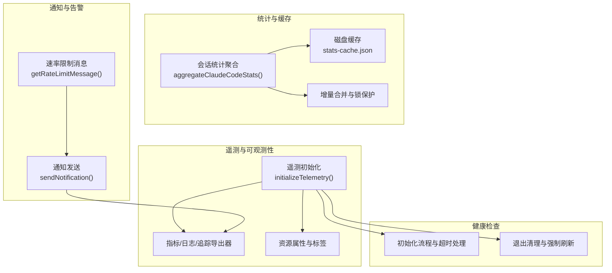
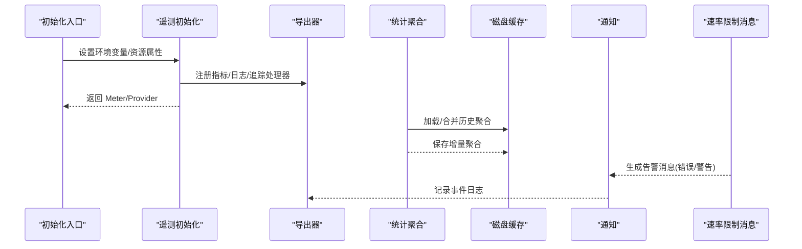
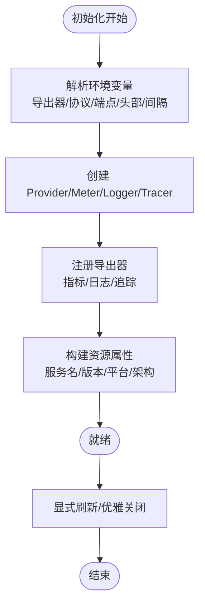
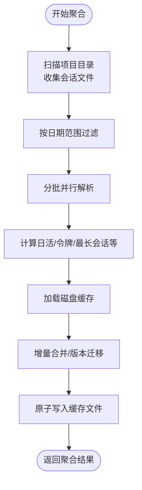
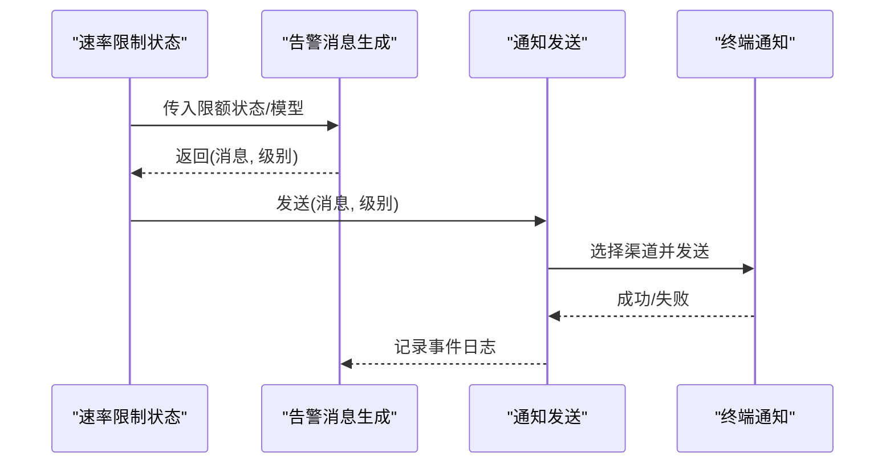
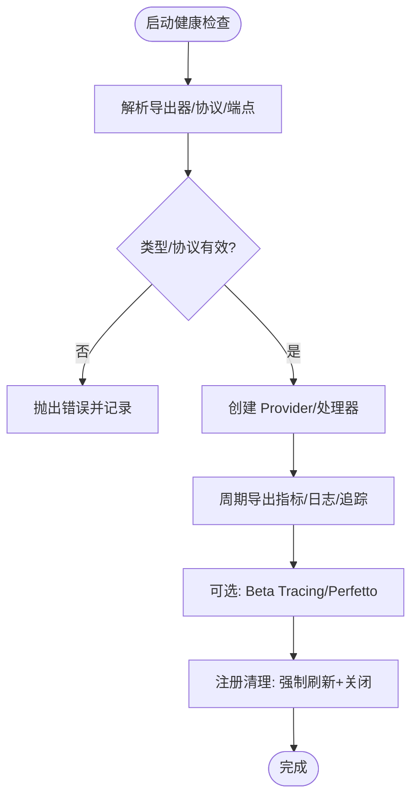
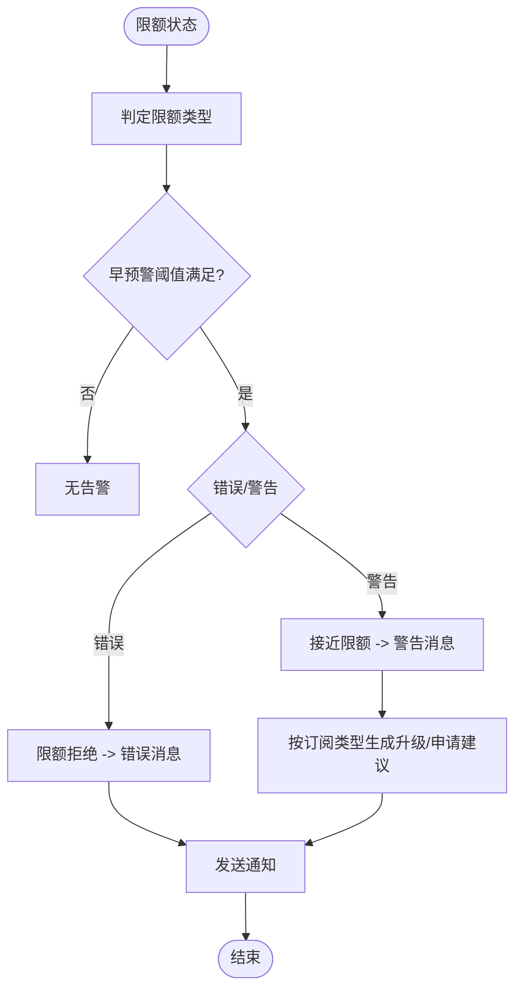
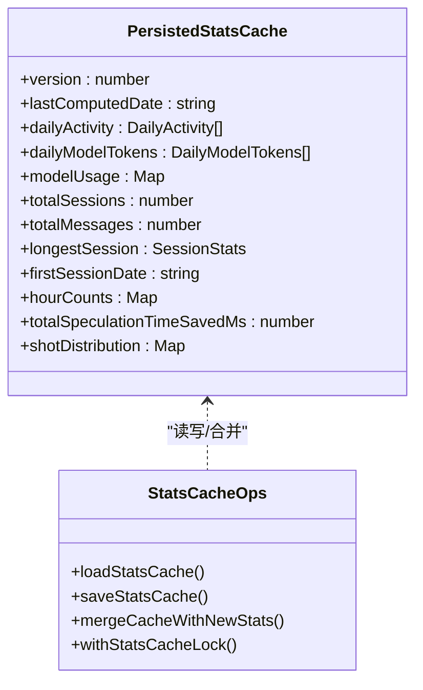
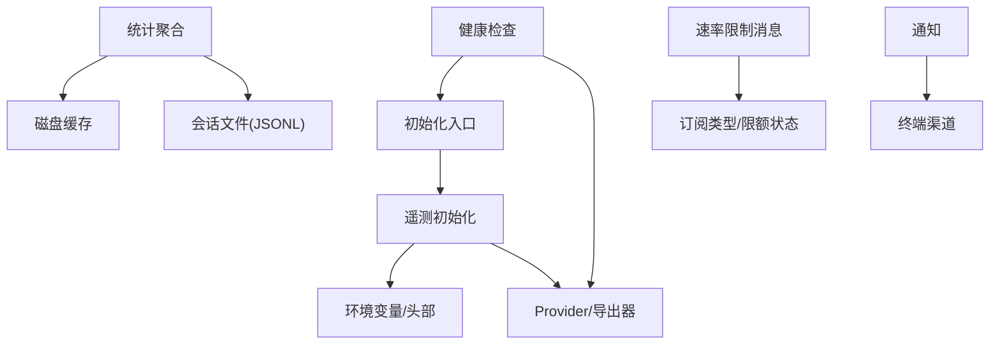

# 监控和告警

<cite>
**本文引用的文件**
- [docs/en/01-telemetry-and-privacy.md](file://docs/en/01-telemetry-and-privacy.md)
- [src/utils/telemetry/instrumentation.ts](file://src/utils/telemetry/instrumentation.ts)
- [src/utils/telemetry/logger.ts](file://src/utils/telemetry/logger.ts)
- [src/utils/telemetryAttributes.ts](file://src/utils/telemetryAttributes.ts)
- [src/entrypoints/init.ts](file://src/entrypoints/init.ts)
- [src/utils/stats.ts](file://src/utils/stats.ts)
- [src/utils/statsCache.ts](file://src/utils/statsCache.ts)
- [src/context/stats.tsx](file://src/context/stats.tsx)
- [src/services/notifier.ts](file://src/services/notifier.ts)
- [src/services/rateLimitMessages.ts](file://src/services/rateLimitMessages.ts)
- [src/services/claudeAiLimits.ts](file://src/services/claudeAiLimits.ts)
- [src/utils/memoize.ts](file://src/utils/memoize.ts)
</cite>

## 目录
1. [简介](#简介)
2. [项目结构](#项目结构)
3. [核心组件](#核心组件)
4. [架构总览](#架构总览)
5. [详细组件分析](#详细组件分析)
6. [依赖关系分析](#依赖关系分析)
7. [性能考量](#性能考量)
8. [故障排查指南](#故障排查指南)
9. [结论](#结论)
10. [附录](#附录)

## 简介
本文件面向 Claude Code 的监控与告警体系，系统化梳理性能指标采集（系统资源、API 调用统计、用户行为）、健康检查（服务可用性、依赖状态、系统完整性）、告警策略与通知机制（阈值、级别、渠道）、统计缓存（聚合、缓存策略、性能优化）、速率限制监控与告警（用量跟踪、限额检查、用户提醒），并给出监控仪表板设计思路与数据存储、查询、可视化的建议。文中所有技术细节均基于仓库源码分析与注释。

## 项目结构
围绕监控与告警的关键目录与文件如下：
- 遥测与可观测性：OpenTelemetry 初始化、导出器选择、资源属性、日志/追踪/指标生命周期管理
- 统计与缓存：会话统计聚合、磁盘缓存、增量合并、锁保护
- 通知与告警：终端通知通道、速率限制消息生成与分级
- 健康检查：遥测初始化流程、超时与关闭清理、环境变量驱动的导出协议

**章节来源**
- [src/utils/telemetry/instrumentation.ts:421-701](file://src/utils/telemetry/instrumentation.ts#L421-L701)
- [src/utils/stats.ts:640-710](file://src/utils/stats.ts#L640-L710)
- [src/utils/statsCache.ts:147-208](file://src/utils/statsCache.ts#L147-L208)
- [src/services/notifier.ts:18-36](file://src/services/notifier.ts#L18-L36)
- [src/services/rateLimitMessages.ts:45-104](file://src/services/rateLimitMessages.ts#L45-L104)

## 核心组件
- 遥测初始化与导出：通过环境变量选择导出器类型与协议，按周期导出指标、日志与追踪；支持 BigQuery 指标导出；提供显式刷新与优雅关闭。
- 统计聚合与缓存：对会话文件进行分批并行解析，计算日活、令牌使用、最长会话等指标，并以磁盘缓存持久化历史聚合结果，避免重复计算。
- 通知与告警：根据首选通知渠道自动选择终端通知方式；速率限制告警按“错误/警告”两级输出，结合订阅类型与限额状态动态生成文案。
- 健康检查：初始化阶段进行资源探测、代理与 mTLS 配置、超时与关闭清理；支持 Beta Tracing 与 Perfetto 追踪。

**章节来源**
- [src/utils/telemetry/instrumentation.ts:421-701](file://src/utils/telemetry/instrumentation.ts#L421-L701)
- [src/utils/stats.ts:640-710](file://src/utils/stats.ts#L640-L710)
- [src/services/notifier.ts:18-36](file://src/services/notifier.ts#L18-L36)
- [src/services/rateLimitMessages.ts:45-104](file://src/services/rateLimitMessages.ts#L45-L104)

## 架构总览
下图展示了监控与告警在系统中的交互关系：遥测负责指标/日志/追踪的采集与导出；统计模块负责离线聚合与缓存；通知模块负责告警消息的渠道投递；健康检查贯穿初始化、运行期与退出阶段。

**图表来源**
- [src/utils/telemetry/instrumentation.ts:421-701](file://src/utils/telemetry/instrumentation.ts#L421-L701)
- [src/utils/stats.ts:640-710](file://src/utils/stats.ts#L640-L710)
- [src/utils/statsCache.ts:147-208](file://src/utils/statsCache.ts#L147-L208)
- [src/services/notifier.ts:18-36](file://src/services/notifier.ts#L18-L36)
- [src/services/rateLimitMessages.ts:45-104](file://src/services/rateLimitMessages.ts#L45-L104)

**章节来源**
- [src/utils/telemetry/instrumentation.ts:421-701](file://src/utils/telemetry/instrumentation.ts#L421-L701)
- [src/utils/stats.ts:640-710](file://src/utils/stats.ts#L640-L710)
- [src/utils/statsCache.ts:147-208](file://src/utils/statsCache.ts#L147-L208)
- [src/services/notifier.ts:18-36](file://src/services/notifier.ts#L18-L36)
- [src/services/rateLimitMessages.ts:45-104](file://src/services/rateLimitMessages.ts#L45-L104)

## 详细组件分析

### 遥测与可观测性（性能指标采集）
- 初始化流程：解析环境变量（导出器类型、协议、端点、头部、间隔）；按需注册指标、日志、追踪处理器；支持 Beta Tracing 与 Perfetto。
- 导出器选择：支持 console、otlp（grpc/http/json/proto）、prometheus；指标默认周期导出，日志/追踪可配置周期。
- 资源属性：服务名、版本、平台、WSL 版本、主机架构、环境变量等；支持动态头（如 otelHeadersHelper）与静态头叠加。
- 生命周期管理：提供 flushTelemetry 与优雅关闭，带超时保护；支持 BigQuery 指标导出（特定订阅类型）。
- 日志记录：自定义诊断日志器，统一错误/警告输出到调试日志与错误日志。

**图表来源**
- [src/utils/telemetry/instrumentation.ts:421-701](file://src/utils/telemetry/instrumentation.ts#L421-L701)
- [src/utils/telemetry/logger.ts:1-27](file://src/utils/telemetry/logger.ts#L1-L27)

**章节来源**
- [src/utils/telemetry/instrumentation.ts:421-701](file://src/utils/telemetry/instrumentation.ts#L421-L701)
- [src/utils/telemetry/logger.ts:1-27](file://src/utils/telemetry/logger.ts#L1-L27)
- [src/utils/telemetryAttributes.ts:1-44](file://src/utils/telemetryAttributes.ts#L1-L44)
- [src/entrypoints/init.ts:288-303](file://src/entrypoints/init.ts#L288-L303)

### 统计与缓存（用户行为与会话指标）
- 数据来源：项目目录下的会话 JSONL 文件（含子代理会话），按日期范围过滤与并行批处理。
- 指标计算：日活（消息数/会话数/工具调用）、每日模型令牌使用、最长会话、活跃天数、峰值时段、推测节省时间等。
- 缓存策略：磁盘缓存（stats-cache.json）持久化历史聚合；withStatsCacheLock 防并发；mergeCacheWithNewStats 增量合并；版本迁移与缺失字段回退。
- 实时与历史分离：历史数据离线重算并落盘，当日数据在线实时聚合，避免不完整数据污染缓存。

**图表来源**
- [src/utils/stats.ts:117-368](file://src/utils/stats.ts#L117-L368)
- [src/utils/stats.ts:640-710](file://src/utils/stats.ts#L640-L710)
- [src/utils/statsCache.ts:147-208](file://src/utils/statsCache.ts#L147-L208)
- [src/utils/statsCache.ts:260-398](file://src/utils/statsCache.ts#L260-L398)

**章节来源**
- [src/utils/stats.ts:117-368](file://src/utils/stats.ts#L117-L368)
- [src/utils/stats.ts:640-710](file://src/utils/stats.ts#L640-L710)
- [src/utils/statsCache.ts:147-208](file://src/utils/statsCache.ts#L147-L208)
- [src/utils/statsCache.ts:260-398](file://src/utils/statsCache.ts#L260-L398)

### 通知与告警（阈值、级别与渠道）
- 通知渠道：自动检测终端类型并选择 iTerm2/Kitty/Ghostty/铃声等；支持禁用通知；记录使用的渠道用于分析。
- 速率限制告警：按“错误/警告”两级输出；错误用于直接阻断（如限额拒绝），警告用于提前提示（接近或超过阈值）；文案随订阅类型与限额类型动态生成。
- 提示策略：针对团队/企业用户在启用额外用量时，避免对非计费用户显示计划限额警告；对不同限额类型（周/会话/模型）给出差异化提示与升级/申请建议。

**图表来源**
- [src/services/rateLimitMessages.ts:45-104](file://src/services/rateLimitMessages.ts#L45-L104)
- [src/services/notifier.ts:18-36](file://src/services/notifier.ts#L18-L36)

**章节来源**
- [src/services/notifier.ts:18-36](file://src/services/notifier.ts#L18-L36)
- [src/services/rateLimitMessages.ts:45-104](file://src/services/rateLimitMessages.ts#L45-L104)
- [src/services/rateLimitMessages.ts:199-254](file://src/services/rateLimitMessages.ts#L199-L254)

### 健康检查与完整性验证
- 初始化健康：解析导出器类型与协议，校验未知类型/协议；动态导入导出器减少首启体积；资源探测与环境变量覆盖。
- 运行期健康：日志/追踪/指标处理器批量导出，支持 Beta Tracing 与 Perfetto；BigQuery 指标导出按订阅类型启用。
- 关闭与清理：注册退出清理函数，强制刷新并优雅关闭；超时保护防止长时间阻塞；支持手动 flushTelemetry。

**图表来源**
- [src/utils/telemetry/instrumentation.ts:121-215](file://src/utils/telemetry/instrumentation.ts#L121-L215)
- [src/utils/telemetry/instrumentation.ts:324-347](file://src/utils/telemetry/instrumentation.ts#L324-L347)
- [src/utils/telemetry/instrumentation.ts:653-699](file://src/utils/telemetry/instrumentation.ts#L653-L699)

**章节来源**
- [src/utils/telemetry/instrumentation.ts:121-215](file://src/utils/telemetry/instrumentation.ts#L121-L215)
- [src/utils/telemetry/instrumentation.ts:324-347](file://src/utils/telemetry/instrumentation.ts#L324-L347)
- [src/utils/telemetry/instrumentation.ts:653-699](file://src/utils/telemetry/instrumentation.ts#L653-L699)

### 速率限制监控与告警（使用量跟踪、限额检查、用户提醒）
- 限额类型与阈值：五小时会话限额、七日周限额、Opus/Sonnet 专属限额、超支（overage）限额；内置早预警阈值配置。
- 早预警逻辑：当利用率或窗口耗尽比例达到阈值时触发警告；支持基于时间进度的回退计算。
- 文案与升级建议：根据订阅类型与限额类型动态生成文案；团队/企业用户在启用额外用量时，可能不显示计划限额警告；提供升级/申请命令提示。
- 过渡态通知：进入超支模式时生成过渡通知，包含重置时间提示。

**图表来源**
- [src/services/claudeAiLimits.ts:50-103](file://src/services/claudeAiLimits.ts#L50-L103)
- [src/services/rateLimitMessages.ts:45-104](file://src/services/rateLimitMessages.ts#L45-L104)
- [src/services/rateLimitMessages.ts:199-254](file://src/services/rateLimitMessages.ts#L199-L254)

**章节来源**
- [src/services/claudeAiLimits.ts:50-103](file://src/services/claudeAiLimits.ts#L50-L103)
- [src/services/rateLimitMessages.ts:45-104](file://src/services/rateLimitMessages.ts#L45-L104)
- [src/services/rateLimitMessages.ts:199-254](file://src/services/rateLimitMessages.ts#L199-L254)

### 统计缓存系统（数据聚合、缓存策略、性能优化）
- 缓存结构：版本号、最后计算日期、日活/模型令牌、模型使用聚合、会话聚合、首次会话日期、小时分布、推测节省时间、射击分布（特性开关）。
- 原子写入：临时文件 + 重命名，确保写入一致性；失败清理临时文件。
- 并发控制：withStatsCacheLock 防止并发写入；合并时按日期键合并，避免重复计算。
- 性能优化：分批并行解析会话文件；仅在必要时重新计算；当日数据在线实时聚合，历史数据离线缓存。

**图表来源**
- [src/utils/statsCache.ts:53-75](file://src/utils/statsCache.ts#L53-L75)
- [src/utils/statsCache.ts:147-208](file://src/utils/statsCache.ts#L147-L208)
- [src/utils/statsCache.ts:260-398](file://src/utils/statsCache.ts#L260-L398)

**章节来源**
- [src/utils/statsCache.ts:53-75](file://src/utils/statsCache.ts#L53-L75)
- [src/utils/statsCache.ts:147-208](file://src/utils/statsCache.ts#L147-L208)
- [src/utils/statsCache.ts:260-398](file://src/utils/statsCache.ts#L260-L398)

### 监控仪表板设计与数据可视化
- 关键指标建议：
  - 会话指标：总会话数、总消息数、活跃天数、最长会话时长、峰值活动日/小时
  - 使用趋势：每日消息数/会话数/工具调用数、每日模型令牌使用热力图
  - 推测节省：推测节省时间累计
  - 速率限制：限额类型分布、接近/拒绝次数、超支使用时长
- 可视化建议：
  - 折线图：7/30 天趋势
  - 热力图：日活热力图
  - 条形图：模型令牌使用分布
  - 指标卡片：当前会话时长、消息数、令牌消耗、告警状态
- 实时更新：统计模块按日增量更新缓存，仪表板定时拉取最新聚合结果；遥测指标按周期导出，支持 Prometheus 或 OTLP 查询。

[本节为概念性设计说明，不直接分析具体文件]

## 依赖关系分析
- 遥测初始化依赖环境变量与认证头（动态/静态）；BigQuery 导出依赖订阅类型判断。
- 统计模块依赖会话文件结构与磁盘缓存；缓存读写受锁保护；版本迁移保证兼容性。
- 通知模块依赖终端环境检测与首选渠道配置；速率限制消息依赖订阅类型与限额状态。
- 健康检查贯穿初始化、运行期与退出阶段，涉及超时与清理。

**图表来源**
- [src/entrypoints/init.ts:288-303](file://src/entrypoints/init.ts#L288-L303)
- [src/utils/telemetry/instrumentation.ts:768-800](file://src/utils/telemetry/instrumentation.ts#L768-L800)
- [src/utils/stats.ts:374-435](file://src/utils/stats.ts#L374-L435)
- [src/utils/statsCache.ts:147-208](file://src/utils/statsCache.ts#L147-L208)
- [src/services/rateLimitMessages.ts:82-94](file://src/services/rateLimitMessages.ts#L82-L94)
- [src/services/notifier.ts:40-75](file://src/services/notifier.ts#L40-L75)

**章节来源**
- [src/entrypoints/init.ts:288-303](file://src/entrypoints/init.ts#L288-L303)
- [src/utils/telemetry/instrumentation.ts:768-800](file://src/utils/telemetry/instrumentation.ts#L768-L800)
- [src/utils/stats.ts:374-435](file://src/utils/stats.ts#L374-L435)
- [src/utils/statsCache.ts:147-208](file://src/utils/statsCache.ts#L147-L208)
- [src/services/rateLimitMessages.ts:82-94](file://src/services/rateLimitMessages.ts#L82-L94)
- [src/services/notifier.ts:40-75](file://src/services/notifier.ts#L40-L75)

## 性能考量
- 遥测延迟与体积：按需动态导入导出器，减少首启体积；指标默认 delta 模式与时序偏好；可配置导出间隔。
- 统计性能：分批并行解析会话文件；仅在必要时重新计算；当日数据在线聚合，历史数据离线缓存；LRU/写穿透缓存策略（见 memoize）。
- 缓存一致性：原子写入 + 重命名；版本迁移；锁保护；增量合并。
- 通知与告警：异步发送，失败不影响主流程；超时保护与降级路径。

[本节为通用性能讨论，不直接分析具体文件]

## 故障排查指南
- 遥测初始化失败：检查导出器类型/协议/端点/头部是否正确；确认代理与 mTLS 配置；查看诊断日志器输出。
- 导出超时：增大 CLAUDE_CODE_OTEL_SHUTDOWN_TIMEOUT_MS；检查后端性能；必要时禁用遥测。
- 统计缓存异常：检查缓存文件权限与磁盘空间；确认版本迁移成功；查看锁冲突日志。
- 通知失败：检查终端类型与首选渠道；确认终端通知能力；查看通知钩子执行情况。
- 速率限制告警不生效：核对订阅类型与限额状态；检查早预警阈值配置；确认文案生成逻辑分支。

**章节来源**
- [src/utils/telemetry/instrumentation.ts:673-694](file://src/utils/telemetry/instrumentation.ts#L673-L694)
- [src/utils/statsCache.ts:147-208](file://src/utils/statsCache.ts#L147-L208)
- [src/services/notifier.ts:110-156](file://src/services/notifier.ts#L110-L156)
- [src/services/rateLimitMessages.ts:67-100](file://src/services/rateLimitMessages.ts#L67-L100)

## 结论
Claude Code 的监控与告警体系以 OpenTelemetry 为核心，结合本地统计缓存与终端通知渠道，形成从指标采集、离线聚合、实时告警到健康检查的闭环。通过环境变量与订阅类型驱动的导出策略、版本化缓存与锁保护、以及分级告警与渠道适配，系统在保证可观测性的同时兼顾性能与可靠性。建议在生产环境中配合 Prometheus/OTLP 查询与仪表板展示，持续优化阈值与可视化指标，提升运维效率与用户体验。

## 附录
- 遥测与隐私概览（来自文档）：包含数据管道架构、采集内容、不可禁用的第一方日志、第三方共享与工具详情开关等。

**章节来源**
- [docs/en/01-telemetry-and-privacy.md:1-125](file://docs/en/01-telemetry-and-privacy.md#L1-L125)