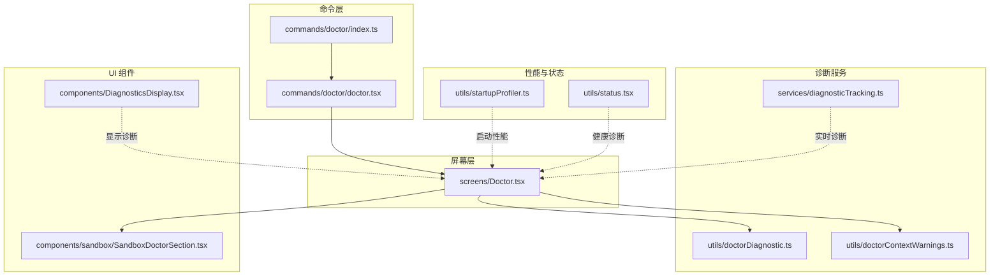
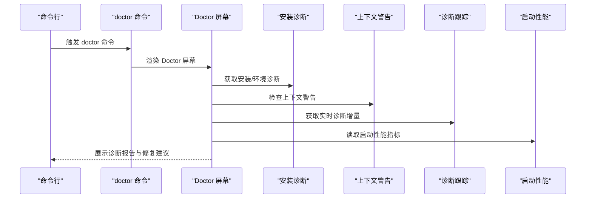
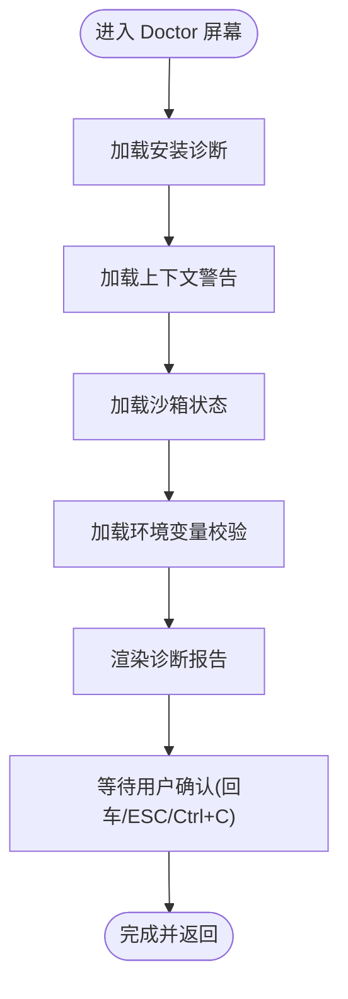
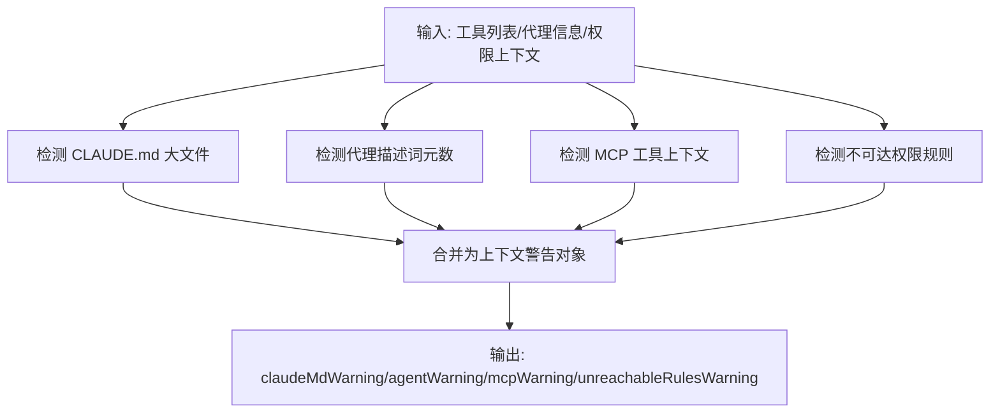
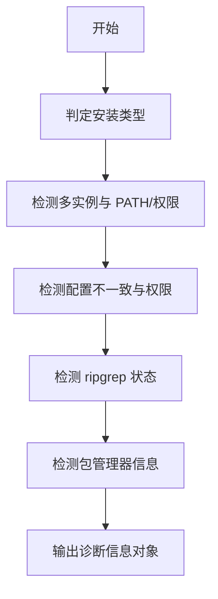
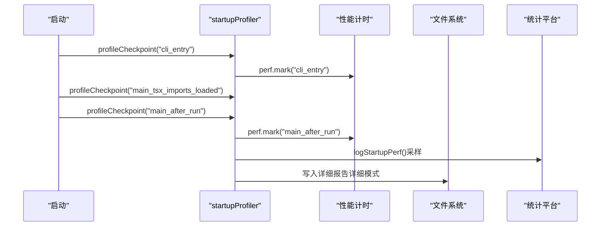
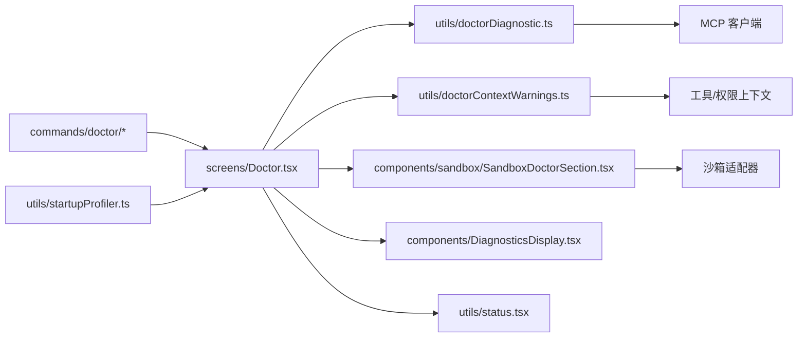

# 诊断工具

<cite>
**本文引用的文件**
- [src/services/diagnosticTracking.ts](file://src/services/diagnosticTracking.ts)
- [src/screens/Doctor.tsx](file://src/screens/Doctor.tsx)
- [src/utils/doctorContextWarnings.ts](file://src/utils/doctorContextWarnings.ts)
- [src/utils/doctorDiagnostic.ts](file://src/utils/doctorDiagnostic.ts)
- [src/commands/doctor/index.ts](file://src/commands/doctor/index.ts)
- [src/commands/doctor/doctor.tsx](file://src/commands/doctor/doctor.tsx)
- [src/components/sandbox/SandboxDoctorSection.tsx](file://src/components/sandbox/SandboxDoctorSection.tsx)
- [src/utils/startupProfiler.ts](file://src/utils/startupProfiler.ts)
- [src/components/DiagnosticsDisplay.tsx](file://src/components/DiagnosticsDisplay.tsx)
- [src/utils/status.tsx](file://src/utils/status.tsx)
</cite>

## 目录
1. [简介](#简介)
2. [项目结构](#项目结构)
3. [核心组件](#核心组件)
4. [架构总览](#架构总览)
5. [详细组件分析](#详细组件分析)
6. [依赖关系分析](#依赖关系分析)
7. [性能考量](#性能考量)
8. [故障排查指南](#故障排查指南)
9. [结论](#结论)
10. [附录](#附录)

## 简介
本技术文档围绕 Claude Code 的诊断工具系统，系统化阐述诊断跟踪机制、医生屏幕实现、启动通知与状态监控、用户界面设计、自动与手动诊断能力，以及诊断数据的采集与分析方法。文档面向不同层次读者，既提供代码级细节，也给出可视化图表帮助理解整体架构。

## 项目结构
诊断工具相关模块主要分布在以下位置：
- 命令入口：commands/doctor（注册与加载）
- 医生屏幕：screens/Doctor.tsx（UI 展示与交互）
- 诊断逻辑：
  - 安装与环境诊断：utils/doctorDiagnostic.ts
  - 上下文警告（大文件/代理/工具上下文）：utils/doctorContextWarnings.ts
  - 实时诊断跟踪：services/diagnosticTracking.ts
- 启动性能分析：utils/startupProfiler.ts
- UI 组件：components/DiagnosticsDisplay.tsx、components/sandbox/SandboxDoctorSection.tsx
- 状态与健康诊断辅助：utils/status.tsx



**图表来源**
- [src/commands/doctor/index.ts:1-13](file://src/commands/doctor/index.ts#L1-L13)
- [src/commands/doctor/doctor.tsx:1-7](file://src/commands/doctor/doctor.tsx#L1-L7)
- [src/screens/Doctor.tsx:1-575](file://src/screens/Doctor.tsx#L1-L575)
- [src/services/diagnosticTracking.ts:1-398](file://src/services/diagnosticTracking.ts#L1-L398)
- [src/utils/doctorDiagnostic.ts:1-626](file://src/utils/doctorDiagnostic.ts#L1-L626)
- [src/utils/doctorContextWarnings.ts:1-266](file://src/utils/doctorContextWarnings.ts#L1-L266)
- [src/components/DiagnosticsDisplay.tsx:1-86](file://src/components/DiagnosticsDisplay.tsx#L1-L86)
- [src/components/sandbox/SandboxDoctorSection.tsx:1-46](file://src/components/sandbox/SandboxDoctorSection.tsx#L1-L46)
- [src/utils/startupProfiler.ts:1-195](file://src/utils/startupProfiler.ts#L1-L195)
- [src/utils/status.tsx:1-187](file://src/utils/status.tsx#L1-L187)

**章节来源**
- [src/commands/doctor/index.ts:1-13](file://src/commands/doctor/index.ts#L1-L13)
- [src/commands/doctor/doctor.tsx:1-7](file://src/commands/doctor/doctor.tsx#L1-L7)
- [src/screens/Doctor.tsx:1-575](file://src/screens/Doctor.tsx#L1-L575)

## 核心组件
- 诊断跟踪服务（DiagnosticTrackingService）
  - 负责捕获文件编辑前后的诊断基线，比较差异，输出新增诊断；支持多协议 URI（file、_claude_fs_right）归一化路径与 Windows 兼容。
  - 提供格式化诊断摘要、严重级别符号映射等能力。
- 医生屏幕（Doctor）
  - 集中展示安装信息、更新通道、版本锁、插件错误、上下文警告、沙箱状态、环境变量校验等，并提供“继续”确认交互。
- 上下文警告检查（checkContextWarnings）
  - 检测 CLAUDE.md 大文件、代理描述词元数、MCP 工具上下文大小、不可达权限规则等。
- 安装与环境诊断（getDoctorDiagnostic）
  - 判定安装类型（本地/全局/NPM/原生/包管理器/开发），检测多实例、PATH、权限、ripgrep 状态、包管理器信息等。
- 启动性能分析（startupProfiler）
  - 记录关键启动阶段时间，采样上报到统计平台或生成详细报告文件。
- UI 组件
  - DiagnosticsDisplay：在消息流中展示新诊断数量与文件数。
  - SandboxDoctorSection：展示沙箱依赖检查结果与安装指引。

**章节来源**
- [src/services/diagnosticTracking.ts:30-398](file://src/services/diagnosticTracking.ts#L30-L398)
- [src/screens/Doctor.tsx:100-502](file://src/screens/Doctor.tsx#L100-L502)
- [src/utils/doctorContextWarnings.ts:246-266](file://src/utils/doctorContextWarnings.ts#L246-L266)
- [src/utils/doctorDiagnostic.ts:514-626](file://src/utils/doctorDiagnostic.ts#L514-L626)
- [src/utils/startupProfiler.ts:1-195](file://src/utils/startupProfiler.ts#L1-L195)
- [src/components/DiagnosticsDisplay.tsx:1-86](file://src/components/DiagnosticsDisplay.tsx#L1-L86)
- [src/components/sandbox/SandboxDoctorSection.tsx:1-46](file://src/components/sandbox/SandboxDoctorSection.tsx#L1-L46)

## 架构总览
诊断工具采用“命令驱动 + 屏幕渲染 + 服务支撑”的分层架构：
- 命令层负责注册与加载医生屏幕组件；
- 屏幕层聚合多项诊断信息并以终端 UI 展示；
- 服务层提供实时诊断跟踪、上下文警告与安装诊断；
- 性能与状态模块提供启动性能与健康诊断辅助。



**图表来源**
- [src/commands/doctor/index.ts:4-10](file://src/commands/doctor/index.ts#L4-L10)
- [src/commands/doctor/doctor.tsx:4-6](file://src/commands/doctor/doctor.tsx#L4-L6)
- [src/screens/Doctor.tsx:119-221](file://src/screens/Doctor.tsx#L119-L221)
- [src/utils/doctorDiagnostic.ts:514-626](file://src/utils/doctorDiagnostic.ts#L514-L626)
- [src/utils/doctorContextWarnings.ts:246-266](file://src/utils/doctorContextWarnings.ts#L246-L266)
- [src/services/diagnosticTracking.ts:188-283](file://src/services/diagnosticTracking.ts#L188-L283)
- [src/utils/startupProfiler.ts:159-194](file://src/utils/startupProfiler.ts#L159-L194)

## 详细组件分析

### 诊断跟踪服务（DiagnosticTrackingService）
- 初始化与生命周期
  - 单例模式，支持初始化、重置与关闭清理。
  - 通过 MCP 客户端调用 IDE 的 openFile/getDiagnostics 接口。
- 路径归一化与协议处理
  - 支持 file://、_claude_fs_right、_claude_fs_left 等协议前缀，统一转换为可比较的规范化路径，兼容 Windows 大小写与分隔符。
- 基线与增量对比
  - 编辑前抓取基线；编辑后获取全部诊断，过滤 file:// 与 _claude_fs_right，按右文件优先策略选择诊断源，计算新增诊断并更新基线。
- 输出与格式化
  - 将诊断汇总为人类可读字符串，限制最大长度并截断标记。

```mermaid
classDiagram
class DiagnosticTrackingService {
-baseline : Map<string, Diagnostic[]>
-lastProcessedTimestamps : Map<string, number>
-rightFileDiagnosticsState : Map<string, Diagnostic[]>
-initialized : boolean
-mcpClient : MCPServerConnection
+initialize(mcpClient)
+shutdown()
+reset()
+beforeFileEdited(filePath)
+getNewDiagnostics()
+formatDiagnosticsSummary(files)
+getSeveritySymbol(severity)
}
class Diagnostic {
+message : string
+severity : "Error"|"Warning"|"Info"|"Hint"
+range : {start : {line,character}, end : {line,character}}
+source? : string
+code? : string
}
DiagnosticTrackingService --> Diagnostic : "管理"
```

**图表来源**
- [src/services/diagnosticTracking.ts:30-398](file://src/services/diagnosticTracking.ts#L30-L398)

**章节来源**
- [src/services/diagnosticTracking.ts:30-398](file://src/services/diagnosticTracking.ts#L30-L398)

### 医生屏幕（Doctor）
- 数据来源
  - 安装诊断：安装类型、版本、路径、调用二进制、配置安装方式、自动更新状态、多实例、ripgrep 状态、包管理器信息等。
  - 上下文警告：CLAUDE.md 大文件、代理描述词元数、MCP 工具上下文、不可达权限规则。
  - 版本锁：PID 基于锁的清理与展示。
  - 插件错误、无效设置、沙箱依赖检查、环境变量校验。
- 用户交互
  - 提供“按回车继续”确认，支持键盘快捷键退出。
- 展示结构
  - 安装与更新、版本锁、插件错误、上下文警告、沙箱状态、环境变量、继续按钮等区块。



**图表来源**
- [src/screens/Doctor.tsx:119-221](file://src/screens/Doctor.tsx#L119-L221)

**章节来源**
- [src/screens/Doctor.tsx:100-502](file://src/screens/Doctor.tsx#L100-L502)

### 上下文警告检查（checkContextWarnings）
- 检测维度
  - CLAUDE.md 文件：超过阈值的大文件数量与大小。
  - 代理描述：活动代理描述的总词元数，排序展示前 N 个。
  - MCP 工具：按服务器聚合工具数量与词元估算，超阈值时给出服务器分布详情。
  - 不可达权限规则：检测被更宽泛规则覆盖的细粒度允许规则。
- 并行执行与阈值控制
  - 使用 Promise.all 并行检查，避免阻塞；阈值来自常量与动态估计。



**图表来源**
- [src/utils/doctorContextWarnings.ts:246-266](file://src/utils/doctorContextWarnings.ts#L246-L266)

**章节来源**
- [src/utils/doctorContextWarnings.ts:43-241](file://src/utils/doctorContextWarnings.ts#L43-L241)

### 安装与环境诊断（getDoctorDiagnostic）
- 安装类型判定
  - 开发模式、打包/原生、本地 NPM、全局 NPM、包管理器安装等。
- 多实例检测
  - 搜索本地/全局/NPM Orphan/Native 安装路径，排除当前 Homebrew 指向的同源安装。
- 配置与权限
  - PATH 校验（原生安装）、配置不一致警告、权限不足提示、Linux 沙箱通配符警告。
- 运行时信息
  - ripgrep 状态（工作状态、模式、系统路径）、包管理器信息、自动更新状态与原因。



**图表来源**
- [src/utils/doctorDiagnostic.ts:514-626](file://src/utils/doctorDiagnostic.ts#L514-L626)

**章节来源**
- [src/utils/doctorDiagnostic.ts:86-148](file://src/utils/doctorDiagnostic.ts#L86-L148)
- [src/utils/doctorDiagnostic.ts:205-315](file://src/utils/doctorDiagnostic.ts#L205-L315)
- [src/utils/doctorDiagnostic.ts:317-485](file://src/utils/doctorDiagnostic.ts#L317-L485)
- [src/utils/doctorDiagnostic.ts:514-626](file://src/utils/doctorDiagnostic.ts#L514-L626)

### 启动性能分析（startupProfiler）
- 功能特性
  - 两种模式：采样日志（Statsig）与详细分析（环境变量开启）。
  - 关键阶段打点（导入、初始化、设置加载、总耗时）。
  - 可选内存快照与报告落盘。
- 采样策略
  - Ant 用户 100% 采样，外部用户 0.5% 采样；未采样用户无性能开销。



**图表来源**
- [src/utils/startupProfiler.ts:56-145](file://src/utils/startupProfiler.ts#L56-L145)
- [src/utils/startupProfiler.ts:159-194](file://src/utils/startupProfiler.ts#L159-L194)

**章节来源**
- [src/utils/startupProfiler.ts:1-195](file://src/utils/startupProfiler.ts#L1-L195)

### UI 组件与交互
- DiagnosticsDisplay
  - 在消息响应中展示“发现 X 个新诊断，涉及 Y 个文件”，并提供展开提示。
- SandboxDoctorSection
  - 当平台支持且启用沙箱时，展示依赖检查结果与安装指引；若存在错误则高亮提示。

**章节来源**
- [src/components/DiagnosticsDisplay.tsx:45-86](file://src/components/DiagnosticsDisplay.tsx#L45-L86)
- [src/components/sandbox/SandboxDoctorSection.tsx:5-39](file://src/components/sandbox/SandboxDoctorSection.tsx#L5-L39)

## 依赖关系分析
- 命令层依赖屏幕层；屏幕层依赖诊断与上下文警告模块；诊断跟踪服务通过 MCP 客户端与 IDE 交互。
- Doctor 屏幕还依赖沙箱适配器、环境变量校验、包管理器检测、ripgrep 状态等工具模块。
- 启动性能分析独立于诊断流程，但可与 Doctor 屏幕共同呈现。



**图表来源**
- [src/commands/doctor/index.ts:1-13](file://src/commands/doctor/index.ts#L1-L13)
- [src/commands/doctor/doctor.tsx:1-7](file://src/commands/doctor/doctor.tsx#L1-L7)
- [src/screens/Doctor.tsx:1-575](file://src/screens/Doctor.tsx#L1-L575)
- [src/utils/doctorDiagnostic.ts:1-626](file://src/utils/doctorDiagnostic.ts#L1-L626)
- [src/utils/doctorContextWarnings.ts:1-266](file://src/utils/doctorContextWarnings.ts#L1-L266)
- [src/components/sandbox/SandboxDoctorSection.tsx:1-46](file://src/components/sandbox/SandboxDoctorSection.tsx#L1-L46)
- [src/components/DiagnosticsDisplay.tsx:1-86](file://src/components/DiagnosticsDisplay.tsx#L1-L86)
- [src/utils/status.tsx:1-187](file://src/utils/status.tsx#L1-L187)
- [src/utils/startupProfiler.ts:1-195](file://src/utils/startupProfiler.ts#L1-L195)

**章节来源**
- [src/screens/Doctor.tsx:1-575](file://src/screens/Doctor.tsx#L1-L575)

## 性能考量
- 诊断跟踪
  - 基线缓存与路径归一化减少重复比较成本；仅对已编辑文件进行增量对比。
  - 对 IDE 诊断接口调用失败进行静默处理，避免阻塞主流程。
- 医生屏幕
  - 并行加载安装诊断、上下文警告、沙箱状态与环境变量校验，缩短首屏时间。
- 启动性能
  - 采样式日志与详细报告分离，避免对普通用户的性能影响；仅在详细模式下记录内存快照与落盘。

[本节为通用性能讨论，无需特定文件引用]

## 故障排查指南
- 安装与环境
  - 多实例：根据诊断提示清理遗留 NPM 安装或本地安装。
  - PATH：原生安装需确保 ~/.local/bin 在 PATH 中；Windows 下提供具体设置步骤。
  - 权限：全局 NPM 安装缺少权限时，建议使用原生安装或重新安装 Node。
- 上下文警告
  - 大 CLAUDE.md 文件：拆分内容或移除冗余片段。
  - 代理描述过长：简化描述或减少自定义代理数量。
  - MCP 工具过多：精简工具集或按服务器分组管理。
  - 不可达权限规则：调整规则顺序或删除冗余规则。
- 沙箱状态
  - 依赖缺失或警告：根据沙箱依赖检查结果安装所需组件。
- 实时诊断
  - 新增诊断：结合严重级别与范围定位问题文件，查看源与代码标识。

**章节来源**
- [src/utils/doctorDiagnostic.ts:526-566](file://src/utils/doctorDiagnostic.ts#L526-L566)
- [src/utils/doctorDiagnostic.ts:373-430](file://src/utils/doctorDiagnostic.ts#L373-L430)
- [src/utils/doctorContextWarnings.ts:43-114](file://src/utils/doctorContextWarnings.ts#L43-L114)
- [src/utils/doctorContextWarnings.ts:119-207](file://src/utils/doctorContextWarnings.ts#L119-L207)
- [src/utils/doctorContextWarnings.ts:212-241](file://src/utils/doctorContextWarnings.ts#L212-L241)
- [src/components/sandbox/SandboxDoctorSection.tsx:15-39](file://src/components/sandbox/SandboxDoctorSection.tsx#L15-L39)

## 结论
该诊断工具体系通过命令入口、屏幕渲染与服务支撑的清晰分层，实现了从安装环境到运行时上下文的全链路诊断。诊断跟踪服务提供实时增量检测，医生屏幕整合多维信息并给出修复建议，启动性能分析为稳定性评估提供依据。整体设计兼顾易用性与可扩展性，适合日常维护与问题定位。

[本节为总结性内容，无需特定文件引用]

## 附录
- 诊断流程示例（文字化）
  - 步骤 1：执行 doctor 命令，加载 Doctor 屏幕。
  - 步骤 2：并行获取安装诊断、上下文警告、沙箱状态与环境变量校验。
  - 步骤 3：展示诊断摘要与修复建议，等待用户确认。
  - 步骤 4：根据诊断结果执行清理/修复操作，再次运行 doctor 验证。

[本节为概念性说明，无需特定文件引用]