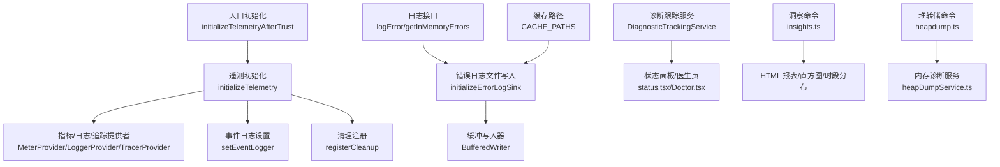
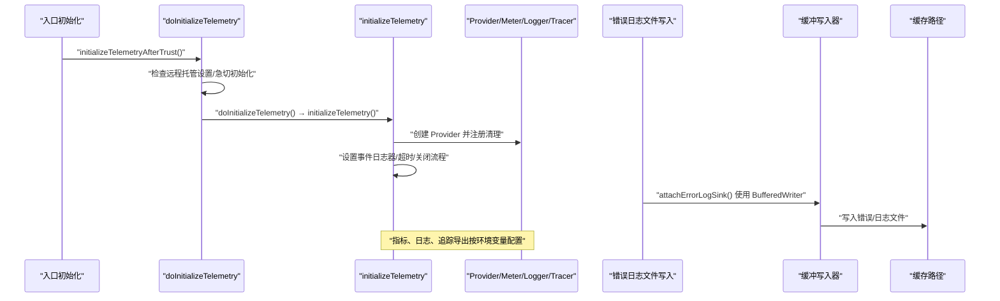
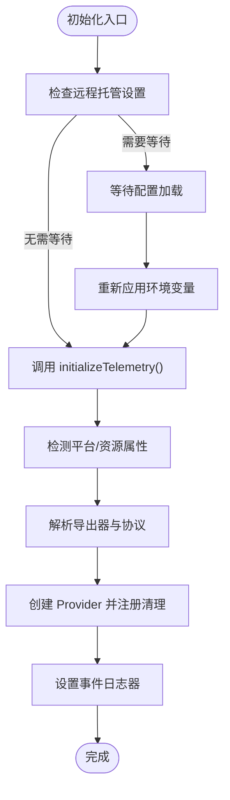
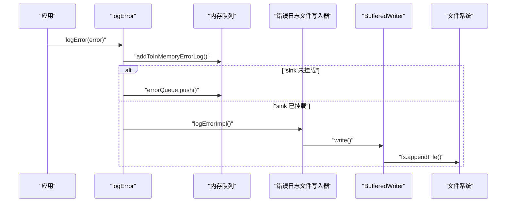
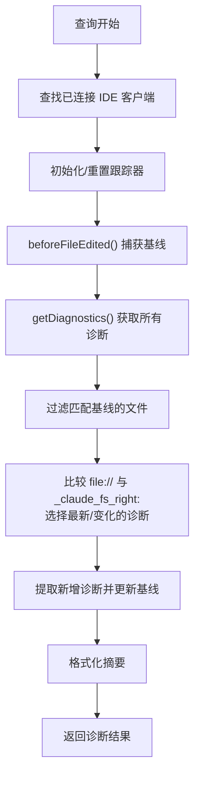
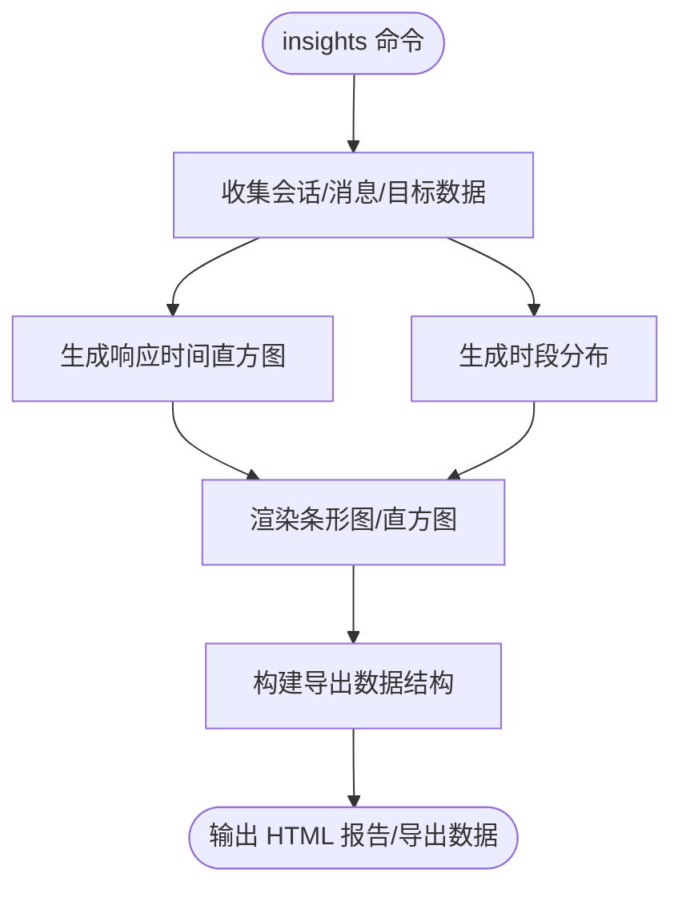
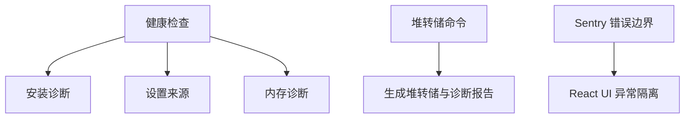
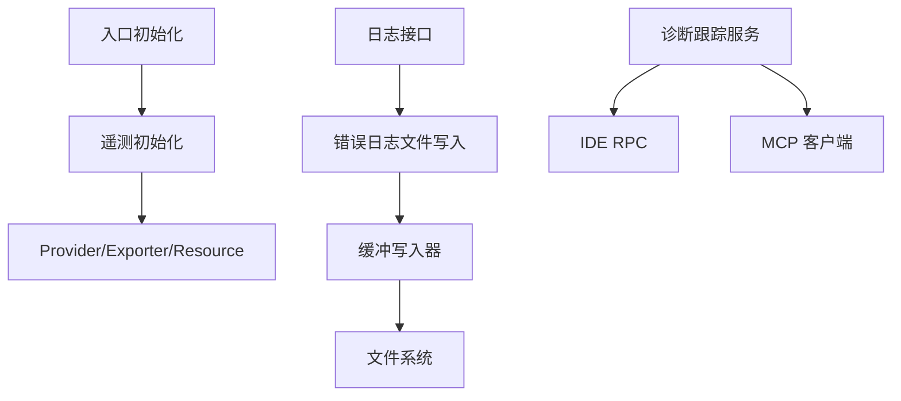

# 运维和监控

<cite>
**本文引用的文件**
- [src/entrypoints/init.ts](file://src/entrypoints/init.ts)
- [src/utils/telemetry/instrumentation.ts](file://src/utils/telemetry/instrumentation.ts)
- [src/utils/telemetryAttributes.ts](file://src/utils/telemetryAttributes.ts)
- [src/utils/auth.ts](file://src/utils/auth.ts)
- [src/utils/log.ts](file://src/utils/log.ts)
- [src/utils/errorLogSink.ts](file://src/utils/errorLogSink.ts)
- [src/services/internalLogging.ts](file://src/services/internalLogging.ts)
- [src/utils/cachePaths.ts](file://src/utils/cachePaths.ts)
- [src/utils/bufferedWriter.ts](file://src/utils/bufferedWriter.ts)
- [src/utils/sessionStorage.ts](file://src/utils/sessionStorage.ts)
- [src/utils/status.tsx](file://src/utils/status.tsx)
- [src/screens/Doctor.tsx](file://src/screens/Doctor.tsx)
- [src/services/diagnosticTracking.ts](file://src/services/diagnosticTracking.ts)
- [src/components/SentryErrorBoundary.ts](file://src/components/SentryErrorBoundary.ts)
- [src/commands/heapdump/heapdump.ts](file://src/commands/heapdump/heapdump.ts)
- [src/utils/heapDumpService.ts](file://src/utils/heapDumpService.ts)
- [src/commands/insights.ts](file://src/commands/insights.ts)
- [src/screens/REPL.tsx](file://src/screens/REPL.tsx)
- [src/utils/cleanupRegistry.ts](file://src/utils/cleanupRegistry.ts)
- [src/utils/config.ts](file://src/utils/config.ts)
- [src/utils/fileHistory.ts](file://src/utils/fileHistory.ts)
- [src/cli/transports/SerialBatchEventUploader.ts](file://src/cli/transports/SerialBatchEventUploader.ts)
- [docs/en/01-telemetry-and-privacy.md](file://docs/en/01-telemetry-and-privacy.md)
</cite>

## 目录
1. [简介](#简介)
2. [项目结构](#项目结构)
3. [核心组件](#核心组件)
4. [架构总览](#架构总览)
5. [详细组件分析](#详细组件分析)
6. [依赖关系分析](#依赖关系分析)
7. [性能考量](#性能考量)
8. [故障排查指南](#故障排查指南)
9. [结论](#结论)
10. [附录](#附录)

## 简介
本文件面向 Claude Code 的运维与监控团队，系统化梳理日志体系、遥测与指标、监控与告警、错误追踪与诊断、系统健康检查与运维最佳实践。内容基于仓库中的实际实现，覆盖从启动初始化到运行期事件处理、从本地文件日志到远端遥测导出的完整链路，并提供可操作的排障步骤与可视化建议。

## 项目结构
围绕“运维与监控”的关键模块分布如下：
- 启动与遥测初始化：入口初始化、遥测引导、属性注入、清理注册
- 日志与错误记录：统一日志接口、错误日志文件写入、缓冲写入器、缓存路径
- 遥测与指标：OpenTelemetry 初始化、导出器选择、超时与关闭流程、事件日志
- 诊断与健康：诊断跟踪服务、状态面板、医生页、内存诊断与堆转储
- 数据分析与可视化：洞察命令（HTML 报告、直方图、时段分布）
- 备份与灾难恢复：配置备份、损坏配置备份、文件历史快照迁移

图表来源
- [src/entrypoints/init.ts:247-340](file://src/entrypoints/init.ts#L247-L340)
- [src/utils/telemetry/instrumentation.ts:421-701](file://src/utils/telemetry/instrumentation.ts#L421-L701)
- [src/utils/log.ts:158-225](file://src/utils/log.ts#L158-L225)
- [src/utils/errorLogSink.ts:225-235](file://src/utils/errorLogSink.ts#L225-L235)
- [src/utils/cachePaths.ts:25-39](file://src/utils/cachePaths.ts#L25-L39)
- [src/utils/bufferedWriter.ts:1-54](file://src/utils/bufferedWriter.ts#L1-L54)
- [src/services/diagnosticTracking.ts:30-398](file://src/services/diagnosticTracking.ts#L30-L398)
- [src/utils/status.tsx:90-187](file://src/utils/status.tsx#L90-L187)
- [src/screens/Doctor.tsx:226-283](file://src/screens/Doctor.tsx#L226-L283)
- [src/commands/insights.ts:1839-1953](file://src/commands/insights.ts#L1839-L1953)
- [src/commands/heapdump/heapdump.ts:1-17](file://src/commands/heapdump/heapdump.ts#L1-L17)
- [src/utils/heapDumpService.ts:88-90](file://src/utils/heapDumpService.ts#L88-L90)

章节来源
- [src/entrypoints/init.ts:247-340](file://src/entrypoints/init.ts#L247-L340)
- [src/utils/telemetry/instrumentation.ts:421-701](file://src/utils/telemetry/instrumentation.ts#L421-L701)
- [src/utils/log.ts:158-225](file://src/utils/log.ts#L158-L225)
- [src/utils/errorLogSink.ts:225-235](file://src/utils/errorLogSink.ts#L225-L235)
- [src/utils/cachePaths.ts:25-39](file://src/utils/cachePaths.ts#L25-L39)
- [src/utils/bufferedWriter.ts:1-54](file://src/utils/bufferedWriter.ts#L1-L54)
- [src/services/diagnosticTracking.ts:30-398](file://src/services/diagnosticTracking.ts#L30-L398)
- [src/utils/status.tsx:90-187](file://src/utils/status.tsx#L90-L187)
- [src/screens/Doctor.tsx:226-283](file://src/screens/Doctor.tsx#L226-L283)
- [src/commands/insights.ts:1839-1953](file://src/commands/insights.ts#L1839-L1953)
- [src/commands/heapdump/heapdump.ts:1-17](file://src/commands/heapdump/heapdump.ts#L1-L17)
- [src/utils/heapDumpService.ts:88-90](file://src/utils/heapDumpService.ts#L88-L90)

## 核心组件
- 遥测初始化与生命周期
  - 入口初始化：根据是否具备远程托管设置决定延迟或立即初始化遥测；在非交互会话且启用 Beta 跟踪时进行急切初始化。
  - 遥测初始化：动态加载 OpenTelemetry 组件，按环境变量选择导出协议与导出器，合并资源属性，注册清理钩子，设置事件日志器。
  - 关闭与刷新：提供显式 flushTelemetry 与全局 shutdown 流程，带超时保护与错误降级。
- 日志与错误记录
  - 统一日志接口：支持硬失败模式、禁用错误上报场景、内存队列与文件落盘双通道。
  - 错误日志文件：按日期分片存储，支持 MCP 日志与错误日志分离，缓冲写入器降低 IO 压力。
  - 缓存路径：基于 env-paths 与项目路径生成稳定目录，避免升级后孤儿缓存。
- 诊断与健康
  - 诊断跟踪：对 IDE 诊断进行基线对比，提取新增诊断，格式化摘要，便于消息与日志展示。
  - 健康检查：状态面板聚合 MCP 服务器连接状态，医生页汇总安装与设置健康度。
- 遥测属性与权限头
  - 属性注入：按环境变量控制会话、版本等维度的指标卡诺度。
  - 动态 OTLP 头：支持 otelHeadersHelper 动态刷新，兼容静态头与代理/证书配置。
- 可视化与洞察
  - 洞察命令：生成 HTML 报告、响应时间直方图、时段分布柱状图，支持导出聚合数据。
- 内部审计日志
  - 容器与命名空间：在 ant 用户类型下采集容器 ID 与 Kubernetes 命名空间，辅助内部审计事件记录。
- 堆转储与内存诊断
  - 堆转储命令：触发内存诊断与堆转储文件输出，辅助定位内存泄漏与资源占用异常。
- 备份与灾难恢复
  - 配置备份：自动轮换备份，保留最近若干份；损坏配置单独备份并去重。
  - 文件历史快照：跨会话迁移备份文件，保障代码变更回溯与恢复。

章节来源
- [src/entrypoints/init.ts:247-340](file://src/entrypoints/init.ts#L247-L340)
- [src/utils/telemetry/instrumentation.ts:421-701](file://src/utils/telemetry/instrumentation.ts#L421-L701)
- [src/utils/telemetryAttributes.ts:1-44](file://src/utils/telemetryAttributes.ts#L1-L44)
- [src/utils/auth.ts:1799-1840](file://src/utils/auth.ts#L1799-L1840)
- [src/utils/log.ts:158-225](file://src/utils/log.ts#L158-L225)
- [src/utils/errorLogSink.ts:225-235](file://src/utils/errorLogSink.ts#L225-L235)
- [src/utils/cachePaths.ts:25-39](file://src/utils/cachePaths.ts#L25-L39)
- [src/utils/bufferedWriter.ts:1-54](file://src/utils/bufferedWriter.ts#L1-L54)
- [src/services/diagnosticTracking.ts:30-398](file://src/services/diagnosticTracking.ts#L30-L398)
- [src/utils/status.tsx:90-187](file://src/utils/status.tsx#L90-L187)
- [src/screens/Doctor.tsx:226-283](file://src/screens/Doctor.tsx#L226-L283)
- [src/commands/insights.ts:1839-1953](file://src/commands/insights.ts#L1839-L1953)
- [src/services/internalLogging.ts:1-91](file://src/services/internalLogging.ts#L1-L91)
- [src/commands/heapdump/heapdump.ts:1-17](file://src/commands/heapdump/heapdump.ts#L1-L17)
- [src/utils/heapDumpService.ts:88-90](file://src/utils/heapDumpService.ts#L88-L90)
- [src/utils/config.ts:1269-1562](file://src/utils/config.ts#L1269-L1562)
- [src/utils/fileHistory.ts:663-1023](file://src/utils/fileHistory.ts#L663-L1023)

## 架构总览
下图展示从应用启动到遥测导出、日志落盘与健康检查的关键交互：

图表来源
- [src/entrypoints/init.ts:247-340](file://src/entrypoints/init.ts#L247-L340)
- [src/utils/telemetry/instrumentation.ts:421-701](file://src/utils/telemetry/instrumentation.ts#L421-L701)
- [src/utils/errorLogSink.ts:225-235](file://src/utils/errorLogSink.ts#L225-L235)
- [src/utils/bufferedWriter.ts:1-54](file://src/utils/bufferedWriter.ts#L1-L54)
- [src/utils/cachePaths.ts:25-39](file://src/utils/cachePaths.ts#L25-L39)

## 详细组件分析

### 遥测与指标（OpenTelemetry）
- 初始化流程
  - 入口初始化：根据远程托管设置等待配置加载后再初始化遥测，或在非交互会话中提前初始化 Beta 跟踪。
  - 遥测初始化：动态导入导出器，解析环境变量选择导出协议（http/json、http/proto、grpc），合并资源属性（平台、WSL 版本、主机架构、环境），注册清理钩子。
  - 事件日志：设置全局事件日志器，用于后续事件上报。
- 导出与关闭
  - 指标导出：周期性导出，间隔由环境变量控制；BigQuery 导出器针对特定订阅类型启用。
  - 日志与追踪：按需启用日志与追踪导出器，批量处理器定时刷新；进程退出前强制 flush。
  - 关闭流程：提供超时保护，避免慢导出阻塞退出；支持 flushTelemetry 在敏感操作前后强制导出。
- 属性与权限头
  - 指标属性：通过环境变量控制会话 ID、版本等维度的卡诺度，默认包含用户 ID、会话 ID、版本等。
  - 动态 OTLP 头：优先使用 otelHeadersHelper 获取动态头，回退到静态环境变量头；支持代理与 mTLS、CA 证书配置。

图表来源
- [src/entrypoints/init.ts:247-340](file://src/entrypoints/init.ts#L247-L340)
- [src/utils/telemetry/instrumentation.ts:421-701](file://src/utils/telemetry/instrumentation.ts#L421-L701)
- [src/utils/telemetryAttributes.ts:1-44](file://src/utils/telemetryAttributes.ts#L1-L44)
- [src/utils/auth.ts:1799-1840](file://src/utils/auth.ts#L1799-L1840)

章节来源
- [src/entrypoints/init.ts:247-340](file://src/entrypoints/init.ts#L247-L340)
- [src/utils/telemetry/instrumentation.ts:421-701](file://src/utils/telemetry/instrumentation.ts#L421-L701)
- [src/utils/telemetryAttributes.ts:1-44](file://src/utils/telemetryAttributes.ts#L1-L44)
- [src/utils/auth.ts:1799-1840](file://src/utils/auth.ts#L1799-L1840)

### 日志系统与错误追踪
- 统一日志接口
  - 支持硬失败模式（--hard-fail）直接退出；在云厂商接入或仅基础流量模式下禁用错误上报。
  - 内存队列：未挂载错误日志文件写入器时，事件进入内存队列，待挂载后一次性冲刷。
  - 文件落盘：按日期分片，支持 MCP 专用日志与错误日志分离。
- 错误日志文件写入
  - 初始化错误日志文件写入器，绑定错误/调试/MCP 日志写入函数。
  - Axios 错误增强：附加请求 URL、状态码与服务端消息体片段，便于快速定位。
- 缓冲写入器
  - 批量写入、定时 flush、溢出批处理，减少频繁 IO；进程退出前同步冲刷剩余批次。
- 缓存路径
  - 基于项目工作目录与 env-paths 生成稳定缓存目录，避免升级导致孤儿缓存。

图表来源
- [src/utils/log.ts:158-225](file://src/utils/log.ts#L158-L225)
- [src/utils/errorLogSink.ts:225-235](file://src/utils/errorLogSink.ts#L225-L235)
- [src/utils/bufferedWriter.ts:1-54](file://src/utils/bufferedWriter.ts#L1-L54)
- [src/utils/cachePaths.ts:25-39](file://src/utils/cachePaths.ts#L25-L39)

章节来源
- [src/utils/log.ts:158-225](file://src/utils/log.ts#L158-L225)
- [src/utils/errorLogSink.ts:225-235](file://src/utils/errorLogSink.ts#L225-L235)
- [src/utils/bufferedWriter.ts:1-54](file://src/utils/bufferedWriter.ts#L1-L54)
- [src/utils/cachePaths.ts:25-39](file://src/utils/cachePaths.ts#L25-L39)

### 诊断与健康检查
- 诊断跟踪服务
  - 基线捕获：编辑前获取 IDE 诊断作为基线，规范化 URI（含协议前缀与大小写）。
  - 新增诊断提取：对比 file:// 与 _claude_fs_right: URI，过滤不在基线内的诊断，更新基线。
  - 摘要格式化：限制最大长度并截断，便于 UI/消息展示。
- 健康检查
  - 状态面板：聚合 MCP 服务器连接状态（已连接/待认证/待连接/失败）。
  - 医生页：安装与版本信息、包管理器、设置来源、健康诊断汇总。

图表来源
- [src/services/diagnosticTracking.ts:135-283](file://src/services/diagnosticTracking.ts#L135-L283)
- [src/utils/status.tsx:90-187](file://src/utils/status.tsx#L90-L187)
- [src/screens/Doctor.tsx:226-283](file://src/screens/Doctor.tsx#L226-L283)

章节来源
- [src/services/diagnosticTracking.ts:30-398](file://src/services/diagnosticTracking.ts#L30-L398)
- [src/utils/status.tsx:90-187](file://src/utils/status.tsx#L90-L187)
- [src/screens/Doctor.tsx:226-283](file://src/screens/Doctor.tsx#L226-L283)

### 遥测数据可视化与报告
- 洞察命令
  - HTML 报告：生成条形图、直方图、时段分布等可视化元素。
  - 响应时间直方图：按区间统计频次，计算百分比并渲染。
  - 时段分布：按早/午/晚/夜分组统计消息发生次数。
  - 导出数据：构建聚合数据结构，供后台上传至对象存储。
- REPL 性能指标
  - 计算 TTFT 中位数、OTPS（每秒输出令牌数）、工具/钩子耗时与次数，汇总为消息并显示。

图表来源
- [src/commands/insights.ts:1839-1953](file://src/commands/insights.ts#L1839-L1953)
- [src/screens/REPL.tsx:2814-2838](file://src/screens/REPL.tsx#L2814-L2838)

章节来源
- [src/commands/insights.ts:1839-1953](file://src/commands/insights.ts#L1839-L1953)
- [src/screens/REPL.tsx:2814-2838](file://src/screens/REPL.tsx#L2814-L2838)

### 系统诊断工具与健康检查机制
- 健康检查清单
  - 安装诊断：检查安装状态与警告项。
  - 设置来源：企业托管设置来源（HKLM/HKCU/文件/下拉注入）。
  - 内存诊断：扫描大文件、分析资源使用与句柄泄漏迹象。
- 堆转储与内存诊断
  - 堆转储命令：触发内存诊断与堆转储文件输出，包含 V8 堆空间、资源使用、泄漏迹象与建议。
- 异常边界
  - Sentry 错误边界：React 组件错误边界，防止单点异常影响整体界面。

图表来源
- [src/utils/status.tsx:116-187](file://src/utils/status.tsx#L116-L187)
- [src/commands/heapdump/heapdump.ts:1-17](file://src/commands/heapdump/heapdump.ts#L1-L17)
- [src/utils/heapDumpService.ts:88-90](file://src/utils/heapDumpService.ts#L88-L90)
- [src/components/SentryErrorBoundary.ts:1-28](file://src/components/SentryErrorBoundary.ts#L1-L28)

章节来源
- [src/utils/status.tsx:116-187](file://src/utils/status.tsx#L116-L187)
- [src/commands/heapdump/heapdump.ts:1-17](file://src/commands/heapdump/heapdump.ts#L1-L17)
- [src/utils/heapDumpService.ts:88-90](file://src/utils/heapDumpService.ts#L88-L90)
- [src/components/SentryErrorBoundary.ts:1-28](file://src/components/SentryErrorBoundary.ts#L1-L28)

### 运维最佳实践
- 系统维护
  - 遥测导出：合理设置导出协议与端点，必要时开启 Beta 跟踪以获取更细粒度日志/追踪。
  - 日志轮转：利用按日期分片的错误日志与 MCP 日志，结合缓冲写入器降低 IO 压力。
  - 清理与关闭：确保进程退出前 flushTelemetry，避免数据丢失；必要时增加超时阈值。
- 备份策略
  - 配置备份：自动轮换备份，保留最近若干份；损坏配置单独备份并去重，避免覆盖。
  - 文件历史快照：跨会话迁移备份文件，保障代码变更回溯与恢复。
- 灾难恢复
  - 使用配置备份与损坏备份进行回滚；结合文件历史快照恢复到指定会话状态。

章节来源
- [src/utils/telemetry/instrumentation.ts:654-747](file://src/utils/telemetry/instrumentation.ts#L654-L747)
- [src/utils/config.ts:1269-1562](file://src/utils/config.ts#L1269-L1562)
- [src/utils/fileHistory.ts:663-1023](file://src/utils/fileHistory.ts#L663-L1023)

## 依赖关系分析
- 组件耦合
  - 遥测初始化与清理注册强耦合，保证退出时资源回收。
  - 日志接口与错误日志文件写入器解耦，通过 attachErrorLogSink 注册，支持延迟初始化。
  - 诊断跟踪服务依赖 IDE RPC 获取诊断，与 MCP 客户端生命周期绑定。
- 外部依赖
  - OpenTelemetry SDK、导出器（OTLP/Console/Prometheus/BigQuery）、代理与 mTLS 配置。
  - 文件系统与 env-paths，确保缓存路径稳定与安全权限。

图表来源
- [src/entrypoints/init.ts:247-340](file://src/entrypoints/init.ts#L247-L340)
- [src/utils/telemetry/instrumentation.ts:421-701](file://src/utils/telemetry/instrumentation.ts#L421-L701)
- [src/utils/log.ts:158-225](file://src/utils/log.ts#L158-L225)
- [src/utils/errorLogSink.ts:225-235](file://src/utils/errorLogSink.ts#L225-L235)
- [src/utils/bufferedWriter.ts:1-54](file://src/utils/bufferedWriter.ts#L1-L54)
- [src/services/diagnosticTracking.ts:30-398](file://src/services/diagnosticTracking.ts#L30-L398)

章节来源
- [src/entrypoints/init.ts:247-340](file://src/entrypoints/init.ts#L247-L340)
- [src/utils/telemetry/instrumentation.ts:421-701](file://src/utils/telemetry/instrumentation.ts#L421-L701)
- [src/utils/log.ts:158-225](file://src/utils/log.ts#L158-L225)
- [src/utils/errorLogSink.ts:225-235](file://src/utils/errorLogSink.ts#L225-L235)
- [src/utils/bufferedWriter.ts:1-54](file://src/utils/bufferedWriter.ts#L1-L54)
- [src/services/diagnosticTracking.ts:30-398](file://src/services/diagnosticTracking.ts#L30-L398)

## 性能考量
- 遥测导出
  - 指标默认周期导出，BigQuery 导出间隔较长以降低负载；可根据环境变量调整导出间隔。
  - Beta 跟踪独立路径，避免干扰主遥测流。
- 日志与 IO
  - 缓冲写入器批量写入与定时 flush，减少频繁 IO；进程退出前同步冲刷剩余批次。
  - 按日期分片的日志文件，避免单文件过大。
- 诊断与 UI
  - 诊断摘要限制最大长度并截断，避免长文本影响 UI 渲染。
- 资源使用
  - 内存诊断包含 V8 堆空间、资源使用与句柄泄漏迹象，辅助定位内存问题。

章节来源
- [src/utils/telemetry/instrumentation.ts:69-85](file://src/utils/telemetry/instrumentation.ts#L69-L85)
- [src/utils/bufferedWriter.ts:1-54](file://src/utils/bufferedWriter.ts#L1-L54)
- [src/services/diagnosticTracking.ts:352-380](file://src/services/diagnosticTracking.ts#L352-L380)
- [src/utils/heapDumpService.ts:42-90](file://src/utils/heapDumpService.ts#L42-L90)

## 故障排查指南
- 遥测导出失败或超时
  - 检查导出器类型与协议配置；确认代理与 mTLS 设置；适当提高关闭/刷新超时。
  - 参考关闭流程中的超时提示与建议。
- 错误日志缺失
  - 确认错误日志文件写入器已初始化；查看内存队列是否被冲刷；检查缓存路径是否存在。
- 诊断无新增
  - 确认已连接 IDE 客户端；检查 file:// 与 _claude_fs_right: URI 是否一致；核对基线是否正确更新。
- 健康检查异常
  - 查看安装诊断与设置来源；关注内存诊断中的大文件与句柄泄漏迹象。
- 堆转储与内存问题
  - 使用堆转储命令生成诊断报告，结合建议进行内存优化与泄漏排查。

章节来源
- [src/utils/telemetry/instrumentation.ts:654-747](file://src/utils/telemetry/instrumentation.ts#L654-L747)
- [src/utils/errorLogSink.ts:225-235](file://src/utils/errorLogSink.ts#L225-L235)
- [src/services/diagnosticTracking.ts:30-398](file://src/services/diagnosticTracking.ts#L30-L398)
- [src/utils/status.tsx:116-187](file://src/utils/status.tsx#L116-L187)
- [src/commands/heapdump/heapdump.ts:1-17](file://src/commands/heapdump/heapdump.ts#L1-L17)

## 结论
本文件基于仓库实现，系统化梳理了 Claude Code 的运维与监控能力：从启动期的遥测初始化与属性注入，到运行期的日志与错误记录、诊断与健康检查、遥测导出与可视化、以及备份与灾难恢复策略。通过明确的组件职责与依赖关系、清晰的流程图与数据流图，运维团队可以高效地进行日常维护、问题定位与性能优化。

## 附录
- 遥测与隐私要点（节选）
  - 每会话数百条事件；无法通过直接 API 禁用首方日志；失败事件持久化磁盘并积极重试；第三方共享流向 Datadog；可通过环境变量开启工具详情输入日志；仓库指纹经哈希发送以进行服务端关联。
  
章节来源
- [docs/en/01-telemetry-and-privacy.md:117-125](file://docs/en/01-telemetry-and-privacy.md#L117-L125)