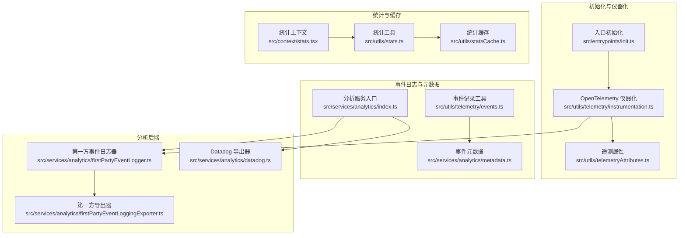
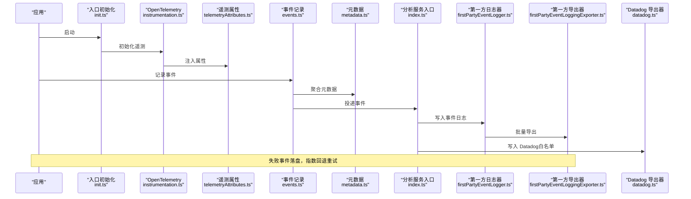
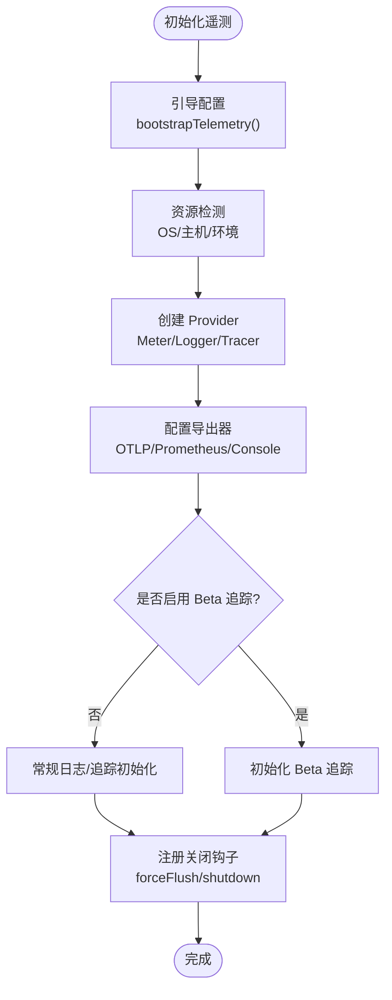
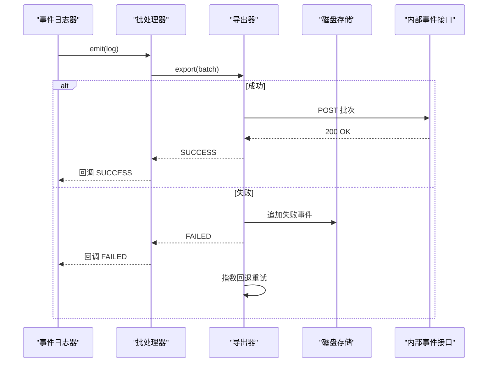
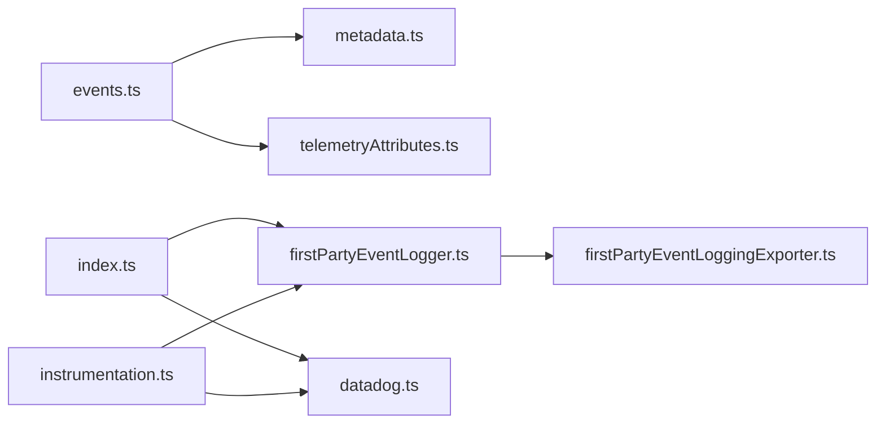

# 遥测和分析

<cite>
**本文引用的文件**
- [src/entrypoints/init.ts](file://src/entrypoints/init.ts)
- [src/utils/telemetry/instrumentation.ts](file://src/utils/telemetry/instrumentation.ts)
- [src/utils/telemetry/events.ts](file://src/utils/telemetry/events.ts)
- [src/utils/telemetry/logger.ts](file://src/utils/telemetry/logger.ts)
- [src/utils/telemetryAttributes.ts](file://src/utils/telemetryAttributes.ts)
- [src/services/analytics/index.ts](file://src/services/analytics/index.ts)
- [src/services/analytics/metadata.ts](file://src/services/analytics/metadata.ts)
- [src/services/analytics/firstPartyEventLogger.ts](file://src/services/analytics/firstPartyEventLogger.ts)
- [src/services/analytics/firstPartyEventLoggingExporter.ts](file://src/services/analytics/firstPartyEventLoggingExporter.ts)
- [src/services/analytics/datadog.ts](file://src/services/analytics/datadog.ts)
- [docs/en/01-telemetry-and-privacy.md](file://docs/en/01-telemetry-and-privacy.md)
- [src/context/stats.tsx](file://src/context/stats.tsx)
- [src/utils/stats.ts](file://src/utils/stats.ts)
- [src/utils/statsCache.ts](file://src/utils/statsCache.ts)
</cite>

## 目录
1. [简介](#简介)
2. [项目结构](#项目结构)
3. [核心组件](#核心组件)
4. [架构总览](#架构总览)
5. [详细组件分析](#详细组件分析)
6. [依赖关系分析](#依赖关系分析)
7. [性能考量](#性能考量)
8. [故障排查指南](#故障排查指南)
9. [结论](#结论)
10. [附录](#附录)

## 简介
本文件面向 Claude Code 的遥测与分析系统，系统性梳理遥测数据采集机制、事件日志体系、仪器化实现、数据分析与报告、隐私保护与合规、可视化与存储查询等主题。文档以仓库中实际代码为依据，结合官方文档中的隐私与数据管道说明，帮助开发者与运营人员理解并正确使用该系统。

## 项目结构
遥测与分析相关代码主要分布在以下模块：
- 初始化与仪器化：入口初始化、OpenTelemetry 仪器化与导出器配置
- 事件日志与元数据：事件记录、元数据聚合、PII 敏感字段处理
- 分析后端：第一方事件日志导出器、Datadog 导出器、采样与批处理
- 统计上下文：进程级指标统计与持久化
- 文档与隐私：官方隐私与数据管道说明

**图表来源**
- [src/entrypoints/init.ts:262-307](file://src/entrypoints/init.ts#L262-L307)
- [src/utils/telemetry/instrumentation.ts:421-701](file://src/utils/telemetry/instrumentation.ts#L421-L701)
- [src/utils/telemetry/events.ts:21-76](file://src/utils/telemetry/events.ts#L21-L76)
- [src/services/analytics/metadata.ts:693-743](file://src/services/analytics/metadata.ts#L693-L743)
- [src/services/analytics/firstPartyEventLogger.ts:312-389](file://src/services/analytics/firstPartyEventLogger.ts#L312-L389)
- [src/services/analytics/firstPartyEventLoggingExporter.ts:73-139](file://src/services/analytics/firstPartyEventLoggingExporter.ts#L73-L139)
- [src/services/analytics/datadog.ts:130-144](file://src/services/analytics/datadog.ts#L130-L144)
- [src/context/stats.tsx:86-219](file://src/context/stats.tsx#L86-L219)

**章节来源**
- [src/entrypoints/init.ts:262-307](file://src/entrypoints/init.ts#L262-L307)
- [src/utils/telemetry/instrumentation.ts:421-701](file://src/utils/telemetry/instrumentation.ts#L421-L701)
- [src/services/analytics/index.ts:1-174](file://src/services/analytics/index.ts#L1-L174)

## 核心组件
- 入口初始化与遥测启动
  - 在应用初始化阶段加载遥测配置，延迟初始化 OpenTelemetry 仪器化与导出器，避免冷启动开销。
  - 支持通过环境变量控制遥测开关、导出器类型、协议与端点等。
- 事件日志与元数据
  - 提供统一事件记录接口，自动注入会话、用户、提示词等通用属性，并支持按需启用用户输入日志。
  - 元数据聚合模块负责环境上下文、进程指标、订阅等级、仓库指纹等跨后端一致的数据格式。
- 分析后端
  - 第一方案：内部事件日志导出器，支持磁盘持久化失败重试、指数回退、分批发送、鉴权降级等。
  - 第二方案：Datadog 导出器，限定允许事件清单、标签化与去敏处理，定时批量上报。
- 统计与缓存
  - 进程级指标统计上下文，支持计数器、计量器、定时器、集合等，退出时持久化最近一次会话指标。

**章节来源**
- [src/entrypoints/init.ts:288-307](file://src/entrypoints/init.ts#L288-L307)
- [src/utils/telemetry/instrumentation.ts:421-701](file://src/utils/telemetry/instrumentation.ts#L421-L701)
- [src/utils/telemetry/events.ts:21-76](file://src/utils/telemetry/events.ts#L21-L76)
- [src/services/analytics/metadata.ts:693-743](file://src/services/analytics/metadata.ts#L693-L743)
- [src/services/analytics/firstPartyEventLogger.ts:312-389](file://src/services/analytics/firstPartyEventLogger.ts#L312-L389)
- [src/services/analytics/firstPartyEventLoggingExporter.ts:73-139](file://src/services/analytics/firstPartyEventLoggingExporter.ts#L73-L139)
- [src/services/analytics/datadog.ts:130-144](file://src/services/analytics/datadog.ts#L130-L144)
- [src/context/stats.tsx:86-219](file://src/context/stats.tsx#L86-L219)

## 架构总览
遥测系统采用“双通道”设计：
- 客户端遥测（OTLP）：通过 OpenTelemetry SDK 配置度量、日志、追踪导出器，按协议与端点动态选择，支持 BigQuery 指标导出器。
- 第一方案事件日志：独立的事件日志导出器，专用于内部事件，具备磁盘持久化、指数回退重试、鉴权降级与批量发送能力。
- 第二方案 Datadog：限定事件白名单，进行字段规范化与标签化，定时批量上报。

**图表来源**
- [src/entrypoints/init.ts:262-307](file://src/entrypoints/init.ts#L262-L307)
- [src/utils/telemetry/instrumentation.ts:421-701](file://src/utils/telemetry/instrumentation.ts#L421-L701)
- [src/utils/telemetry/events.ts:21-76](file://src/utils/telemetry/events.ts#L21-L76)
- [src/services/analytics/metadata.ts:693-743](file://src/services/analytics/metadata.ts#L693-L743)
- [src/services/analytics/firstPartyEventLogger.ts:312-389](file://src/services/analytics/firstPartyEventLogger.ts#L312-L389)
- [src/services/analytics/firstPartyEventLoggingExporter.ts:73-139](file://src/services/analytics/firstPartyEventLoggingExporter.ts#L73-L139)
- [src/services/analytics/datadog.ts:130-144](file://src/services/analytics/datadog.ts#L130-L144)

## 详细组件分析

### 入口初始化与遥测启动
- doInitializeTelemetry：幂等初始化，设置遥测状态标志，调用 setMeterState 延迟加载遥测。
- setMeterState：动态导入 initializeTelemetry，避免冷启动时加载 OTel 与 Protobuf 依赖。
- 诊断日志：在调试模式下输出遥测初始化与导出器选择信息，便于问题定位。

**章节来源**
- [src/entrypoints/init.ts:288-307](file://src/entrypoints/init.ts#L288-L307)
- [src/entrypoints/init.ts:262-287](file://src/entrypoints/init.ts#L262-L287)

### OpenTelemetry 仪器化与导出
- 导出器类型解析：支持 console、otlp、prometheus 等，按协议动态导入（grpc/http/json/proto）。
- 资源与检测：合并基础资源、OS/主机/环境检测结果，支持 WSL 版本注入。
- Beta 追踪与 Perfetto：可选的独立 Beta 追踪通道与本地 Perfetto 追踪。
- 关闭与刷新：注册清理钩子，优雅关闭并强制刷新，带超时保护。

**图表来源**
- [src/utils/telemetry/instrumentation.ts:421-701](file://src/utils/telemetry/instrumentation.ts#L421-L701)

**章节来源**
- [src/utils/telemetry/instrumentation.ts:421-701](file://src/utils/telemetry/instrumentation.ts#L421-L701)

### 事件记录与日志
- 事件序列：为会话内事件维护单调递增序号，便于排序与关联。
- 用户输入日志开关：通过环境变量控制是否记录用户输入；默认不记录，避免敏感内容泄露。
- 属性注入：自动附加用户 ID、会话 ID、提示词 ID、工作区路径等；事件体为受控命名空间。

**章节来源**
- [src/utils/telemetry/events.ts:7-76](file://src/utils/telemetry/events.ts#L7-L76)

### 遥测属性与基数控制
- 默认基数控制：可通过环境变量控制是否包含会话 ID、版本、账户 UUID 等高基数属性。
- OAuth 账户信息：仅在使用 OAuth 时注入组织与邮箱等信息，避免泄露。

**章节来源**
- [src/utils/telemetryAttributes.ts:9-72](file://src/utils/telemetryAttributes.ts#L9-L72)

### 元数据聚合与标准化
- 环境上下文：平台、架构、Node 版本、终端类型、包管理器、CI/CD、WSL/Linux/Distro/内核、VCS 等。
- 进程指标：运行时长、内存占用、CPU 使用率与百分比等。
- 订阅与会话：模型、会话 ID、交互模式、客户端类型、仓库指纹等。
- 格式转换：第一方事件导出器将元数据转换为 BigQuery 友好字段名与结构。

**章节来源**
- [src/services/analytics/metadata.ts:417-467](file://src/services/analytics/metadata.ts#L417-L467)
- [src/services/analytics/metadata.ts:693-743](file://src/services/analytics/metadata.ts#L693-L743)
- [src/services/analytics/metadata.ts:800-974](file://src/services/analytics/metadata.ts#L800-L974)

### 第一方案事件日志：内部事件导出
- 批处理与队列：基于 OpenTelemetry BatchLogRecordProcessor，支持延迟、批次大小与队列上限。
- 动态配置：从 GrowthBook 获取批处理参数，支持运行时热更新。
- 失败重试：磁盘持久化失败事件，指数回退（二次方），达到最大尝试次数后丢弃。
- 鉴权降级：信任未建立或 OAuth 令牌过期时自动降级为无鉴权发送。
- 成功路径：成功后立即重试队列中的积压事件，提升吞吐。

**图表来源**
- [src/services/analytics/firstPartyEventLogger.ts:312-389](file://src/services/analytics/firstPartyEventLogger.ts#L312-L389)
- [src/services/analytics/firstPartyEventLoggingExporter.ts:73-139](file://src/services/analytics/firstPartyEventLoggingExporter.ts#L73-L139)

**章节来源**
- [src/services/analytics/firstPartyEventLogger.ts:141-230](file://src/services/analytics/firstPartyEventLogger.ts#L141-L230)
- [src/services/analytics/firstPartyEventLogger.ts:312-389](file://src/services/analytics/firstPartyEventLogger.ts#L312-L389)
- [src/services/analytics/firstPartyEventLoggingExporter.ts:277-377](file://src/services/analytics/firstPartyEventLoggingExporter.ts#L277-L377)
- [src/services/analytics/firstPartyEventLoggingExporter.ts:445-517](file://src/services/analytics/firstPartyEventLoggingExporter.ts#L445-L517)

### 第二方案 Datadog 导出
- 白名单事件：仅允许预批准的事件类型进入 Datadog。
- 字段规范化：模型名、版本、状态码映射、MCP 工具名归一化等，降低基数。
- 标签化：按高基数字段生成标签，便于查询与聚合。
- 批量与定时：达到阈值立即发送，否则定时批量发送。

**章节来源**
- [src/services/analytics/datadog.ts:19-83](file://src/services/analytics/datadog.ts#L19-L83)
- [src/services/analytics/datadog.ts:160-279](file://src/services/analytics/datadog.ts#L160-L279)

### 分析服务入口与事件队列
- 事件队列：在分析后端挂载前，所有事件先入队，挂载后异步冲刷。
- 采样：根据动态配置对事件进行采样，采样率写入元数据。
- 类型安全：通过标记类型约束元数据，避免无意中记录代码或文件路径。

**章节来源**
- [src/services/analytics/index.ts:60-174](file://src/services/analytics/index.ts#L60-L174)

### 统计上下文与持久化
- 统计提供者：在进程退出时将当前会话指标持久化到项目配置，便于后续分析。
- 指标类型：计数器、计量器、定时器、集合，覆盖常见性能与使用统计场景。

**章节来源**
- [src/context/stats.tsx:86-219](file://src/context/stats.tsx#L86-L219)

## 依赖关系分析
- 组件耦合
  - 事件记录工具依赖遥测属性与元数据模块，确保属性与上下文一致性。
  - 分析服务入口作为事件投递门面，解耦具体后端实现。
  - 第一方案导出器与 Datadog 导出器分别对接不同后端，互不影响。
- 外部依赖
  - OpenTelemetry SDK（日志、指标、追踪）、HTTP 客户端、Protobuf 序列化。
  - Datadog 日志端点与客户端令牌。
- 循环依赖规避
  - 通过延迟导入与模块边界划分，避免循环依赖。

**图表来源**
- [src/utils/telemetry/events.ts:21-76](file://src/utils/telemetry/events.ts#L21-L76)
- [src/services/analytics/metadata.ts:693-743](file://src/services/analytics/metadata.ts#L693-L743)
- [src/utils/telemetryAttributes.ts:29-72](file://src/utils/telemetryAttributes.ts#L29-L72)
- [src/services/analytics/index.ts:133-164](file://src/services/analytics/index.ts#L133-L164)
- [src/services/analytics/firstPartyEventLogger.ts:312-389](file://src/services/analytics/firstPartyEventLogger.ts#L312-L389)
- [src/services/analytics/datadog.ts:130-144](file://src/services/analytics/datadog.ts#L130-L144)
- [src/utils/telemetry/instrumentation.ts:421-701](file://src/utils/telemetry/instrumentation.ts#L421-L701)

**章节来源**
- [src/utils/telemetry/instrumentation.ts:421-701](file://src/utils/telemetry/instrumentation.ts#L421-L701)
- [src/services/analytics/index.ts:1-174](file://src/services/analytics/index.ts#L1-L174)

## 性能考量
- 延迟初始化：遥测与 OTel 依赖在首次使用前才加载，减少启动时延。
- 批处理与背压：通过批大小、队列上限与定时器平衡吞吐与延迟。
- 指数回退：失败事件采用二次方回退，避免网络拥塞。
- 资源最小化：第一方事件日志器使用独立 Provider，避免与客户遥测互相影响。
- 关闭超时：提供可配置的关闭超时，防止阻塞进程退出。

[本节为通用指导，无需特定文件引用]

## 故障排查指南
- 遥测未生效
  - 检查遥测开关与导出器类型环境变量，确认已正确设置。
  - 查看诊断日志中关于导出器类型与协议选择的信息。
- 事件未到达后端
  - 查看磁盘失败事件文件是否存在，确认指数回退是否正常触发。
  - 检查鉴权状态与信任对话框接受状态，必要时降级为无鉴权发送。
- Datadog 事件缺失
  - 确认事件名称在白名单中，且字段未被过度去敏。
  - 检查批量阈值与定时器配置。
- 关闭卡顿
  - 调整关闭超时环境变量，观察是否因后端响应慢导致阻塞。

**章节来源**
- [src/utils/telemetry/instrumentation.ts:654-699](file://src/utils/telemetry/instrumentation.ts#L654-L699)
- [src/services/analytics/firstPartyEventLoggingExporter.ts:445-517](file://src/services/analytics/firstPartyEventLoggingExporter.ts#L445-L517)
- [src/services/analytics/datadog.ts:160-279](file://src/services/analytics/datadog.ts#L160-L279)

## 结论
Claude Code 的遥测与分析系统通过“双通道”设计实现了高可靠性与灵活性：OTLP 通道满足客户侧可观测性需求，第一方案事件日志通道保障内部事件的持久化与可恢复性，Datadog 通道聚焦关键事件的快速观测。系统在隐私保护、基数控制、失败重试与优雅关闭等方面均有明确实现，适合在生产环境中稳定运行。

[本节为总结，无需特定文件引用]

## 附录

### 遥测数据隐私与合规要点
- 用户输入日志默认关闭，可通过环境变量开启；建议保持默认关闭以避免敏感信息泄露。
- 工具输入日志在默认情况下会被截断与限制深度，仅在特殊场景下开启完整记录。
- 文件扩展名提取遵循长度限制，避免记录潜在敏感的哈希类扩展名。
- 第一方案事件日志在导出前会剥离 PII 标记字段，确保一般访问后端不承载敏感数据。

**章节来源**
- [docs/en/01-telemetry-and-privacy.md:1-125](file://docs/en/01-telemetry-and-privacy.md#L1-L125)
- [src/utils/telemetry/events.ts:13-19](file://src/utils/telemetry/events.ts#L13-L19)
- [src/services/analytics/metadata.ts:236-303](file://src/services/analytics/metadata.ts#L236-L303)
- [src/services/analytics/metadata.ts:305-337](file://src/services/analytics/metadata.ts#L305-L337)
- [src/services/analytics/firstPartyEventLoggingExporter.ts:714-758](file://src/services/analytics/firstPartyEventLoggingExporter.ts#L714-L758)

### 数据分析与报告
- 事件类型与数据结构：事件名称、属性、时间戳、序列号、会话与用户标识等。
- 元数据维度：环境上下文、进程指标、订阅等级、仓库指纹等。
- 报告生成：第一方案事件日志导出器将元数据转换为 BigQuery 友好格式，便于后续查询与报表。

**章节来源**
- [src/utils/telemetry/events.ts:42-75](file://src/utils/telemetry/events.ts#L42-L75)
- [src/services/analytics/metadata.ts:417-467](file://src/services/analytics/metadata.ts#L417-L467)
- [src/services/analytics/firstPartyEventLoggingExporter.ts:708-758](file://src/services/analytics/firstPartyEventLoggingExporter.ts#L708-L758)

### 可视化与存储查询
- Datadog：通过标签化与字段规范化，支持仪表板与趋势分析。
- BigQuery：第一方案事件日志导出器将数据转换为结构化字段，便于 SQL 查询与 BI 工具集成。

**章节来源**
- [src/services/analytics/datadog.ts:19-83](file://src/services/analytics/datadog.ts#L19-L83)
- [src/services/analytics/firstPartyEventLoggingExporter.ts:708-758](file://src/services/analytics/firstPartyEventLoggingExporter.ts#L708-L758)