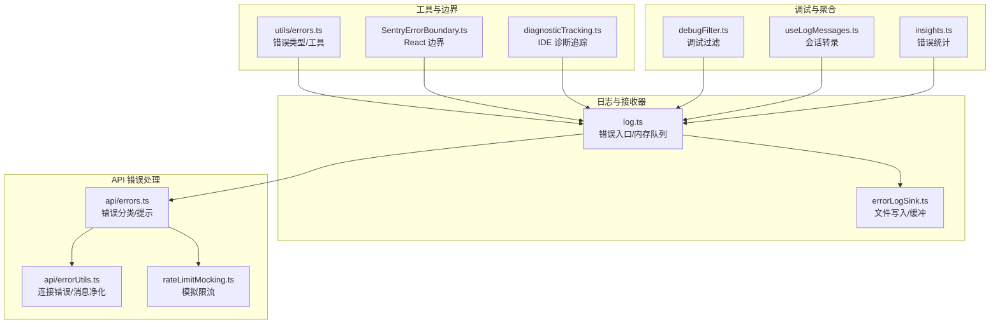
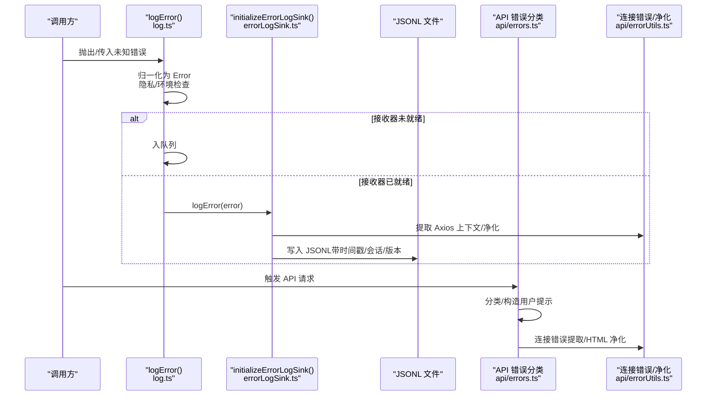
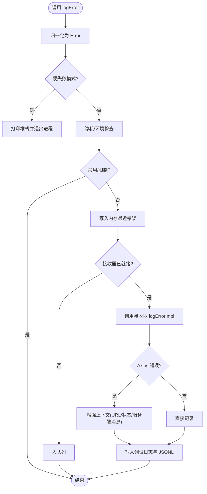
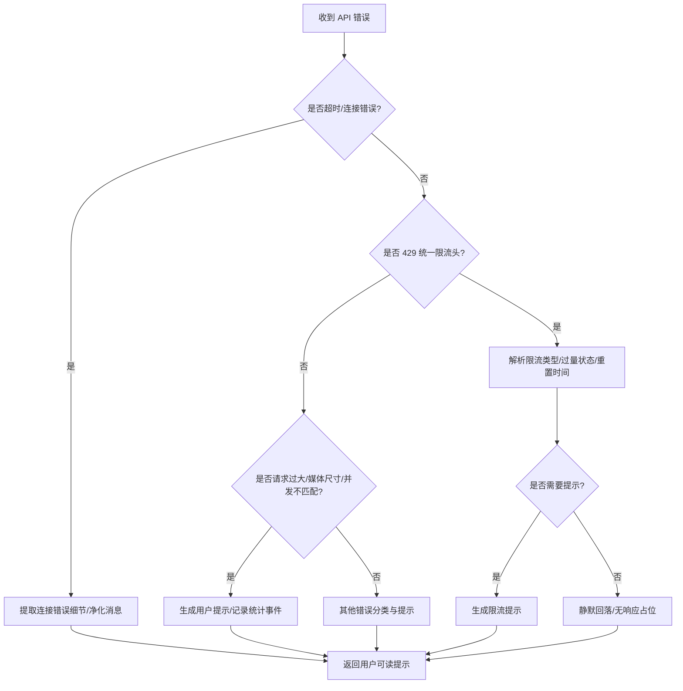
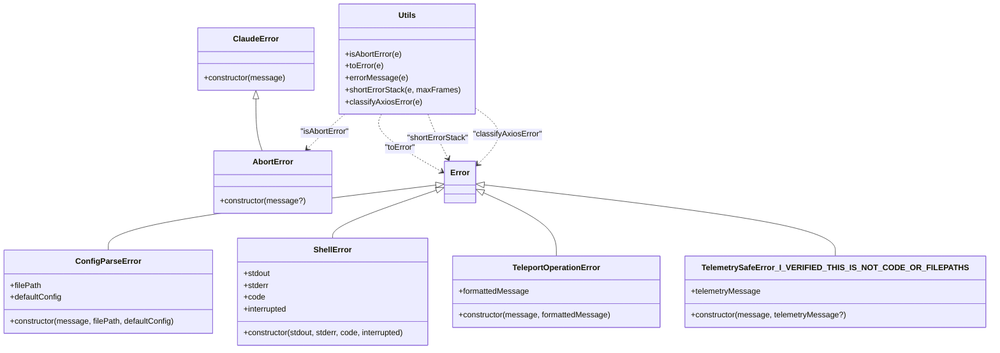
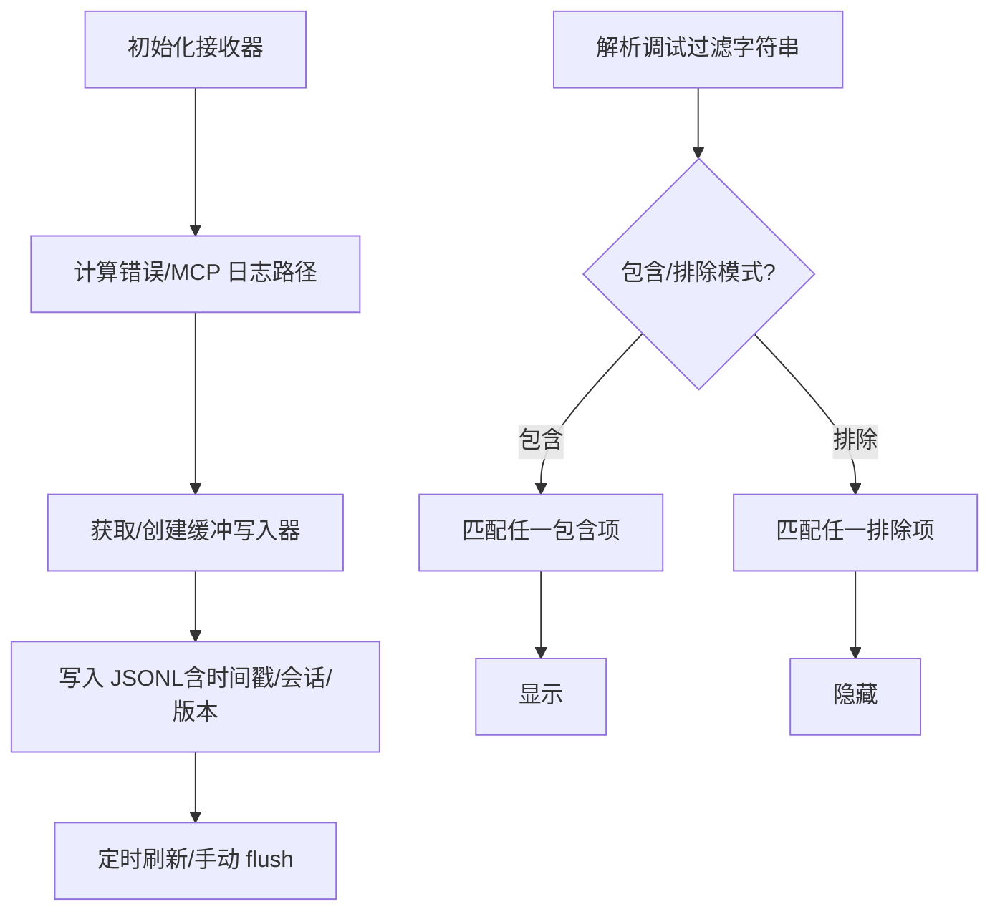
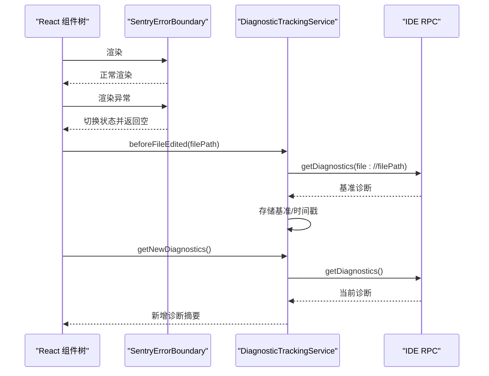
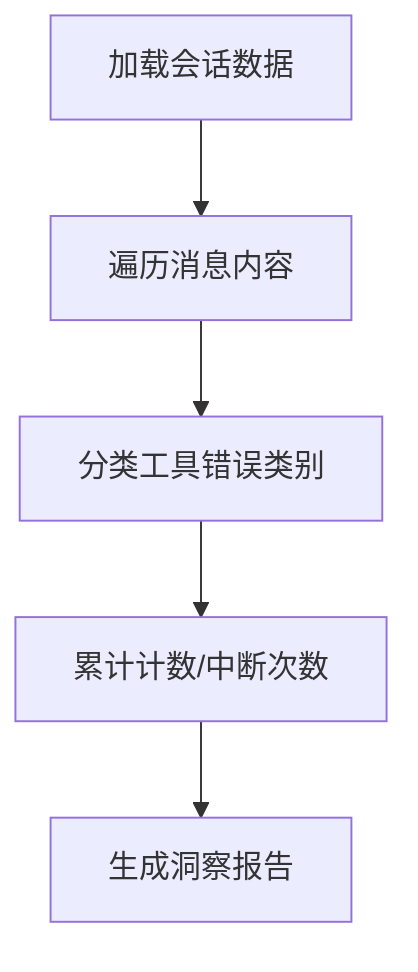
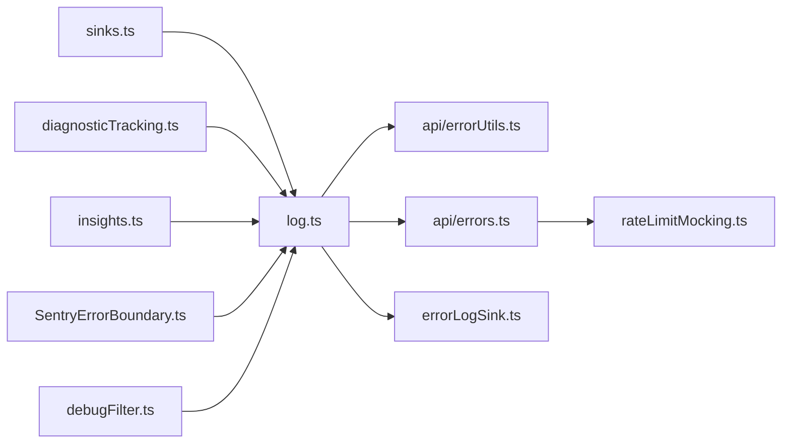

# 错误追踪

<cite>
**本文引用的文件**
- [src/utils/log.ts](file://src/utils/log.ts)
- [src/utils/errorLogSink.ts](file://src/utils/errorLogSink.ts)
- [src/services/api/errors.ts](file://src/services/api/errors.ts)
- [src/services/api/errorUtils.ts](file://src/services/api/errorUtils.ts)
- [src/utils/errors.ts](file://src/utils/errors.ts)
- [src/services/rateLimitMocking.ts](file://src/services/rateLimitMocking.ts)
- [src/components/SentryErrorBoundary.ts](file://src/components/SentryErrorBoundary.ts)
- [src/services/diagnosticTracking.ts](file://src/services/diagnosticTracking.ts)
- [src/hooks/useLogMessages.ts](file://src/hooks/useLogMessages.ts)
- [src/utils/debugFilter.ts](file://src/utils/debugFilter.ts)
- [src/utils/sinks.ts](file://src/utils/sinks.ts)
- [src/constants/errorIds.ts](file://src/constants/errorIds.ts)
- [src/commands/insights.ts](file://src/commands/insights.ts)
</cite>

## 目录
1. [简介](#简介)
2. [项目结构](#项目结构)
3. [核心组件](#核心组件)
4. [架构总览](#架构总览)
5. [详细组件分析](#详细组件分析)
6. [依赖关系分析](#依赖关系分析)
7. [性能考量](#性能考量)
8. [故障排查指南](#故障排查指南)
9. [结论](#结论)
10. [附录](#附录)

## 简介
本技术文档聚焦 Claude Code 的错误追踪系统，系统性阐述错误日志记录机制（捕获、分类、详情记录）、错误工具实现（格式化、堆栈跟踪、上下文提取）、API 错误处理（HTTP 响应、状态码、消息标准化）、错误日志接收器（输出目标、级别过滤、批量写入）、错误分析与报告（趋势、重复检测、影响评估），并提供排查与预防的最佳实践。文档以代码级事实为基础，辅以可视化图示，帮助开发者快速定位问题并优化系统稳定性。

## 项目结构
围绕错误追踪的关键模块分布如下：
- 日志与接收器：src/utils/log.ts（错误入口与内存队列）、src/utils/errorLogSink.ts（文件持久化与缓冲写入）
- API 错误处理：src/services/api/errors.ts（错误分类与用户提示）、src/services/api/errorUtils.ts（连接错误提取与消息净化）
- 工具与辅助：src/utils/errors.ts（通用错误类型与工具）、src/services/rateLimitMocking.ts（模拟限流错误）
- 边界与诊断：src/components/SentryErrorBoundary.ts（React 边界）、src/services/diagnosticTracking.ts（IDE 诊断追踪）
- 调试与聚合：src/utils/debugFilter.ts（调试过滤）、src/hooks/useLogMessages.ts（会话转录记录）、src/commands/insights.ts（错误统计聚合）

**图表来源**
- [src/utils/log.ts:158-199](file://src/utils/log.ts#L158-L199)
- [src/utils/errorLogSink.ts:225-235](file://src/utils/errorLogSink.ts#L225-L235)
- [src/services/api/errors.ts:425-780](file://src/services/api/errors.ts#L425-L780)
- [src/services/api/errorUtils.ts:200-260](file://src/services/api/errorUtils.ts#L200-L260)
- [src/services/rateLimitMocking.ts:43-144](file://src/services/rateLimitMocking.ts#L43-L144)
- [src/utils/errors.ts:1-239](file://src/utils/errors.ts#L1-L239)
- [src/components/SentryErrorBoundary.ts:11-27](file://src/components/SentryErrorBoundary.ts#L11-L27)
- [src/services/diagnosticTracking.ts:100-182](file://src/services/diagnosticTracking.ts#L100-L182)
- [src/utils/debugFilter.ts:16-157](file://src/utils/debugFilter.ts#L16-L157)
- [src/hooks/useLogMessages.ts:19-118](file://src/hooks/useLogMessages.ts#L19-L118)
- [src/commands/insights.ts:665-713](file://src/commands/insights.ts#L665-L713)

**章节来源**
- [src/utils/log.ts:1-363](file://src/utils/log.ts#L1-L363)
- [src/utils/errorLogSink.ts:1-236](file://src/utils/errorLogSink.ts#L1-L236)
- [src/services/api/errors.ts:1-800](file://src/services/api/errors.ts#L1-L800)
- [src/services/api/errorUtils.ts:1-261](file://src/services/api/errorUtils.ts#L1-L261)
- [src/utils/errors.ts:1-239](file://src/utils/errors.ts#L1-L239)
- [src/services/rateLimitMocking.ts:43-144](file://src/services/rateLimitMocking.ts#L43-L144)
- [src/components/SentryErrorBoundary.ts:1-28](file://src/components/SentryErrorBoundary.ts#L1-L28)
- [src/services/diagnosticTracking.ts:1-398](file://src/services/diagnosticTracking.ts#L1-L398)
- [src/utils/debugFilter.ts:1-157](file://src/utils/debugFilter.ts#L1-L157)
- [src/hooks/useLogMessages.ts:1-120](file://src/hooks/useLogMessages.ts#L1-L120)
- [src/commands/insights.ts:665-713](file://src/commands/insights.ts#L665-L713)

## 核心组件
- 错误入口与队列：统一入口函数负责将未知错误归一化为 Error 实例，执行隐私与环境检查后，写入内存日志，并在接收器未就绪时进入队列等待初始化。
- 错误接收器：在应用启动时初始化，将错误写入 JSONL 文件，支持 MCP 服务器专用日志；对 Axios 错误进行上下文增强（URL、状态、服务端消息）。
- API 错误分类：针对超时、配额、请求过大、媒体尺寸、并发不匹配等场景生成用户可理解的提示，并在特定情况下返回“无响应”占位以避免阻塞。
- 连接错误与消息净化：从 cause 链提取底层 SSL/TLS 或网络错误代码，结合 HTML 洗净逻辑生成更友好的错误提示。
- 限流模拟：在测试场景下生成带统一限流头的 429 错误，便于 UI 与行为一致性验证。
- React 边界：捕获渲染期异常，防止崩溃并保持界面可用。
- 诊断追踪：与 IDE 诊断联动，对比编辑前后差异，输出可读摘要，辅助根因定位。
- 调试过滤：基于类别白/黑名单的调试消息过滤，支持包含/排除模式与混合配置的降级处理。
- 会话转录与洞察：增量记录消息到转录，聚合工具错误类别与中断次数，形成错误趋势与影响评估基础。

**章节来源**
- [src/utils/log.ts:158-199](file://src/utils/log.ts#L158-L199)
- [src/utils/errorLogSink.ts:152-174](file://src/utils/errorLogSink.ts#L152-L174)
- [src/services/api/errors.ts:425-780](file://src/services/api/errors.ts#L425-L780)
- [src/services/api/errorUtils.ts:200-260](file://src/services/api/errorUtils.ts#L200-L260)
- [src/services/rateLimitMocking.ts:43-144](file://src/services/rateLimitMocking.ts#L43-L144)
- [src/components/SentryErrorBoundary.ts:11-27](file://src/components/SentryErrorBoundary.ts#L11-L27)
- [src/services/diagnosticTracking.ts:100-182](file://src/services/diagnosticTracking.ts#L100-L182)
- [src/utils/debugFilter.ts:16-157](file://src/utils/debugFilter.ts#L16-L157)
- [src/hooks/useLogMessages.ts:19-118](file://src/hooks/useLogMessages.ts#L19-L118)
- [src/commands/insights.ts:665-713](file://src/commands/insights.ts#L665-L713)

## 架构总览
错误追踪由“入口—接收器—分类—持久化/上报—分析—反馈”闭环构成。入口层负责兜底与队列；接收器层负责落盘与缓冲；分类层负责用户可读提示与行为决策；分析层负责趋势与重复检测；反馈层通过边界与诊断提升可恢复性。

**图表来源**
- [src/utils/log.ts:158-199](file://src/utils/log.ts#L158-L199)
- [src/utils/errorLogSink.ts:152-174](file://src/utils/errorLogSink.ts#L152-L174)
- [src/services/api/errors.ts:425-780](file://src/services/api/errors.ts#L425-L780)
- [src/services/api/errorUtils.ts:200-260](file://src/services/api/errorUtils.ts#L200-L260)

## 详细组件分析

### 组件 A：错误入口与接收器（log.ts 与 errorLogSink.ts）
- 错误入口职责
  - 将任意值归一化为 Error，支持硬失败模式（--hard-fail）直接退出进程。
  - 执行云厂商/隐私级别/禁用标志等环境检查，必要时短路。
  - 写入内存最近错误列表（环形缓冲，限制数量）。
  - 若接收器未初始化，事件进入队列；初始化后立即冲刷队列。
- 接收器职责
  - 初始化后挂载到全局入口，接管后续错误写入。
  - 对 Axios 错误增强上下文（URL、状态、服务端消息），并写入调试日志与 JSONL 文件。
  - 支持 MCP 专用日志路径与调试消息写入。
  - 使用缓冲写入器（定时刷新、最大缓冲大小）降低磁盘压力。

**图表来源**
- [src/utils/log.ts:158-199](file://src/utils/log.ts#L158-L199)
- [src/utils/errorLogSink.ts:152-174](file://src/utils/errorLogSink.ts#L152-L174)

**章节来源**
- [src/utils/log.ts:158-199](file://src/utils/log.ts#L158-L199)
- [src/utils/errorLogSink.ts:152-174](file://src/utils/errorLogSink.ts#L152-L174)

### 组件 B：API 错误处理与消息标准化（api/errors.ts 与 api/errorUtils.ts）
- 错误分类与提示
  - 超时：统一提示“请求超时”，引导检查网络与代理。
  - 媒体尺寸/图片维度/请求过大：根据场景生成用户可操作的提示。
  - 并发不匹配（tool_use/tool_result）：记录统计事件，给出回滚建议。
  - 无效模型名/余额不足/组织禁用：区分订阅用户与内部用户，给出明确指引。
  - 新式统一限流头：解析代表类型、过量状态、重置时间等，生成精确提示或静默回落。
- 连接错误与消息净化
  - 从 cause 链提取 SSL/TLS 与网络错误代码，映射为可读提示。
  - 对 HTML 错误页（如 CloudFlare）提取标题作为友好提示。
  - 对反序列化后的错误对象，按不同提供商嵌套结构提取消息。

**图表来源**
- [src/services/api/errors.ts:425-780](file://src/services/api/errors.ts#L425-L780)
- [src/services/api/errorUtils.ts:200-260](file://src/services/api/errorUtils.ts#L200-L260)

**章节来源**
- [src/services/api/errors.ts:425-780](file://src/services/api/errors.ts#L425-L780)
- [src/services/api/errorUtils.ts:200-260](file://src/services/api/errorUtils.ts#L200-L260)

### 组件 C：错误工具与限流模拟（utils/errors.ts 与 rateLimitMocking.ts）
- 通用错误类型与工具
  - 定义 AbortError、ShellError、TeleportOperationError、TelemetrySafeError 等。
  - 提供 isAbortError、toError、errorMessage、shortErrorStack、classifyAxiosError 等工具。
  - shortErrorStack 控制向模型汇报的堆栈长度，避免上下文浪费。
- 限流模拟
  - 在测试场景下生成带统一限流头的 429 错误，支持 Opus 特定限流与快模场景。
  - 仅在满足条件时抛出，避免干扰真实行为。

**图表来源**
- [src/utils/errors.ts:3-101](file://src/utils/errors.ts#L3-L101)

**章节来源**
- [src/utils/errors.ts:1-239](file://src/utils/errors.ts#L1-L239)
- [src/services/rateLimitMocking.ts:43-144](file://src/services/rateLimitMocking.ts#L43-L144)

### 组件 D：日志接收器与调试过滤（errorLogSink.ts 与 debugFilter.ts）
- 接收器
  - 按日期命名 JSONL 文件，支持多服务器 MCP 日志分离。
  - 缓冲写入器（定时刷新、最大缓冲大小），失败自动创建目录并重试。
  - 对 Axios 错误提取服务端消息，增强可读性。
- 调试过滤
  - 解析包含/排除两类过滤规则，支持混合配置的降级处理。
  - 基于消息中提取的类别决定是否显示，兼顾安全与性能。

**图表来源**
- [src/utils/errorLogSink.ts:29-126](file://src/utils/errorLogSink.ts#L29-L126)
- [src/utils/debugFilter.ts:16-157](file://src/utils/debugFilter.ts#L16-L157)

**章节来源**
- [src/utils/errorLogSink.ts:29-126](file://src/utils/errorLogSink.ts#L29-L126)
- [src/utils/debugFilter.ts:16-157](file://src/utils/debugFilter.ts#L16-L157)

### 组件 E：边界与诊断（SentryErrorBoundary.ts 与 diagnosticTracking.ts）
- React 边界
  - 捕获渲染期异常，切换内部状态，避免整树崩溃。
- 诊断追踪
  - 编辑前抓取基准诊断，编辑后对比新诊断，输出差异摘要。
  - 支持 file:// 与 _claude_fs_right: URI 的归一化比较，适配 Windows 大小写与分隔符。

**图表来源**
- [src/components/SentryErrorBoundary.ts:11-27](file://src/components/SentryErrorBoundary.ts#L11-L27)
- [src/services/diagnosticTracking.ts:135-182](file://src/services/diagnosticTracking.ts#L135-L182)
- [src/services/diagnosticTracking.ts:188-283](file://src/services/diagnosticTracking.ts#L188-L283)

**章节来源**
- [src/components/SentryErrorBoundary.ts:11-27](file://src/components/SentryErrorBoundary.ts#L11-L27)
- [src/services/diagnosticTracking.ts:135-182](file://src/services/diagnosticTracking.ts#L135-L182)
- [src/services/diagnosticTracking.ts:188-283](file://src/services/diagnosticTracking.ts#L188-L283)

### 组件 F：分析与报告（insights.ts 与 useLogMessages.ts）
- 错误统计聚合
  - 从会话中提取工具错误类别（如“文件过大/不存在”等），统计中断次数。
- 会话转录
  - 增量记录消息到转录，避免全量扫描带来的性能开销；支持 Agent Swarms 场景的团队上下文。

**图表来源**
- [src/commands/insights.ts:665-713](file://src/commands/insights.ts#L665-L713)
- [src/hooks/useLogMessages.ts:19-118](file://src/hooks/useLogMessages.ts#L19-L118)

**章节来源**
- [src/commands/insights.ts:665-713](file://src/commands/insights.ts#L665-L713)
- [src/hooks/useLogMessages.ts:19-118](file://src/hooks/useLogMessages.ts#L19-L118)

## 依赖关系分析
- 启动顺序
  - 初始化接收器与分析接收器（sinks.ts），随后在各入口点 attachErrorLogSink，确保队列冲刷与无丢失。
- 关键依赖链
  - log.ts 依赖 utils/errors.ts（toError/shortErrorStack）、privacyLevel/envUtils 等。
  - errorLogSink.ts 依赖缓存路径、缓冲写入器、清理注册表、调试输出。
  - api/errors.ts 依赖 errorUtils.ts（连接错误/净化）、限流消息生成器、OAuth/账户信息。
  - rateLimitMocking.ts 依赖统一限流头解析与快模场景判断。
  - diagnosticTracking.ts 依赖 MCP 客户端、IDE RPC、文件路径归一化。
  - insights.ts 依赖会话消息结构与统计聚合。

**图表来源**
- [src/utils/sinks.ts:13-16](file://src/utils/sinks.ts#L13-L16)
- [src/utils/log.ts:158-199](file://src/utils/log.ts#L158-L199)
- [src/utils/errorLogSink.ts:225-235](file://src/utils/errorLogSink.ts#L225-L235)
- [src/services/api/errors.ts:425-780](file://src/services/api/errors.ts#L425-L780)
- [src/services/api/errorUtils.ts:200-260](file://src/services/api/errorUtils.ts#L200-L260)
- [src/services/rateLimitMocking.ts:43-144](file://src/services/rateLimitMocking.ts#L43-L144)
- [src/services/diagnosticTracking.ts:100-182](file://src/services/diagnosticTracking.ts#L100-L182)
- [src/commands/insights.ts:665-713](file://src/commands/insights.ts#L665-L713)
- [src/components/SentryErrorBoundary.ts:11-27](file://src/components/SentryErrorBoundary.ts#L11-L27)
- [src/utils/debugFilter.ts:16-157](file://src/utils/debugFilter.ts#L16-L157)

**章节来源**
- [src/utils/sinks.ts:13-16](file://src/utils/sinks.ts#L13-L16)
- [src/utils/log.ts:158-199](file://src/utils/log.ts#L158-L199)
- [src/utils/errorLogSink.ts:225-235](file://src/utils/errorLogSink.ts#L225-L235)
- [src/services/api/errors.ts:425-780](file://src/services/api/errors.ts#L425-L780)
- [src/services/api/errorUtils.ts:200-260](file://src/services/api/errorUtils.ts#L200-L260)
- [src/services/rateLimitMocking.ts:43-144](file://src/services/rateLimitMocking.ts#L43-L144)
- [src/services/diagnosticTracking.ts:100-182](file://src/services/diagnosticTracking.ts#L100-L182)
- [src/commands/insights.ts:665-713](file://src/commands/insights.ts#L665-L713)
- [src/components/SentryErrorBoundary.ts:11-27](file://src/components/SentryErrorBoundary.ts#L11-L27)
- [src/utils/debugFilter.ts:16-157](file://src/utils/debugFilter.ts#L16-L157)

## 性能考量
- 写入性能
  - 使用缓冲写入器（定时刷新、最大缓冲大小），减少频繁磁盘 IO。
  - 目录不存在时自动创建，失败重试，保证可靠性。
- 记忆体占用
  - 内存最近错误列表采用环形缓冲，限制上限，避免长期运行内存膨胀。
- 过滤与日志量
  - 调试过滤支持包含/排除模式，避免无关日志干扰。
- 会话转录
  - 增量记录与去重循环，避免全量扫描带来的 O(n) 开销。

[本节为通用指导，无需具体文件分析]

## 故障排查指南
- 快速定位
  - 使用调试过滤（例如包含/排除类别）缩小范围。
  - 查看 JSONL 错误文件与 MCP 日志文件，关注时间戳与会话 ID。
- 常见场景
  - Axios 连接错误：查看 URL、状态与服务端消息；若为 SSL/TLS，参考提示设置 CA 证书或允许名单。
  - 429 限流：检查统一限流头，确认是否 Opus 专属限流与当前模型匹配。
  - 工具并发不匹配：使用回滚命令恢复会话，关注统计事件。
- 诊断辅助
  - 使用诊断追踪服务对比编辑前后差异，输出简洁摘要。
  - 结合会话转录与洞察命令，统计工具错误类别与中断次数。

**章节来源**
- [src/utils/debugFilter.ts:16-157](file://src/utils/debugFilter.ts#L16-L157)
- [src/utils/errorLogSink.ts:152-174](file://src/utils/errorLogSink.ts#L152-L174)
- [src/services/api/errorUtils.ts:200-260](file://src/services/api/errorUtils.ts#L200-L260)
- [src/services/api/errors.ts:425-780](file://src/services/api/errors.ts#L425-L780)
- [src/services/diagnosticTracking.ts:188-283](file://src/services/diagnosticTracking.ts#L188-L283)
- [src/commands/insights.ts:665-713](file://src/commands/insights.ts#L665-L713)

## 结论
该错误追踪系统以“入口—接收器—分类—持久化/上报—分析—反馈”为主线，既保证了生产环境的稳定与可观测，又提供了丰富的调试与分析能力。通过统一的错误格式化、上下文增强与限流模拟，系统在复杂场景下仍能提供一致且可恢复的用户体验。建议在开发与运维实践中持续完善错误分类与统计维度，强化根因分析与自动化告警。

[本节为总结，无需具体文件分析]

## 附录
- 错误 ID 常量：用于追踪错误来源，便于外部构建与死码消除。
- 启动初始化：确保在默认命令与子命令入口均正确初始化接收器与分析接收器，避免事件丢失。

**章节来源**
- [src/constants/errorIds.ts:1-16](file://src/constants/errorIds.ts#L1-L16)
- [src/utils/sinks.ts:13-16](file://src/utils/sinks.ts#L13-L16)