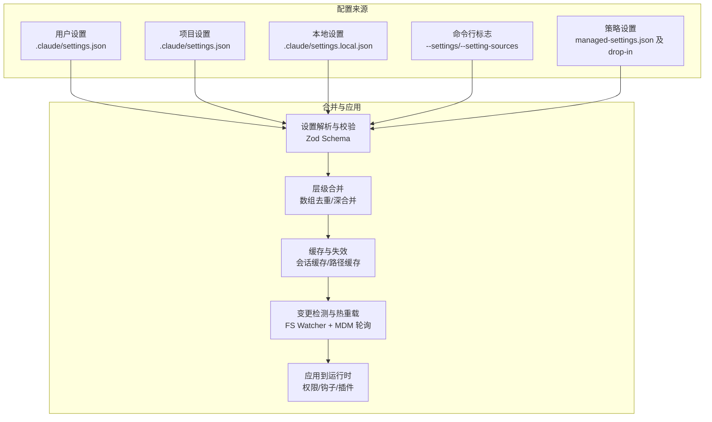
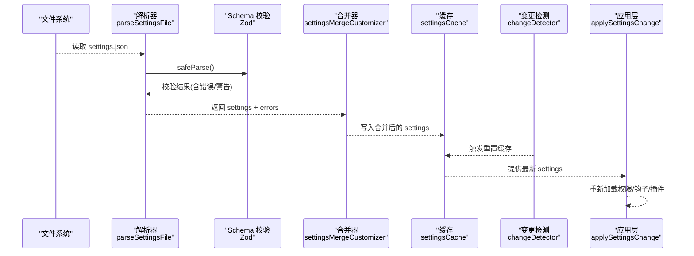
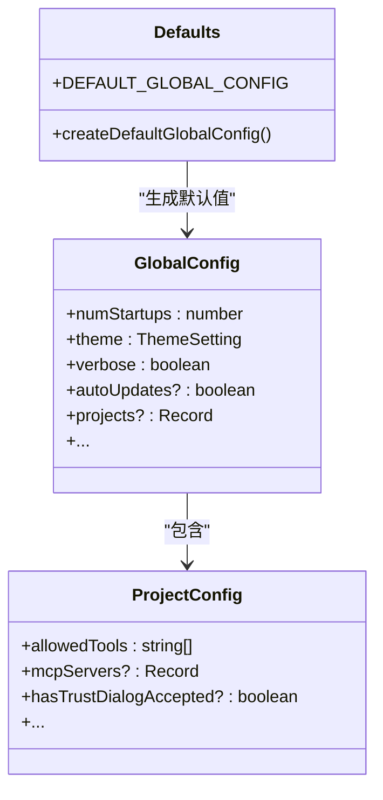
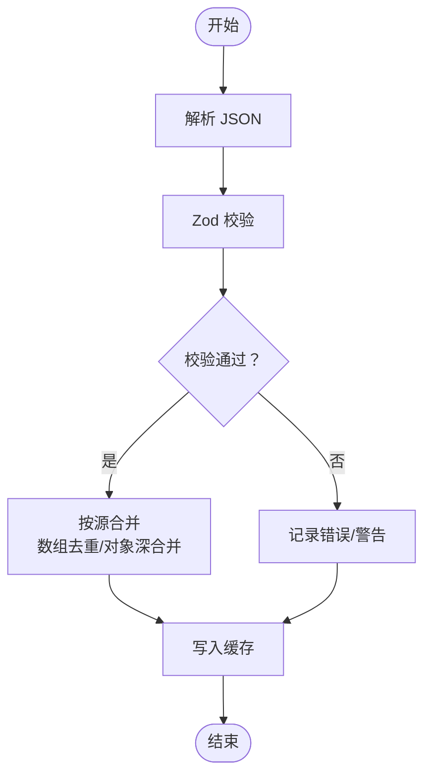
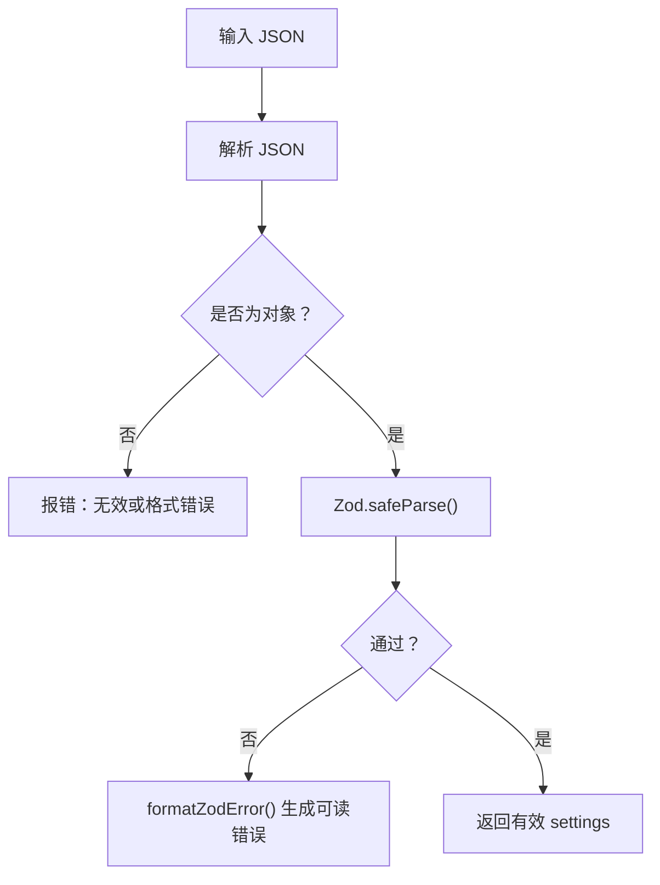
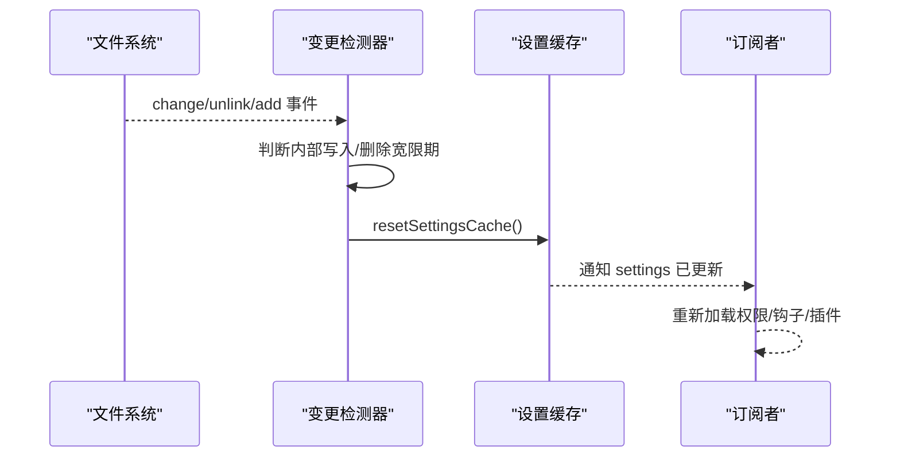
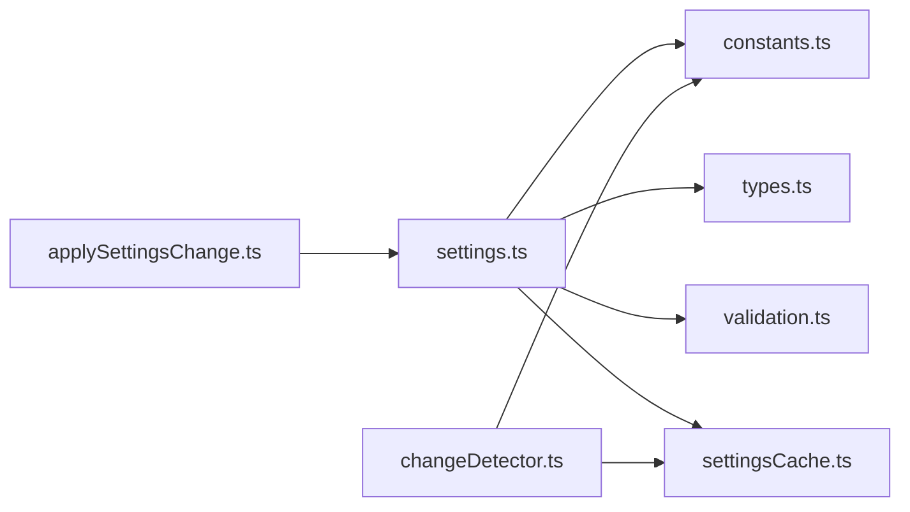

# 全局配置

<cite>
**本文引用的文件**
- [src/utils/config.ts](file://src/utils/config.ts)
- [src/utils/configConstants.ts](file://src/utils/configConstants.ts)
- [src/utils/settings/settings.ts](file://src/utils/settings/settings.ts)
- [src/utils/settings/settingsCache.ts](file://src/utils/settings/settingsCache.ts)
- [src/utils/settings/types.ts](file://src/utils/settings/types.ts)
- [src/utils/settings/constants.ts](file://src/utils/settings/constants.ts)
- [src/utils/settings/validation.ts](file://src/utils/settings/validation.ts)
- [src/utils/settings/permissionValidation.ts](file://src/utils/settings/permissionValidation.ts)
- [src/utils/settings/changeDetector.ts](file://src/utils/settings/changeDetector.ts)
- [src/utils/settings/managedPath.ts](file://src/utils/settings/managedPath.ts)
- [src/utils/settings/applySettingsChange.ts](file://src/utils/settings/applySettingsChange.ts)
- [src/main.tsx](file://src/main.tsx)
- [src/commands/config/index.ts](file://src/commands/config/index.ts)
</cite>

## 目录
1. [简介](#简介)
2. [项目结构](#项目结构)
3. [核心组件](#核心组件)
4. [架构总览](#架构总览)
5. [详细组件分析](#详细组件分析)
6. [依赖分析](#依赖分析)
7. [性能考虑](#性能考虑)
8. [故障排查指南](#故障排查指南)
9. [结论](#结论)
10. [附录](#附录)

## 简介
本文件系统性梳理 Claude Code 的全局配置体系，覆盖配置文件结构与组织、默认值管理、配置继承与合并策略、验证体系（类型、范围、依赖）、读取/解析/序列化流程、环境变量处理、动态更新与热重载、配置项参考、版本与兼容性策略等。目标是帮助开发者与运维人员理解并正确使用配置系统，避免常见陷阱，并在企业环境中安全地进行策略下发与合规管控。

## 项目结构
配置系统由“全局配置”和“设置文件（settings.json）”两大维度构成：
- 全局配置：持久化的用户态全局状态（如主题、通知渠道、启动统计、隐私与实验门控等），存储于用户配置目录的全局配置文件中。
- 设置文件：用户在不同作用域（用户、项目、本地、命令行、策略）下的 settings.json 配置，采用分层合并与优先级策略。

图表来源
- [src/utils/settings/settings.ts:645-796](file://src/utils/settings/settings.ts#L645-L796)
- [src/utils/settings/constants.ts:7-22](file://src/utils/settings/constants.ts#L7-L22)
- [src/utils/settings/changeDetector.ts:84-146](file://src/utils/settings/changeDetector.ts#L84-L146)

章节来源
- [src/utils/settings/constants.ts:7-22](file://src/utils/settings/constants.ts#L7-L22)
- [src/utils/settings/settings.ts:645-796](file://src/utils/settings/settings.ts#L645-L796)

## 核心组件
- 全局配置（GlobalConfig）
  - 定义了用户态全局状态键集合、默认值工厂、关键行为开关（如自动更新、终端进度条、任务通知等）。
  - 提供默认键列表与类型守卫，用于严格区分全局配置键与项目配置键。
- 设置文件（SettingsJson）
  - 通过 Zod Schema 定义完整的 settings.json 结构，支持环境变量、权限规则、MCP 服务器、钩子、沙箱、市场源等。
  - 支持向后兼容：新增可选字段、枚举扩展、宽松类型转换、未知字段保留等。
- 合并与优先级
  - 源顺序：用户 → 项目 → 本地 → 命令行 → 策略（策略“首个生效”原则）。
  - 数组合并：去重拼接；对象深合并；显式 undefined 删除键。
- 验证与错误格式化
  - 使用 Zod 进行强类型校验；对无效权限规则进行“过滤+警告”，避免整文件被拒。
  - 错误消息包含建议与文档链接，便于修复。
- 动态更新与热重载
  - 文件系统事件监听（chokidar）+ MDM 轮询，配合内部写入窗口与删除宽限期，实现稳定、可阻断的热重载。
- 缓存与一致性
  - 会话级缓存、按路径解析缓存、插件基础层缓存，集中失效以避免重复磁盘读取。

章节来源
- [src/utils/config.ts:183-625](file://src/utils/config.ts#L183-L625)
- [src/utils/settings/types.ts:255-800](file://src/utils/settings/types.ts#L255-L800)
- [src/utils/settings/settings.ts:645-796](file://src/utils/settings/settings.ts#L645-L796)
- [src/utils/settings/validation.ts:97-173](file://src/utils/settings/validation.ts#L97-L173)
- [src/utils/settings/changeDetector.ts:437-450](file://src/utils/settings/changeDetector.ts#L437-L450)

## 架构总览
下图展示从磁盘到运行时的配置加载、合并、验证与应用路径。

图表来源
- [src/utils/settings/settings.ts:178-231](file://src/utils/settings/settings.ts#L178-L231)
- [src/utils/settings/settings.ts:645-796](file://src/utils/settings/settings.ts#L645-L796)
- [src/utils/settings/settingsCache.ts:55-59](file://src/utils/settings/settingsCache.ts#L55-L59)
- [src/utils/settings/changeDetector.ts:437-450](file://src/utils/settings/changeDetector.ts#L437-L450)
- [src/utils/settings/applySettingsChange.ts:33-92](file://src/utils/settings/applySettingsChange.ts#L33-L92)

## 详细组件分析

### 全局配置（GlobalConfig）
- 结构与默认值
  - 默认工厂函数创建全新引用，避免深拷贝成本；默认键覆盖常用行为开关与统计计数。
  - 关键键列表用于严格校验与 UI 展示，确保仅允许受控字段。
- 项目配置（ProjectConfig）
  - 与工作树、MCP 服务器、信任对话框状态等项目级上下文相关。
- 读取与保存
  - 读取时进行损坏文件保护（防止永久丢失认证/引导状态），保存时仅写出与默认值不同的键，保持文件精简。

图表来源
- [src/utils/config.ts:183-625](file://src/utils/config.ts#L183-L625)
- [src/utils/config.ts:76-148](file://src/utils/config.ts#L76-L148)

章节来源
- [src/utils/config.ts:183-625](file://src/utils/config.ts#L183-L625)
- [src/utils/config.ts:627-672](file://src/utils/config.ts#L627-L672)

### 设置文件（SettingsJson）与 Schema
- 结构要点
  - 环境变量注入、权限规则、MCP 服务器白名单/黑名单、钩子、沙箱、市场源、插件配置、输出样式、语言、快速模式、提示词建议、终端标题等。
- 向后兼容策略
  - 新增可选字段、枚举扩展、passthrough 保留未知键、类型宽松转换（如数字转字符串）。
- 数组合并策略
  - 自定义合并器对数组执行去重拼接，其他对象深合并；显式 undefined 删除键。

图表来源
- [src/utils/settings/types.ts:255-800](file://src/utils/settings/types.ts#L255-L800)
- [src/utils/settings/settings.ts:645-796](file://src/utils/settings/settings.ts#L645-L796)
- [src/utils/settings/validation.ts:224-265](file://src/utils/settings/validation.ts#L224-L265)

章节来源
- [src/utils/settings/types.ts:255-800](file://src/utils/settings/types.ts#L255-L800)
- [src/utils/settings/settings.ts:645-796](file://src/utils/settings/settings.ts#L645-L796)
- [src/utils/settings/validation.ts:224-265](file://src/utils/settings/validation.ts#L224-L265)

### 配置继承与合并机制
- 源优先级
  - 用户设置 → 项目设置 → 本地设置 → 命令行设置 → 策略设置（策略“首个生效”）。
- 合并细节
  - 数组：去重拼接；对象：深合并；删除键：显式设为 undefined。
  - 策略设置采用“首个生效”而非合并，避免多源冲突。
- 路径与文件名
  - 用户设置：用户配置根目录下的 settings.json 或 cowork_settings.json。
  - 项目/本地：.claude/settings.json 与 .claude/settings.local.json。
  - 策略：managed-settings.json 及 managed-settings.d/ 下的 drop-in 文件。

章节来源
- [src/utils/settings/constants.ts:7-22](file://src/utils/settings/constants.ts#L7-L22)
- [src/utils/settings/settings.ts:274-307](file://src/utils/settings/settings.ts#L274-L307)
- [src/utils/settings/settings.ts:528-547](file://src/utils/settings/settings.ts#L528-L547)

### 配置验证系统
- 类型与范围验证
  - 使用 Zod 对字段类型、枚举值、数值范围、字符串格式等进行严格校验。
- 权限规则验证
  - 单独的权限规则校验器支持 MCP 规则、Bash 前缀语法、文件匹配通配符等复杂语义，错误时给出建议与示例。
- 错误格式化
  - 将 Zod 错误映射为人类可读的错误列表，包含字段路径、期望值、实际值、修复建议与文档链接。

图表来源
- [src/utils/settings/validation.ts:97-173](file://src/utils/settings/validation.ts#L97-L173)
- [src/utils/settings/permissionValidation.ts:58-239](file://src/utils/settings/permissionValidation.ts#L58-L239)

章节来源
- [src/utils/settings/validation.ts:97-173](file://src/utils/settings/validation.ts#L97-L173)
- [src/utils/settings/permissionValidation.ts:58-239](file://src/utils/settings/permissionValidation.ts#L58-L239)

### 环境变量处理
- 注入与覆盖
  - settings.json 中的 env 字段用于为会话注入环境变量；命令行标志与策略设置可进一步影响最终环境。
- 敏感信息保护
  - 策略设置与内部写入有“内部写入窗口”识别，避免自产变更触发不必要的热重载。
  - 热重载前执行 ConfigChange 钩子，允许阻断危险变更。

章节来源
- [src/utils/settings/types.ts:333-335](file://src/utils/settings/types.ts#L333-L335)
- [src/utils/settings/changeDetector.ts:283-301](file://src/utils/settings/changeDetector.ts#L283-L301)

### 动态更新与热重载
- 文件系统监听
  - 使用 chokidar 监听已存在目录中的 settings.json 与 drop-in 目录，忽略非目标文件与特殊设备文件。
  - awaitWriteFinish 防抖写入抖动，删除-重建模式使用宽限期避免误判。
- MDM 轮询
  - 定期轮询注册表/plist 等策略变更，快照对比后统一触发策略源的变更广播。
- 应用层联动
  - 重置缓存后，订阅者一次性读取最新 settings，同步权限规则、钩子快照与插件状态。

图表来源
- [src/utils/settings/changeDetector.ts:268-360](file://src/utils/settings/changeDetector.ts#L268-L360)
- [src/utils/settings/changeDetector.ts:381-418](file://src/utils/settings/changeDetector.ts#L381-L418)
- [src/utils/settings/applySettingsChange.ts:33-92](file://src/utils/settings/applySettingsChange.ts#L33-L92)

章节来源
- [src/utils/settings/changeDetector.ts:84-146](file://src/utils/settings/changeDetector.ts#L84-L146)
- [src/utils/settings/changeDetector.ts:437-450](file://src/utils/settings/changeDetector.ts#L437-L450)
- [src/utils/settings/applySettingsChange.ts:33-92](file://src/utils/settings/applySettingsChange.ts#L33-L92)

### 读取、解析与序列化流程
- 读取与解析
  - 逐源解析 JSON，Zod 校验，记录错误与警告；对无效权限规则进行过滤并发出警告。
- 合并与缓存
  - 按优先级合并，数组去重，对象深合并；写入会话缓存与路径解析缓存。
- 序列化与写回
  - 写回时仅输出与默认值不同的键，减少冗余；本地设置写回后加入 .gitignore 规则。

章节来源
- [src/utils/settings/settings.ts:178-231](file://src/utils/settings/settings.ts#L178-L231)
- [src/utils/settings/settings.ts:416-524](file://src/utils/settings/settings.ts#L416-L524)

### 配置项参考（节选）
以下为常用配置键的用途与默认值说明（默认值来自默认工厂）。更全面的字段清单请参阅 SettingsSchema 定义与注释。

- 环境变量注入
  - env: 记录键值对，注入到会话环境。
- 权限与安全
  - permissions.allow/deny/ask/defaultMode/disableBypassPermissionsMode 等。
- MCP 服务器
  - allowedMcpServers/deniedMcpServers/enabledMcpjsonServers/disabledMcpjsonServers 等。
- 输出与界面
  - outputStyle/language/spinnerTipsEnabled/spinnerVerbs/spinnerTipsOverride 等。
- 语言与提示
  - language/promptSuggestionEnabled/companyAnnouncements 等。
- 快速模式与体验
  - fastMode/fastModePerSessionOptIn/alwaysThinkingEnabled/effortLevel 等。
- 插件与市场
  - enabledPlugins/extraKnownMarketplaces/strictKnownMarketplaces/blockedMarketplaces 等。
- 钩子与状态行
  - hooks/statusLine/disableAllHooks 等。
- 沙箱
  - sandbox.* 控制文件系统/网络隔离与违规处理。
- 其他
  - respectGitignore/fileSuggestion/attribution/includeGitInstructions 等。

章节来源
- [src/utils/settings/types.ts:255-800](file://src/utils/settings/types.ts#L255-L800)

### 版本管理与向后兼容
- 兼容性原则
  - 允许新增可选字段、扩展枚举值、放宽类型限制、union 类型渐进迁移；禁止移除字段、删除枚举值、将可选改为必填、收紧类型。
- 自动处理
  - 未知字段保留；类型转换通过 z.coerce；无效设置不被使用但保留在文件中以便用户修复。
- 测试保障
  - 提供向后兼容测试入口与配置样例集合，确保升级不破坏既有配置。

章节来源
- [src/utils/settings/types.ts:210-241](file://src/utils/settings/types.ts#L210-L241)

### 最佳实践与常见场景
- 企业策略下发
  - 使用 managed-settings.json 作为基线，drop-in 目录按团队拆分片段；通过策略“首个生效”避免冲突。
- 项目共享与本地覆盖
  - 在项目根使用 .claude/settings.json 共享团队约定；在 .claude/settings.local.json 保存本地敏感差异。
- 环境变量与敏感信息
  - 将密钥与令牌放入策略设置或通过脚本导出；避免直接写入用户/项目 settings.json。
- 动态调整与热重载
  - 修改策略或本地设置后，系统自动热重载；若需阻断，可在 ConfigChange 钩子中返回阻断结果。
- 命令行与临时配置
  - 使用 --settings 指定临时配置文件；使用 --setting-sources 控制启用的源，避免干扰生产配置。

章节来源
- [src/utils/settings/constants.ts:128-153](file://src/utils/settings/constants.ts#L128-L153)
- [src/main.tsx:484-515](file://src/main.tsx#L484-L515)
- [src/utils/settings/changeDetector.ts:283-301](file://src/utils/settings/changeDetector.ts#L283-L301)

## 依赖分析
- 组件耦合
  - settings.ts 为核心协调者，依赖 constants.ts（源顺序）、types.ts（Schema）、validation.ts（错误格式化）、settingsCache.ts（缓存）。
  - changeDetector.ts 独立负责文件/策略变更检测，通过信号广播与缓存重置解耦应用层。
- 外部依赖
  - Zod 用于强类型校验；chokidar 用于文件系统事件；lodash-es 用于合并与缓存键操作。
- 循环依赖
  - 通过常量文件拆分避免循环导入；Schema 采用惰性初始化（lazySchema）降低初始化成本。

图表来源
- [src/utils/settings/settings.ts:1-54](file://src/utils/settings/settings.ts#L1-L54)
- [src/utils/settings/constants.ts:1-20](file://src/utils/settings/constants.ts#L1-L20)
- [src/utils/settings/validation.ts:1-10](file://src/utils/settings/validation.ts#L1-L10)
- [src/utils/settings/settingsCache.ts:1-5](file://src/utils/settings/settingsCache.ts#L1-L5)
- [src/utils/settings/changeDetector.ts:1-25](file://src/utils/settings/changeDetector.ts#L1-L25)
- [src/utils/settings/applySettingsChange.ts:1-15](file://src/utils/settings/applySettingsChange.ts#L1-L15)

章节来源
- [src/utils/settings/settings.ts:1-54](file://src/utils/settings/settings.ts#L1-L54)
- [src/utils/settings/changeDetector.ts:1-25](file://src/utils/settings/changeDetector.ts#L1-L25)

## 性能考虑
- 缓存策略
  - 会话级缓存与路径解析缓存显著降低重复读取开销；集中失效避免 N 路重复加载。
- 合并成本
  - 数组去重与深合并仅在写入或变更时发生；读取路径走缓存，避免昂贵计算。
- 监听稳定性
  - awaitWriteFinish 与删除宽限期减少抖动与误触发；MDM 轮询间隔较长，降低后台负载。
- 初始化阶段
  - 早期解析命令行标志（--settings、--setting-sources）确保初始化前完成源选择与过滤。

章节来源
- [src/utils/settings/settingsCache.ts:55-59](file://src/utils/settings/settingsCache.ts#L55-L59)
- [src/utils/settings/settings.ts:645-796](file://src/utils/settings/settings.ts#L645-L796)
- [src/main.tsx:502-515](file://src/main.tsx#L502-L515)

## 故障排查指南
- JSON 解析失败
  - 现象：日志提示无效或格式错误 JSON。
  - 排查：检查 JSON 语法；使用 validateSettingsFileContent 获取完整 Schema 与错误列表。
- 权限规则无效
  - 现象：部分规则被跳过并产生警告。
  - 排查：确认规则格式（MCP、Bash、文件工具）；根据建议修正括号、通配符与前缀语法。
- 热重载未生效
  - 现象：修改 settings.json 后无变化。
  - 排查：确认文件监听是否正常；检查内部写入窗口与删除宽限期；查看 ConfigChange 钩子是否阻断。
- 策略设置未生效
  - 现象：策略“首个生效”，后续源不会覆盖。
  - 排查：确认策略源优先级与内容；检查 MDM 轮询是否正常刷新缓存。

章节来源
- [src/utils/settings/validation.ts:179-217](file://src/utils/settings/validation.ts#L179-L217)
- [src/utils/settings/validation.ts:224-265](file://src/utils/settings/validation.ts#L224-L265)
- [src/utils/settings/changeDetector.ts:268-360](file://src/utils/settings/changeDetector.ts#L268-L360)

## 结论
该配置系统以“强类型 Schema + 分层合并 + 稳健热重载”为核心设计，兼顾易用性与企业级管控能力。通过严格的向后兼容策略与完善的错误反馈，既保证了升级平滑，也降低了配置风险。建议在企业环境中优先使用策略设置与 drop-in 片段进行集中治理，并结合钩子与权限规则实现最小授权与可观测性。

## 附录
- 配置面板命令
  - config 命令打开图形化配置面板，便于交互式编辑与校验。

章节来源
- [src/commands/config/index.ts:1-12](file://src/commands/config/index.ts#L1-L12)