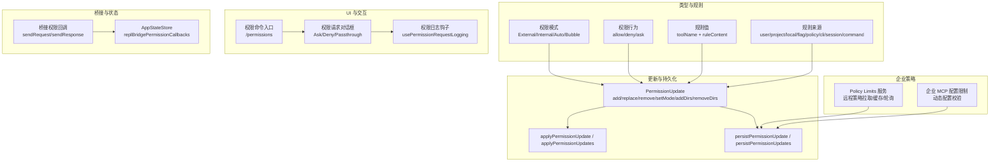
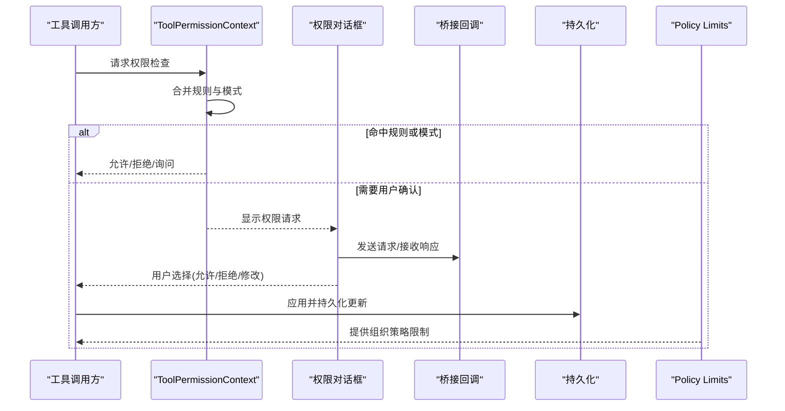
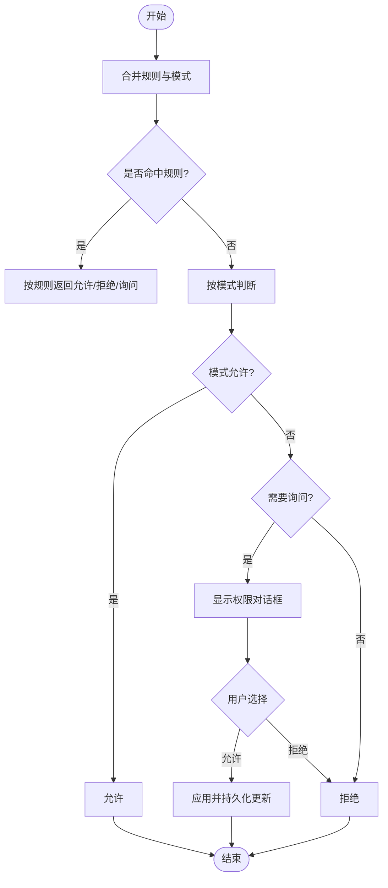
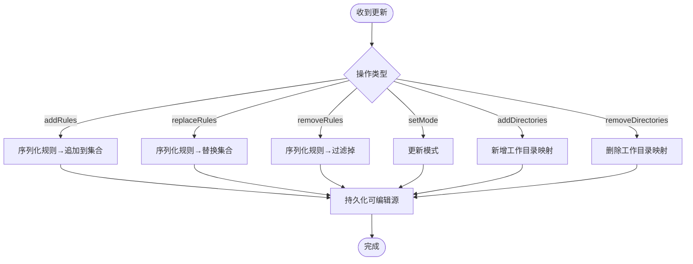
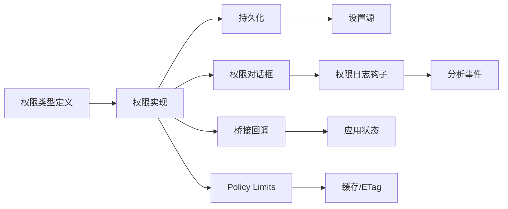

# 权限配置

<cite>
**本文引用的文件**
- [src\types\permissions.ts](file://src\types\permissions.ts)
- [src\utils\permissions\PermissionRule.ts](file://src\utils\permissions\PermissionRule.ts)
- [src\utils\permissions\PermissionUpdate.ts](file://src\utils\permissions\PermissionUpdate.ts)
- [src\components\permissions\hooks.ts](file://src\components\permissions\hooks.ts)
- [src\commands\permissions\permissions.tsx](file://src\commands\permissions\permissions.tsx)
- [src\bridge\bridgePermissionCallbacks.ts](file://src\bridge\bridgePermissionCallbacks.ts)
- [src\state\AppStateStore.ts](file://src\state\AppStateStore.ts)
- [src\services\policyLimits\index.ts](file://src\services\policyLimits\index.ts)
- [src\utils\status.tsx](file://src\utils\status.tsx)
- [src\commands\login\login.tsx](file://src\commands\login\login.tsx)
- [src\constants\cyberRiskInstruction.ts](file://src\constants\cyberRiskInstruction.ts)
- [src\main.tsx](file://src\main.tsx)
</cite>

## 目录
1. [简介](#简介)
2. [项目结构](#项目结构)
3. [核心组件](#核心组件)
4. [架构总览](#架构总览)
5. [详细组件分析](#详细组件分析)
6. [依赖分析](#依赖分析)
7. [性能考虑](#性能考虑)
8. [故障排除指南](#故障排除指南)
9. [结论](#结论)
10. [附录](#附录)

## 简介
本文件面向 Claude Code 的权限配置系统，提供从规则定义、匹配逻辑、优先级到用户偏好、托管设置、继承与覆盖、导入导出与批量管理、最佳实践与故障排除的完整技术文档。重点覆盖以下方面：
- 权限规则的语法、来源与持久化
- 权限决策流程（允许/询问/拒绝）及异步分类器支持
- 用户偏好设置（自动模式、权限提示频率、安全策略）
- 企业托管设置（远程/本地/注册表/文件）与策略控制
- 继承与覆盖规则、冲突解决机制
- 导入导出与批量管理能力
- 安全与合规建议、与系统其他模块的集成关系

## 项目结构
权限配置系统由“类型定义层”“更新与持久化层”“UI 交互层”“桥接回调层”“状态与上下文层”“企业策略服务层”等组成，围绕 ToolPermissionContext 与 PermissionUpdate 进行协作。

**图表来源**
- [src\types\permissions.ts:16-38](file://src\types\permissions.ts#L16-L38)
- [src\types\permissions.ts:44-79](file://src\types\permissions.ts#L44-L79)
- [src\types\permissions.ts:54-63](file://src\types\permissions.ts#L54-L63)
- [src\utils\permissions\PermissionUpdate.ts:55-206](file://src\utils\permissions\PermissionUpdate.ts#L55-L206)
- [src\utils\permissions\PermissionUpdate.ts:222-353](file://src\utils\permissions\PermissionUpdate.ts#L222-L353)
- [src\commands\permissions\permissions.tsx:1-9](file://src\commands\permissions\permissions.tsx#L1-L9)
- [src\components\permissions\hooks.ts:101-209](file://src\components\permissions\hooks.ts#L101-L209)
- [src\bridge\bridgePermissionCallbacks.ts:1-43](file://src\bridge\bridgePermissionCallbacks.ts#L1-L43)
- [src\state\AppStateStore.ts:446-451](file://src\state\AppStateStore.ts#L446-L451)
- [src\services\policyLimits\index.ts:556-575](file://src\services\policyLimits\index.ts#L556-L575)
- [src\main.tsx:1590-1594](file://src\main.tsx#L1590-L1594)

**章节来源**
- [src\types\permissions.ts:16-38](file://src\types\permissions.ts#L16-L38)
- [src\utils\permissions\PermissionUpdate.ts:55-206](file://src\utils\permissions\PermissionUpdate.ts#L55-L206)
- [src\commands\permissions\permissions.tsx:1-9](file://src\commands\permissions\permissions.tsx#L1-L9)
- [src\components\permissions\hooks.ts:101-209](file://src\components\permissions\hooks.ts#L101-L209)
- [src\bridge\bridgePermissionCallbacks.ts:1-43](file://src\bridge\bridgePermissionCallbacks.ts#L1-L43)
- [src\state\AppStateStore.ts:446-451](file://src\state\AppStateStore.ts#L446-L451)
- [src\services\policyLimits\index.ts:556-575](file://src\services\policyLimits\index.ts#L556-L575)
- [src\main.tsx:1590-1594](file://src\main.tsx#L1590-L1594)

## 核心组件
- 权限模式与行为
  - 模式：外部可配置模式集合与内部扩展模式（含自动模式），用于决定默认处理策略。
  - 行为：允许、拒绝、询问；询问时可附带建议的规则更新与阻断路径信息。
- 规则与来源
  - 规则值包含工具名与可选内容；规则来源覆盖用户/项目/本地/标志/策略/CLI/会话/命令等。
- 更新与持久化
  - 支持添加、替换、移除规则，设置模式，增删工作目录范围；仅对可编辑设置源进行持久化。
- 决策与结果
  - 决策包含允许、询问（含建议）、拒绝、透传；并带有决策原因（规则/模式/子命令结果/分类器/钩子/工作目录/安全检查等）。
- 分类器与异步评估
  - 支持允许分类器异步评估，必要时在用户响应前给出自动批准。

**章节来源**
- [src\types\permissions.ts:16-38](file://src\types\permissions.ts#L16-L38)
- [src\types\permissions.ts:44-79](file://src\types\permissions.ts#L44-L79)
- [src\types\permissions.ts:54-63](file://src\types\permissions.ts#L54-L63)
- [src\types\permissions.ts:98-131](file://src\types\permissions.ts#L98-L131)
- [src\types\permissions.ts:171-266](file://src\types\permissions.ts#L171-L266)
- [src\types\permissions.ts:330-397](file://src\types\permissions.ts#L330-L397)

## 架构总览
权限系统围绕 ToolPermissionContext 与 PermissionUpdate 协作，通过 UI 对话框与桥接回调实现跨通道的一致权限判定，并通过企业策略服务与托管设置实现集中控制。

**图表来源**
- [src\utils\permissions\PermissionUpdate.ts:55-206](file://src\utils\permissions\PermissionUpdate.ts#L55-L206)
- [src\components\permissions\hooks.ts:101-209](file://src\components\permissions\hooks.ts#L101-L209)
- [src\bridge\bridgePermissionCallbacks.ts:10-27](file://src\bridge\bridgePermissionCallbacks.ts#L10-L27)
- [src\services\policyLimits\index.ts:510-526](file://src\services\policyLimits\index.ts#L510-L526)

## 详细组件分析

### 权限规则与匹配逻辑
- 规则语法
  - 工具名必填，规则内容可选；内容解析由各工具自定义。
  - 规则来源区分用户/项目/本地/标志/策略/CLI/会话/命令，便于审计与覆盖。
- 匹配逻辑
  - 优先按来源分组的规则集合（总是允许/总是拒绝/总是询问）进行匹配。
  - 若无命中，依据模式（默认/禁止询问/接受编辑/绕过权限/计划模式/自动模式）决定是否提示或直接允许。
  - 工作目录范围额外纳入检查，避免越权访问。
- 决策原因
  - 决策结果附带决策原因，便于诊断与审计（规则、模式、子命令结果、分类器、钩子、工作目录、安全检查等）。

**图表来源**
- [src\types\permissions.ts:44-79](file://src\types\permissions.ts#L44-L79)
- [src\types\permissions.ts:171-266](file://src\types\permissions.ts#L171-L266)
- [src\utils\permissions\PermissionUpdate.ts:55-206](file://src\utils\permissions\PermissionUpdate.ts#L55-L206)

**章节来源**
- [src\types\permissions.ts:54-63](file://src\types\permissions.ts#L54-L63)
- [src\types\permissions.ts:171-266](file://src\types\permissions.ts#L171-L266)
- [src\utils\permissions\PermissionRule.ts:25-40](file://src\utils\permissions\PermissionRule.ts#L25-L40)

### 权限更新与持久化
- 更新操作
  - 添加/替换/移除规则；设置模式；增删工作目录范围。
  - 应用更新时，将规则序列化为字符串并写入对应集合（允许/拒绝/询问）。
- 持久化
  - 仅对可编辑设置源（用户/项目/本地）进行持久化；CLI 参数与会话不持久化。
  - 规则持久化采用去重与规范化（解析→序列化）确保一致性。
- 批量管理
  - 支持一次性应用多个更新；提取规则集合用于建议生成与日志记录。

**图表来源**
- [src\utils\permissions\PermissionUpdate.ts:55-206](file://src\utils\permissions\PermissionUpdate.ts#L55-L206)
- [src\utils\permissions\PermissionUpdate.ts:222-353](file://src\utils\permissions\PermissionUpdate.ts#L222-L353)

**章节来源**
- [src\utils\permissions\PermissionUpdate.ts:30-47](file://src\utils\permissions\PermissionUpdate.ts#L30-L47)
- [src\utils\permissions\PermissionUpdate.ts:208-216](file://src\utils\permissions\PermissionUpdate.ts#L208-L216)
- [src\utils\permissions\PermissionUpdate.ts:222-353](file://src\utils\permissions\PermissionUpdate.ts#L222-L353)

### 用户偏好设置与自动模式
- 自动模式
  - 在启用 Transcript 分类器特性时可用；允许分类器在用户确认前进行异步评估，减少打扰。
- 权限提示频率
  - 通过权限请求日志统计与分析事件，追踪提示次数与决策原因，辅助优化提示策略。
- 安全策略选择
  - 企业策略通过 Policy Limits 服务拉取并缓存，失败时采用“开环”策略（继续运行但不强制限制）。
  - 企业 MCP 配置限制：当存在企业 MCP 配置时，禁止动态配置 MCP 服务器（除非类型为内部 SDK 类型）。

**章节来源**
- [src\types\permissions.ts:34-36](file://src\types\permissions.ts#L34-L36)
- [src\components\permissions\hooks.ts:101-209](file://src\components\permissions\hooks.ts#L101-L209)
- [src\services\policyLimits\index.ts:510-526](file://src\services\policyLimits\index.ts#L510-L526)
- [src\main.tsx:1590-1594](file://src\main.tsx#L1590-L1594)

### 托管设置与企业策略控制
- 设置来源识别
  - 支持用户设置、项目设置、本地设置、标志设置、策略设置、CLI 参数、会话、命令等来源。
  - 企业策略设置进一步细分为远程、plist、HKLM、文件（含 drop-ins）、HKCU 等。
- 策略服务
  - Policy Limits 服务负责获取组织级策略限制，采用 ETag 缓存、后台轮询、重试与超时保护，失败时“开环”。
- 登录与刷新
  - 登录后刷新策略与托管设置，确保权限策略与当前认证状态一致。

**章节来源**
- [src\types\permissions.ts:54-63](file://src\types\permissions.ts#L54-L63)
- [src\utils\status.tsx:126-173](file://src\utils\status.tsx#L126-L173)
- [src\utils\status.tsx:138-166](file://src\utils\status.tsx#L138-L166)
- [src\services\policyLimits\index.ts:556-575](file://src\services\policyLimits\index.ts#L556-L575)
- [src\commands\login\login.tsx:17-18](file://src\commands\login\login.tsx#L17-L18)

### 权限配置的继承与覆盖规则
- 继承顺序（从高到低）
  - 会话级别（临时）→ 命令级别（一次性）→ CLI 参数 → 标志设置 → 本地设置 → 项目设置 → 用户设置 → 策略设置（企业）。
- 覆盖与冲突解决
  - 规则集合按来源分组；同一来源的替换操作会清空旧集合再写入新集合。
  - 工作目录范围以映射形式叠加，避免重复；删除时按路径精确移除。
  - 决策原因明确标注来源，便于定位冲突点。

**章节来源**
- [src\types\permissions.ts:54-63](file://src\types\permissions.ts#L54-L63)
- [src\utils\permissions\PermissionUpdate.ts:97-120](file://src\utils\permissions\PermissionUpdate.ts#L97-L120)
- [src\utils\permissions\PermissionUpdate.ts:171-183](file://src\utils\permissions\PermissionUpdate.ts#L171-L183)

### 权限配置的导入导出与批量管理
- 导入/导出
  - 规则以字符串形式存储，支持解析与序列化；通过设置源进行导入/导出。
  - 工作目录范围作为数组持久化，支持批量增删。
- 批量管理
  - 一次应用多个更新；提取规则集合用于建议生成与日志输出。
  - 建议生成函数可针对目录生成“只读”规则建议，便于快速授权。

**章节来源**
- [src\utils\permissions\PermissionUpdate.ts:30-47](file://src\utils\permissions\PermissionUpdate.ts#L30-L47)
- [src\utils\permissions\PermissionUpdate.ts:355-390](file://src\utils\permissions\PermissionUpdate.ts#L355-L390)

### 权限配置与系统其他组件的集成
- 桥接回调
  - 通过桥接回调实现跨通道的权限请求与响应，支持取消与订阅。
- 状态存储
  - 应用状态中保存桥接权限回调实例，确保权限检查贯穿多通道。
- 安全指令
  - 安全风险指令约束工具使用边界，防止滥用。

**章节来源**
- [src\bridge\bridgePermissionCallbacks.ts:10-27](file://src\bridge\bridgePermissionCallbacks.ts#L10-L27)
- [src\state\AppStateStore.ts:446-451](file://src\state\AppStateStore.ts#L446-L451)
- [src\constants\cyberRiskInstruction.ts:1-24](file://src\constants\cyberRiskInstruction.ts#L1-L24)

## 依赖分析
- 类型与实现解耦
  - 权限类型定义独立于实现，避免循环依赖；实现文件通过类型文件进行编译期约束。
- 组件耦合
  - UI 对话框依赖日志钩子与持久化；持久化依赖设置源；桥接回调与状态存储相互配合。
- 外部依赖
  - 企业策略服务依赖网络与文件缓存；安全指令为常量定义，不引入运行时依赖。

**图表来源**
- [src\types\permissions.ts:1-10](file://src\types\permissions.ts#L1-L10)
- [src\components\permissions\hooks.ts:101-209](file://src\components\permissions\hooks.ts#L101-L209)
- [src\utils\permissions\PermissionUpdate.ts:222-353](file://src\utils\permissions\PermissionUpdate.ts#L222-L353)
- [src\bridge\bridgePermissionCallbacks.ts:1-43](file://src\bridge\bridgePermissionCallbacks.ts#L1-L43)
- [src\state\AppStateStore.ts:446-451](file://src\state\AppStateStore.ts#L446-L451)
- [src\services\policyLimits\index.ts:556-575](file://src\services\policyLimits\index.ts#L556-L575)

**章节来源**
- [src\types\permissions.ts:1-10](file://src\types\permissions.ts#L1-L10)
- [src\utils\permissions\PermissionUpdate.ts:222-353](file://src\utils\permissions\PermissionUpdate.ts#L222-L353)
- [src\components\permissions\hooks.ts:101-209](file://src\components\permissions\hooks.ts#L101-L209)
- [src\bridge\bridgePermissionCallbacks.ts:1-43](file://src\bridge\bridgePermissionCallbacks.ts#L1-L43)
- [src\state\AppStateStore.ts:446-451](file://src\state\AppStateStore.ts#L446-L451)
- [src\services\policyLimits\index.ts:556-575](file://src\services\policyLimits\index.ts#L556-L575)

## 性能考虑
- 异步分类器
  - 允许分类器在用户确认前进行异步评估，减少等待时间；失败时回退至同步提示。
- 日志与统计
  - 权限请求日志包含决策原因与建议，便于后续优化提示频率与规则粒度。
- 缓存与轮询
  - 企业策略服务采用 ETag 缓存与后台轮询，降低网络开销与延迟。

[本节为通用指导，无需特定文件来源]

## 故障排除指南
- 常见问题
  - 企业 MCP 配置与动态配置冲突：当存在企业 MCP 配置时，禁止动态配置 MCP 服务器（除非类型为内部 SDK 类型）。若出现启动失败，请检查企业配置与动态配置的类型一致性。
  - 权限提示过多：通过权限日志钩子查看决策原因，结合“总是允许”建议批量添加规则，减少重复提示。
  - 企业策略未生效：确认登录状态与认证范围满足策略服务资格；检查缓存文件是否存在与是否被正确加载。
- 解决方案
  - 使用 /permissions 命令进入权限规则列表，手动调整规则或添加建议的规则。
  - 在登录后触发策略刷新，确保最新策略生效。
  - 对于敏感路径（如 .claude/、.git/、shell 配置），分类器可自动评估，避免误判；对于跨机器桥接消息等场景，安全检查可能拒绝，需通过企业策略或管理员审批。

**章节来源**
- [src\main.tsx:1590-1594](file://src\main.tsx#L1590-L1594)
- [src\components\permissions\hooks.ts:101-209](file://src\components\permissions\hooks.ts#L101-L209)
- [src\services\policyLimits\index.ts:556-575](file://src\services\policyLimits\index.ts#L556-L575)
- [src\commands\permissions\permissions.tsx:1-9](file://src\commands\permissions\permissions.tsx#L1-L9)

## 结论
Claude Code 的权限配置系统通过清晰的规则语法、来源与行为定义、严格的持久化与覆盖机制，以及与企业策略服务、桥接回调、状态存储的深度集成，实现了灵活、可审计、可集中控制的权限管理。结合自动模式与分类器异步评估，系统在保证安全的同时提升了用户体验。建议在企业环境中优先使用托管设置与策略服务，配合批量规则导入导出与日志分析，持续优化权限策略。

[本节为总结，无需特定文件来源]

## 附录
- 最佳实践
  - 优先使用“总是允许”建议进行批量授权，减少重复提示。
  - 在企业环境中，统一通过托管设置与策略服务下发规则，避免本地例外破坏整体安全基线。
  - 对敏感目录与系统路径使用更细粒度规则，避免过度授权。
  - 定期审查权限日志，识别高频拒绝与分类器拒绝项，优化规则与提示策略。
- 合规性要求
  - 严格遵守安全风险指令，禁止对破坏性技术与恶意用途提供协助。
  - 企业策略应遵循最小权限原则，结合审计与日志进行合规性检查。

[本节为通用指导，无需特定文件来源]