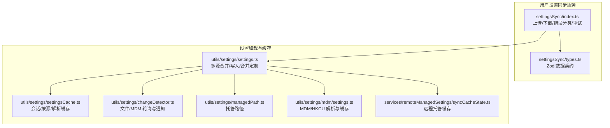
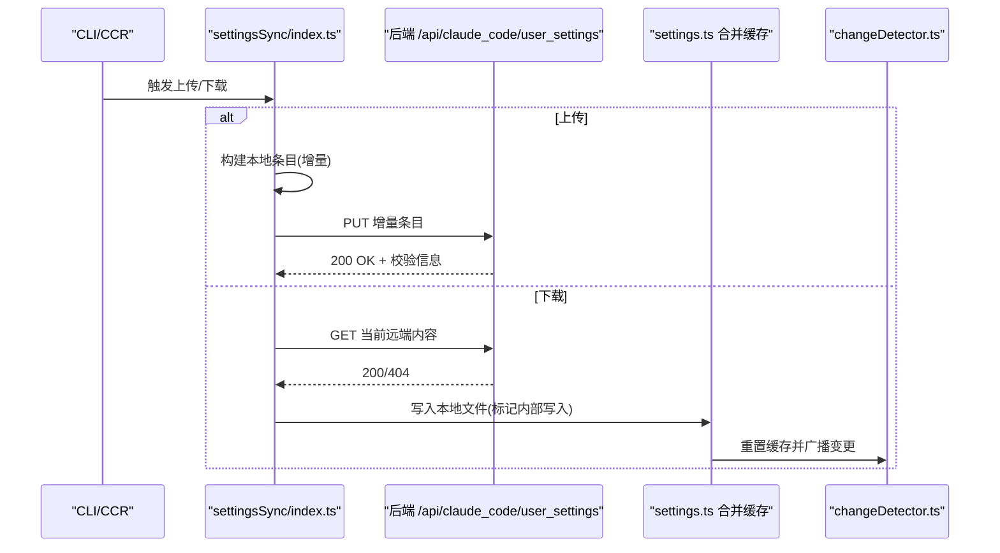
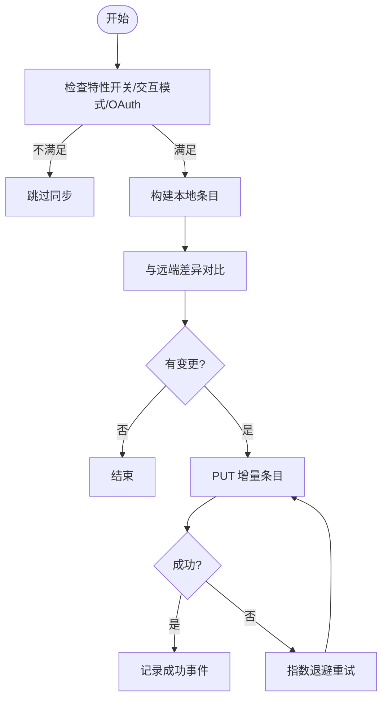
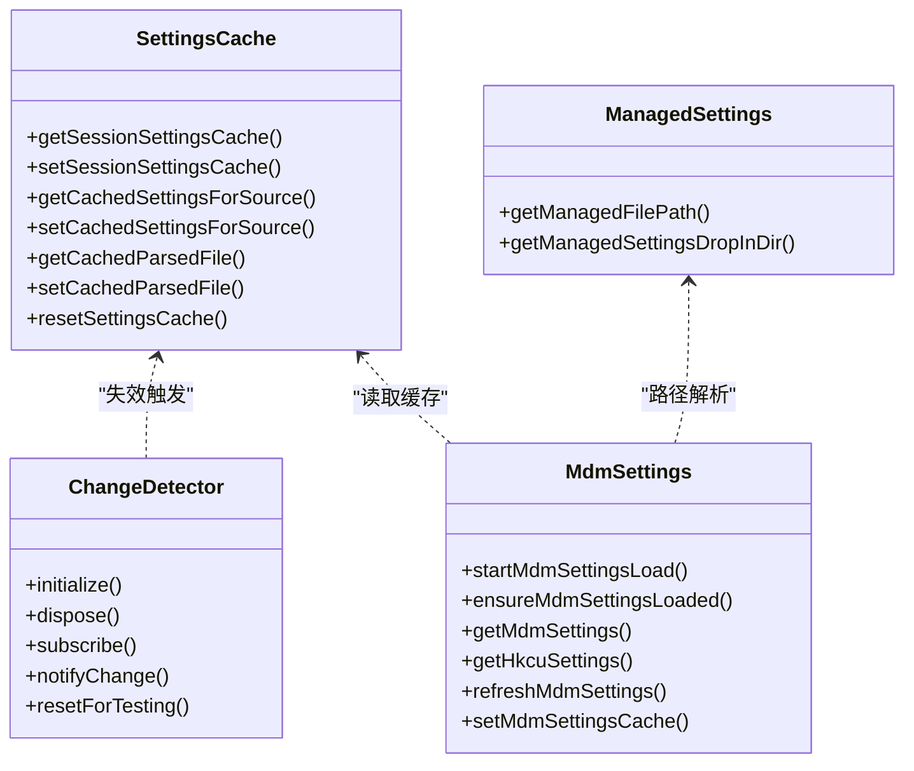
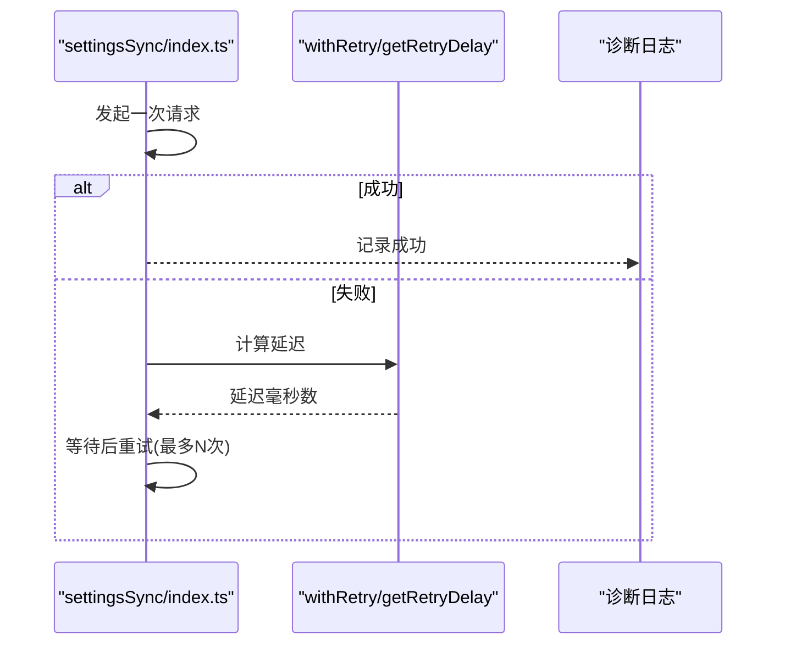
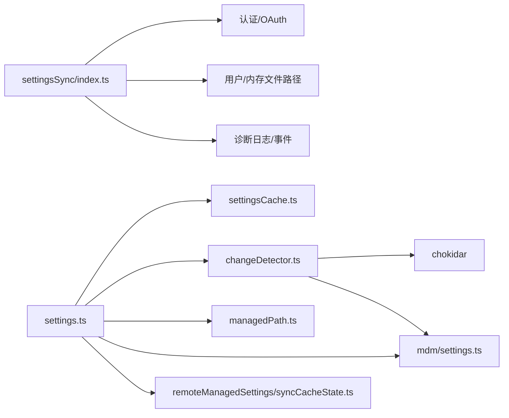

# 设置同步

<cite>
**本文引用的文件**
- [src/services/settingsSync/index.ts](file://src/services/settingsSync/index.ts)
- [src/services/settingsSync/types.ts](file://src/services/settingsSync/types.ts)
- [src/utils/settings/settings.ts](file://src/utils/settings/settings.ts)
- [src/utils/settings/settingsCache.ts](file://src/utils/settings/settingsCache.ts)
- [src/utils/settings/changeDetector.ts](file://src/utils/settings/changeDetector.ts)
- [src/utils/settings/managedPath.ts](file://src/utils/settings/managedPath.ts)
- [src/utils/settings/mdm/settings.ts](file://src/utils/settings/mdm/settings.ts)
- [src/services/remoteManagedSettings/syncCacheState.ts](file://src/services/remoteManagedSettings/syncCacheState.ts)
- [src/main.tsx](file://src/main.tsx)
- [src/commands/bridge-kick.ts](file://src/commands/bridge-kick.ts)
- [src/bridge/pollConfig.ts](file://src/bridge/pollConfig.ts)
- [src/bridge/pollConfigDefaults.ts](file://src/bridge/pollConfigDefaults.ts)
- [src/bridge/replBridge.ts](file://src/bridge/replBridge.ts)
- [src/utils/memoize.ts](file://src/utils/memoize.ts)
</cite>

## 目录
1. [简介](#简介)
2. [项目结构](#项目结构)
3. [核心组件](#核心组件)
4. [架构总览](#架构总览)
5. [详细组件分析](#详细组件分析)
6. [依赖关系分析](#依赖关系分析)
7. [性能考量](#性能考量)
8. [故障排除指南](#故障排除指南)
9. [结论](#结论)
10. [附录：配置与运维指南](#附录配置与运维指南)

## 简介
本文件面向 Claude Code 的“设置同步”子系统，系统性阐述跨设备设置同步的实现机制，覆盖以下主题：
- 同步协议与数据传输：基于 OAuth 的后端 API、增量上传与拉取、响应格式与校验
- 缓存体系：会话级合并缓存、按源缓存、解析缓存、以及失效与写入抑制
- 托管设置同步：企业集中策略（远程托管、MDM、文件型）的优先级与一致性
- 状态管理：同步进度、错误分类、重试与退避、心跳与轮询策略
- 安全保障：认证头注入、用户代理、超时与校验
- 配置指南：同步频率、网络条件优化、带宽管理
- 故障排除：连接失败、认证失败、数据不一致、冲突与回滚
- 协调机制：与变更检测器、内存文件缓存、插件基线等组件的协作

## 项目结构
设置同步涉及两大子系统：
- 用户设置同步服务：负责在交互式 CLI 上传本地设置，或在 CCR 模式下下载远端设置并应用到本地
- 设置加载与缓存：负责从多源（用户、项目、策略、标志位）合并设置，并提供缓存与变更检测

图表来源
- [src/services/settingsSync/index.ts:1-582](file://src/services/settingsSync/index.ts#L1-L582)
- [src/services/settingsSync/types.ts:1-68](file://src/services/settingsSync/types.ts#L1-L68)
- [src/utils/settings/settings.ts:1-1016](file://src/utils/settings/settings.ts#L1-L1016)
- [src/utils/settings/settingsCache.ts:1-81](file://src/utils/settings/settingsCache.ts#L1-L81)
- [src/utils/settings/changeDetector.ts:1-489](file://src/utils/settings/changeDetector.ts#L1-L489)
- [src/utils/settings/managedPath.ts:1-35](file://src/utils/settings/managedPath.ts#L1-L35)
- [src/utils/settings/mdm/settings.ts:1-317](file://src/utils/settings/mdm/settings.ts#L1-L317)
- [src/services/remoteManagedSettings/syncCacheState.ts:1-97](file://src/services/remoteManagedSettings/syncCacheState.ts#L1-L97)

章节来源
- [src/services/settingsSync/index.ts:1-582](file://src/services/settingsSync/index.ts#L1-L582)
- [src/utils/settings/settings.ts:1-1016](file://src/utils/settings/settings.ts#L1-L1016)

## 核心组件
- 用户设置同步服务
  - 上传：仅在交互式 CLI 且满足特性开关与 OAuth 条件时进行；对本地文件构建条目，计算与远端差异后增量上传
  - 下载：在 CCR 模式下启动时触发，支持去重并发下载；可强制重新下载以适配 mid-session 变更
  - 认证与传输：使用 OAuth 访问令牌与特定 Beta 头，超时限制，错误分类与重试
  - 数据契约：Zod 校验的用户同步数据结构，键空间约定
- 设置加载与缓存
  - 多源合并：插件基线 → 远程托管 → MDM → 文件（含 drop-in）→ HKCU → 用户/项目/标志位 → 合并定制
  - 缓存：会话级合并缓存、按源缓存、解析缓存；写入与目录变更时统一失效
  - 变更检测：文件系统事件（chokidar）+ MDM 轮询（30 分钟），删除重建保护，内部写入抑制
  - 托管路径：平台化托管目录与 drop-in 目录
  - 远程托管缓存：本地磁盘上的 remote-settings.json，首次可用时刷新合并缓存

章节来源
- [src/services/settingsSync/index.ts:55-221](file://src/services/settingsSync/index.ts#L55-L221)
- [src/services/settingsSync/types.ts:11-68](file://src/services/settingsSync/types.ts#L11-L68)
- [src/utils/settings/settings.ts:638-800](file://src/utils/settings/settings.ts#L638-L800)
- [src/utils/settings/settingsCache.ts:1-81](file://src/utils/settings/settingsCache.ts#L1-L81)
- [src/utils/settings/changeDetector.ts:84-168](file://src/utils/settings/changeDetector.ts#L84-L168)
- [src/utils/settings/managedPath.ts:8-35](file://src/utils/settings/managedPath.ts#L8-L35)
- [src/utils/settings/mdm/settings.ts:67-147](file://src/utils/settings/mdm/settings.ts#L67-L147)
- [src/services/remoteManagedSettings/syncCacheState.ts:55-97](file://src/services/remoteManagedSettings/syncCacheState.ts#L55-L97)

## 架构总览
设置同步在“用户设置同步服务”与“设置加载与缓存”之间形成双向协同：
- 用户设置同步服务负责与后端 API 交互，将本地设置增量上传，或将远端设置应用到本地
- 设置加载与缓存负责将多源设置合并为最终生效配置，并通过变更检测器感知变化

图表来源
- [src/services/settingsSync/index.ts:60-202](file://src/services/settingsSync/index.ts#L60-L202)
- [src/utils/settings/settings.ts:488-581](file://src/utils/settings/settings.ts#L488-L581)
- [src/utils/settings/changeDetector.ts:437-450](file://src/utils/settings/changeDetector.ts#L437-L450)

## 详细组件分析

### 组件A：用户设置同步服务
- 功能要点
  - 上传：仅在交互式 CLI 且 OAuth 有效时进行；基于本地文件构建条目，与远端内容做差集，增量上传
  - 下载：CCR 启动时触发，支持并发去重；可强制重新下载以适配 mid-session 变更
  - 认证：检查 OAuth 令牌与作用域，注入授权头与 Beta 头
  - 传输：超时限制、错误分类（认证/超时/网络）、指数退避重试
  - 数据契约：Zod 校验用户同步数据结构，定义键空间（全局设置、用户记忆、项目设置/记忆）
- 冲突与一致性
  - 采用“增量上传 + 差异比较”的策略，避免全量覆盖
  - 下载时严格匹配键空间，超出大小限制的条目被丢弃
- 错误处理
  - 404 表示无远端数据，直接跳过
  - 认证失败、网络异常、超时分别分类处理，必要时短路重试
- 性能优化
  - 上传前先做本地差异计算，减少无效请求
  - 下载并发去重，避免重复拉取

图表来源
- [src/services/settingsSync/index.ts:60-111](file://src/services/settingsSync/index.ts#L60-L111)
- [src/services/settingsSync/index.ts:315-345](file://src/services/settingsSync/index.ts#L315-L345)

章节来源
- [src/services/settingsSync/index.ts:55-221](file://src/services/settingsSync/index.ts#L55-L221)
- [src/services/settingsSync/types.ts:11-68](file://src/services/settingsSync/types.ts#L11-L68)

### 组件B：设置加载与缓存
- 多源合并
  - 插件基线（最低优先级）→ 远程托管（最高优先级，first source wins）→ MDM/HKCU/plist → 文件（含 drop-in）→ 用户/项目/标志位
  - 对数组字段采用去重合并；对对象字段深度合并
- 缓存策略
  - 会话级合并缓存：一次性读取并合并，后续读取命中
  - 按源缓存：针对单个来源的解析结果缓存
  - 解析缓存：对同一路径的文件解析结果缓存
  - 失效机制：写入、目录变更、插件初始化、钩子刷新时统一清空
- 变更检测
  - 文件系统事件：chokidar 监听已存在目录，忽略非目标文件与 .git
  - 删除重建保护：删除事件延时处理，若在宽限期内重建则转为变更
  - 内部写入抑制：在短时间内由内部写入触发的变更会被忽略，避免循环通知
  - MDM 轮询：每 30 分钟快照比对，变化时更新缓存并广播
- 托管设置
  - 平台化托管目录与 drop-in 目录，支持 macOS plist 与 Windows 注册表
  - 远程托管缓存：本地磁盘上的 remote-settings.json，首次可用时刷新合并缓存

图表来源
- [src/utils/settings/settingsCache.ts:1-81](file://src/utils/settings/settingsCache.ts#L1-L81)
- [src/utils/settings/changeDetector.ts:84-168](file://src/utils/settings/changeDetector.ts#L84-L168)
- [src/utils/settings/managedPath.ts:8-35](file://src/utils/settings/managedPath.ts#L8-L35)
- [src/utils/settings/mdm/settings.ts:67-147](file://src/utils/settings/mdm/settings.ts#L67-L147)

章节来源
- [src/utils/settings/settings.ts:638-800](file://src/utils/settings/settings.ts#L638-L800)
- [src/utils/settings/settingsCache.ts:1-81](file://src/utils/settings/settingsCache.ts#L1-L81)
- [src/utils/settings/changeDetector.ts:84-168](file://src/utils/settings/changeDetector.ts#L84-L168)
- [src/utils/settings/managedPath.ts:8-35](file://src/utils/settings/managedPath.ts#L8-L35)
- [src/utils/settings/mdm/settings.ts:67-147](file://src/utils/settings/mdm/settings.ts#L67-L147)
- [src/services/remoteManagedSettings/syncCacheState.ts:55-97](file://src/services/remoteManagedSettings/syncCacheState.ts#L55-L97)

### 组件C：托管设置的同步管理与权限控制
- 企业环境中的集中配置
  - 远程托管：优先级最高，首次可用时刷新合并缓存
  - MDM/HKCU/plist：平台化策略，HKLM/HKCU 与文件型策略按优先级合并
  - 权限控制：通过设置中的权限规则与沙箱配置进行细粒度控制
- 与设置同步的集成
  - 远程托管缓存与设置加载链路解耦，避免认证环依赖
  - 变更检测器对 MDM 进行轮询，确保策略变化及时反映

章节来源
- [src/utils/settings/mdm/settings.ts:114-173](file://src/utils/settings/mdm/settings.ts#L114-L173)
- [src/services/remoteManagedSettings/syncCacheState.ts:55-97](file://src/services/remoteManagedSettings/syncCacheState.ts#L55-L97)
- [src/utils/settings/settings.ts:674-739](file://src/utils/settings/settings.ts#L674-L739)

### 组件D：状态管理与重试机制
- 同步进度与状态
  - 上传/下载开始、成功、失败、空数据、无变更等诊断日志
  - 404 视为空数据，不视为错误
- 错误处理与重试
  - 错误分类：认证、超时、网络
  - 重试：最大次数限制，指数退避延迟
- 心跳与轮询
  - 轮询配置来自 GrowthBook，支持不同容量下的轮询间隔
  - 心跳循环在错误时进行退避，避免紧贴轮询的死循环

图表来源
- [src/services/settingsSync/index.ts:315-345](file://src/services/settingsSync/index.ts#L315-L345)
- [src/services/settingsSync/index.ts:247-313](file://src/services/settingsSync/index.ts#L247-L313)

章节来源
- [src/services/settingsSync/index.ts:296-345](file://src/services/settingsSync/index.ts#L296-L345)
- [src/bridge/pollConfig.ts:102-110](file://src/bridge/pollConfig.ts#L102-L110)
- [src/bridge/pollConfigDefaults.ts:13-32](file://src/bridge/pollConfigDefaults.ts#L13-L32)
- [src/bridge/replBridge.ts:2044-2080](file://src/bridge/replBridge.ts#L2044-L2080)

## 依赖关系分析
- settingsSync/index.ts 依赖
  - 认证与 OAuth：访问令牌与作用域检查
  - 用户代理与 API 提供方：UA 注入与基础 URL 判断
  - 设置文件路径与内存文件路径：用于构建条目与写入
  - 诊断日志与分析事件：用于可观测性
- settings.ts 依赖
  - 多源设置读取与合并：文件、MDM、远程托管、插件基线
  - 缓存模块：会话/按源/解析缓存
  - 变更检测器：文件系统与 MDM 变更
- changeDetector.ts 依赖
  - chokidar：文件系统事件
  - MDM 子系统：轮询与快照比对
  - 内部写入抑制：避免循环通知

图表来源
- [src/services/settingsSync/index.ts:18-49](file://src/services/settingsSync/index.ts#L18-L49)
- [src/utils/settings/settings.ts:1-54](file://src/utils/settings/settings.ts#L1-L54)
- [src/utils/settings/settingsCache.ts:1-81](file://src/utils/settings/settingsCache.ts#L1-L81)
- [src/utils/settings/changeDetector.ts:1-26](file://src/utils/settings/changeDetector.ts#L1-L26)
- [src/utils/settings/managedPath.ts:1-35](file://src/utils/settings/managedPath.ts#L1-L35)
- [src/utils/settings/mdm/settings.ts:1-47](file://src/utils/settings/mdm/settings.ts#L1-L47)
- [src/services/remoteManagedSettings/syncCacheState.ts:24-31](file://src/services/remoteManagedSettings/syncCacheState.ts#L24-L31)

章节来源
- [src/services/settingsSync/index.ts:18-49](file://src/services/settingsSync/index.ts#L18-L49)
- [src/utils/settings/settings.ts:1-54](file://src/utils/settings/settings.ts#L1-L54)

## 性能考量
- 缓存与去重
  - 会话级合并缓存与解析缓存显著降低重复读取成本
  - 并发下载去重，避免重复拉取
- 写入抑制
  - 标记内部写入，避免因自身写入触发变更通知
- 传输优化
  - 增量上传，限制单文件大小，避免大文件影响性能
  - 超时与重试退避，降低网络抖动影响
- I/O 优化
  - 写文件前确保父目录存在，减少多次失败重试
  - 内存文件缓存清理与设置缓存统一失效，保证一致性

章节来源
- [src/utils/settings/settingsCache.ts:55-60](file://src/utils/settings/settingsCache.ts#L55-L60)
- [src/utils/settings/changeDetector.ts:284-301](file://src/utils/settings/changeDetector.ts#L284-L301)
- [src/services/settingsSync/index.ts:398-416](file://src/services/settingsSync/index.ts#L398-L416)
- [src/services/settingsSync/index.ts:461-478](file://src/services/settingsSync/index.ts#L461-L478)

## 故障排除指南
- 连接问题
  - 现象：无法连接服务器、超时
  - 排查：确认网络连通、代理设置、超时阈值；查看错误分类为“网络/超时”
  - 处理：启用重试、检查防火墙与 DNS
- 认证失败
  - 现象：返回未授权、作用域不足
  - 排查：确认 OAuth 令牌与作用域、Beta 头是否正确注入
  - 处理：重新登录获取令牌、检查 API 提供方与基础 URL
- 数据不一致
  - 现象：下载后设置未生效、键空间不匹配
  - 排查：确认键空间是否符合约定、文件大小是否超过限制
  - 处理：强制重新下载、检查本地文件写入权限
- 变更检测异常
  - 现象：文件变更未触发、循环通知
  - 排查：检查 chokidar 监听目录、忽略规则、删除重建保护窗口
  - 处理：重启监听、调整稳定性阈值与轮询间隔
- MDM 变更未生效
  - 现象：策略更新后未反映
  - 排查：确认轮询间隔、快照比对逻辑
  - 处理：等待轮询周期、手动刷新缓存

章节来源
- [src/services/settingsSync/index.ts:296-313](file://src/services/settingsSync/index.ts#L296-L313)
- [src/utils/settings/changeDetector.ts:324-360](file://src/utils/settings/changeDetector.ts#L324-L360)
- [src/utils/settings/mdm/settings.ts:381-418](file://src/utils/settings/mdm/settings.ts#L381-L418)

## 结论
设置同步系统通过“增量上传 + 差异对比 + Zod 校验 + 缓存失效 + 变更检测”的组合，实现了跨设备的一致性与可靠性。企业环境通过远程托管与 MDM/HKCU/plist 的优先级策略，确保集中配置的权威性与灵活性。配合可观测性与重试退避机制，系统在复杂网络与多源环境下仍能保持稳定。

## 附录：配置与运维指南
- 同步频率
  - 用户设置同步：按需触发（上传在交互式 CLI，下载在 CCR 启动）
  - MDM 轮询：默认 30 分钟一次，可在变更检测器中调整
- 网络条件优化
  - 使用稳定的网络与合理的超时阈值
  - 在弱网环境下适当增加重试次数与退避时间
- 带宽管理
  - 控制单文件大小（默认 500KB），避免大文件同步
  - 合理安排上传/下载时机，避开业务高峰期
- 其他运维建议
  - 定期检查诊断日志，关注认证、网络与超时类错误
  - 在企业环境中，确保远程托管与 MDM 策略的键空间与格式符合约定

章节来源
- [src/bridge/pollConfig.ts:102-110](file://src/bridge/pollConfig.ts#L102-L110)
- [src/bridge/pollConfigDefaults.ts:13-32](file://src/bridge/pollConfigDefaults.ts#L13-L32)
- [src/services/settingsSync/index.ts:51-54](file://src/services/settingsSync/index.ts#L51-L54)
- [src/utils/settings/changeDetector.ts:38-51](file://src/utils/settings/changeDetector.ts#L38-L51)