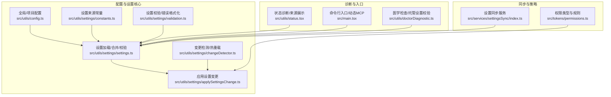
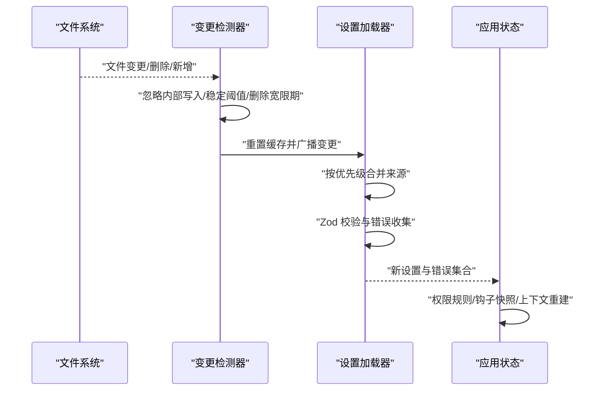
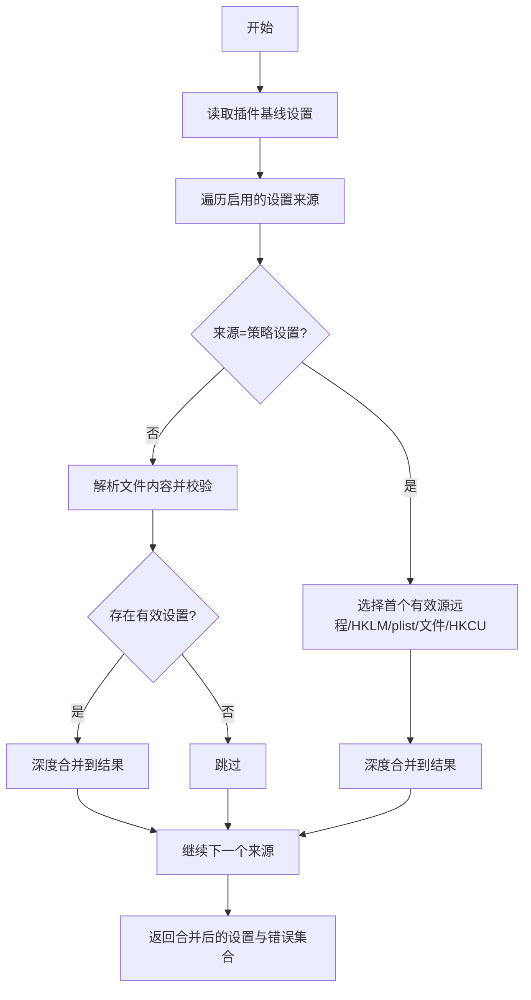
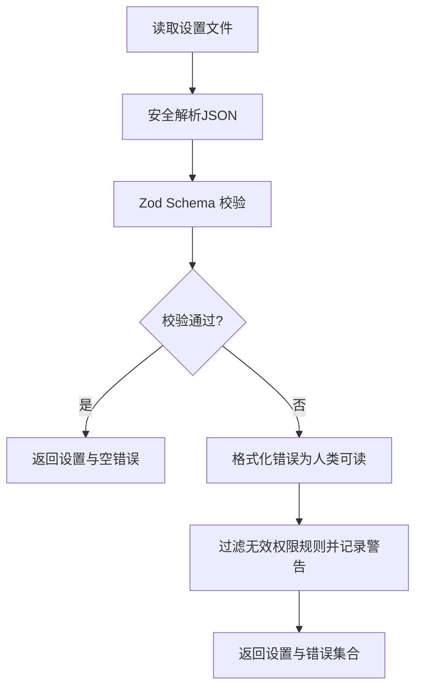
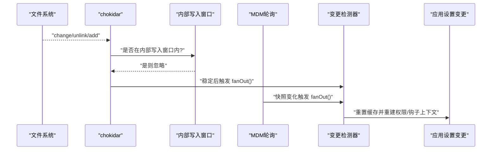
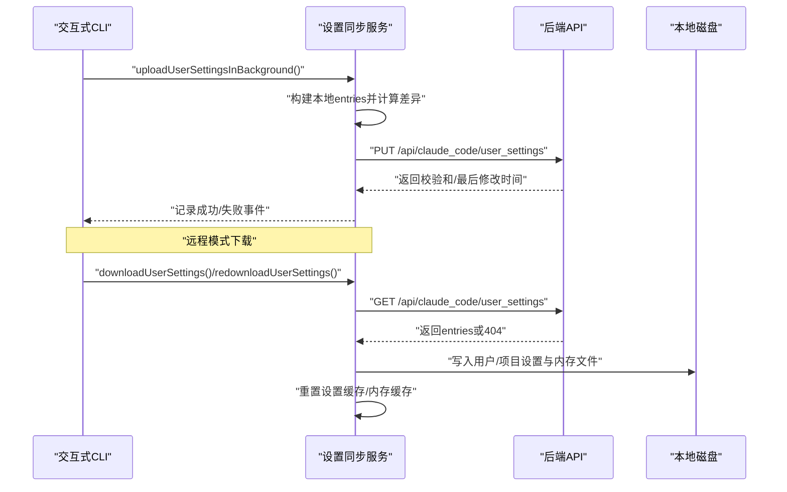
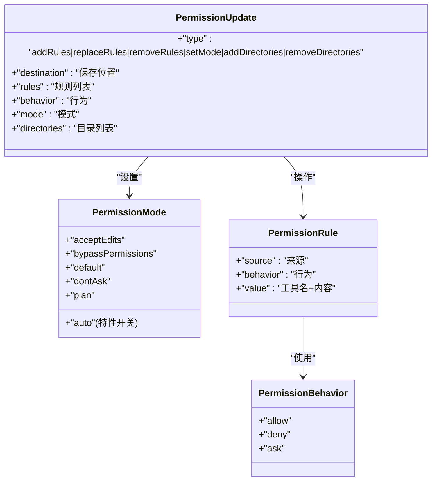
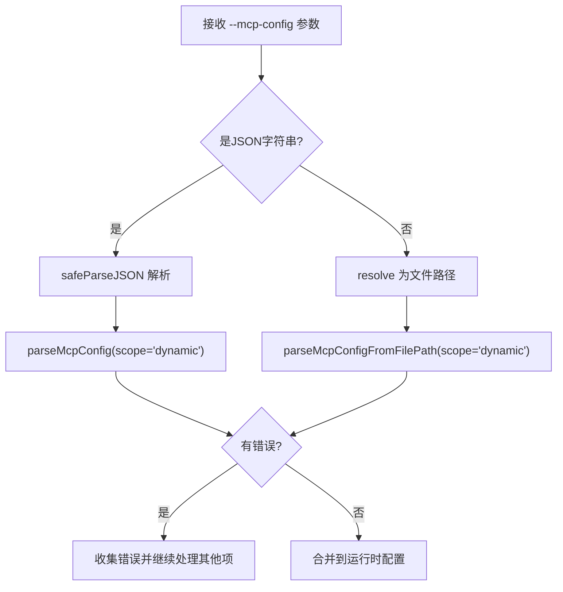
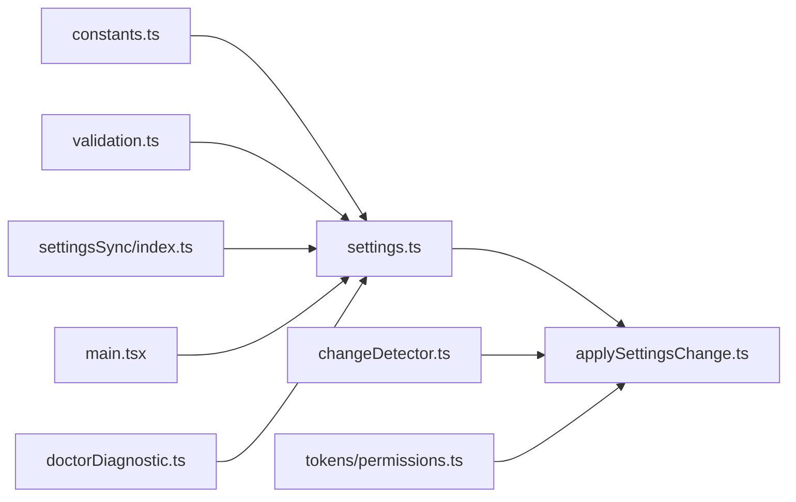

# 配置和设置

<cite>
**本文引用的文件**
- [src/utils/config.ts](file://src/utils/config.ts)
- [src/utils/settings/settings.ts](file://src/utils/settings/settings.ts)
- [src/utils/settings/constants.ts](file://src/utils/settings/constants.ts)
- [src/utils/settings/validation.ts](file://src/utils/settings/validation.ts)
- [src/utils/settings/changeDetector.ts](file://src/utils/settings/changeDetector.ts)
- [src/utils/settings/applySettingsChange.ts](file://src/utils/settings/applySettingsChange.ts)
- [src/services/settingsSync/index.ts](file://src/services/settingsSync/index.ts)
- [src/tokens/permissions.ts](file://src/tokens/permissions.ts)
- [src/utils/status.tsx](file://src/utils/status.tsx)
- [src/main.tsx](file://src/main.tsx)
- [src/utils/doctorDiagnostic.ts](file://src/utils/doctorDiagnostic.ts)
</cite>

## 目录
1. [简介](#简介)
2. [项目结构](#项目结构)
3. [核心组件](#核心组件)
4. [架构总览](#架构总览)
5. [详细组件分析](#详细组件分析)
6. [依赖关系分析](#依赖关系分析)
7. [性能考量](#性能考量)
8. [故障排查指南](#故障排查指南)
9. [结论](#结论)
10. [附录：配置示例与最佳实践](#附录配置示例与最佳实践)

## 简介
本文件系统性梳理 Claude Code 的配置与设置体系，覆盖以下主题：
- 全局配置与项目配置的数据结构与默认值
- 设置来源与合并优先级（用户、项目、本地、策略、命令行）
- 权限规则定义、用户偏好与安全策略
- 跨设备设置同步与托管设置管理
- 配置验证、变更检测与错误处理
- 动态更新与热重载机制
- 导入/导出与备份恢复建议
- 安全与隐私注意事项

## 项目结构
围绕“配置与设置”的核心代码分布在如下模块：
- 配置数据结构与默认值：src/utils/config.ts
- 设置加载、合并、校验与持久化：src/utils/settings/*.ts
- 设置来源常量与显示名：src/utils/settings/constants.ts
- 变更检测与热重载：src/utils/settings/changeDetector.ts
- 应用设置变更副作用：src/utils/settings/applySettingsChange.ts
- 设置同步服务（上传/下载）：src/services/settingsSync/index.ts
- 权限类型与规则：src/tokens/permissions.ts
- 状态诊断与来源展示：src/utils/status.tsx
- 命令行解析与动态 MCP 配置：src/main.tsx
- 医学检查与托管设置校验：src/utils/doctorDiagnostic.ts

图表来源
- [src/utils/config.ts:183-578](file://src/utils/config.ts#L183-L578)
- [src/utils/settings/settings.ts:645-796](file://src/utils/settings/settings.ts#L645-L796)
- [src/utils/settings/constants.ts:7-22](file://src/utils/settings/constants.ts#L7-L22)
- [src/utils/settings/validation.ts:97-173](file://src/utils/settings/validation.ts#L97-L173)
- [src/utils/settings/changeDetector.ts:84-146](file://src/utils/settings/changeDetector.ts#L84-L146)
- [src/utils/settings/applySettingsChange.ts:33-92](file://src/utils/settings/applySettingsChange.ts#L33-L92)
- [src/services/settingsSync/index.ts:60-111](file://src/services/settingsSync/index.ts#L60-L111)
- [src/tokens/permissions.ts:54-138](file://src/tokens/permissions.ts#L54-L138)
- [src/utils/status.tsx:126-174](file://src/utils/status.tsx#L126-L174)
- [src/main.tsx:1415-1452](file://src/main.tsx#L1415-L1452)
- [src/utils/doctorDiagnostic.ts:331-355](file://src/utils/doctorDiagnostic.ts#L331-L355)

章节来源
- [src/utils/config.ts:183-578](file://src/utils/config.ts#L183-L578)
- [src/utils/settings/settings.ts:645-796](file://src/utils/settings/settings.ts#L645-L796)
- [src/utils/settings/constants.ts:7-22](file://src/utils/settings/constants.ts#L7-L22)

## 核心组件
- 全局配置 GlobalConfig 与项目配置 ProjectConfig：定义键空间、默认值与平台特性开关，支持主题、通知渠道、编辑器模式、自动更新、终端进度条等。
- 设置来源与合并：用户设置、项目设置、本地设置、策略设置（企业托管）、命令行内联设置；策略设置采用“首个有效源优先”策略，其余来源按顺序深度合并。
- 设置校验与错误格式化：基于 Zod Schema 的严格校验，提供可读的错误信息与修复建议。
- 变更检测与热重载：基于 chokidar 文件系统事件与 MDM 注册表/属性列表轮询，结合“内部写入窗口”避免自产变更触发重复通知。
- 设置同步：交互式 CLI 支持增量上传，远程模式支持拉取并应用到本地，含大小限制、超时与重试策略。

章节来源
- [src/utils/config.ts:183-578](file://src/utils/config.ts#L183-L578)
- [src/utils/settings/settings.ts:674-796](file://src/utils/settings/settings.ts#L674-L796)
- [src/utils/settings/validation.ts:97-173](file://src/utils/settings/validation.ts#L97-L173)
- [src/utils/settings/changeDetector.ts:268-360](file://src/utils/settings/changeDetector.ts#L268-L360)
- [src/services/settingsSync/index.ts:60-111](file://src/services/settingsSync/index.ts#L60-L111)

## 架构总览
设置系统以“来源优先级 + 深度合并 + 校验 + 变更检测 + 同步”为核心路径，形成从磁盘到内存再到应用状态的闭环。

图表来源
- [src/utils/settings/changeDetector.ts:268-360](file://src/utils/settings/changeDetector.ts#L268-L360)
- [src/utils/settings/settings.ts:645-796](file://src/utils/settings/settings.ts#L645-L796)
- [src/utils/settings/applySettingsChange.ts:33-92](file://src/utils/settings/applySettingsChange.ts#L33-L92)

## 详细组件分析

### 组件一：设置来源与合并优先级
- 来源顺序（高到低）：策略设置（企业托管）→ 用户设置 → 项目设置 → 本地设置 → 命令行内联设置。
- 策略设置采用“首个有效源优先”：远程托管 > 平台 MDM（HKLM/plist）> 文件（managed-settings.json + drop-ins）> HKCU。
- 其余来源按顺序深度合并，数组采用去重合并策略，对象递归合并。

图表来源
- [src/utils/settings/settings.ts:645-796](file://src/utils/settings/settings.ts#L645-L796)
- [src/utils/settings/settings.ts:322-345](file://src/utils/settings/settings.ts#L322-L345)
- [src/utils/settings/constants.ts:7-22](file://src/utils/settings/constants.ts#L7-L22)

章节来源
- [src/utils/settings/settings.ts:674-796](file://src/utils/settings/settings.ts#L674-L796)
- [src/utils/settings/constants.ts:7-22](file://src/utils/settings/constants.ts#L7-L22)

### 组件二：配置验证与错误处理
- 使用 Zod Schema 对设置进行严格校验，支持 unrecognized keys、invalid type、invalid value、too small 等错误类型，并生成带建议与文档链接的可读错误。
- 在解析权限规则时，先过滤无效规则并发出警告，避免整份设置被拒。
- 医学检查对托管设置中的字段进行额外校验，确保类型正确与枚举值合法。

图表来源
- [src/utils/settings/validation.ts:97-173](file://src/utils/settings/validation.ts#L97-L173)
- [src/utils/settings/validation.ts:224-265](file://src/utils/settings/validation.ts#L224-L265)
- [src/utils/doctorDiagnostic.ts:331-355](file://src/utils/doctorDiagnostic.ts#L331-L355)

章节来源
- [src/utils/settings/validation.ts:97-173](file://src/utils/settings/validation.ts#L97-L173)
- [src/utils/settings/validation.ts:224-265](file://src/utils/settings/validation.ts#L224-L265)
- [src/utils/doctorDiagnostic.ts:331-355](file://src/utils/doctorDiagnostic.ts#L331-L355)

### 组件三：动态更新与热重载
- 文件系统监听：仅监听已存在的目录与目标文件，忽略 .git、特殊文件类型；使用 awaitWriteFinish 稳定阈值与轮询间隔，避免部分写入与抖动。
- 内部写入窗口：在 markInternalWrite 标记后一段时间内忽略来自进程自身的变更，防止“写入→检测→再写入”的无限循环。
- MDM 轮询：注册表/属性列表无法事件监听，采用定时轮询对比快照，变化时触发策略设置刷新。
- 通知链路：单生产者集中重置缓存并广播，避免多消费者重复磁盘读取导致的性能问题。

图表来源
- [src/utils/settings/changeDetector.ts:84-146](file://src/utils/settings/changeDetector.ts#L84-L146)
- [src/utils/settings/changeDetector.ts:268-360](file://src/utils/settings/changeDetector.ts#L268-L360)
- [src/utils/settings/changeDetector.ts:381-418](file://src/utils/settings/changeDetector.ts#L381-L418)
- [src/utils/settings/applySettingsChange.ts:33-92](file://src/utils/settings/applySettingsChange.ts#L33-L92)

章节来源
- [src/utils/settings/changeDetector.ts:84-146](file://src/utils/settings/changeDetector.ts#L84-L146)
- [src/utils/settings/changeDetector.ts:268-360](file://src/utils/settings/changeDetector.ts#L268-L360)
- [src/utils/settings/changeDetector.ts:381-418](file://src/utils/settings/changeDetector.ts#L381-L418)
- [src/utils/settings/applySettingsChange.ts:33-92](file://src/utils/settings/applySettingsChange.ts#L33-L92)

### 组件四：设置同步（跨设备与托管）
- 上传（交互式 CLI）：构建本地变更集（仅差异），鉴权后增量上传，失败时记录诊断事件。
- 下载（远程模式）：获取远端设置，匹配项目 ID 后应用到本地对应文件，标记内部写入抑制误报，完成后清理缓存。
- 认证要求：仅在使用第一方 OAuth 且具备 user:inference 范围时启用。
- 大小限制与超时：单文件最大 500KB，请求超时 10 秒，支持有限次重试。

图表来源
- [src/services/settingsSync/index.ts:60-111](file://src/services/settingsSync/index.ts#L60-L111)
- [src/services/settingsSync/index.ts:129-202](file://src/services/settingsSync/index.ts#L129-L202)
- [src/services/settingsSync/index.ts:315-345](file://src/services/settingsSync/index.ts#L315-L345)
- [src/services/settingsSync/index.ts:347-392](file://src/services/settingsSync/index.ts#L347-L392)
- [src/services/settingsSync/index.ts:418-459](file://src/services/settingsSync/index.ts#L418-L459)
- [src/services/settingsSync/index.ts:488-582](file://src/services/settingsSync/index.ts#L488-L582)

章节来源
- [src/services/settingsSync/index.ts:60-111](file://src/services/settingsSync/index.ts#L60-L111)
- [src/services/settingsSync/index.ts:129-202](file://src/services/settingsSync/index.ts#L129-L202)
- [src/services/settingsSync/index.ts:315-345](file://src/services/settingsSync/index.ts#L315-L345)
- [src/services/settingsSync/index.ts:418-459](file://src/services/settingsSync/index.ts#L418-L459)
- [src/services/settingsSync/index.ts:488-582](file://src/services/settingsSync/index.ts#L488-L582)

### 组件五：权限配置与安全策略
- 权限模式与行为：模式包括 acceptEdits、bypassPermissions、default、dontAsk、plan（以及 auto，视特性开关）；行为包括 allow、deny、ask。
- 规则来源：用户设置、项目设置、本地设置、命令行参数、会话、策略设置等；支持添加/替换/移除规则与工作目录范围扩展。
- 决策原因与解释：支持规则来源、模式、子命令结果、Hook、分类器等多种决策依据；可生成风险解释。
- 安全策略：支持禁用 bypass 权限模式、移除过度宽松的 Bash 规则、沙箱排除命令与网络隔离等。

图表来源
- [src/tokens/permissions.ts:16-36](file://src/tokens/permissions.ts#L16-L36)
- [src/tokens/permissions.ts:54-138](file://src/tokens/permissions.ts#L54-L138)
- [src/tokens/permissions.ts:157-266](file://src/tokens/permissions.ts#L157-L266)

章节来源
- [src/tokens/permissions.ts:16-36](file://src/tokens/permissions.ts#L16-L36)
- [src/tokens/permissions.ts:54-138](file://src/tokens/permissions.ts#L54-L138)
- [src/tokens/permissions.ts:157-266](file://src/tokens/permissions.ts#L157-L266)

### 组件六：命令行与动态配置注入
- 命令行参数支持直接传入 MCP 配置字符串或文件路径，解析后以动态作用域注入运行时配置，便于一次性临时配置。
- 解析流程：优先尝试作为 JSON 字符串解析，否则作为文件路径读取；错误收集并逐项处理。

图表来源
- [src/main.tsx:1415-1452](file://src/main.tsx#L1415-L1452)

章节来源
- [src/main.tsx:1415-1452](file://src/main.tsx#L1415-L1452)

## 依赖关系分析
- 设置加载依赖于来源常量、文件系统、缓存与 MDM 设置；变更检测依赖 chokidar 与信号；应用变更依赖权限与钩子上下文重建。
- 同步服务依赖 OAuth 令牌、HTTP 客户端与设置文件路径解析。

图表来源
- [src/utils/settings/constants.ts:7-22](file://src/utils/settings/constants.ts#L7-L22)
- [src/utils/settings/settings.ts:645-796](file://src/utils/settings/settings.ts#L645-L796)
- [src/utils/settings/applySettingsChange.ts:33-92](file://src/utils/settings/applySettingsChange.ts#L33-L92)
- [src/utils/settings/changeDetector.ts:437-440](file://src/utils/settings/changeDetector.ts#L437-L440)
- [src/services/settingsSync/index.ts:315-345](file://src/services/settingsSync/index.ts#L315-L345)
- [src/tokens/permissions.ts:54-138](file://src/tokens/permissions.ts#L54-L138)
- [src/main.tsx:1415-1452](file://src/main.tsx#L1415-L1452)
- [src/utils/doctorDiagnostic.ts:331-355](file://src/utils/doctorDiagnostic.ts#L331-L355)

章节来源
- [src/utils/settings/settings.ts:645-796](file://src/utils/settings/settings.ts#L645-L796)
- [src/utils/settings/changeDetector.ts:437-440](file://src/utils/settings/changeDetector.ts#L437-L440)
- [src/services/settingsSync/index.ts:315-345](file://src/services/settingsSync/index.ts#L315-L345)

## 性能考量
- 单生产者重置缓存：避免多订阅者重复磁盘读取，显著降低启动与同步时的 IO 压力。
- 文件稳定性阈值与轮询：平衡实时性与抖动，减少频繁重载。
- MDM 轮询间隔较长（30 分钟），降低后台开销。
- 同步大小限制与超时：避免大文件带来的网络与解析压力。

## 故障排查指南
- 设置文件语法错误：解析阶段捕获 JSON 语法错误，返回明确错误；若文件存在但解析失败，系统会回退到原始内容并记录调试日志。
- 设置校验失败：Zod 错误格式化输出具体字段、期望类型与建议；可参考生成的完整 Schema。
- 权限规则无效：过滤无效规则并给出警告，不影响其他规则生效。
- 医学检查异常：托管设置中字段类型不合法或枚举值错误会被诊断工具提示并给出修复建议。
- 变更未生效：确认是否处于内部写入窗口；检查 chokidar 是否正确监听到目标文件；查看诊断日志中的“settings_load_completed”等事件。

章节来源
- [src/utils/settings/validation.ts:179-217](file://src/utils/settings/validation.ts#L179-L217)
- [src/utils/settings/validation.ts:224-265](file://src/utils/settings/validation.ts#L224-L265)
- [src/utils/doctorDiagnostic.ts:331-355](file://src/utils/doctorDiagnostic.ts#L331-L355)
- [src/utils/settings/changeDetector.ts:268-360](file://src/utils/settings/changeDetector.ts#L268-L360)

## 结论
该配置与设置系统通过清晰的来源优先级、严格的校验与稳健的变更检测，实现了从本地到云端的跨设备一致性与企业级策略管控。配合权限规则与安全策略，既保证了灵活性，也强化了安全性与可观测性。

## 附录：配置示例与最佳实践
- 配置文件位置
  - 用户设置：~/.claude/settings.json 或 cowork_settings.json（协作模式）
  - 项目设置：项目根目录/.claude/settings.json
  - 本地设置：项目根目录/.claude/settings.local.json（会被 .gitignore 忽略）
  - 策略设置：managed-settings.json 与 managed-settings.d/*.json（企业托管）
- 设置来源显示与诊断
  - 使用状态面板查看“Setting sources”，区分远程/文件/下拉片段等来源组合。
- 权限规则示例
  - 在 permissions.allow/deny/ask 中添加工具名或带内容的规则；通过 additionalDirectories 扩展工作目录范围。
- 同步最佳实践
  - 交互式 CLI：仅上传变更，避免频繁全量同步。
  - 远程模式：在安装插件前触发一次拉取，确保策略与本地一致后再执行安装。
- 备份与恢复
  - 建议定期备份 ~/.claude 下的 settings.json 与 .claude 目录；如需恢复，先关闭应用，替换对应文件后重启。
- 安全与隐私
  - 仅在第一方 OAuth 且具备 user:inference 范围时启用设置同步。
  - 本地敏感信息（如 API Key）应避免写入共享设置；必要时使用策略设置统一下发。

章节来源
- [src/utils/status.tsx:126-174](file://src/utils/status.tsx#L126-L174)
- [src/services/settingsSync/index.ts:212-221](file://src/services/settingsSync/index.ts#L212-L221)
- [src/utils/settings/constants.ts:26-65](file://src/utils/settings/constants.ts#L26-L65)