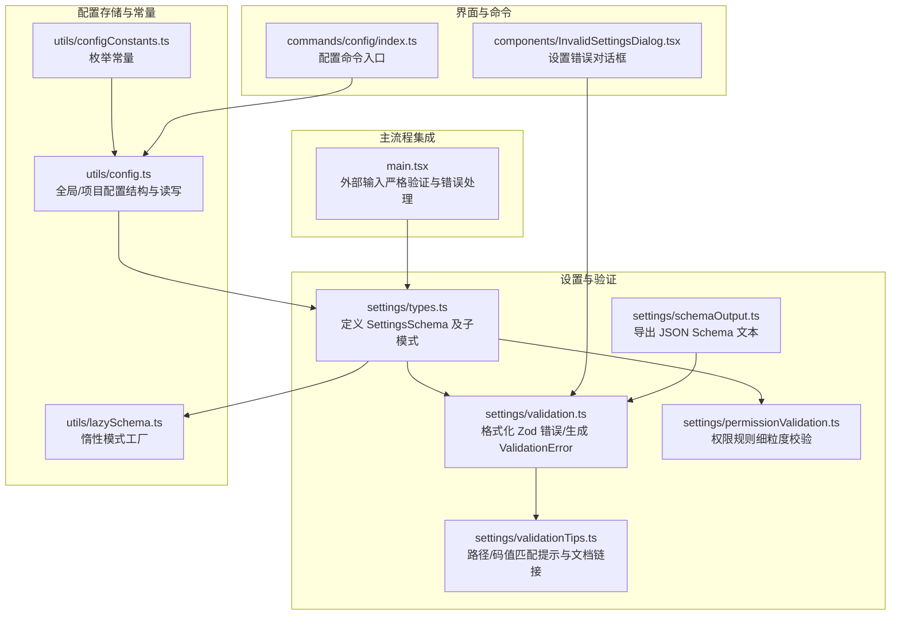
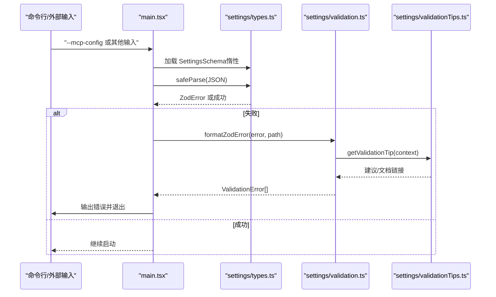
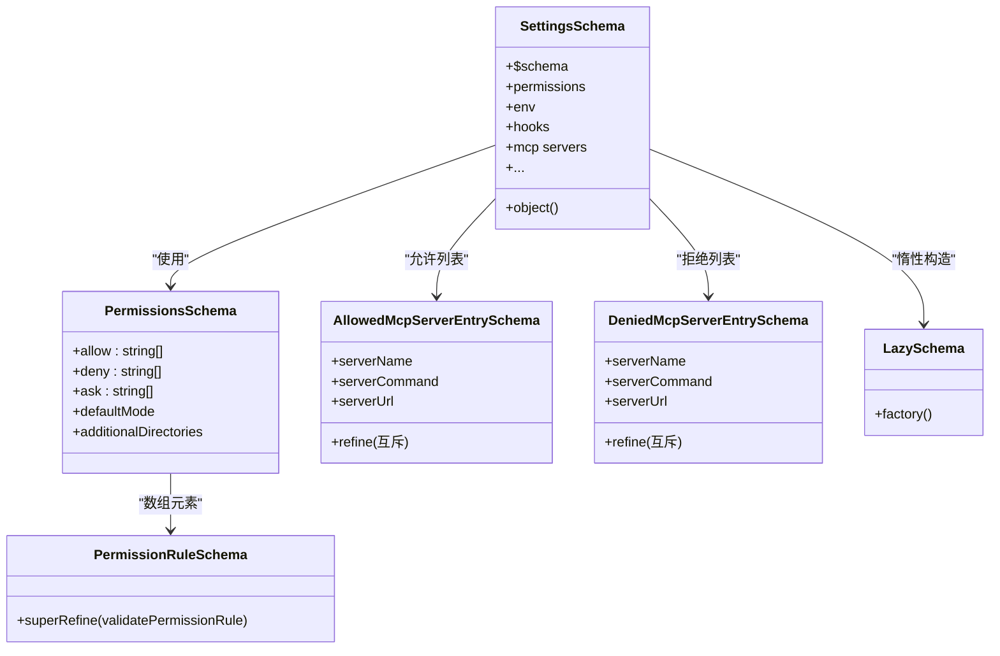
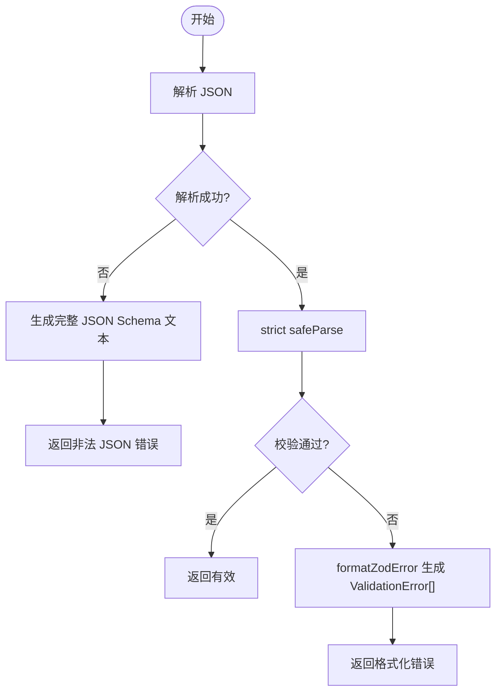
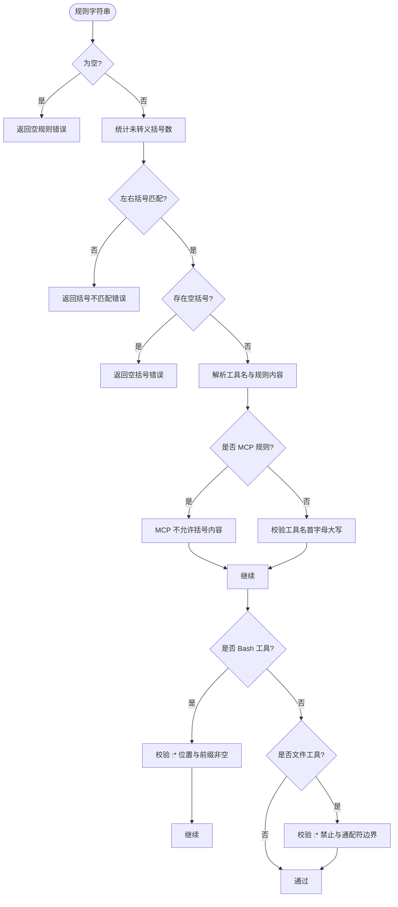
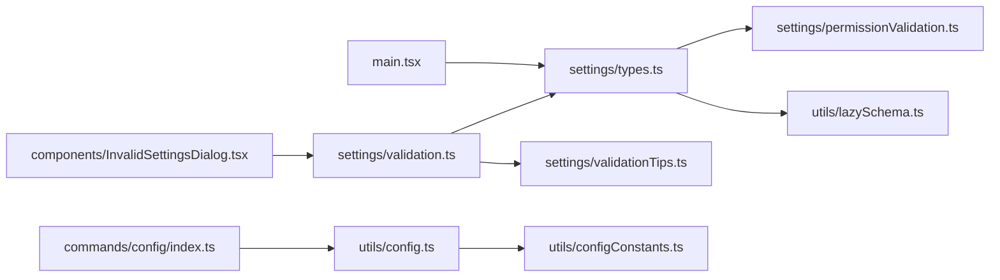

# 配置验证

<cite>
**本文引用的文件**
- [src/utils/settings/validation.ts](file://src/utils/settings/validation.ts)
- [src/utils/settings/schemaOutput.ts](file://src/utils/settings/schemaOutput.ts)
- [src/utils/settings/permissionValidation.ts](file://src/utils/settings/permissionValidation.ts)
- [src/utils/settings/validationTips.ts](file://src/utils/settings/validationTips.ts)
- [src/utils/settings/types.ts](file://src/utils/settings/types.ts)
- [src/utils/config.ts](file://src/utils/config.ts)
- [src/utils/configConstants.ts](file://src/utils/configConstants.ts)
- [src/components/InvalidSettingsDialog.tsx](file://src/components/InvalidSettingsDialog.tsx)
- [src/main.tsx](file://src/main.tsx)
- [src/commands/config/index.ts](file://src/commands/config/index.ts)
- [src/utils/lazySchema.ts](file://src/utils/lazySchema.ts)
</cite>

## 目录
1. [简介](#简介)
2. [项目结构](#项目结构)
3. [核心组件](#核心组件)
4. [架构总览](#架构总览)
5. [详细组件分析](#详细组件分析)
6. [依赖关系分析](#依赖关系分析)
7. [性能考量](#性能考量)
8. [故障排查指南](#故障排查指南)
9. [结论](#结论)
10. [附录](#附录)

## 简介
本文件面向 Claude Code 的“配置验证系统”，系统性阐述其架构设计、验证器注册与验证链路、错误处理机制、变更检测与差异分析、类型系统（数据类型、范围、格式）、实时反馈（提示、错误消息、修复建议）、性能优化（增量验证、缓存、并发）、扩展指南（自定义验证器与规则）、调试与诊断方法，以及该系统在整个架构中的作用与重要性。

## 项目结构
围绕配置验证的关键模块分布如下：
- 类型与模式：settings/types.ts 定义 SettingsSchema 及子模式；lazySchema.ts 提供惰性初始化以延迟昂贵的 Zod 模式构造。
- 验证与提示：settings/validation.ts 负责将 Zod 错误格式化为可读的 ValidationError，并生成修复建议；validationTips.ts 提供路径/码值匹配的提示与文档链接；permissionValidation.ts 对权限规则进行细粒度校验并注入自定义 Zod 校验。
- 配置存储与常量：config.ts 提供全局/项目级配置的数据结构与读写入口；configConstants.ts 提供通知渠道、编辑器模式等枚举常量。
- 用户界面：InvalidSettingsDialog.tsx 在设置文件存在错误时弹出对话框，允许用户选择继续或退出。
- 命令入口：commands/config/index.ts 将“打开配置面板”命令与实际实现解耦。
- 主流程集成：main.tsx 在启动阶段对外部输入（如 --mcp-config）执行严格验证，失败即输出错误并退出。

**图表来源**
- [src/utils/settings/types.ts](file://src/utils/settings/types.ts)
- [src/utils/settings/validation.ts](file://src/utils/settings/validation.ts)
- [src/utils/settings/validationTips.ts](file://src/utils/settings/validationTips.ts)
- [src/utils/settings/permissionValidation.ts](file://src/utils/settings/permissionValidation.ts)
- [src/utils/settings/schemaOutput.ts](file://src/utils/settings/schemaOutput.ts)
- [src/utils/config.ts](file://src/utils/config.ts)
- [src/utils/configConstants.ts](file://src/utils/configConstants.ts)
- [src/utils/lazySchema.ts](file://src/utils/lazySchema.ts)
- [src/components/InvalidSettingsDialog.tsx](file://src/components/InvalidSettingsDialog.tsx)
- [src/commands/config/index.ts](file://src/commands/config/index.ts)
- [src/main.tsx](file://src/main.tsx)

**章节来源**
- [src/utils/settings/types.ts](file://src/utils/settings/types.ts)
- [src/utils/settings/validation.ts](file://src/utils/settings/validation.ts)
- [src/utils/settings/validationTips.ts](file://src/utils/settings/validationTips.ts)
- [src/utils/settings/permissionValidation.ts](file://src/utils/settings/permissionValidation.ts)
- [src/utils/settings/schemaOutput.ts](file://src/utils/settings/schemaOutput.ts)
- [src/utils/config.ts](file://src/utils/config.ts)
- [src/utils/configConstants.ts](file://src/utils/configConstants.ts)
- [src/utils/lazySchema.ts](file://src/utils/lazySchema.ts)
- [src/components/InvalidSettingsDialog.tsx](file://src/components/InvalidSettingsDialog.tsx)
- [src/commands/config/index.ts](file://src/commands/config/index.ts)
- [src/main.tsx](file://src/main.tsx)

## 核心组件
- 设置类型与模式（SettingsSchema）
  - 通过惰性工厂（lazySchema）延迟构建 Zod 模式，避免模块初始化时的昂贵开销。
  - 权限子模式（PermissionsSchema）使用自定义 PermissionRuleSchema，后者对规则字符串进行细粒度解析与校验。
  - 其他子模式（环境变量、MCP 服务器、钩子、插件等）均采用强类型约束与可扩展的 passthrough 策略，保证向后兼容。
- 验证与错误格式化（validation.ts）
  - 将 ZodError 映射为 ValidationError 列表，包含文件路径、字段路径、消息、期望值、无效值、修复建议与文档链接。
  - 支持 unrecognized_keys、invalid_type、invalid_value、too_small 等常见问题的友好提示。
- 权限规则验证（permissionValidation.ts）
  - 对括号匹配、空括号、MCP 规则格式、工具名大小写、Bash 前缀语法、文件模式通配符位置等进行严格校验。
  - 使用 zod.superRefine 注入自定义校验，直接在模式层报错并携带示例与建议。
- 提示与文档链接（validationTips.ts）
  - 基于路径前缀与 ZodIssueCode 匹配，提供针对性建议与文档链接，覆盖权限模式、环境变量、hooks、布尔值等场景。
- 配置存储与常量（config.ts、configConstants.ts）
  - 定义 GlobalConfig/ProjectConfig 结构，提供默认值、键集合与信任对话框状态管理。
  - 提供通知渠道、编辑器模式、队友模式等枚举常量，确保配置项取值合法。
- 用户界面（InvalidSettingsDialog.tsx）
  - 当设置文件存在错误时，展示错误列表并允许用户选择继续（跳过无效条目）或退出修复。
- 命令入口（commands/config/index.ts）
  - 将“打开配置面板”命令与实现解耦，便于按需加载。
- 主流程集成（main.tsx）
  - 对外部输入（如 --mcp-config）执行严格验证，失败即输出错误并退出，防止不合法配置进入运行时。

**章节来源**
- [src/utils/settings/types.ts](file://src/utils/settings/types.ts)
- [src/utils/settings/validation.ts](file://src/utils/settings/validation.ts)
- [src/utils/settings/permissionValidation.ts](file://src/utils/settings/permissionValidation.ts)
- [src/utils/settings/validationTips.ts](file://src/utils/settings/validationTips.ts)
- [src/utils/config.ts](file://src/utils/config.ts)
- [src/utils/configConstants.ts](file://src/utils/configConstants.ts)
- [src/components/InvalidSettingsDialog.tsx](file://src/components/InvalidSettingsDialog.tsx)
- [src/commands/config/index.ts](file://src/commands/config/index.ts)
- [src/main.tsx](file://src/main.tsx)

## 架构总览
配置验证系统采用“模式驱动 + 惰性初始化 + 细粒度提示”的分层架构：
- 模式层：由 SettingsSchema 及子模式构成，统一约束数据结构与取值范围。
- 验证层：将 Zod 校验结果映射为人类可读的 ValidationError，并结合 validationTips 生成修复建议。
- 规则层：对敏感领域（如权限规则）进行额外的业务规则校验，确保安全与可用性。
- 存储层：提供全局/项目配置结构与默认值，支持向后兼容与未知字段保留。
- 集成层：在命令行与 UI 中触发验证，失败时阻断或引导修复。

**图表来源**
- [src/main.tsx](file://src/main.tsx)
- [src/utils/settings/types.ts](file://src/utils/settings/types.ts)
- [src/utils/settings/validation.ts](file://src/utils/settings/validation.ts)
- [src/utils/settings/validationTips.ts](file://src/utils/settings/validationTips.ts)

## 详细组件分析

### 组件一：设置类型与模式（SettingsSchema）
- 设计要点
  - 使用 lazySchema 包裹 SettingsSchema 及子模式，仅在首次访问时构造，降低初始化成本。
  - 权限子模式 PermissionsSchema 使用 PermissionRuleSchema 数组，每个元素在模式层即被校验。
  - 通过 .passthrough() 保留未知字段，确保向后兼容；新增字段以 .optional() 形式加入。
  - MCP 服务器允许/拒绝列表采用互斥字段校验（serverName/serverCommand/serverUrl 三选一），提升安全性与可维护性。
- 数据结构复杂度
  - 模式构建为 O(1) 惰性调用；safeParse 的时间复杂度与 JSON 结构深度线性相关。
- 依赖链
  - settings/types.ts 依赖 permissionValidation.ts（权限规则）、lazySchema.ts（惰性工厂）、hooks 模式等。
- 错误处理
  - 通过 .catch(undefined) 与 preprocess 渐进式降级，避免旧客户端因新字段导致整份策略失效。
- 性能影响
  - 惰性模式显著减少冷启动开销；.passthrough() 与宽松校验降低迁移成本。

**图表来源**
- [src/utils/settings/types.ts](file://src/utils/settings/types.ts)
- [src/utils/settings/permissionValidation.ts](file://src/utils/settings/permissionValidation.ts)
- [src/utils/lazySchema.ts](file://src/utils/lazySchema.ts)

**章节来源**
- [src/utils/settings/types.ts](file://src/utils/settings/types.ts)
- [src/utils/settings/permissionValidation.ts](file://src/utils/settings/permissionValidation.ts)
- [src/utils/lazySchema.ts](file://src/utils/lazySchema.ts)

### 组件二：验证与错误格式化（validation.ts）
- 功能概述
  - 将 ZodError 转换为 ValidationError，包含 file/path/message/expected/invalidValue/suggestion/docLink。
  - 针对 invalid_type/invalid_value/unrecognized_keys/too_small/custom 等问题生成可读消息。
  - 对 settings 文件内容进行严格校验，返回 isValid/error/fullSchema。
- 处理逻辑
  - 解析 JSON -> strict safeParse -> formatZodError -> 生成完整 JSON Schema 文本用于诊断。
- 错误处理
  - 非法 JSON 与 Zod 校验失败分别处理，确保错误信息清晰且可定位。
- 性能考虑
  - 仅在文件编辑或外部输入时触发，避免频繁重复校验。

**图表来源**
- [src/utils/settings/validation.ts](file://src/utils/settings/validation.ts)
- [src/utils/settings/schemaOutput.ts](file://src/utils/settings/schemaOutput.ts)

**章节来源**
- [src/utils/settings/validation.ts](file://src/utils/settings/validation.ts)
- [src/utils/settings/schemaOutput.ts](file://src/utils/settings/schemaOutput.ts)

### 组件三：权限规则验证（permissionValidation.ts）
- 功能概述
  - 对规则字符串进行细粒度校验：括号匹配、空括号、MCP 规则格式、工具名大小写、Bash 前缀与文件模式通配符位置。
  - 使用 zod.superRefine 注入校验，直接在模式层报错并携带示例与建议。
- 处理逻辑
  - 逐项检查：空规则、括号数量、空括号、MCP 规则不允许括号内容、工具名首字母大写、Bash 前缀 :* 位置、文件模式中禁止 :*、通配符边界等。
- 错误处理
  - 返回 {valid, error?, suggestion?, examples?}，供上层格式化与 UI 展示。
- 性能影响
  - 字符串扫描与正则匹配为线性复杂度；通过 early return 与短路条件减少不必要的计算。

**图表来源**
- [src/utils/settings/permissionValidation.ts](file://src/utils/settings/permissionValidation.ts)

**章节来源**
- [src/utils/settings/permissionValidation.ts](file://src/utils/settings/permissionValidation.ts)

### 组件四：提示与文档链接（validationTips.ts）
- 功能概述
  - 基于路径前缀与 ZodIssueCode 匹配，提供修复建议与文档链接。
  - 覆盖权限模式、环境变量、hooks、布尔值、未识别键、数值下界等常见场景。
- 处理逻辑
  - 定义 TipMatcher 列表，按顺序匹配；若未命中，基于 path 前缀补充文档链接。
- 错误处理
  - 未匹配时返回 null，上层优雅降级。
- 性能影响
  - 匹配为线性扫描，常量小且命中率高，开销极低。

**章节来源**
- [src/utils/settings/validationTips.ts](file://src/utils/settings/validationTips.ts)

### 组件五：配置存储与常量（config.ts、configConstants.ts）
- 功能概述
  - 定义 GlobalConfig/ProjectConfig 结构与默认值，提供键集合与类型守卫。
  - 提供通知渠道、编辑器模式、队友模式等枚举常量，确保配置项取值合法。
- 处理逻辑
  - 默认工厂函数 createDefaultGlobalConfig 生成全新引用，避免深拷贝成本。
  - 信任对话框状态检查与父目录遍历，确保信任状态在会话内可感知。
- 错误处理
  - 对 auth/onboarding 状态丢失进行保护性检测，避免回写导致永久丢失。
- 性能影响
  - 默认值工厂与键集合查询为 O(1)；信任状态检查为 O(h)（h 为目录层级）。

**章节来源**
- [src/utils/config.ts](file://src/utils/config.ts)
- [src/utils/configConstants.ts](file://src/utils/configConstants.ts)

### 组件六：用户界面（InvalidSettingsDialog.tsx）
- 功能概述
  - 当设置文件存在错误时，展示错误列表与修复建议，允许用户选择继续（跳过无效条目）或退出修复。
- 处理逻辑
  - 接收 ValidationError[]，渲染列表与选择控件，回调 onContinue/onExit。
- 错误处理
  - 通过对话框强制用户做出明确决策，避免静默忽略错误。
- 性能影响
  - UI 渲染与事件处理为 O(n)，n 为错误条目数。

**章节来源**
- [src/components/InvalidSettingsDialog.tsx](file://src/components/InvalidSettingsDialog.tsx)

### 组件七：命令入口与主流程集成（commands/config/index.ts、main.tsx）
- 功能概述
  - commands/config/index.ts 将“打开配置面板”命令与实现解耦。
  - main.tsx 在启动阶段对外部输入（如 --mcp-config）执行严格验证，失败即输出错误并退出。
- 处理逻辑
  - 对 MCP 配置进行名称冲突检查与动态作用域标注，确保命名安全与作用域一致。
- 错误处理
  - stderr 输出 + exit(1) 保证失败可见且不可继续启动。
- 性能影响
  - 仅在启动阶段执行，开销可控。

**章节来源**
- [src/commands/config/index.ts](file://src/commands/config/index.ts)
- [src/main.tsx](file://src/main.tsx)

## 依赖关系分析
- 内聚性
  - settings/types.ts 作为模式中心，内聚了所有配置结构与校验规则。
  - validation.ts 与 validationTips.ts 协作，形成“格式化 + 提示”的高内聚层。
- 耦合性
  - permissionValidation.ts 与 types.ts 通过 PermissionRuleSchema 弱耦合，便于扩展。
  - config.ts 与 configConstants.ts 通过常量与结构定义耦合，保持配置项取值合法。
- 外部依赖
  - Zod v4 作为核心校验引擎；lodash-es 提供 memoize/pickBy 等工具。
- 循环依赖
  - 通过惰性导入与常量文件避免循环依赖。

**图表来源**
- [src/utils/settings/types.ts](file://src/utils/settings/types.ts)
- [src/utils/settings/permissionValidation.ts](file://src/utils/settings/permissionValidation.ts)
- [src/utils/lazySchema.ts](file://src/utils/lazySchema.ts)
- [src/utils/settings/validation.ts](file://src/utils/settings/validation.ts)
- [src/utils/settings/validationTips.ts](file://src/utils/settings/validationTips.ts)
- [src/utils/config.ts](file://src/utils/config.ts)
- [src/utils/configConstants.ts](file://src/utils/configConstants.ts)
- [src/components/InvalidSettingsDialog.tsx](file://src/components/InvalidSettingsDialog.tsx)
- [src/commands/config/index.ts](file://src/commands/config/index.ts)
- [src/main.tsx](file://src/main.tsx)

**章节来源**
- [src/utils/settings/types.ts](file://src/utils/settings/types.ts)
- [src/utils/settings/permissionValidation.ts](file://src/utils/settings/permissionValidation.ts)
- [src/utils/lazySchema.ts](file://src/utils/lazySchema.ts)
- [src/utils/settings/validation.ts](file://src/utils/settings/validation.ts)
- [src/utils/settings/validationTips.ts](file://src/utils/settings/validationTips.ts)
- [src/utils/config.ts](file://src/utils/config.ts)
- [src/utils/configConstants.ts](file://src/utils/configConstants.ts)
- [src/components/InvalidSettingsDialog.tsx](file://src/components/InvalidSettingsDialog.tsx)
- [src/commands/config/index.ts](file://src/commands/config/index.ts)
- [src/main.tsx](file://src/main.tsx)

## 性能考量
- 惰性模式（lazySchema）
  - 仅在首次访问时构造 Zod 模式，避免模块初始化时的昂贵开销。
- 缓存与去重
  - config.ts 中对信任状态与配置读取进行缓存与去重，减少重复 IO 与计算。
- 并发处理
  - 配置读写通过锁与清理注册（cleanupRegistry）保障并发安全；验证流程在单次请求中同步执行，避免并发竞争。
- 增量验证
  - 对设置文件内容的验证在文件编辑时触发，而非全量扫描；对 MCP 配置的外部输入在启动阶段一次性验证。
- I/O 优化
  - JSON 解析与字符串处理使用高效实现；schema 导出仅在需要时生成。

[本节为通用性能讨论，无需特定文件分析]

## 故障排查指南
- 常见错误类型与定位
  - 无效类型：检查字段类型（如布尔值、对象、数组）与期望值是否一致。
  - 无效值：检查枚举值或范围限制（如数值下界）。
  - 未识别键：检查拼写或是否属于已弃用字段。
  - 权限规则错误：检查括号匹配、空括号、MCP 规则格式、工具名大小写、Bash 前缀与文件模式通配符位置。
- 诊断步骤
  - 使用 formatZodError 生成的 ValidationError[] 定位具体字段与消息。
  - 通过 validationTips 获取修复建议与文档链接。
  - 使用 generateSettingsJSONSchema 输出完整 Schema 文本辅助对比。
- UI 交互
  - InvalidSettingsDialog.tsx 提供继续/退出选项，便于快速修复或终止。
- 主流程错误
  - main.tsx 对外部输入严格校验，失败时输出错误并退出，避免不合法配置进入运行时。

**章节来源**
- [src/utils/settings/validation.ts](file://src/utils/settings/validation.ts)
- [src/utils/settings/validationTips.ts](file://src/utils/settings/validationTips.ts)
- [src/utils/settings/schemaOutput.ts](file://src/utils/settings/schemaOutput.ts)
- [src/components/InvalidSettingsDialog.tsx](file://src/components/InvalidSettingsDialog.tsx)
- [src/main.tsx](file://src/main.tsx)

## 结论
配置验证系统通过“模式驱动 + 惰性初始化 + 细粒度提示 + 向后兼容”的设计，在保证强类型约束的同时兼顾易用性与可维护性。其在启动阶段与 UI/命令入口处的严格拦截，有效降低了运行时风险；对权限规则的深度校验提升了系统的安全性与稳定性。配合完善的提示与诊断能力，开发者可以快速定位并修复配置问题，提升整体用户体验。

[本节为总结性内容，无需特定文件分析]

## 附录
- 扩展指南（自定义验证器与规则）
  - 新增字段：在 settings/types.ts 中以 .optional() 形式添加，并在 DEFAULT_GLOBAL_CONFIG/DEFAULT_PROJECT_CONFIG 中提供默认值。
  - 自定义 Zod 校验：在 types.ts 中使用 z.refine 或 z.check 注册校验逻辑，必要时通过 preprocess 进行预处理。
  - 权限规则扩展：在 permissionValidation.ts 中新增规则校验逻辑，并在 PermissionRuleSchema 中注入 superRefine。
  - 提示扩展：在 validationTips.ts 中新增 TipMatcher，覆盖新的路径前缀与错误码组合。
- 配置变更检测与影响分析
  - 信任状态检测：通过 checkHasTrustDialogAccepted/isPathTrusted 实现从当前目录向上遍历的信任状态判断。
  - 配置键集合：使用 GLOBAL_CONFIG_KEYS/PROJECT_CONFIG_KEYS 进行键合法性校验与类型守卫。
- 实时反馈机制
  - ValidationError 包含 suggestion 与 docLink，结合 UI 对话框提供即时修复建议。
- 在系统整体架构中的作用
  - 作为“输入质量门禁”，在命令行、UI、外部输入等入口处统一拦截不合法配置，确保后续流程稳定运行。

**章节来源**
- [src/utils/settings/types.ts](file://src/utils/settings/types.ts)
- [src/utils/settings/permissionValidation.ts](file://src/utils/settings/permissionValidation.ts)
- [src/utils/settings/validationTips.ts](file://src/utils/settings/validationTips.ts)
- [src/utils/config.ts](file://src/utils/config.ts)
- [src/utils/configConstants.ts](file://src/utils/configConstants.ts)
- [src/components/InvalidSettingsDialog.tsx](file://src/components/InvalidSettingsDialog.tsx)