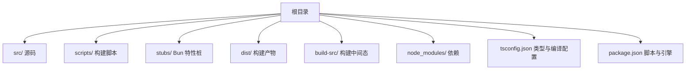
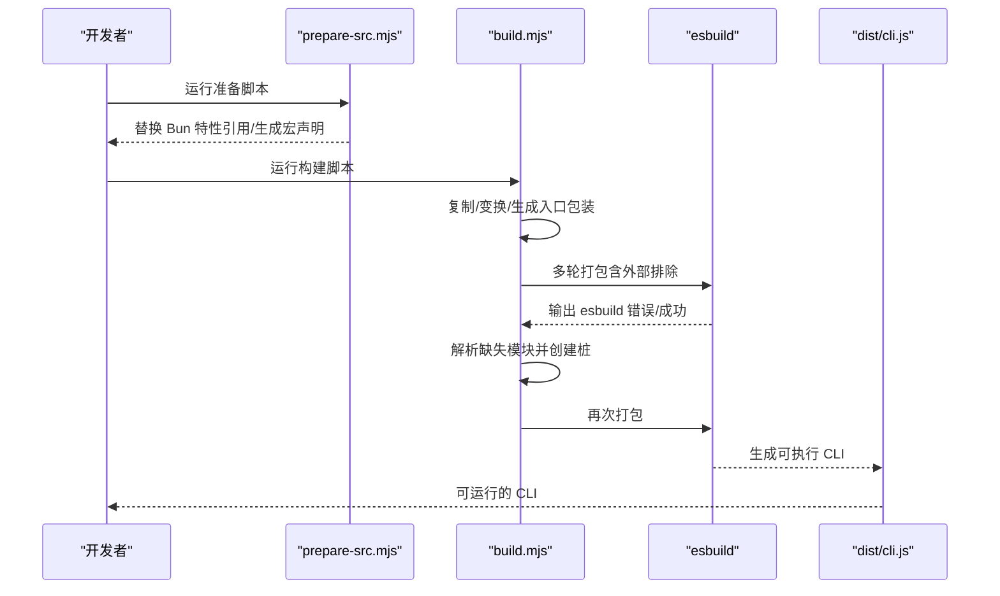
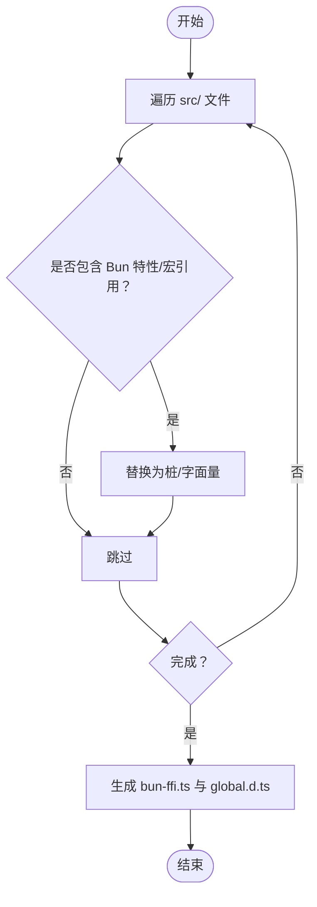
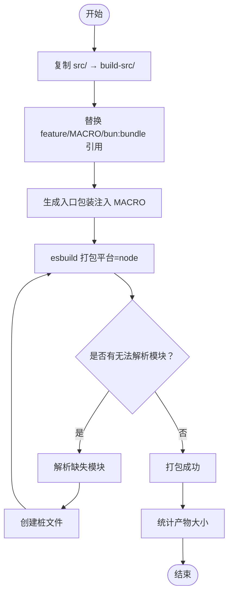
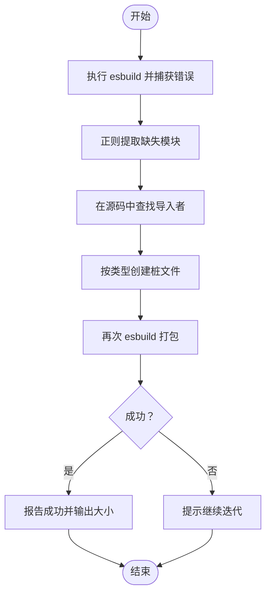
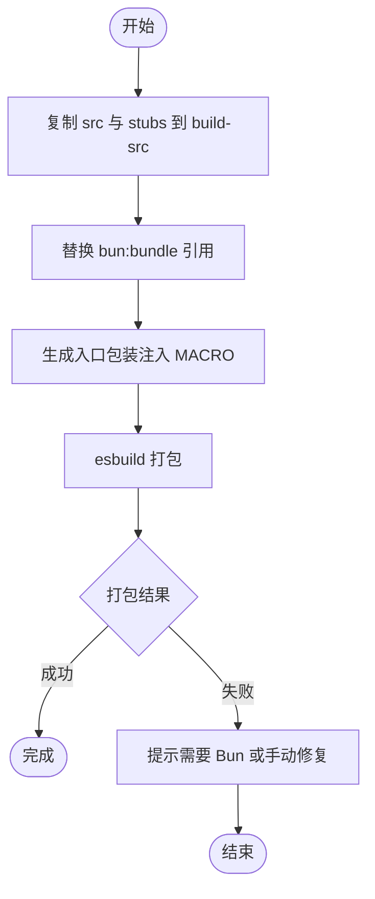
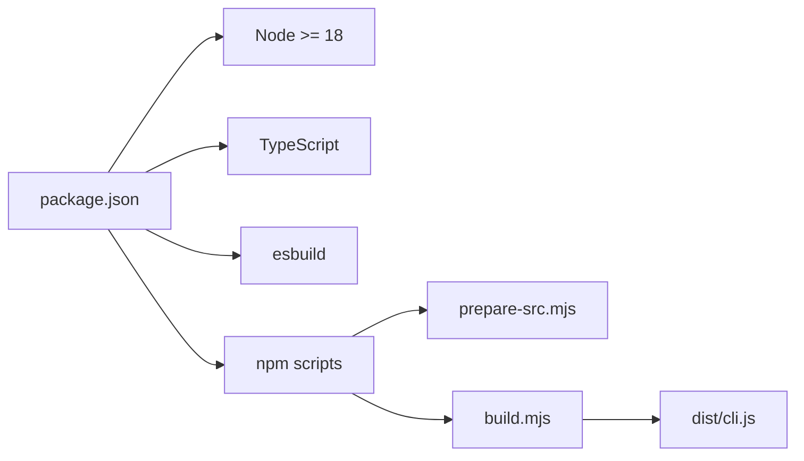

# 开发环境

<cite>
**本文引用的文件**
- [package.json](file://package.json)
- [tsconfig.json](file://tsconfig.json)
- [QUICKSTART.md](file://QUICKSTART.md)
- [README.md](file://README.md)
- [scripts/build.mjs](file://scripts/build.mjs)
- [scripts/prepare-src.mjs](file://scripts/prepare-src.mjs)
- [scripts/stub-modules.mjs](file://scripts/stub-modules.mjs)
- [scripts/transform.mjs](file://scripts/transform.mjs)
- [stubs/bun-bundle.ts](file://stubs/bun-bundle.ts)
- [stubs/macros.ts](file://stubs/macros.ts)
- [.gitignore](file://.gitignore)
- [package-lock.json](file://package-lock.json)
</cite>

## 目录
1. [简介](#简介)
2. [项目结构](#项目结构)
3. [核心组件](#核心组件)
4. [架构总览](#架构总览)
5. [详细组件分析](#详细组件分析)
6. [依赖分析](#依赖分析)
7. [性能考虑](#性能考虑)
8. [故障排除指南](#故障排除指南)
9. [结论](#结论)
10. [附录](#附录)

## 简介
本指南面向首次参与 Claude Code v2.1.88 源码研究与二次开发的开发者，目标是帮助你在本地快速搭建可运行的开发环境，理解项目的构建系统与编译流程，并掌握从源码到可执行 CLI 的最佳努力构建路径。由于源码中大量使用了 Bun 的编译期特性（如 feature()、MACRO 宏、bun:bundle），直接用 Node.js/TypeScript 工具链进行完整重建并不完全可行；因此本指南提供基于 esbuild 的“最佳努力构建”方案，并给出逐步修复缺失模块的路径。

## 项目结构
仓库采用以“功能域/层次”混合组织的结构：src/ 存放 TypeScript 源码，scripts/ 提供构建与准备脚本，stubs/ 提供 Bun 特性桩文件，dist/ 为构建产物输出目录，build-src/ 为构建前的转换副本。

图表来源
- [package.json:1-21](file://package.json#L1-L21)
- [tsconfig.json:1-37](file://tsconfig.json#L1-L37)
- [QUICKSTART.md:106-122](file://QUICKSTART.md#L106-L122)

章节来源
- [package.json:1-21](file://package.json#L1-L21)
- [tsconfig.json:1-37](file://tsconfig.json#L1-L37)
- [QUICKSTART.md:106-122](file://QUICKSTART.md#L106-L122)

## 核心组件
- 构建脚本与流程
  - scripts/prepare-src.mjs：在源码层面替换 Bun 特性引用，生成全局宏声明，便于 Node/TypeScript 环境下编译。
  - scripts/build.mjs：复制源码 → 变换 → 生成入口包装器 → 多轮 esbuild 打包 + 自动补桩，直至无“无法解析模块”错误。
  - scripts/stub-modules.mjs：从 esbuild 错误中提取缺失模块，定位导入位置并自动生成桩文件，再尝试打包。
  - scripts/transform.mjs：另一种“一次性变换 + 打包”的策略，侧重通过 --define 注入 MACRO 常量。
- 类型与编译配置
  - tsconfig.json：指定 ESNext 模块、bundler 解析、React JSX、输出目录、路径映射、声明与 sourcemap 等。
- Bun 特性桩
  - stubs/bun-bundle.ts：提供 feature(flag) 的恒定返回值，用于替代 Bun 的编译期分支消除。
  - stubs/macros.ts：声明全局 MACRO 常量接口，配合入口包装器注入运行时值。
- 包与引擎
  - package.json：定义 Node 引擎版本、TypeScript 与 esbuild 开发依赖、构建/检查/启动脚本。

章节来源
- [scripts/prepare-src.mjs:1-116](file://scripts/prepare-src.mjs#L1-L116)
- [scripts/build.mjs:1-246](file://scripts/build.mjs#L1-L246)
- [scripts/stub-modules.mjs:1-159](file://scripts/stub-modules.mjs#L1-L159)
- [scripts/transform.mjs:1-144](file://scripts/transform.mjs#L1-L144)
- [tsconfig.json:1-37](file://tsconfig.json#L1-L37)
- [stubs/bun-bundle.ts:1-5](file://stubs/bun-bundle.ts#L1-L5)
- [stubs/macros.ts:1-21](file://stubs/macros.ts#L1-L21)
- [package.json:1-21](file://package.json#L1-L21)

## 架构总览
下图展示了从源码到可执行 CLI 的关键步骤：准备源码 → 变换 → 入口包装 → esbuild 打包 → 产出 dist/cli.js。

图表来源
- [scripts/prepare-src.mjs:1-116](file://scripts/prepare-src.mjs#L1-L116)
- [scripts/build.mjs:144-246](file://scripts/build.mjs#L144-L246)
- [package.json:7-12](file://package.json#L7-L12)

章节来源
- [scripts/prepare-src.mjs:1-116](file://scripts/prepare-src.mjs#L1-L116)
- [scripts/build.mjs:144-246](file://scripts/build.mjs#L144-L246)
- [package.json:7-12](file://package.json#L7-L12)

## 详细组件分析

### 组件一：prepare-src.mjs（源码准备）
职责
- 将源码中的 Bun 特性引入替换为本地桩文件路径，避免直接依赖 bun:bundle。
- 将 MACRO.X 引用替换为字符串字面量，保证 TS/ESM 解析阶段不报错。
- 生成全局宏类型声明文件，避免 TS 报 undeclared global。

实现要点
- 递归遍历 src/ 下的 TS/TSX 文件，按规则替换 import 语句与常量引用。
- 生成 stubs/bun-ffi.ts 与 stubs/global.d.ts，确保上游代理模块与类型可用。

图表来源
- [scripts/prepare-src.mjs:36-98](file://scripts/prepare-src.mjs#L36-L98)

章节来源
- [scripts/prepare-src.mjs:1-116](file://scripts/prepare-src.mjs#L1-L116)

### 组件二：build.mjs（最佳努力构建）
职责
- 复制 src/ 到 build-src/，作为不可破坏的原始副本。
- 对 feature('FLAG')、MACRO.X、bun:bundle 引用进行替换。
- 生成入口包装文件，注入 MACRO 全局。
- 使用 esbuild 打包，若出现“无法解析模块”，自动解析缺失模块并创建桩，最多迭代若干轮。

关键流程
- 确保 esbuild 可用，否则自动安装。
- 解析 esbuild 输出中的缺失模块列表，逐个创建桩文件。
- 重复打包直到不再出现“无法解析模块”。

图表来源
- [scripts/build.mjs:56-246](file://scripts/build.mjs#L56-L246)

章节来源
- [scripts/build.mjs:1-246](file://scripts/build.mjs#L1-L246)

### 组件三：stub-modules.mjs（批量补桩）
职责
- 通过解析 esbuild 输出，收集所有“无法解析模块”。
- 尝试从源码中定位导入该模块的文件，推导绝对路径。
- 为文本资源、类型声明与 JS/TS 模块分别创建空桩或最小导出。

图表来源
- [scripts/stub-modules.mjs:21-159](file://scripts/stub-modules.mjs#L21-L159)

章节来源
- [scripts/stub-modules.mjs:1-159](file://scripts/stub-modules.mjs#L1-L159)

### 组件四：transform.mjs（一次性变换与打包）
职责
- 复制 src 与 stubs 到 build-src。
- 将 bun:bundle 引用替换为本地桩。
- 生成入口包装，注入 MACRO 全局。
- 使用 esbuild 打包为单文件 CLI。

图表来源
- [scripts/transform.mjs:24-144](file://scripts/transform.mjs#L24-L144)

章节来源
- [scripts/transform.mjs:1-144](file://scripts/transform.mjs#L1-L144)

### 组件五：类型与编译配置（tsconfig.json）
要点
- 模块系统：ESNext + bundler 解析。
- JSX：react-jsx。
- 输出目录：dist，根目录：src。
- 路径映射：bun:bundle → stubs/bun-bundle.ts，src/* → src/*。
- 启用声明、声明映射与 sourcemap。
- lib 包含 ES2022 与 DOM。

章节来源
- [tsconfig.json:1-37](file://tsconfig.json#L1-L37)

### 组件六：Bun 特性桩（stubs）
- bun-bundle.ts：提供 feature(flag) 的恒定返回值，模拟 Bun 的编译期分支消除。
- macros.ts：声明全局 MACRO 接口，供 TS 编译器识别。

章节来源
- [stubs/bun-bundle.ts:1-5](file://stubs/bun-bundle.ts#L1-L5)
- [stubs/macros.ts:1-21](file://stubs/macros.ts#L1-L21)

## 依赖分析
- Node 引擎：要求 Node >= 18。
- 开发依赖：esbuild（打包）、typescript（类型检查）。
- 构建脚本：通过 npm scripts 调用 prepare-src.mjs 与 build.mjs，最终生成 dist/cli.js。

图表来源
- [package.json:7-19](file://package.json#L7-L19)
- [package.json:13-15](file://package.json#L13-L15)

章节来源
- [package.json:1-21](file://package.json#L1-L21)
- [package-lock.json:1-200](file://package-lock.json#L1-L200)

## 性能考虑
- 构建时间优化
  - 使用多轮 esbuild + 自动补桩策略，减少手工干预次数。
  - 仅对缺失模块创建桩，避免全量补全。
- 产物体积
  - 通过死代码消除与按需打包，产物大小约数 MB（参考 README 中的 12MB 说明）。
- 开发体验
  - 优先使用 QUICKSTART.md 的“预构建 CLI”方式快速验证功能，再在需要时进行源码构建。

## 故障排除指南
常见问题与解决思路
- esbuild 未安装
  - 现象：构建脚本报错找不到 esbuild。
  - 解决：脚本会自动安装，也可手动执行安装命令。
- 无法解析模块（Could not resolve）
  - 现象：esbuild 报告某些模块无法解析。
  - 解决：使用 scripts/stub-modules.mjs 自动解析缺失模块并创建桩，再重新构建。
- feature()/MACRO 未生效
  - 现象：部分条件分支未被消除，导致 require 仍被解析。
  - 解决：prepare-src.mjs 与 build.mjs 已将 feature('FLAG') 替换为 false，MACRO.X 替换为字面量；若仍有问题，检查替换是否覆盖到所有引用位置。
- bun:bundle/bun:ffi 相关错误
  - 现象：导入 bun:bundle 或 bun:ffi 导致解析失败。
  - 解决：使用 stubs/bun-bundle.ts 与 stubs/bun-ffi.ts 作为桩文件；确保路径正确。
- 108 个特性门控模块缺失
  - 现象：README 指出 108 个模块在发布包中不存在，属于内部特性。
  - 解决：这些模块在 Bun 构建时已被死代码消除；在 Node/TypeScript 环境下可通过补桩绕过，但功能不可用。

章节来源
- [scripts/build.mjs:175-246](file://scripts/build.mjs#L175-L246)
- [scripts/stub-modules.mjs:30-121](file://scripts/stub-modules.mjs#L30-L121)
- [README.md:70-194](file://README.md#L70-L194)

## 结论
- 若仅需运行与验证功能：优先使用 QUICKSTART.md 的“预构建 CLI”方式。
- 若需深入开发与调试：使用 prepare-src.mjs + build.mjs 的最佳努力构建路径，结合 stub-modules.mjs 逐步补齐缺失模块。
- 对于 Bun 特性（feature()、MACRO、bun:bundle、bun:ffi），通过桩文件与字符串替换实现兼容，但完整功能需在 Bun 环境下才能达到原生效果。

## 附录

### A. 开发环境搭建步骤（Node + esbuild）
- 安装 Node（>= 18）与 npm（>= 9）
- 克隆仓库并安装开发依赖
- 运行准备脚本，生成必要的桩与替换
- 运行构建脚本，等待多轮补桩与打包完成
- 成功后可在 dist/ 目录找到可执行 CLI

章节来源
- [QUICKSTART.md:25-45](file://QUICKSTART.md#L25-L45)
- [package.json:7-12](file://package.json#L7-L12)

### B. 构建系统与编译流程（概览）
- 准备阶段：prepare-src.mjs 替换 Bun 特性与宏，生成类型声明。
- 构建阶段：build.mjs 复制/变换/生成入口 → esbuild 打包 → 解析缺失模块 → 创建桩 → 再打包。
- 产物阶段：dist/cli.js 可直接由 Node 运行。

章节来源
- [scripts/prepare-src.mjs:1-116](file://scripts/prepare-src.mjs#L1-L116)
- [scripts/build.mjs:56-246](file://scripts/build.mjs#L56-L246)
- [package.json:7-12](file://package.json#L7-L12)

### C. 与 Bun 的关系与限制
- 源码使用 Bun 编译期特性（feature()、MACRO、bun:bundle、bun:ffi），无法在 Node/TypeScript 环境下完全复现。
- README 明确指出 108 个模块在发布包中不存在，属于内部特性，无法恢复。

章节来源
- [README.md:70-194](file://README.md#L70-L194)
- [QUICKSTART.md:3-104](file://QUICKSTART.md#L3-L104)