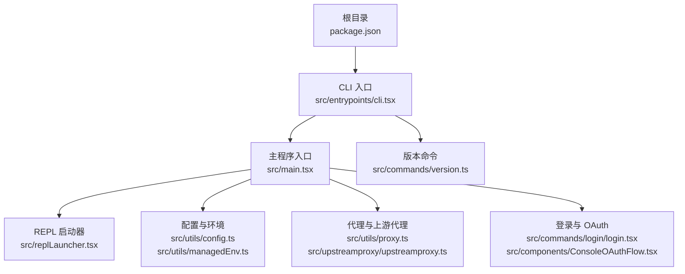
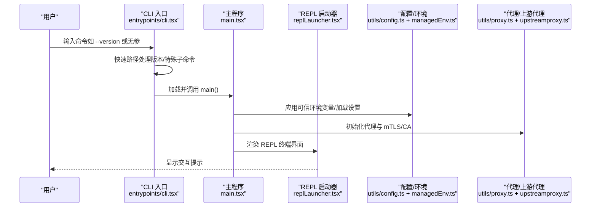
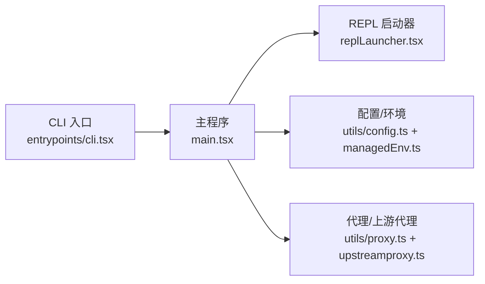

# 快速开始

<cite>
**本文引用的文件**
- [README.md](file://README.md)
- [QUICKSTART.md](file://QUICKSTART.md)
- [package.json](file://package.json)
- [scripts/build.mjs](file://scripts/build.mjs)
- [src/entrypoints/cli.tsx](file://src/entrypoints/cli.tsx)
- [src/main.tsx](file://src/main.tsx)
- [src/replLauncher.tsx](file://src/replLauncher.tsx)
- [src/commands/version.ts](file://src/commands/version.ts)
- [src/utils/config.ts](file://src/utils/config.ts)
- [src/utils/managedEnv.ts](file://src/utils/managedEnv.ts)
- [src/utils/proxy.ts](file://src/utils/proxy.ts)
- [src/upstreamproxy/upstreamproxy.ts](file://src/upstreamproxy/upstreamproxy.ts)
- [src/commands/login/login.tsx](file://src/commands/login/login.tsx)
- [src/components/ConsoleOAuthFlow.tsx](file://src/components/ConsoleOAuthFlow.tsx)
</cite>

## 目录
1. [简介](#简介)
2. [项目结构](#项目结构)
3. [核心组件](#核心组件)
4. [架构总览](#架构总览)
5. [详细组件分析](#详细组件分析)
6. [依赖分析](#依赖分析)
7. [性能考虑](#性能考虑)
8. [故障排除指南](#故障排除指南)
9. [结论](#结论)
10. [附录](#附录)

## 简介
本指南面向首次接触 Claude Code 的用户，帮助你在本地完成安装、运行与基础配置，快速上手交互式 REPL 模式与常见命令。你将了解：
- 环境要求与安装方式（推荐直接使用已编译的 CLI）
- 启动 REPL 交互模式与非交互模式
- 基本命令与帮助信息
- 初次配置：API 密钥、代理、权限与信任对话框
- 常见问题排查

## 项目结构
仓库包含源码、构建脚本、文档与示例。对于“快速开始”，以下路径最为关键：
- 根目录下的安装与构建说明：[QUICKSTART.md](file://QUICKSTART.md)
- 包管理与引擎版本声明：[package.json](file://package.json)
- CLI 入口与版本输出逻辑：[src/entrypoints/cli.tsx](file://src/entrypoints/cli.tsx)
- 主程序入口与初始化流程：[src/main.tsx](file://src/main.tsx)
- REPL 启动器（终端 UI）：[src/replLauncher.tsx](file://src/replLauncher.tsx)
- 版本命令实现：[src/commands/version.ts](file://src/commands/version.ts)
- 配置与环境变量应用：[src/utils/config.ts](file://src/utils/config.ts)、[src/utils/managedEnv.ts](file://src/utils/managedEnv.ts)
- 代理与上游代理支持：[src/utils/proxy.ts](file://src/utils/proxy.ts)、[src/upstreamproxy/upstreamproxy.ts](file://src/upstreamproxy/upstreamproxy.ts)
- 登录与 OAuth 流程：[src/commands/login/login.tsx](file://src/commands/login/login.tsx)、[src/components/ConsoleOAuthFlow.tsx](file://src/components/ConsoleOAuthFlow.tsx)

图表来源
- [src/entrypoints/cli.tsx:33-299](file://src/entrypoints/cli.tsx#L33-L299)
- [src/main.tsx:585-800](file://src/main.tsx#L585-L800)
- [src/replLauncher.tsx:12-22](file://src/replLauncher.tsx#L12-L22)
- [src/utils/config.ts:1-200](file://src/utils/config.ts#L1-L200)
- [src/utils/managedEnv.ts:124-199](file://src/utils/managedEnv.ts#L124-L199)
- [src/utils/proxy.ts:71-426](file://src/utils/proxy.ts#L71-L426)
- [src/upstreamproxy/upstreamproxy.ts:167-211](file://src/upstreamproxy/upstreamproxy.ts#L167-L211)
- [src/commands/login/login.tsx:41-81](file://src/commands/login/login.tsx#L41-L81)
- [src/components/ConsoleOAuthFlow.tsx:570-610](file://src/components/ConsoleOAuthFlow.tsx#L570-L610)
- [src/commands/version.ts:1-23](file://src/commands/version.ts#L1-L23)

章节来源
- [README.md:250-380](file://README.md#L250-L380)
- [QUICKSTART.md:1-122](file://QUICKSTART.md#L1-L122)
- [package.json:1-21](file://package.json#L1-L21)

## 核心组件
- CLI 入口与版本输出：通过入口文件处理 --version 等快速路径，随后加载主程序。
- 主程序入口：负责初始化、信任对话、设置加载、延迟预取、REPL 渲染等。
- REPL 启动器：在终端 UI 中渲染交互界面。
- 配置与环境：从全局与项目级配置加载环境变量，区分可信与非可信来源。
- 代理与上游代理：支持 NO_PROXY、mTLS、CA 证书注入与 WebSocket 代理。
- 登录与 OAuth：提供 OAuth 登录流程与状态反馈。

章节来源
- [src/entrypoints/cli.tsx:33-299](file://src/entrypoints/cli.tsx#L33-L299)
- [src/main.tsx:585-800](file://src/main.tsx#L585-L800)
- [src/replLauncher.tsx:12-22](file://src/replLauncher.tsx#L12-L22)
- [src/utils/config.ts:1-200](file://src/utils/config.ts#L1-L200)
- [src/utils/managedEnv.ts:124-199](file://src/utils/managedEnv.ts#L124-L199)
- [src/utils/proxy.ts:71-426](file://src/utils/proxy.ts#L71-L426)
- [src/upstreamproxy/upstreamproxy.ts:167-211](file://src/upstreamproxy/upstreamproxy.ts#L167-L211)
- [src/commands/login/login.tsx:41-81](file://src/commands/login/login.tsx#L41-L81)
- [src/components/ConsoleOAuthFlow.tsx:570-610](file://src/components/ConsoleOAuthFlow.tsx#L570-L610)

## 架构总览
下图展示了从命令行到 REPL 的关键调用链路与模块关系。

图表来源
- [src/entrypoints/cli.tsx:33-299](file://src/entrypoints/cli.tsx#L33-L299)
- [src/main.tsx:585-800](file://src/main.tsx#L585-L800)
- [src/replLauncher.tsx:12-22](file://src/replLauncher.tsx#L12-L22)
- [src/utils/config.ts:1-200](file://src/utils/config.ts#L1-L200)
- [src/utils/managedEnv.ts:124-199](file://src/utils/managedEnv.ts#L124-L199)
- [src/utils/proxy.ts:71-426](file://src/utils/proxy.ts#L71-L426)
- [src/upstreamproxy/upstreamproxy.ts:167-211](file://src/upstreamproxy/upstreamproxy.ts#L167-L211)

## 详细组件分析

### 安装与运行（推荐方式）
- 使用已编译的 CLI（无需 Node.js 版本限制，但需满足运行时要求）
  - 运行版本查询与非交互模式示例可参考：[QUICKSTART.md:11-19](file://QUICKSTART.md#L11-L19)
- 如需从源码构建（仅限研究用途），请参考：[QUICKSTART.md:23-104](file://QUICKSTART.md#L23-L104) 与 [scripts/build.mjs:1-246](file://scripts/build.mjs#L1-L246)
- 引擎版本要求（用于源码构建）：[package.json:13-15](file://package.json#L13-L15)

章节来源
- [QUICKSTART.md:7-22](file://QUICKSTART.md#L7-L22)
- [scripts/build.mjs:1-246](file://scripts/build.mjs#L1-L246)
- [package.json:13-15](file://package.json#L13-L15)

### 启动 REPL 与非交互模式
- REPL 启动流程：入口加载后，主程序初始化并调用 REPL 启动器渲染交互界面。[src/entrypoints/cli.tsx:287-299](file://src/entrypoints/cli.tsx#L287-L299) → [src/main.tsx:585-800](file://src/main.tsx#L585-L800) → [src/replLauncher.tsx:12-22](file://src/replLauncher.tsx#L12-L22)
- 非交互模式示例：在 README 中提供了 -p 参数的示例用法。[README.md:1-100](file://README.md#L1-L100)

章节来源
- [src/entrypoints/cli.tsx:287-299](file://src/entrypoints/cli.tsx#L287-L299)
- [src/main.tsx:585-800](file://src/main.tsx#L585-L800)
- [src/replLauncher.tsx:12-22](file://src/replLauncher.tsx#L12-L22)
- [README.md:1-100](file://README.md#L1-L100)

### 基本命令与帮助
- 版本命令：通过命令注册与入口快速路径返回版本信息。[src/commands/version.ts:1-23](file://src/commands/version.ts#L1-L23)、[src/entrypoints/cli.tsx:36-42](file://src/entrypoints/cli.tsx#L36-L42)
- 帮助信息：README 提供了命令与功能概览，可结合实际命令实现进行查阅。[README.md:1-100](file://README.md#L1-L100)

章节来源
- [src/commands/version.ts:1-23](file://src/commands/version.ts#L1-L23)
- [src/entrypoints/cli.tsx:36-42](file://src/entrypoints/cli.tsx#L36-L42)
- [README.md:1-100](file://README.md#L1-L100)

### 初次配置与设置
- API 密钥配置
  - 登录与 OAuth 流程：通过登录命令与控制台 OAuth 界面完成认证。[src/commands/login/login.tsx:41-81](file://src/commands/login/login.tsx#L41-L81)、[src/components/ConsoleOAuthFlow.tsx:570-610](file://src/components/ConsoleOAuthFlow.tsx#L570-L610)
  - 认证成功后会更新应用状态与权限检查。[src/commands/login/login.tsx:41-81](file://src/commands/login/login.tsx#L41-L81)
- 环境变量与代理
  - 受信来源的环境变量优先应用，非受信来源仅应用安全白名单变量。[src/utils/managedEnv.ts:124-199](file://src/utils/managedEnv.ts#L124-L199)
  - 代理支持 NO_PROXY、mTLS、CA 证书注入与 WebSocket 代理。[src/utils/proxy.ts:71-426](file://src/utils/proxy.ts#L71-L426)
  - 上游代理（本地转发）自动注入 HTTPS_PROXY、NO_PROXY 与 CA 证书路径。[src/upstreamproxy/upstreamproxy.ts:167-211](file://src/upstreamproxy/upstreamproxy.ts#L167-L211)
- 权限与信任
  - 首次运行可能触发信任对话框，确认后才会加载系统上下文等敏感信息。[src/main.tsx:360-380](file://src/main.tsx#L360-L380)

章节来源
- [src/commands/login/login.tsx:41-81](file://src/commands/login/login.tsx#L41-L81)
- [src/components/ConsoleOAuthFlow.tsx:570-610](file://src/components/ConsoleOAuthFlow.tsx#L570-L610)
- [src/utils/managedEnv.ts:124-199](file://src/utils/managedEnv.ts#L124-L199)
- [src/utils/proxy.ts:71-426](file://src/utils/proxy.ts#L71-L426)
- [src/upstreamproxy/upstreamproxy.ts:167-211](file://src/upstreamproxy/upstreamproxy.ts#L167-L211)
- [src/main.tsx:360-380](file://src/main.tsx#L360-L380)

### 示例：执行第一个代码任务
- 在 REPL 中输入自然语言描述你的需求，Claude Code 将根据工具与权限策略生成响应或执行相应操作。
- 若需要非交互模式，可使用 -p 参数传入提示词，详见：[README.md:1-100](file://README.md#L1-L100) 与 [QUICKSTART.md:11-19](file://QUICKSTART.md#L11-L19)

章节来源
- [README.md:1-100](file://README.md#L1-L100)
- [QUICKSTART.md:11-19](file://QUICKSTART.md#L11-L19)

## 依赖分析
- 运行时与构建
  - 已编译 CLI：无需 Node.js 版本要求，直接运行即可。[QUICKSTART.md:7-22](file://QUICKSTART.md#L7-L22)
  - 源码构建：需要 Node.js >= 18、npm，并使用 esbuild 进行打包。[scripts/build.mjs:17-18](file://scripts/build.mjs#L17-L18)、[package.json:13-15](file://package.json#L13-L15)
- 关键模块耦合
  - CLI 入口与主程序之间通过动态导入解耦，保证快速路径与延迟初始化。[src/entrypoints/cli.tsx:287-299](file://src/entrypoints/cli.tsx#L287-L299)
  - 主程序负责配置、代理、REPL 启动与延迟预取，模块间职责清晰。[src/main.tsx:585-800](file://src/main.tsx#L585-L800)

图表来源
- [src/entrypoints/cli.tsx:33-299](file://src/entrypoints/cli.tsx#L33-L299)
- [src/main.tsx:585-800](file://src/main.tsx#L585-L800)
- [src/replLauncher.tsx:12-22](file://src/replLauncher.tsx#L12-L22)
- [src/utils/config.ts:1-200](file://src/utils/config.ts#L1-L200)
- [src/utils/managedEnv.ts:124-199](file://src/utils/managedEnv.ts#L124-L199)
- [src/utils/proxy.ts:71-426](file://src/utils/proxy.ts#L71-L426)
- [src/upstreamproxy/upstreamproxy.ts:167-211](file://src/upstreamproxy/upstreamproxy.ts#L167-L211)

章节来源
- [scripts/build.mjs:17-18](file://scripts/build.mjs#L17-L18)
- [package.json:13-15](file://package.json#L13-L15)
- [src/entrypoints/cli.tsx:33-299](file://src/entrypoints/cli.tsx#L33-L299)
- [src/main.tsx:585-800](file://src/main.tsx#L585-L800)

## 性能考虑
- 启动性能优化：主程序对部分预取与分析逻辑采用延迟执行，避免阻塞首屏渲染。[src/main.tsx:388-431](file://src/main.tsx#L388-L431)
- 代理与网络：通过 NO_PROXY、mTLS 与 CA 注入减少不必要的代理开销，提升请求效率。[src/utils/proxy.ts:71-426](file://src/utils/proxy.ts#L71-L426)、[src/upstreamproxy/upstreamproxy.ts:167-211](file://src/upstreamproxy/upstreamproxy.ts#L167-L211)

章节来源
- [src/main.tsx:388-431](file://src/main.tsx#L388-L431)
- [src/utils/proxy.ts:71-426](file://src/utils/proxy.ts#L71-L426)
- [src/upstreamproxy/upstreamproxy.ts:167-211](file://src/upstreamproxy/upstreamproxy.ts#L167-L211)

## 故障排除指南
- 无法找到模块/构建失败（源码构建）
  - 现象：esbuild 报错提示缺少模块。
  - 处理：按构建脚本建议，逐轮创建缺失桩文件并重试。[scripts/build.mjs:144-245](file://scripts/build.mjs#L144-L245)
- 代理相关问题
  - 确认 NO_PROXY、HTTPS_PROXY、SSL_CERT_FILE 等环境变量是否正确设置；必要时使用上游代理自动注入。[src/utils/proxy.ts:71-426](file://src/utils/proxy.ts#L71-L426)、[src/upstreamproxy/upstreamproxy.ts:167-211](file://src/upstreamproxy/upstreamproxy.ts#L167-L211)
- 登录失败或认证中断
  - 检查 OAuth 流程状态与错误提示，必要时重新登录。[src/components/ConsoleOAuthFlow.tsx:570-610](file://src/components/ConsoleOAuthFlow.tsx#L570-L610)、[src/commands/login/login.tsx:41-81](file://src/commands/login/login.tsx#L41-L81)
- 环境变量未生效
  - 受信来源（用户设置、策略设置、CLI 标志）优先于项目来源；仅在建立信任后应用项目来源中的安全变量。[src/utils/managedEnv.ts:124-199](file://src/utils/managedEnv.ts#L124-L199)

章节来源
- [scripts/build.mjs:144-245](file://scripts/build.mjs#L144-L245)
- [src/utils/proxy.ts:71-426](file://src/utils/proxy.ts#L71-L426)
- [src/upstreamproxy/upstreamproxy.ts:167-211](file://src/upstreamproxy/upstreamproxy.ts#L167-L211)
- [src/components/ConsoleOAuthFlow.tsx:570-610](file://src/components/ConsoleOAuthFlow.tsx#L570-L610)
- [src/commands/login/login.tsx:41-81](file://src/commands/login/login.tsx#L41-L81)
- [src/utils/managedEnv.ts:124-199](file://src/utils/managedEnv.ts#L124-L199)

## 结论
通过本快速开始指南，你已经完成了 Claude Code 的安装与初次运行，了解了 REPL 与非交互模式的基本用法，掌握了 API 密钥、代理与权限的基础配置，并具备了常见问题的排查能力。建议在后续使用中逐步探索命令系统与工具生态，以获得更高效的开发体验。

## 附录
- 更多命令与功能概览，请参考：[README.md:1-100](file://README.md#L1-L100)
- 源码构建与最佳实践，请参考：[QUICKSTART.md:23-104](file://QUICKSTART.md#L23-L104) 与 [scripts/build.mjs:1-246](file://scripts/build.mjs#L1-L246)