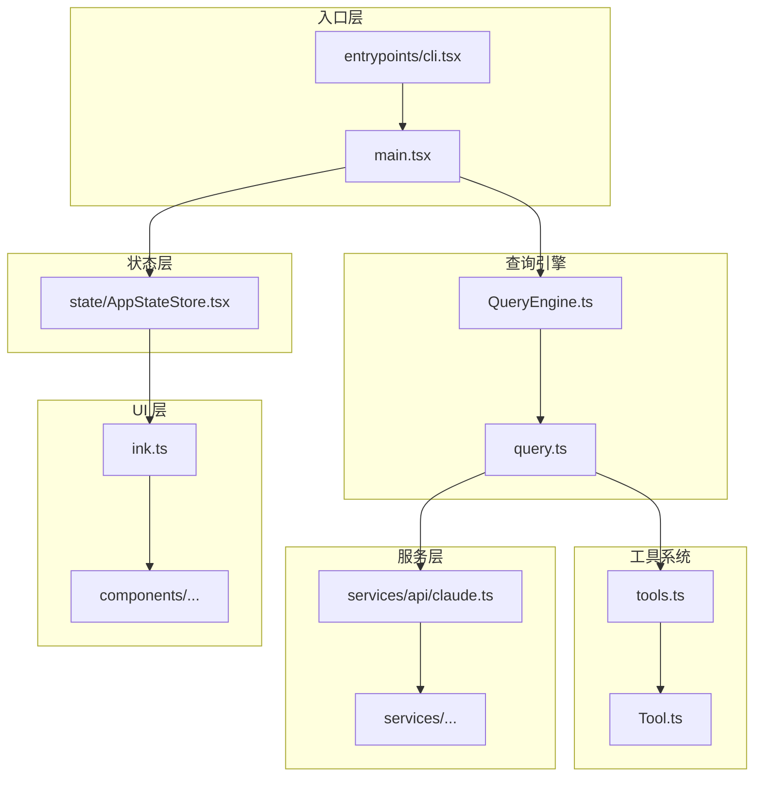
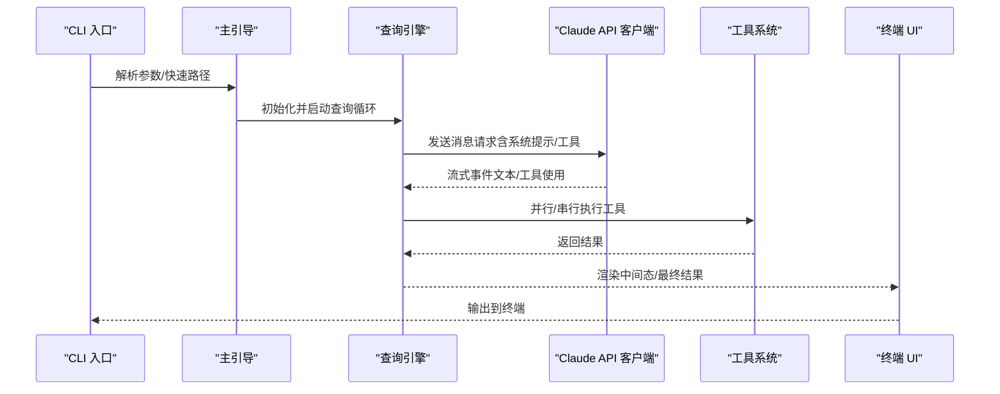
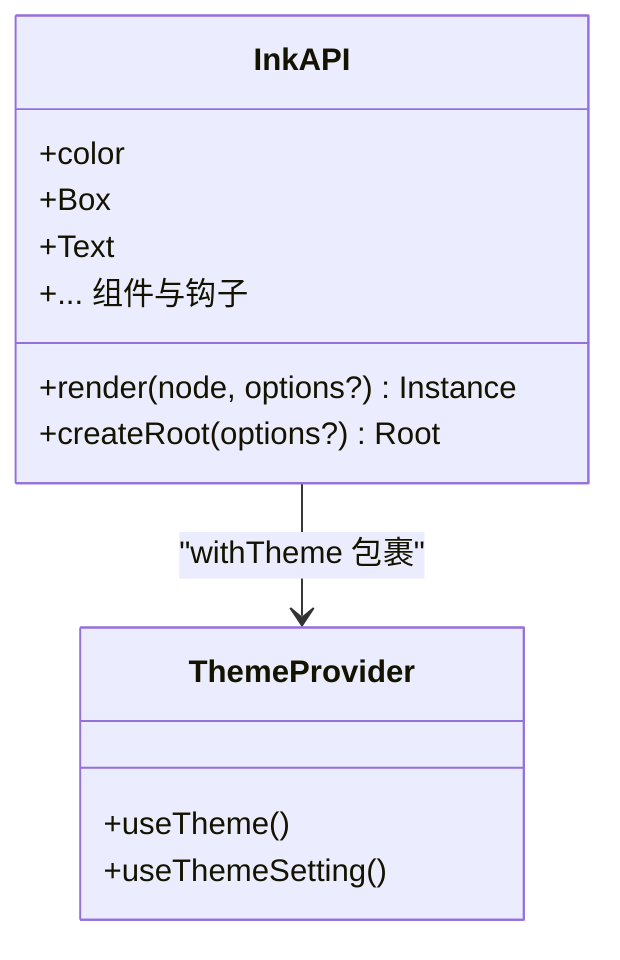
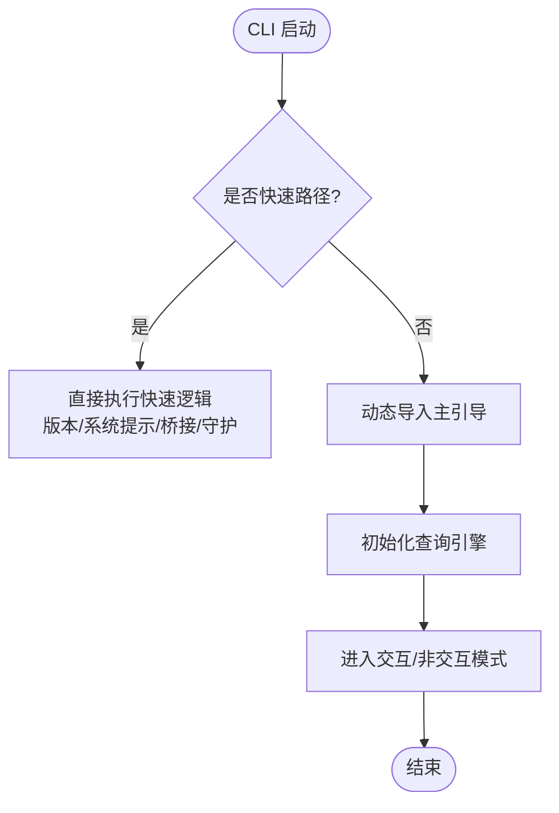
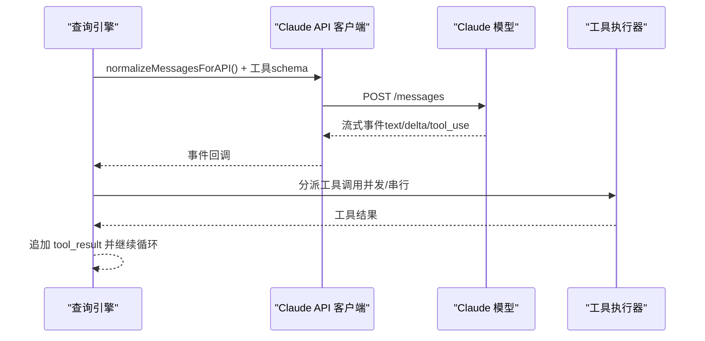
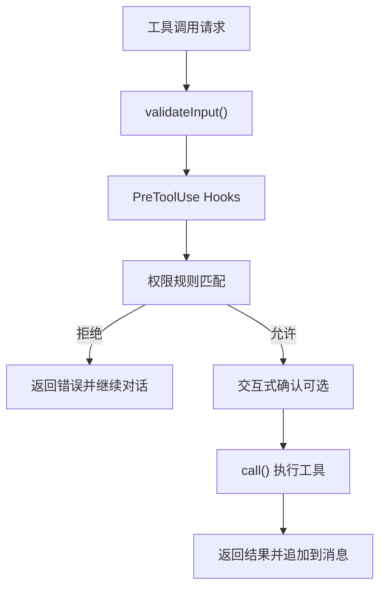
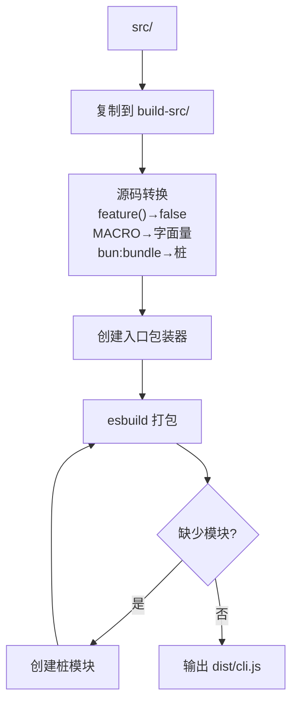
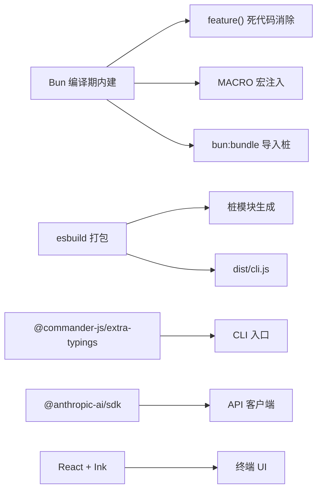

# 技术栈

<cite>
**本文引用的文件**
- [package.json](file://package.json)
- [tsconfig.json](file://tsconfig.json)
- [QUICKSTART.md](file://QUICKSTART.md)
- [README.md](file://README.md)
- [src/main.tsx](file://src/main.tsx)
- [src/entrypoints/cli.tsx](file://src/entrypoints/cli.tsx)
- [stubs/bun-bundle.ts](file://stubs/bun-bundle.ts)
- [stubs/macros.ts](file://stubs/macros.ts)
- [scripts/build.mjs](file://scripts/build.mjs)
- [src/ink.ts](file://src/ink.ts)
- [src/services/api/claude.ts](file://src/services/api/claude.ts)
- [src/tools.ts](file://src/tools.ts)
- [src/commands.ts](file://src/commands.ts)
</cite>

## 目录
1. [引言](#引言)
2. [项目结构](#项目结构)
3. [核心组件](#核心组件)
4. [架构总览](#架构总览)
5. [详细组件分析](#详细组件分析)
6. [依赖分析](#依赖分析)
7. [性能考量](#性能考量)
8. [故障排查指南](#故障排查指南)
9. [结论](#结论)
10. [附录：学习资源与参考](#附录学习资源与参考)

## 引言
本文件系统性梳理 Claude Code 的技术栈与架构决策，重点围绕以下方面展开：
- 开发语言与类型系统：以 TypeScript/TSX 为核心，结合 React + Ink 构建终端 UI。
- 运行时与构建：Bun 作为编译期运行时（compile-time intrinsics），同时提供最佳努力的 esbuild 构建路径。
- 关键依赖库：@anthropic-ai/sdk（Claude API）、commander（CLI 解析）、zod（数据校验）等在项目中的作用与协作。
- 数据流与模块组织：从入口到查询引擎、工具系统、服务层与状态层的端到端流程。
- 构建与编译：tsconfig、脚本化构建流程、特征门控（feature flags）与宏替换策略。
- 学习资源与参考：帮助开发者快速上手相关技术栈。

## 项目结构
该项目采用“按领域分层 + 功能模块化”的组织方式，入口层、查询引擎、工具系统、服务层、状态层、UI 层清晰分离，并通过命令系统与 CLI 入口衔接。

图表来源
- [src/entrypoints/cli.tsx:1-200](file://src/entrypoints/cli.tsx#L1-L200)
- [src/main.tsx:1-200](file://src/main.tsx#L1-L200)
- [src/services/api/claude.ts:1-200](file://src/services/api/claude.ts#L1-L200)
- [src/tools.ts:1-200](file://src/tools.ts#L1-L200)
- [src/ink.ts:1-86](file://src/ink.ts#L1-L86)

章节来源
- [README.md:250-380](file://README.md#L250-L380)

## 核心组件
- TypeScript/TSX：统一的类型安全与现代语法支持，配合 JSX 渲染终端 UI。
- React + Ink：在终端中渲染 React 组件，提供交互式 UI。
- @anthropic-ai/sdk：封装 Claude API 的调用、流式响应与错误处理。
- commander：CLI 参数解析与子命令管理。
- zod：在需要时进行输入/输出的数据校验与类型推断。
- Bun：提供 compile-time intrinsics（feature()、MACRO、bun:bundle），用于死代码消除与宏注入；同时提供最佳努力的 esbuild 构建路径。
- esbuild：在非 Bun 环境下进行打包，配合脚本迭代生成桩模块以解决缺失依赖问题。

章节来源
- [package.json:1-21](file://package.json#L1-L21)
- [tsconfig.json:1-37](file://tsconfig.json#L1-L37)
- [QUICKSTART.md:1-122](file://QUICKSTART.md#L1-L122)
- [src/services/api/claude.ts:1-200](file://src/services/api/claude.ts#L1-L200)
- [src/entrypoints/cli.tsx:1-200](file://src/entrypoints/cli.tsx#L1-L200)

## 架构总览
整体采用“命令驱动 + 查询引擎 + 工具执行 + 服务层 + 状态层 + 终端 UI”的分层架构。入口层负责参数解析与快速路径短路；查询引擎负责消息组装、调用 API、工具调度与上下文压缩；工具系统提供可插拔能力；服务层封装业务逻辑与外部集成；状态层提供全局状态与主题；UI 层基于 React + Ink 提供终端交互。

图表来源
- [src/entrypoints/cli.tsx:33-200](file://src/entrypoints/cli.tsx#L33-L200)
- [src/main.tsx:1-200](file://src/main.tsx#L1-L200)
- [src/services/api/claude.ts:1-200](file://src/services/api/claude.ts#L1-L200)
- [src/ink.ts:1-86](file://src/ink.ts#L1-L86)

章节来源
- [README.md:383-446](file://README.md#L383-L446)

## 详细组件分析

### TypeScript/TSX 与 React + Ink
- 类型系统：tsconfig 使用 ESNext 模块、ES2022 目标、React JSX 转换、声明文件与 sourcemap，确保类型安全与可调试性。
- 终端 UI：通过 src/ink.ts 对外导出渲染与根节点创建方法，统一包裹主题提供器，简化调用侧使用。
- 主入口：src/main.tsx 作为 REPL/交互式引导入口，加载大量工具、服务与状态模块，体现强类型与模块化组织。

图表来源
- [src/ink.ts:1-86](file://src/ink.ts#L1-L86)

章节来源
- [tsconfig.json:1-37](file://tsconfig.json#L1-L37)
- [src/ink.ts:1-86](file://src/ink.ts#L1-L86)
- [src/main.tsx:1-200](file://src/main.tsx#L1-L200)

### CLI 与命令系统
- 入口：src/entrypoints/cli.tsx 采用动态导入与特征门控，实现快速路径（版本、系统提示导出、桥接、守护进程等）与最小模块加载。
- 命令注册：src/commands.ts 按功能域组织命令，大量使用 feature() 门控，保证发布包中仅包含启用的功能分支。
- 依赖：@commander-js/extra-typings 用于强类型 CLI 解析；chalk 用于输出高亮；lodash-es 用于集合操作。

图表来源
- [src/entrypoints/cli.tsx:33-200](file://src/entrypoints/cli.tsx#L33-L200)
- [src/commands.ts:1-200](file://src/commands.ts#L1-L200)

章节来源
- [src/entrypoints/cli.tsx:1-200](file://src/entrypoints/cli.tsx#L1-L200)
- [src/commands.ts:1-200](file://src/commands.ts#L1-L200)

### Claude API 集成与数据流
- 客户端：src/services/api/claude.ts 封装 @anthropic-ai/sdk，负责消息标准化、工具 schema 注入、流式事件解析、配额与成本追踪。
- 错误处理：统一捕获 APIError、超时与中断错误，结合增长实验与策略头（beta headers）控制行为。
- 上下文压缩：在查询前根据阈值触发自动压缩或显式压缩，减少上下文长度。

图表来源
- [src/services/api/claude.ts:1-200](file://src/services/api/claude.ts#L1-L200)

章节来源
- [src/services/api/claude.ts:1-200](file://src/services/api/claude.ts#L1-L200)

### 工具系统与权限
- 工具接口：Tool.ts 定义工具生命周期、能力标记与渲染接口；tools.ts 统一注册与条件加载。
- 权限：commands.ts 与工具侧共同实现输入校验、预钩子、规则匹配与交互式确认。
- 特征门控：大量 feature() 门控确保发布包体积与安全性，内部特性在外部构建中被死代码消除。

图表来源
- [src/tools.ts:1-200](file://src/tools.ts#L1-L200)
- [src/commands.ts:1-200](file://src/commands.ts#L1-L200)

章节来源
- [src/tools.ts:1-200](file://src/tools.ts#L1-L200)
- [src/commands.ts:1-200](file://src/commands.ts#L1-L200)

### 构建与编译配置
- tsconfig：ESNext 模块、ES2022 目标、React JSX、路径映射、声明与 sourcemap，输出到 dist。
- Bun 编译期内建：feature()、MACRO、bun:bundle 用于死代码消除与宏注入；发布包不包含内部模块与工具。
- 最佳努力 esbuild 构建：scripts/build.mjs 替换 feature()/MACRO、移除 bun:bundle 导入、动态创建桩模块、多次迭代打包。

图表来源
- [scripts/build.mjs:1-200](file://scripts/build.mjs#L1-L200)
- [stubs/bun-bundle.ts:1-5](file://stubs/bun-bundle.ts#L1-L5)
- [stubs/macros.ts:1-21](file://stubs/macros.ts#L1-L21)

章节来源
- [tsconfig.json:1-37](file://tsconfig.json#L1-L37)
- [scripts/build.mjs:1-200](file://scripts/build.mjs#L1-L200)
- [stubs/bun-bundle.ts:1-5](file://stubs/bun-bundle.ts#L1-L5)
- [stubs/macros.ts:1-21](file://stubs/macros.ts#L1-L21)

## 依赖分析
- 运行时与构建
  - Bun：提供 compile-time intrinsics（feature()、MACRO、bun:bundle），用于死代码消除与宏注入；推荐使用 Bun 进行完整构建。
  - esbuild：在非 Bun 环境下的最佳努力打包，配合脚本迭代生成桩模块。
- 类型系统与 UI
  - TypeScript/TSX：统一类型安全与现代语法。
  - React + Ink：终端 UI 渲染与交互。
- 外部集成
  - @anthropic-ai/sdk：Claude API 客户端封装。
  - commander：CLI 参数解析与子命令管理。
  - lodash-es：集合与工具函数。
- 内部特性与门控
  - feature() 门控：控制内部特性与实验性功能的包含/排除。
  - MACRO 宏：构建时注入版本、链接等常量。

图表来源
- [src/entrypoints/cli.tsx:1-200](file://src/entrypoints/cli.tsx#L1-L200)
- [src/services/api/claude.ts:1-200](file://src/services/api/claude.ts#L1-L200)
- [scripts/build.mjs:1-200](file://scripts/build.mjs#L1-L200)

章节来源
- [package.json:1-21](file://package.json#L1-L21)
- [QUICKSTART.md:1-122](file://QUICKSTART.md#L1-L122)

## 性能考量
- 死代码消除：通过 Bun 的 feature() 门控在编译期剔除未启用的模块与工具，显著降低包体与冷启动时间。
- 快速路径：CLI 入口对 --version 等常见场景进行零模块加载的快速路径，提升用户体验。
- 并行初始化：主入口对部分子系统进行并行预取（如密钥链、MDM），缩短启动时间。
- 上下文压缩：在达到阈值时自动压缩历史消息，避免超出模型上下文窗口。
- 打包策略：esbuild 迭代生成桩模块，尽量减少外部依赖缺失导致的失败重试次数。

章节来源
- [src/entrypoints/cli.tsx:1-200](file://src/entrypoints/cli.tsx#L1-L200)
- [src/main.tsx:1-200](file://src/main.tsx#L1-L200)
- [README.md:650-690](file://README.md#L650-L690)

## 故障排查指南
- 构建失败（esbuild 无法解析模块）
  - 现象：打包时报“Could not resolve”。
  - 处理：运行脚本收集缺失模块，创建对应桩模块后重试。
- 特性缺失（feature-gated 模块）
  - 现象：某些命令/工具在发布包中不存在。
  - 处理：这是预期行为，由 Bun 的 feature() 在编译期死代码消除。
- Bun 与 Node 差异
  - 现象：使用 Node/其他打包器时，bun:bundle、feature()、MACRO 行为不同。
  - 处理：优先使用 Bun；若必须使用 Node，请参考最佳努力构建脚本与已知问题说明。
- CLI 快速路径
  - 现象：--version 等命令无任何模块加载。
  - 处理：这是设计使然，确保极快的响应速度。

章节来源
- [scripts/build.mjs:140-200](file://scripts/build.mjs#L140-L200)
- [QUICKSTART.md:58-104](file://QUICKSTART.md#L58-L104)

## 结论
本项目采用 TypeScript/TSX + React + Ink 的终端 UI 技术栈，结合 @anthropic-ai/sdk 实现与 Claude 的深度集成；通过 Bun 的 compile-time intrinsics（feature()、MACRO、bun:bundle）实现强大的特性门控与死代码消除，确保发布包的体积与安全性；在非 Bun 环境下，使用 esbuild 与脚本化桩模块生成提供最佳努力的构建路径。整体架构清晰、模块边界明确、数据流自顶向下，适合大规模终端 AI 应用的演进与维护。

## 附录：学习资源与参考
- TypeScript
  - 官方文档：https://www.typescriptlang.org/docs/
  - 配置参考：tsconfig.json（本仓库已提供）
- React + Ink
  - 项目主页与示例：https://github.com/vadimdemedes/ink
  - 终端 UI 设计要点：https://github.com/vadimdemedes/ink#design-guidelines
- @anthropic-ai/sdk
  - 官方文档与示例：https://www.npmjs.com/package/@anthropic-ai/sdk
  - 流式响应与工具调用：参见 src/services/api/claude.ts
- commander
  - 强类型 CLI：https://github.com/commander-js/extra-typings
- Bun
  - Compile-time intrinsics：https://bun.sh/docs/runtime/builtins
  - 特征门控与宏：参见 QUICKSTART.md 与 stubs/
- esbuild
  - 打包与外部化：scripts/build.mjs 中的 esbuild 调用
- zod（如需数据校验）
  - 官方文档：https://zod.dev/