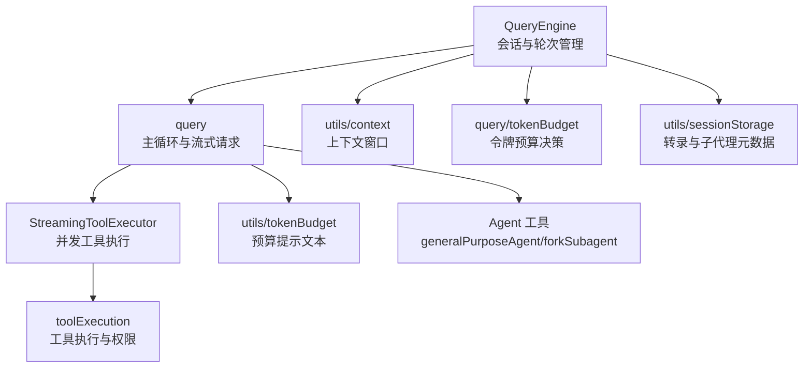
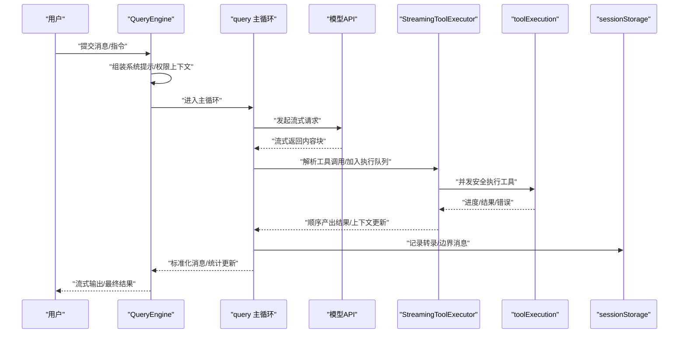
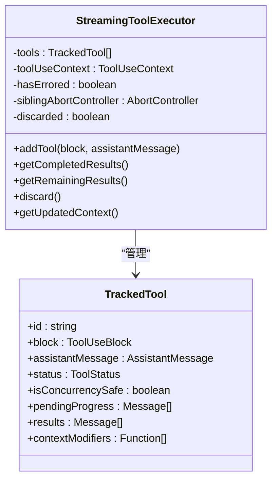
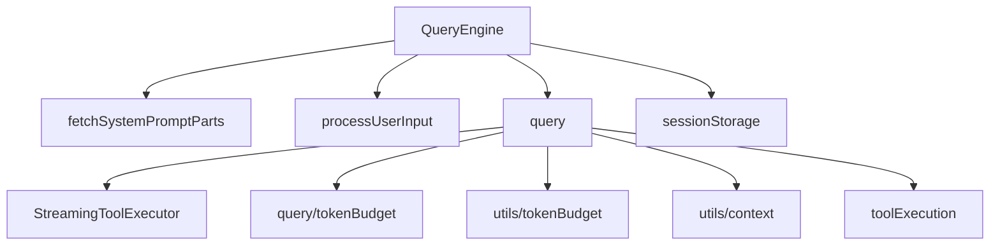

# Agent 循环模式

<cite>
**本文引用的文件**
- [src\QueryEngine.ts](file://src\QueryEngine.ts)
- [src\query.ts](file://src\query.ts)
- [src\services\tools\StreamingToolExecutor.ts](file://src\services\tools\StreamingToolExecutor.ts)
- [src\services\tools\toolExecution.ts](file://src\services\tools\toolExecution.ts)
- [src\query\tokenBudget.ts](file://src\query\tokenBudget.ts)
- [src\utils\tokenBudget.ts](file://src\utils\tokenBudget.ts)
- [src\utils\context.ts](file://src\utils\context.ts)
- [src\tools\AgentTool\built-in\generalPurposeAgent.ts](file://src\tools\AgentTool\built-in\generalPurposeAgent.ts)
- [src\tools\AgentTool\forkSubagent.ts](file://src\tools\AgentTool\forkSubagent.ts)
- [src\utils\sessionStorage.ts](file://src\utils\sessionStorage.ts)
</cite>

## 目录
1. [简介](#简介)
2. [项目结构](#项目结构)
3. [核心组件](#核心组件)
4. [架构总览](#架构总览)
5. [详细组件分析](#详细组件分析)
6. [依赖关系分析](#依赖关系分析)
7. [性能考量](#性能考量)
8. [故障排查指南](#故障排查指南)
9. [结论](#结论)
10. [附录](#附录)

## 简介
本文件面向 Claude Code 的 Agent 循环模式，系统化阐述从“用户输入接收”到“状态更新”的完整流程，并深入解析 QueryEngine 的实现机制（消息队列管理、令牌预算控制、上下文窗口优化、错误处理策略），以及 StreamingToolExecutor 的异步工具执行与流式输出能力。同时提供可扩展与自定义 Agent 行为的实践建议、性能优化与最佳实践（批量处理、缓存策略、并发控制）。

## 项目结构
围绕 Agent 循环的关键模块与职责如下：
- QueryEngine：会话生命周期与对话轮次管理，负责组装系统提示、持久化消息、触发查询与工具执行、状态更新与统计。
- query：主循环与流式请求构建器，协调模型调用、工具调度、预算与上下文优化、错误恢复与回退。
- StreamingToolExecutor：并发安全的工具执行器，支持进度消息优先、顺序产出、兄弟工具级联中断与丢弃。
- 工具执行与权限：toolExecution 负责具体工具执行、钩子、权限决策、错误分类与遥测；配合 useCanUseTool 的权限检查。
- 预算与上下文：tokenBudget 与 utils\tokenBudget 提供令牌预算决策；utils\context 提供上下文窗口计算与配额。
- Agent 工具与派生：generalPurposeAgent 提供通用 Agent 系统提示；forkSubagent 支持子代理派生与隔离工作树。
- 会话存储：sessionStorage 提供转录写入、子代理转录分片与元数据持久化。

**图表来源**
- [src\QueryEngine.ts:184-207](file://src\QueryEngine.ts#L184-L207)
- [src\query.ts:181-200](file://src\query.ts#L181-L200)
- [src\services\tools\StreamingToolExecutor.ts:40-62](file://src\services\tools\StreamingToolExecutor.ts#L40-L62)
- [src\services\tools\toolExecution.ts:1-120](file://src\services\tools\toolExecution.ts#L1-L120)
- [src\query\tokenBudget.ts:1-94](file://src\query\tokenBudget.ts#L1-L94)
- [src\utils\tokenBudget.ts:28-73](file://src\utils\tokenBudget.ts#L28-L73)
- [src\utils\context.ts:65-159](file://src\utils\context.ts#L65-L159)
- [src\tools\AgentTool\built-in\generalPurposeAgent.ts:19-35](file://src\tools\AgentTool\built-in\generalPurposeAgent.ts#L19-L35)
- [src\tools\AgentTool\forkSubagent.ts:32-71](file://src\tools\AgentTool\forkSubagent.ts#L32-L71)
- [src\utils\sessionStorage.ts:232-303](file://src\utils\sessionStorage.ts#L232-L303)

**章节来源**
- [src\QueryEngine.ts:184-207](file://src\QueryEngine.ts#L184-L207)
- [src\query.ts:181-200](file://src\query.ts#L181-L200)

## 核心组件
- QueryEngine.submitMessage：封装系统提示组装、用户输入处理、消息持久化、工具权限上下文更新、技能与插件预加载、系统初始化消息产出、主循环驱动与结果归并。
- query：主循环，负责流式请求开始标记、技能发现预取、模型选择、令牌预算检查、工具执行（同步或流式）、错误恢复与回退、转录记录与状态更新。
- StreamingToolExecutor：按并发安全规则排队与执行工具，维护进度消息优先、兄弟工具级联中断、丢弃策略与上下文修改器应用。
- 工具执行与权限：toolExecution 执行具体工具，处理权限钩子、慢阶段日志、错误分类、遥测与结果块处理。
- 预算与上下文：query/tokenBudget 基于全局令牌使用与阈值做继续/停止决策；utils\tokenBudget 提供预算提示文案；utils\context 计算上下文窗口上限。
- Agent 工具：generalPurposeAgent 提供通用系统提示；forkSubagent 支持派生子代理与工作树隔离。
- 会话存储：sessionStorage 提供转录写入、子代理事件聚合与元数据持久化。

**章节来源**
- [src\QueryEngine.ts:209-639](file://src\QueryEngine.ts#L209-L639)
- [src\query.ts:317-1410](file://src\query.ts#L317-L1410)
- [src\services\tools\StreamingToolExecutor.ts:40-531](file://src\services\tools\StreamingToolExecutor.ts#L40-L531)
- [src\services\tools\toolExecution.ts:1-200](file://src\services\tools\toolExecution.ts#L1-L200)
- [src\query\tokenBudget.ts:1-94](file://src\query\tokenBudget.ts#L1-L94)
- [src\utils\tokenBudget.ts:28-73](file://src\utils\tokenBudget.ts#L28-L73)
- [src\utils\context.ts:65-159](file://src\utils\context.ts#L65-L159)
- [src\tools\AgentTool\built-in\generalPurposeAgent.ts:19-35](file://src\tools\AgentTool\built-in\generalPurposeAgent.ts#L19-L35)
- [src\tools\AgentTool\forkSubagent.ts:32-71](file://src\tools\AgentTool\forkSubagent.ts#L32-L71)
- [src\utils\sessionStorage.ts:232-303](file://src\utils\sessionStorage.ts#L232-L303)

## 架构总览
下图展示了从用户输入到工具执行与结果产出的端到端流程，以及关键组件之间的交互关系。

**图表来源**
- [src\QueryEngine.ts:675-782](file://src\QueryEngine.ts#L675-L782)
- [src\query.ts:337-1410](file://src\query.ts#L337-L1410)
- [src\services\tools\StreamingToolExecutor.ts:76-405](file://src\services\tools\StreamingToolExecutor.ts#L76-L405)
- [src\services\tools\toolExecution.ts:320-520](file://src\services\tools\toolExecution.ts#L320-L520)
- [src\utils\sessionStorage.ts:232-303](file://src\utils\sessionStorage.ts#L232-L303)

## 详细组件分析

### QueryEngine：会话与轮次管理
- 关键职责
  - 组装系统提示（默认、自定义、内存机制提示、附加片段）
  - 处理用户输入（命令解析、附件、模型选择、权限规则注入）
  - 持久化用户消息（转录写入、必要时立即刷新）
  - 触发主循环（yield 系统初始化消息、开始流式请求）
  - 归并工具执行结果、进度消息与转录边界，产出标准化消息
  - 统计与状态（用量、成本、轮次、权限拒绝、快速模式状态）

- 并发与权限
  - 包装 canUseTool 以追踪权限拒绝并上报 SDK
  - 在交互前重建 ToolPermissionContext，确保命令允许集合与工具池一致

- 技能与插件
  - 头无阻塞地加载技能与插件缓存，避免启动阻塞

- 结果与状态
  - 对本地命令输出进行合成助手消息，便于跨客户端渲染
  - compact_boundary 边界消息触发部分转录快照，提升恢复鲁棒性

**章节来源**
- [src\QueryEngine.ts:209-639](file://src\QueryEngine.ts#L209-L639)
- [src\QueryEngine.ts:675-782](file://src\QueryEngine.ts#L675-L782)

### query：主循环与流式请求
- 关键流程
  - 流式请求开始标记、技能发现预取、查询链跟踪、模型选择与回退
  - 令牌预算检查与继续/停止决策，动态提示用户
  - 工具执行（同步或流式），收集进度与结果，维护工具结果缓冲
  - 错误恢复与回退：流式回退时丢弃孤儿消息、丢弃失败尝试结果、重建执行器
  - 转录记录与状态更新：按类型写入、紧凑边界触发快照、ACK 初始用户消息

- 令牌预算
  - 基于全局令牌使用与阈值判断是否继续，提供“继续工作”提示
  - 阈值与持续次数、增量变化共同决定是否触发停止与完成事件

- 上下文窗口
  - 动态计算上下文窗口上限，考虑模型能力、实验开关与用户类型

- 工具执行
  - 若存在流式执行器则使用其获取剩余结果；否则同步执行并归一化消息

**章节来源**
- [src\query.ts:317-1410](file://src\query.ts#L317-L1410)
- [src\query\tokenBudget.ts:45-94](file://src\query\tokenBudget.ts#L45-L94)
- [src\utils\context.ts:65-159](file://src\utils\context.ts#L65-L159)

### StreamingToolExecutor：并发工具执行与流式输出
- 设计要点
  - 并发安全：仅当无并发不安全工具在执行时，才允许并发安全工具并行
  - 进度优先：进度消息立即产出，不阻塞其他工具
  - 兄弟工具级联中断：Bash 错误触发 siblingAbortController，导致同批其他 Bash 工具被取消
  - 丢弃策略：流式回退时丢弃未完成工具，避免孤儿结果
  - 上下文修改：非并发工具的上下文修改器在串行完成后应用到执行器上下文

- 关键方法
  - addTool：加入工具并触发队列处理
  - getCompletedResults：顺序产出已完成结果
  - getRemainingResults：等待并产出剩余结果与进度
  - discard：丢弃所有待执行与进行中工具

**图表来源**
- [src\services\tools\StreamingToolExecutor.ts:40-124](file://src\services\tools\StreamingToolExecutor.ts#L40-L124)
- [src\services\tools\StreamingToolExecutor.ts:412-490](file://src\services\tools\StreamingToolExecutor.ts#L412-L490)

**章节来源**
- [src\services\tools\StreamingToolExecutor.ts:40-531](file://src\services\tools\StreamingToolExecutor.ts#L40-L531)

### 工具执行与权限：toolExecution
- 权限与钩子
  - 执行前运行权限钩子，记录慢阶段日志阈值
  - 处理权限拒绝与用户交互，支持延迟工具与搜索工具
  - 分类工具错误，提取遥测安全信息，记录会话活动

- 结果处理
  - 进度消息、停止钩子摘要、工具结果停止消息、附件消息
  - 结果块预映射与存储，支持工具结果预算

- MCP 与分析
  - 提取 MCP 工具细节与分析元数据，记录会话追踪与遥测事件

**章节来源**
- [src\services\tools\toolExecution.ts:1-200](file://src\services\tools\toolExecution.ts#L1-L200)

### 令牌预算与上下文窗口
- 令牌预算
  - 基于全局令牌使用与阈值判断是否继续，提供“继续工作”提示
  - 持续次数与增量变化共同决定是否停止并记录完成事件

- 上下文窗口
  - 动态计算上下文窗口上限，考虑模型能力、实验开关与用户类型
  - 提供使用百分比与剩余百分比计算

**章节来源**
- [src\query\tokenBudget.ts:1-94](file://src\query\tokenBudget.ts#L1-L94)
- [src\utils\tokenBudget.ts:28-73](file://src\utils\tokenBudget.ts#L28-L73)
- [src\utils\context.ts:65-159](file://src\utils\context.ts#L65-L159)

### Agent 工具与派生
- 通用 Agent
  - 提供通用系统提示与指导原则，适用于复杂研究与多步任务

- 子代理派生
  - forkSubagent 支持隐式派生，继承完整对话上下文与系统提示
  - 工作树隔离：子代理在独立工作树中操作，路径需翻译
  - 缓冲区占位：为保持提示缓存命中，子代理前缀使用相同占位符

**章节来源**
- [src\tools\AgentTool\built-in\generalPurposeAgent.ts:19-35](file://src\tools\AgentTool\built-in\generalPurposeAgent.ts#L19-L35)
- [src\tools\AgentTool\forkSubagent.ts:32-71](file://src\tools\AgentTool\forkSubagent.ts#L32-L71)
- [src\tools\AgentTool\forkSubagent.ts:107-169](file://src\tools\AgentTool\forkSubagent.ts#L107-L169)

### 会话存储与子代理转录
- 转录写入
  - 按类型写入转录，紧凑边界触发部分快照，提升恢复鲁棒性
  - 子代理事件聚合到各自文件，避免 JSONL 模式变更

- 元数据持久化
  - 子代理类型、工作树路径与原始任务描述等元数据单独保存

**章节来源**
- [src\utils\sessionStorage.ts:232-303](file://src\utils\sessionStorage.ts#L232-L303)

## 依赖关系分析
- QueryEngine 依赖
  - fetchSystemPromptParts：系统提示部件拼装
  - processUserInput：用户输入解析与命令处理
  - query：主循环与工具执行
  - recordTranscript：转录写入
  - sessionStorage：转录与元数据

- query 依赖
  - StreamingToolExecutor：流式工具执行
  - tokenBudget：预算决策
  - utils\tokenBudget：预算提示文本
  - utils\context：上下文窗口
  - toolExecution：工具执行

**图表来源**
- [src\QueryEngine.ts:286-325](file://src\QueryEngine.ts#L286-L325)
- [src\query.ts:96-104](file://src\query.ts#L96-L104)

**章节来源**
- [src\QueryEngine.ts:286-325](file://src\QueryEngine.ts#L286-L325)
- [src\query.ts:96-104](file://src\query.ts#L96-L104)

## 性能考量
- 批量处理
  - 使用 StreamingToolExecutor 的并发安全规则，将多个并发安全工具并行执行，减少总耗时
  - 进度消息优先产出，避免阻塞后续工具，提升感知性能

- 缓存策略
  - 技能与插件缓存仅加载，避免网络阻塞
  - 提示缓存命中：fork 子代理前缀使用相同占位符，最大化缓存命中率

- 并发控制
  - 兄弟工具级联中断：Bash 错误通过 siblingAbortController 中断同批 Bash 工具，避免无效资源消耗
  - 丢弃策略：流式回退时丢弃失败尝试结果，防止孤儿消息与重复产出

- 上下文与预算
  - 动态上下文窗口计算，避免超限导致的重试与失败
  - 令牌预算决策与阈值调整，平衡继续与停止，降低无效输出

- I/O 优化
  - 转录写入按类型异步进行，紧凑边界触发快照，减少全量写入
  - 子代理事件聚合到独立文件，降低锁竞争与写放大

**章节来源**
- [src\services\tools\StreamingToolExecutor.ts:129-151](file://src\services\tools\StreamingToolExecutor.ts#L129-L151)
- [src\services\tools\StreamingToolExecutor.ts:354-364](file://src\services\tools\StreamingToolExecutor.ts#L354-L364)
- [src\query.ts:712-740](file://src\query.ts#L712-L740)
- [src\utils\context.ts:65-159](file://src\utils\context.ts#L65-L159)
- [src\query\tokenBudget.ts:45-94](file://src\query\tokenBudget.ts#L45-L94)
- [src\utils\sessionStorage.ts:232-303](file://src\utils\sessionStorage.ts#L232-L303)

## 故障排查指南
- 权限拒绝
  - QueryEngine 包装 canUseTool 并追踪拒绝，可通过 permission_denials 字段定位问题工具与输入

- 工具执行错误
  - toolExecution 对错误进行分类与遥测，结合慢阶段日志阈值定位瓶颈
  - Bash 错误会触发兄弟工具级联中断，检查 siblingAbortController 信号

- 流式回退
  - 回退时丢弃孤儿消息与失败尝试结果，重建执行器避免孤儿工具结果
  - 检查流式回退触发条件与丢弃策略

- 转录与恢复
  - 紧凑边界触发部分转录快照，确保恢复点一致性
  - 子代理事件聚合到独立文件，核对元数据与事件数量

**章节来源**
- [src\QueryEngine.ts:244-271](file://src\QueryEngine.ts#L244-L271)
- [src\services\tools\toolExecution.ts:150-171](file://src\services\tools\toolExecution.ts#L150-L171)
- [src\services\tools\StreamingToolExecutor.ts:210-231](file://src\services\tools\StreamingToolExecutor.ts#L210-L231)
- [src\query.ts:712-740](file://src\query.ts#L712-L740)
- [src\utils\sessionStorage.ts:232-303](file://src\utils\sessionStorage.ts#L232-L303)

## 结论
本文系统梳理了 Claude Code Agent 循环模式的端到端实现，重点覆盖 QueryEngine 的会话与轮次管理、query 的主循环与工具调度、StreamingToolExecutor 的并发与流式能力，以及预算、上下文与权限检查的工程化实现。通过并发控制、缓存策略与 I/O 优化，可在保证正确性的前提下显著提升性能与用户体验。建议在扩展与自定义 Agent 行为时，遵循并发安全与上下文一致性原则，并充分利用转录与元数据持久化能力以增强可观测性与可恢复性。

## 附录
- 扩展与自定义建议
  - 新增工具：在工具定义中声明并发安全与中断行为，确保与现有并发规则兼容
  - 自定义 Agent：基于 generalPurposeAgent 的系统提示模板扩展，注意 fork 子代理的提示缓存一致性
  - 权限钩子：利用 toolExecution 的钩子机制，插入自定义权限决策与慢阶段日志
  - 预算与上下文：根据业务场景调整令牌预算阈值与上下文窗口上限，平衡成本与质量

- 参考路径
  - [QueryEngine.submitMessage:209-639](file://src\QueryEngine.ts#L209-L639)
  - [query 主循环:317-1410](file://src\query.ts#L317-L1410)
  - [StreamingToolExecutor.addTool/getRemainingResults:76-490](file://src\services\tools\StreamingToolExecutor.ts#L76-L490)
  - [toolExecution 错误分类与钩子:150-200](file://src\services\tools\toolExecution.ts#L150-L200)
  - [令牌预算决策:45-94](file://src\query\tokenBudget.ts#L45-L94)
  - [上下文窗口计算:65-159](file://src\utils\context.ts#L65-L159)
  - [子代理派生与工作树隔离:107-169](file://src\tools\AgentTool\forkSubagent.ts#L107-L169)
  - [转录与元数据持久化:232-303](file://src\utils\sessionStorage.ts#L232-L303)