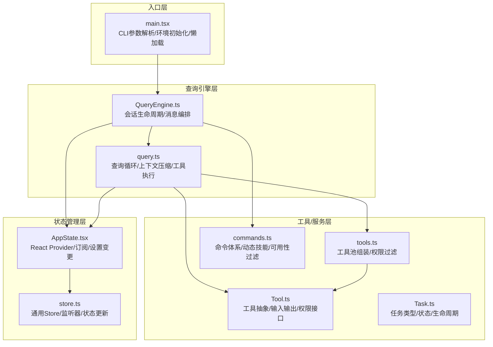
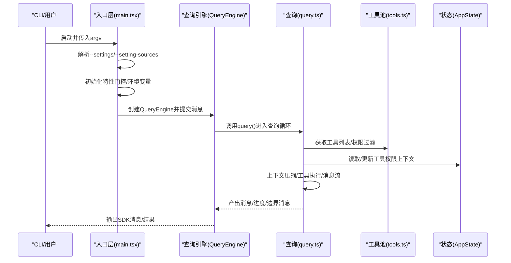
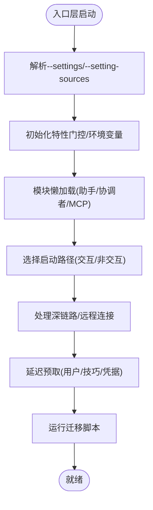
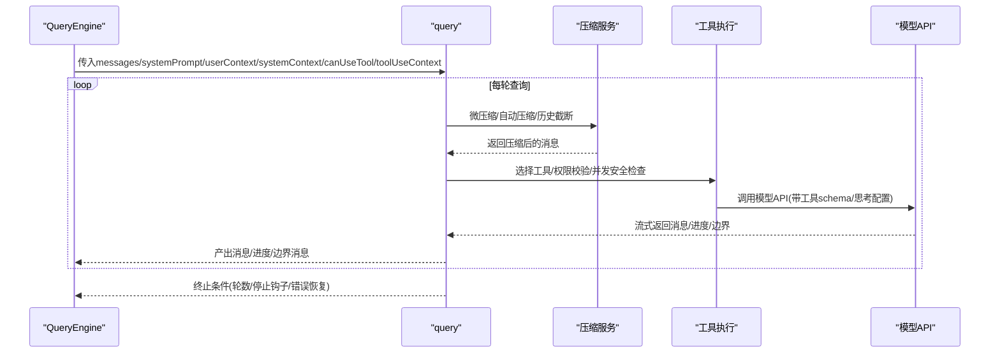
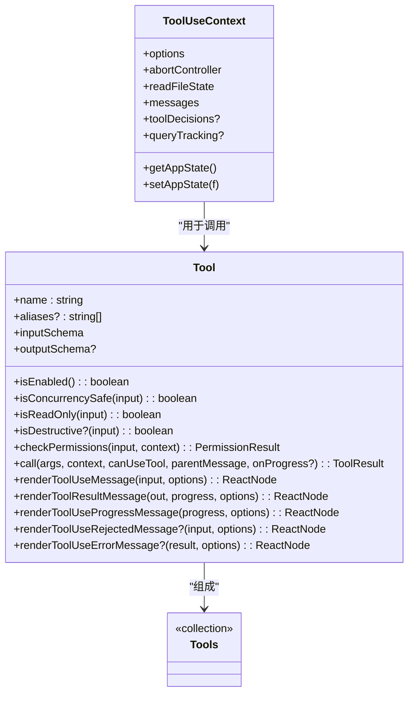
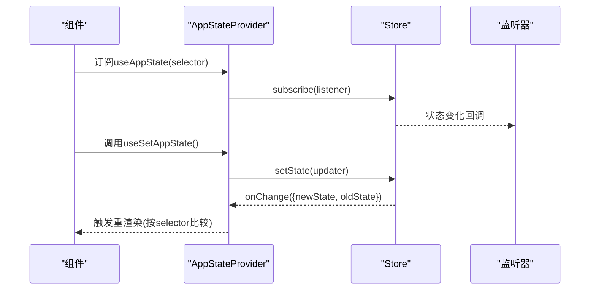
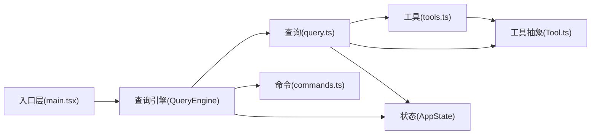

# 分层架构设计

<cite>
**本文档引用的文件**
- [src/main.tsx](file://src/main.tsx)
- [src/query.ts](file://src/query.ts)
- [src/QueryEngine.ts](file://src/QueryEngine.ts)
- [src/state/AppState.tsx](file://src/state/AppState.tsx)
- [src/state/store.ts](file://src/state/store.ts)
- [src/tools.ts](file://src/tools.ts)
- [src/commands.ts](file://src/commands.ts)
- [src/Tool.ts](file://src/Tool.ts)
- [src/Task.ts](file://src/Task.ts)
</cite>

## 目录
1. [引言](#引言)
2. [项目结构](#项目结构)
3. [核心组件](#核心组件)
4. [架构总览](#架构总览)
5. [详细组件分析](#详细组件分析)
6. [依赖分析](#依赖分析)
7. [性能考虑](#性能考虑)
8. [故障排除指南](#故障排除指南)
9. [结论](#结论)

## 引言
本文件系统化阐述 Claude Code 的四层架构设计：入口层（main.tsx）、查询引擎层（query.ts）、工具/服务层（tools/services）、状态管理层（state）。重点说明每层职责边界、接口定义与依赖关系，以及入口层如何处理 CLI 参数解析、环境初始化与模块懒加载；查询引擎层如何实现 Agent 循环与消息处理；工具/服务层如何提供功能扩展与业务逻辑封装；状态管理层如何管理应用状态与组件通信。同时给出架构图示、数据流与控制流说明，并总结分层设计在关注点分离、可测试性与可维护性方面的优势。

## 项目结构
- 入口层：负责 CLI 参数解析、环境初始化、特性门控、模块懒加载与启动路径选择。
- 查询引擎层：封装查询循环、上下文压缩、工具执行、权限校验与消息流输出。
- 工具/服务层：提供工具集合、命令体系、MCP 集成与各类服务（分析、提示、插件、策略限制等）。
- 状态管理层：提供全局状态存储、订阅机制与 React Provider 封装。

**图表来源**
- [src/main.tsx](file://src/main.tsx)
- [src/query.ts](file://src/query.ts)
- [src/QueryEngine.ts](file://src/QueryEngine.ts)
- [src/state/AppState.tsx](file://src/state/AppState.tsx)
- [src/state/store.ts](file://src/state/store.ts)
- [src/tools.ts](file://src/tools.ts)
- [src/commands.ts](file://src/commands.ts)
- [src/Tool.ts](file://src/Tool.ts)
- [src/Task.ts](file://src/Task.ts)

**章节来源**
- [src/main.tsx](file://src/main.tsx)
- [src/query.ts](file://src/query.ts)
- [src/QueryEngine.ts](file://src/QueryEngine.ts)
- [src/state/AppState.tsx](file://src/state/AppState.tsx)
- [src/state/store.ts](file://src/state/store.ts)
- [src/tools.ts](file://src/tools.ts)
- [src/commands.ts](file://src/commands.ts)
- [src/Tool.ts](file://src/Tool.ts)
- [src/Task.ts](file://src/Task.ts)

## 核心组件
- 入口层（main.tsx）
  - 职责：解析 CLI 参数、早期设置标志、环境初始化、特性门控、延迟模块加载、启动路径选择（交互式/非交互式）、深链路与远程连接处理、迁移与预取优化。
  - 关键接口：main() 主函数、initializeEntrypoint()、startDeferredPrefetches()、eagerLoadSettings() 等。
- 查询引擎层（query.ts / QueryEngine.ts）
  - 职责：查询循环、上下文压缩（自动/微/历史截断）、工具执行与权限校验、消息流与进度事件、错误恢复与回退模型、任务预算与令牌预算。
  - 关键接口：query() 异步生成器、QueryEngine.submitMessage()、工具使用上下文 ToolUseContext。
- 工具/服务层（tools.ts / commands.ts / Tool.ts / Task.ts）
  - 职责：工具池组装与权限过滤、命令体系与动态技能、MCP 工具集成、任务类型与生命周期管理。
  - 关键接口：getTools()/assembleToolPool()、getCommands()/getSkillToolCommands()、Tool 抽象与工具方法、Task 类型与状态机。
- 状态管理层（AppState.tsx / store.ts）
  - 职责：全局状态存储、订阅通知、设置变更同步、React Provider 包裹、外部状态订阅。
  - 关键接口：AppStateProvider、useAppState/useSetAppState、createStore()/Store 接口。

**章节来源**
- [src/main.tsx](file://src/main.tsx)
- [src/query.ts](file://src/query.ts)
- [src/QueryEngine.ts](file://src/QueryEngine.ts)
- [src/state/AppState.tsx](file://src/state/AppState.tsx)
- [src/state/store.ts](file://src/state/store.ts)
- [src/tools.ts](file://src/tools.ts)
- [src/commands.ts](file://src/commands.ts)
- [src/Tool.ts](file://src/Tool.ts)
- [src/Task.ts](file://src/Task.ts)

## 架构总览
四层架构通过清晰的职责划分实现关注点分离：
- 入口层负责“如何启动”，包括 CLI 解析、特性门控与模块懒加载。
- 查询引擎层负责“如何对话”，包括查询循环、上下文压缩、工具执行与消息流。
- 工具/服务层负责“能做什么”，包括工具池、命令体系与服务能力。
- 状态管理层负责“状态如何流转”，包括全局状态、订阅与变更传播。

**图表来源**
- [src/main.tsx](file://src/main.tsx)
- [src/QueryEngine.ts](file://src/QueryEngine.ts)
- [src/query.ts](file://src/query.ts)
- [src/tools.ts](file://src/tools.ts)
- [src/state/AppState.tsx](file://src/state/AppState.tsx)

## 详细组件分析

### 入口层（main.tsx）分析
- 职责边界
  - CLI 参数解析与早期设置：支持 --settings 与 --setting-sources 提前加载与缓存重置。
  - 环境初始化：特性门控（feature）、MDM 键盘串行预取、信任对话框检查、策略限制与远程托管设置加载。
  - 模块懒加载：延迟导入 REPL、助手模式、协调者模式、MCP 注册表等，避免循环依赖与冷启动开销。
  - 启动路径选择：根据是否非交互式设置入口点（CLI/SDK），处理深链路与远程连接（cc://、ssh、assistant）。
  - 预取与迁移：启动后延迟预取用户上下文、技巧、模型能力、变更检测器；运行迁移脚本。
- 关键接口与流程
  - eagerLoadSettings()：提前解析 --settings 与 --setting-sources 并重置设置缓存。
  - initializeEntrypoint()：基于交互性设置 CLAUDE_CODE_ENTRYPOINT。
  - startDeferredPrefetches()：首帧渲染后进行非阻塞预取（用户信息、技巧、认证凭据、模型能力）。
  - main()：主入口，处理深链路、远程连接、SSH 连接、打印模式信号处理与安全策略（Windows 路径注入防护）。

**图表来源**
- [src/main.tsx](file://src/main.tsx)

**章节来源**
- [src/main.tsx](file://src/main.tsx)

### 查询引擎层（query.ts / QueryEngine.ts）分析
- 职责边界
  - QueryEngine：会话生命周期管理、消息编排、权限拒绝追踪、成本与用量统计、文件历史快照、结构化输出约束注册。
  - query：查询循环、上下文压缩（微压缩/自动压缩/历史截断）、工具执行、权限校验、错误恢复（最大输出令牌、提示过长）、任务预算与令牌预算。
- 关键接口与流程
  - QueryEngine.submitMessage()：构建系统提示、合并用户/系统上下文、处理斜杠命令、持久化消息、产出系统初始化消息、驱动 query() 流程。
  - query()：异步生成器，按轮次推进，每轮执行微压缩、自动压缩、工具执行、消息持久化与进度事件。
  - ToolUseContext：贯穿查询循环的上下文对象，承载工具选项、MCP 客户端、权限上下文、文件状态缓存、消息数组等。

**图表来源**
- [src/QueryEngine.ts](file://src/QueryEngine.ts)
- [src/query.ts](file://src/query.ts)

**章节来源**
- [src/QueryEngine.ts](file://src/QueryEngine.ts)
- [src/query.ts](file://src/query.ts)

### 工具/服务层（tools.ts / commands.ts / Tool.ts / Task.ts）分析
- 职责边界
  - tools.ts：工具池组装、权限规则过滤、REPL 模式与简单模式适配、内置工具与 MCP 工具合并、名称排序与去重。
  - commands.ts：命令体系、动态技能与插件技能、可用性过滤（认证/提供商）、远程/桥接安全命令白名单、命令缓存清理。
  - Tool.ts：工具抽象定义、输入输出模式、权限检查、进度渲染、拒绝/错误 UI 渲染、透明包装器与摘要生成。
  - Task.ts：任务类型枚举、状态机、任务 ID 生成、输出文件管理、终止态判断。
- 关键接口与流程
  - getTools()/assembleToolPool()：根据权限上下文与特性门控组装工具池，内置优先、MCP 去重。
  - getCommands()/getSkillToolCommands()：加载技能/插件/工作流/内置命令，动态技能插入，可用性与启用状态过滤。
  - Tool 接口：call/description/permission/check/progress/render 等方法，统一工具行为与 UI 表达。

**图表来源**
- [src/Tool.ts](file://src/Tool.ts)
- [src/tools.ts](file://src/tools.ts)

**章节来源**
- [src/tools.ts](file://src/tools.ts)
- [src/commands.ts](file://src/commands.ts)
- [src/Tool.ts](file://src/Tool.ts)
- [src/Task.ts](file://src/Task.ts)

### 状态管理层（AppState.tsx / store.ts）分析
- 职责边界
  - AppState.tsx：React Provider 封装、设置变更监听、语音/邮箱上下文包裹、权限模式禁用检测与日志。
  - store.ts：通用 Store 实现，提供 getState/setState/subscribe，支持 onChange 回调与监听器集合。
- 关键接口与流程
  - AppStateProvider：创建/订阅/设置变更，确保不可嵌套，应用设置变更。
  - useAppState/useSetAppState/useAppStateStore：订阅状态切片、获取 setter、直接访问 store。
  - createStore()/Store：最小化状态容器，避免重复渲染，触发 onChange 与监听器。

**图表来源**
- [src/state/AppState.tsx](file://src/state/AppState.tsx)
- [src/state/store.ts](file://src/state/store.ts)

**章节来源**
- [src/state/AppState.tsx](file://src/state/AppState.tsx)
- [src/state/store.ts](file://src/state/store.ts)

## 依赖分析
- 层间依赖
  - 入口层 → 查询引擎层：main.tsx 创建并驱动 QueryEngine，传递工具、命令、MCP 客户端与 AppState。
  - 查询引擎层 → 工具/服务层：QueryEngine 与 query 使用 tools.ts/commands.ts/Tool.ts/Task.ts 提供的能力。
  - 查询引擎层 → 状态管理层：读取/更新 ToolPermissionContext、文件历史与归属状态。
  - 工具/服务层 ↔ 状态管理层：工具/命令需要访问 AppState 以获取权限、主题、设置等。
- 内聚与耦合
  - 入口层与查询引擎层内聚度高，耦合通过明确接口（ToolUseContext、AppState）降低。
  - 工具/服务层通过抽象接口（Tool.ts）与查询引擎解耦，便于扩展与替换。
  - 状态管理层采用订阅模式，避免全局共享导致的复杂依赖。

**图表来源**
- [src/main.tsx](file://src/main.tsx)
- [src/QueryEngine.ts](file://src/QueryEngine.ts)
- [src/query.ts](file://src/query.ts)
- [src/tools.ts](file://src/tools.ts)
- [src/commands.ts](file://src/commands.ts)
- [src/Tool.ts](file://src/Tool.ts)
- [src/state/AppState.tsx](file://src/state/AppState.tsx)

**章节来源**
- [src/main.tsx](file://src/main.tsx)
- [src/QueryEngine.ts](file://src/QueryEngine.ts)
- [src/query.ts](file://src/query.ts)
- [src/tools.ts](file://src/tools.ts)
- [src/commands.ts](file://src/commands.ts)
- [src/Tool.ts](file://src/Tool.ts)
- [src/state/AppState.tsx](file://src/state/AppState.tsx)

## 性能考虑
- 模块懒加载与死代码消除：入口层对助手/协调者/MCP 等模块采用延迟导入与特性门控，减少初始包体与冷启动时间。
- 首帧渲染后延迟预取：入口层在首次渲染后进行非阻塞预取（用户上下文、技巧、模型能力、变更检测器），避免阻塞关键路径。
- 查询循环优化：query.ts 中的微压缩/自动压缩/历史截断、令牌预算与任务预算、流式回退与墓碑消息处理，提升长会话稳定性与性能。
- 状态订阅最小化：AppState 仅在必要时触发重渲染，避免不必要的 UI 更新。

## 故障排除指南
- CLI 参数问题
  - --settings 与 --setting-sources：若传入无效 JSON 或文件不存在，入口层会记录错误并退出；建议先验证 JSON 结构或文件路径。
  - 打印模式（-p/--print）：入口层注册 SIGINT 处理，避免与查询中断冲突；如需中止，可直接发送信号。
- 权限与工具执行
  - 工具被拒绝：QueryEngine 会追踪 permission_denials，可在结果中查看；检查 ToolPermissionContext 与 deny 规则。
  - 工具并发安全：部分工具标记为非并发安全，需遵循中断行为（cancel/block）。
- 上下文过长与恢复
  - 提示过长：当超过硬限制时，query 会直接返回错误消息；可通过压缩/截断或调整模型/思考配置缓解。
  - 最大输出令牌：query 对该类错误进行暂存并在恢复路径完成后统一产出，避免提前泄漏中间错误。
- 状态异常
  - 设置变更未生效：入口层在挂载时应用设置变更；若远程设置加载较早，可能临时禁用 bypass 权限模式，属于预期行为。

**章节来源**
- [src/main.tsx](file://src/main.tsx)
- [src/query.ts](file://src/query.ts)
- [src/QueryEngine.ts](file://src/QueryEngine.ts)
- [src/state/AppState.tsx](file://src/state/AppState.tsx)

## 结论
四层架构通过清晰的职责划分与接口契约，实现了：
- 关注点分离：入口层专注启动与初始化，查询引擎层专注对话与消息编排，工具/服务层专注能力与扩展，状态管理层专注状态与通信。
- 可测试性：工具抽象（Tool.ts）、查询循环（query.ts）与状态容器（store.ts）均可独立测试；命令与工具池通过工厂函数与权限过滤便于模拟。
- 可维护性：特性门控与懒加载降低耦合；订阅模式与上下文对象使状态变更可控；命令与工具的统一接口便于新增与替换。