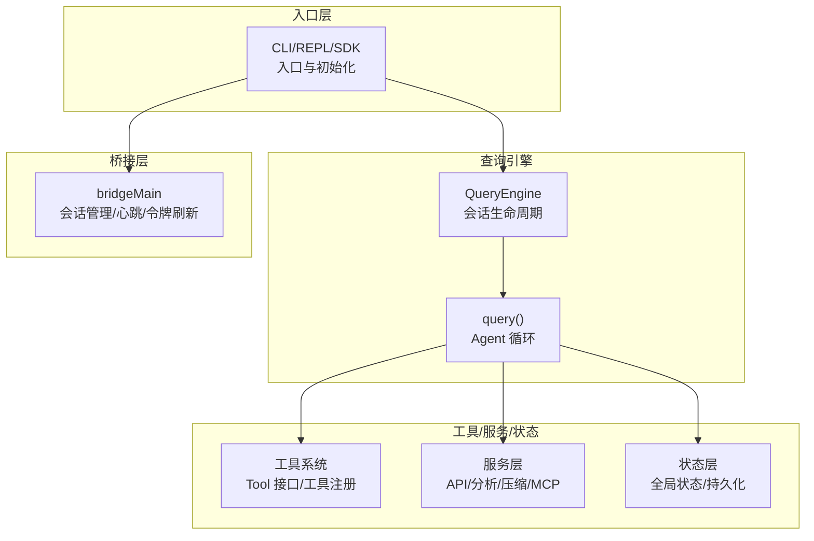
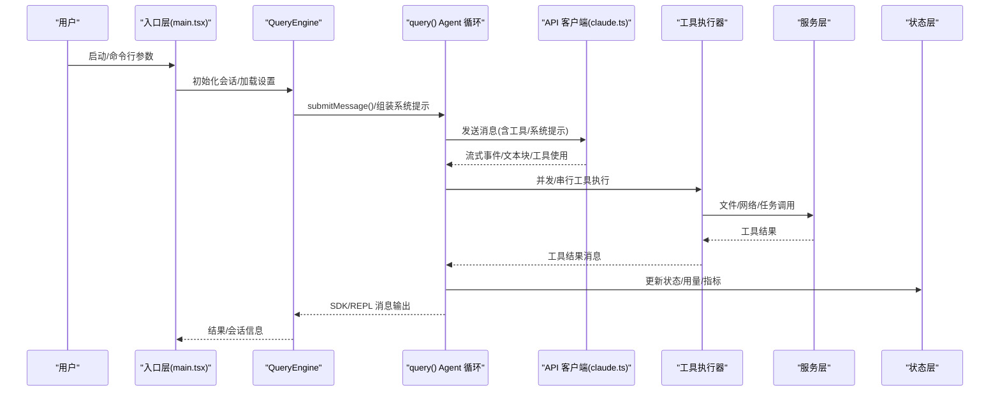
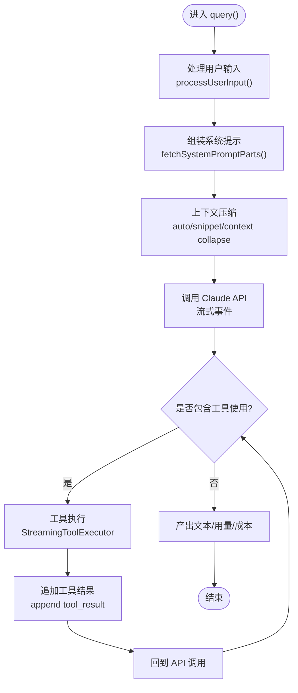
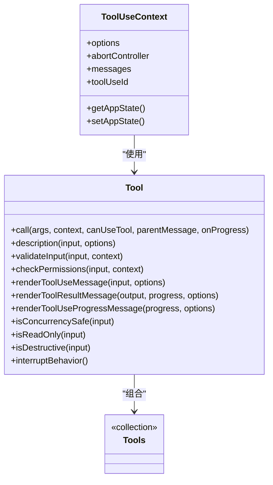
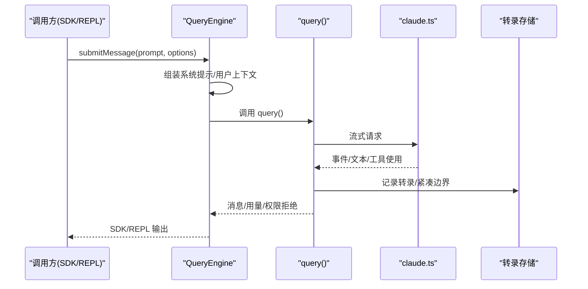
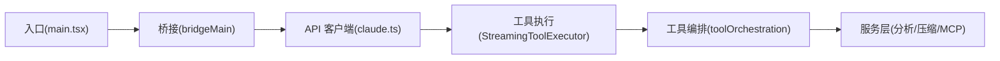
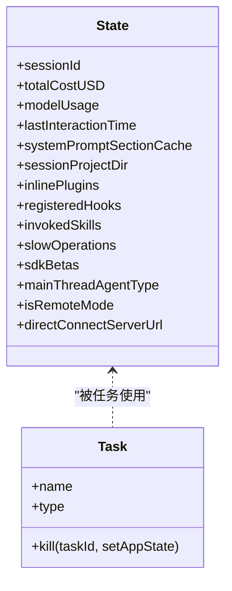
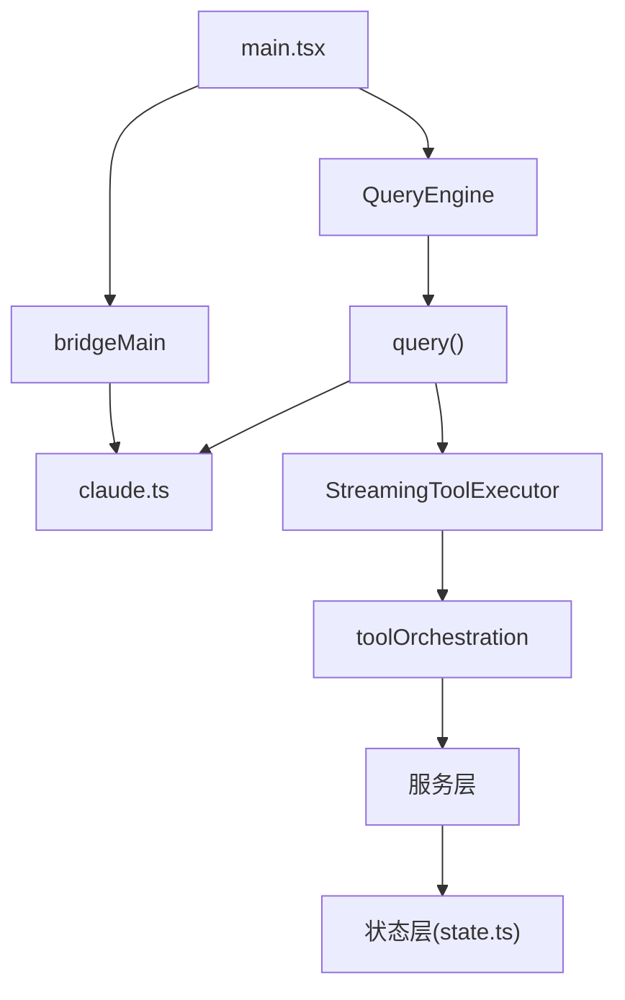

# 架构概览

<cite>
**本文档引用的文件**
- [README.md](file://README.md)
- [main.tsx](file://src/main.tsx)
- [QueryEngine.ts](file://src/QueryEngine.ts)
- [query.ts](file://src/query.ts)
- [Tool.ts](file://src/Tool.ts)
- [tools.ts](file://src/tools.ts)
- [StreamingToolExecutor.ts](file://src/services/tools/StreamingToolExecutor.ts)
- [toolOrchestration.ts](file://src/services/tools/toolOrchestration.ts)
- [claude.ts](file://src/services/api/claude.ts)
- [bridgeMain.ts](file://src/bridge/bridgeMain.ts)
- [state.ts](file://src/bootstrap/state.ts)
- [Task.ts](file://src/Task.ts)
</cite>

## 目录
1. [引言](#引言)
2. [项目结构](#项目结构)
3. [核心组件](#核心组件)
4. [架构总览](#架构总览)
5. [详细组件分析](#详细组件分析)
6. [依赖关系分析](#依赖关系分析)
7. [性能考量](#性能考量)
8. [故障排查指南](#故障排查指南)
9. [结论](#结论)
10. [附录](#附录)

## 引言
本文件面向 Claude Code 的架构概览，聚焦其分层架构：入口层（CLI/REPL/SDK）、查询引擎（Agent 循环）、工具/服务/状态层，并深入解释 Agent 循环模式、模块化设计与扩展机制、关键设计模式的应用，以及数据流与控制流。目标是帮助开发者快速理解系统结构与运行机制。

## 项目结构
项目采用“按职责分层”的组织方式：
- 入口层：CLI/REPL/SDK 入口，负责初始化、参数解析、会话管理与渲染
- 查询引擎：封装完整的 Agent 循环，包含系统提示组装、消息规范化、API 调用、工具执行与结果回传
- 工具层：内置工具集合与 MCP 工具扩展，统一的工具接口与权限校验
- 服务层：API 客户端、分析与遥测、上下文压缩、插件加载、MCP 协议等
- 状态层：全局状态管理与持久化
- 桥接层：与 Claude Desktop/远程环境的桥接通信

**图表来源**
- [main.tsx:585-800](file://src/main.tsx#L585-L800)
- [QueryEngine.ts:184-210](file://src/QueryEngine.ts#L184-L210)
- [query.ts:219-240](file://src/query.ts#L219-L240)
- [Tool.ts:362-473](file://src/Tool.ts#L362-L473)
- [claude.ts:709-780](file://src/services/api/claude.ts#L709-L780)
- [bridgeMain.ts:141-152](file://src/bridge/bridgeMain.ts#L141-L152)

**章节来源**
- [README.md:250-380](file://README.md#L250-L380)

## 核心组件
- 入口与初始化：负责命令行参数解析、信任对话、设置源过滤、延迟预取、入口点识别等
- QueryEngine：会话级生命周期管理，负责系统提示组装、用户输入处理、消息持久化、SDK/REPL 输出映射
- query：核心 Agent 循环，包含上下文压缩、工具执行、流式响应、错误恢复与重试
- 工具系统：统一的 Tool 接口、权限检查、并发安全、渲染与进度展示
- 服务层：API 客户端、上下文压缩、MCP 协议、分析与遥测
- 状态层：全局状态、指标统计、会话切换、持久化开关
- 桥接层：远程/桌面桥接、会话生命周期、心跳与令牌刷新

**章节来源**
- [main.tsx:585-800](file://src/main.tsx#L585-L800)
- [QueryEngine.ts:184-210](file://src/QueryEngine.ts#L184-L210)
- [query.ts:219-240](file://src/query.ts#L219-L240)
- [Tool.ts:362-473](file://src/Tool.ts#L362-L473)
- [claude.ts:709-780](file://src/services/api/claude.ts#L709-L780)
- [bridgeMain.ts:141-152](file://src/bridge/bridgeMain.ts#L141-L152)

## 架构总览
下图展示了从入口到查询引擎再到工具/服务/状态层的整体交互：

**图表来源**
- [main.tsx:585-800](file://src/main.tsx#L585-L800)
- [QueryEngine.ts:209-236](file://src/QueryEngine.ts#L209-L236)
- [query.ts:675-686](file://src/query.ts#L675-L686)
- [claude.ts:709-780](file://src/services/api/claude.ts#L709-L780)
- [StreamingToolExecutor.ts:40-62](file://src/services/tools/StreamingToolExecutor.ts#L40-L62)
- [toolOrchestration.ts:19-82](file://src/services/tools/toolOrchestration.ts#L19-L82)

## 详细组件分析

### Agent 循环模式（query）
- 输入处理：用户输入经 processUserInput 解析为消息数组，支持斜杠命令与附件
- 系统提示组装：fetchSystemPromptParts 组合工具描述、权限规则、CLAUDE.md 内容等
- 上下文压缩：自动压缩、快照压缩、上下文重构，确保窗口阈值内
- API 调用：prependUserContext + 系统提示 + 工具定义，流式接收事件
- 工具执行：StreamingToolExecutor 并发/串行调度；toolOrchestration 批次编排
- 结果回传：规范化消息、记录转录、SDK/REPL 输出、权限拒绝统计

**图表来源**
- [query.ts:219-240](file://src/query.ts#L219-L240)
- [query.ts:652-708](file://src/query.ts#L652-L708)
- [StreamingToolExecutor.ts:40-62](file://src/services/tools/StreamingToolExecutor.ts#L40-L62)
- [toolOrchestration.ts:19-82](file://src/services/tools/toolOrchestration.ts#L19-L82)

**章节来源**
- [query.ts:219-240](file://src/query.ts#L219-L240)
- [query.ts:652-708](file://src/query.ts#L652-L708)
- [StreamingToolExecutor.ts:40-62](file://src/services/tools/StreamingToolExecutor.ts#L40-L62)
- [toolOrchestration.ts:19-82](file://src/services/tools/toolOrchestration.ts#L19-L82)

### 工具系统与插件机制
- 工具接口：Tool 定义统一能力（validate/checkPermissions/call/render），并提供默认行为
- 工具注册：getAllBaseTools/assembleToolPool 统一装配内置与 MCP 工具，去重与排序稳定缓存键
- 权限体系：PreToolUse 钩子、规则匹配、交互式确认、路径沙箱与破坏性操作标记
- 并发与中断：isConcurrencySafe 控制并发/串行；interruptBehavior 控制用户打断时的行为
- 渲染与进度：工具输入/结果/进度的 UI 渲染与转录索引

**图表来源**
- [Tool.ts:362-473](file://src/Tool.ts#L362-L473)
- [Tool.ts:489-503](file://src/Tool.ts#L489-L503)
- [Tool.ts:605-667](file://src/Tool.ts#L605-L667)
- [tools.ts:193-251](file://src/tools.ts#L193-L251)

**章节来源**
- [Tool.ts:362-473](file://src/Tool.ts#L362-L473)
- [Tool.ts:489-503](file://src/Tool.ts#L489-L503)
- [Tool.ts:605-667](file://src/Tool.ts#L605-L667)
- [tools.ts:193-251](file://src/tools.ts#L193-L251)

### 查询引擎（QueryEngine）
- 生命周期：每个会话一个 QueryEngine 实例，submitMessage 开启一轮对话
- 系统提示：动态拼装默认/自定义/内存机制提示，支持附加片段
- 用户输入：processUserInput 处理斜杠命令、模型选择、工具允许列表
- SDK/REPL 映射：构建系统初始化消息、命令输出、紧凑边界、结果聚合
- 转录与持久化：recordTranscript/flushSessionStorage，支持 --bare 与协作场景

**图表来源**
- [QueryEngine.ts:209-236](file://src/QueryEngine.ts#L209-L236)
- [QueryEngine.ts:675-686](file://src/QueryEngine.ts#L675-L686)
- [claude.ts:752-780](file://src/services/api/claude.ts#L752-L780)

**章节来源**
- [QueryEngine.ts:184-210](file://src/QueryEngine.ts#L184-L210)
- [QueryEngine.ts:209-236](file://src/QueryEngine.ts#L209-L236)
- [QueryEngine.ts:675-686](file://src/QueryEngine.ts#L675-L686)

### 服务层与桥接层
- API 客户端：统一的 API 请求封装、重试策略、缓存控制、元数据注入、结构化输出
- 工具执行：StreamingToolExecutor 并发/串行调度、兄弟进程中断传播、进度即时产出
- 工具编排：toolOrchestration 分批执行（只读批量并发、非只读串行）
- 桥接层：bridgeMain 会话生命周期、心跳、令牌刷新、容量唤醒、多会话模式

**图表来源**
- [claude.ts:709-780](file://src/services/api/claude.ts#L709-L780)
- [StreamingToolExecutor.ts:40-62](file://src/services/tools/StreamingToolExecutor.ts#L40-L62)
- [toolOrchestration.ts:19-82](file://src/services/tools/toolOrchestration.ts#L19-L82)
- [bridgeMain.ts:141-152](file://src/bridge/bridgeMain.ts#L141-L152)

**章节来源**
- [claude.ts:709-780](file://src/services/api/claude.ts#L709-L780)
- [StreamingToolExecutor.ts:40-62](file://src/services/tools/StreamingToolExecutor.ts#L40-L62)
- [toolOrchestration.ts:19-82](file://src/services/tools/toolOrchestration.ts#L19-L82)
- [bridgeMain.ts:141-152](file://src/bridge/bridgeMain.ts#L141-L152)

### 状态层与持久化
- 全局状态：bootstrap/state 维护会话 ID、用量、指标、钩子、计划/技能缓存等
- 会话切换：switchSession/parentSessionId 管理会话链路
- 转录持久化：recordTranscript/flushSessionStorage，支持 --bare 与协作场景
- 任务系统：Task 类型与生命周期管理，支持本地/远程/进程内/工作树等模式

**图表来源**
- [state.ts:45-257](file://src/bootstrap/state.ts#L45-L257)
- [Task.ts:6-57](file://src/Task.ts#L6-L57)

**章节来源**
- [state.ts:45-257](file://src/bootstrap/state.ts#L45-L257)
- [Task.ts:6-57](file://src/Task.ts#L6-L57)

## 依赖关系分析
- 入口层依赖状态与工具注册，初始化后交由 QueryEngine 管理会话
- QueryEngine 依赖工具系统与服务层，驱动 query 循环
- query 依赖 API 客户端、工具执行器与上下文压缩服务
- 工具系统依赖权限规则与渲染组件
- 桥接层独立于主循环，但通过 API 客户端与远程会话交互

**图表来源**
- [main.tsx:585-800](file://src/main.tsx#L585-L800)
- [QueryEngine.ts:184-210](file://src/QueryEngine.ts#L184-L210)
- [query.ts:219-240](file://src/query.ts#L219-L240)
- [claude.ts:709-780](file://src/services/api/claude.ts#L709-L780)
- [StreamingToolExecutor.ts:40-62](file://src/services/tools/StreamingToolExecutor.ts#L40-L62)
- [toolOrchestration.ts:19-82](file://src/services/tools/toolOrchestration.ts#L19-L82)
- [state.ts:45-257](file://src/bootstrap/state.ts#L45-L257)
- [bridgeMain.ts:141-152](file://src/bridge/bridgeMain.ts#L141-L152)

**章节来源**
- [main.tsx:585-800](file://src/main.tsx#L585-L800)
- [QueryEngine.ts:184-210](file://src/QueryEngine.ts#L184-L210)
- [query.ts:219-240](file://src/query.ts#L219-L240)
- [claude.ts:709-780](file://src/services/api/claude.ts#L709-L780)
- [StreamingToolExecutor.ts:40-62](file://src/services/tools/StreamingToolExecutor.ts#L40-L62)
- [toolOrchestration.ts:19-82](file://src/services/tools/toolOrchestration.ts#L19-L82)
- [state.ts:45-257](file://src/bootstrap/state.ts#L45-L257)
- [bridgeMain.ts:141-152](file://src/bridge/bridgeMain.ts#L141-L152)

## 性能考量
- 上下文压缩：自动压缩、快照压缩、上下文重构，降低 token 使用与延迟
- 工具并发：只读工具批量并发，非只读串行，避免资源竞争
- 缓存与重试：API 层具备重试与缓存控制，减少无效请求
- 延迟预取：入口层对系统上下文与提示进行延迟预取，缩短首响应时间
- 会话持久化：按需写入与急刷策略，平衡可靠性与性能

[本节为通用指导，不直接分析具体文件]

## 故障排查指南
- 权限拒绝：QueryEngine 会收集权限拒绝列表，用于 SDK 报告
- 工具执行失败：StreamingToolExecutor 生成合成错误消息，兄弟 Bash 错误会级联取消
- API 错误：claude.ts 提供重试包装与错误分类，支持流式回退
- 桥接异常：bridgeMain 提供心跳、令牌刷新、容量唤醒与多会话模式，便于定位连接问题

**章节来源**
- [QueryEngine.ts:244-271](file://src/QueryEngine.ts#L244-L271)
- [StreamingToolExecutor.ts:153-205](file://src/services/tools/StreamingToolExecutor.ts#L153-L205)
- [claude.ts:256-257](file://src/services/api/claude.ts#L256-L257)
- [bridgeMain.ts:202-270](file://src/bridge/bridgeMain.ts#L202-L270)

## 结论
Claude Code 采用清晰的分层架构：入口层负责初始化与会话管理，查询引擎承载核心 Agent 循环，工具/服务/状态层提供可扩展的能力与基础设施。通过工具系统与 MCP 插件机制，系统实现了强大的功能扩展；通过上下文压缩、并发工具执行与缓存控制，兼顾性能与稳定性。桥接层进一步拓展了远程与桌面集成能力。整体设计强调可扩展性与可维护性，适合在生产环境中持续演进。

[本节为总结性内容，不直接分析具体文件]

## 附录
- 关键设计模式
  - 观察者模式：状态层与 UI 的订阅/发布（如 sessionSwitched）
  - 工厂模式：buildTool 统一创建工具实例与默认行为
  - 策略模式：不同模型/输出格式/缓存策略通过配置切换
  - 装饰器模式：工具渲染与进度 UI 的透明包装
- 特性门控：feature('FLAG') 在构建期裁剪代码，保证外部包体积可控

[本节为概念性内容，不直接分析具体文件]