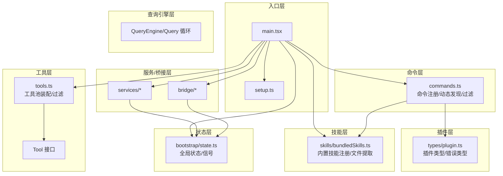
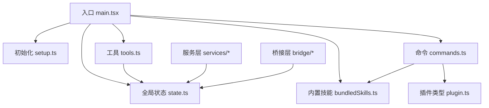
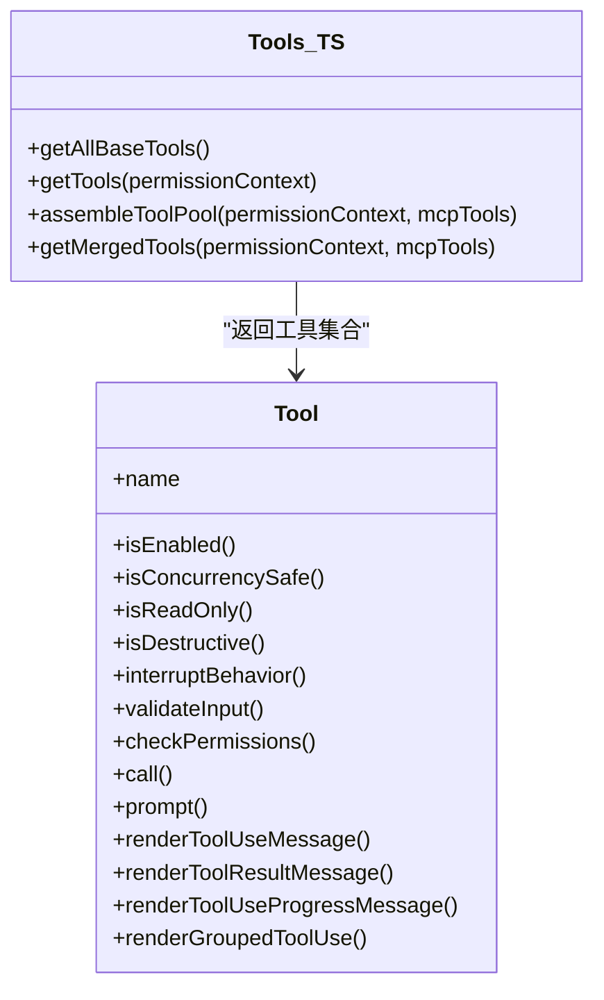
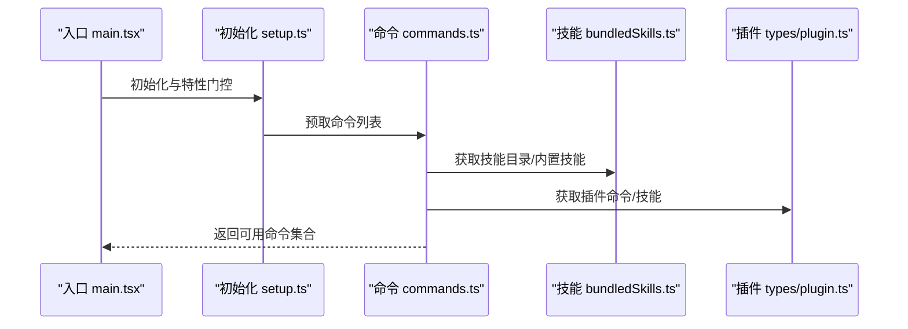
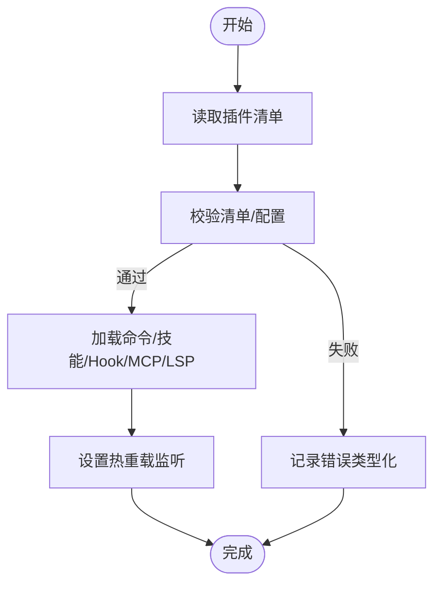
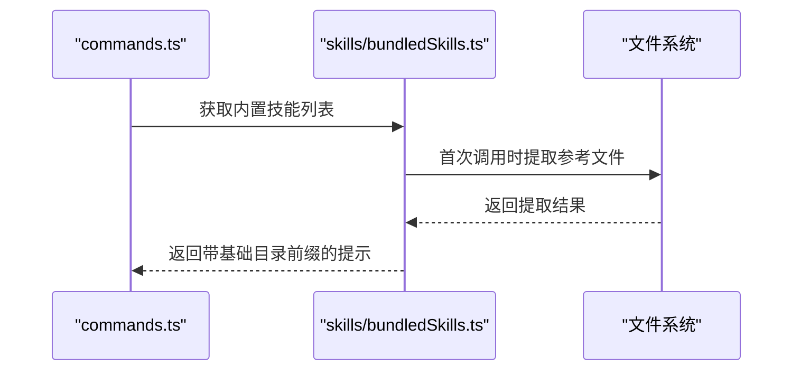
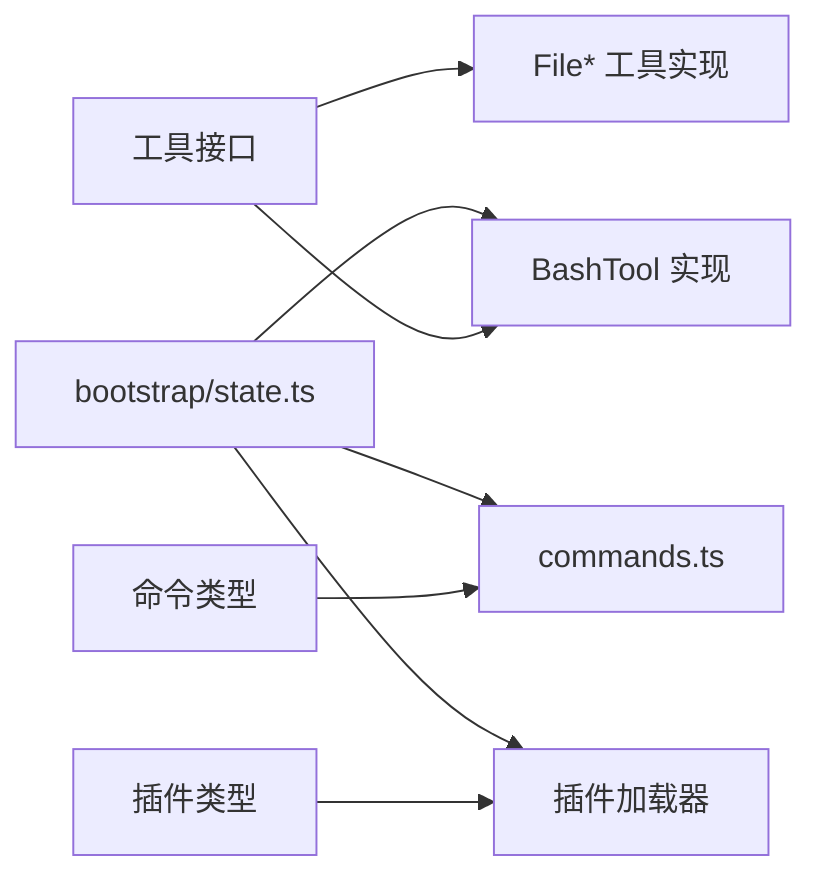
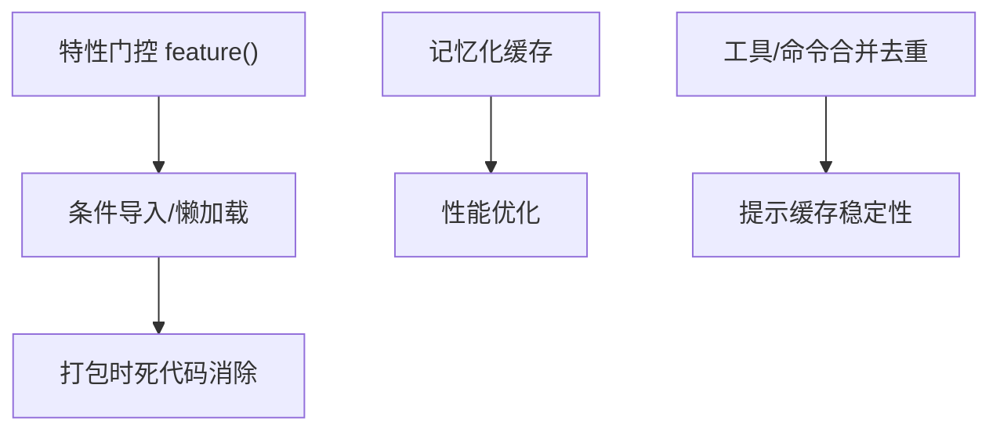

# 模块化设计原则

<cite>
**本文引用的文件**
- [README.md](file://README.md)
- [main.tsx](file://src/main.tsx)
- [setup.ts](file://src/setup.ts)
- [state.ts](file://src/bootstrap/state.ts)
- [commands.ts](file://src/commands.ts)
- [tools.ts](file://src/tools.ts)
- [plugin.ts](file://src/types/plugin.ts)
- [bundledSkills.ts](file://src/skills/bundledSkills.ts)
</cite>

## 目录
1. [引言](#引言)
2. [项目结构](#项目结构)
3. [核心组件](#核心组件)
4. [架构总览](#架构总览)
5. [详细组件分析](#详细组件分析)
6. [依赖关系分析](#依赖关系分析)
7. [性能考量](#性能考量)
8. [故障排查指南](#故障排查指南)
9. [结论](#结论)
10. [附录](#附录)

## 引言
本文件系统性阐述 Claude Code 的模块化设计原则与实现方式，围绕工具系统、命令系统、插件系统、技能系统的模块化组织进行深入分析，并总结模块间解耦机制（接口定义、依赖注入、事件驱动通信）、模块化带来的收益（功能可插拔、代码复用、测试隔离、团队协作），以及模块开发最佳实践与新模块创建流程。内容基于仓库源码进行提炼，配合可视化图表帮助读者快速理解。

## 项目结构
Claude Code 采用“按层+按功能域”的混合目录组织方式：
- 入口层：入口点负责初始化、参数解析、特性门控与模块装配
- 查询引擎层：统一的消息生命周期与主循环
- 工具层：内置工具与 MCP 工具的统一抽象与池化
- 命令层：命令注册、动态发现、可用性过滤
- 插件层：插件清单、加载、错误类型化
- 技能层：内置技能注册、磁盘文件提取、上下文注入
- 状态层：全局状态与信号机制
- 服务/桥接层：API 客户端、分析、MCP、远程桥接等

**图表来源**
- [main.tsx:585-800](file://src/main.tsx#L585-L800)
- [setup.ts:56-120](file://src/setup.ts#L56-L120)
- [commands.ts:258-346](file://src/commands.ts#L258-L346)
- [tools.ts:193-251](file://src/tools.ts#L193-L251)
- [bundledSkills.ts:43-108](file://src/skills/bundledSkills.ts#L43-L108)
- [state.ts:45-257](file://src/bootstrap/state.ts#L45-L257)
- [plugin.ts:48-70](file://src/types/plugin.ts#L48-L70)

**章节来源**
- [README.md:250-380](file://README.md#L250-L380)
- [main.tsx:1-120](file://src/main.tsx#L1-L120)
- [setup.ts:1-120](file://src/setup.ts#L1-L120)

## 核心组件
- 工具系统模块化
  - 统一接口与工厂：通过工具接口与构建器抽象所有工具能力；按特性门控与权限规则动态装配与过滤。
  - 工具池装配：在运行时合并内置工具与 MCP 工具，保持提示缓存稳定排序。
- 命令系统模块化
  - 动态注册与发现：内置命令、技能目录命令、插件命令、工作流命令统一汇聚；支持可用性与启用状态过滤。
  - 特性门控：通过编译期特性开关裁剪不相关模块，避免打包冗余。
- 插件系统模块化
  - 类型化配置与错误：以强类型描述插件清单、组件路径、MCP/LSP 配置；错误类型化便于 UI 展示与定位。
  - 加载与热重载：插件钩子预加载与热更新，支持会话级变更。
- 技能系统模块化
  - 内置技能注册：程序化注册内置技能，支持首次调用时的参考文件提取与基础目录前缀注入。
  - 技能目录与插件技能：动态扫描技能目录与插件技能，去重并插入到合适位置。

**章节来源**
- [tools.ts:193-390](file://src/tools.ts#L193-L390)
- [commands.ts:258-517](file://src/commands.ts#L258-L517)
- [plugin.ts:48-364](file://src/types/plugin.ts#L48-L364)
- [bundledSkills.ts:43-221](file://src/skills/bundledSkills.ts#L43-L221)

## 架构总览
下图展示从入口到查询引擎、工具与命令、插件与技能、状态与服务的整体交互关系。

**图表来源**
- [main.tsx:585-795](file://src/main.tsx#L585-L795)
- [setup.ts:287-324](file://src/setup.ts#L287-L324)
- [commands.ts:449-469](file://src/commands.ts#L449-L469)
- [tools.ts:345-389](file://src/tools.ts#L345-L389)
- [bundledSkills.ts:106-108](file://src/skills/bundledSkills.ts#L106-L108)
- [plugin.ts:48-70](file://src/types/plugin.ts#L48-L70)

## 详细组件分析

### 工具系统模块化设计
- 统一接口与能力标记
  - 工具接口定义生命周期、能力标记与渲染方法，确保不同工具具备一致的调用与展示契约。
- 动态装配与过滤
  - 按环境变量与特性门控选择性装配工具；根据权限上下文过滤黑名单工具；在 REPL 模式下隐藏原始工具以避免误用。
- 提示缓存稳定性
  - 合并内置与 MCP 工具时先排序再去重，保证内置工具作为连续前缀，避免破坏服务器侧系统提示缓存键。

**图表来源**
- [tools.ts:193-390](file://src/tools.ts#L193-L390)

**章节来源**
- [tools.ts:193-390](file://src/tools.ts#L193-L390)

### 命令系统模块化扩展
- 注册与聚合
  - 内置命令、技能目录命令、插件命令、工作流命令统一由命令聚合函数加载并去重。
- 可用性与启用过滤
  - 按订阅/提供商要求过滤命令；按启用状态过滤；动态技能在合适位置插入。
- 远程安全命令白名单
  - 仅允许本地无副作用或明确允许的命令通过桥接通道执行，保障移动端/网页端安全。

**图表来源**
- [main.tsx:585-795](file://src/main.tsx#L585-L795)
- [setup.ts:321-329](file://src/setup.ts#L321-L329)
- [commands.ts:449-469](file://src/commands.ts#L449-L469)
- [bundledSkills.ts:106-108](file://src/skills/bundledSkills.ts#L106-L108)
- [plugin.ts:48-70](file://src/types/plugin.ts#L48-L70)

**章节来源**
- [commands.ts:258-517](file://src/commands.ts#L258-L517)
- [commands.ts:619-686](file://src/commands.ts#L619-L686)

### 插件系统模块化加载
- 类型化配置
  - 插件清单、组件路径、MCP/LSP 配置均以强类型定义，降低运行时错误。
- 错误类型化
  - 使用联合类型表达多种加载失败场景，便于 UI 展示与用户指引。
- 加载与热重载
  - 插件钩子预加载与热更新，支持会话内策略变更即时生效。

**图表来源**
- [plugin.ts:101-289](file://src/types/plugin.ts#L101-L289)

**章节来源**
- [plugin.ts:48-364](file://src/types/plugin.ts#L48-L364)

### 技能系统模块化组织
- 内置技能注册
  - 程序化注册内置技能，支持首次调用时将参考文件写入磁盘，并在提示前注入基础目录，使模型可直接读取。
- 动态技能与去重
  - 技能目录与插件技能动态发现，去重后插入到内置命令之前，保证优先级与一致性。

**图表来源**
- [bundledSkills.ts:66-73](file://src/skills/bundledSkills.ts#L66-L73)
- [bundledSkills.ts:131-145](file://src/skills/bundledSkills.ts#L131-L145)
- [commands.ts:353-398](file://src/commands.ts#L353-L398)

**章节来源**
- [bundledSkills.ts:43-221](file://src/skills/bundledSkills.ts#L43-L221)
- [commands.ts:353-398](file://src/commands.ts#L353-L398)

### 模块间解耦机制
- 接口定义
  - 工具接口、命令类型、插件类型均为跨模块共享的契约，确保实现与消费方解耦。
- 依赖注入
  - 全局状态通过状态模块集中管理；命令/工具/服务通过状态模块暴露的 getter/setter 访问，避免直接耦合。
- 事件驱动通信
  - 会话切换、交互时间等使用信号机制触发回调，避免模块间直接调用造成环依赖。

**图表来源**
- [tools.ts:193-251](file://src/tools.ts#L193-L251)
- [commands.ts:258-346](file://src/commands.ts#L258-L346)
- [plugin.ts:48-70](file://src/types/plugin.ts#L48-L70)
- [state.ts:45-257](file://src/bootstrap/state.ts#L45-L257)

**章节来源**
- [state.ts:481-489](file://src/bootstrap/state.ts#L481-L489)

## 依赖关系分析
- 条件导入与死代码消除
  - 通过编译期特性开关裁剪不相关模块，减少包体积与启动开销。
- 懒加载与预取
  - 关键模块采用懒加载与预取策略，平衡首屏渲染与后续响应速度。
- 缓存与去重
  - 命令与技能列表采用记忆化缓存，避免重复 I/O；工具合并时去重并保持排序稳定。

**图表来源**
- [main.tsx:74-81](file://src/main.tsx#L74-L81)
- [commands.ts:449-469](file://src/commands.ts#L449-L469)
- [tools.ts:345-367](file://src/tools.ts#L345-L367)

**章节来源**
- [main.tsx:74-81](file://src/main.tsx#L74-L81)
- [commands.ts:449-469](file://src/commands.ts#L449-L469)
- [tools.ts:345-367](file://src/tools.ts#L345-L367)

## 性能考量
- 启动阶段优化
  - 并行预取与延迟任务，避免阻塞首屏渲染。
- 模块裁剪
  - 通过特性门控与死代码消除，仅保留当前构建所需的模块。
- 缓存与排序
  - 工具与命令列表排序与去重，减少提示缓存失效风险，提升模型侧缓存命中率。

[本节为通用指导，无需特定文件引用]

## 故障排查指南
- 插件加载错误
  - 使用类型化错误枚举定位具体问题（如清单解析、网络错误、MCP 配置无效等）。
- 命令/技能加载失败
  - 查看日志与调试输出，确认可用性过滤与启用状态；检查动态技能是否被正确去重与插入。
- 工具权限与黑名单
  - 检查权限上下文与拒绝规则，确认工具是否被正确过滤。

**章节来源**
- [plugin.ts:101-289](file://src/types/plugin.ts#L101-L289)
- [commands.ts:476-517](file://src/commands.ts#L476-L517)
- [tools.ts:262-269](file://src/tools.ts#L262-L269)

## 结论
Claude Code 的模块化设计通过统一接口、条件导入、懒加载与类型化错误，实现了高内聚、低耦合的系统架构。工具、命令、插件、技能四大模块既可独立演进，又能在运行时动态组合，满足功能可插拔、代码复用、测试隔离与团队协作的需求。建议在新增模块时遵循本文最佳实践，确保模块边界清晰、契约稳定、错误可诊断、性能可预期。

[本节为总结，无需特定文件引用]

## 附录

### 模块开发最佳实践
- 接口设计
  - 明确模块对外契约，尽量使用只读/不可变结构，避免隐式状态传播。
- 错误处理
  - 使用类型化错误，提供可操作的修复建议与上下文信息。
- 性能考虑
  - 采用懒加载与预取策略；对昂贵操作进行缓存与去重；注意提示缓存稳定性。
- 团队协作
  - 通过特性门控与条件导入隔离开发分支；保持模块间最小依赖；完善单元与集成测试。

[本节为通用指导，无需特定文件引用]

### 创建新模块流程（示例）
- 工具模块
  - 定义工具类并实现接口方法；在工具池装配函数中注册；按需添加特性门控与权限过滤。
- 命令模块
  - 定义命令对象并注册；在命令聚合函数中加入；按可用性与启用状态过滤。
- 插件模块
  - 定义插件清单与组件路径；实现加载逻辑与错误类型化；接入钩子与热重载。
- 技能模块
  - 注册技能定义；必要时实现首次调用的文件提取与提示前缀注入；动态发现与去重。

**章节来源**
- [tools.ts:193-390](file://src/tools.ts#L193-L390)
- [commands.ts:258-517](file://src/commands.ts#L258-L517)
- [plugin.ts:48-364](file://src/types/plugin.ts#L48-L364)
- [bundledSkills.ts:43-221](file://src/skills/bundledSkills.ts#L43-L221)