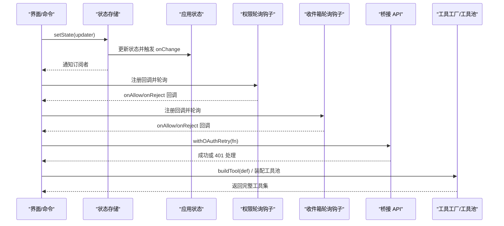
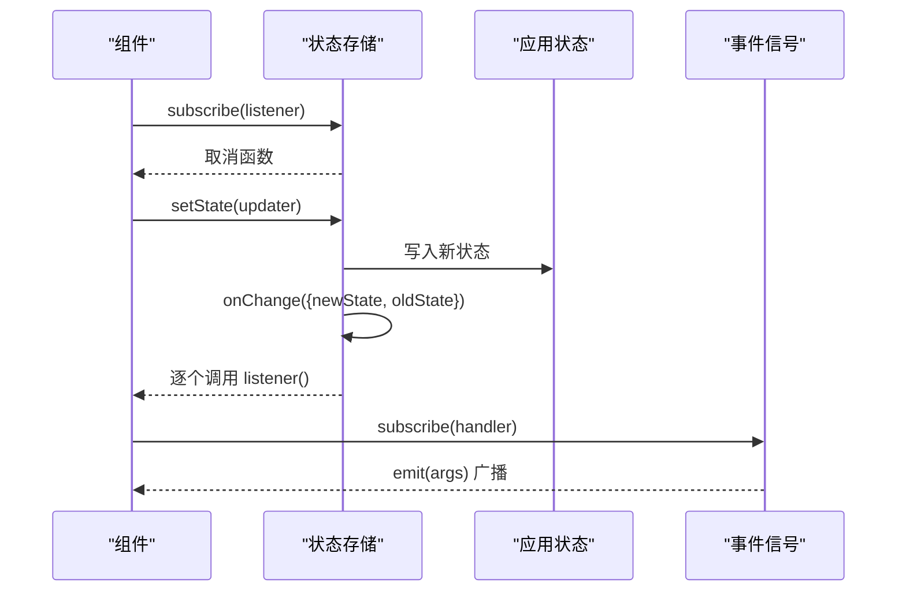
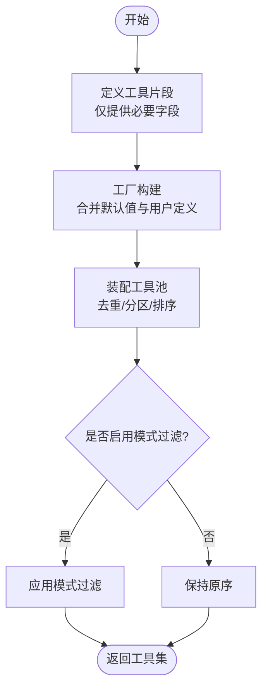
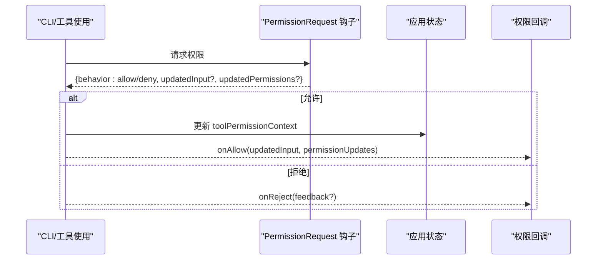
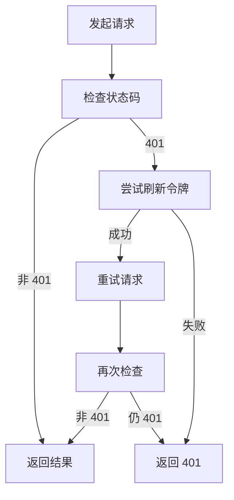
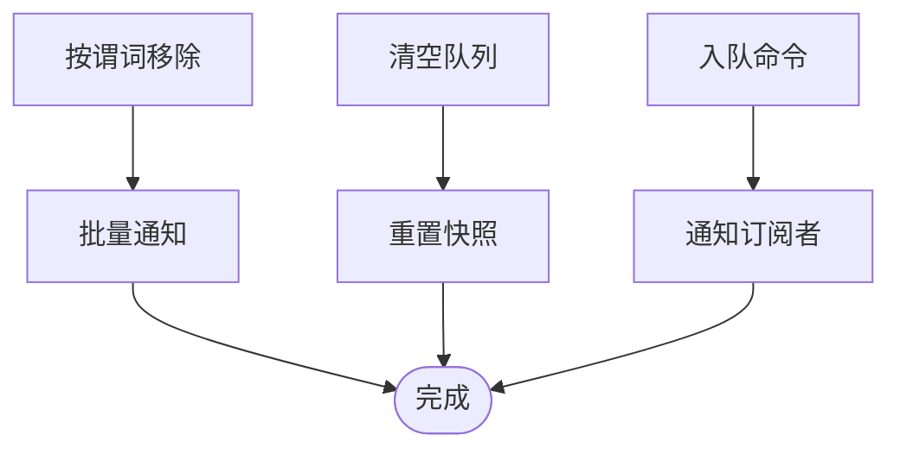
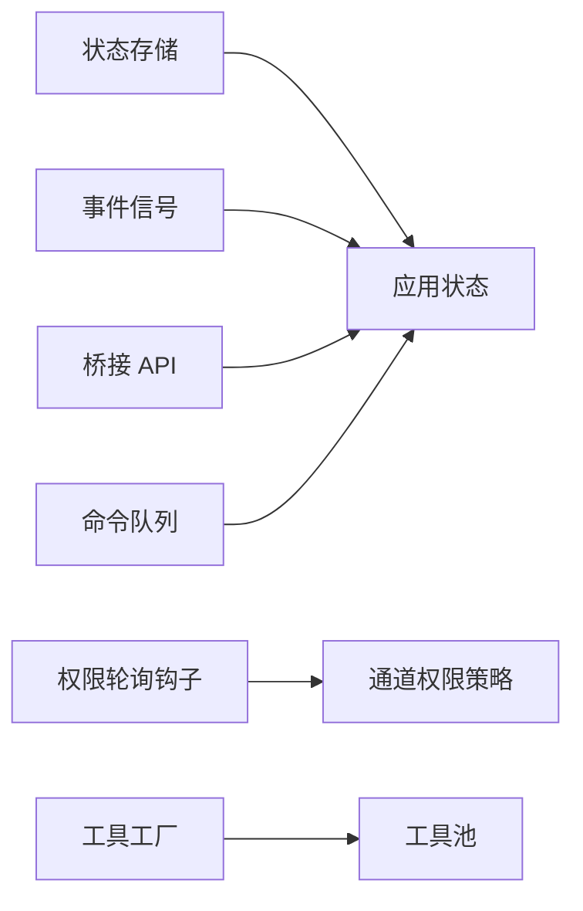

# 设计模式应用

<cite>
**本文引用的文件**
- [src/state/store.ts](file://src/state/store.ts)
- [src/utils/signal.ts](file://src/utils/signal.ts)
- [src/state/AppStateStore.ts](file://src/state/AppStateStore.ts)
- [src/hooks/useSwarmPermissionPoller.ts](file://src/hooks/useSwarmPermissionPoller.ts)
- [src/hooks/useInboxPoller.ts](file://src/hooks/useInboxPoller.ts)
- [src/cli/structuredIO.ts](file://src/cli/structuredIO.ts)
- [src/bridge/bridgeApi.ts](file://src/bridge/bridgeApi.ts)
- [src/utils/messageQueueManager.ts](file://src/utils/messageQueueManager.ts)
- [src/Tool.ts](file://src/Tool.ts)
- [src/utils/toolPool.ts](file://src/utils/toolPool.ts)
- [src/main.tsx](file://src/main.tsx)
- [src/hooks/useReplBridge.tsx](file://src/hooks/useReplBridge.tsx)
- [src/commands/permissions/permissions.tsx](file://src/commands/permissions/permissions.tsx)
- [src/services/mcp/channelPermissions.ts](file://src/services/mcp/channelPermissions.ts)
- [src/bridge/bridgePermissionCallbacks.ts](file://src/bridge/bridgePermissionCallbacks.ts)
</cite>

## 目录
1. [引言](#引言)
2. [项目结构](#项目结构)
3. [核心组件](#核心组件)
4. [架构总览](#架构总览)
5. [详细组件分析](#详细组件分析)
6. [依赖分析](#依赖分析)
7. [性能考量](#性能考量)
8. [故障排查指南](#故障排查指南)
9. [结论](#结论)
10. [附录](#附录)

## 引言
本文件聚焦于 Claude Code 在状态管理、事件处理、工具创建、权限检查、桥接通信与命令执行等关键领域的设计模式应用，系统梳理并解析以下模式在代码库中的落地方式与权衡取舍：
- 观察者模式：用于状态变更通知与事件广播（状态存储、信号、订阅回调）
- 工厂模式：用于工具构建与工具池装配（统一入口、默认填充、排序与过滤）
- 策略模式：用于权限检查与策略选择（钩子策略、通道策略、桥接策略）
- 适配器模式：用于第三方集成与 API 适配（桥接 API 重试与鉴权、消息队列适配）
- 命令模式：用于命令执行、撤销与重做（命令队列、可撤销操作、状态快照）

## 项目结构
本项目采用“按功能域分层 + 组件化”的组织方式，核心状态与事件处理集中在 state 与 utils 子目录；权限与桥接能力分布在 hooks、services、bridge 等模块；工具体系由 Tool.ts 与工具池工具共同构成；命令执行与撤销重做由消息队列管理器负责。

```mermaid
graph TB
subgraph "状态与事件"
Store["状态存储<br/>src/state/store.ts"]
Signal["事件信号<br/>src/utils/signal.ts"]
AppState["应用状态模型<br/>src/state/AppStateStore.ts"]
end
subgraph "权限与桥接"
HookPoller["权限轮询钩子<br/>src/hooks/useSwarmPermissionPoller.ts"]
InboxPoller["收件箱轮询钩子<br/>src/hooks/useInboxPoller.ts"]
BridgeAPI["桥接 API 适配<br/>src/bridge/bridgeApi.ts"]
ChannelPerm["通道权限策略接口<br/>src/services/mcp/channelPermissions.ts"]
BridgeCB["桥接权限回调接口<br/>src/bridge/bridgePermissionCallbacks.ts"]
end
subgraph "工具与命令"
ToolFactory["工具工厂<br/>src/Tool.ts"]
ToolPool["工具池装配<br/>src/utils/toolPool.ts"]
MsgQueue["命令队列与撤销<br/>src/utils/messageQueueManager.ts"]
end
subgraph "入口与交互"
Main["主入口与通知构建<br/>src/main.tsx"]
ReplBridge["REPL 桥接回调<br/>src/hooks/useReplBridge.tsx"]
CmdPerm["权限命令入口<br/>src/commands/permissions/permissions.tsx"]
end
Store --> AppState
Signal --> AppState
HookPoller --> ChannelPerm
InboxPoller --> BridgeCB
BridgeAPI --> AppState
ToolFactory --> ToolPool
MsgQueue --> AppState
Main --> AppState
ReplBridge --> AppState
CmdPerm --> AppState
```

图表来源
- [src/state/store.ts:1-34](file://src/state/store.ts#L1-L34)
- [src/utils/signal.ts:17-43](file://src/utils/signal.ts#L17-L43)
- [src/state/AppStateStore.ts:89-452](file://src/state/AppStateStore.ts#L89-L452)
- [src/hooks/useSwarmPermissionPoller.ts:268-298](file://src/hooks/useSwarmPermissionPoller.ts#L268-L298)
- [src/hooks/useInboxPoller.ts:296-337](file://src/hooks/useInboxPoller.ts#L296-L337)
- [src/bridge/bridgeApi.ts:105-139](file://src/bridge/bridgeApi.ts#L105-L139)
- [src/services/mcp/channelPermissions.ts:1-50](file://src/services/mcp/channelPermissions.ts#L1-L50)
- [src/bridge/bridgePermissionCallbacks.ts:1-50](file://src/bridge/bridgePermissionCallbacks.ts#L1-L50)
- [src/Tool.ts:783-792](file://src/Tool.ts#L783-L792)
- [src/utils/toolPool.ts:62-79](file://src/utils/toolPool.ts#L62-L79)
- [src/utils/messageQueueManager.ts:282-342](file://src/utils/messageQueueManager.ts#L282-L342)
- [src/main.tsx:2870-2905](file://src/main.tsx#L2870-L2905)
- [src/hooks/useReplBridge.tsx:397-425](file://src/hooks/useReplBridge.tsx#L397-L425)
- [src/commands/permissions/permissions.tsx:1-9](file://src/commands/permissions/permissions.tsx#L1-L9)

章节来源
- [src/state/store.ts:1-34](file://src/state/store.ts#L1-L34)
- [src/utils/signal.ts:17-43](file://src/utils/signal.ts#L17-L43)
- [src/state/AppStateStore.ts:89-452](file://src/state/AppStateStore.ts#L89-L452)

## 核心组件
- 状态存储与事件信号
  - 状态存储：提供 getState、setState、subscribe 的最小实现，支持 onChange 回调与批量通知。
  - 事件信号：提供 subscribe、emit、clear 的轻量事件机制，适合仅需“发生了什么”的场景。
- 应用状态模型
  - 定义了丰富的 AppState 字段，涵盖设置、任务、插件、MCP、权限上下文、通知、推测状态等，作为全局状态中心。
- 权限轮询与桥接
  - 钩子轮询与收件箱轮询分别处理跨进程与网络通道的权限响应；桥接 API 提供统一的鉴权与重试封装。
- 工具工厂与工具池
  - 工具工厂通过默认值填充与类型级合并，确保工具定义的最小化；工具池负责装配、去重、排序与模式过滤。
- 命令队列与撤销
  - 命令队列支持入队、移除、清空、快照与订阅通知，为撤销/重做提供基础。

章节来源
- [src/state/store.ts:10-34](file://src/state/store.ts#L10-L34)
- [src/utils/signal.ts:17-43](file://src/utils/signal.ts#L17-L43)
- [src/state/AppStateStore.ts:456-570](file://src/state/AppStateStore.ts#L456-L570)
- [src/hooks/useSwarmPermissionPoller.ts:247-298](file://src/hooks/useSwarmPermissionPoller.ts#L247-L298)
- [src/hooks/useInboxPoller.ts:296-337](file://src/hooks/useInboxPoller.ts#L296-L337)
- [src/bridge/bridgeApi.ts:105-139](file://src/bridge/bridgeApi.ts#L105-L139)
- [src/Tool.ts:783-792](file://src/Tool.ts#L783-L792)
- [src/utils/toolPool.ts:62-79](file://src/utils/toolPool.ts#L62-L79)
- [src/utils/messageQueueManager.ts:282-342](file://src/utils/messageQueueManager.ts#L282-L342)

## 架构总览
下图展示了状态、事件、权限、桥接与工具链路之间的交互关系，体现观察者、策略与适配器的协同：

图表来源
- [src/state/store.ts:18-32](file://src/state/store.ts#L18-L32)
- [src/hooks/useSwarmPermissionPoller.ts:268-298](file://src/hooks/useSwarmPermissionPoller.ts#L268-L298)
- [src/hooks/useInboxPoller.ts:296-337](file://src/hooks/useInboxPoller.ts#L296-L337)
- [src/bridge/bridgeApi.ts:105-139](file://src/bridge/bridgeApi.ts#L105-L139)
- [src/Tool.ts:783-792](file://src/Tool.ts#L783-L792)

## 详细组件分析

### 观察者模式：状态管理与事件处理
- 实现要点
  - 状态存储：提供订阅集合与批量通知，onChange 回调在状态更新后触发，避免重复渲染。
  - 事件信号：仅传递事件参数，不保存状态快照，降低样板代码与内存占用。
  - 应用状态模型：集中承载多源状态，作为观察者的目标对象，UI 与服务通过订阅获取变化。
- 典型流程
  - 订阅：组件通过 subscribe 获取取消函数，避免泄漏。
  - 发布：setState 执行后遍历监听者，触发回调。
  - 事件广播：信号 emit 广播给所有订阅者，常用于非状态驱动的通知。
- 性能与可维护性
  - 使用 Set 维护订阅者，O(1) 添加/删除；批量通知减少多次遍历开销。
  - 将“状态变更”与“事件广播”解耦，便于扩展与测试。

图表来源
- [src/state/store.ts:18-32](file://src/state/store.ts#L18-L32)
- [src/utils/signal.ts:27-43](file://src/utils/signal.ts#L27-L43)

章节来源
- [src/state/store.ts:10-34](file://src/state/store.ts#L10-L34)
- [src/utils/signal.ts:17-43](file://src/utils/signal.ts#L17-L43)
- [src/state/AppStateStore.ts:89-452](file://src/state/AppStateStore.ts#L89-L452)

### 工厂模式：工具创建与组件实例化
- 实现要点
  - 工具工厂：通过 buildTool 合并默认值与用户定义，保证工具接口完整性与一致性。
  - 工具池装配：对内置与 MCP 工具进行去重、分区与排序，结合模式过滤，输出稳定序列。
- 典型流程
  - 定义工具：仅提供必要字段，其余由工厂填充默认行为。
  - 装配工具池：根据特性开关与模式状态，动态筛选与排序工具集合。
- 性能与可维护性
  - 类型级合并确保签名正确性，避免运行时错误。
  - 分区排序提升提示缓存命中率与稳定性。

图表来源
- [src/Tool.ts:783-792](file://src/Tool.ts#L783-L792)
- [src/utils/toolPool.ts:62-79](file://src/utils/toolPool.ts#L62-L79)

章节来源
- [src/Tool.ts:706-792](file://src/Tool.ts#L706-L792)
- [src/utils/toolPool.ts:62-79](file://src/utils/toolPool.ts#L62-L79)

### 策略模式：权限检查与模型选择
- 实现要点
  - 钩子策略：CLI 层通过 PermissionRequest 钩子决定允许/拒绝，并可注入权限更新与输入修正。
  - 通道策略：ChannelPermissionCallbacks 抽象不同通道（如 Telegram/iMessage）的权限交互。
  - 模型选择：主循环模型与会话模型在入口处解析并注入通知队列，体现“策略”式配置。
- 典型流程
  - 权限请求：钩子返回 allow/deny 或 undefined，允许时应用权限更新并回写状态。
  - 通道决策：通过回调 onAllow/onReject 解耦不同通道的交互细节。
  - 模型策略：入口处计算初始模型与弃用警告，形成初始通知队列。
- 性能与可维护性
  - 策略解耦提升可测试性与可替换性；策略内部的幂等与去重逻辑避免重复处理。

图表来源
- [src/cli/structuredIO.ts:811-859](file://src/cli/structuredIO.ts#L811-L859)
- [src/services/mcp/channelPermissions.ts:1-50](file://src/services/mcp/channelPermissions.ts#L1-L50)
- [src/main.tsx:2870-2905](file://src/main.tsx#L2870-L2905)

章节来源
- [src/cli/structuredIO.ts:811-859](file://src/cli/structuredIO.ts#L811-L859)
- [src/services/mcp/channelPermissions.ts:1-50](file://src/services/mcp/channelPermissions.ts#L1-L50)
- [src/main.tsx:2870-2905](file://src/main.tsx#L2870-L2905)

### 适配器模式：第三方集成与 API 适配
- 实现要点
  - 桥接 API 适配：withOAuthRetry 封装 401 自动刷新与重试，屏蔽外部服务差异。
  - 消息队列适配：命令队列管理器抽象入队、移除、清空与快照，统一撤销/重做语义。
- 典型流程
  - 请求发起：携带访问令牌调用目标接口。
  - 错误处理：遇到 401 时尝试刷新令牌并重试，失败则透传错误。
  - 队列操作：统一通知订阅者，记录日志与操作历史。
- 性能与可维护性
  - 适配器集中处理异常路径，降低上层复杂度；队列操作批量化减少通知次数。

图表来源
- [src/bridge/bridgeApi.ts:105-139](file://src/bridge/bridgeApi.ts#L105-L139)
- [src/utils/messageQueueManager.ts:282-342](file://src/utils/messageQueueManager.ts#L282-L342)

章节来源
- [src/bridge/bridgeApi.ts:105-139](file://src/bridge/bridgeApi.ts#L105-L139)
- [src/utils/messageQueueManager.ts:282-342](file://src/utils/messageQueueManager.ts#L282-L342)

### 命令模式：命令执行、撤销与重做
- 实现要点
  - 命令队列：支持入队、按条件移除、清空与重置快照；每次变更通知订阅者。
  - 撤销/重做：通过快照与操作日志记录，配合 UI 与状态切换实现。
- 典型流程
  - 入队：新增命令后通知订阅者。
  - 移除：按谓词从尾到头扫描移除，批量通知并记录日志。
  - 清空：ESC 取消时丢弃队列，重置快照。
- 性能与可维护性
  - 逆序扫描与批量通知减少多次遍历；快照冻结避免意外修改。

图表来源
- [src/utils/messageQueueManager.ts:282-342](file://src/utils/messageQueueManager.ts#L282-L342)

章节来源
- [src/utils/messageQueueManager.ts:282-342](file://src/utils/messageQueueManager.ts#L282-L342)

## 依赖分析
- 组件耦合与内聚
  - 状态存储与应用状态模型高内聚，围绕单一职责（状态读写与变更通知）。
  - 事件信号与状态存储低耦合，通过订阅接口解耦发布与消费。
  - 权限轮询与桥接 API 通过回调接口解耦不同通道与环境。
  - 工具工厂与工具池通过类型约束与默认值实现强内聚弱耦合。
- 外部依赖与集成点
  - 桥接 API 依赖外部服务的鉴权与超时策略，通过适配器屏蔽差异。
  - CLI 钩子与状态更新通过 setAppState 的不可变更新策略保持一致性。

图表来源
- [src/state/store.ts:18-32](file://src/state/store.ts#L18-L32)
- [src/utils/signal.ts:27-43](file://src/utils/signal.ts#L27-L43)
- [src/hooks/useSwarmPermissionPoller.ts:247-298](file://src/hooks/useSwarmPermissionPoller.ts#L247-L298)
- [src/services/mcp/channelPermissions.ts:1-50](file://src/services/mcp/channelPermissions.ts#L1-L50)
- [src/bridge/bridgeApi.ts:105-139](file://src/bridge/bridgeApi.ts#L105-L139)
- [src/Tool.ts:783-792](file://src/Tool.ts#L783-L792)
- [src/utils/toolPool.ts:62-79](file://src/utils/toolPool.ts#L62-L79)
- [src/utils/messageQueueManager.ts:282-342](file://src/utils/messageQueueManager.ts#L282-L342)

## 性能考量
- 观察者与事件
  - 使用 Set 管理订阅者，O(1) 添加/删除；批量通知减少遍历次数。
  - 事件信号避免状态快照，降低内存与序列化成本。
- 工具工厂与池
  - 类型级合并与默认值填充在编译期完成，运行时开销极小。
  - 工具池的分区排序提升提示缓存命中率，减少重复加载。
- 权限与桥接
  - 钩子策略与回调解耦，避免在热路径中引入分支判断。
  - 桥接 API 的重试与刷新集中在适配器，减少上层分支。
- 命令队列
  - 逆序扫描与批量通知减少多次遍历；快照冻结避免深拷贝。

## 故障排查指南
- 权限相关
  - 钩子返回 allow/deny 未生效：检查钩子返回值与 updatedPermissions 是否正确写入状态。
  - 通道权限未触发回调：确认回调注册与轮询钩子是否处于激活状态。
- 桥接 API
  - 401 未自动刷新：检查 onAuth401 回调是否可用，刷新后是否成功。
- 命令队列
  - 队列未更新 UI：确认 notifySubscribers 是否被调用，是否存在批量通知被吞没。
- 状态订阅
  - 订阅未触发：确认订阅者是否在正确生命周期内注册，是否被提前取消。

章节来源
- [src/cli/structuredIO.ts:811-859](file://src/cli/structuredIO.ts#L811-L859)
- [src/hooks/useSwarmPermissionPoller.ts:247-298](file://src/hooks/useSwarmPermissionPoller.ts#L247-L298)
- [src/bridge/bridgeApi.ts:105-139](file://src/bridge/bridgeApi.ts#L105-L139)
- [src/utils/messageQueueManager.ts:282-342](file://src/utils/messageQueueManager.ts#L282-L342)

## 结论
本项目在多个关键领域系统性地运用了观察者、工厂、策略、适配器与命令模式：
- 观察者模式保障了状态与事件的高效传播；
- 工厂模式简化了工具定义与装配；
- 策略模式提升了权限与模型选择的灵活性；
- 适配器模式隔离了第三方差异与异常路径；
- 命令模式为撤销/重做提供了稳健的基础设施。

这些模式的组合使用显著提升了系统的可维护性、扩展性与可测试性，同时在性能上通过批量通知、类型级优化与快照冻结等手段实现了平衡。

## 附录
- 最佳实践建议
  - 将“状态变更”与“事件广播”分离，优先使用事件信号处理非状态驱动的通知。
  - 工具定义尽量最小化，通过工厂默认值补齐；工具池装配遵循稳定排序与去重原则。
  - 权限策略以钩子与回调为中心，避免在业务逻辑中分散策略判断。
  - 桥接与外部服务通过适配器统一封装异常与重试，保持上层简洁。
  - 命令队列与撤销/重做结合快照与日志，确保可观测与可恢复。