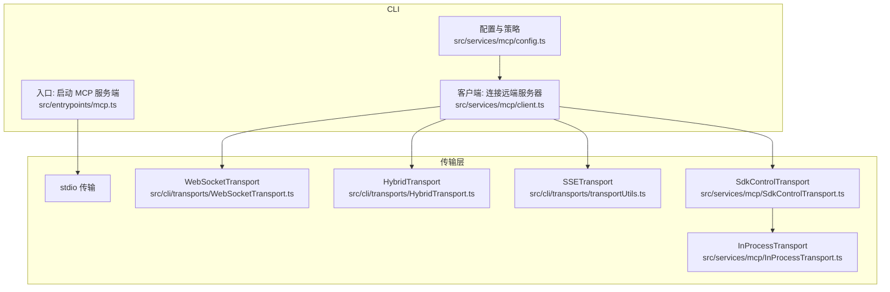
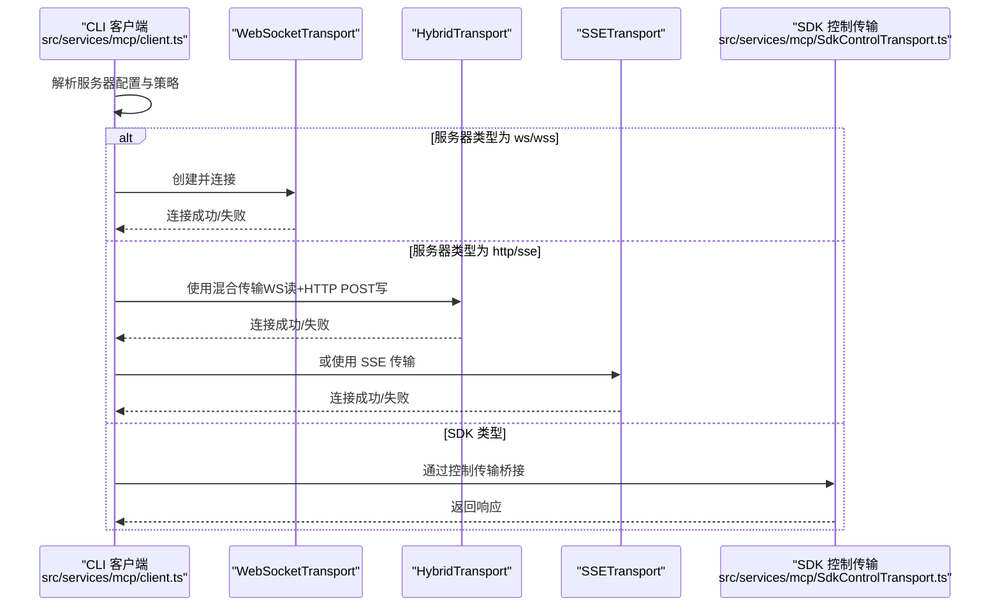
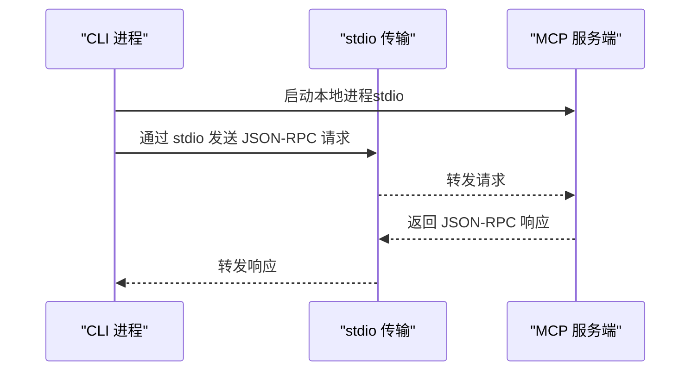
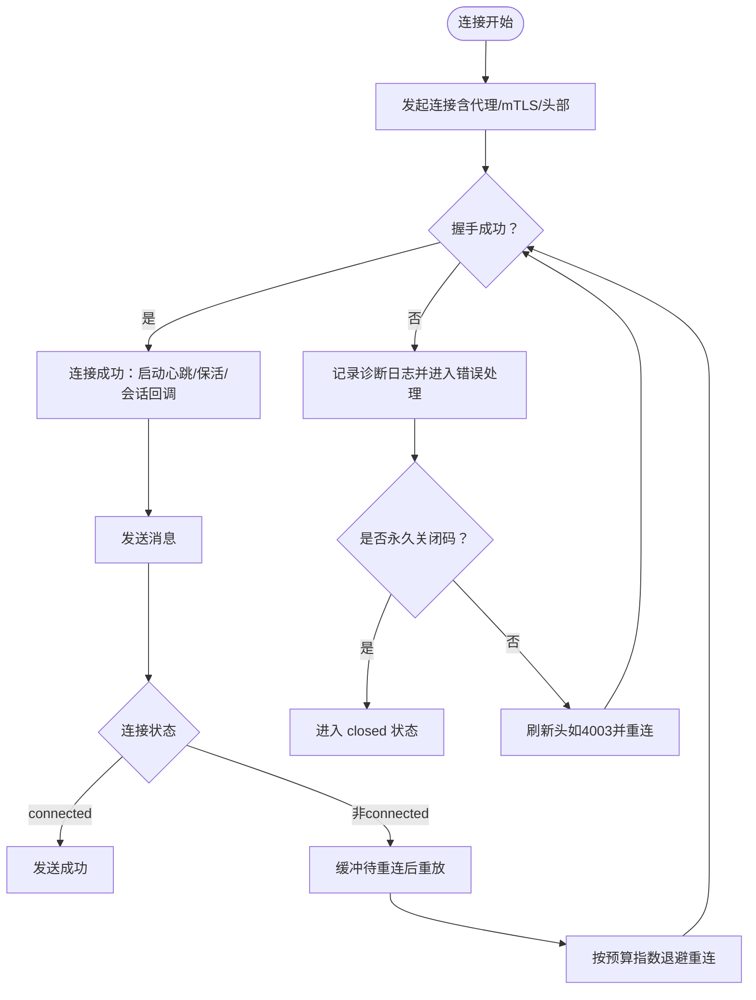
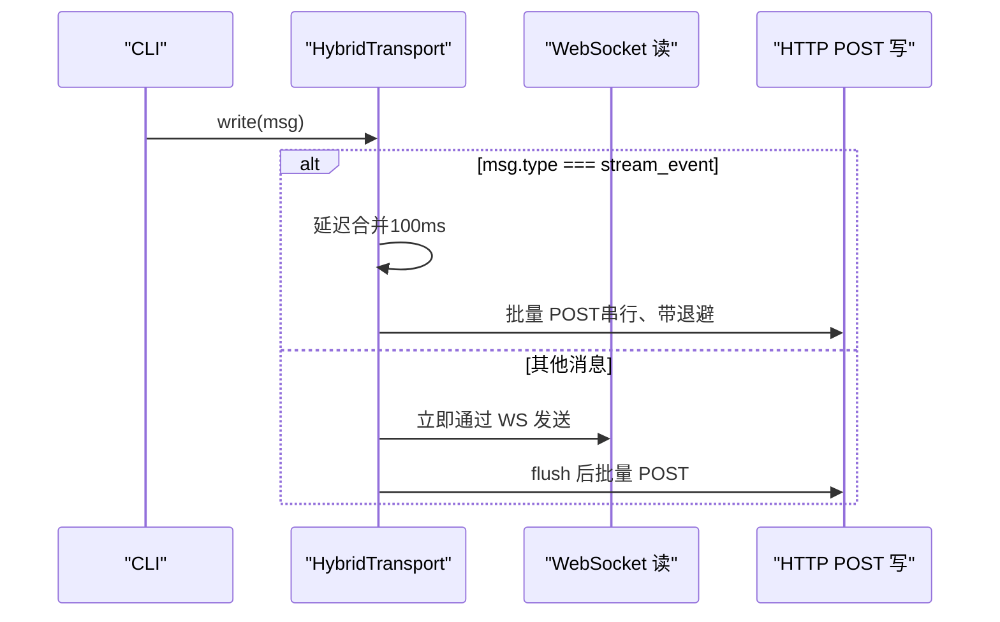
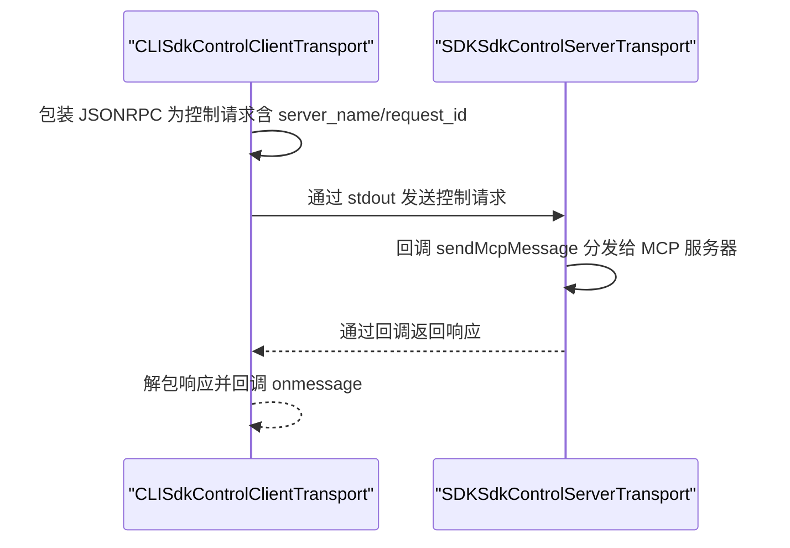
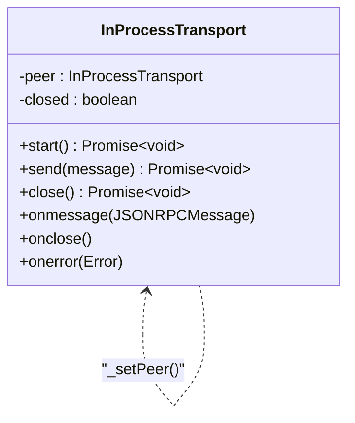
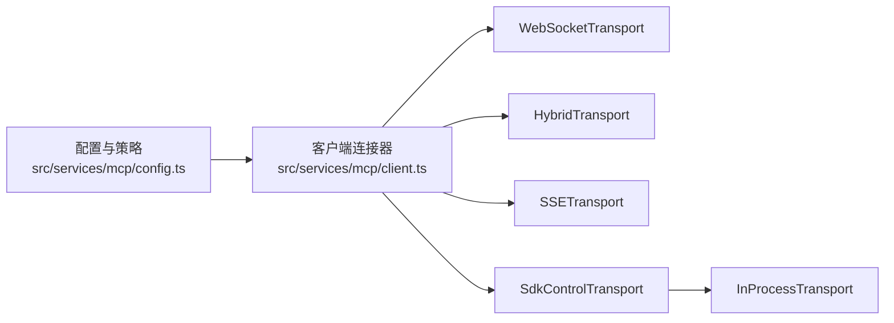

# MCP 传输协议

<cite>
**本文引用的文件**
- [src/entrypoints/mcp.ts](file://src/entrypoints/mcp.ts)
- [src/services/mcp/SdkControlTransport.ts](file://src/services/mcp/SdkControlTransport.ts)
- [src/services/mcp/InProcessTransport.ts](file://src/services/mcp/InProcessTransport.ts)
- [src/services/mcp/client.ts](file://src/services/mcp/client.ts)
- [src/services/mcp/config.ts](file://src/services/mcp/config.ts)
- [src/cli/transports/WebSocketTransport.ts](file://src/cli/transports/WebSocketTransport.ts)
- [src/cli/transports/HybridTransport.ts](file://src/cli/transports/HybridTransport.ts)
- [src/cli/transports/transportUtils.ts](file://src/cli/transports/transportUtils.ts)
- [src/commands/mcp/index.ts](file://src/commands/mcp/index.ts)
</cite>

## 目录
1. [引言](#引言)
2. [项目结构](#项目结构)
3. [核心组件](#核心组件)
4. [架构总览](#架构总览)
5. [详细组件分析](#详细组件分析)
6. [依赖关系分析](#依赖关系分析)
7. [性能考量](#性能考量)
8. [故障排除指南](#故障排除指南)
9. [结论](#结论)
10. [附录](#附录)

## 引言
本文件系统性梳理并解释 MCP（Model Context Protocol）在本仓库中的传输层实现与使用方式，覆盖以下传输类型：
- stdio 传输：本地进程内通信，常用于 CLI 子进程或嵌入式场景
- HTTP 传输：基于可流式的 HTTP（Streamable HTTP）与 SSE 的客户端实现
- WebSocket 传输：标准 WebSocket 客户端与服务端桥接
- SDK 控制传输：在 SDK 进程中运行的 MCP 服务器与 CLI 之间的桥接通道

文档将从架构、数据流、序列化/反序列化、消息格式、协议版本兼容性、配置与连接参数、错误处理、安全与认证、性能优化与故障排除等方面进行深入说明，并给出传输协议选择指南。

## 项目结构
围绕 MCP 传输的关键模块分布如下：
- 入口与服务端：CLI 端启动 MCP 服务端（stdio），以及客户端对远端服务器的连接与管理
- 传输实现：WebSocket、SSE、HTTP（通过 Streamable HTTP）、混合传输（WS 读 + HTTP POST 写）
- SDK 桥接：SDK 进程内 MCP 服务器与 CLI 的双向桥接
- 配置与策略：MCP 服务器配置、企业策略、环境变量扩展与去重

图表来源
- [src/entrypoints/mcp.ts:35-196](file://src/entrypoints/mcp.ts#L35-L196)
- [src/services/mcp/client.ts:595-820](file://src/services/mcp/client.ts#L595-L820)
- [src/services/mcp/config.ts:536-551](file://src/services/mcp/config.ts#L536-L551)
- [src/cli/transports/WebSocketTransport.ts:74-800](file://src/cli/transports/WebSocketTransport.ts#L74-L800)
- [src/cli/transports/HybridTransport.ts:54-283](file://src/cli/transports/HybridTransport.ts#L54-L283)
- [src/cli/transports/transportUtils.ts:16-45](file://src/cli/transports/transportUtils.ts#L16-L45)
- [src/services/mcp/SdkControlTransport.ts:60-137](file://src/services/mcp/SdkControlTransport.ts#L60-L137)
- [src/services/mcp/InProcessTransport.ts:11-64](file://src/services/mcp/InProcessTransport.ts#L11-L64)

章节来源
- [src/entrypoints/mcp.ts:35-196](file://src/entrypoints/mcp.ts#L35-L196)
- [src/services/mcp/client.ts:595-820](file://src/services/mcp/client.ts#L595-L820)
- [src/services/mcp/config.ts:536-551](file://src/services/mcp/config.ts#L536-L551)
- [src/cli/transports/WebSocketTransport.ts:74-800](file://src/cli/transports/WebSocketTransport.ts#L74-L800)
- [src/cli/transports/HybridTransport.ts:54-283](file://src/cli/transports/HybridTransport.ts#L54-L283)
- [src/cli/transports/transportUtils.ts:16-45](file://src/cli/transports/transportUtils.ts#L16-L45)
- [src/services/mcp/SdkControlTransport.ts:60-137](file://src/services/mcp/SdkControlTransport.ts#L60-L137)
- [src/services/mcp/InProcessTransport.ts:11-64](file://src/services/mcp/InProcessTransport.ts#L11-L64)

## 核心组件
- stdio 传输：CLI 端通过 stdio 与本地 MCP 服务端交互，典型用于本地工具或内置服务
- WebSocket 传输：支持自动重连、心跳检测、保活帧、代理与 mTLS、会话活动回调等
- 混合传输（HybridTransport）：以 WebSocket 接收事件，以 HTTP POST 批量写入，保证顺序与串行化
- SSE 传输：在特定模式下使用 SSE 流读取，结合 HTTP POST 写入
- SDK 控制传输：在 SDK 进程内运行的 MCP 服务器与 CLI 之间的桥接，支持多服务器路由与请求 ID 保持
- 本地进程内传输（InProcessTransport）：同一进程内的零拷贝消息传递，用于测试或内联场景

章节来源
- [src/entrypoints/mcp.ts:190-196](file://src/entrypoints/mcp.ts#L190-L196)
- [src/cli/transports/WebSocketTransport.ts:74-800](file://src/cli/transports/WebSocketTransport.ts#L74-L800)
- [src/cli/transports/HybridTransport.ts:54-283](file://src/cli/transports/HybridTransport.ts#L54-L283)
- [src/services/mcp/SdkControlTransport.ts:60-137](file://src/services/mcp/SdkControlTransport.ts#L60-L137)
- [src/services/mcp/InProcessTransport.ts:11-64](file://src/services/mcp/InProcessTransport.ts#L11-L64)

## 架构总览
MCP 传输层由“客户端连接器 + 多种传输实现”构成，支持本地 stdio、远端 HTTP/SSE、WebSocket，以及 SDK 进程内的桥接。客户端根据服务器类型与环境变量选择合适的传输，并在连接失败时进行重试与降级。

图表来源
- [src/services/mcp/client.ts:595-820](file://src/services/mcp/client.ts#L595-L820)
- [src/cli/transports/WebSocketTransport.ts:135-193](file://src/cli/transports/WebSocketTransport.ts#L135-L193)
- [src/cli/transports/HybridTransport.ts:54-108](file://src/cli/transports/HybridTransport.ts#L54-L108)
- [src/cli/transports/transportUtils.ts:16-45](file://src/cli/transports/transportUtils.ts#L16-L45)
- [src/services/mcp/SdkControlTransport.ts:60-137](file://src/services/mcp/SdkControlTransport.ts#L60-L137)

## 详细组件分析

### stdio 传输（本地进程）
- 角色：CLI 启动本地 MCP 服务端并通过 stdio 与其通信
- 特点：无需网络栈，低延迟；适合本地工具或内置服务
- 实现要点：服务端通过 stdio 传输接入 MCP SDK，客户端直接发送 JSON-RPC 请求

图表来源
- [src/entrypoints/mcp.ts:190-196](file://src/entrypoints/mcp.ts#L190-L196)

章节来源
- [src/entrypoints/mcp.ts:35-196](file://src/entrypoints/mcp.ts#L35-L196)

### WebSocket 传输（远端 TCP）
- 角色：通过 WebSocket 与远端 MCP 服务器建立长连接
- 特点：支持自动重连、指数退避 + 抖动、睡眠检测、心跳与保活帧、代理与 mTLS、会话活动回调
- 错误处理：永久关闭码（如 4001/1002/4003）不重试；4003 可刷新头后重试；其他错误按预算重试
- 序列化：消息以字符串形式发送，遵循 MCP 协议的消息格式

图表来源
- [src/cli/transports/WebSocketTransport.ts:135-554](file://src/cli/transports/WebSocketTransport.ts#L135-L554)

章节来源
- [src/cli/transports/WebSocketTransport.ts:74-800](file://src/cli/transports/WebSocketTransport.ts#L74-L800)

### 混合传输（HybridTransport，WS 读 + HTTP POST 写）
- 角色：接收端使用 WebSocket，发送端使用 HTTP POST；写入采用串行批处理与指数退避
- 特点：降低并发写入导致的冲突风险；对高吞吐内容增量进行延迟合并
- 错误处理：4xx（除 429）视为永久失败；429/5xx 视为可重试；队列满时阻塞背压
- 用途：桥接模式下的可靠持久化与顺序保障

图表来源
- [src/cli/transports/HybridTransport.ts:54-283](file://src/cli/transports/HybridTransport.ts#L54-L283)

章节来源
- [src/cli/transports/HybridTransport.ts:54-283](file://src/cli/transports/HybridTransport.ts#L54-L283)

### SSE 传输（远端 HTTP 流）
- 角色：使用 SSE 获取远端事件流，结合 HTTP POST 写入
- 选择逻辑：当启用特定环境变量时，将 WebSocket URL 转换为 SSE 流 URL 并使用 SSETransport
- 适用场景：需要稳定长连接读取与 HTTP 写入的混合模式

章节来源
- [src/cli/transports/transportUtils.ts:16-45](file://src/cli/transports/transportUtils.ts#L16-L45)

### SDK 控制传输（SDK 进程内桥接）
- 角色：在 SDK 进程内运行的 MCP 服务器与 CLI 之间的桥接
- 特点：CLI 侧通过 stdout 将控制请求转发到 SDK；SDK 侧将响应通过回调返回
- 设计：支持多服务器路由（server_name）、请求 ID 保持、异步查询与响应关联

图表来源
- [src/services/mcp/SdkControlTransport.ts:60-137](file://src/services/mcp/SdkControlTransport.ts#L60-L137)

章节来源
- [src/services/mcp/SdkControlTransport.ts:60-137](file://src/services/mcp/SdkControlTransport.ts#L60-L137)

### 本地进程内传输（InProcessTransport）
- 角色：同一进程内的零拷贝消息传递，避免子进程开销
- 特点：异步投递避免同步循环深度问题；一端 close 会触发两端 onclose

图表来源
- [src/services/mcp/InProcessTransport.ts:11-64](file://src/services/mcp/InProcessTransport.ts#L11-L64)

章节来源
- [src/services/mcp/InProcessTransport.ts:11-64](file://src/services/mcp/InProcessTransport.ts#L11-L64)

## 依赖关系分析
- 客户端连接器根据服务器类型与环境变量选择传输实现
- 企业策略与配置过滤决定允许/拒绝的服务器集合
- SDK 控制传输依赖 SDK 进程内的消息适配与回调机制

图表来源
- [src/services/mcp/config.ts:536-551](file://src/services/mcp/config.ts#L536-L551)
- [src/services/mcp/client.ts:595-820](file://src/services/mcp/client.ts#L595-L820)
- [src/services/mcp/SdkControlTransport.ts:60-137](file://src/services/mcp/SdkControlTransport.ts#L60-L137)
- [src/services/mcp/InProcessTransport.ts:11-64](file://src/services/mcp/InProcessTransport.ts#L11-L64)

章节来源
- [src/services/mcp/config.ts:536-551](file://src/services/mcp/config.ts#L536-L551)
- [src/services/mcp/client.ts:595-820](file://src/services/mcp/client.ts#L595-L820)
- [src/services/mcp/SdkControlTransport.ts:60-137](file://src/services/mcp/SdkControlTransport.ts#L60-L137)
- [src/services/mcp/InProcessTransport.ts:11-64](file://src/services/mcp/InProcessTransport.ts#L11-L64)

## 性能考量
- WebSocket 传输
  - 心跳与保活：定期 ping/pong 检测死连接；周期性 keep_alive 数据帧重置代理空闲超时
  - 自动重连：指数退避 + 抖动；时间预算限制；睡眠检测重置重连预算
  - 代理与 mTLS：支持代理与 TLS 选项，减少中间链路丢包与超时
- 混合传输
  - 写入串行化与批处理：降低并发写入冲突；延迟合并减少 HTTP POST 次数
  - 背压与限流：队列容量大、失败重试指数退避；持久化失败时可丢弃批次并记录诊断
- SSE 传输
  - 适用于长连接读取与 HTTP 写入的混合场景；URL 转换逻辑确保读写路径一致

章节来源
- [src/cli/transports/WebSocketTransport.ts:296-792](file://src/cli/transports/WebSocketTransport.ts#L296-L792)
- [src/cli/transports/HybridTransport.ts:54-283](file://src/cli/transports/HybridTransport.ts#L54-L283)
- [src/cli/transports/transportUtils.ts:16-45](file://src/cli/transports/transportUtils.ts#L16-L45)

## 故障排除指南
- WebSocket 传输常见问题
  - 永久关闭码：1002/4001/4003 不重试；4003 可刷新头后重试
  - 代理空闲超时：通过 keep_alive 帧与会话活动回调缓解；若持续无活动可能被代理中断
  - 进程挂起/睡眠：检测到大间隔 tick 直接重连；避免等待 pong
  - 日志与诊断：大量诊断事件与指标可用于定位网络异常、重连次数、延迟等
- 混合传输常见问题
  - 无会话令牌：POST 失败并记录诊断；需检查会话认证流程
  - 4xx 永久失败：直接丢弃并记录；检查服务器端点与权限
  - 429/5xx：抛出异常交由上传器重试；观察最大连续失败上限
- SDK 控制传输
  - 请求 ID 丢失：确保控制请求包含 server_name 与 request_id，保持相关性
  - 多服务器路由：通过 server_name 正确路由到目标 SDK 服务器
- 配置与策略
  - 企业策略：denylist/allowlist 生效优先；名称/命令/URL 匹配规则严格
  - 环境变量：CLAUDE_CODE_USE_CCR_V2、CLAUDE_CODE_POST_FOR_SESSION_INGRESS_V2 影响传输选择

章节来源
- [src/cli/transports/WebSocketTransport.ts:423-554](file://src/cli/transports/WebSocketTransport.ts#L423-L554)
- [src/cli/transports/HybridTransport.ts:202-261](file://src/cli/transports/HybridTransport.ts#L202-L261)
- [src/services/mcp/SdkControlTransport.ts:60-137](file://src/services/mcp/SdkControlTransport.ts#L60-L137)
- [src/services/mcp/config.ts:417-508](file://src/services/mcp/config.ts#L417-L508)

## 结论
本仓库对 MCP 传输提供了全面而稳健的实现：本地 stdio 适合轻量场景；远端 WebSocket 提供高可用与自愈能力；混合传输在可靠性与性能之间取得平衡；SSE 传输满足特定长连接读取需求；SDK 控制传输则打通了 SDK 进程内服务器与 CLI 的协作。配合企业策略、环境变量与丰富的错误处理与诊断，整体具备良好的可运维性与扩展性。

## 附录

### 传输协议选择指南
- 本地工具/内置服务：优先 stdio
- 远端服务器（ws/wss）：默认 WebSocket；若需要稳定的写入路径且支持 HTTP POST，可选混合传输
- 远端服务器（http/sse）：在特定环境变量开启时使用 SSE 传输
- SDK 进程内服务器：使用 SDK 控制传输
- 同进程内联：使用本地进程内传输

章节来源
- [src/services/mcp/client.ts:595-820](file://src/services/mcp/client.ts#L595-L820)
- [src/cli/transports/transportUtils.ts:16-45](file://src/cli/transports/transportUtils.ts#L16-L45)
- [src/services/mcp/SdkControlTransport.ts:60-137](file://src/services/mcp/SdkControlTransport.ts#L60-L137)
- [src/services/mcp/InProcessTransport.ts:11-64](file://src/services/mcp/InProcessTransport.ts#L11-L64)

### 配置与连接参数
- 服务器配置来源与策略
  - 名称/命令/URL 去重与策略匹配
  - 企业策略：denylist/allowlist、名称/命令/URL 匹配
  - 环境变量展开与缺失变量报告
- 连接参数
  - WebSocket：URL、头部、会话 ID、刷新头部回调、自动重连开关、桥接模式标记
  - 混合传输：POST URL、最大队列大小、批大小、最大连续失败、批次丢弃回调
  - SSE：URL 转换、头部、会话 ID、刷新头部回调

章节来源
- [src/services/mcp/config.ts:536-551](file://src/services/mcp/config.ts#L536-L551)
- [src/cli/transports/WebSocketTransport.ts:119-133](file://src/cli/transports/WebSocketTransport.ts#L119-L133)
- [src/cli/transports/HybridTransport.ts:63-108](file://src/cli/transports/HybridTransport.ts#L63-L108)
- [src/cli/transports/transportUtils.ts:16-45](file://src/cli/transports/transportUtils.ts#L16-L45)

### 序列化/反序列化与消息格式
- 统一使用 JSON 表示消息，逐条以换行分隔
- WebSocket 与 SSE 传输以字符串发送；HTTP POST 以 JSON 数组批量发送
- 控制传输在 CLI 与 SDK 之间包装/解包控制消息，保留 request_id 与 server_name

章节来源
- [src/cli/transports/WebSocketTransport.ts:660-681](file://src/cli/transports/WebSocketTransport.ts#L660-L681)
- [src/cli/transports/HybridTransport.ts:202-261](file://src/cli/transports/HybridTransport.ts#L202-L261)
- [src/services/mcp/SdkControlTransport.ts:74-86](file://src/services/mcp/SdkControlTransport.ts#L74-L86)

### 协议版本兼容性
- Streamable HTTP 规范要求在 POST 中声明接受 JSON 与 SSE；客户端在包装 fetch 时强制设置 Accept 头
- WebSocket 协议使用 mcp 子协议；SSE 使用 text/event-stream

章节来源
- [src/services/mcp/client.ts:466-550](file://src/services/mcp/client.ts#L466-L550)
- [src/services/mcp/client.ts:735-783](file://src/services/mcp/client.ts#L735-L783)

### 安全与认证
- 认证与授权
  - SSE/HTTP：支持 ClaudeAuthProvider 与 OAuth 令牌刷新
  - WebSocket：支持 Authorization 头与会话令牌
  - claude.ai 代理：统一注入 Bearer 令牌并处理 401 重试
- 企业策略与合规
  - denylist/allowlist 严格匹配名称/命令/URL
  - 企业 MCP 配置具有独占控制权

章节来源
- [src/services/mcp/client.ts:340-422](file://src/services/mcp/client.ts#L340-L422)
- [src/services/mcp/client.ts:735-783](file://src/services/mcp/client.ts#L735-L783)
- [src/services/mcp/config.ts:417-508](file://src/services/mcp/config.ts#L417-L508)

### 命令入口与管理
- MCP 命令入口：提供本地 JS 命令加载与描述
- 服务器管理：通过命令入口加载具体管理逻辑

章节来源
- [src/commands/mcp/index.ts:1-13](file://src/commands/mcp/index.ts#L1-L13)