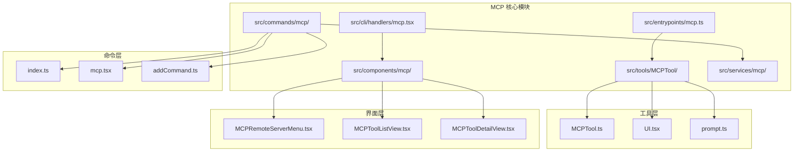
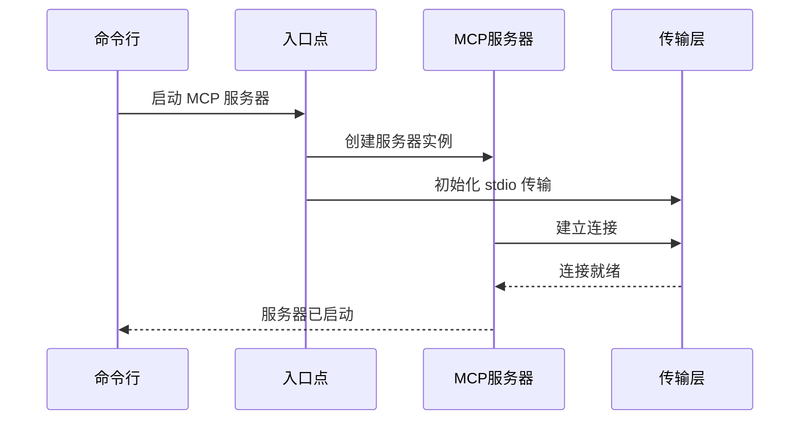
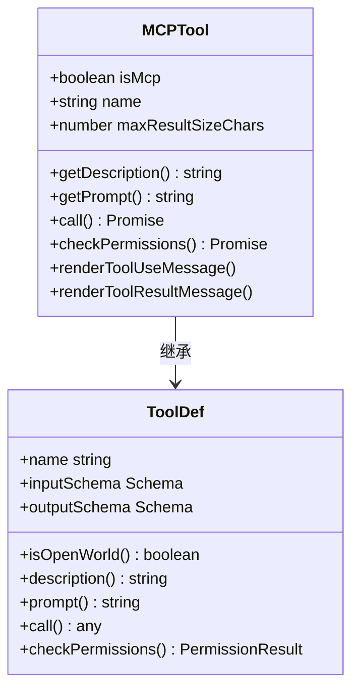
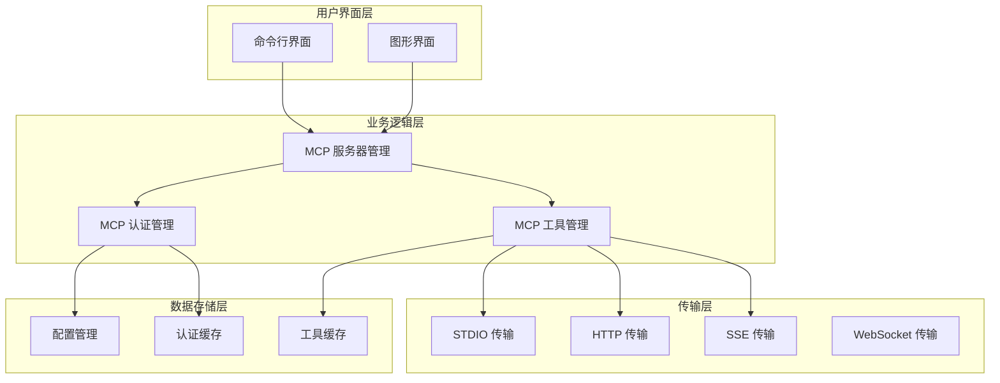
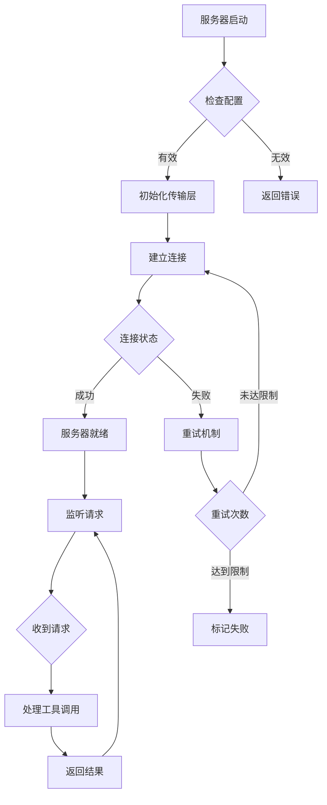
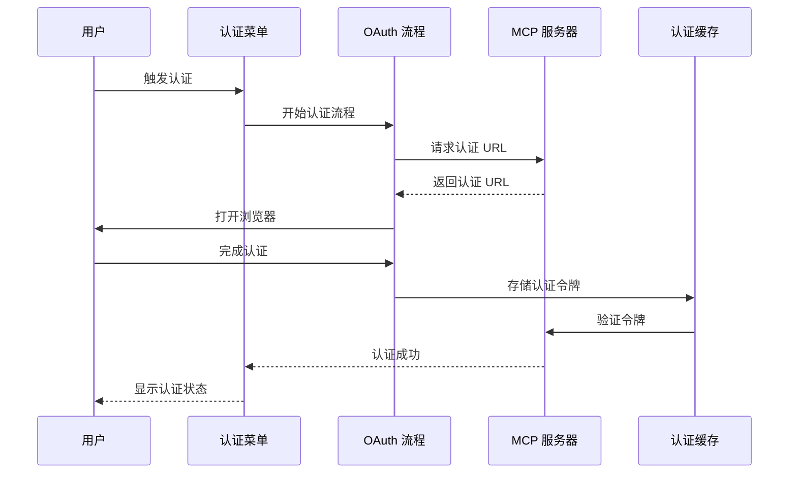
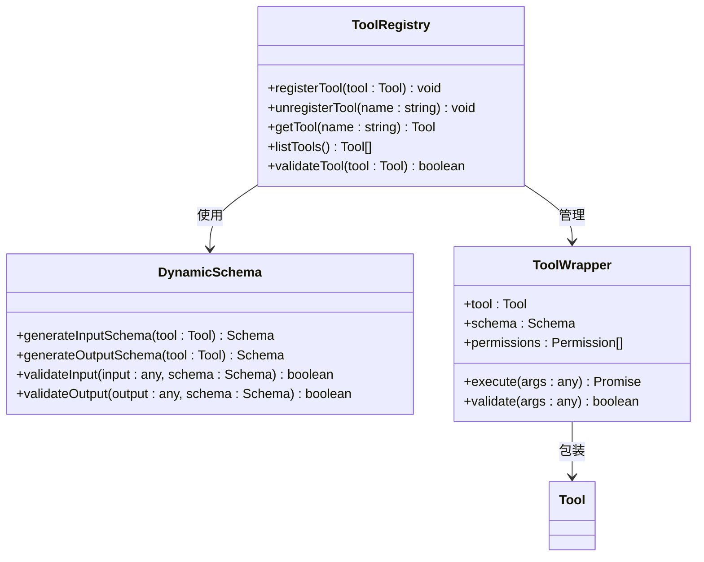
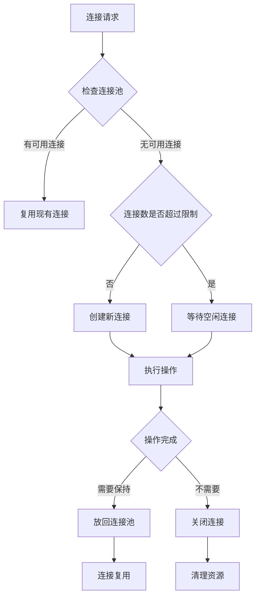

# MCP 协议集成

<cite>
**本文档引用的文件**
- [src/entrypoints/mcp.ts](file://src/entrypoints/mcp.ts)
- [src/cli/handlers/mcp.tsx](file://src/cli/handlers/mcp.tsx)
- [src/tools/MCPTool/MCPTool.ts](file://src/tools/MCPTool/MCPTool.ts)
- [src/components/mcp/MCPRemoteServerMenu.tsx](file://src/components/mcp/MCPRemoteServerMenu.tsx)
- [src/commands/mcp/index.ts](file://src/commands/mcp/index.ts)
</cite>

## 目录
1. [简介](#简介)
2. [项目结构](#项目结构)
3. [核心组件](#核心组件)
4. [架构概览](#架构概览)
5. [详细组件分析](#详细组件分析)
6. [依赖关系分析](#依赖关系分析)
7. [性能考虑](#性能考虑)
8. [故障排除指南](#故障排除指南)
9. [结论](#结论)

## 简介

Claude Code 的 MCP（Model Context Protocol）协议集成为开发者提供了强大的工具生态系统扩展能力。该集成实现了完整的 MCP 客户端-服务器通信框架，支持多种传输协议，包括 stdio、HTTP、SSE 和 WebSocket，并提供了完整的认证授权机制。

本系统的核心目标是：
- 提供统一的 MCP 工具调用接口
- 支持动态工具注册和模式生成
- 实现安全的认证授权流程
- 提供灵活的连接管理和重连机制
- 扩展 Claude Code 的工具生态

## 项目结构

MCP 集成在 Claude Code 代码库中采用模块化设计，主要分布在以下目录：



**图表来源**
- [src/entrypoints/mcp.ts:1-197](file://src/entrypoints/mcp.ts#L1-L197)
- [src/cli/handlers/mcp.tsx:1-362](file://src/cli/handlers/mcp.tsx#L1-L362)
- [src/tools/MCPTool/MCPTool.ts:1-78](file://src/tools/MCPTool/MCPTool.ts#L1-L78)

**章节来源**
- [src/entrypoints/mcp.ts:1-197](file://src/entrypoints/mcp.ts#L1-L197)
- [src/cli/handlers/mcp.tsx:1-362](file://src/cli/handlers/mcp.tsx#L1-L362)
- [src/tools/MCPTool/MCPTool.ts:1-78](file://src/tools/MCPTool/MCPTool.ts#L1-L78)

## 核心组件

### MCP 服务器入口点

MCP 服务器通过专用入口点启动，使用 @modelcontextprotocol/sdk 库实现标准 MCP 协议：



**图表来源**
- [src/entrypoints/mcp.ts:35-196](file://src/entrypoints/mcp.ts#L35-L196)

### MCP 工具包装器

MCPTool 提供了统一的工具接口，支持动态工具注册和权限管理：



**图表来源**
- [src/tools/MCPTool/MCPTool.ts:27-77](file://src/tools/MCPTool/MCPTool.ts#L27-L77)

**章节来源**
- [src/entrypoints/mcp.ts:35-196](file://src/entrypoints/mcp.ts#L35-L196)
- [src/tools/MCPTool/MCPTool.ts:1-78](file://src/tools/MCPTool/MCPTool.ts#L1-L78)

## 架构概览

MCP 系统采用分层架构设计，确保了良好的可扩展性和维护性：



**图表来源**
- [src/cli/handlers/mcp.tsx:1-362](file://src/cli/handlers/mcp.tsx#L1-L362)
- [src/entrypoints/mcp.ts:1-197](file://src/entrypoints/mcp.ts#L1-L197)

## 详细组件分析

### MCP 服务器管理器

MCP 服务器管理器负责服务器的生命周期管理和连接状态监控：



**图表来源**
- [src/cli/handlers/mcp.tsx:41-71](file://src/cli/handlers/mcp.tsx#L41-L71)

### 认证和授权流程

系统实现了多层次的认证机制，支持多种认证方式：



**图表来源**
- [src/components/mcp/MCPRemoteServerMenu.tsx:256-302](file://src/components/mcp/MCPRemoteServerMenu.tsx#L256-L302)

### 工具注册和动态模式

MCP 工具系统支持动态工具注册和模式生成：



**图表来源**
- [src/tools/MCPTool/MCPTool.ts:27-77](file://src/tools/MCPTool/MCPTool.ts#L27-L77)

**章节来源**
- [src/cli/handlers/mcp.tsx:256-302](file://src/cli/handlers/mcp.tsx#L256-L302)
- [src/components/mcp/MCPRemoteServerMenu.tsx:1-649](file://src/components/mcp/MCPRemoteServerMenu.tsx#L1-L649)
- [src/tools/MCPTool/MCPTool.ts:1-78](file://src/tools/MCPTool/MCPTool.ts#L1-L78)

### 传输协议支持

系统支持多种传输协议，每种协议都有专门的实现：

| 传输协议 | 类型 | 特点 | 使用场景 |
|---------|------|------|----------|
| STDIO | 同步 | 简单可靠 | 本地进程通信 |
| HTTP | 异步 | 标准协议 | Web 服务集成 |
| SSE | 流式 | 实时推送 | 实时数据更新 |
| WebSocket | 双向 | 低延迟 | 交互式应用 |

**章节来源**
- [src/entrypoints/mcp.ts:1-197](file://src/entrypoints/mcp.ts#L1-L197)

## 依赖关系分析

MCP 系统的依赖关系体现了清晰的关注点分离：

```mermaid
graph LR
subgraph "外部依赖"
A[@modelcontextprotocol/sdk]
B[zod]
C[React]
D[Ink]
end
subgraph "内部模块"
E[entrypoints/mcp.ts]
F[cli/handlers/mcp.tsx]
G[tools/MCPTool/]
H[components/mcp/]
I[commands/mcp/]
end
subgraph "服务层"
J[mcp/auth.js]
K[mcp/client.js]
L[mcp/config.js]
M[mcp/utils.js]
end
A --> E
B --> G
C --> H
D --> H
E --> J
F --> J
F --> K
F --> L
F --> M
G --> J
H --> J
I --> F
```

**图表来源**
- [src/entrypoints/mcp.ts:1-28](file://src/entrypoints/mcp.ts#L1-L28)
- [src/cli/handlers/mcp.tsx:14-25](file://src/cli/handlers/mcp.tsx#L14-L25)

**章节来源**
- [src/entrypoints/mcp.ts:1-28](file://src/entrypoints/mcp.ts#L1-L28)
- [src/cli/handlers/mcp.tsx:1-31](file://src/cli/handlers/mcp.tsx#L1-L31)

## 性能考虑

### 缓存策略

系统实现了多级缓存机制以优化性能：

- **文件状态缓存**：限制大小的 LRU 缓存，防止内存无限增长
- **工具结果缓存**：避免重复计算相同工具调用的结果
- **认证令牌缓存**：减少重复认证的开销

### 连接池管理



### 错误处理和重试

系统实现了智能的错误处理和自动重试机制：

- **指数退避重试**：网络错误时采用指数退避策略
- **超时控制**：为每个操作设置合理的超时时间
- **连接健康检查**：定期检查连接状态并自动恢复

## 故障排除指南

### 常见问题诊断

| 问题类型 | 症状 | 解决方案 |
|---------|------|----------|
| 连接失败 | 服务器无法启动或连接超时 | 检查网络配置和防火墙设置 |
| 认证失败 | OAuth 流程中断或令牌无效 | 验证客户端配置和服务器状态 |
| 工具调用错误 | 工具执行失败或返回错误 | 检查工具输入参数和权限设置 |
| 内存泄漏 | 程序运行时间越长内存占用越大 | 检查缓存清理机制和连接池管理 |

### 调试技巧

1. **启用调试日志**：使用 `--debug` 参数获取详细的调试信息
2. **监控连接状态**：定期检查服务器连接状态和健康指标
3. **分析性能瓶颈**：使用性能分析工具识别性能热点
4. **验证配置**：确保所有配置文件正确无误

**章节来源**
- [src/cli/handlers/mcp.tsx:26-38](file://src/cli/handlers/mcp.tsx#L26-L38)

## 结论

Claude Code 的 MCP 协议集成为开发者提供了一个功能完整、性能优异的工具生态系统。通过模块化的架构设计、多层认证机制和灵活的传输协议支持，该系统能够满足各种复杂的工具集成需求。

主要优势包括：
- **高度可扩展**：支持动态工具注册和模式生成
- **安全可靠**：多层认证和权限控制机制
- **性能优化**：智能缓存和连接池管理
- **易于使用**：直观的命令行和图形界面

未来发展方向：
- 扩展更多传输协议支持
- 增强工具生态系统的互操作性
- 优化性能和资源使用效率
- 提供更丰富的监控和诊断工具