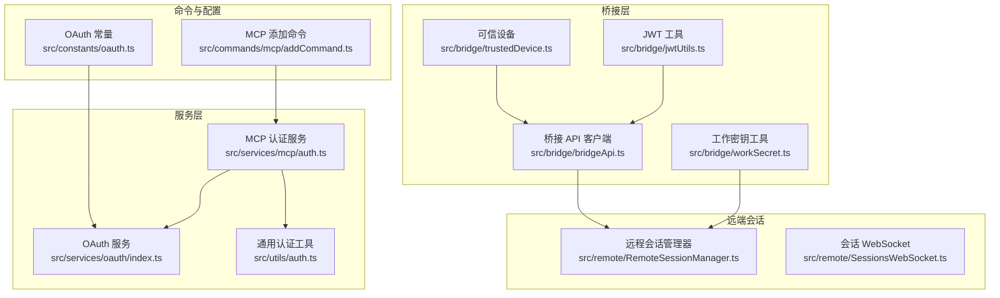
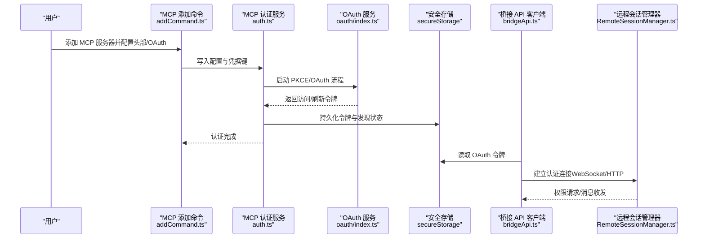
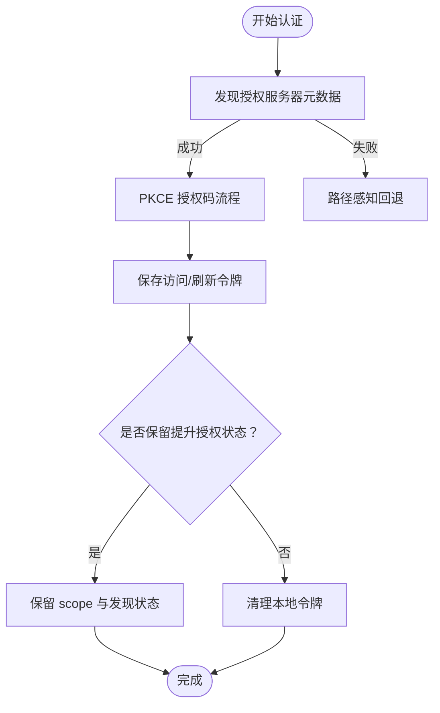
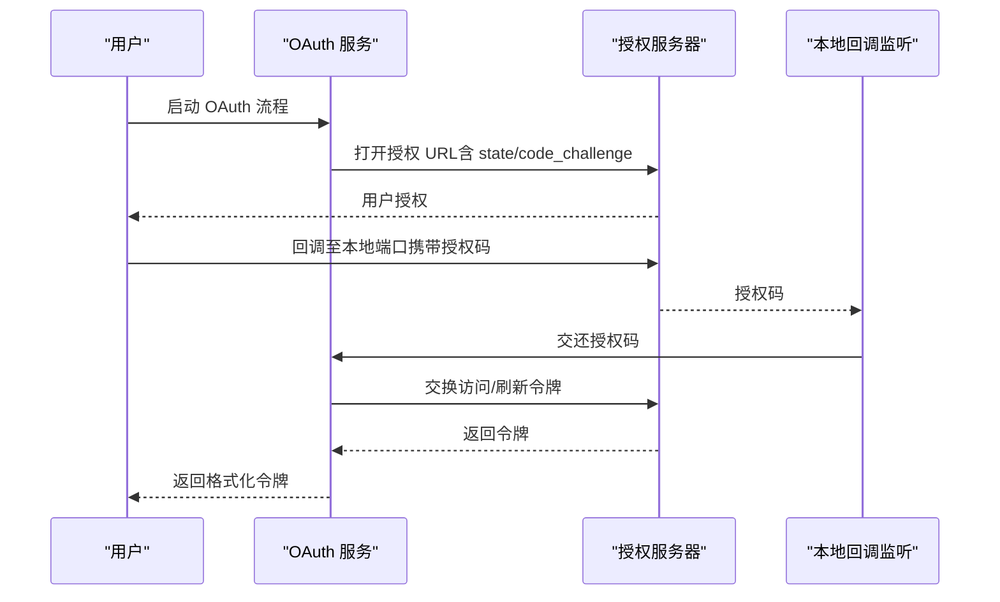
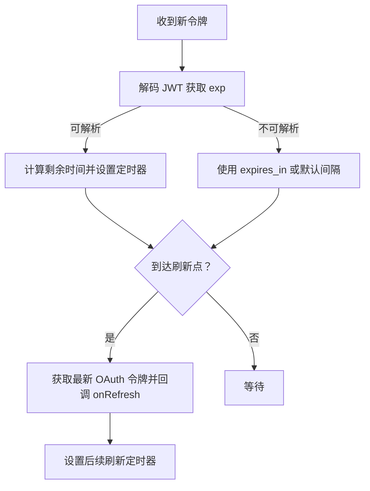
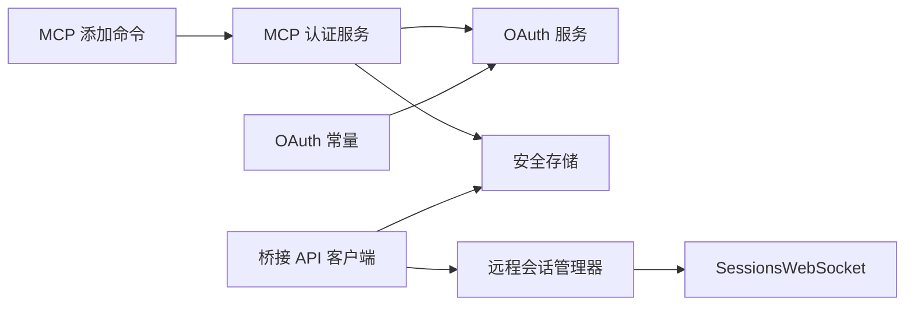

# MCP 安全与认证

<cite>
**本文引用的文件**
- [README.md](file://README.md)
- [src/services/mcp/auth.ts](file://src/services/mcp/auth.ts)
- [src/services/oauth/index.ts](file://src/services/oauth/index.ts)
- [src/utils/auth.ts](file://src/utils/auth.ts)
- [src/bridge/jwtUtils.ts](file://src/bridge/jwtUtils.ts)
- [src/bridge/workSecret.ts](file://src/bridge/workSecret.ts)
- [src/bridge/bridgeApi.ts](file://src/bridge/bridgeApi.ts)
- [src/bridge/trustedDevice.ts](file://src/bridge/trustedDevice.ts)
- [src/remote/RemoteSessionManager.ts](file://src/remote/RemoteSessionManager.ts)
- [src/remote/SessionsWebSocket.ts](file://src/remote/SessionsWebSocket.ts)
- [src/constants/oauth.ts](file://src/constants/oauth.ts)
- [src/commands/mcp/addCommand.ts](file://src/commands/mcp/addCommand.ts)
</cite>

## 目录
1. [简介](#简介)
2. [项目结构](#项目结构)
3. [核心组件](#核心组件)
4. [架构总览](#架构总览)
5. [详细组件分析](#详细组件分析)
6. [依赖关系分析](#依赖关系分析)
7. [性能考量](#性能考量)
8. [故障排查指南](#故障排查指南)
9. [结论](#结论)
10. [附录](#附录)

## 简介
本文件面向 MCP（Model Context Protocol）在 Claude Code 中的安全与认证实现，系统化阐述安全架构、认证机制、授权流程，以及与 OAuth 2.0、API 密钥、JWT 令牌处理、安全头信息、请求签名与响应验证等关键能力的集成方式。文档同时覆盖跨域安全、CORS 配置与安全传输建议，并提供认证配置示例、密钥管理策略、会话安全与审计合规要点。

## 项目结构
围绕 MCP 安全与认证的关键模块分布如下：
- 服务层：MCP 认证与授权、OAuth 2.0 流程、安全存储与令牌刷新
- 桥接层：JWT 解码与刷新调度、工作密钥构建、可信设备令牌
- 远端会话：远程会话管理、WebSocket 认证连接
- 命令行与常量：MCP 添加命令、OAuth 配置常量

**图表来源**
- [src/services/mcp/auth.ts](file://src/services/mcp/auth.ts)
- [src/services/oauth/index.ts](file://src/services/oauth/index.ts)
- [src/utils/auth.ts](file://src/utils/auth.ts)
- [src/bridge/jwtUtils.ts](file://src/bridge/jwtUtils.ts)
- [src/bridge/workSecret.ts](file://src/bridge/workSecret.ts)
- [src/bridge/bridgeApi.ts](file://src/bridge/bridgeApi.ts)
- [src/bridge/trustedDevice.ts](file://src/bridge/trustedDevice.ts)
- [src/remote/RemoteSessionManager.ts](file://src/remote/RemoteSessionManager.ts)
- [src/remote/SessionsWebSocket.ts](file://src/remote/SessionsWebSocket.ts)
- [src/commands/mcp/addCommand.ts](file://src/commands/mcp/addCommand.ts)
- [src/constants/oauth.ts](file://src/constants/oauth.ts)

**章节来源**
- [README.md:693-724](file://README.md#L693-L724)

## 核心组件
- MCP 认证服务：负责 OAuth 元数据发现、令牌获取与刷新、令牌撤销、XAA（跨应用访问）流程、敏感参数脱敏与错误归因、安全存储与凭据持久化。
- OAuth 服务：封装 PKCE 授权码流程、自动/手动回调、令牌格式化与用户画像拉取、成功/失败重定向。
- 通用认证工具：统一 API Key 与 OAuth 的来源判定、外部密钥辅助脚本执行、AWS 凭证刷新与导出、安全缓存与信任校验。
- 桥接层：JWT 载荷解码、过期时间解析、令牌刷新调度器；工作密钥解析与 SDK URL 构建；可信设备注册与持久化。
- 远端会话：WebSocket 订阅与消息收发、HTTP 发送、权限请求响应、连接状态管理与重连。
- 命令与配置：CLI 添加 MCP 服务器时的头部注入、OAuth 配置、CIMD（客户端元数据文档）支持。

**章节来源**
- [src/services/mcp/auth.ts](file://src/services/mcp/auth.ts)
- [src/services/oauth/index.ts](file://src/services/oauth/index.ts)
- [src/utils/auth.ts](file://src/utils/auth.ts)
- [src/bridge/jwtUtils.ts](file://src/bridge/jwtUtils.ts)
- [src/bridge/workSecret.ts](file://src/bridge/workSecret.ts)
- [src/bridge/bridgeApi.ts](file://src/bridge/bridgeApi.ts)
- [src/bridge/trustedDevice.ts](file://src/bridge/trustedDevice.ts)
- [src/remote/RemoteSessionManager.ts](file://src/remote/RemoteSessionManager.ts)
- [src/remote/SessionsWebSocket.ts](file://src/remote/SessionsWebSocket.ts)
- [src/commands/mcp/addCommand.ts](file://src/commands/mcp/addCommand.ts)
- [src/constants/oauth.ts](file://src/constants/oauth.ts)

## 架构总览
下图展示 MCP 安全与认证的整体交互：从 MCP 服务器发现与认证，到本地 OAuth 流程、令牌存储与刷新，再到桥接与远端会话的认证传递。

**图表来源**
- [src/commands/mcp/addCommand.ts](file://src/commands/mcp/addCommand.ts)
- [src/services/mcp/auth.ts](file://src/services/mcp/auth.ts)
- [src/services/oauth/index.ts](file://src/services/oauth/index.ts)
- [src/bridge/bridgeApi.ts](file://src/bridge/bridgeApi.ts)
- [src/remote/RemoteSessionManager.ts](file://src/remote/RemoteSessionManager.ts)

## 详细组件分析

### 组件一：MCP 认证与授权（OAuth 2.0、XAA、令牌管理）
- OAuth 元数据发现：支持 RFC 9728 → RFC 8414 自动发现，或用户指定元数据地址（HTTPS 限定）。
- 令牌获取与刷新：封装 SDK 提供的授权与刷新逻辑，带超时与错误归一化处理。
- 令牌撤销：优先 RFC 7009，对不兼容服务器进行回退（Bearer 认证）。
- 敏感参数脱敏：对 state、nonce、code_challenge、code_verifier、code 等参数进行日志脱敏。
- 错误归因：对刷新失败与流程错误进行稳定枚举，便于 BigQuery 分析。
- XAA（跨应用访问）：一次 IdP 登录复用至所有 XAA 配置的 MCP 服务器，支持 JWT Bearer 交换与缓存。
- 安全存储：按服务器键（名称+配置哈希）隔离凭据，避免跨服务器复用。

**图表来源**
- [src/services/mcp/auth.ts](file://src/services/mcp/auth.ts)

**章节来源**
- [src/services/mcp/auth.ts](file://src/services/mcp/auth.ts)

### 组件二：OAuth 2.0 流程（PKCE 授权码）
- 自动/手动两种授权码获取：自动通过浏览器打开授权页并在本地监听回调，手动则提示用户复制粘贴授权码。
- PKCE 参数生成与挑战：随机生成 code_verifier 并计算 code_challenge。
- 令牌交换与格式化：交换后返回访问/刷新令牌、作用域、账户信息与速率等级。
- 成功/失败重定向：自动流程在成功/失败时进行页面跳转反馈。

**图表来源**
- [src/services/oauth/index.ts](file://src/services/oauth/index.ts)

**章节来源**
- [src/services/oauth/index.ts](file://src/services/oauth/index.ts)

### 组件三：JWT 令牌处理与刷新调度
- JWT 解码：支持去除前缀的 session-ingress 形态，解析载荷与 exp。
- 刷新调度：基于 exp 提前触发刷新，带失败计数与重试间隔，支持按 expires_in 定时刷新。
- 会话级调度：为每个会话维护独立定时器与代数，避免并发刷新竞态。

**图表来源**
- [src/bridge/jwtUtils.ts](file://src/bridge/jwtUtils.ts)

**章节来源**
- [src/bridge/jwtUtils.ts](file://src/bridge/jwtUtils.ts)

### 组件四：工作密钥与 SDK URL 构建
- 工作密钥解码：校验版本与必要字段，确保 session_ingress_token 与 api_base_url 存在。
- SDK URL 构建：区分本地与生产环境协议与版本，生成 ws/wss 与 HTTP 入口。
- 会话 ID 对比：兼容不同标签前缀的会话 ID，避免误判“外域”会话。

**章节来源**
- [src/bridge/workSecret.ts](file://src/bridge/workSecret.ts)

### 组件五：可信设备与桥接 API
- 可信设备注册：登录后立即向授权服务器发起注册，持久化设备令牌，失败为尽力而为。
- 桥接 API 客户端：提供 ID 校验、致命错误类型、调试钩子与安全头信息处理。
- 设备令牌使用：在桥接请求中携带可信设备令牌以满足更严格的身份门控。

**章节来源**
- [src/bridge/trustedDevice.ts](file://src/bridge/trustedDevice.ts)
- [src/bridge/bridgeApi.ts](file://src/bridge/bridgeApi.ts)

### 组件六：远端会话与 WebSocket 认证
- 连接管理：WebSocket 订阅、消息收发、重连与错误处理。
- 认证方式：通过请求头携带 OAuth 令牌完成认证，连接建立即视为已认证。
- 权限请求：接收权限请求并响应，保障最小授权与用户同意。

**章节来源**
- [src/remote/RemoteSessionManager.ts](file://src/remote/RemoteSessionManager.ts)
- [src/remote/SessionsWebSocket.ts](file://src/remote/SessionsWebSocket.ts)

### 组件七：认证配置与密钥管理策略
- CLI 添加 MCP 服务器：支持通过命令行添加服务器、设置传输类型、注入自定义头部、配置 OAuth 与 XAA。
- OAuth 配置常量：生产环境授权服务器、令牌端点、CIMD 文档 URL、代理路径等集中管理。
- API Key 与 OAuth 来源判定：区分外部 API Key 辅助脚本、文件描述符、环境变量与登录态 OAuth，避免混用导致的组织不匹配。

**章节来源**
- [src/commands/mcp/addCommand.ts](file://src/commands/mcp/addCommand.ts)
- [src/constants/oauth.ts](file://src/constants/oauth.ts)
- [src/utils/auth.ts](file://src/utils/auth.ts)

## 依赖关系分析
- MCP 认证服务依赖 OAuth 服务与安全存储，负责令牌生命周期与错误归因。
- 桥接层依赖通用认证工具提供的 OAuth 令牌与安全存储，负责会话级令牌刷新与连接认证。
- 远端会话依赖桥接层提供的认证头与 WebSocket 客户端，负责消息与权限流。
- 命令行与常量为上层入口与配置提供支撑。

**图表来源**
- [src/services/mcp/auth.ts](file://src/services/mcp/auth.ts)
- [src/services/oauth/index.ts](file://src/services/oauth/index.ts)
- [src/bridge/bridgeApi.ts](file://src/bridge/bridgeApi.ts)
- [src/remote/RemoteSessionManager.ts](file://src/remote/RemoteSessionManager.ts)
- [src/remote/SessionsWebSocket.ts](file://src/remote/SessionsWebSocket.ts)
- [src/commands/mcp/addCommand.ts](file://src/commands/mcp/addCommand.ts)
- [src/constants/oauth.ts](file://src/constants/oauth.ts)

**章节来源**
- [src/services/mcp/auth.ts](file://src/services/mcp/auth.ts)
- [src/services/oauth/index.ts](file://src/services/oauth/index.ts)
- [src/bridge/bridgeApi.ts](file://src/bridge/bridgeApi.ts)
- [src/remote/RemoteSessionManager.ts](file://src/remote/RemoteSessionManager.ts)
- [src/remote/SessionsWebSocket.ts](file://src/remote/SessionsWebSocket.ts)
- [src/commands/mcp/addCommand.ts](file://src/commands/mcp/addCommand.ts)
- [src/constants/oauth.ts](file://src/constants/oauth.ts)

## 性能考量
- 令牌刷新：采用提前缓冲刷新与固定周期跟进刷新，降低长会话中断风险。
- 并发控制：会话级定时器与代数确保刷新链路不会被取消/重排导致竞态。
- 超时与重试：OAuth 请求统一超时信号，失败重试次数限制，避免雪崩。
- 日志脱敏：敏感参数在日志中替换，减少泄露面。

[本节为通用性能讨论，无需具体文件分析]

## 故障排查指南
- OAuth 流程错误：检查 state 匹配、端口可用性、Provider 拒绝、SDK 失败与令牌交换失败等错误原因。
- 刷新失败：关注元数据发现失败、无客户端信息、无效授权、重试耗尽与请求失败等归因事件。
- 令牌撤销：若服务器不支持 RFC 7009，将尝试 Bearer 认证回退；如仍失败，记录并继续清理本地令牌。
- 可信设备：注册失败或过期将尽力而为，确保不影响登录主流程；必要时清除旧令牌再重试。
- 远端会话：WebSocket 连接失败、权限请求未响应、消息发送失败均需检查认证头与网络代理配置。

**章节来源**
- [src/services/mcp/auth.ts](file://src/services/mcp/auth.ts)
- [src/bridge/trustedDevice.ts](file://src/bridge/trustedDevice.ts)
- [src/remote/RemoteSessionManager.ts](file://src/remote/RemoteSessionManager.ts)
- [src/remote/SessionsWebSocket.ts](file://src/remote/SessionsWebSocket.ts)

## 结论
该实现以 MCP 认证服务为核心，结合 OAuth 2.0、XAA、JWT 刷新与桥接/远端会话认证，形成端到端的安全通道。通过严格的令牌生命周期管理、错误归因与日志脱敏、可信设备与安全存储策略，有效提升了 MCP 场景下的身份认证与授权安全性。建议在生产环境中启用 HTTPS、最小权限授权、定期轮换密钥与令牌，并持续监控认证事件与审计日志。

[本节为总结，无需具体文件分析]

## 附录

### 安全最佳实践
- 强制 HTTPS：OAuth 元数据与令牌端点必须使用 HTTPS。
- 最小权限：仅授予必要的 scope，并在重新认证时保留已提升的授权状态。
- 令牌保护：避免在日志中输出敏感参数；使用安全存储持久化令牌。
- 跨域与 CORS：在 MCP 服务器端正确配置允许来源、方法与头，避免宽松通配。
- 传输安全：使用 TLS 代理与受信根证书，防止中间人攻击。

### 漏洞防护
- CSRF 与会话固定：严格校验 state 与 nonce，避免在回调中暴露。
- 令牌泄露：定期轮换客户端密钥与服务器端密钥；对异常刷新与撤销进行告警。
- 输入校验：对服务器返回的 ID 与 URL 进行白名单与模式校验，防止路径遍历。

### 审计与合规
- 事件追踪：对认证取消、超时、Provider 拒绝、刷新失败等事件进行稳定枚举并上报。
- 日志脱敏：对授权码、state、nonce、code_verifier 等参数进行脱敏。
- 合规存储：遵循安全存储接口规范，避免明文落盘与跨进程共享。

[本节为通用指导，无需具体文件分析]