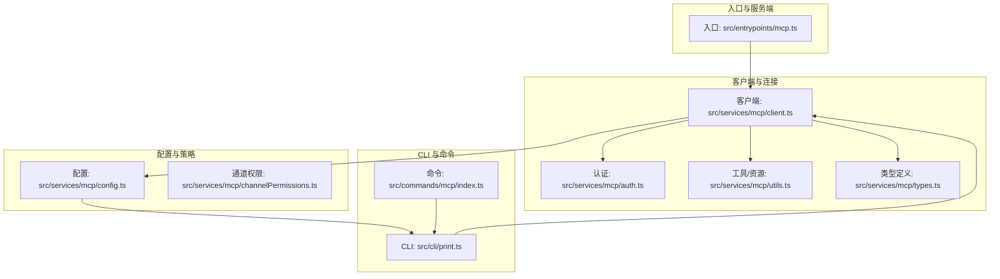
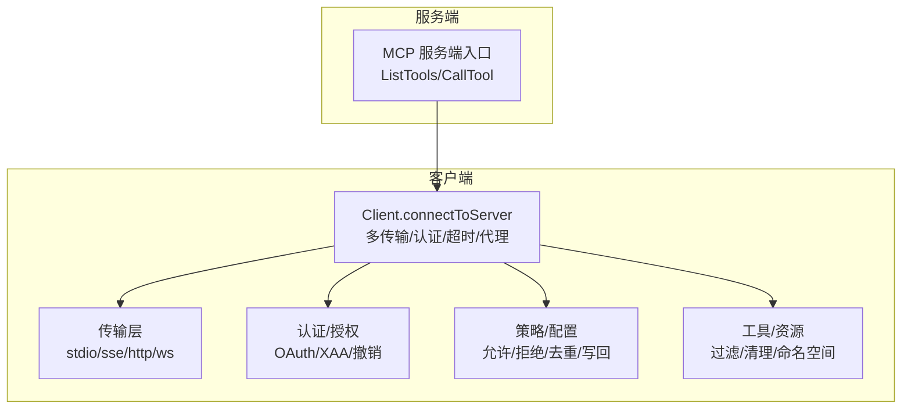
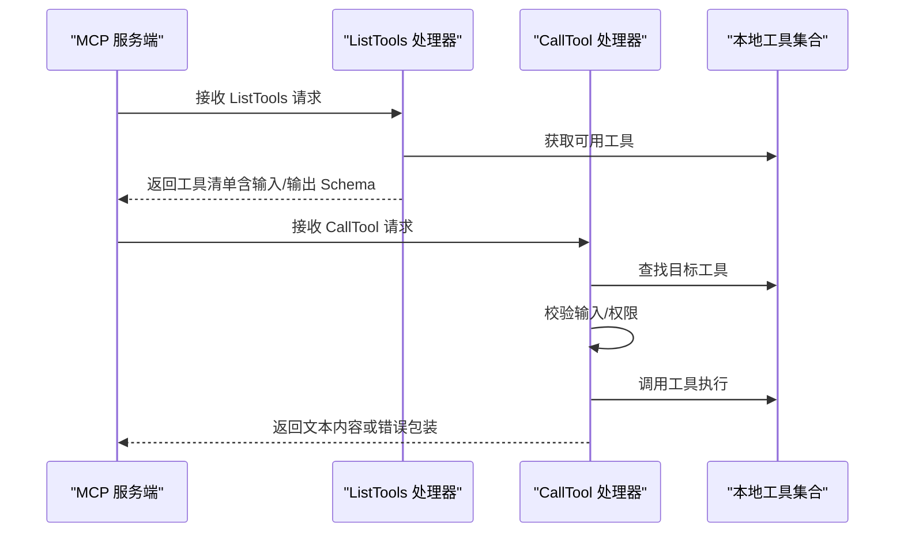
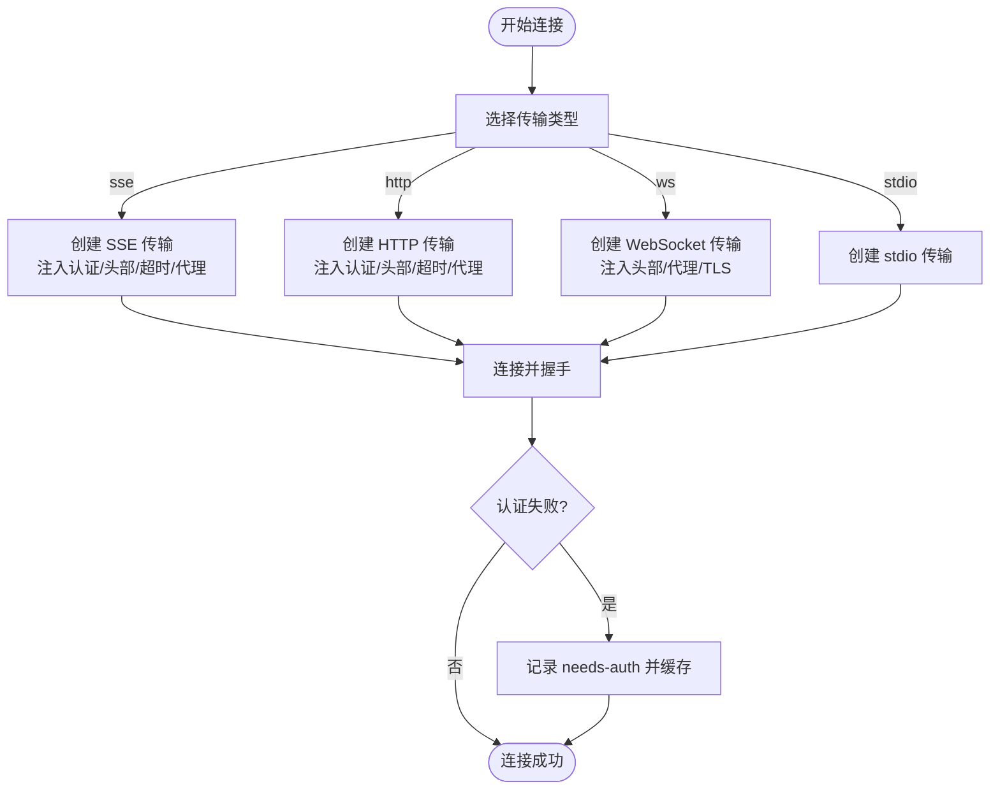
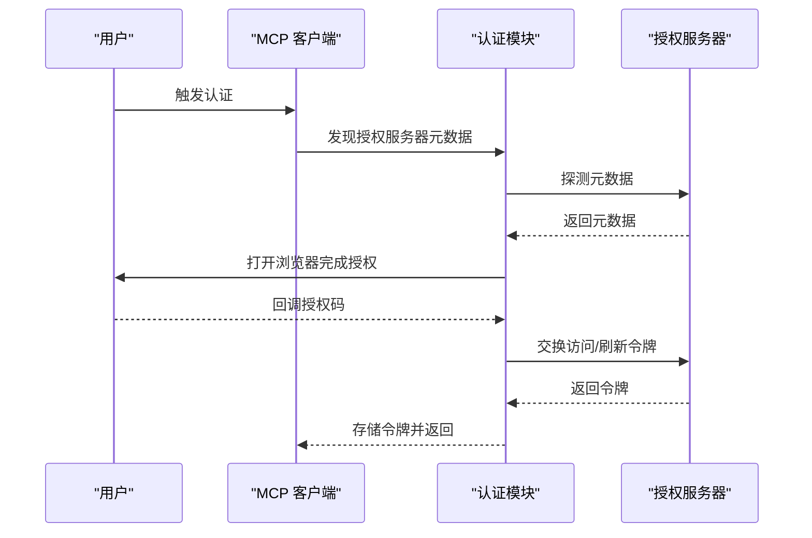
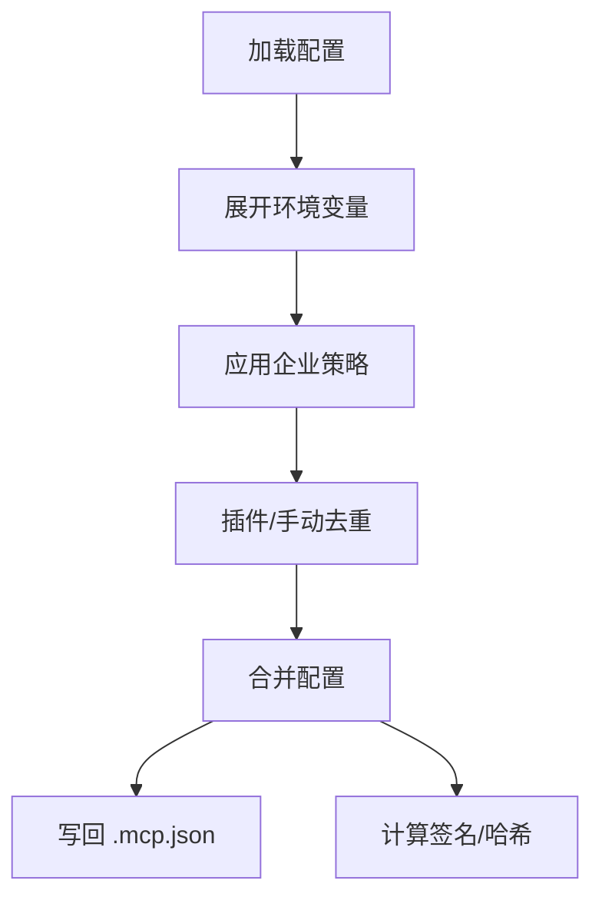
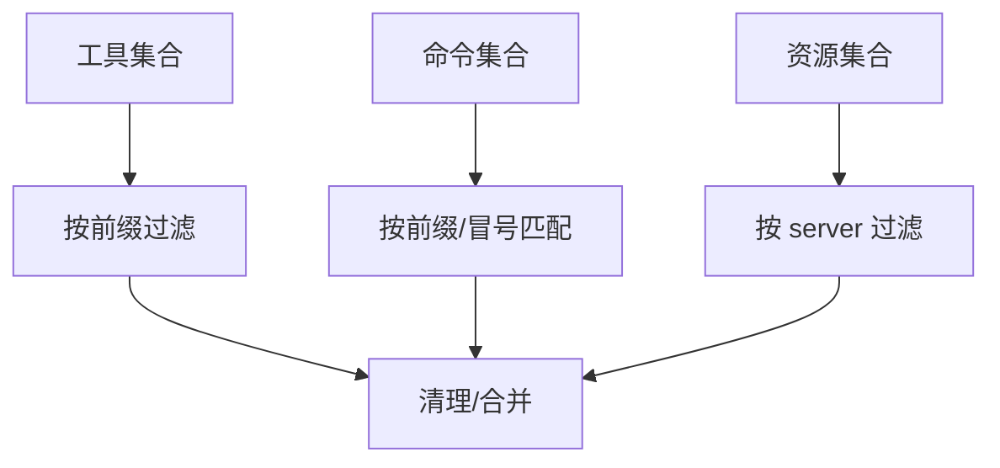
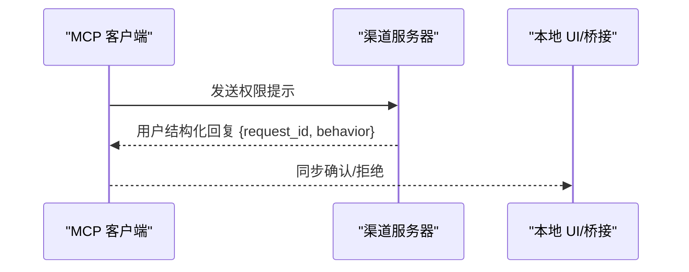
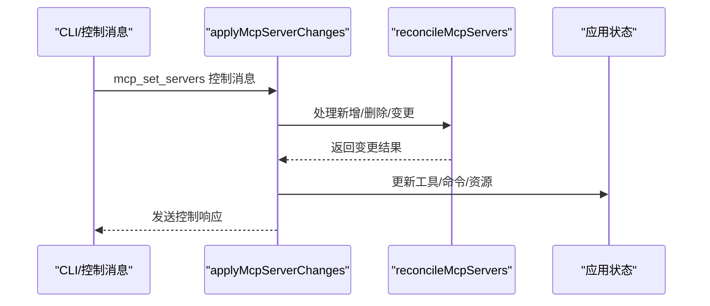
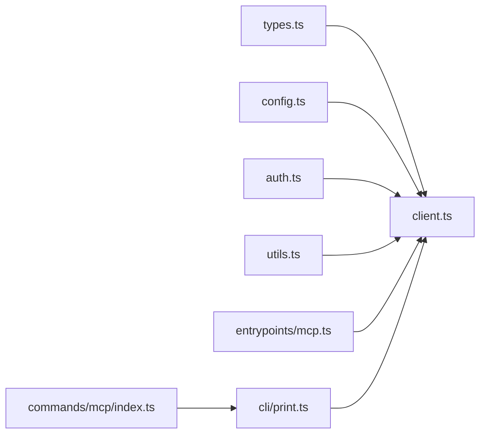

# MCP 客户端实现

<cite>
**本文引用的文件**
- [src/entrypoints/mcp.ts](file://src/entrypoints/mcp.ts)
- [src/services/mcp/client.ts](file://src/services/mcp/client.ts)
- [src/services/mcp/config.ts](file://src/services/mcp/config.ts)
- [src/services/mcp/auth.ts](file://src/services/mcp/auth.ts)
- [src/services/mcp/utils.ts](file://src/services/mcp/utils.ts)
- [src/services/mcp/types.ts](file://src/services/mcp/types.ts)
- [src/services/mcp/channelPermissions.ts](file://src/services/mcp/channelPermissions.ts)
- [src/cli/print.ts](file://src/cli/print.ts)
- [src/commands/mcp/index.ts](file://src/commands/mcp/index.ts)
</cite>

## 目录
1. [简介](#简介)
2. [项目结构](#项目结构)
3. [核心组件](#核心组件)
4. [架构总览](#架构总览)
5. [详细组件分析](#详细组件分析)
6. [依赖关系分析](#依赖关系分析)
7. [性能考虑](#性能考虑)
8. [故障排除指南](#故障排除指南)
9. [结论](#结论)
10. [附录](#附录)

## 简介
本技术文档面向 MCP（Model Context Protocol）客户端在 Claude Code 中的实现，系统性阐述其架构设计、连接建立流程、消息协议实现、初始化与配置管理、错误处理机制，以及与 Claude Code 工具系统的集成方式（工具注册、参数传递、结果处理）。同时提供配置示例、连接参数说明、超时设置、生命周期管理、状态维护与资源清理策略，并给出性能优化建议与故障排除指南。

## 项目结构
MCP 客户端实现主要分布在以下模块：
- 入口与服务端：负责以 MCP 服务端模式运行，暴露工具并执行调用
- 客户端与连接：负责连接远端 MCP 服务器、传输层抽象、认证与授权、请求超时与重试
- 配置与策略：负责服务器配置解析、企业策略、去重与允许/拒绝列表
- 工具与权限：负责工具过滤、命令与资源归属、通道权限提示
- CLI 与命令：负责动态服务器变更、工具池更新、状态同步

**图表来源**
- [src/entrypoints/mcp.ts:35-196](file://src/entrypoints/mcp.ts#L35-L196)
- [src/services/mcp/client.ts:1-800](file://src/services/mcp/client.ts#L1-L800)
- [src/services/mcp/config.ts:1-800](file://src/services/mcp/config.ts#L1-L800)
- [src/services/mcp/auth.ts:1-800](file://src/services/mcp/auth.ts#L1-L800)
- [src/services/mcp/utils.ts:1-576](file://src/services/mcp/utils.ts#L1-L576)
- [src/services/mcp/types.ts:1-259](file://src/services/mcp/types.ts#L1-L259)
- [src/services/mcp/channelPermissions.ts:1-241](file://src/services/mcp/channelPermissions.ts#L1-L241)
- [src/cli/print.ts:1432-1460](file://src/cli/print.ts#L1432-L1460)
- [src/commands/mcp/index.ts:1-13](file://src/commands/mcp/index.ts#L1-L13)

**章节来源**
- [src/entrypoints/mcp.ts:35-196](file://src/entrypoints/mcp.ts#L35-L196)
- [src/services/mcp/client.ts:1-800](file://src/services/mcp/client.ts#L1-L800)
- [src/services/mcp/config.ts:1-800](file://src/services/mcp/config.ts#L1-L800)
- [src/services/mcp/auth.ts:1-800](file://src/services/mcp/auth.ts#L1-L800)
- [src/services/mcp/utils.ts:1-576](file://src/services/mcp/utils.ts#L1-L576)
- [src/services/mcp/types.ts:1-259](file://src/services/mcp/types.ts#L1-L259)
- [src/services/mcp/channelPermissions.ts:1-241](file://src/services/mcp/channelPermissions.ts#L1-L241)
- [src/cli/print.ts:1432-1460](file://src/cli/print.ts#L1432-L1460)
- [src/commands/mcp/index.ts:1-13](file://src/commands/mcp/index.ts#L1-L13)

## 核心组件
- MCP 服务端入口：启动 MCP 服务端，注册工具列表与工具调用处理器，将本地工具暴露给 MCP 客户端使用
- MCP 客户端：统一连接器，支持多种传输（stdio、SSE、HTTP、WebSocket），封装认证、超时、代理、缓存与错误分类
- 配置与策略：解析 .mcp.json、用户/项目/企业配置，应用允许/拒绝策略，去重插件与手动配置
- 认证与授权：OAuth 发现、令牌刷新、跨应用访问（XAA）、令牌撤销、步骤提升检测
- 工具与资源：按服务器过滤工具/命令/资源；通道权限提示；日志安全 URL 提取
- CLI 与命令：动态服务器变更、SDK MCP 工具池合并、状态更新与通知

**章节来源**
- [src/entrypoints/mcp.ts:35-196](file://src/entrypoints/mcp.ts#L35-L196)
- [src/services/mcp/client.ts:1-800](file://src/services/mcp/client.ts#L1-L800)
- [src/services/mcp/config.ts:1-800](file://src/services/mcp/config.ts#L1-L800)
- [src/services/mcp/auth.ts:1-800](file://src/services/mcp/auth.ts#L1-L800)
- [src/services/mcp/utils.ts:1-576](file://src/services/mcp/utils.ts#L1-L576)
- [src/services/mcp/types.ts:1-259](file://src/services/mcp/types.ts#L1-L259)
- [src/services/mcp/channelPermissions.ts:1-241](file://src/services/mcp/channelPermissions.ts#L1-L241)
- [src/cli/print.ts:1432-1460](file://src/cli/print.ts#L1432-L1460)
- [src/commands/mcp/index.ts:1-13](file://src/commands/mcp/index.ts#L1-L13)

## 架构总览
MCP 客户端采用“统一连接器 + 多传输 + 多认证”的架构：
- 连接器负责选择传输类型、构造传输对象、注入认证与头部、设置超时与代理
- 认证模块负责发现授权服务器元数据、执行 OAuth 流程、处理令牌刷新与撤销
- 配置模块负责策略检查、去重、环境变量展开、写回 .mcp.json
- 工具与资源模块负责命名空间化工具/命令/资源，便于按服务器过滤与清理
- CLI 与命令模块负责动态服务器变更、SDK 工具池合并、状态同步

**图表来源**
- [src/services/mcp/client.ts:595-800](file://src/services/mcp/client.ts#L595-L800)
- [src/services/mcp/auth.ts:1-800](file://src/services/mcp/auth.ts#L1-L800)
- [src/services/mcp/config.ts:1-800](file://src/services/mcp/config.ts#L1-L800)
- [src/services/mcp/utils.ts:1-576](file://src/services/mcp/utils.ts#L1-L576)
- [src/entrypoints/mcp.ts:35-196](file://src/entrypoints/mcp.ts#L35-L196)

## 详细组件分析

### 组件一：MCP 服务端入口（暴露本地工具）
- 负责初始化 MCP 服务端，声明能力（工具），注册 ListTools 与 CallTool 请求处理器
- 将本地工具转换为 MCP 工具格式，生成输入/输出 JSON Schema，描述工具用途
- 执行工具调用时构建上下文（命令、工具池、主循环模型、调试标志等），进行权限校验与错误包装

**图表来源**
- [src/entrypoints/mcp.ts:59-187](file://src/entrypoints/mcp.ts#L59-L187)

**章节来源**
- [src/entrypoints/mcp.ts:35-196](file://src/entrypoints/mcp.ts#L35-L196)

### 组件二：MCP 客户端连接器（统一连接器）
- 支持传输类型：stdio、sse、sse-ide、ws-ide、http、ws、sdk、claudeai-proxy
- 按传输类型构造传输对象，注入认证提供者、头部、代理、TLS、超时等
- 对 SSE/HTTP/WS/claude.ai 代理分别处理认证失败场景，记录需要授权状态并缓存
- 包装 fetch，确保每个请求有独立超时信号，避免单次超时信号过期导致后续请求立即失败
- 提供会话过期检测（HTTP 404 + JSON-RPC -32001），用于触发重新获取客户端实例

**图表来源**
- [src/services/mcp/client.ts:619-783](file://src/services/mcp/client.ts#L619-L783)
- [src/services/mcp/client.ts:340-361](file://src/services/mcp/client.ts#L340-L361)
- [src/services/mcp/client.ts:492-550](file://src/services/mcp/client.ts#L492-L550)

**章节来源**
- [src/services/mcp/client.ts:1-800](file://src/services/mcp/client.ts#L1-L800)

### 组件三：认证与授权（OAuth/XAA/撤销）
- 发现授权服务器元数据（RFC 9728 → RFC 8414），支持配置元数据 URL
- 执行 OAuth 授权码 + PKCE 流程，处理非标准错误体标准化，支持令牌刷新与撤销
- 支持跨应用访问（XAA）：一次 IdP 登录复用到多个 MCP 服务器，执行 RFC 8693 + RFC 7523 交换
- 提供令牌撤销（先刷新令牌再访问令牌），兼容非 RFC 7009 服务器的回退方案
- 提供步骤提升检测与缓存，减少重复发现成本

**图表来源**
- [src/services/mcp/auth.ts:256-311](file://src/services/mcp/auth.ts#L256-L311)
- [src/services/mcp/auth.ts:664-800](file://src/services/mcp/auth.ts#L664-L800)

**章节来源**
- [src/services/mcp/auth.ts:1-800](file://src/services/mcp/auth.ts#L1-L800)

### 组件四：配置与策略（允许/拒绝/去重/写回）
- 解析 .mcp.json 与用户/项目/企业配置，支持环境变量展开
- 应用企业策略：名称、命令、URL 模式匹配的允许/拒绝列表
- 插件与手动配置去重：基于签名（命令数组或 URL 去代理参数）判定重复
- 写回 .mcp.json：原子写入、保留权限、清理临时文件
- 提供服务器签名计算、哈希比较、动态配置变更检测

**图表来源**
- [src/services/mcp/config.ts:555-616](file://src/services/mcp/config.ts#L555-L616)
- [src/services/mcp/config.ts:357-508](file://src/services/mcp/config.ts#L357-L508)
- [src/services/mcp/config.ts:223-310](file://src/services/mcp/config.ts#L223-L310)

**章节来源**
- [src/services/mcp/config.ts:1-800](file://src/services/mcp/config.ts#L1-L800)

### 组件五：工具与资源（过滤/清理/命名空间）
- 工具/命令/资源按服务器前缀过滤与排除，支持 MCP prompt 与技能区分
- 工具命名空间：mcp__serverName__toolName，便于识别来源与清理
- 资源按 server 字段过滤，命令按两种命名形式匹配
- 提供哈希计算用于动态重载时检测配置变化，移除过期客户端及其资产

**图表来源**
- [src/services/mcp/utils.ts:39-149](file://src/services/mcp/utils.ts#L39-L149)
- [src/services/mcp/utils.ts:185-224](file://src/services/mcp/utils.ts#L185-L224)

**章节来源**
- [src/services/mcp/utils.ts:1-576](file://src/services/mcp/utils.ts#L1-L576)

### 组件六：通道权限提示（渠道授权）
- 在特定渠道（如 Telegram、iMessage、Discord）中进行权限提示与确认
- 使用稳定短 ID 与正则表达式规范回复格式，避免误认
- 仅在服务器显式声明相应实验能力时启用

**图表来源**
- [src/services/mcp/channelPermissions.ts:209-240](file://src/services/mcp/channelPermissions.ts#L209-L240)

**章节来源**
- [src/services/mcp/channelPermissions.ts:1-241](file://src/services/mcp/channelPermissions.ts#L1-L241)

### 组件七：CLI 与动态服务器变更（SDK 工具池）
- 动态服务器变更通过控制消息触发，串行化调用防止竞态
- 合并 SDK MCP 工具与动态工具，更新应用状态中的工具池
- 处理连接成功/失败/需要授权的不同响应，发送控制消息响应

**图表来源**
- [src/cli/print.ts:1548-1567](file://src/cli/print.ts#L1548-L1567)
- [src/cli/print.ts:5450-5444](file://src/cli/print.ts#L5450-L5444)

**章节来源**
- [src/cli/print.ts:1432-1460](file://src/cli/print.ts#L1432-L1460)
- [src/cli/print.ts:1548-1567](file://src/cli/print.ts#L1548-L1567)
- [src/cli/print.ts:5450-5444](file://src/cli/print.ts#L5450-L5444)

## 依赖关系分析
- 类型与常量：MCP 服务器配置类型、传输类型、连接状态类型集中于类型定义文件
- 连接器依赖认证模块（OAuth/XAA）、配置模块（策略/去重）、工具模块（过滤/清理）
- 服务端入口依赖工具系统与权限校验，向 MCP 客户端暴露本地工具
- CLI 与命令模块依赖连接器与状态管理，驱动动态服务器变更与工具池更新

**图表来源**
- [src/services/mcp/types.ts:1-259](file://src/services/mcp/types.ts#L1-L259)
- [src/services/mcp/client.ts:1-800](file://src/services/mcp/client.ts#L1-L800)
- [src/services/mcp/config.ts:1-800](file://src/services/mcp/config.ts#L1-L800)
- [src/services/mcp/auth.ts:1-800](file://src/services/mcp/auth.ts#L1-L800)
- [src/services/mcp/utils.ts:1-576](file://src/services/mcp/utils.ts#L1-L576)
- [src/entrypoints/mcp.ts:35-196](file://src/entrypoints/mcp.ts#L35-L196)
- [src/cli/print.ts:1432-1460](file://src/cli/print.ts#L1432-L1460)
- [src/commands/mcp/index.ts:1-13](file://src/commands/mcp/index.ts#L1-L13)

**章节来源**
- [src/services/mcp/types.ts:1-259](file://src/services/mcp/types.ts#L1-L259)
- [src/services/mcp/client.ts:1-800](file://src/services/mcp/client.ts#L1-L800)
- [src/services/mcp/config.ts:1-800](file://src/services/mcp/config.ts#L1-L800)
- [src/services/mcp/auth.ts:1-800](file://src/services/mcp/auth.ts#L1-L800)
- [src/services/mcp/utils.ts:1-576](file://src/services/mcp/utils.ts#L1-L576)
- [src/entrypoints/mcp.ts:35-196](file://src/entrypoints/mcp.ts#L35-L196)
- [src/cli/print.ts:1432-1460](file://src/cli/print.ts#L1432-L1460)
- [src/commands/mcp/index.ts:1-13](file://src/commands/mcp/index.ts#L1-L13)

## 性能考虑
- 连接批大小：本地/远程服务器连接批大小可通过环境变量调整，默认值分别为 3 与 20
- 请求超时：对 GET 请求不施加超时（SSE 长连接），对 POST 请求使用每请求独立超时信号，避免单次超时信号过期导致后续请求失败
- 缓存与去重：基于签名与哈希的去重与清理，避免重复连接与资源泄漏
- 代理与 TLS：统一代理与 TLS 配置，减少连接失败与重试成本
- 工具/资源过滤：按服务器前缀快速过滤，降低 UI 与查询负载

[本节为通用指导，无需具体文件分析]

## 故障排除指南
- 认证失败（401/403）：检查 OAuth 配置、令牌是否过期或被撤销；必要时使用撤销接口清理；查看需要授权缓存与日志
- 会话过期（HTTP 404 + JSON-RPC -32001）：触发重新获取客户端实例并重试；清理会话缓存后重连
- 超时问题：确认请求方法（GET 不超时，POST 有 60 秒超时），检查网络代理与 TLS 设置
- 企业策略阻断：检查允许/拒绝列表与签名去重规则，确认手动配置优先级
- 工具不可用：确认工具命名空间前缀、过滤逻辑与动态工具池更新

**章节来源**
- [src/services/mcp/client.ts:193-206](file://src/services/mcp/client.ts#L193-L206)
- [src/services/mcp/client.ts:340-361](file://src/services/mcp/client.ts#L340-L361)
- [src/services/mcp/client.ts:492-550](file://src/services/mcp/client.ts#L492-L550)
- [src/services/mcp/config.ts:357-508](file://src/services/mcp/config.ts#L357-L508)
- [src/services/mcp/utils.ts:39-149](file://src/services/mcp/utils.ts#L39-L149)

## 结论
该 MCP 客户端实现以统一连接器为核心，结合多传输、多认证与企业策略，提供了稳定、可扩展且安全的 MCP 服务器接入能力。通过严格的工具/资源命名空间化与动态变更机制，实现了与 Claude Code 工具系统的无缝集成。配合完善的错误处理、超时与代理策略，能够在复杂网络环境中保持高可用性。

[本节为总结，无需具体文件分析]

## 附录

### 客户端初始化流程
- 服务端入口启动 MCP 服务端，注册工具列表与工具调用处理器
- 构建工具上下文（命令、工具池、主循环模型、调试标志），执行权限校验
- 将本地工具转换为 MCP 工具格式，生成输入/输出 JSON Schema

**章节来源**
- [src/entrypoints/mcp.ts:35-196](file://src/entrypoints/mcp.ts#L35-L196)

### 配置管理与动态变更
- 配置来源：.mcp.json、用户/项目/企业配置、动态配置
- 策略：允许/拒绝列表、签名去重、环境变量展开、写回 .mcp.json
- 动态变更：控制消息触发，串行化处理，合并 SDK 工具池，更新应用状态

**章节来源**
- [src/services/mcp/config.ts:1-800](file://src/services/mcp/config.ts#L1-L800)
- [src/cli/print.ts:1432-1460](file://src/cli/print.ts#L1432-L1460)
- [src/cli/print.ts:1548-1567](file://src/cli/print.ts#L1548-L1567)

### 错误处理机制
- 认证失败：记录 needs-auth 并缓存，触发授权流程
- 会话过期：检测 HTTP 404 + JSON-RPC -32001，清理缓存后重连
- 请求超时：每请求独立超时信号，避免单次过期影响后续请求
- 令牌撤销：先撤销刷新令牌，再撤销访问令牌，兼容非标准服务器

**章节来源**
- [src/services/mcp/client.ts:193-206](file://src/services/mcp/client.ts#L193-L206)
- [src/services/mcp/client.ts:340-361](file://src/services/mcp/client.ts#L340-L361)
- [src/services/mcp/client.ts:492-550](file://src/services/mcp/client.ts#L492-L550)
- [src/services/mcp/auth.ts:467-618](file://src/services/mcp/auth.ts#L467-L618)

### 与 Claude Code 工具系统集成
- 工具注册：本地工具经命名空间化后暴露给 MCP 客户端
- 参数传递：工具输入/输出 JSON Schema 由本地工具定义并通过 MCP 协议传递
- 结果处理：工具返回文本内容或错误包装，错误携带元信息以便上层处理

**章节来源**
- [src/entrypoints/mcp.ts:59-187](file://src/entrypoints/mcp.ts#L59-L187)
- [src/services/mcp/utils.ts:39-149](file://src/services/mcp/utils.ts#L39-L149)

### 生命周期管理与资源清理
- 客户端生命周期：连接、认证、工具调用、错误处理、断开与清理
- 资源清理：按服务器前缀清理工具/命令/资源，动态重载时检测配置变化并移除过期客户端
- 会话缓存：清理过期会话缓存，触发重新获取客户端实例

**章节来源**
- [src/services/mcp/utils.ts:185-224](file://src/services/mcp/utils.ts#L185-L224)
- [src/services/mcp/client.ts:193-206](file://src/services/mcp/client.ts#L193-L206)

### 性能优化建议
- 合理设置连接批大小（MCP_SERVER_CONNECTION_BATCH_SIZE、MCP_REMOTE_SERVER_CONNECTION_BATCH_SIZE）
- 使用代理与 TLS 优化网络性能，减少连接失败与重试
- 利用签名与哈希去重，避免重复连接与资源泄漏
- 对 POST 请求使用每请求独立超时信号，避免单次超时信号过期

**章节来源**
- [src/services/mcp/client.ts:552-561](file://src/services/mcp/client.ts#L552-L561)
- [src/services/mcp/client.ts:492-550](file://src/services/mcp/client.ts#L492-L550)

### 配置示例与参数说明
- 连接参数
  - 传输类型：stdio、sse、http、ws、sse-ide、ws-ide、sdk、claudeai-proxy
  - SSE/HTTP/WS：支持自定义头部、代理、TLS、会话鉴权头
  - OAuth：支持 clientId、callbackPort、authServerMetadataUrl、XAA 标志
- 超时设置
  - MCP 请求超时：默认 60 秒（POST），GET 不超时（SSE 长连接）
  - 连接超时：默认 30 秒（MCP_TIMEOUT）
  - 工具调用超时：默认约 27.8 小时（MCP_TOOL_TIMEOUT）
- 环境变量
  - MCP_TIMEOUT：连接超时（毫秒）
  - MCP_TOOL_TIMEOUT：工具调用超时（毫秒）
  - MCP_SERVER_CONNECTION_BATCH_SIZE：本地服务器连接批大小
  - MCP_REMOTE_SERVER_CONNECTION_BATCH_SIZE：远程服务器连接批大小

**章节来源**
- [src/services/mcp/client.ts:456-463](file://src/services/mcp/client.ts#L456-L463)
- [src/services/mcp/client.ts:224-229](file://src/services/mcp/client.ts#L224-L229)
- [src/services/mcp/client.ts:552-561](file://src/services/mcp/client.ts#L552-L561)