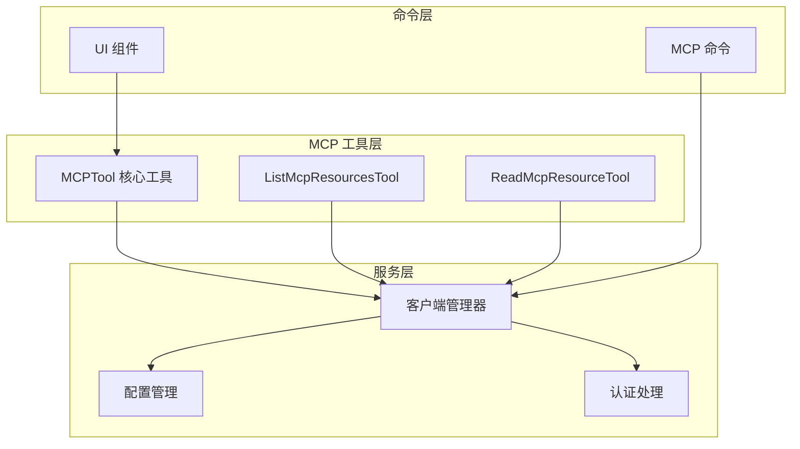
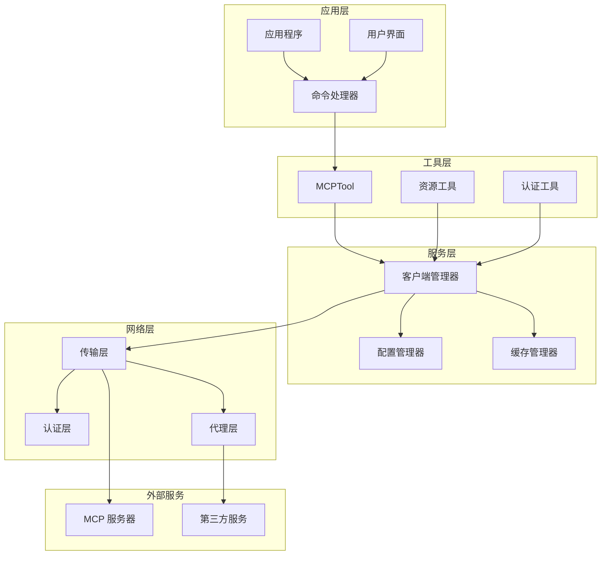
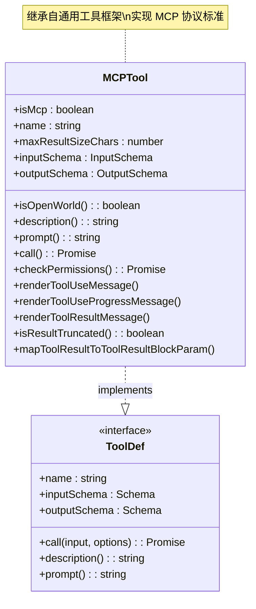
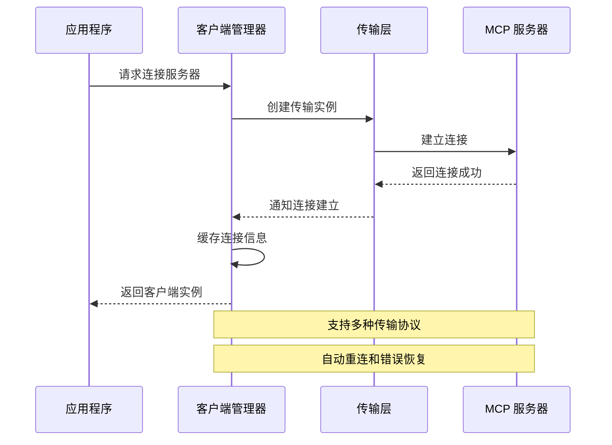
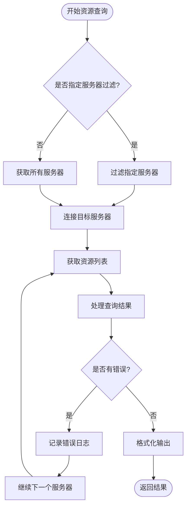
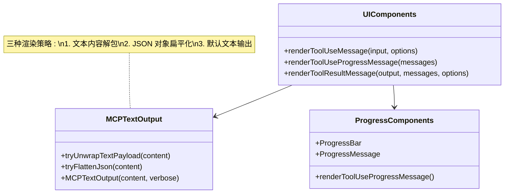
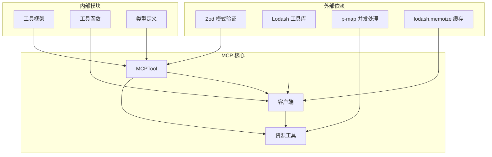

# MCP 工具集成

<cite>
**本文档引用的文件**
- [MCPTool.ts](file://src/tools/MCPTool/MCPTool.ts)
- [client.ts](file://src/services/mcp/client.ts)
- [ListMcpResourcesTool.ts](file://src/tools/ListMcpResourcesTool/ListMcpResourcesTool.ts)
- [ReadMcpResourceTool.ts](file://src/tools/ReadMcpResourceTool/ReadMcpResourceTool.ts)
- [mcp.tsx](file://src/commands/mcp/mcp.tsx)
- [config.ts](file://src/services/mcp/config.ts)
- [UI.tsx](file://src/tools/MCPTool/UI.tsx)
- [prompt.ts](file://src/tools/MCPTool/prompt.ts)
</cite>

## 目录
1. [简介](#简介)
2. [项目结构](#项目结构)
3. [核心组件](#核心组件)
4. [架构概览](#架构概览)
5. [详细组件分析](#详细组件分析)
6. [依赖关系分析](#依赖关系分析)
7. [性能考虑](#性能考虑)
8. [故障排除指南](#故障排除指南)
9. [结论](#结论)

## 简介

MCP（Model Context Protocol）工具集成为 Claude Code 平台提供了强大的第三方工具集成能力。该系统允许开发者将各种外部工具和服务无缝集成到 Claude Code 的工作流中，通过标准化的协议实现工具调用、资源管理和权限控制。

本技术文档深入解析了 MCP 工具集成的核心架构，包括工具包装机制、参数映射、资源发现和动态内容获取等功能。文档涵盖了从底层连接管理到上层工具使用的完整技术栈，为开发者提供了全面的 MCP 工具开发和集成指南。

## 项目结构

MCP 工具集成在代码库中采用模块化设计，主要分布在以下目录结构中：

**图表来源**
- [MCPTool.ts:1-78](file://src/tools/MCPTool/MCPTool.ts#L1-L78)
- [client.ts:1-120](file://src/services/mcp/client.ts#L1-L120)
- [config.ts:1-80](file://src/services/mcp/config.ts#L1-L80)

**章节来源**
- [MCPTool.ts:1-78](file://src/tools/MCPTool/MCPTool.ts#L1-L78)
- [client.ts:1-120](file://src/services/mcp/client.ts#L1-L120)
- [config.ts:1-80](file://src/services/mcp/config.ts#L1-L80)

## 核心组件

### MCPTool 核心工具

MCPTool 是整个 MCP 集成系统的核心，它继承自通用工具框架，实现了 MCP 协议的标准化封装。

**关键特性：**
- **灵活的输入输出模式**：使用宽松的输入模式允许 MCP 工具定义自己的参数结构
- **统一的工具接口**：提供标准化的工具调用、权限检查和结果渲染接口
- **进度跟踪支持**：内置对 MCP 进度消息的处理和显示
- **结果截断检测**：自动检测和处理超长输出结果

**章节来源**
- [MCPTool.ts:1-78](file://src/tools/MCPTool/MCPTool.ts#L1-L78)

### 客户端管理器

客户端管理器负责维护与 MCP 服务器的连接状态，处理各种传输协议，并提供统一的工具调用接口。

**核心功能：**
- **多协议支持**：同时支持 SSE、HTTP、WebSocket 和 STDIO 等多种传输方式
- **连接池管理**：实现连接的缓存、复用和自动重连机制
- **认证处理**：集成 OAuth 认证和代理服务器支持
- **错误恢复**：提供完整的错误检测和恢复策略

**章节来源**
- [client.ts:1-200](file://src/services/mcp/client.ts#L1-L200)

### 资源管理工具

系统提供了专门的工具来管理 MCP 服务器的资源发现和内容读取功能。

**功能特性：**
- **资源列表查询**：枚举所有已连接 MCP 服务器的可用资源
- **动态内容获取**：按需读取特定资源的内容，支持二进制和文本内容
- **智能缓存**：实现 LRU 缓存机制，避免重复请求
- **错误隔离**：单个服务器的连接失败不会影响其他服务器的操作

**章节来源**
- [ListMcpResourcesTool.ts:1-124](file://src/tools/ListMcpResourcesTool/ListMcpResourcesTool.ts#L1-L124)
- [ReadMcpResourceTool.ts:1-159](file://src/tools/ReadMcpResourceTool/ReadMcpResourceTool.ts#L1-L159)

## 架构概览

MCP 工具集成采用分层架构设计，确保了系统的可扩展性和可维护性：

**图表来源**
- [client.ts:595-784](file://src/services/mcp/client.ts#L595-L784)
- [config.ts:536-551](file://src/services/mcp/config.ts#L536-L551)

## 详细组件分析

### MCPTool 实现分析

MCPTool 作为核心工具类，实现了完整的 MCP 协议支持：

**图表来源**
- [MCPTool.ts:27-77](file://src/tools/MCPTool/MCPTool.ts#L27-L77)

**实现特点：**
- **延迟模式**：使用 `lazySchema` 实现输入输出模式的延迟加载
- **权限控制**：提供统一的权限检查接口
- **结果处理**：内置输出截断检测和结果映射功能
- **UI 集成**：提供完整的工具使用和结果展示接口

**章节来源**
- [MCPTool.ts:1-78](file://src/tools/MCPTool/MCPTool.ts#L1-L78)

### 客户端连接管理

客户端管理器是 MCP 系统的核心协调者，负责处理各种连接场景：

**图表来源**
- [client.ts:595-784](file://src/services/mcp/client.ts#L595-L784)

**连接特性：**
- **多协议支持**：SSE、HTTP、WebSocket、STDIO、IDE 专用协议
- **智能重连**：自动检测连接失败并尝试重新建立连接
- **会话管理**：处理会话过期和令牌刷新
- **性能优化**：连接池和缓存机制减少资源消耗

**章节来源**
- [client.ts:595-1599](file://src/services/mcp/client.ts#L595-L1599)

### 资源管理实现

资源管理工具提供了完整的资源发现和内容获取功能：

**图表来源**
- [ListMcpResourcesTool.ts:66-101](file://src/tools/ListMcpResourcesTool/ListMcpResourcesTool.ts#L66-L101)

**功能特性：**
- **并发处理**：支持多个服务器的并行资源查询
- **错误隔离**：单个服务器的失败不影响整体操作
- **智能缓存**：利用 LRU 缓存机制提高响应速度
- **结果聚合**：将多个服务器的结果合并为统一格式

**章节来源**
- [ListMcpResourcesTool.ts:1-124](file://src/tools/ListMcpResourcesTool/ListMcpResourcesTool.ts#L1-L124)

### UI 渲染系统

MCP 工具的 UI 渲染系统提供了丰富的可视化支持：

**图表来源**
- [UI.tsx:38-150](file://src/tools/MCPTool/UI.tsx#L38-L150)

**渲染策略：**
- **智能内容解包**：自动识别和解包常见的 MCP 输出格式
- **JSON 对象扁平化**：将复杂的 JSON 结构转换为易读的键值对
- **进度条显示**：提供可视化的进度反馈
- **大输出警告**：对可能填充上下文的大输出进行警告提示

**章节来源**
- [UI.tsx:1-403](file://src/tools/MCPTool/UI.tsx#L1-L403)

## 依赖关系分析

MCP 工具集成系统具有清晰的依赖层次结构：

**图表来源**
- [MCPTool.ts:1-6](file://src/tools/MCPTool/MCPTool.ts#L1-L6)
- [client.ts:38-42](file://src/services/mcp/client.ts#L38-L42)

**依赖特点：**
- **最小化外部依赖**：仅使用必要的第三方库
- **模块化设计**：各组件职责明确，耦合度低
- **类型安全**：广泛使用 TypeScript 提供编译时类型检查
- **可测试性**：良好的抽象层便于单元测试和集成测试

**章节来源**
- [MCPTool.ts:1-25](file://src/tools/MCPTool/MCPTool.ts#L1-L25)
- [client.ts:1-42](file://src/services/mcp/client.ts#L1-L42)

## 性能考虑

MCP 工具集成系统在设计时充分考虑了性能优化：

### 连接管理优化
- **连接池复用**：避免频繁创建和销毁连接
- **智能缓存策略**：LRU 缓存减少重复请求
- **批量操作支持**：支持多个服务器的并发处理

### 内存管理
- **流式处理**：大文件和长输出采用流式处理
- **内存泄漏防护**：完善的事件监听器清理机制
- **字符串长度限制**：防止超大字符串导致的内存问题

### 网络优化
- **连接超时控制**：合理的超时设置避免资源占用
- **重连策略**：指数退避的重连算法
- **代理支持**：透明的代理服务器支持

## 故障排除指南

### 常见问题诊断

**连接问题排查：**
1. **检查服务器可达性**：确认 MCP 服务器地址正确且可访问
2. **验证认证配置**：检查 OAuth 令牌和代理设置
3. **查看连接日志**：分析连接失败的具体原因

**工具调用问题：**
1. **参数验证**：确认输入参数符合工具要求
2. **权限检查**：验证工具权限配置
3. **输出处理**：检查结果截断和格式化设置

**性能问题诊断：**
1. **监控连接数**：避免过多并发连接
2. **检查缓存命中率**：优化缓存策略
3. **分析内存使用**：监控内存增长趋势

### 调试技巧

**启用详细日志：**
- 设置环境变量 `DEBUG=MCP:*` 获取详细调试信息
- 使用 `logMCPDebug` 函数输出关键路径的日志
- 分析连接建立和断开的时间戳

**性能监控：**
- 监控工具调用的响应时间
- 跟踪内存使用情况
- 分析网络请求的频率和大小

**章节来源**
- [client.ts:1080-1155](file://src/services/mcp/client.ts#L1080-L1155)
- [config.ts:618-761](file://src/services/mcp/config.ts#L618-L761)

## 结论

MCP 工具集成为 Claude Code 平台提供了强大而灵活的第三方工具集成能力。通过模块化的架构设计、完善的错误处理机制和性能优化策略，该系统能够稳定地支持各种 MCP 服务器和工具。

**主要优势：**
- **标准化协议**：基于 MCP 规范实现，确保兼容性
- **多协议支持**：支持多种传输协议满足不同场景需求
- **智能缓存**：优化性能减少不必要的网络请求
- **完善的错误处理**：提供健壮的错误检测和恢复机制

**未来发展建议：**
- 扩展更多传输协议的支持
- 增强工具权限管理的细粒度控制
- 优化大规模并发场景下的性能表现
- 提供更丰富的调试和监控工具

该 MCP 工具集成系统为开发者提供了一个可靠的平台，可以轻松地将各种外部工具和服务集成到 Claude Code 中，大大扩展了平台的功能边界和应用场景。