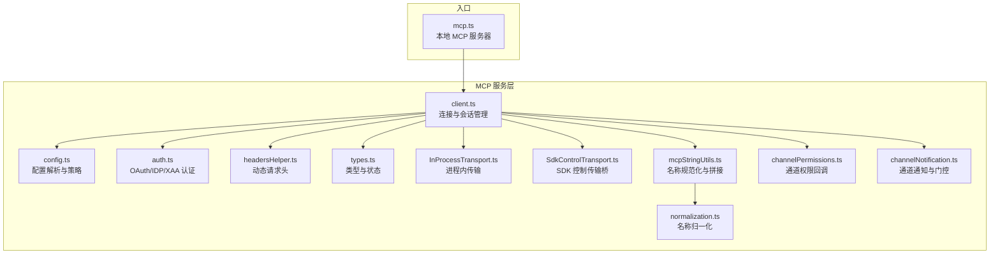
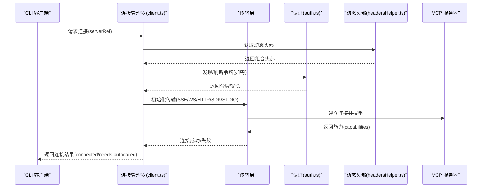
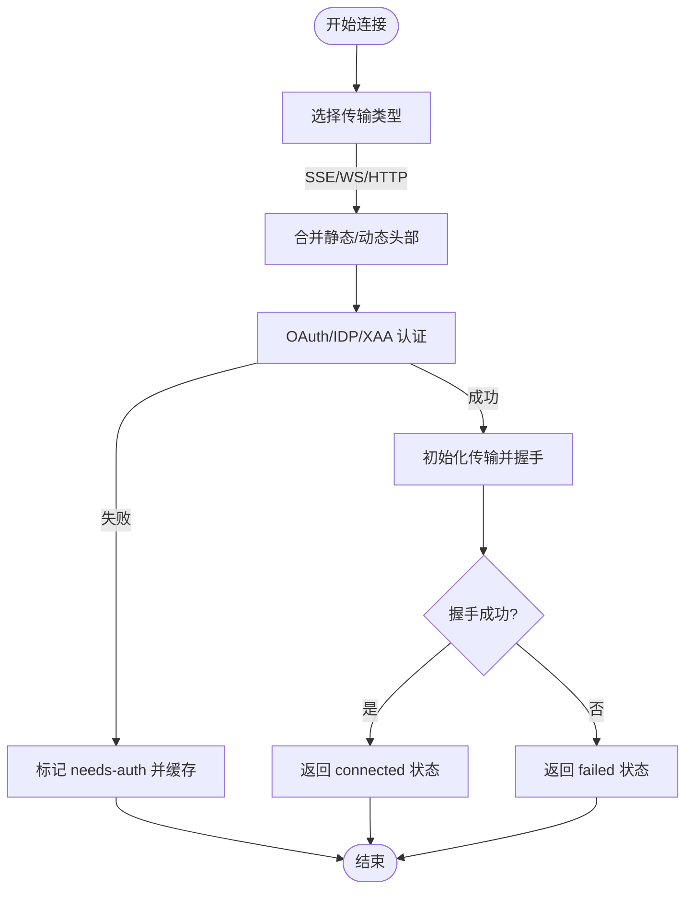
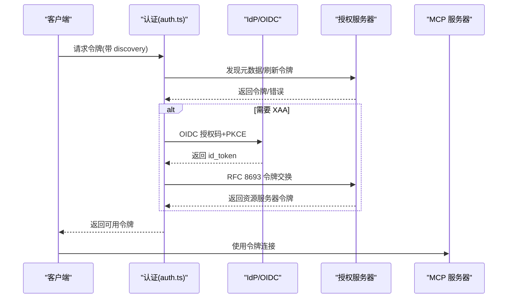
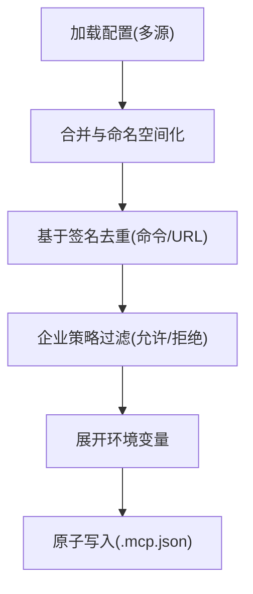
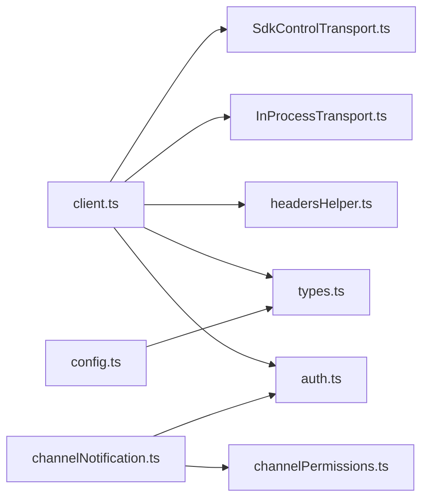

# MCP 连接管理

<cite>
**本文引用的文件**
- [client.ts](file://src/services/mcp/client.ts)
- [config.ts](file://src/services/mcp/config.ts)
- [auth.ts](file://src/services/mcp/auth.ts)
- [types.ts](file://src/services/mcp/types.ts)
- [headersHelper.ts](file://src/services/mcp/headersHelper.ts)
- [InProcessTransport.ts](file://src/services/mcp/InProcessTransport.ts)
- [SdkControlTransport.ts](file://src/services/mcp/SdkControlTransport.ts)
- [mcpStringUtils.ts](file://src/services/mcp/mcpStringUtils.ts)
- [normalization.ts](file://src/services/mcp/normalization.ts)
- [mcp.ts](file://src/entrypoints/mcp.ts)
- [channelPermissions.ts](file://src/services/mcp/channelPermissions.ts)
- [channelNotification.ts](file://src/services/mcp/channelNotification.ts)
</cite>

## 目录
1. [简介](#简介)
2. [项目结构](#项目结构)
3. [核心组件](#核心组件)
4. [架构总览](#架构总览)
5. [详细组件分析](#详细组件分析)
6. [依赖关系分析](#依赖关系分析)
7. [性能考量](#性能考量)
8. [故障排查指南](#故障排查指南)
9. [结论](#结论)
10. [附录](#附录)

## 简介
本文件系统性阐述 MCP（Model Context Protocol）连接管理的设计与实现，覆盖连接池与会话生命周期、连接建立流程、心跳与断线重连、认证与授权、安全令牌管理、配置与重连策略、超时处理、并发与负载均衡、健康检查、监控与指标、故障诊断与最佳实践。目标读者包括需要集成或维护 MCP 客户端的工程师与高级用户。

## 项目结构
围绕 MCP 的连接管理，核心代码位于 src/services/mcp 目录，涵盖客户端连接、配置解析、认证、传输桥接、通道通知与权限、以及工具名规范化等模块；入口点在 src/entrypoints/mcp.ts 中提供本地 MCP 服务器能力。



**图表来源**
- [client.ts](file://src/services/mcp/client.ts)
- [config.ts](file://src/services/mcp/config.ts)
- [auth.ts](file://src/services/mcp/auth.ts)
- [headersHelper.ts](file://src/services/mcp/headersHelper.ts)
- [types.ts](file://src/services/mcp/types.ts)
- [InProcessTransport.ts](file://src/services/mcp/InProcessTransport.ts)
- [SdkControlTransport.ts](file://src/services/mcp/SdkControlTransport.ts)
- [mcpStringUtils.ts](file://src/services/mcp/mcpStringUtils.ts)
- [normalization.ts](file://src/services/mcp/normalization.ts)
- [channelPermissions.ts](file://src/services/mcp/channelPermissions.ts)
- [channelNotification.ts](file://src/services/mcp/channelNotification.ts)
- [mcp.ts](file://src/entrypoints/mcp.ts)

**章节来源**
- [client.ts](file://src/services/mcp/client.ts)
- [config.ts](file://src/services/mcp/config.ts)
- [auth.ts](file://src/services/mcp/auth.ts)
- [headersHelper.ts](file://src/services/mcp/headersHelper.ts)
- [types.ts](file://src/services/mcp/types.ts)
- [InProcessTransport.ts](file://src/services/mcp/InProcessTransport.ts)
- [SdkControlTransport.ts](file://src/services/mcp/SdkControlTransport.ts)
- [mcpStringUtils.ts](file://src/services/mcp/mcpStringUtils.ts)
- [normalization.ts](file://src/services/mcp/normalization.ts)
- [channelPermissions.ts](file://src/services/mcp/channelPermissions.ts)
- [channelNotification.ts](file://src/services/mcp/channelNotification.ts)
- [mcp.ts](file://src/entrypoints/mcp.ts)

## 核心组件
- 连接客户端与会话管理：负责连接建立、超时控制、错误分类、认证失败处理、批量连接与缓存键生成。
- 配置系统：解析与合并多源配置、去重策略、企业策略（允许/拒绝列表）、环境变量展开、签名去重。
- 认证与授权：OAuth 发现、令牌刷新、跨应用访问（XAA）、IDP 登录、令牌撤销、步骤提升（step-up）。
- 传输层桥接：进程内传输、SDK 控制传输桥、WebSocket/SSE/HTTP 传输封装。
- 动态请求头：通过外部脚本获取动态头部并进行安全校验。
- 名称与权限：工具/服务器名称规范化、权限规则匹配、通道通知与权限回调。
- 入口与本地服务器：提供本地 MCP 服务器能力，暴露工具清单与调用。

**章节来源**
- [client.ts](file://src/services/mcp/client.ts)
- [config.ts](file://src/services/mcp/config.ts)
- [auth.ts](file://src/services/mcp/auth.ts)
- [headersHelper.ts](file://src/services/mcp/headersHelper.ts)
- [types.ts](file://src/services/mcp/types.ts)
- [InProcessTransport.ts](file://src/services/mcp/InProcessTransport.ts)
- [SdkControlTransport.ts](file://src/services/mcp/SdkControlTransport.ts)
- [mcpStringUtils.ts](file://src/services/mcp/mcpStringUtils.ts)
- [normalization.ts](file://src/services/mcp/normalization.ts)
- [channelPermissions.ts](file://src/services/mcp/channelPermissions.ts)
- [channelNotification.ts](file://src/services/mcp/channelNotification.ts)
- [mcp.ts](file://src/entrypoints/mcp.ts)

## 架构总览
下图展示 MCP 客户端与各类服务器的交互路径，包括本地进程内、SDK 控制桥、远端 WebSocket/SSE/HTTP，以及认证与动态头部注入。



**图表来源**
- [client.ts](file://src/services/mcp/client.ts)
- [auth.ts](file://src/services/mcp/auth.ts)
- [headersHelper.ts](file://src/services/mcp/headersHelper.ts)
- [types.ts](file://src/services/mcp/types.ts)

## 详细组件分析

### 连接管理与会话生命周期
- 连接建立流程
  - 根据配置类型选择传输：SSE、WS、HTTP、IDE SSE/WS、SDK、STDIO。
  - 对远端连接注入动态头部与用户代理，并按 MCP 规范设置 Accept 头。
  - WebSocket 支持代理与 mTLS TLS 选项；SSE 使用独立 EventSource fetch（无请求超时）。
  - 支持会话入口令牌（session ingress JWT）直连远端服务器。
- 超时与请求控制
  - 单请求超时采用每请求独立的 AbortController，避免单信号过期问题。
  - GET 请求不加超时（长连接 SSE 流），POST/PUT/DELETE 加 60 秒超时。
  - 工具调用超时可通过环境变量覆盖，默认约 27.8 小时。
- 错误分类与处理
  - 认证失败（401）：记录“需要认证”状态并写入缓存，触发 UI 提示。
  - 会话过期（HTTP 404 + 特定 JSON-RPC 代码）：抛出特定错误以便上层重建客户端。
  - 工具调用错误携带元数据（_meta），便于分析与回溯。
- 批量连接与并发
  - 支持批量连接大小配置，本地与远程默认不同值。
  - 连接缓存键由服务器名与配置序列化组成，避免重复连接。
- 断线重连与健康检查
  - 连接状态枚举：connected/failed/needs-auth/pending/disabled。
  - 重连尝试次数与状态可选字段存在；结合“需要认证”缓存与策略使用。
  - 健康检查通过连接状态与错误类型推断，配合日志与指标上报。



**图表来源**
- [client.ts](file://src/services/mcp/client.ts)
- [headersHelper.ts](file://src/services/mcp/headersHelper.ts)
- [auth.ts](file://src/services/mcp/auth.ts)
- [types.ts](file://src/services/mcp/types.ts)

**章节来源**
- [client.ts](file://src/services/mcp/client.ts)
- [types.ts](file://src/services/mcp/types.ts)

### 认证与授权（OAuth 2.0、API 密钥、JWT、XAA）
- OAuth 发现与刷新
  - 支持 RFC 9728 → RFC 8414 自动发现授权服务器元数据。
  - 每次认证请求使用独立超时信号，避免缓存过期导致的全局信号失效。
  - 对非标准错误体进行标准化（如 invalid_refresh_token 归一化为 invalid_grant）。
- 令牌管理
  - 令牌撤销遵循 RFC 7009，优先使用合规方式，失败后回退到 Bearer 方式。
  - 清理本地令牌与保留步骤提升状态（scope/discovery）以支持静默重认证。
- 跨应用访问（XAA）
  - 统一 IdP 登录（可复用 id_token 缓存），随后执行 RFC 8693 + RFC 7523 交换。
  - 严格区分 IdP 与 AS 客户端密钥域，避免混淆。
- IDP 与 OIDC
  - 支持 OIDC 发现与 IdP 客户端密钥存储，失败阶段可清理缓存以避免循环失败。
- 步骤提升（Step-Up）
  - 在重新认证时保留已探测的 scope 与 discovery 信息，减少后续握手成本。



**图表来源**
- [auth.ts](file://src/services/mcp/auth.ts)

**章节来源**
- [auth.ts](file://src/services/mcp/auth.ts)

### 配置与策略（去重、企业策略、环境变量展开）
- 配置来源与合并
  - 支持项目级、用户级、本地级、动态、企业、claude.ai 等多源配置。
  - 插件提供的服务器命名空间化，避免与手动配置冲突。
- 去重策略
  - 基于命令数组或 URL（含 CCR 代理 URL 解包）签名去重，先加载者优先。
  - 手动配置优先于 claude.ai 连接器，避免重复连接。
- 企业策略
  - 允许/拒绝列表支持名称、命令、URL 三类条目，支持通配符 URL 匹配。
  - 空允许列表直接阻断所有服务器，拒绝列表优先于允许列表。
- 环境变量展开
  - 字符串中的环境变量自动展开，缺失变量收集并报告。
- 写入策略
  - .mcp.json 原子写入（临时文件 + rename），保留文件权限。



**图表来源**
- [config.ts](file://src/services/mcp/config.ts)

**章节来源**
- [config.ts](file://src/services/mcp/config.ts)

### 传输层桥接（进程内与 SDK 控制桥）
- 进程内传输
  - 双向链路传输，消息异步投递，避免同步调用栈过深。
  - 关闭时双向 onclose 回调，确保对端感知。
- SDK 控制传输桥
  - CLI 侧 SdkControlClientTransport 将 MCP 请求包装为控制消息发送至 SDK。
  - SDK 侧 SdkControlServerTransport 将响应通过回调返回给 CLI。
  - 支持多 SDK 服务器并行运行，通过 server_name 路由。

```mermaid
classDiagram
class InProcessTransport {
-peer : InProcessTransport
-closed : boolean
+start()
+send(message)
+close()
}
class SdkControlClientTransport {
-serverName : string
-sendMcpMessage(message)
+start()
+send(message)
+close()
}
class SdkControlServerTransport {
-sendMcpMessage(message)
+start()
+send(message)
+close()
}
InProcessTransport <---> InProcessTransport : "peer"
SdkControlClientTransport --> SdkControlServerTransport : "控制桥"
```

**图表来源**
- [InProcessTransport.ts](file://src/services/mcp/InProcessTransport.ts)
- [SdkControlTransport.ts](file://src/services/mcp/SdkControlTransport.ts)

**章节来源**
- [InProcessTransport.ts](file://src/services/mcp/InProcessTransport.ts)
- [SdkControlTransport.ts](file://src/services/mcp/SdkControlTransport.ts)

### 动态请求头与安全校验
- 动态头部来源
  - 通过 headersHelper 脚本输出 JSON 对象，键值均为字符串。
  - 支持传入服务器上下文变量（名称、URL）以复用单一脚本服务多个服务器。
- 安全校验
  - 项目/本地设置的动态头部需先完成工作区信任确认，否则拒绝执行。
  - 执行超时限制、返回值校验、错误日志与事件上报。

**章节来源**
- [headersHelper.ts](file://src/services/mcp/headersHelper.ts)

### 名称规范化与权限匹配
- 名称规范化
  - 将非法字符替换为下划线，Claude.ai 服务器名进一步折叠连续下划线并去除首尾下划线。
- 工具/服务器名称拼接
  - 生成前缀 mcp__server__，构建完整工具名；显示名提取去除前缀与 (MCP) 后缀。
- 权限匹配
  - 对 MCP 工具使用完全限定名进行权限规则匹配，避免内置工具误伤。

**章节来源**
- [mcpStringUtils.ts](file://src/services/mcp/mcpStringUtils.ts)
- [normalization.ts](file://src/services/mcp/normalization.ts)

### 通道通知与权限回调
- 通道通知
  - 服务器声明 experimental['claude/channel'] 后，可推送 inbound 消息到会话。
  - 内容包裹 <channel> XML 标签并附加元信息属性，支持安全键过滤。
- 权限回调
  - 服务器声明 experimental['claude/channel/permission'] 后，可结构化接收权限回复。
  - 使用短 ID 与正则规范，避免文本误触批准。
- 门控策略
  - 能力 → 运行开关 → 认证（OAuth）→ 组织策略 → 会话 --channels → 白名单。

**章节来源**
- [channelNotification.ts](file://src/services/mcp/channelNotification.ts)
- [channelPermissions.ts](file://src/services/mcp/channelPermissions.ts)

### 本地 MCP 服务器入口
- 提供 STDIO 传输的本地 MCP 服务器，暴露工具清单与调用。
- 输入/输出模式转换为 JSON Schema，输出内容统一为文本块。
- 支持中止控制器、调试与详细日志。

**章节来源**
- [mcp.ts](file://src/entrypoints/mcp.ts)

## 依赖关系分析
- 模块耦合
  - client.ts 依赖 auth.ts、headersHelper.ts、types.ts、InProcessTransport.ts、SdkControlTransport.ts。
  - config.ts 依赖 types.ts、utils（配置/策略/插件）。
  - channelNotification.ts 依赖 channelPermissions.ts、auth.ts、settings。
- 外部依赖
  - MCP SDK（client/server/transport/types）。
  - ws、axios、锁文件、安全存储、平台工具。



**图表来源**
- [client.ts](file://src/services/mcp/client.ts)
- [config.ts](file://src/services/mcp/config.ts)
- [auth.ts](file://src/services/mcp/auth.ts)
- [headersHelper.ts](file://src/services/mcp/headersHelper.ts)
- [types.ts](file://src/services/mcp/types.ts)
- [InProcessTransport.ts](file://src/services/mcp/InProcessTransport.ts)
- [SdkControlTransport.ts](file://src/services/mcp/SdkControlTransport.ts)
- [channelPermissions.ts](file://src/services/mcp/channelPermissions.ts)
- [channelNotification.ts](file://src/services/mcp/channelNotification.ts)

**章节来源**
- [client.ts](file://src/services/mcp/client.ts)
- [config.ts](file://src/services/mcp/config.ts)
- [auth.ts](file://src/services/mcp/auth.ts)
- [headersHelper.ts](file://src/services/mcp/headersHelper.ts)
- [types.ts](file://src/services/mcp/types.ts)
- [InProcessTransport.ts](file://src/services/mcp/InProcessTransport.ts)
- [SdkControlTransport.ts](file://src/services/mcp/SdkControlTransport.ts)
- [channelPermissions.ts](file://src/services/mcp/channelPermissions.ts)
- [channelNotification.ts](file://src/services/mcp/channelNotification.ts)

## 性能考量
- 连接缓存与去重
  - 基于服务器名与配置序列化生成缓存键，避免重复连接。
  - 批量连接大小可配置，降低握手开销。
- 请求超时与内存
  - 每请求独立超时信号，避免全局信号泄漏导致内存占用。
  - SSE 长连接不设超时，避免频繁中断。
- 并发与队列
  - p-map 并发工具调用，结合批量连接策略。
- 日志与指标
  - 分析事件埋点（如 needs-auth、proxy 401 等）用于性能与稳定性观测。

[本节为通用指导，无需具体文件引用]

## 故障排查指南
- 常见错误与定位
  - 401 未授权：检查 OAuth 令牌是否有效或过期，查看“需要认证”缓存与重试逻辑。
  - 404 会话不存在：确认会话 ID 是否有效，必要时重建客户端。
  - 403/406：检查认证提供者与 Accept 头设置，确保符合 MCP 规范。
  - 代理/网络问题：检查代理配置与 TLS 选项，确认 EventSource 与 WebSocket 代理参数。
- 认证问题
  - OAuth 发现失败：检查授权服务器元数据 URL 与网络可达性。
  - XAA 失败：检查 IdP 客户端密钥、AS 客户端密钥与交换阶段错误。
- 动态头部
  - 脚本未返回 JSON 或非字符串值：修正 headersHelper 输出格式。
  - 未完成信任确认：先完成工作区信任再执行动态头部脚本。
- 日志与事件
  - 使用分析事件键（如 needs-auth、proxy 401）辅助定位问题。

**章节来源**
- [client.ts](file://src/services/mcp/client.ts)
- [auth.ts](file://src/services/mcp/auth.ts)
- [headersHelper.ts](file://src/services/mcp/headersHelper.ts)

## 结论
该 MCP 连接管理方案以模块化设计实现高扩展性与安全性：通过多源配置与企业策略保障可控接入，借助 OAuth/XAA/IDP 提供灵活认证路径，利用传输桥接支持本地与 SDK 场景，配合动态头部与权限门控强化安全边界。建议在生产环境中启用企业策略、合理设置批量与超时参数、持续监控分析事件并定期轮换令牌与清理缓存。

[本节为总结，无需具体文件引用]

## 附录

### 连接配置示例（要点）
- 服务器类型
  - stdio：本地可执行命令与参数。
  - sse/http/ws：远端 URL 与可选静态/动态头部。
  - sse-ide/ws-ide：IDE 内部通道（无需认证）。
  - sdk：SDK 内部占位，路由到 SDK 进程。
  - claudeai-proxy：通过 claude.ai 代理访问。
- 认证
  - OAuth：clientId、callbackPort、authServerMetadataUrl。
  - XAA：oauth.xaa=true + AS 客户端凭据。
  - API 密钥/JWT：通过 headers 或会话入口令牌注入。
- 动态头部
  - headersHelper 脚本输出 JSON 对象，键值字符串，支持工作区信任校验。

**章节来源**
- [types.ts](file://src/services/mcp/types.ts)
- [headersHelper.ts](file://src/services/mcp/headersHelper.ts)
- [auth.ts](file://src/services/mcp/auth.ts)

### 重连策略与超时处理
- 重连
  - pending 状态包含重连尝试计数与最大尝试次数字段，结合 needs-auth 缓存策略使用。
- 超时
  - 单请求 60 秒超时（GET 不超时），工具调用默认约 27.8 小时，可通过环境变量覆盖。
  - 连接超时默认 30 秒，可通过环境变量覆盖。

**章节来源**
- [client.ts](file://src/services/mcp/client.ts)

### 并发管理与负载均衡
- 并发
  - 批量连接大小可配置，本地默认较小，远程默认较大。
- 负载均衡
  - 通过去重与策略过滤避免重复连接，结合企业策略限制服务器数量与来源。

**章节来源**
- [config.ts](file://src/services/mcp/config.ts)
- [client.ts](file://src/services/mcp/client.ts)

### 连接监控与性能指标
- 指标
  - needs-auth、proxy 401、OAuth 刷新失败等分析事件键。
- 监控
  - 结合日志与事件键观察连接成功率、认证失败率、超时分布。

**章节来源**
- [client.ts](file://src/services/mcp/client.ts)
- [auth.ts](file://src/services/mcp/auth.ts)

### 最佳实践
- 企业策略
  - 明确允许/拒绝列表，避免未知来源服务器接入。
- 认证
  - 优先使用 OAuth/XAA，定期轮换密钥与令牌，启用步骤提升。
- 安全
  - 动态头部仅在信任工作区后执行；严格校验 headersHelper 输出。
- 可靠性
  - 设置合理的批量与超时参数；监控分析事件并及时告警。

**章节来源**
- [config.ts](file://src/services/mcp/config.ts)
- [auth.ts](file://src/services/mcp/auth.ts)
- [headersHelper.ts](file://src/services/mcp/headersHelper.ts)
- [client.ts](file://src/services/mcp/client.ts)