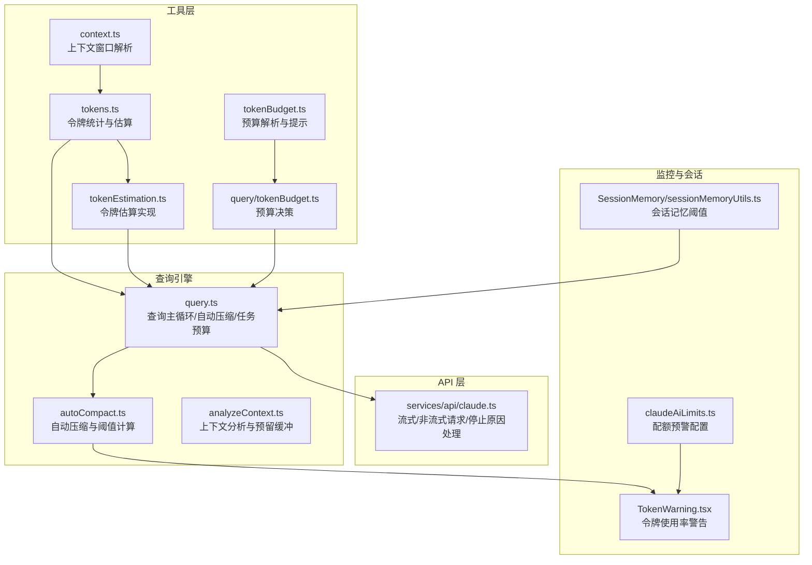
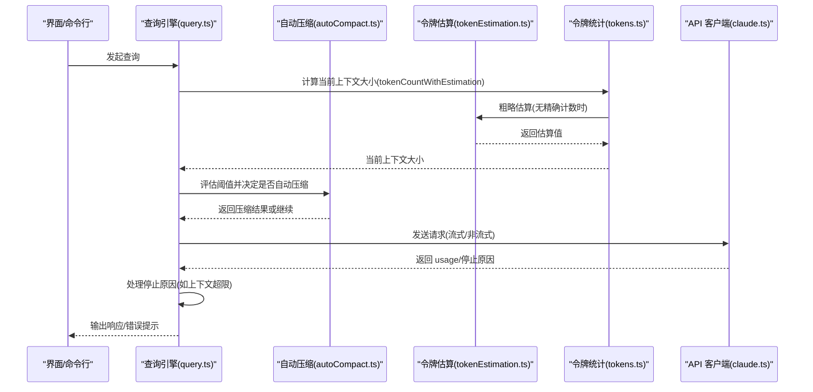
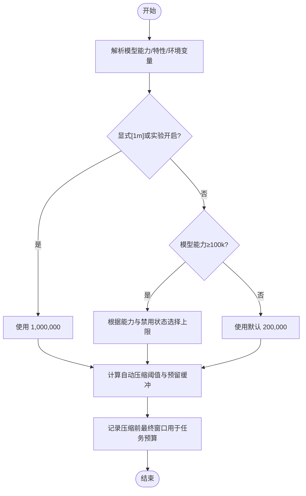
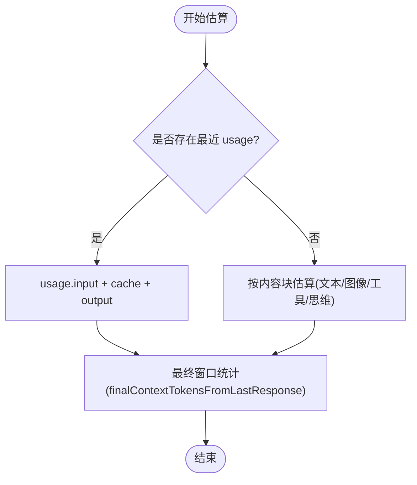
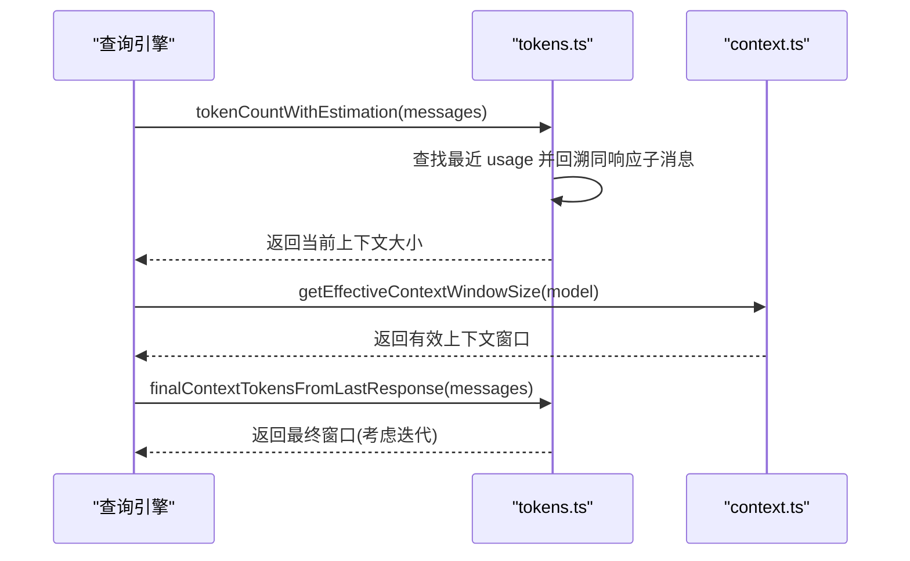
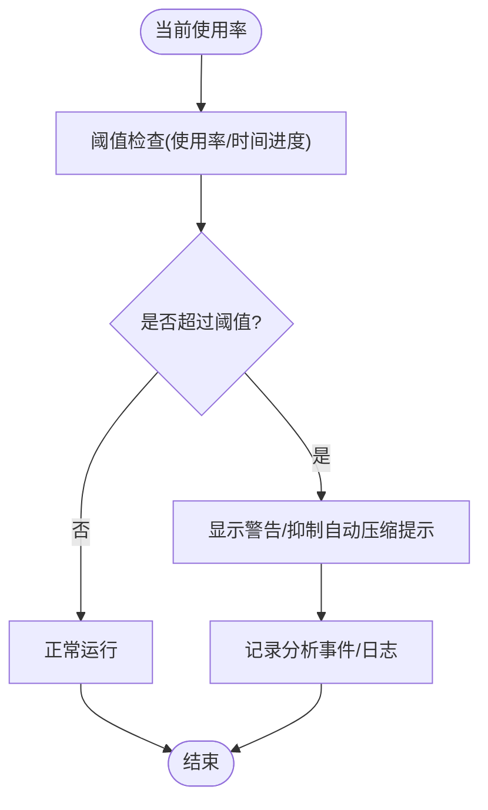
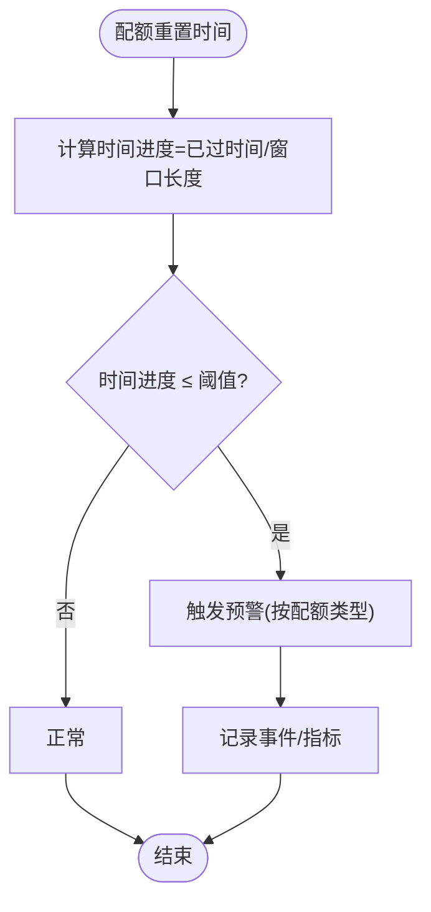
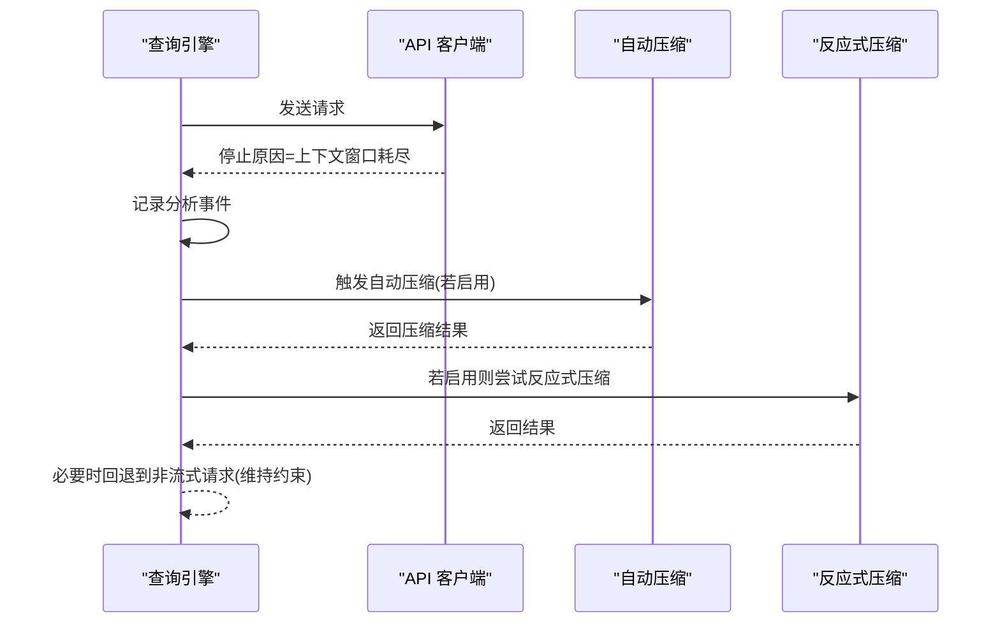
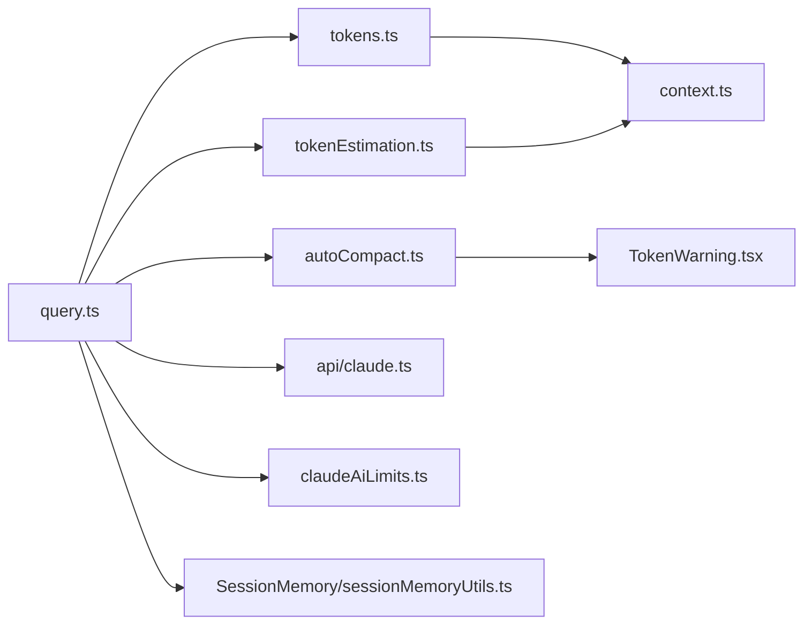

# 上下文窗口管理

<cite>
**本文引用的文件**
- [src/utils/context.ts](file://src/utils/context.ts)
- [src/utils/tokens.ts](file://src/utils/tokens.ts)
- [src/services/tokenEstimation.ts](file://src/services/tokenEstimation.ts)
- [src/query.ts](file://src/query.ts)
- [src/services/api/claude.ts](file://src/services/api/claude.ts)
- [src/services/compact/autoCompact.ts](file://src/services/compact/autoCompact.ts)
- [src/components/TokenWarning.tsx](file://src/components/TokenWarning.tsx)
- [src/services/claudeAiLimits.ts](file://src/services/claudeAiLimits.ts)
- [src/utils/analyzeContext.ts](file://src/utils/analyzeContext.ts)
- [src/services/SessionMemory/sessionMemoryUtils.ts](file://src/services/SessionMemory/sessionMemoryUtils.ts)
- [src/utils/tokenBudget.ts](file://src/utils/tokenBudget.ts)
- [src/query/tokenBudget.ts](file://src/query/tokenBudget.ts)
</cite>

## 目录
1. [简介](#简介)
2. [项目结构](#项目结构)
3. [核心组件](#核心组件)
4. [架构总览](#架构总览)
5. [详细组件分析](#详细组件分析)
6. [依赖关系分析](#依赖关系分析)
7. [性能考量](#性能考量)
8. [故障排查指南](#故障排查指南)
9. [结论](#结论)
10. [附录](#附录)

## 简介
本技术文档聚焦 Claude Code 的上下文窗口管理，系统性阐述以下主题：
- 上下文窗口预算分配与动态调整策略
- 令牌估算机制（含精确计数与粗略估算）
- 关键函数与流程：getEffectiveContextWindowSize、令牌预留策略、警告阈值管理
- 时间基配额预警与窗口使用率监控
- 性能优化建议、内存使用分析与调优方法
- 不同模型的窗口适配、API 限制处理与资源竞争管理
- 如何在上下文长度与响应质量之间取得平衡，以及窗口溢出错误的处理

## 项目结构
围绕上下文窗口管理的关键模块分布如下：
- 工具层：上下文窗口大小解析、令牌估算、最终窗口统计
- 查询引擎：查询循环、自动压缩触发、任务预算与窗口边界处理
- API 层：流式与非流式请求、停止原因与窗口溢出处理
- 警告与监控：令牌使用率阈值、时间基配额预警、UI 提示
- 会话记忆：会话记忆初始化与增长阈值与上下文窗口一致的度量

**图表来源**
- [src/utils/context.ts:1-222](file://src/utils/context.ts#L1-L222)
- [src/utils/tokens.ts:1-262](file://src/utils/tokens.ts#L1-L262)
- [src/services/tokenEstimation.ts:1-496](file://src/services/tokenEstimation.ts#L1-L496)
- [src/query.ts:500-699](file://src/query.ts#L500-L699)
- [src/services/api/claude.ts:2270-2469](file://src/services/api/claude.ts#L2270-L2469)
- [src/services/compact/autoCompact.ts:92-232](file://src/services/compact/autoCompact.ts#L92-L232)
- [src/components/TokenWarning.tsx:74-130](file://src/components/TokenWarning.tsx#L74-L130)
- [src/services/claudeAiLimits.ts:32-109](file://src/services/claudeAiLimits.ts#L32-L109)
- [src/utils/analyzeContext.ts:1106-1134](file://src/utils/analyzeContext.ts#L1106-L1134)
- [src/services/SessionMemory/sessionMemoryUtils.ts:170-180](file://src/services/SessionMemory/sessionMemoryUtils.ts#L170-L180)
- [src/utils/tokenBudget.ts:1-73](file://src/utils/tokenBudget.ts#L1-L73)
- [src/query/tokenBudget.ts:1-56](file://src/query/tokenBudget.ts#L1-L56)

**章节来源**
- [src/utils/context.ts:1-222](file://src/utils/context.ts#L1-L222)
- [src/utils/tokens.ts:1-262](file://src/utils/tokens.ts#L1-L262)
- [src/services/tokenEstimation.ts:1-496](file://src/services/tokenEstimation.ts#L1-L496)
- [src/query.ts:500-699](file://src/query.ts#L500-L699)
- [src/services/api/claude.ts:2270-2469](file://src/services/api/claude.ts#L2270-L2469)
- [src/services/compact/autoCompact.ts:92-232](file://src/services/compact/autoCompact.ts#L92-L232)
- [src/components/TokenWarning.tsx:74-130](file://src/components/TokenWarning.tsx#L74-L130)
- [src/services/claudeAiLimits.ts:32-109](file://src/services/claudeAiLimits.ts#L32-L109)
- [src/utils/analyzeContext.ts:1106-1134](file://src/utils/analyzeContext.ts#L1106-L1134)
- [src/services/SessionMemory/sessionMemoryUtils.ts:170-180](file://src/services/SessionMemory/sessionMemoryUtils.ts#L170-L180)
- [src/utils/tokenBudget.ts:1-73](file://src/utils/tokenBudget.ts#L1-L73)
- [src/query/tokenBudget.ts:1-56](file://src/query/tokenBudget.ts#L1-L56)

## 核心组件
- 上下文窗口解析与模型适配
  - 解析模型能力、环境变量与特性开关，确定有效上下文窗口大小；支持 [1m] 显式启用与实验性开启路径。
- 令牌估算与统计
  - 基于 API usage 数据与消息内容进行粗略估算；在无精确计数时提供保守估计，避免误判导致的自动压缩失效。
- 查询循环与自动压缩
  - 在每次迭代前评估当前上下文使用情况，必要时触发自动压缩；在任务预算场景中记录压缩前的最终窗口大小。
- 流式与非流式请求处理
  - 针对“达到上下文窗口”等停止原因进行统一处理，并在需要时回退到非流式请求。
- 警告与配额监控
  - 使用率阈值与时间基配额预警，结合 UI 提示与日志事件，帮助用户及时感知风险。

**章节来源**
- [src/utils/context.ts:51-98](file://src/utils/context.ts#L51-L98)
- [src/utils/tokens.ts:226-262](file://src/utils/tokens.ts#L226-L262)
- [src/services/tokenEstimation.ts:327-435](file://src/services/tokenEstimation.ts#L327-L435)
- [src/query.ts:500-699](file://src/query.ts#L500-L699)
- [src/services/api/claude.ts:2279-2292](file://src/services/api/claude.ts#L2279-L2292)
- [src/services/compact/autoCompact.ts:92-232](file://src/services/compact/autoCompact.ts#L92-L232)

## 架构总览
上下文窗口管理贯穿“工具层 → 查询引擎 → API 层 → 监控与会话”的全链路，形成闭环的预算分配、估算、阈值判断与动态调整。

**图表来源**
- [src/query.ts:500-699](file://src/query.ts#L500-L699)
- [src/services/compact/autoCompact.ts:92-232](file://src/services/compact/autoCompact.ts#L92-L232)
- [src/services/tokenEstimation.ts:327-435](file://src/services/tokenEstimation.ts#L327-L435)
- [src/utils/tokens.ts:226-262](file://src/utils/tokens.ts#L226-L262)
- [src/services/api/claude.ts:2279-2292](file://src/services/api/claude.ts#L2279-L2292)

## 详细组件分析

### 组件一：上下文窗口预算与动态调整
- 有效上下文窗口解析
  - 通过模型能力、环境变量与特性开关综合判定；支持显式 [1m] 启用与实验性路径；在禁用 1M 上下文时回退默认值。
- 令牌预留策略
  - 自动压缩阈值与“保留缓冲”相关；在特定实验模式下可跳过预留缓冲，以透明化压缩行为。
- 动态调整与任务预算
  - 在每次自动压缩后记录压缩前的最终窗口大小，用于任务预算剩余计算，确保预算扣减基于压缩前的实际上下文占用。

**图表来源**
- [src/utils/context.ts:51-98](file://src/utils/context.ts#L51-L98)
- [src/utils/analyzeContext.ts:1106-1134](file://src/utils/analyzeContext.ts#L1106-L1134)
- [src/query.ts:504-515](file://src/query.ts#L504-L515)

**章节来源**
- [src/utils/context.ts:51-98](file://src/utils/context.ts#L51-L98)
- [src/utils/analyzeContext.ts:1106-1134](file://src/utils/analyzeContext.ts#L1106-L1134)
- [src/query.ts:504-515](file://src/query.ts#L504-L515)

### 组件二：令牌估算机制
- 粗略估算
  - 基于字符长度与文件类型调整的字节/令牌比率进行估算；对图片、工具结果、思维块等采用保守估算，避免低估导致压缩不及时。
- API 精确计数
  - 优先使用 API 提供的 usage 输入令牌；在无可用 API 或特殊平台（如 Vertex/Bedrock）时，回退到使用轻量模型进行近似计数。
- 最终窗口统计
  - 结合 usage 中的迭代信息与顶层 usage，区分服务器侧工具循环场景，确保预算与统计口径一致。

**图表来源**
- [src/utils/tokens.ts:46-112](file://src/utils/tokens.ts#L46-L112)
- [src/services/tokenEstimation.ts:327-435](file://src/services/tokenEstimation.ts#L327-L435)

**章节来源**
- [src/utils/tokens.ts:46-112](file://src/utils/tokens.ts#L46-L112)
- [src/services/tokenEstimation.ts:327-435](file://src/services/tokenEstimation.ts#L327-L435)

### 组件三：getEffectiveContextWindowSize 与相关函数
- getEffectiveContextWindowSize
  - 该函数负责综合模型能力、特性开关与环境变量，返回当前会话的有效上下文窗口大小；在禁用 1M 上下文时回退默认值，确保安全边界。
- tokenCountWithEstimation
  - 在存在 usage 的情况下，以 usage 为基础并叠加自上次 usage 以来新增消息的粗略估算；在并行工具调用场景中，向前回溯至同一响应的首个子消息，避免漏估已交错的工具结果。
- finalContextTokensFromLastResponse
  - 在服务器侧工具循环场景中，取最后一次迭代的输入+输出作为最终窗口；否则直接使用顶层 usage 的输入+输出，保持与服务器端预算计数一致。

**图表来源**
- [src/utils/tokens.ts:226-262](file://src/utils/tokens.ts#L226-L262)
- [src/utils/context.ts:51-98](file://src/utils/context.ts#L51-L98)
- [src/utils/tokens.ts:79-112](file://src/utils/tokens.ts#L79-L112)

**章节来源**
- [src/utils/context.ts:51-98](file://src/utils/context.ts#L51-L98)
- [src/utils/tokens.ts:226-262](file://src/utils/tokens.ts#L226-L262)
- [src/utils/tokens.ts:79-112](file://src/utils/tokens.ts#L79-L112)

### 组件四：令牌预留策略与警告阈值管理
- 令牌预留策略
  - 在自动压缩启用且未处于特定实验模式时，预留缓冲等于“有效窗口 - 自动压缩阈值”，用于在 UI 与分析中直观展示“保留空间”。
- 警告阈值
  - 使用率阈值与时间进度阈值共同决定是否发出早期预警；当配额消耗速度超过时间窗口允许的速度时，触发警告。
- UI 与日志
  - TokenWarning 组件根据当前使用率与阈值显示提示；同时记录分析事件，便于诊断与优化。

**图表来源**
- [src/services/compact/autoCompact.ts:92-232](file://src/services/compact/autoCompact.ts#L92-L232)
- [src/services/claudeAiLimits.ts:50-103](file://src/services/claudeAiLimits.ts#L50-L103)
- [src/components/TokenWarning.tsx:74-130](file://src/components/TokenWarning.tsx#L74-L130)

**章节来源**
- [src/services/compact/autoCompact.ts:92-232](file://src/services/compact/autoCompact.ts#L92-L232)
- [src/services/claudeAiLimits.ts:50-103](file://src/services/claudeAiLimits.ts#L50-L103)
- [src/components/TokenWarning.tsx:74-130](file://src/components/TokenWarning.tsx#L74-L130)

### 组件五：时间基压缩配置与性能预警机制
- 时间基配额预警
  - 基于配额重置时间与窗口长度计算时间进度，结合多级阈值（如 5 小时与 7 日窗口）决定预警级别。
- 性能预警
  - 对流式传输中的卡顿、空事件等情况进行检测与记录，辅助定位网络或上游问题。

**图表来源**
- [src/services/claudeAiLimits.ts:91-103](file://src/services/claudeAiLimits.ts#L91-L103)
- [src/services/api/claude.ts:2366-2380](file://src/services/api/claude.ts#L2366-L2380)

**章节来源**
- [src/services/claudeAiLimits.ts:91-103](file://src/services/claudeAiLimits.ts#L91-L103)
- [src/services/api/claude.ts:2366-2380](file://src/services/api/claude.ts#L2366-L2380)

### 组件六：API 限制处理与资源竞争管理
- 上下文窗口溢出处理
  - 当停止原因为“达到上下文窗口”时，记录分析事件并提示用户；随后可回退到非流式请求或触发恢复路径。
- 输出令牌上限与思考预算
  - 在非流式回退时，确保 max_tokens > thinking.budget_tokens，避免违反 API 约束。
- 资源竞争
  - 查询引擎在自动压缩与反应式压缩、上下文折叠等实验路径之间进行协调，避免重复执行与死锁。

**图表来源**
- [src/services/api/claude.ts:2279-2292](file://src/services/api/claude.ts#L2279-L2292)
- [src/query.ts:628-648](file://src/query.ts#L628-L648)
- [src/services/api/claude.ts:3356-3392](file://src/services/api/claude.ts#L3356-L3392)

**章节来源**
- [src/services/api/claude.ts:2279-2292](file://src/services/api/claude.ts#L2279-L2292)
- [src/query.ts:628-648](file://src/query.ts#L628-L648)
- [src/services/api/claude.ts:3356-3392](file://src/services/api/claude.ts#L3356-L3392)

### 组件七：会话记忆与阈值一致性
- 会话记忆阈值
  - 会话记忆的初始化与更新阈值均采用“上下文窗口总令牌数”或“自上次提取以来的增长量”，与自动压缩与初始化阈值保持一致，避免双重标准导致的不一致行为。

**章节来源**
- [src/services/SessionMemory/sessionMemoryUtils.ts:170-180](file://src/services/SessionMemory/sessionMemoryUtils.ts#L170-L180)

### 组件八：任务预算与令牌预算
- 令牌预算解析
  - 支持短语与正则匹配解析用户输入中的预算目标，生成位置信息与续写提示。
- 预算决策
  - 基于全局回合令牌数与预算目标计算百分比，达到阈值时停止或提示继续，兼顾收益递减与时间成本。

**章节来源**
- [src/utils/tokenBudget.ts:1-73](file://src/utils/tokenBudget.ts#L1-L73)
- [src/query/tokenBudget.ts:1-56](file://src/query/tokenBudget.ts#L1-L56)

## 依赖关系分析
- 模块耦合
  - 查询引擎依赖令牌统计与估算模块；自动压缩模块依赖阈值计算与 UI 警告；API 层负责停止原因与回退逻辑。
- 外部依赖
  - 令牌估算在 Vertex/Bedrock 等平台上可能无法使用精确 API，需回退到近似计数；这影响估算准确性与压缩时机。
- 循环依赖
  - 通过分层设计避免直接循环依赖；工具层仅提供纯函数，查询引擎与 API 层通过接口调用交互。

**图表来源**
- [src/query.ts:500-699](file://src/query.ts#L500-L699)
- [src/utils/tokens.ts:226-262](file://src/utils/tokens.ts#L226-L262)
- [src/services/tokenEstimation.ts:327-435](file://src/services/tokenEstimation.ts#L327-L435)
- [src/services/compact/autoCompact.ts:92-232](file://src/services/compact/autoCompact.ts#L92-L232)
- [src/services/api/claude.ts:2279-2292](file://src/services/api/claude.ts#L2279-L2292)
- [src/components/TokenWarning.tsx:74-130](file://src/components/TokenWarning.tsx#L74-L130)
- [src/utils/context.ts:51-98](file://src/utils/context.ts#L51-L98)
- [src/services/claudeAiLimits.ts:50-103](file://src/services/claudeAiLimits.ts#L50-L103)
- [src/services/SessionMemory/sessionMemoryUtils.ts:170-180](file://src/services/SessionMemory/sessionMemoryUtils.ts#L170-L180)

**章节来源**
- [src/query.ts:500-699](file://src/query.ts#L500-L699)
- [src/utils/tokens.ts:226-262](file://src/utils/tokens.ts#L226-L262)
- [src/services/tokenEstimation.ts:327-435](file://src/services/tokenEstimation.ts#L327-L435)
- [src/services/compact/autoCompact.ts:92-232](file://src/services/compact/autoCompact.ts#L92-L232)
- [src/services/api/claude.ts:2279-2292](file://src/services/api/claude.ts#L2279-L2292)
- [src/components/TokenWarning.tsx:74-130](file://src/components/TokenWarning.tsx#L74-L130)
- [src/utils/context.ts:51-98](file://src/utils/context.ts#L51-L98)
- [src/services/claudeAiLimits.ts:50-103](file://src/services/claudeAiLimits.ts#L50-L103)
- [src/services/SessionMemory/sessionMemoryUtils.ts:170-180](file://src/services/SessionMemory/sessionMemoryUtils.ts#L170-L180)

## 性能考量
- 估算精度与延迟
  - 粗略估算在无 API 计数时快速给出近似值，但可能低估大体积工具结果；建议在可使用 API 计数时优先使用精确计数。
- 自动压缩与 UI 响应
  - 在高并发工具调用场景下，自动压缩的触发频率与阈值设置直接影响 UI 响应与内存占用；可通过调整阈值与预留缓冲优化体验。
- 流式传输稳定性
  - 卡顿与空事件检测有助于识别网络或上游问题，减少无效重试；建议结合时间基预警与回退策略提升鲁棒性。
- 输出令牌上限与思考预算
  - 在非流式回退时，确保 max_tokens > thinking.budget_tokens，避免因约束冲突导致的失败与额外开销。

[本节为通用指导，无需列出具体文件来源]

## 故障排查指南
- 上下文窗口溢出
  - 现象：停止原因为“达到上下文窗口”；处理：记录分析事件并提示用户；必要时回退到非流式请求。
- 令牌估算偏差
  - 现象：自动压缩未及时触发或过早触发；处理：确认是否使用了 API 精确计数；在 Vertex/Bedrock 场景下关注回退逻辑。
- 警告阈值误报
  - 现象：频繁出现使用率警告；处理：检查时间基配额预警配置与当前消耗速度；适当提高阈值或延长窗口。
- 会话记忆阈值不一致
  - 现象：会话记忆初始化与更新时机异常；处理：确保阈值采用“上下文窗口总令牌数”或“增长量”，与自动压缩保持一致。

**章节来源**
- [src/services/api/claude.ts:2279-2292](file://src/services/api/claude.ts#L2279-L2292)
- [src/services/compact/autoCompact.ts:92-232](file://src/services/compact/autoCompact.ts#L92-L232)
- [src/services/claudeAiLimits.ts:50-103](file://src/services/claudeAiLimits.ts#L50-L103)
- [src/services/SessionMemory/sessionMemoryUtils.ts:170-180](file://src/services/SessionMemory/sessionMemoryUtils.ts#L170-L180)

## 结论
Claude Code 的上下文窗口管理通过“窗口解析 → 令牌估算 → 阈值判断 → 动态调整”的闭环机制，在保证稳定性的同时兼顾性能与用户体验。针对不同模型与平台的差异，系统提供了灵活的适配策略与回退方案；配合时间基预警与 UI 提示，能够有效降低窗口溢出风险并提升资源利用效率。

[本节为总结性内容，无需列出具体文件来源]

## 附录
- 优化建议
  - 优先使用 API 精确计数；在 Vertex/Bedrock 场景下关注回退逻辑与估算偏差。
  - 合理设置自动压缩阈值与预留缓冲，避免过度压缩或压缩不足。
  - 结合时间基预警与预算决策，平衡响应质量与上下文长度。
- 内存使用分析
  - 关注消息数组大小与 usage 更新频率；在长会话中定期清理历史消息，避免内存膨胀。
- 资源竞争管理
  - 在自动压缩、反应式压缩与上下文折叠之间保持协调，避免重复执行与死锁。

[本节为通用指导，无需列出具体文件来源]