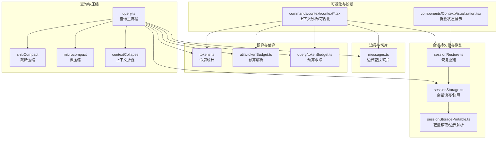
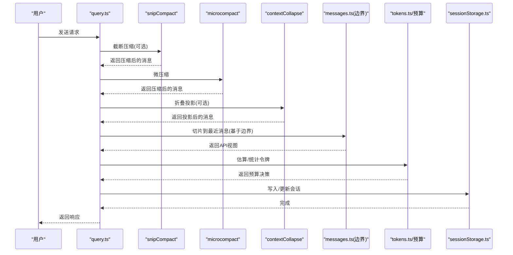
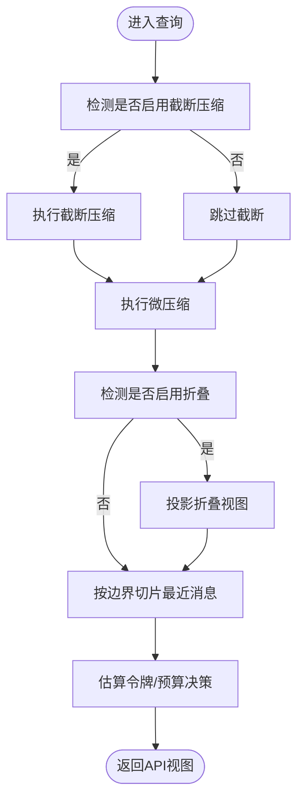
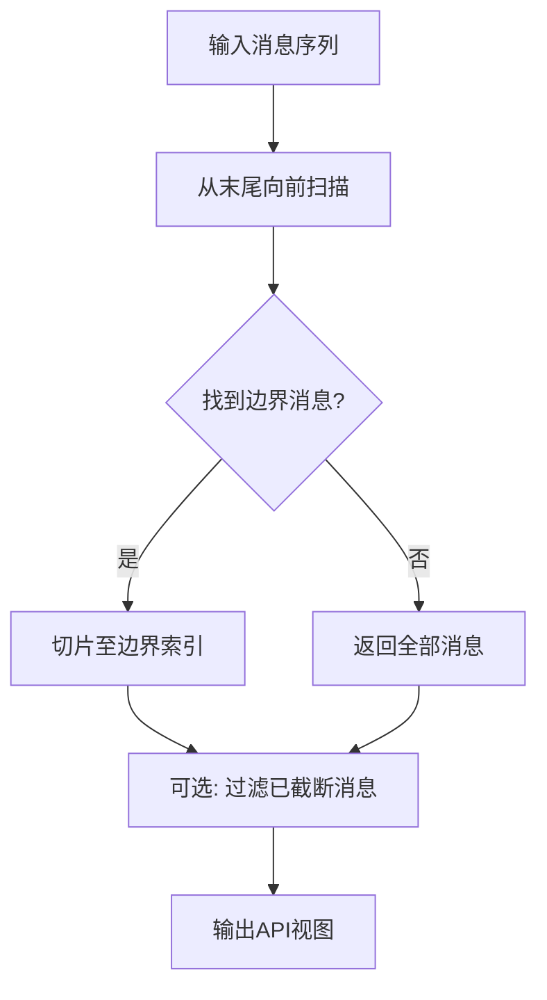
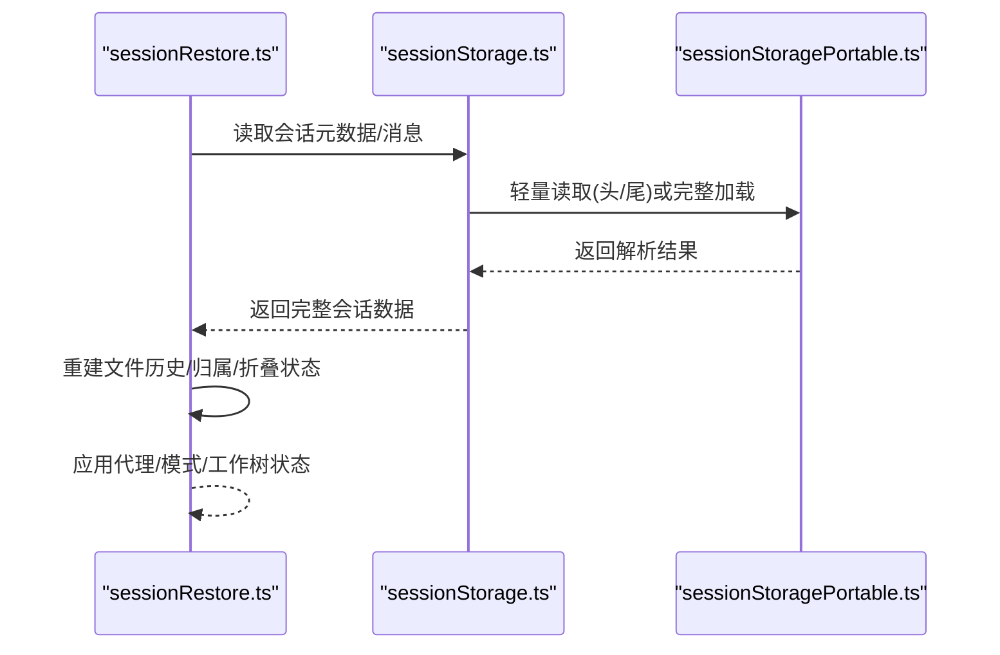
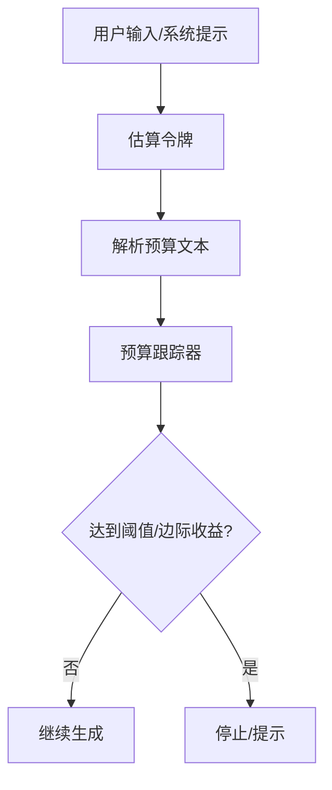
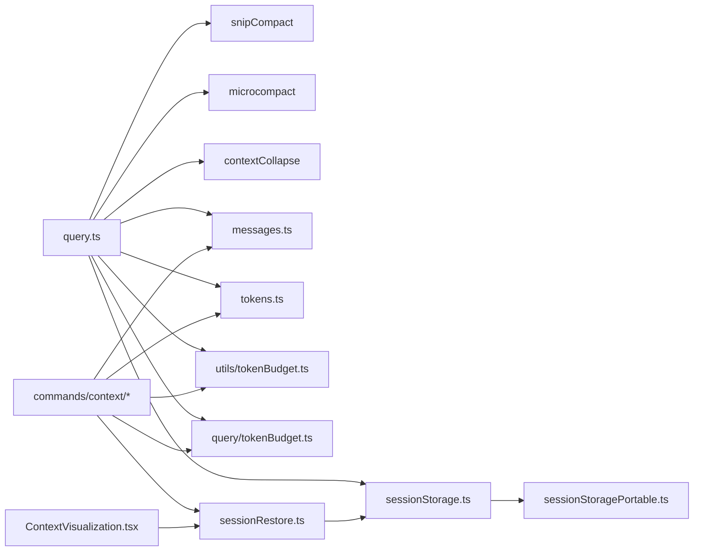

# 上下文管理系统

<cite>
**本文引用的文件**
- [README.md](file://README.md)
- [src/query.ts](file://src/query.ts)
- [src/utils/messages.ts](file://src/utils/messages.ts)
- [src/utils/tokens.ts](file://src/utils/tokens.ts)
- [src/utils/tokenBudget.ts](file://src/utils/tokenBudget.ts)
- [src/query/tokenBudget.ts](file://src/query/tokenBudget.ts)
- [src/utils/sessionStorage.ts](file://src/utils/sessionStorage.ts)
- [src/utils/sessionStoragePortable.ts](file://src/utils/sessionStoragePortable.ts)
- [src/utils/sessionRestore.ts](file://src/utils/sessionRestore.ts)
- [src/commands/context/context.tsx](file://src/commands/context/context.tsx)
- [src/commands/context/context-noninteractive.ts](file://src/commands/context/context-noninteractive.ts)
- [src/components/ContextVisualization.tsx](file://src/components/ContextVisualization.tsx)
- [src/utils/attachments.ts](file://src/utils/attachments.ts)
- [src/context.ts](file://src/context.ts)
</cite>

## 目录
1. [简介](#简介)
2. [项目结构](#项目结构)
3. [核心组件](#核心组件)
4. [架构总览](#架构总览)
5. [详细组件分析](#详细组件分析)
6. [依赖关系分析](#依赖关系分析)
7. [性能考量](#性能考量)
8. [故障排除指南](#故障排除指南)
9. [结论](#结论)
10. [附录](#附录)

## 简介
本技术文档聚焦 Claude Code 的上下文管理系统，系统性阐述以下主题：
- 智能上下文压缩算法：包括自动压缩、截断压缩（snip）与上下文折叠（contextCollapse）三种策略及其协同流程
- 会话持久化与历史恢复：会话文件格式、加载/写入路径、恢复时的状态重建
- 压缩边界标记与“最近消息保留”机制：边界消息的识别与切片策略
- 上下文窗口预算管理：令牌估算、预算决策与动态调整
- 内存优化策略：轻量读取、按需投影、缓存与清理
- 最佳实践与调优：压缩参数配置、大体量对话处理建议
- 故障排除与性能调优：常见问题定位与优化手段

## 项目结构
上下文管理涉及多处模块协作：
- 查询与压缩执行：在查询入口对消息进行压缩前处理（snip、microcompact），并结合折叠视图投影
- 边界与切片：通过边界消息定位“最近消息”范围，过滤旧历史
- 预算与估算：基于使用统计与估算函数计算上下文大小，驱动自动压缩触发
- 会话持久化与恢复：会话文件的读写、快照与恢复逻辑
- 可视化与诊断：命令行与 UI 展示上下文占用、折叠状态与效率提示

图表来源
- [src/query.ts:384-440](file://src/query.ts#L384-L440)
- [src/utils/messages.ts:4620-4650](file://src/utils/messages.ts#L4620-L4650)
- [src/utils/tokens.ts:32-74](file://src/utils/tokens.ts#L32-L74)
- [src/utils/tokenBudget.ts:1-73](file://src/utils/tokenBudget.ts#L1-L73)
- [src/query/tokenBudget.ts:1-56](file://src/query/tokenBudget.ts#L1-L56)
- [src/utils/sessionStorage.ts:1-200](file://src/utils/sessionStorage.ts#L1-L200)
- [src/utils/sessionStoragePortable.ts:491-538](file://src/utils/sessionStoragePortable.ts#L491-L538)
- [src/utils/sessionRestore.ts:1-150](file://src/utils/sessionRestore.ts#L1-L150)
- [src/commands/context/context.tsx:1-27](file://src/commands/context/context.tsx#L1-L27)
- [src/commands/context/context-noninteractive.ts:33-116](file://src/commands/context/context-noninteractive.ts#L33-L116)
- [src/components/ContextVisualization.tsx:1-31](file://src/components/ContextVisualization.tsx#L1-L31)

章节来源
- [README.md:650-689](file://README.md#L650-L689)
- [src/query.ts:384-440](file://src/query.ts#L384-L440)
- [src/utils/messages.ts:4620-4650](file://src/utils/messages.ts#L4620-L4650)

## 核心组件
- 查询与压缩编排：在查询主流程中依次执行截断压缩、微压缩，并在需要时应用上下文折叠投影，最终生成 API 视图
- 边界与切片：通过边界消息定位“最近消息”起始点，过滤旧历史；支持可选包含被截断的消息以满足不同场景
- 预算与估算：从使用统计推导上下文大小，解析用户输入中的预算文本，跟踪预算使用并决定是否继续或停止
- 会话持久化与恢复：统一的 JSONL 会话文件格式，支持轻量读取、边界解析、快照记录与恢复重建
- 可视化与诊断：命令行与 UI 提供上下文占用分析、折叠状态提示与效率建议

章节来源
- [src/query.ts:384-440](file://src/query.ts#L384-L440)
- [src/utils/messages.ts:4620-4650](file://src/utils/messages.ts#L4620-L4650)
- [src/utils/tokens.ts:32-74](file://src/utils/tokens.ts#L32-L74)
- [src/utils/tokenBudget.ts:1-73](file://src/utils/tokenBudget.ts#L1-L73)
- [src/query/tokenBudget.ts:1-56](file://src/query/tokenBudget.ts#L1-L56)
- [src/utils/sessionStorage.ts:1-200](file://src/utils/sessionStorage.ts#L1-L200)
- [src/utils/sessionRestore.ts:1-150](file://src/utils/sessionRestore.ts#L1-L150)

## 架构总览
系统围绕“查询—压缩—投影—估算—预算—持久化”的闭环工作流展开。查询主流程负责在每次请求前对消息进行压缩与切片，确保 API 输入不超过上下文窗口预算；同时通过边界标记与折叠投影维持“最近高保真消息 + 历史摘要”的结构。

图表来源
- [src/query.ts:384-440](file://src/query.ts#L384-L440)
- [src/utils/messages.ts:4620-4650](file://src/utils/messages.ts#L4620-L4650)
- [src/utils/tokens.ts:32-74](file://src/utils/tokens.ts#L32-L74)
- [src/utils/sessionStorage.ts:1-200](file://src/utils/sessionStorage.ts#L1-L200)

## 详细组件分析

### 智能上下文压缩算法
- 自动压缩（autoCompact）
  - 在令牌数超过阈值时触发，对旧消息调用压缩 API 生成摘要，替换为摘要消息
  - 与截断压缩（snip）可并行运行，且 snip 释放的令牌会反馈给自动压缩阈值检查
- 截断压缩（snipCompact）
  - 移除僵尸消息与陈旧标记，减少冗余历史
  - 通过运行时门控启用，必要时向用户发出效率提示
- 上下文折叠（contextCollapse）
  - 对历史进行结构化重排，形成“摘要占位 + 边界标记 + 最近消息”的视图
  - 折叠提交日志与快照在恢复时重建，保证跨轮次的一致性

图表来源
- [src/query.ts:384-440](file://src/query.ts#L384-L440)
- [src/utils/attachments.ts:3966-3997](file://src/utils/attachments.ts#L3966-L3997)

章节来源
- [README.md:650-689](file://README.md#L650-L689)
- [src/query.ts:384-440](file://src/query.ts#L384-L440)
- [src/utils/attachments.ts:3966-3997](file://src/utils/attachments.ts#L3966-L3997)

### 压缩边界标记与最近消息保留机制
- 边界消息识别
  - 通过扫描消息序列，定位最后一条“压缩边界”系统消息
  - 若存在边界，则仅保留该边界之后的消息作为 API 视图；否则返回全部消息
- 近期消息保留
  - 默认过滤掉已被截断的消息；若需要保留截断内容（如全屏紧凑处理器），可通过选项禁用过滤
- 边界解析与轻量读取
  - 会话文件中边界消息携带元数据，解析后用于快速定位与切片
  - 轻量读取仅读取文件头尾部，避免全量扫描

图表来源
- [src/utils/messages.ts:4620-4650](file://src/utils/messages.ts#L4620-L4650)
- [src/utils/sessionStoragePortable.ts:491-538](file://src/utils/sessionStoragePortable.ts#L491-L538)

章节来源
- [src/utils/messages.ts:4620-4650](file://src/utils/messages.ts#L4620-L4650)
- [src/utils/sessionStoragePortable.ts:491-538](file://src/utils/sessionStoragePortable.ts#L491-L538)

### 会话持久化机制与历史恢复
- 会话文件格式
  - 使用 JSONL 记录消息、摘要、标签、代理设置、工作树状态、文件历史快照、归属快照、内容替换记录、折叠提交与快照等
- 加载与写入
  - 支持一次性加载所有条目，或轻量读取头尾部以加速恢复
  - 写入时区分链式参与者与临时进度消息，避免错误链接
- 恢复重建
  - 恢复时重建文件历史、归属、折叠提交与快照、待办列表等状态
  - 在交互式 /resume 与 CLI --continue 中分别走不同的恢复路径，但最终一致

图表来源
- [src/utils/sessionRestore.ts:1-150](file://src/utils/sessionRestore.ts#L1-L150)
- [src/utils/sessionStorage.ts:1-200](file://src/utils/sessionStorage.ts#L1-L200)
- [src/utils/sessionStoragePortable.ts:491-538](file://src/utils/sessionStoragePortable.ts#L491-L538)

章节来源
- [src/utils/sessionStorage.ts:1-200](file://src/utils/sessionStorage.ts#L1-L200)
- [src/utils/sessionRestore.ts:1-150](file://src/utils/sessionRestore.ts#L1-L150)

### 上下文窗口预算管理与令牌估算
- 令牌估算
  - 从最近一次 API 响应的使用统计中提取输入/缓存/输出令牌之和，得到上下文窗口的最终大小
  - 提供从使用统计反推令牌数的工具函数
- 预算解析
  - 解析用户输入中的预算文本（简写与详述两种形式），支持千/百万/十亿单位
- 预算跟踪与决策
  - 在查询循环中跟踪连续次数、增量令牌与全局回合令牌，根据阈值与边际收益决定是否继续或停止

图表来源
- [src/utils/tokens.ts:32-74](file://src/utils/tokens.ts#L32-L74)
- [src/utils/tokenBudget.ts:1-73](file://src/utils/tokenBudget.ts#L1-L73)
- [src/query/tokenBudget.ts:1-56](file://src/query/tokenBudget.ts#L1-L56)

章节来源
- [src/utils/tokens.ts:32-74](file://src/utils/tokens.ts#L32-L74)
- [src/utils/tokenBudget.ts:1-73](file://src/utils/tokenBudget.ts#L1-L73)
- [src/query/tokenBudget.ts:1-56](file://src/query/tokenBudget.ts#L1-L56)

### 内存优化策略
- 轻量读取
  - 仅读取文件头部与尾部，避免全量扫描，降低 IO 与内存峰值
- 按需投影
  - 折叠视图在读取时按需重建，不将摘要消息写回 REPL 数组，减少内存占用
- 缓存与清理
  - 系统提示注入变化时清空相关缓存，避免陈旧上下文
  - 工作树切换与恢复时清理缓存，确保提示片段一致性

章节来源
- [src/utils/sessionStoragePortable.ts:256-282](file://src/utils/sessionStoragePortable.ts#L256-L282)
- [src/context.ts:1-190](file://src/context.ts#L1-L190)

### 可视化与诊断
- 命令行上下文分析
  - 将与 API 一致的视图（边界切片 + 折叠投影 + 微压缩）传递给分析器，生成占用与类别分解
- UI 折叠状态展示
  - 当启用折叠时，显示折叠状态与摘要占位信息，帮助用户感知上下文重写

章节来源
- [src/commands/context/context.tsx:1-27](file://src/commands/context/context.tsx#L1-L27)
- [src/commands/context/context-noninteractive.ts:33-116](file://src/commands/context/context-noninteractive.ts#L33-L116)
- [src/components/ContextVisualization.tsx:1-31](file://src/components/ContextVisualization.tsx#L1-L31)

## 依赖关系分析
- 查询主流程依赖压缩模块（snip、microcompact）、折叠模块、边界工具与令牌估算
- 会话持久化依赖便携式读取与恢复模块，二者共同支撑恢复路径
- 可视化与诊断模块依赖边界与估算能力，确保展示与实际 API 视图一致

图表来源
- [src/query.ts:384-440](file://src/query.ts#L384-L440)
- [src/utils/messages.ts:4620-4650](file://src/utils/messages.ts#L4620-L4650)
- [src/utils/tokens.ts:32-74](file://src/utils/tokens.ts#L32-L74)
- [src/utils/tokenBudget.ts:1-73](file://src/utils/tokenBudget.ts#L1-L73)
- [src/query/tokenBudget.ts:1-56](file://src/query/tokenBudget.ts#L1-L56)
- [src/utils/sessionStorage.ts:1-200](file://src/utils/sessionStorage.ts#L1-L200)
- [src/utils/sessionStoragePortable.ts:491-538](file://src/utils/sessionStoragePortable.ts#L491-L538)
- [src/utils/sessionRestore.ts:1-150](file://src/utils/sessionRestore.ts#L1-L150)
- [src/commands/context/context.tsx:1-27](file://src/commands/context/context.tsx#L1-L27)
- [src/commands/context/context-noninteractive.ts:33-116](file://src/commands/context/context-noninteractive.ts#L33-L116)
- [src/components/ContextVisualization.tsx:1-31](file://src/components/ContextVisualization.tsx#L1-L31)

## 性能考量
- IO 与内存
  - 使用轻量读取避免全量扫描；按需投影减少 REPL 数组中的摘要消息
  - 在恢复路径中优先加载必要字段，避免不必要的解析
- 压缩策略权衡
  - 自动压缩适合大规模历史；截断压缩适合清理冗余；折叠投影适合长期会话的可读性与稳定性
- 预算与边际收益
  - 结合预算阈值与边际收益判断，避免过度总结导致信息丢失
- 缓存与一致性
  - 系统提示注入变化时清空缓存；工作树切换时清理相关缓存，确保上下文一致性

## 故障排除指南
- 边界消息未生效
  - 检查是否存在“压缩边界”系统消息；确认边界解析逻辑是否正确
- 折叠状态异常
  - 确认恢复时是否正确重建了折叠提交与快照；检查投影函数是否在每次查询时重新计算
- 预算误判
  - 核对预算文本解析与阈值设置；检查令牌估算是否来自最近一次 API 响应
- 会话恢复失败
  - 检查会话文件完整性与条目类型；确认链式参与者过滤与进度消息处理逻辑
- 效率提示未出现
  - 确认截断压缩门控开启；检查运行时启用状态与消息判定逻辑

章节来源
- [src/utils/messages.ts:4620-4650](file://src/utils/messages.ts#L4620-L4650)
- [src/utils/sessionRestore.ts:1-150](file://src/utils/sessionRestore.ts#L1-L150)
- [src/utils/attachments.ts:3966-3997](file://src/utils/attachments.ts#L3966-L3997)

## 结论
该上下文管理系统通过“边界切片 + 多策略压缩 + 预算驱动 + 折叠投影 + 轻量持久化”的组合，在保证模型可见性的前提下，有效控制上下文规模与内存占用。配合可视化与诊断工具，用户可以直观了解上下文构成与折叠状态，从而在长对话与复杂任务中取得更好的性能与体验平衡。

## 附录
- 最佳实践
  - 合理配置预算阈值，结合任务复杂度与模型能力选择压缩策略
  - 在长期会话中优先启用折叠投影，提升可读性与稳定性
  - 使用命令行上下文分析工具定期审视上下文占用，及时调整策略
- 大体量对话处理
  - 优先启用自动压缩与折叠投影；必要时结合截断压缩清理冗余
  - 关注边际收益，避免过度总结导致信息损失
- 参数配置参考
  - 预算文本解析规则与单位换算
  - 边界消息识别与切片选项
  - 折叠提交与快照的恢复与重建流程