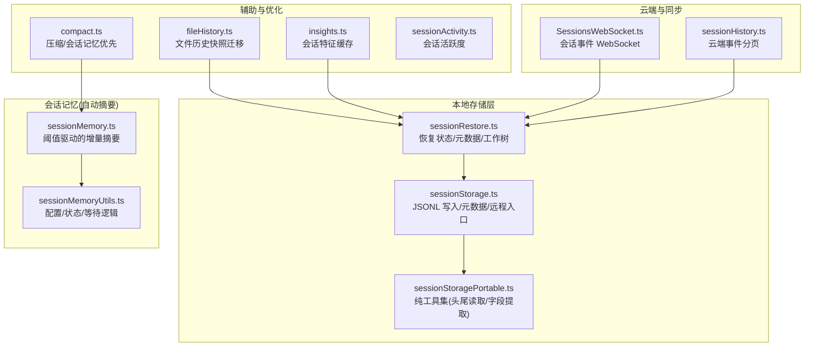
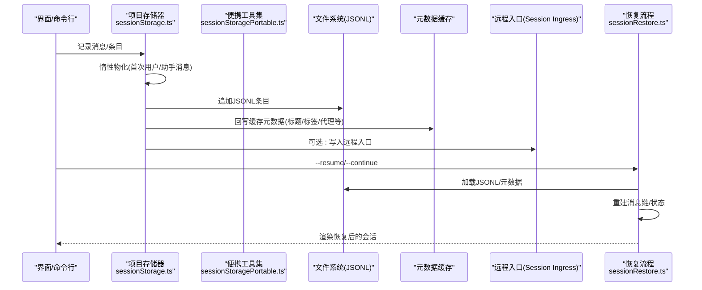
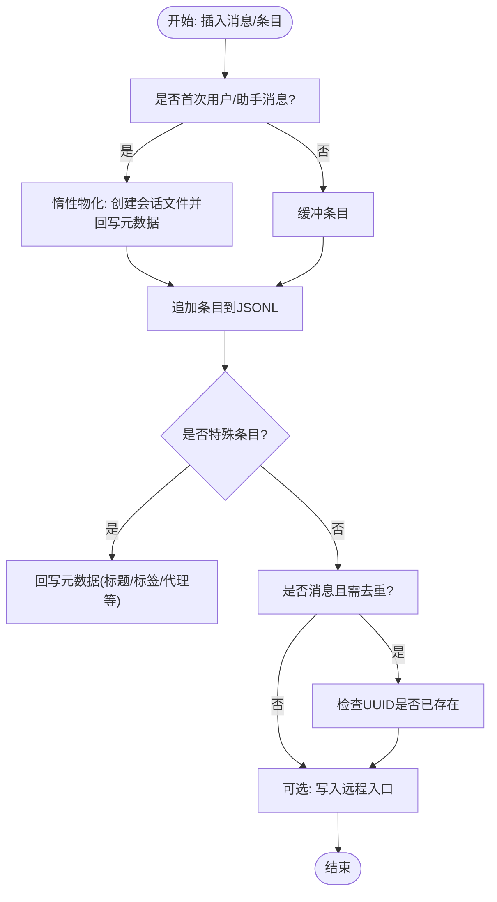
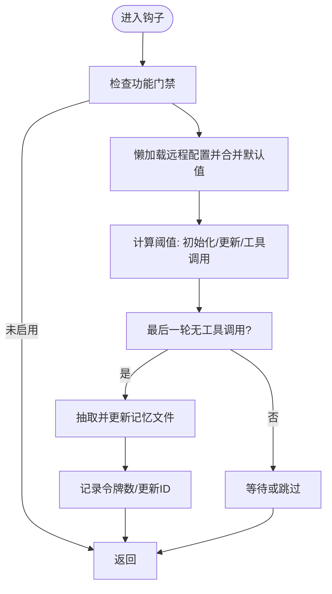
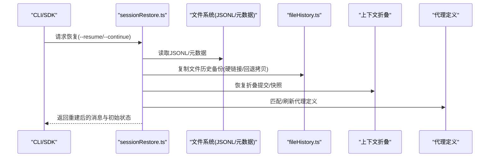
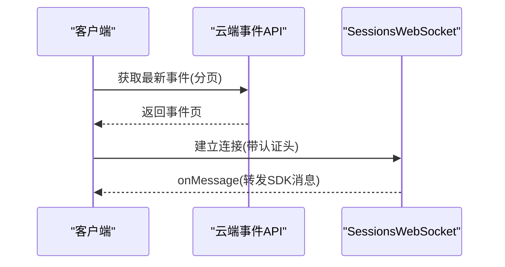
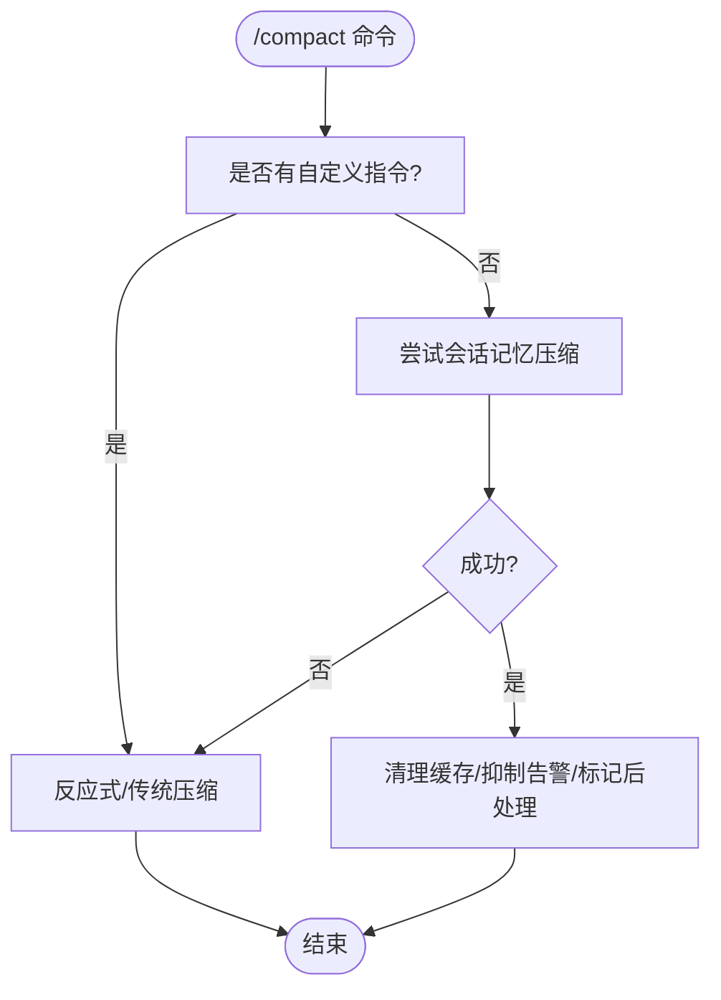
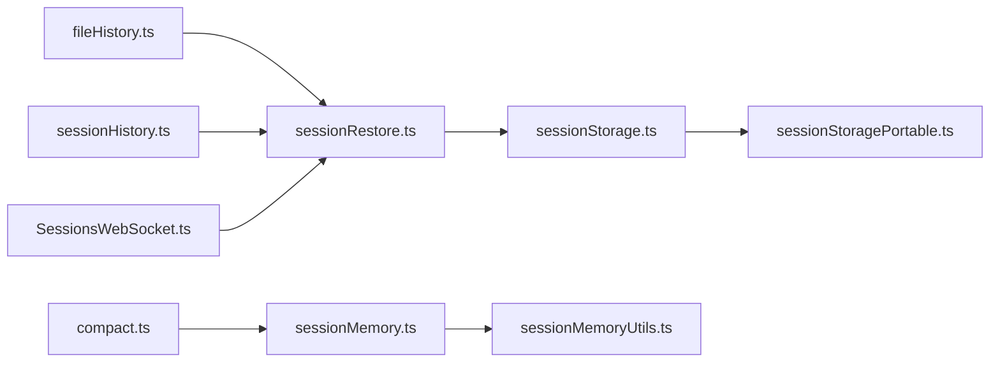

# 会话持久化机制

<cite>
**本文引用的文件**
- [sessionStorage.ts](file://src/utils/sessionStorage.ts)
- [sessionStoragePortable.ts](file://src/utils/sessionStoragePortable.ts)
- [sessionRestore.ts](file://src/utils/sessionRestore.ts)
- [sessionHistory.ts](file://src/assistant/sessionHistory.ts)
- [sessionMemory.ts](file://src/services/sessionMemory/sessionMemory.ts)
- [sessionMemoryUtils.ts](file://src/services/sessionMemory/sessionMemoryUtils.ts)
- [compact.ts](file://src/commands/compact/compact.ts)
- [sessionsWebSocket.ts](file://src/remote/SessionsWebSocket.ts)
- [insights.ts](file://src/commands/insights.ts)
- [fileHistory.ts](file://src/utils/fileHistory.ts)
- [sessionActivity.ts](file://src/utils/sessionActivity.ts)
</cite>

## 目录
1. [引言](#引言)
2. [项目结构](#项目结构)
3. [核心组件](#核心组件)
4. [架构总览](#架构总览)
5. [详细组件分析](#详细组件分析)
6. [依赖关系分析](#依赖关系分析)
7. [性能考量](#性能考量)
8. [故障排查指南](#故障排查指南)
9. [结论](#结论)
10. [附录](#附录)

## 引言
本文件系统性阐述 Claude Code 的会话持久化机制，覆盖会话内存管理、消息存储策略、持久化触发条件、会话快照与增量更新、数据一致性保障、持久化配置与存储路径、备份与恢复、内存与存储优化、大体量会话处理、跨设备同步等主题。目标是帮助开发者与运维人员在理解现有实现的基础上，进行扩展、优化与排障。

## 项目结构
围绕会话持久化，关键代码分布在以下模块：
- 存储与加载：sessionStorage.ts（写入 JSONL、元数据、远程入口）、sessionStoragePortable.ts（纯工具集，跨平台复用）
- 恢复与状态：sessionRestore.ts（从日志恢复状态、工作树、代理设置等）
- 会话历史：sessionHistory.ts（云端事件分页拉取）
- 会话记忆（自动摘要）：sessionMemory.ts 与 sessionMemoryUtils.ts（基于阈值的增量摘要）
- 压缩与清理：compact.ts（会话记忆压缩优先路径）
- 远程同步：SessionsWebSocket.ts（会话事件 WebSocket）
- 辅助能力：insights.ts（会话特征缓存）、fileHistory.ts（文件历史快照迁移）、sessionActivity.ts（会话活跃度）

图表来源
- [sessionStorage.ts:1-200](file://src/utils/sessionStorage.ts#L1-L200)
- [sessionStoragePortable.ts:1-200](file://src/utils/sessionStoragePortable.ts#L1-L200)
- [sessionRestore.ts:1-200](file://src/utils/sessionRestore.ts#L1-L200)
- [sessionMemory.ts:1-200](file://src/services/sessionMemory/sessionMemory.ts#L1-L200)
- [sessionMemoryUtils.ts:1-200](file://src/services/sessionMemory/sessionMemoryUtils.ts#L1-L200)
- [compact.ts:1-120](file://src/commands/compact/compact.ts#L1-L120)
- [sessionHistory.ts:1-88](file://src/assistant/sessionHistory.ts#L1-L88)
- [sessionsWebSocket.ts:177-222](file://src/remote/SessionsWebSocket.ts#L177-L222)
- [insights.ts:944-993](file://src/commands/insights.ts#L944-L993)
- [fileHistory.ts:908-1023](file://src/utils/fileHistory.ts#L908-L1023)
- [sessionActivity.ts:119-133](file://src/utils/sessionActivity.ts#L119-L133)

章节来源
- [sessionStorage.ts:1-200](file://src/utils/sessionStorage.ts#L1-L200)
- [sessionStoragePortable.ts:1-200](file://src/utils/sessionStoragePortable.ts#L1-L200)
- [sessionRestore.ts:1-200](file://src/utils/sessionRestore.ts#L1-L200)

## 核心组件
- 会话存储器（JSONL+元数据）
  - 负责将消息与各类会话条目（摘要、标题、标签、代理设置、工作树、文件历史快照、归因快照、内容替换、上下文折叠提交/快照等）以 JSONL 行式追加到磁盘，并在必要时回写元数据。
  - 支持“惰性物化”：首次出现用户/助手消息时才创建会话文件并回写缓存的元数据；其余条目先缓冲，随后批量写出。
  - 提供远程入口（内部事件或 Session Ingress），失败时触发安全降级与优雅退出。
- 会话记忆（自动摘要）
  - 基于令牌计数阈值与工具调用次数阈值，周期性生成会话记忆文件，避免频繁抽取带来的开销。
  - 使用子进程隔离执行，确保不污染主会话状态。
- 会话恢复
  - 从日志中重建消息链、文件历史、归因、上下文折叠、代理设置、工作树状态、成本状态等。
  - 支持 fork 会话、跨项目目录恢复、模式切换匹配等复杂场景。
- 云端与同步
  - 提供云端事件分页接口与 WebSocket 接收，支撑跨设备/多端同步与实时事件推送。
- 压缩与清理
  - 优先尝试会话记忆压缩，其次再走传统压缩流程；与自动压缩阈值保持一致的令牌计数口径，确保行为一致。

章节来源
- [sessionStorage.ts:1128-1343](file://src/utils/sessionStorage.ts#L1128-L1343)
- [sessionMemory.ts:134-181](file://src/services/sessionMemory/sessionMemory.ts#L134-L181)
- [sessionRestore.ts:99-150](file://src/utils/sessionRestore.ts#L99-L150)
- [sessionHistory.ts:45-87](file://src/assistant/sessionHistory.ts#L45-L87)
- [sessionsWebSocket.ts:177-222](file://src/remote/SessionsWebSocket.ts#L177-L222)
- [compact.ts:55-97](file://src/commands/compact/compact.ts#L55-L97)

## 架构总览
下图展示会话持久化从写入到恢复的关键交互：

图表来源
- [sessionStorage.ts:976-991](file://src/utils/sessionStorage.ts#L976-L991)
- [sessionStorage.ts:1128-1343](file://src/utils/sessionStorage.ts#L1128-L1343)
- [sessionRestore.ts:409-551](file://src/utils/sessionRestore.ts#L409-L551)

## 详细组件分析

### 组件A：会话存储器（JSONL+元数据）
- 设计要点
  - 条目类型丰富：消息（用户/助手/附件/系统）、摘要、自定义标题、标签、代理名称/颜色/设置、工作树状态、文件历史快照、归因快照、内容替换、上下文折叠提交/快照、队列操作、Marble Origami 快照等。
  - 惰性物化：首次出现用户/助手消息时创建会话文件并回写缓存元数据；其他条目缓冲，随后批量写出，避免空文件与无意义写入。
  - 元数据回写策略：对标题、标签、代理名/色、代理设置等采用“回写至 EOF”的方式，确保压缩后仍可定位最新元数据。
  - 远程入口：支持内部事件写入或 Session Ingress 写入；失败时记录指标并触发优雅退出，防止数据不一致。
  - 去重与链路：消息参与 parentUuid 链；进度类条目为 UI 专用，不参与链路，避免恢复时产生孤儿消息。
- 关键流程（写入）
  - 插入消息链：首次消息触发物化；根据是否侧链/代理决定写入目标文件；检查 UUID 是否已存在（侧链除外）。
  - 追加条目：按类型选择写入路径；摘要/自定义标题/标签/代理设置等特殊条目单独处理。
  - 远程写入：内部事件或 Session Ingress；失败时记录指标并安全退出。
- 关键流程（读取/加载）
  - 单次全量读取：一次性加载会话所有数据，避免重复扫描；同时预热消息集合缓存，加速后续查询。
  - 头尾轻量读取：用于快速获取首提示、元数据等，减少 IO 开销。
- 数据一致性
  - 通过“最后写入覆盖”策略（如自定义标题、标签、代理设置）与 parentUuid 链约束，确保恢复时的顺序与完整性。
  - 对于 Tombstone 删除、内容替换等，提供专门的记录与回放机制，保证 UI 与后端一致。

图表来源
- [sessionStorage.ts:976-991](file://src/utils/sessionStorage.ts#L976-L991)
- [sessionStorage.ts:1128-1343](file://src/utils/sessionStorage.ts#L1128-L1343)
- [sessionStorage.ts:1211-1295](file://src/utils/sessionStorage.ts#L1211-L1295)

章节来源
- [sessionStorage.ts:1128-1343](file://src/utils/sessionStorage.ts#L1128-L1343)
- [sessionStorage.ts:1211-1295](file://src/utils/sessionStorage.ts#L1211-L1295)
- [sessionStorage.ts:767-811](file://src/utils/sessionStorage.ts#L767-L811)
- [sessionStorage.ts:3845-3889](file://src/utils/sessionStorage.ts#L3845-L3889)

### 组件B：会话记忆（自动摘要）
- 触发条件
  - 初始化阈值：累计上下文窗口令牌数达到阈值后初始化。
  - 更新阈值：自上次抽取以来上下文增长令牌数达到阈值。
  - 工具调用阈值：自上次抽取以来工具调用次数达到阈值。
  - 最后一轮无工具调用：在自然对话停顿处抽取，避免打断。
- 执行流程
  - 后台串行执行，使用子进程隔离，避免污染主会话状态。
  - 仅允许对记忆文件执行编辑工具，其他操作一律拒绝。
  - 成功后记录抽取时间点，更新“最后总结消息 ID”，并清理相关缓存。
- 配置与状态
  - 默认阈值：初始化阈值、更新阈值、工具调用次数阈值。
  - 状态跟踪：抽取开始/完成时间、最近一次抽取的令牌数、初始化标记等。
  - 提供等待函数，避免并发抽取导致的资源竞争。

图表来源
- [sessionMemory.ts:134-181](file://src/services/sessionMemory/sessionMemory.ts#L134-L181)
- [sessionMemory.ts:272-350](file://src/services/sessionMemory/sessionMemory.ts#L272-L350)
- [sessionMemoryUtils.ts:173-189](file://src/services/sessionMemory/sessionMemoryUtils.ts#L173-L189)

章节来源
- [sessionMemory.ts:134-181](file://src/services/sessionMemory/sessionMemory.ts#L134-L181)
- [sessionMemory.ts:272-350](file://src/services/sessionMemory/sessionMemory.ts#L272-L350)
- [sessionMemoryUtils.ts:173-189](file://src/services/sessionMemory/sessionMemoryUtils.ts#L173-L189)

### 组件C：会话恢复（跨设备/跨项目）
- 恢复内容
  - 消息链：重建 parentUuid 链，处理遗留进度条目桥接。
  - 文件历史：复制备份文件，硬链接优先，失败回退拷贝。
  - 归因快照：在特定特性开启时恢复。
  - 上下文折叠：恢复提交日志与暂存快照。
  - 代理设置：恢复代理类型与模型覆盖（若未由 CLI 指定）。
  - 工作树状态：回到会话最后离开的工作树，若目录不存在则清理缓存。
  - 成本状态：恢复会话成本统计。
- 恢复策略
  - 支持 fork 会话：保留新会话 ID，复制源消息到新 JSONL，但内容替换记录需要种子以避免冻结。
  - 模式匹配：协调员模式与普通模式切换时重新派生代理定义。
  - 跨项目目录：通过 transcriptPath 定位实际文件所在项目目录。

图表来源
- [sessionRestore.ts:409-551](file://src/utils/sessionRestore.ts#L409-L551)
- [fileHistory.ts:922-1023](file://src/utils/fileHistory.ts#L922-L1023)

章节来源
- [sessionRestore.ts:99-150](file://src/utils/sessionRestore.ts#L99-L150)
- [sessionRestore.ts:409-551](file://src/utils/sessionRestore.ts#L409-L551)
- [fileHistory.ts:922-1023](file://src/utils/fileHistory.ts#L922-L1023)

### 组件D：云端事件与同步
- 分页拉取
  - 基于 OAuth 与组织标识，分页获取会话事件，支持“锚定最新”和“游标向前”两种模式。
- 实时同步
  - 通过 WebSocket 接收会话事件消息，过滤非 SDK 消息，维持心跳与重连。

图表来源
- [sessionHistory.ts:31-87](file://src/assistant/sessionHistory.ts#L31-L87)
- [sessionsWebSocket.ts:177-222](file://src/remote/SessionsWebSocket.ts#L177-L222)

章节来源
- [sessionHistory.ts:31-87](file://src/assistant/sessionHistory.ts#L31-L87)
- [sessionsWebSocket.ts:177-222](file://src/remote/SessionsWebSocket.ts#L177-L222)

### 组件E：压缩与清理（会话记忆优先）
- 优先路径
  - 若无自定义指令，优先尝试会话记忆压缩；成功后清理缓存与告警，抑制压缩警告。
- 传统路径
  - 在会话记忆不可用时，走反应式/微压缩/传统摘要路径，结合上下文窗口与阈值策略。

图表来源
- [compact.ts:55-97](file://src/commands/compact/compact.ts#L55-L97)

章节来源
- [compact.ts:55-97](file://src/commands/compact/compact.ts#L55-L97)

## 依赖关系分析
- 组件耦合
  - sessionStorage.ts 依赖 sessionStoragePortable.ts（头尾读取、字段提取、路径解析）。
  - sessionRestore.ts 依赖 sessionStorage.ts 的元数据回写与 adoptResumedSessionFile 等能力。
  - sessionMemory.ts 依赖 sessionMemoryUtils.ts 的配置与状态管理。
  - fileHistory.ts 与 sessionRestore.ts 协同完成文件历史快照迁移。
- 外部依赖
  - 远程入口：Session Ingress 或内部事件写入；失败时触发优雅退出。
  - 云端：事件分页与 WebSocket；特性开关控制是否启用。
- 循环依赖
  - 通过模块拆分与懒加载避免循环；例如 sessionRestore.ts 中对 contextCollapse 的 require 采用动态导入。

图表来源
- [sessionStorage.ts:1-120](file://src/utils/sessionStorage.ts#L1-L120)
- [sessionStoragePortable.ts:1-120](file://src/utils/sessionStoragePortable.ts#L1-L120)
- [sessionRestore.ts:1-120](file://src/utils/sessionRestore.ts#L1-L120)
- [sessionMemory.ts:1-120](file://src/services/sessionMemory/sessionMemory.ts#L1-L120)
- [sessionMemoryUtils.ts:1-120](file://src/services/sessionMemory/sessionMemoryUtils.ts#L1-L120)
- [fileHistory.ts:908-1023](file://src/utils/fileHistory.ts#L908-L1023)
- [sessionHistory.ts:1-88](file://src/assistant/sessionHistory.ts#L1-L88)
- [sessionsWebSocket.ts:177-222](file://src/remote/SessionsWebSocket.ts#L177-L222)
- [compact.ts:1-120](file://src/commands/compact/compact.ts#L1-L120)

章节来源
- [sessionStorage.ts:1-120](file://src/utils/sessionStorage.ts#L1-L120)
- [sessionRestore.ts:1-120](file://src/utils/sessionRestore.ts#L1-L120)

## 性能考量
- IO 优化
  - 头尾轻量读取：LITE_READ_BUF_SIZE 缓冲，单次打开文件读取头部与尾部，降低大文件扫描成本。
  - 单次全量加载：一次性读取会话所有数据，避免重复扫描；同时预热消息集合缓存，加速后续查询。
- 写入优化
  - 惰性物化与缓冲：首次用户/助手消息才创建文件，其余条目缓冲，批量写出，减少空文件与碎片写入。
  - 特殊条目回写至 EOF：确保压缩后仍可快速定位最新元数据，避免全文件扫描。
- 压缩与清理
  - 会话记忆优先压缩，减少大体量会话的摘要成本；与自动压缩阈值一致，避免重复计算。
- 并发与稳定性
  - 会话记忆串行执行，避免并发写入冲突；提供超时与过期检测，防止长时间阻塞。
- 远程写入失败保护
  - 失败时记录指标并触发优雅退出，避免部分写入导致的数据不一致。

章节来源
- [sessionStoragePortable.ts:256-283](file://src/utils/sessionStoragePortable.ts#L256-L283)
- [sessionStorage.ts:3845-3889](file://src/utils/sessionStorage.ts#L3845-L3889)
- [sessionMemory.ts:272-350](file://src/services/sessionMemory/sessionMemory.ts#L272-L350)
- [sessionMemoryUtils.ts:89-105](file://src/services/sessionMemory/sessionMemoryUtils.ts#L89-L105)
- [sessionStorage.ts:1302-1343](file://src/utils/sessionStorage.ts#L1302-L1343)

## 故障排查指南
- 无法写入会话文件
  - 检查持久化开关与环境变量（测试环境、禁用持久化、跳过提示历史等）。
  - 查看远程入口是否可用（Session Ingress/内部事件），失败时是否触发了优雅退出。
- 恢复后消息缺失或链断裂
  - 确认 parentUuid 链是否被进度条目中断；检查遗留进度条目桥接逻辑。
  - 检查 Tombstone 删除与内容替换记录是否完整。
- 文件历史快照迁移失败
  - 硬链接失败时回退拷贝；确认旧会话备份文件是否存在；必要时清理并重试。
- 会话记忆未抽取
  - 检查阈值配置与初始化标记；确认最后一轮无工具调用；查看抽取等待超时与过期检测。
- 云端事件不同步
  - 检查认证头与组织 UUID；确认 WebSocket 连接状态与消息类型过滤。

章节来源
- [sessionStorage.ts:960-970](file://src/utils/sessionStorage.ts#L960-L970)
- [sessionStorage.ts:1302-1343](file://src/utils/sessionStorage.ts#L1302-L1343)
- [sessionRestore.ts:99-150](file://src/utils/sessionRestore.ts#L99-L150)
- [fileHistory.ts:922-1023](file://src/utils/fileHistory.ts#L922-L1023)
- [sessionMemoryUtils.ts:89-105](file://src/services/sessionMemory/sessionMemoryUtils.ts#L89-L105)
- [sessionsWebSocket.ts:177-222](file://src/remote/SessionsWebSocket.ts#L177-L222)

## 结论
该会话持久化体系以 JSONL 为核心，结合元数据回写、远程入口、会话记忆、恢复流程与云端同步，实现了高可靠、高性能、可扩展的会话生命周期管理。通过惰性物化、头尾轻量读取、阈值驱动的摘要与优先压缩路径，兼顾了小体量与大体量会话的性能与一致性。建议在生产环境中配合合理的阈值配置、定期清理与备份策略，确保长期稳定运行。

## 附录
- 持久化配置与存储路径
  - 会话文件位于配置目录下的 projects 子目录，按项目路径进行规范化与哈希映射。
  - 元数据（标题、标签、代理设置等）采用回写至 EOF 的策略，便于快速定位。
  - 会话记忆文件独立维护，受阈值与工具调用次数控制。
- 备份与恢复
  - 文件历史快照迁移采用硬链接优先策略，失败回退拷贝；恢复时复制到当前会话目录。
  - 会话特征缓存（facets）独立存储，异常时自动删除损坏缓存文件。
- 跨设备同步
  - 云端事件分页与 WebSocket 推送，结合恢复流程实现跨设备一致性。
- 内存使用监控与存储空间优化
  - 会话记忆提供抽取等待与过期检测，避免长时间占用资源。
  - 头尾轻量读取与单次全量加载策略，平衡内存与 IO。
- 数据清理策略
  - 自动压缩与会话记忆优先路径减少冗余；清理缓存与告警抑制，提升用户体验。

章节来源
- [sessionStorage.ts:198-200](file://src/utils/sessionStorage.ts#L198-L200)
- [sessionMemoryUtils.ts:89-105](file://src/services/sessionMemory/sessionMemoryUtils.ts#L89-L105)
- [sessionStoragePortable.ts:256-283](file://src/utils/sessionStoragePortable.ts#L256-L283)
- [insights.ts:944-993](file://src/commands/insights.ts#L944-L993)
- [fileHistory.ts:922-1023](file://src/utils/fileHistory.ts#L922-L1023)
- [sessionActivity.ts:119-133](file://src/utils/sessionActivity.ts#L119-L133)