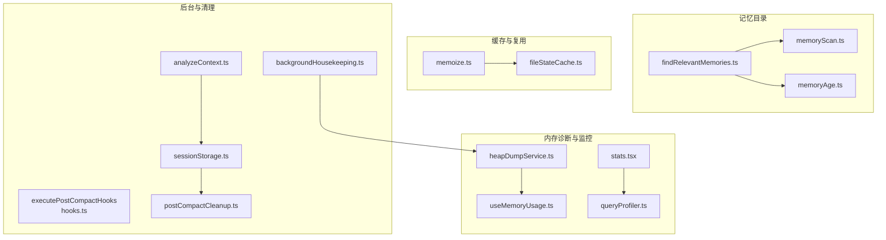
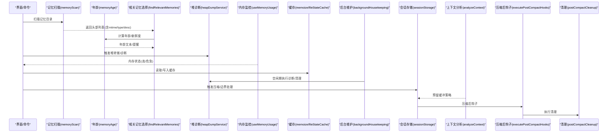
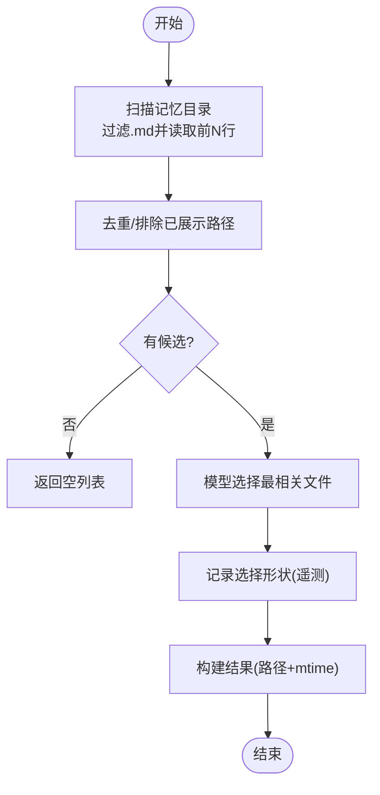
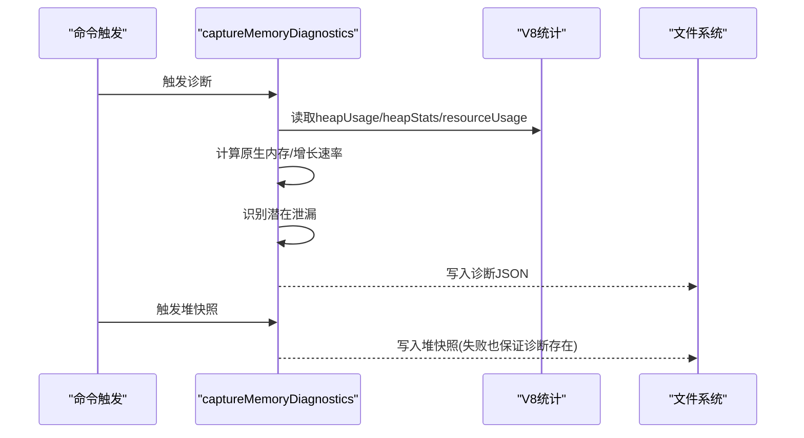
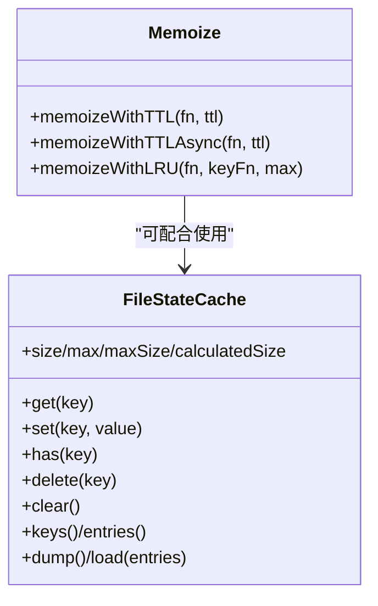
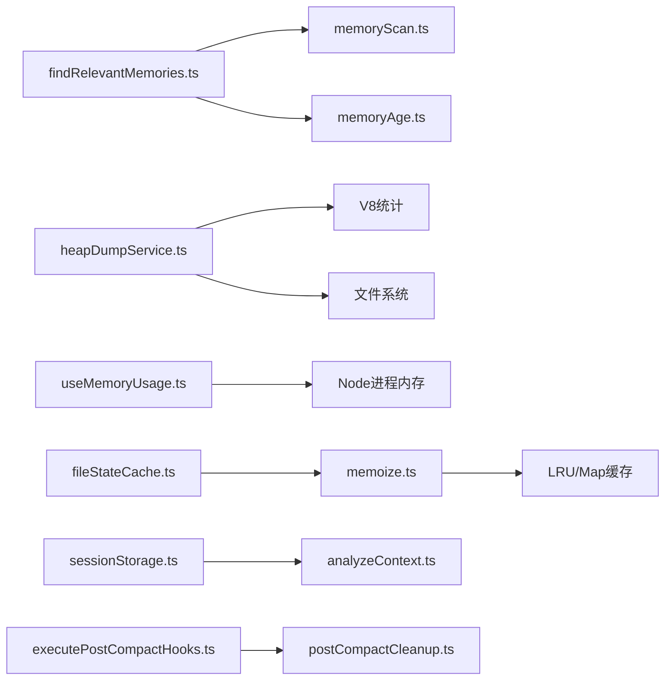

# 内存优化策略

<cite>
**本文引用的文件**
- [src/memdir/memoryScan.ts](file://src/memdir/memoryScan.ts)
- [src/memdir/memoryAge.ts](file://src/memdir/memoryAge.ts)
- [src/memdir/findRelevantMemories.ts](file://src/memdir/findRelevantMemories.ts)
- [src/utils/heapDumpService.ts](file://src/utils/heapDumpService.ts)
- [src/hooks/useMemoryUsage.ts](file://src/hooks/useMemoryUsage.ts)
- [src/utils/memoize.ts](file://src/utils/memoize.ts)
- [src/utils/fileStateCache.ts](file://src/utils/fileStateCache.ts)
- [src/utils/backgroundHousekeeping.ts](file://src/utils/backgroundHousekeeping.ts)
- [src/utils/sessionStorage.ts](file://src/utils/sessionStorage.ts)
- [src/utils/analyzeContext.ts](file://src/utils/analyzeContext.ts)
- [src/utils/hooks.ts](file://src/utils/hooks.ts)
- [src/services/compact/postCompactCleanup.ts](file://src/services/compact/postCompactCleanup.ts)
- [src/context/stats.tsx](file://src/context/stats.tsx)
- [src/utils/queryProfiler.ts](file://src/utils/queryProfiler.ts)
</cite>

## 目录
1. [引言](#引言)
2. [项目结构](#项目结构)
3. [核心组件](#核心组件)
4. [架构总览](#架构总览)
5. [详细组件分析](#详细组件分析)
6. [依赖关系分析](#依赖关系分析)
7. [性能考量](#性能考量)
8. [故障排查指南](#故障排查指南)
9. [结论](#结论)
10. [附录](#附录)

## 引言
本技术文档聚焦于 Claude Code 的内存优化策略，系统性阐述内存扫描机制、垃圾回收辅助、内存泄漏防护、清理流程、内存使用统计、优化钩子机制、内存年龄管理、热点与冷数据识别与迁移、并发访问控制、内存碎片处理、缓存策略优化、瓶颈识别与解决方法，以及大规模会话下的内存压力应对。文档以代码级事实为基础，结合可视化图示帮助读者快速理解并落地实践。

## 项目结构
围绕内存优化的关键模块分布如下：
- 记忆目录扫描与相关年龄信息：memdir 子模块
- 堆转储与内存诊断：heapDumpService
- 进程内存使用监控：useMemoryUsage
- 缓存与复用：memoize、fileStateCache
- 后台维护与资源清理：backgroundHousekeeping
- 会话存储与压缩边界处理：sessionStorage
- 上下文分析与自动压缩预留缓冲：analyzeContext
- 压缩后优化钩子：executePostCompactHooks
- 压缩后清理：postCompactCleanup
- 统计与指标：stats、queryProfiler

**图表来源**
- [src/memdir/memoryScan.ts:1-95](file://src/memdir/memoryScan.ts#L1-L95)
- [src/memdir/memoryAge.ts:1-54](file://src/memdir/memoryAge.ts#L1-L54)
- [src/memdir/findRelevantMemories.ts:1-142](file://src/memdir/findRelevantMemories.ts#L1-L142)
- [src/utils/heapDumpService.ts:1-304](file://src/utils/heapDumpService.ts#L1-L304)
- [src/hooks/useMemoryUsage.ts:1-40](file://src/hooks/useMemoryUsage.ts#L1-L40)
- [src/context/stats.tsx:37-138](file://src/context/stats.tsx#L37-L138)
- [src/utils/queryProfiler.ts:155-201](file://src/utils/queryProfiler.ts#L155-L201)
- [src/utils/memoize.ts:1-269](file://src/utils/memoize.ts#L1-L269)
- [src/utils/fileStateCache.ts:34-96](file://src/utils/fileStateCache.ts#L34-L96)
- [src/utils/backgroundHousekeeping.ts:30-78](file://src/utils/backgroundHousekeeping.ts#L30-L78)
- [src/utils/sessionStorage.ts:1841-1878](file://src/utils/sessionStorage.ts#L1841-L1878)
- [src/utils/analyzeContext.ts:1106-1134](file://src/utils/analyzeContext.ts#L1106-L1134)
- [src/utils/hooks.ts:4034-4047](file://src/utils/hooks.ts#L4034-L4047)
- [src/services/compact/postCompactCleanup.ts](file://src/services/compact/postCompactCleanup.ts)

**章节来源**
- [src/memdir/memoryScan.ts:1-95](file://src/memdir/memoryScan.ts#L1-L95)
- [src/memdir/findRelevantMemories.ts:1-142](file://src/memdir/findRelevantMemories.ts#L1-L142)
- [src/utils/heapDumpService.ts:1-304](file://src/utils/heapDumpService.ts#L1-L304)
- [src/hooks/useMemoryUsage.ts:1-40](file://src/hooks/useMemoryUsage.ts#L1-L40)
- [src/utils/memoize.ts:1-269](file://src/utils/memoize.ts#L1-L269)
- [src/utils/fileStateCache.ts:34-96](file://src/utils/fileStateCache.ts#L34-L96)
- [src/utils/backgroundHousekeeping.ts:30-78](file://src/utils/backgroundHousekeeping.ts#L30-L78)
- [src/utils/sessionStorage.ts:1841-1878](file://src/utils/sessionStorage.ts#L1841-L1878)
- [src/utils/analyzeContext.ts:1106-1134](file://src/utils/analyzeContext.ts#L1106-L1134)
- [src/utils/hooks.ts:4034-4047](file://src/utils/hooks.ts#L4034-L4047)
- [src/services/compact/postCompactCleanup.ts](file://src/services/compact/postCompactCleanup.ts)

## 核心组件
- 记忆目录扫描与相关年龄信息：负责扫描记忆目录、解析前言元数据、按时间排序并限制数量，同时提供记忆年龄与新鲜度文本提示。
- 堆转储与内存诊断：采集进程内存使用、V8 堆统计、资源使用、活动句柄/请求等，并进行潜在泄漏识别与建议。
- 进程内存使用监控：周期轮询 Node.js 进程内存使用，按阈值分级（正常/高/危急）。
- 缓存与复用：提供 TTL/LRU 缓存封装，支持写穿透、异步刷新、并发安全与容量管理。
- 后台维护与清理：在交互空闲期执行慢操作，如旧消息文件清理、版本清理等。
- 会话存储与压缩边界：维护压缩边界消息链、校验保留段有效性、绝对最后边界修剪。
- 上下文分析与自动压缩预留缓冲：根据特性与上下文折叠状态决定是否预留缓冲，避免透明压缩的“虚假预留”。
- 压缩后优化钩子与清理：压缩完成后执行用户自定义钩子与清理流程，确保后续状态一致。

**章节来源**
- [src/memdir/memoryScan.ts:35-77](file://src/memdir/memoryScan.ts#L35-L77)
- [src/memdir/memoryAge.ts:6-54](file://src/memdir/memoryAge.ts#L6-L54)
- [src/utils/heapDumpService.ts:88-212](file://src/utils/heapDumpService.ts#L88-L212)
- [src/hooks/useMemoryUsage.ts:18-39](file://src/hooks/useMemoryUsage.ts#L18-L39)
- [src/utils/memoize.ts:40-107](file://src/utils/memoize.ts#L40-L107)
- [src/utils/fileStateCache.ts:34-96](file://src/utils/fileStateCache.ts#L34-L96)
- [src/utils/backgroundHousekeeping.ts:44-78](file://src/utils/backgroundHousekeeping.ts#L44-L78)
- [src/utils/sessionStorage.ts:1841-1878](file://src/utils/sessionStorage.ts#L1841-L1878)
- [src/utils/analyzeContext.ts:1112-1134](file://src/utils/analyzeContext.ts#L1112-L1134)
- [src/utils/hooks.ts:4034-4047](file://src/utils/hooks.ts#L4034-L4047)

## 架构总览
下图展示内存优化相关模块之间的交互关系与数据流：

**图表来源**
- [src/memdir/memoryScan.ts:35-77](file://src/memdir/memoryScan.ts#L35-L77)
- [src/memdir/memoryAge.ts:15-53](file://src/memdir/memoryAge.ts#L15-L53)
- [src/memdir/findRelevantMemories.ts:39-75](file://src/memdir/findRelevantMemories.ts#L39-L75)
- [src/utils/heapDumpService.ts:221-278](file://src/utils/heapDumpService.ts#L221-L278)
- [src/hooks/useMemoryUsage.ts:18-39](file://src/hooks/useMemoryUsage.ts#L18-L39)
- [src/utils/memoize.ts:242-269](file://src/utils/memoize.ts#L242-L269)
- [src/utils/fileStateCache.ts:34-96](file://src/utils/fileStateCache.ts#L34-L96)
- [src/utils/backgroundHousekeeping.ts:44-78](file://src/utils/backgroundHousekeeping.ts#L44-L78)
- [src/utils/sessionStorage.ts:1841-1878](file://src/utils/sessionStorage.ts#L1841-L1878)
- [src/utils/analyzeContext.ts:1112-1134](file://src/utils/analyzeContext.ts#L1112-L1134)
- [src/utils/hooks.ts:4034-4047](file://src/utils/hooks.ts#L4034-L4047)
- [src/services/compact/postCompactCleanup.ts](file://src/services/compact/postCompactCleanup.ts)

## 详细组件分析

### 记忆目录扫描与年龄管理
- 扫描策略：递归遍历目录，过滤 .md 文件（排除特定系统文件），限制最大返回数量，仅读取前若干行以获取 mtime，减少系统调用。
- 年龄计算：提供天数、人类可读字符串与新鲜度提醒；对超过一天的记忆附加系统提醒标签，降低过时信息误导风险。
- 相关记忆选择：基于扫描结果与最近工具列表，通过模型选择最相关的记忆文件，记录选择形状用于遥测。

**图表来源**
- [src/memdir/memoryScan.ts:35-77](file://src/memdir/memoryScan.ts#L35-L77)
- [src/memdir/findRelevantMemories.ts:39-75](file://src/memdir/findRelevantMemories.ts#L39-L75)
- [src/memdir/memoryAge.ts:15-53](file://src/memdir/memoryAge.ts#L15-L53)

**章节来源**
- [src/memdir/memoryScan.ts:35-77](file://src/memdir/memoryScan.ts#L35-L77)
- [src/memdir/findRelevantMemories.ts:39-75](file://src/memdir/findRelevantMemories.ts#L39-L75)
- [src/memdir/memoryAge.ts:6-54](file://src/memdir/memoryAge.ts#L6-L54)

### 堆转储与内存诊断
- 采集内容：进程内存使用、V8 堆统计、堆空间分布、资源使用、活动句柄/请求、文件描述符（Linux/macOS）、增长速率、平台与版本信息。
- 潜在泄漏识别：检测分离上下文数量、活动句柄数量、原生内存占比、高增长速率、异常文件描述符数量。
- 安全顺序：先写诊断文件再写堆快照，避免大堆快照序列化导致崩溃影响诊断数据。

**图表来源**
- [src/utils/heapDumpService.ts:88-212](file://src/utils/heapDumpService.ts#L88-L212)
- [src/utils/heapDumpService.ts:221-278](file://src/utils/heapDumpService.ts#L221-L278)

**章节来源**
- [src/utils/heapDumpService.ts:88-212](file://src/utils/heapDumpService.ts#L88-L212)
- [src/utils/heapDumpService.ts:221-304](file://src/utils/heapDumpService.ts#L221-L304)

### 进程内存使用监控
- 轮询策略：每 10 秒读取一次 heapUsed，按阈值划分状态（正常/高/危急），仅在非正常状态时更新，避免频繁渲染。
- 适用场景：UI 中显示内存状态，辅助用户感知内存压力并触发诊断或清理。

**章节来源**
- [src/hooks/useMemoryUsage.ts:18-39](file://src/hooks/useMemoryUsage.ts#L18-L39)

### 缓存策略与内存复用
- TTL 缓存：写穿透、异步刷新、并发刷新保护；对过期条目返回旧值并后台刷新，提升命中率与响应性。
- LRU 缓存：基于 lru-cache，支持最大条目数与字节大小限制，按内容长度计算大小，提供 dump/load 便于持久化恢复。
- 文件状态缓存：针对文件内容与元数据的大小受限缓存，避免重复读取与解析。

**图表来源**
- [src/utils/memoize.ts:40-107](file://src/utils/memoize.ts#L40-L107)
- [src/utils/memoize.ts:242-269](file://src/utils/memoize.ts#L242-L269)
- [src/utils/fileStateCache.ts:34-96](file://src/utils/fileStateCache.ts#L34-L96)

**章节来源**
- [src/utils/memoize.ts:40-107](file://src/utils/memoize.ts#L40-L107)
- [src/utils/memoize.ts:242-269](file://src/utils/memoize.ts#L242-L269)
- [src/utils/fileStateCache.ts:34-96](file://src/utils/fileStateCache.ts#L34-L96)

### 后台维护与资源清理
- 空闲期执行：在交互空闲窗口内延迟执行慢操作，避免影响用户体验。
- 清理任务：后台清理旧消息文件与旧版本，降低磁盘与内存占用。

**章节来源**
- [src/utils/backgroundHousekeeping.ts:44-78](file://src/utils/backgroundHousekeeping.ts#L44-L78)

### 会话存储与压缩边界处理
- 边界定位：从消息集合中找到绝对最后边界与保留段边界，区分保留段是否仍有效。
- 链路验证：在变更前验证尾到头链路，防止错误元数据导致的幽灵叶子。
- 修剪策略：即使保留段失效，仍按绝对最后边界进行修剪，确保一致性。

**章节来源**
- [src/utils/sessionStorage.ts:1841-1878](file://src/utils/sessionStorage.ts#L1841-L1878)

### 上下文分析与自动压缩预留缓冲
- 特性开关：在特定特性开启时跳过预留缓冲，避免透明压缩产生“虚假预留”。
- 自动压缩阈值：当启用自动压缩且阈值存在时，计算预留令牌数并加入分类，平衡上下文窗口与压缩空间。

**章节来源**
- [src/utils/analyzeContext.ts:1112-1134](file://src/utils/analyzeContext.ts#L1112-L1134)

### 压缩后优化钩子与清理
- 钩子输入：包含触发类型、压缩摘要等，支持超时与取消信号。
- 执行流程：汇总成功输出，生成用户可读消息，便于反馈与审计。

**章节来源**
- [src/utils/hooks.ts:4034-4047](file://src/utils/hooks.ts#L4034-L4047)
- [src/services/compact/postCompactCleanup.ts](file://src/services/compact/postCompactCleanup.ts)

## 依赖关系分析
- 记忆相关：findRelevantMemories 依赖 memoryScan 与 memoryAge；memoryScan 依赖文件系统与前端解析。
- 诊断相关：heapDumpService 依赖 V8 统计与文件系统；useMemoryUsage 依赖 Node.js 进程内存 API。
- 缓存相关：memoize 与 fileStateCache 提供通用复用能力，降低重复计算与 IO。
- 会话与上下文：sessionStorage 与 analyzeContext 共同保障压缩后的状态一致性与缓冲策略正确性。
- 钩子与清理：executePostCompactHooks 与 postCompactCleanup 形成压缩后的闭环治理。

**图表来源**
- [src/memdir/findRelevantMemories.ts:39-75](file://src/memdir/findRelevantMemories.ts#L39-L75)
- [src/memdir/memoryScan.ts:35-77](file://src/memdir/memoryScan.ts#L35-L77)
- [src/memdir/memoryAge.ts:15-53](file://src/memdir/memoryAge.ts#L15-L53)
- [src/utils/heapDumpService.ts:88-212](file://src/utils/heapDumpService.ts#L88-L212)
- [src/hooks/useMemoryUsage.ts:18-39](file://src/hooks/useMemoryUsage.ts#L18-L39)
- [src/utils/memoize.ts:242-269](file://src/utils/memoize.ts#L242-L269)
- [src/utils/fileStateCache.ts:34-96](file://src/utils/fileStateCache.ts#L34-L96)
- [src/utils/sessionStorage.ts:1841-1878](file://src/utils/sessionStorage.ts#L1841-L1878)
- [src/utils/analyzeContext.ts:1112-1134](file://src/utils/analyzeContext.ts#L1112-L1134)
- [src/utils/hooks.ts:4034-4047](file://src/utils/hooks.ts#L4034-L4047)
- [src/services/compact/postCompactCleanup.ts](file://src/services/compact/postCompactCleanup.ts)

**章节来源**
- [src/memdir/findRelevantMemories.ts:39-75](file://src/memdir/findRelevantMemories.ts#L39-L75)
- [src/memdir/memoryScan.ts:35-77](file://src/memdir/memoryScan.ts#L35-L77)
- [src/memdir/memoryAge.ts:15-53](file://src/memdir/memoryAge.ts#L15-L53)
- [src/utils/heapDumpService.ts:88-212](file://src/utils/heapDumpService.ts#L88-L212)
- [src/hooks/useMemoryUsage.ts:18-39](file://src/hooks/useMemoryUsage.ts#L18-L39)
- [src/utils/memoize.ts:242-269](file://src/utils/memoize.ts#L242-L269)
- [src/utils/fileStateCache.ts:34-96](file://src/utils/fileStateCache.ts#L34-L96)
- [src/utils/sessionStorage.ts:1841-1878](file://src/utils/sessionStorage.ts#L1841-L1878)
- [src/utils/analyzeContext.ts:1112-1134](file://src/utils/analyzeContext.ts#L1112-L1134)
- [src/utils/hooks.ts:4034-4047](file://src/utils/hooks.ts#L4034-L4047)
- [src/services/compact/postCompactCleanup.ts](file://src/services/compact/postCompactCleanup.ts)

## 性能考量
- I/O 与系统调用优化：记忆扫描仅读取前若干行并按 mtime 排序，避免双轮 stat，显著降低系统调用次数。
- 缓存命中与刷新：TTL 缓存返回旧值并后台刷新，提升吞吐；LRU 缓存按字节大小限制，避免无限增长。
- 自动压缩与缓冲：根据上下文折叠与特性开关调整预留缓冲，避免透明压缩造成“虚假预留”，提高压缩效率。
- 后台空闲期执行：后台维护在交互空闲窗口内延迟执行，降低前台抖动。
- 压缩后钩子与清理：压缩后执行钩子与清理，确保状态一致，减少后续碎片与冗余。

[本节为通用性能讨论，无需具体文件分析]

## 故障排查指南
- 内存泄漏识别：通过堆诊断中的分离上下文数量、活动句柄、原生内存占比、增长速率与文件描述符数量判断潜在泄漏点。
- 堆转储与诊断：优先保存诊断 JSON，再写堆快照，即使快照失败也能获得诊断数据。
- 内存状态监控：利用内存监控钩子观察 heapUsed 变化趋势，及时触发诊断或清理。
- 统计与指标：使用统计上下文收集直方图与集合指标，结合查询剖析器定位耗时阶段与内存变化。

**章节来源**
- [src/utils/heapDumpService.ts:134-212](file://src/utils/heapDumpService.ts#L134-L212)
- [src/hooks/useMemoryUsage.ts:18-39](file://src/hooks/useMemoryUsage.ts#L18-L39)
- [src/context/stats.tsx:37-96](file://src/context/stats.tsx#L37-L96)
- [src/utils/queryProfiler.ts:155-201](file://src/utils/queryProfiler.ts#L155-L201)

## 结论
本方案通过“扫描—选择—诊断—监控—缓存—清理—钩子”的闭环设计，在保证功能正确性的前提下，显著降低了内存占用与碎片化风险。记忆目录扫描与年龄管理确保相关性与新鲜度；堆诊断与监控提供可观测性；缓存与复用提升吞吐；后台清理与压缩后治理维持长期稳定性。针对大规模会话，建议结合 TTL/LRU 缓存、上下文折叠与自动压缩策略，动态调整缓冲与清理节奏，持续观测统计指标与查询剖析结果，形成可迭代的优化闭环。

[本节为总结性内容，无需具体文件分析]

## 附录
- 内存监控指标建议
  - 进程内存：heapUsed、heapTotal、external、arrayBuffers、rss
  - V8 堆：heapSizeLimit、mallocedMemory、peakMallocedMemory、detachedContexts、nativeContexts
  - 资源使用：maxRSS、userCPUTime、systemCPUTime
  - 运行时状态：activeHandles、activeRequests、openFileDescriptors（Linux/macOS）
  - 增长速率：bytesPerSecond、mbPerHour
- 性能基准测试与优化效果评估
  - 使用统计上下文与查询剖析器记录关键阶段耗时与内存快照，对比优化前后差异。
  - 在不同规模会话与记忆量级下进行回归测试，确保缓存命中率与压缩效率稳定。

[本节为通用指导，无需具体文件分析]