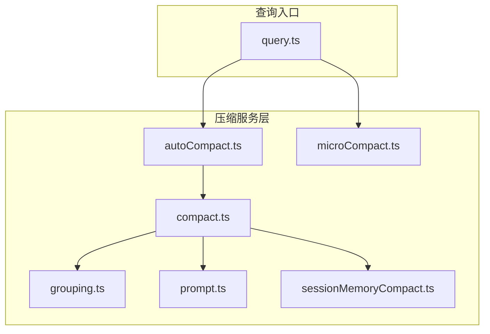
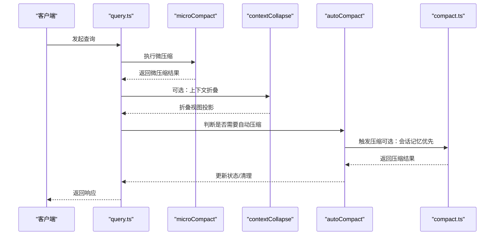
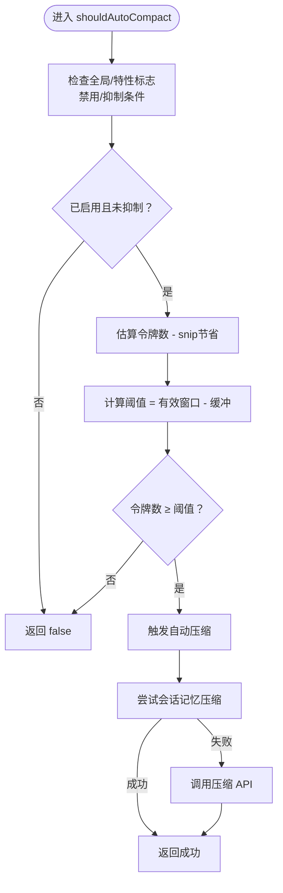
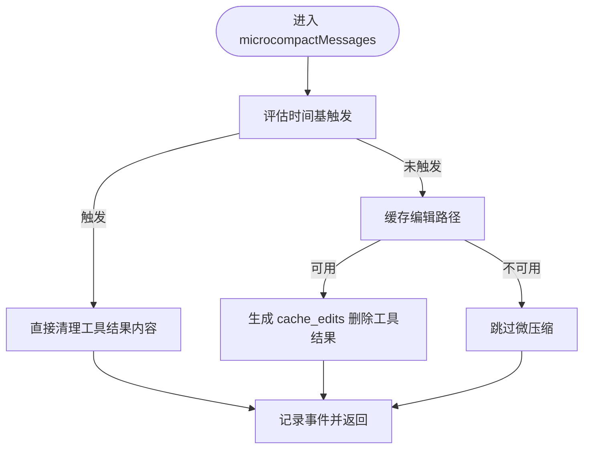
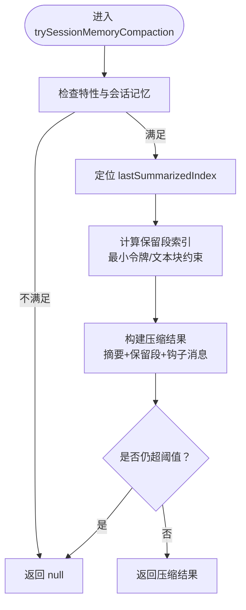
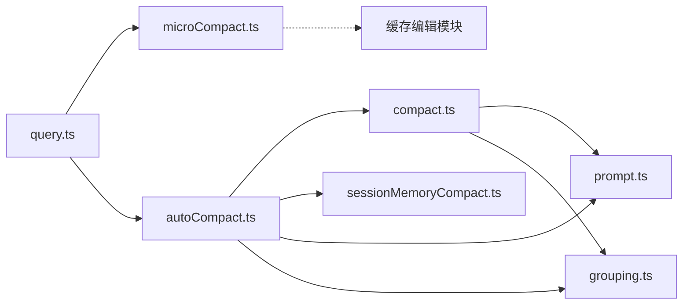

# 压缩算法实现

<cite>
**本文档引用的文件**
- [autoCompact.ts](file://src/services/compact/autoCompact.ts)
- [compact.ts](file://src/services/compact/compact.ts)
- [grouping.ts](file://src/services/compact/grouping.ts)
- [microCompact.ts](file://src/services/compact/microCompact.ts)
- [prompt.ts](file://src/services/compact/prompt.ts)
- [sessionMemoryCompact.ts](file://src/services/compact/sessionMemoryCompact.ts)
- [query.ts](file://src/query.ts)
- [README.md](file://README.md)
</cite>

## 目录
1. [简介](#简介)
2. [项目结构](#项目结构)
3. [核心组件](#核心组件)
4. [架构总览](#架构总览)
5. [详细组件分析](#详细组件分析)
6. [依赖关系分析](#依赖关系分析)
7. [性能考量](#性能考量)
8. [故障排查指南](#故障排查指南)
9. [结论](#结论)

## 简介
本文件系统性梳理 Claude Code 的上下文压缩算法体系，重点覆盖三种主要压缩策略：autoCompact（自动压缩）、snipCompact（截断压缩，基于 HISTORY_SNIP 特性标志）、contextCollapse（上下文折叠，基于 CONTEXT_COLLAPSE 特性标志）。文档从算法原理、触发条件、压缩效果、适用场景、边界标记机制、最近消息保留策略、压缩组算法、阈值计算、缓冲区管理、失败重试机制等方面进行深入解析，并提供性能对比、内存节省效果分析与压缩质量评估方法，帮助读者在不同对话长度与复杂度场景下选择合适的压缩策略。

## 项目结构
围绕上下文压缩的核心代码位于 src/services/compact 目录，包含以下关键模块：
- autoCompact.ts：自动压缩主流程与阈值判定
- compact.ts：通用压缩流程、边界标记、附件重建、事件统计
- grouping.ts：按 API 轮次分组，确保压缩边界满足 API 合约
- microCompact.ts：微压缩（缓存编辑/时间触发），用于减少工具结果占用
- prompt.ts：压缩提示词模板与格式化
- sessionMemoryCompact.ts：会话记忆压缩（实验性），优先于传统压缩

此外，查询入口 query.ts 在每次请求前调用 microCompact 并在特定条件下执行 contextCollapse。

图表来源
- [autoCompact.ts](file://src/services/compact/autoCompact.ts)
- [compact.ts](file://src/services/compact/compact.ts)
- [grouping.ts](file://src/services/compact/grouping.ts)
- [microCompact.ts](file://src/services/compact/microCompact.ts)
- [prompt.ts](file://src/services/compact/prompt.ts)
- [sessionMemoryCompact.ts](file://src/services/compact/sessionMemoryCompact.ts)
- [query.ts](file://src/query.ts)

章节来源
- [README.md](file://README.md)
- [query.ts](file://src/query.ts)

## 核心组件
- 自动压缩（autoCompact）
  - 功能：当对话令牌数接近上下文窗口阈值时，自动触发压缩，生成摘要并保留近期高保真消息
  - 关键点：有效上下文窗口计算、阈值缓冲区、警告/错误阈值、失败熔断器、会话记忆压缩优先级
- 微压缩（microCompact）
  - 功能：通过缓存编辑或时间触发清理工具结果，降低前缀写回成本，提升缓存命中率
  - 关键点：缓存编辑路径、时间基触发、直接内容清理、边界消息延迟插入
- 会话记忆压缩（sessionMemoryCompact）
  - 功能：从会话记忆中提取摘要与保留段，避免完整压缩 API 调用
  - 关键点：最小令牌/文本块数量约束、最大令牌上限、工具对齐与思考块合并保护
- 压缩提示词（prompt）
  - 功能：提供压缩分析与摘要结构化的提示词模板，保证输出可读性与一致性
- 分组算法（grouping）
  - 功能：按 API 轮次分组，确保压缩边界满足 API 合约（工具调用必须在助手回复前完成）

章节来源
- [autoCompact.ts](file://src/services/compact/autoCompact.ts)
- [compact.ts](file://src/services/compact/compact.ts)
- [microCompact.ts](file://src/services/compact/microCompact.ts)
- [sessionMemoryCompact.ts](file://src/services/compact/sessionMemoryCompact.ts)
- [prompt.ts](file://src/services/compact/prompt.ts)
- [grouping.ts](file://src/services/compact/grouping.ts)

## 架构总览
整体流程：查询前先执行微压缩（microCompact），随后根据配置可能执行上下文折叠（contextCollapse），最后在必要时执行自动压缩（autoCompact）。自动压缩内部可优先尝试会话记忆压缩（sessionMemoryCompact），否则走传统压缩流程。

图表来源
- [query.ts](file://src/query.ts)
- [microCompact.ts](file://src/services/compact/microCompact.ts)
- [autoCompact.ts](file://src/services/compact/autoCompact.ts)
- [compact.ts](file://src/services/compact/compact.ts)

## 详细组件分析

### 自动压缩（autoCompact）
- 工作原理
  - 计算有效上下文窗口：context_window - max_output_tokens_for_summary，支持环境变量覆盖
  - 阈值 = 有效窗口 - 缓冲区（AUTOCOMPACT_BUFFER_TOKENS）
  - 当当前令牌数超过阈值且未被抑制（reactive-only 或 context-collapse 模式下可能抑制），则触发压缩
  - 优先尝试会话记忆压缩；若失败或不适用，则调用压缩 API 生成摘要
- 触发条件
  - 用户启用 autoCompact 且未禁用
  - 非 session_memory/compact 查询源
  - 非 marble_origami（上下文代理）查询源
  - 非 REACTIVE_COMPACT 或 CONTEXT_COLLAPSE 模式抑制
  - 当前令牌数 ≥ 阈值
- 压缩效果
  - 生成压缩边界标记与摘要消息，保留近期高保真消息
  - 统计压缩前后令牌数、缓存读取/创建、输出令牌等指标
- 失败重试机制
  - 连续失败达到阈值（MAX_CONSECUTIVE_AUTOCOMPACT_FAILURES）后熔断，避免无意义重试
  - 对 prompt-too-long 场景提供兜底“头部截断”重试策略
- 适用场景
  - 长对话、工具结果累积导致上下文压力大
  - 需要保持近期消息高保真，同时大幅降低历史上下文

图表来源
- [autoCompact.ts](file://src/services/compact/autoCompact.ts)
- [compact.ts](file://src/services/compact/compact.ts)

章节来源
- [autoCompact.ts](file://src/services/compact/autoCompact.ts)
- [compact.ts](file://src/services/compact/compact.ts)

### 截断压缩（snipCompact）
- 工作原理
  - 移除僵尸消息与过期标记，释放上下文空间
  - 通过 HISTORY_SNIP 特性标志启用
- 触发条件
  - 开启 HISTORY_SNIP 特性且满足触发逻辑（由具体实现决定）
- 压缩效果
  - 快速释放历史冗余，适合短期对话或临时性噪声
- 适用场景
  - 对话较短但存在大量中间态消息
  - 需要快速瘦身而非深度摘要

章节来源
- [README.md](file://README.md)

### 上下文折叠（contextCollapse）
- 工作原理
  - 在读取时对历史进行投影，不实际写入摘要消息，从而在不改变消息数组的情况下降低上下文占用
  - 通过 CONTEXT_COLLAPSE 特性标志启用
- 触发条件
  - 开启 CONTEXT_COLLAPSE 特性且处于折叠模式
- 压缩效果
  - 无需额外消息，仅通过视图投影减少上下文大小
- 适用场景
  - 高频对话、需要保持 granular 上下文以避免 summary 丢失的场景

章节来源
- [README.md](file://README.md)
- [query.ts](file://src/query.ts)

### 微压缩（microCompact）
- 工作原理
  - 缓存编辑路径：在不破坏前缀的前提下删除工具结果，显著降低写回成本
  - 时间基路径：当自上次助手回复以来的时间超过阈值，直接清理旧工具结果内容
- 触发条件
  - 主线程查询源、模型支持缓存编辑、缓存编辑特性开启
  - 或者时间基阈值触发
- 压缩效果
  - 显著降低工具结果占用，提升缓存命中率
- 适用场景
  - 工具结果频繁、对话持续时间较长
  - 需要快速释放上下文且不希望引入摘要消息

图表来源
- [microCompact.ts](file://src/services/compact/microCompact.ts)

章节来源
- [microCompact.ts](file://src/services/compact/microCompact.ts)

### 会话记忆压缩（sessionMemoryCompact）
- 工作原理
  - 从会话记忆中提取摘要与保留段，避免完整压缩 API 调用
  - 通过最小令牌数、最小文本块消息数与最大令牌上限约束保留段
  - 严格处理工具对齐与思考块合并，避免 API 合约违规
- 触发条件
  - 启用会话记忆压缩特性且会话记忆文件存在且非模板
- 压缩效果
  - 无需压缩 API 调用，直接使用会话记忆摘要
- 适用场景
  - 会话记忆丰富、需要快速恢复上下文的场景

图表来源
- [sessionMemoryCompact.ts](file://src/services/compact/sessionMemoryCompact.ts)

章节来源
- [sessionMemoryCompact.ts](file://src/services/compact/sessionMemoryCompact.ts)

### 压缩边界标记机制与最近消息保留策略
- 边界标记
  - 创建系统边界消息，携带压缩元数据（如保留段锚点、发现的工具等）
  - 支持注解保留段，确保链式加载时正确重建连接
- 最近消息保留
  - 自动压缩保留近期高保真消息，避免摘要丢失关键上下文
  - 会话记忆压缩可选择保留部分消息，结合摘要使用

章节来源
- [compact.ts](file://src/services/compact/compact.ts)
- [sessionMemoryCompact.ts](file://src/services/compact/sessionMemoryCompact.ts)

### 压缩组算法（API 轮次分组）
- 目的：确保压缩边界满足 API 合约（每个助手回复前必须完成所有工具调用）
- 方法：按助手消息 id 分割 API 轮次，同一轮内的消息可安全地一起压缩
- 影响：提升压缩安全性，避免工具对齐问题

章节来源
- [grouping.ts](file://src/services/compact/grouping.ts)

### 压缩阈值计算与缓冲区管理
- 有效上下文窗口：context_window - min(max_output_tokens_for_summary, 预设上限)
- 自动压缩阈值：有效窗口 - AUTOCOMPACT_BUFFER_TOKENS
- 缓冲区：
  - AUTOCOMPACT_BUFFER_TOKENS：自动压缩触发缓冲
  - WARNING_THRESHOLD_BUFFER_TOKENS / ERROR_THRESHOLD_BUFFER_TOKENS：警告/错误阈值缓冲
  - MANUAL_COMPACT_BUFFER_TOKENS：手动压缩阻断缓冲
- 环境变量覆盖：
  - CLAUDE_CODE_AUTO_COMPACT_WINDOW：限制上下文窗口
  - CLAUDE_AUTOCOMPACT_PCT_OVERRIDE：按百分比覆盖阈值
  - CLAUDE_CODE_BLOCKING_LIMIT_OVERRIDE：覆盖阻断阈值

章节来源
- [autoCompact.ts](file://src/services/compact/autoCompact.ts)

### 失败重试机制
- 自动压缩熔断：连续失败达到阈值后停止重试，避免无效 API 调用
- prompt-too-long 兜底：当压缩请求本身过长时，按 API 轮次丢弃最旧组并重试
- 微压缩：缓存编辑失败时回退到时间基清理或直接跳过

章节来源
- [autoCompact.ts](file://src/services/compact/autoCompact.ts)
- [compact.ts](file://src/services/compact/compact.ts)
- [microCompact.ts](file://src/services/compact/microCompact.ts)

## 依赖关系分析
- autoCompact 依赖：
  - compact.ts（压缩主流程）
  - sessionMemoryCompact.ts（会话记忆压缩优先）
  - prompt.ts（提示词模板）
  - grouping.ts（分组）
- microCompact 依赖：
  - 缓存编辑模块（受特性标志控制）
  - 时间基配置模块
- compact.ts 依赖：
  - 提示词模板、分组、附件重建、事件统计、API 错误处理

图表来源
- [autoCompact.ts](file://src/services/compact/autoCompact.ts)
- [compact.ts](file://src/services/compact/compact.ts)
- [sessionMemoryCompact.ts](file://src/services/compact/sessionMemoryCompact.ts)
- [prompt.ts](file://src/services/compact/prompt.ts)
- [grouping.ts](file://src/services/compact/grouping.ts)
- [microCompact.ts](file://src/services/compact/microCompact.ts)
- [query.ts](file://src/query.ts)

章节来源
- [autoCompact.ts](file://src/services/compact/autoCompact.ts)
- [compact.ts](file://src/services/compact/compact.ts)
- [microCompact.ts](file://src/services/compact/microCompact.ts)
- [query.ts](file://src/query.ts)

## 性能考量
- 缓存编辑微压缩
  - 通过 cache_edits 删除工具结果，避免完整前缀重写，显著降低写回成本
  - 时间基清理在缓存冷启动时直接清理内容，避免后续写回
- 会话记忆压缩
  - 无需压缩 API 调用，直接使用摘要，减少网络与计算开销
- 自动压缩
  - 通过摘要大幅降低历史上下文，但需承担一次压缩 API 成本
- 分组算法
  - API 轮次分组提升压缩安全性，避免工具对齐问题带来的重试与失败

章节来源
- [microCompact.ts](file://src/services/compact/microCompact.ts)
- [sessionMemoryCompact.ts](file://src/services/compact/sessionMemoryCompact.ts)
- [compact.ts](file://src/services/compact/compact.ts)
- [grouping.ts](file://src/services/compact/grouping.ts)

## 故障排查指南
- 自动压缩失败
  - 检查连续失败计数是否达到熔断阈值
  - 关注 prompt-too-long 兜底策略是否生效
  - 确认是否被 reactive-only 或 context-collapse 抑制
- 微压缩未生效
  - 确认特性标志与模型支持情况
  - 检查查询源是否为主线程
  - 关注时间基触发条件
- 会话记忆压缩异常
  - 检查会话记忆文件是否存在且非模板
  - 关注保留段索引计算与工具对齐调整

章节来源
- [autoCompact.ts](file://src/services/compact/autoCompact.ts)
- [microCompact.ts](file://src/services/compact/microCompact.ts)
- [sessionMemoryCompact.ts](file://src/services/compact/sessionMemoryCompact.ts)

## 结论
Claude Code 的上下文压缩体系通过微压缩、会话记忆压缩与自动压缩的协同，实现了在不同对话长度与复杂度下的高效上下文管理。微压缩优先释放工具结果占用，会话记忆压缩在具备丰富记忆时避免 API 调用，自动压缩在必要时生成摘要并保留近期高保真消息。结合 API 轮次分组与严格的边界标记机制，系统在保证 API 合约合规的同时，最大化压缩效果与用户体验。建议根据对话特征选择合适策略组合：短对话优先微压缩；长对话且记忆丰富优先会话记忆压缩；极端长对话再考虑自动压缩。