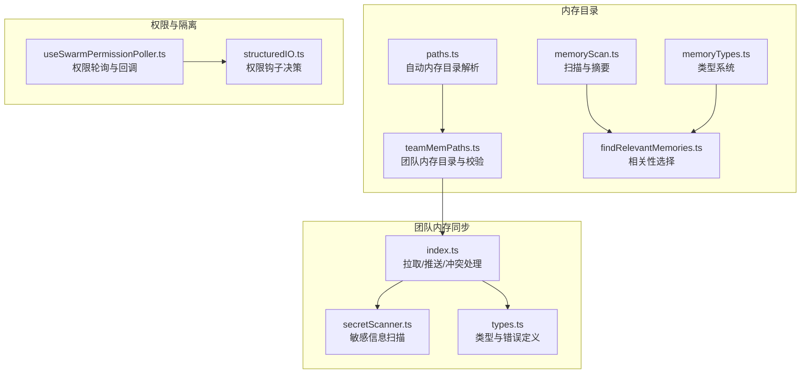
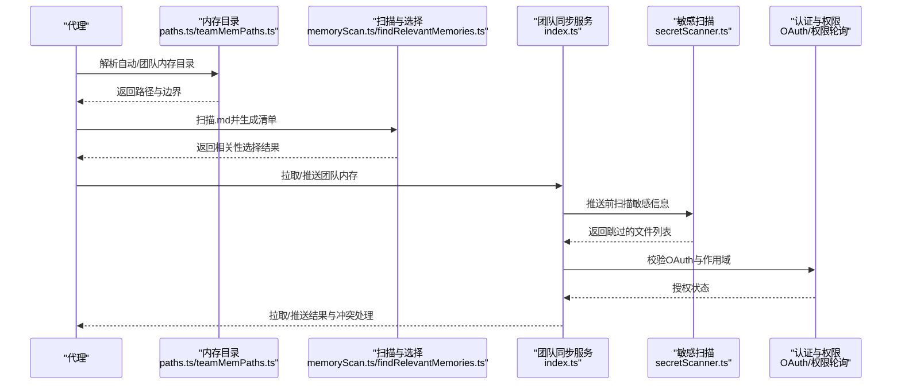
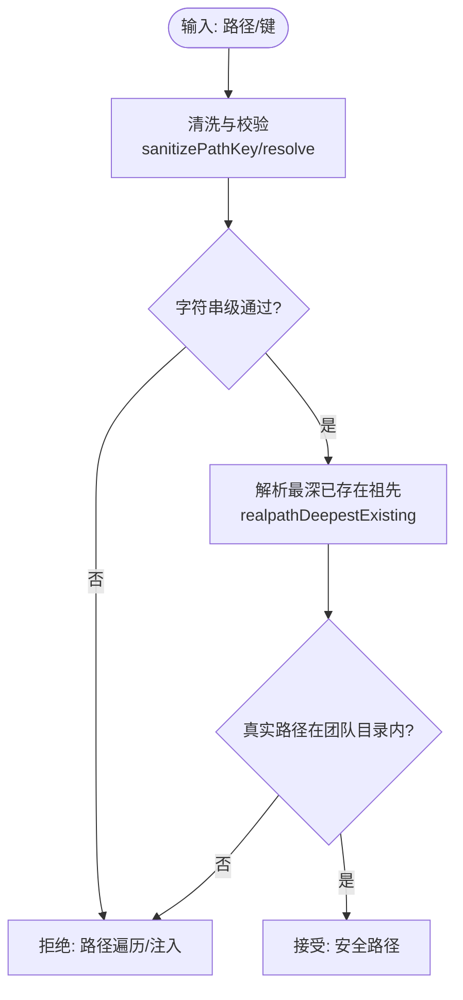
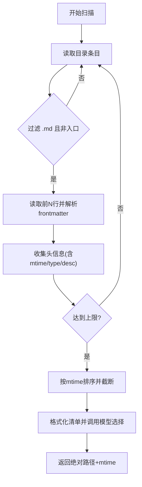
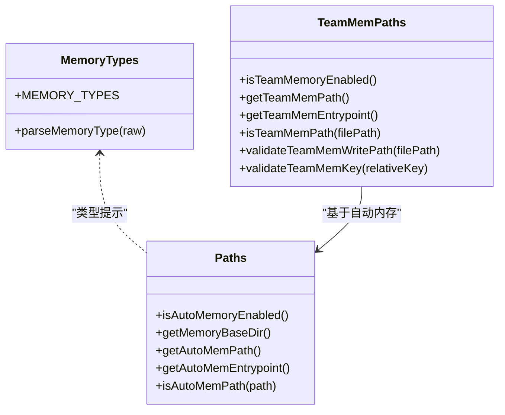
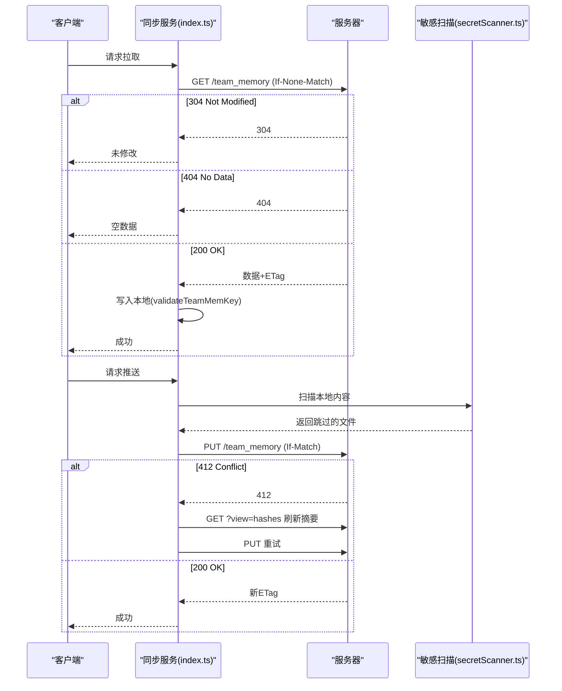
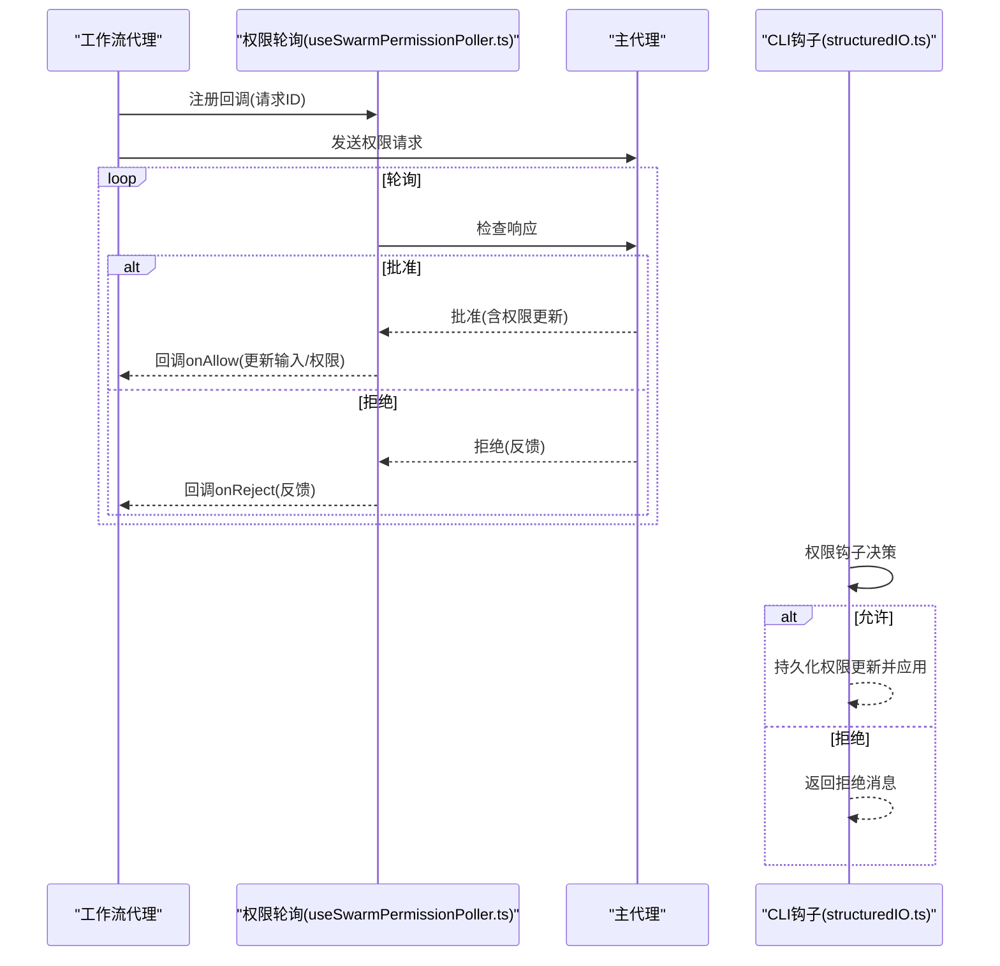
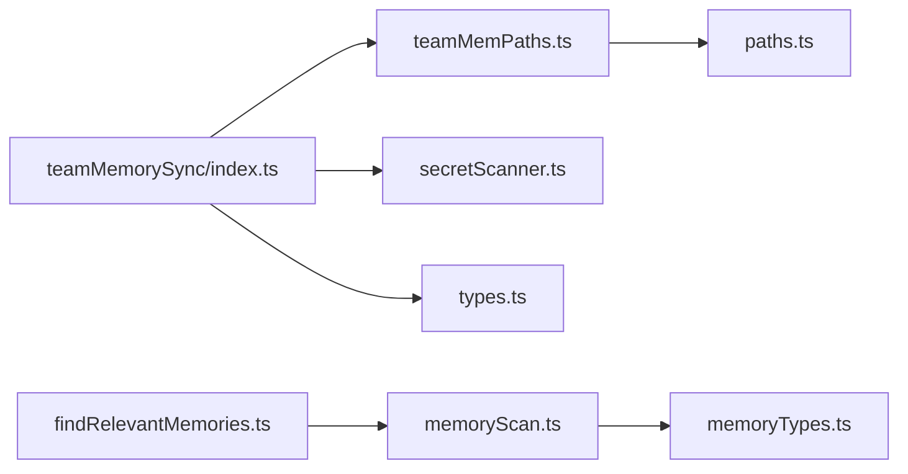

# 代理内存共享与隔离

<cite>
**本文档引用的文件**
- [teamMemPaths.ts](file://src/memdir/teamMemPaths.ts)
- [paths.ts](file://src/memdir/paths.ts)
- [memoryScan.ts](file://src/memdir/memoryScan.ts)
- [findRelevantMemories.ts](file://src/memdir/findRelevantMemories.ts)
- [memoryTypes.ts](file://src/memdir/memoryTypes.ts)
- [index.ts](file://src/services/teamMemorySync/index.ts)
- [secretScanner.ts](file://src/services/teamMemorySync/secretScanner.ts)
- [types.ts](file://src/services/teamMemorySync/types.ts)
- [useSwarmPermissionPoller.ts](file://src/hooks/useSwarmPermissionPoller.ts)
- [structuredIO.ts](file://src/cli/structuredIO.ts)
</cite>

## 目录
1. [引言](#引言)
2. [项目结构](#项目结构)
3. [核心组件](#核心组件)
4. [架构总览](#架构总览)
5. [详细组件分析](#详细组件分析)
6. [依赖关系分析](#依赖关系分析)
7. [性能考量](#性能考量)
8. [故障排查指南](#故障排查指南)
9. [结论](#结论)
10. [附录](#附录)

## 引言
本文件面向代理内存共享与隔离机制的技术文档，聚焦以下目标：
- 设计原理：基于“自动内存目录”和“团队内存目录”的分层隔离，确保私有与团队范围的边界清晰。
- 实现方式：通过路径校验、写入验证、内容扫描与哈希比对实现安全共享。
- 安全策略：防御路径遍历、符号链接逃逸、敏感信息泄露；结合 OAuth 访问控制与冲突解决。
- 团队同步：拉取（服务器覆盖本地）、推送（差异上传）与冲突处理（ETag + 摘要刷新）。
- 内存类型系统与路径管理：统一的类型定义、入口文件、扫描与排序策略。
- 隔离策略：目录边界、权限控制、审计日志与异常处理。

## 项目结构
围绕“内存目录”和“团队内存同步服务”，关键模块如下：
- 路径与边界：自动内存目录解析、团队内存目录解析与校验、路径规范化与安全检查。
- 内容扫描：内存文件扫描、摘要提取、相关性选择。
- 类型系统：内存类型定义、提示词引导与使用约束。
- 同步服务：拉取/推送、冲突处理、大小限制、条目上限、敏感信息扫描。
- 权限与隔离：OAuth 访问控制、回调注册与响应处理、权限更新与审计。

图表来源
- [paths.ts:1-279](file://src/memdir/paths.ts#L1-L279)
- [teamMemPaths.ts:1-293](file://src/memdir/teamMemPaths.ts#L1-L293)
- [memoryScan.ts:1-95](file://src/memdir/memoryScan.ts#L1-L95)
- [findRelevantMemories.ts:1-142](file://src/memdir/findRelevantMemories.ts#L1-L142)
- [memoryTypes.ts:1-272](file://src/memdir/memoryTypes.ts#L1-L272)
- [index.ts:1-1257](file://src/services/teamMemorySync/index.ts#L1-L1257)
- [secretScanner.ts:1-325](file://src/services/teamMemorySync/secretScanner.ts#L1-L325)
- [types.ts:1-157](file://src/services/teamMemorySync/types.ts#L1-L157)
- [useSwarmPermissionPoller.ts:1-331](file://src/hooks/useSwarmPermissionPoller.ts#L1-L331)
- [structuredIO.ts:811-859](file://src/cli/structuredIO.ts#L811-L859)

章节来源
- [paths.ts:1-279](file://src/memdir/paths.ts#L1-L279)
- [teamMemPaths.ts:1-293](file://src/memdir/teamMemPaths.ts#L1-L293)
- [memoryScan.ts:1-95](file://src/memdir/memoryScan.ts#L1-L95)
- [findRelevantMemories.ts:1-142](file://src/memdir/findRelevantMemories.ts#L1-L142)
- [memoryTypes.ts:1-272](file://src/memdir/memoryTypes.ts#L1-L272)
- [index.ts:1-1257](file://src/services/teamMemorySync/index.ts#L1-L1257)
- [secretScanner.ts:1-325](file://src/services/teamMemorySync/secretScanner.ts#L1-L325)
- [types.ts:1-157](file://src/services/teamMemorySync/types.ts#L1-L157)
- [useSwarmPermissionPoller.ts:1-331](file://src/hooks/useSwarmPermissionPoller.ts#L1-L331)
- [structuredIO.ts:811-859](file://src/cli/structuredIO.ts#L811-L859)

## 核心组件
- 自动内存目录与边界
  - 解析内存基座目录、项目根、入口文件路径，支持环境变量与设置覆盖，并进行安全校验（绝对路径、长度、UNC/驱动器等）。
  - 提供 isAutoMemPath 判断是否在自动内存范围内，用于写入车切与权限判定。
- 团队内存目录与安全校验
  - 基于自动内存目录派生团队内存目录，提供启用判断、入口文件定位。
  - 路径键清洗（空字节、URL 编码遍历、Unicode 正规化、反斜杠、绝对路径），并进行字符串级与符号链接级双重校验，防止遍历与逃逸。
- 内存扫描与相关性选择
  - 扫描 .md 文件，读取前若干行以获取摘要，解析 frontmatter 的 type 与 description，按 mtime 排序并限制数量。
  - 使用大模型对可用清单进行相关性选择，返回最相关的文件路径与时间戳。
- 内存类型系统
  - 定义 user/feedback/project/reference 四类类型，提供组合模式与独立模式下的提示词与使用指导，强调“不可衍生信息”原则。
- 团队内存同步服务
  - 拉取：条件请求（ETag），304/404 处理，写入本地时逐项校验路径边界，跳过未变更文件。
  - 推送：计算本地内容哈希，仅上传与服务器摘要不同的条目；批量按体积限制拆分；冲突（412）时刷新摘要后重试。
  - 敏感信息扫描：推送前扫描内容，命中规则则跳过该文件并记录告警。
  - 条目上限：学习服务器返回的 max_entries 并截断，避免一次性 413。
- 权限与隔离
  - OAuth 访问控制：要求具备特定作用域，否则禁用团队内存同步。
  - 权限轮询：工作流代理通过轮询等待主代理授权，回调注册/注销与响应处理。
  - CLI 权限钩子：允许工具使用前的权限决策与权限更新持久化。

章节来源
- [paths.ts:1-279](file://src/memdir/paths.ts#L1-L279)
- [teamMemPaths.ts:1-293](file://src/memdir/teamMemPaths.ts#L1-L293)
- [memoryScan.ts:1-95](file://src/memdir/memoryScan.ts#L1-L95)
- [findRelevantMemories.ts:1-142](file://src/memdir/findRelevantMemories.ts#L1-L142)
- [memoryTypes.ts:1-272](file://src/memdir/memoryTypes.ts#L1-L272)
- [index.ts:1-1257](file://src/services/teamMemorySync/index.ts#L1-L1257)
- [secretScanner.ts:1-325](file://src/services/teamMemorySync/secretScanner.ts#L1-L325)
- [types.ts:1-157](file://src/services/teamMemorySync/types.ts#L1-L157)
- [useSwarmPermissionPoller.ts:1-331](file://src/hooks/useSwarmPermissionPoller.ts#L1-L331)
- [structuredIO.ts:811-859](file://src/cli/structuredIO.ts#L811-L859)

## 架构总览
下图展示从本地内存到团队同步服务的整体流程，以及安全与权限控制的关键节点。

图表来源
- [paths.ts:1-279](file://src/memdir/paths.ts#L1-L279)
- [teamMemPaths.ts:1-293](file://src/memdir/teamMemPaths.ts#L1-L293)
- [memoryScan.ts:1-95](file://src/memdir/memoryScan.ts#L1-L95)
- [findRelevantMemories.ts:1-142](file://src/memdir/findRelevantMemories.ts#L1-L142)
- [index.ts:1-1257](file://src/services/teamMemorySync/index.ts#L1-L1257)
- [secretScanner.ts:1-325](file://src/services/teamMemorySync/secretScanner.ts#L1-L325)
- [useSwarmPermissionPoller.ts:1-331](file://src/hooks/useSwarmPermissionPoller.ts#L1-L331)

## 详细组件分析

### 组件A：路径与边界（自动内存与团队内存）
- 自动内存目录解析
  - 环境变量优先：远程内存目录覆盖、简单模式禁用、无持久存储时禁用。
  - 设置覆盖：受信任来源（策略/本地/用户）支持 ~/ 展开，但不作为危险源。
  - 项目根归一：使用 Git canonical root，跨 worktree 共享同一目录。
  - 安全校验：拒绝相对路径、根路径、UNC/驱动器、空字节、非 NFC 规范化。
- 团队内存目录解析与校验
  - 基于自动内存目录派生团队目录，提供入口文件路径。
  - 启用判断：需同时满足自动内存启用与特性开关。
  - 路径键清洗：空字节、URL 编码遍历、Unicode 正规化攻击、反斜杠、绝对路径均拒绝。
  - 双重校验：resolve 字符串级 + realpathDeepestExisting 符号链接级，防止 symlink 逃逸与环路。
  - 写入校验：validateTeamMemWritePath/validateTeamMemKey 在写入前进行严格校验。

图表来源
- [teamMemPaths.ts:17-64](file://src/memdir/teamMemPaths.ts#L17-L64)
- [teamMemPaths.ts:109-171](file://src/memdir/teamMemPaths.ts#L109-L171)
- [teamMemPaths.ts:183-206](file://src/memdir/teamMemPaths.ts#L183-L206)
- [teamMemPaths.ts:228-284](file://src/memdir/teamMemPaths.ts#L228-L284)

章节来源
- [paths.ts:1-279](file://src/memdir/paths.ts#L1-L279)
- [teamMemPaths.ts:1-293](file://src/memdir/teamMemPaths.ts#L1-L293)

### 组件B：内存扫描与相关性选择
- 扫描策略
  - 递归读取目录，过滤 .md 且排除入口文件，限制最大文件数。
  - 单次读取前若干行以获取 mtime 与 frontmatter，避免额外 stat。
  - 解析 type 与 description，按 mtime 降序，截断至上限。
- 相关性选择
  - 将清单格式化为文本，结合近期工具列表，调用模型选择最相关文件名。
  - 输出包含绝对路径与 mtime，便于后续新鲜度展示。

图表来源
- [memoryScan.ts:35-77](file://src/memdir/memoryScan.ts#L35-L77)
- [findRelevantMemories.ts:39-75](file://src/memdir/findRelevantMemories.ts#L39-L75)

章节来源
- [memoryScan.ts:1-95](file://src/memdir/memoryScan.ts#L1-L95)
- [findRelevantMemories.ts:1-142](file://src/memdir/findRelevantMemories.ts#L1-L142)

### 组件C：内存类型系统与路径管理
- 类型定义
  - user/feedback/project/reference 四类，明确 scope 与使用场景，避免保存可从当前项目状态推导的信息。
- 路径管理
  - 自动内存目录：支持环境变量覆盖、设置覆盖、项目根归一化、入口文件定位。
  - 团队内存目录：派生于自动内存，提供入口文件与启用判断。

图表来源
- [memoryTypes.ts:14-31](file://src/memdir/memoryTypes.ts#L14-L31)
- [paths.ts:30-279](file://src/memdir/paths.ts#L30-L279)
- [teamMemPaths.ts:73-292](file://src/memdir/teamMemPaths.ts#L73-L292)

章节来源
- [memoryTypes.ts:1-272](file://src/memdir/memoryTypes.ts#L1-L272)
- [paths.ts:1-279](file://src/memdir/paths.ts#L1-L279)
- [teamMemPaths.ts:1-293](file://src/memdir/teamMemPaths.ts#L1-L293)

### 组件D：团队内存同步服务（拉取/推送/冲突）
- 拉取（Pull）
  - 条件请求：If-None-Match（ETag），304 表示未修改；404 表示无远端数据。
  - 写入策略：逐项 validateTeamMemKey，跳过已匹配内容，保持 mtime 不变。
- 推送（Push）
  - 差异上传：计算本地内容哈希，与服务器摘要对比，仅上传不同条目。
  - 批量策略：按体积上限拆分，保证单体不超过网关阈值。
  - 冲突处理：412 Precondition Failed 时，刷新摘要后重试；学习服务器 max_entries 并截断。
- 敏感信息扫描（PSR M22174）
  - 推送前扫描，命中规则则跳过该文件并记录告警；扫描规则来自 gitleaks 的高置信度集合。
- 认证与权限
  - 需要 first-party OAuth 且具备推理与个人资料作用域；否则禁用同步。
  - 结果类型与错误模型由 Zod 定义，便于结构化解析与事件上报。

图表来源
- [index.ts:188-410](file://src/services/teamMemorySync/index.ts#L188-L410)
- [index.ts:462-553](file://src/services/teamMemorySync/index.ts#L462-L553)
- [index.ts:557-755](file://src/services/teamMemorySync/index.ts#L557-L755)
- [secretScanner.ts:277-295](file://src/services/teamMemorySync/secretScanner.ts#L277-L295)
- [types.ts:16-57](file://src/services/teamMemorySync/types.ts#L16-L57)

章节来源
- [index.ts:1-1257](file://src/services/teamMemorySync/index.ts#L1-L1257)
- [secretScanner.ts:1-325](file://src/services/teamMemorySync/secretScanner.ts#L1-L325)
- [types.ts:1-157](file://src/services/teamMemorySync/types.ts#L1-L157)

### 组件E：权限与隔离（OAuth、回调、权限更新）
- OAuth 访问控制
  - 要求 first-party 且基础地址可信，同时具备推理与个人资料作用域。
- 权限轮询（工作流代理）
  - 注册/注销回调，轮询响应文件，处理批准/拒绝与权限更新，清理响应文件。
- CLI 权限钩子
  - 工具使用前的权限决策，支持“始终允许”的权限更新持久化与上下文应用。

图表来源
- [useSwarmPermissionPoller.ts:82-156](file://src/hooks/useSwarmPermissionPoller.ts#L82-L156)
- [useSwarmPermissionPoller.ts:268-331](file://src/hooks/useSwarmPermissionPoller.ts#L268-L331)
- [structuredIO.ts:811-859](file://src/cli/structuredIO.ts#L811-L859)

章节来源
- [useSwarmPermissionPoller.ts:1-331](file://src/hooks/useSwarmPermissionPoller.ts#L1-L331)
- [structuredIO.ts:811-859](file://src/cli/structuredIO.ts#L811-L859)

## 依赖关系分析
- 模块耦合
  - teamMemPaths.ts 依赖 paths.ts 获取自动内存目录，依赖错误工具与环境工具进行安全校验。
  - teamMemorySync/index.ts 依赖 teamMemPaths.ts 进行路径校验，依赖 secretScanner.ts 进行敏感扫描，依赖 types.ts 的类型与错误模型。
  - findRelevantMemories.ts 依赖 memoryScan.ts 进行扫描与格式化，依赖模型与侧查询工具进行相关性选择。
- 外部依赖
  - axios 用于 HTTP 请求与重试延迟计算。
  - Zod 用于服务端响应与错误的结构化解析。
  - gitleaks 规则集用于敏感信息扫描（仅高置信度规则）。

图表来源
- [teamMemPaths.ts:1-6](file://src/memdir/teamMemPaths.ts#L1-L6)
- [index.ts:27-70](file://src/services/teamMemorySync/index.ts#L27-L70)
- [findRelevantMemories.ts:1-12](file://src/memdir/findRelevantMemories.ts#L1-L12)
- [memoryScan.ts:7-12](file://src/memdir/memoryScan.ts#L7-L12)

章节来源
- [teamMemPaths.ts:1-293](file://src/memdir/teamMemPaths.ts#L1-L293)
- [index.ts:1-1257](file://src/services/teamMemorySync/index.ts#L1-L1257)
- [findRelevantMemories.ts:1-142](file://src/memdir/findRelevantMemories.ts#L1-L142)
- [memoryScan.ts:1-95](file://src/memdir/memoryScan.ts#L1-L95)
- [memoryTypes.ts:1-272](file://src/memdir/memoryTypes.ts#L1-L272)

## 性能考量
- 扫描优化
  - 单次读取前若干行并返回 mtime，避免额外 stat，减少系统调用。
  - 最终只对保留的前 N 个条目进行排序，降低复杂度。
- 写入优化
  - 拉取时跳过内容一致的文件，保持 mtime 不变，避免缓存失效与不必要的监听事件。
- 批量与冲突
  - 按体积上限拆分批量上传，避免网关 413；冲突时仅刷新摘要后重试，减少重复传输。
- 缓存与幂等
  - ETag 与摘要缓存用于条件请求与差异计算，提升网络效率。

## 故障排查指南
- 路径校验失败
  - 症状：抛出路径遍历错误或拒绝写入。
  - 排查：检查路径是否包含空字节、URL 编码遍历、Unicode 正规化攻击、反斜杠、绝对路径；确认团队目录存在且未被 symlink 逃逸。
- 符号链接问题
  - 症状：无法确定真实路径或检测到环路/悬空链接。
  - 排查：检查 realpathDeepestExisting 的错误码（如 ELOOP、EACCES、EIO），必要时修复文件系统状态。
- 推送冲突
  - 症状：412 Precondition Failed。
  - 排查：先刷新摘要（?view=hashes），再重试；若服务器返回条目过多，学习 max_entries 并截断。
- 敏感信息泄露
  - 症状：某些文件被跳过。
  - 排查：查看扫描规则与告警，确认是否命中高置信度规则；必要时移除或脱敏。
- OAuth 未授权
  - 症状：团队内存同步不可用。
  - 排查：确认使用 first-party OAuth、基础地址可信、具备所需作用域；检查令牌有效性与刷新逻辑。

章节来源
- [teamMemPaths.ts:109-171](file://src/memdir/teamMemPaths.ts#L109-L171)
- [index.ts:188-410](file://src/services/teamMemorySync/index.ts#L188-L410)
- [index.ts:462-553](file://src/services/teamMemorySync/index.ts#L462-L553)
- [secretScanner.ts:277-295](file://src/services/teamMemorySync/secretScanner.ts#L277-L295)

## 结论
本机制通过“自动内存目录 + 团队内存目录”的双层边界设计，结合严格的路径清洗、符号链接解析与写入校验，实现了代理间的内存共享与隔离。团队同步服务采用差异上传、体积分批与冲突重试策略，并在推送前进行敏感信息扫描，确保数据安全。权限控制与回调机制进一步强化了跨代理协作的安全边界。整体设计兼顾安全性、可维护性与性能。

## 附录
- 配置示例（概念性说明）
  - 自动内存启用：默认启用；可通过环境变量禁用、简单模式禁用、无持久存储禁用、设置覆盖。
  - 团队内存启用：需满足自动内存启用与特性开关。
  - 推送体积限制：单批不超过 200KB，单文件不超过 250KB；学习服务器 max_entries 并截断。
  - 敏感扫描：使用 gitleaks 高置信度规则集，命中即跳过文件并记录告警。
- 安全最佳实践
  - 严禁在团队内存中存放任何敏感凭据；推送前务必扫描。
  - 严格遵循路径清洗与校验流程，避免 ../、空字节、Unicode 正规化攻击。
  - 使用 OAuth 与作用域控制访问；定期刷新令牌。
- 性能优化建议
  - 扫描阶段尽量限制文件数量与读取行数；拉取阶段利用 ETag 与摘要缓存。
  - 批量上传按体积上限拆分，避免单次超大请求；冲突时优先刷新摘要再重试。