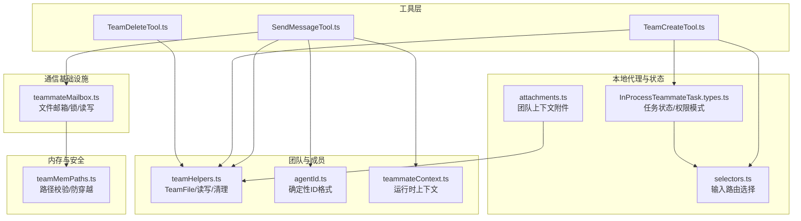
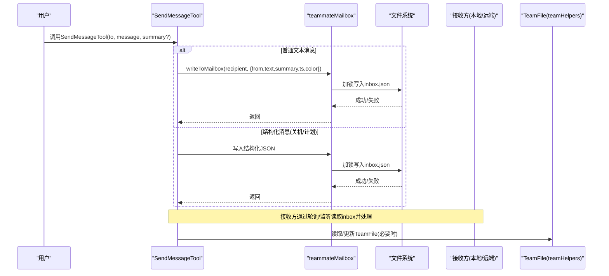
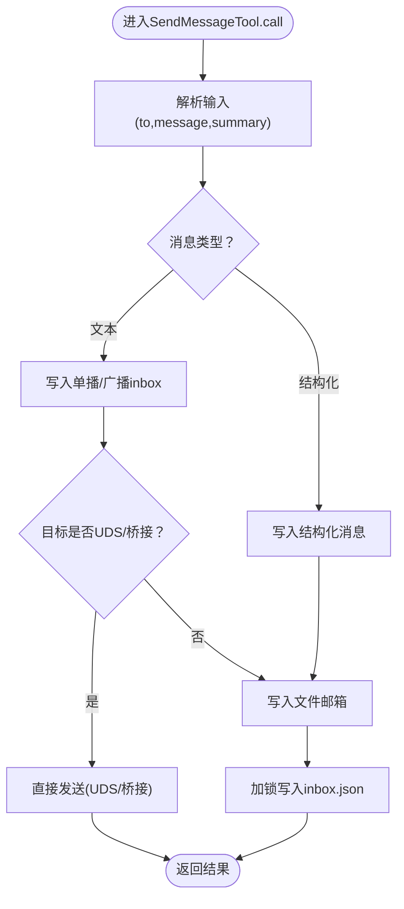
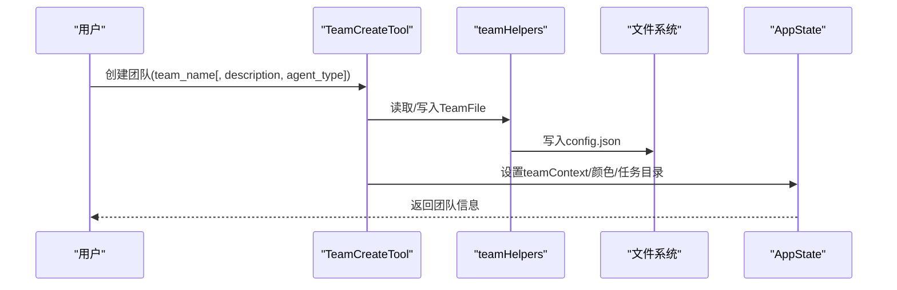
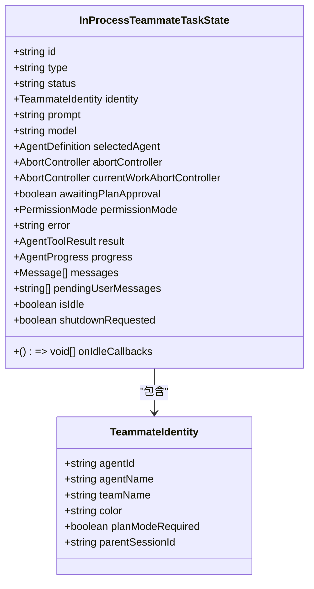
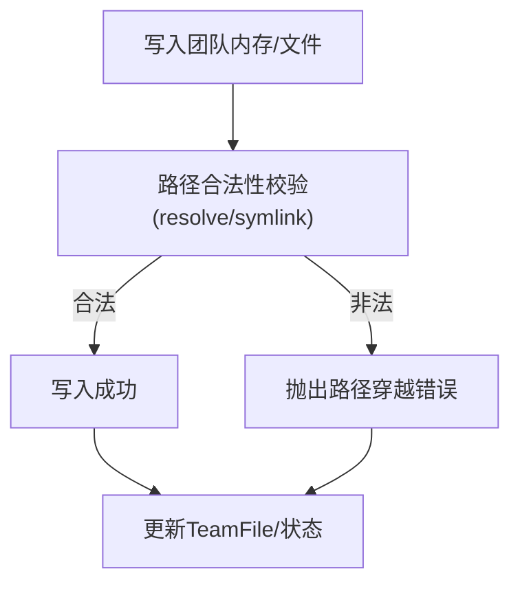
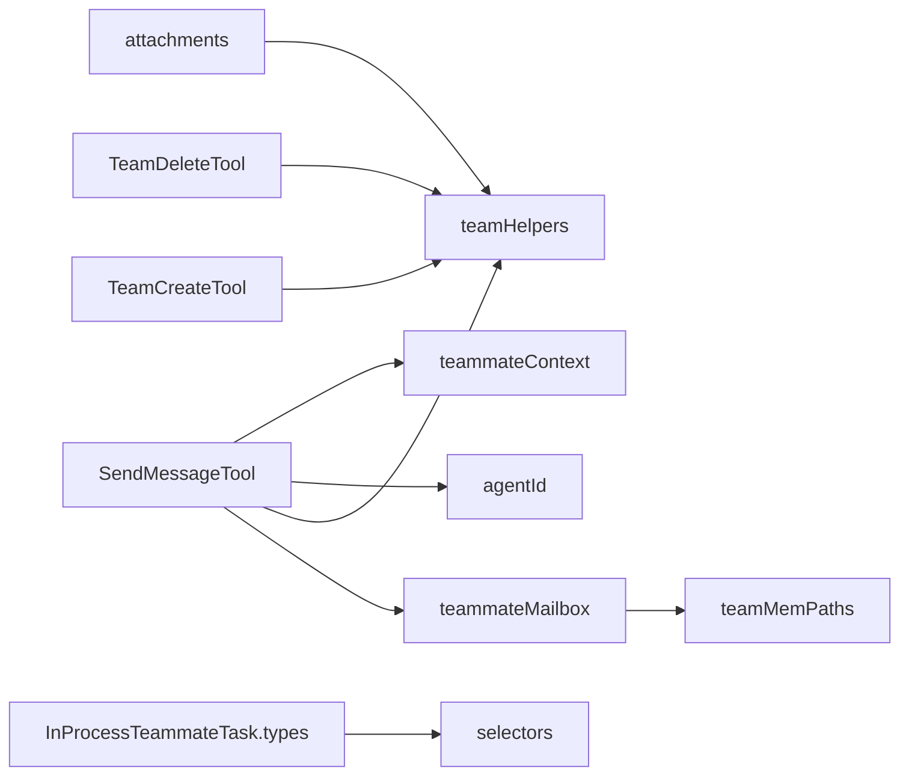

# 团队通信机制

<cite>
**本文引用的文件**
- [SendMessageTool.ts](file://src/tools/SendMessageTool/SendMessageTool.ts)
- [TeamCreateTool.ts](file://src/tools/TeamCreateTool/TeamCreateTool.ts)
- [TeamDeleteTool.ts](file://src/tools/TeamDeleteTool/TeamDeleteTool.ts)
- [teammateMailbox.ts](file://src/utils/teammateMailbox.ts)
- [teamHelpers.ts](file://src/utils/swarm/teamHelpers.ts)
- [types.ts](file://src/times/InProcessTeammateTask/types.ts)
- [agentId.ts](file://src/utils/agentId.ts)
- [tasks.ts](file://src/utils/tasks.ts)
- [teammateContext.ts](file://src/utils/teammateContext.ts)
- [inProcessTeammateHelpers.ts](file://src/utils/inProcessTeammateHelpers.ts)
- [teamMemPaths.ts](file://src/memdir/teamMemPaths.ts)
- [tools.ts](file://src/tools.ts)
- [Task.ts](file://src/Task.ts)
- [selectors.ts](file://src/state/selectors.ts)
- [attachments.ts](file://src/utils/attachments.ts)
</cite>

## 目录
1. [引言](#引言)
2. [项目结构](#项目结构)
3. [核心组件](#核心组件)
4. [架构总览](#架构总览)
5. [详细组件分析](#详细组件分析)
6. [依赖关系分析](#依赖关系分析)
7. [性能考量](#性能考量)
8. [故障排查指南](#故障排查指南)
9. [结论](#结论)
10. [附录](#附录)

## 引言
本文件系统性阐述团队通信机制，覆盖代理间消息传递、团队协作与信息共享、消息格式与路由策略、传递保证、团队创建与管理、本地代理协作与状态同步、冲突处理、团队内存同步与一致性、以及性能优化与错误恢复策略。目标是帮助开发者在不深入源码的情况下理解并正确使用该机制。

## 项目结构
围绕团队通信的关键模块分布如下：
- 工具层：SendMessageTool、TeamCreateTool、TeamDeleteTool
- 通信基础设施：teammateMailbox（基于文件的邮箱系统）
- 团队元数据与成员管理：teamHelpers（团队配置、成员列表、持久化）
- 本地代理任务类型与状态：InProcessTeammateTask.types
- 标识与路由：agentId（确定性ID）、teammateContext（运行时上下文）
- 任务与状态选择器：Task、selectors
- 附件注入与上下文：attachments
- 内存安全与路径校验：teamMemPaths
- 其他辅助：inProcessTeammateHelpers、tools.ts（延迟加载）

**图表来源**
- [SendMessageTool.ts:1-918](file://src/tools/SendMessageTool/SendMessageTool.ts#L1-L918)
- [TeamCreateTool.ts:1-241](file://src/tools/TeamCreateTool/TeamCreateTool.ts#L1-L241)
- [TeamDeleteTool.ts:1-140](file://src/tools/TeamDeleteTool/TeamDeleteTool.ts#L1-L140)
- [teammateMailbox.ts:1-200](file://src/utils/teammateMailbox.ts#L1-L200)
- [teamHelpers.ts:1-200](file://src/utils/swarm/teamHelpers.ts#L1-L200)
- [types.ts:1-122](file://src/times/InProcessTeammateTask/types.ts#L1-L122)
- [agentId.ts:1-40](file://src/utils/agentId.ts#L1-L40)
- [teammateContext.ts:73-96](file://src/utils/teammateContext.ts#L73-L96)
- [selectors.ts:43-76](file://src/state/selectors.ts#L43-L76)
- [attachments.ts:3736-3779](file://src/utils/attachments.ts#L3736-L3779)
- [teamMemPaths.ts:214-258](file://src/memdir/teamMemPaths.ts#L214-L258)

**章节来源**
- [tools.ts:54-74](file://src/tools.ts#L54-L74)
- [Task.ts:1-53](file://src/Task.ts#L1-L53)
- [teammateMailbox.ts:1-200](file://src/utils/teammateMailbox.ts#L1-L200)
- [teamHelpers.ts:1-200](file://src/utils/swarm/teamHelpers.ts#L1-L200)

## 核心组件
- SendMessageTool：负责消息发送、广播、结构化请求/响应（如关机请求/批准/拒绝、计划审批/反馈），并支持跨会话桥接与UDS直连。
- TeamCreateTool：创建团队、初始化TeamFile、注册任务目录、设置领导者的团队上下文。
- TeamDeleteTool：清理团队目录与颜色分配、注销会话清理、清空AppState中的团队上下文与收件箱。
- teammateMailbox：以文件为载体的邮箱系统，提供写入、读取、标记已读、锁机制与错误处理。
- teamHelpers：TeamFile的读写、成员管理、路径与清理等。
- InProcessTeammateTask.types：本地代理任务的状态、权限模式、消息队列、生命周期回调等。
- agentId：确定性ID格式（agentName@teamName）与请求ID生成。
- teammateContext：运行时上下文（如是否为本地代理、父会话ID等）。
- selectors：根据当前视图决定用户输入应路由到谁（领导或特定代理）。
- attachments：注入团队上下文附件，仅在首次回合注入。
- teamMemPaths：团队内存目录的安全路径校验，防止路径穿越与符号链接逃逸。

**章节来源**
- [SendMessageTool.ts:520-918](file://src/tools/SendMessageTool/SendMessageTool.ts#L520-L918)
- [TeamCreateTool.ts:74-241](file://src/tools/TeamCreateTool/TeamCreateTool.ts#L74-L241)
- [TeamDeleteTool.ts:32-140](file://src/tools/TeamDeleteTool/TeamDeleteTool.ts#L32-L140)
- [teammateMailbox.ts:43-192](file://src/utils/teammateMailbox.ts#L43-L192)
- [teamHelpers.ts:64-90](file://src/utils/swarm/teamHelpers.ts#L64-L90)
- [types.ts:13-76](file://src/times/InProcessTeammateTask/types.ts#L13-L76)
- [agentId.ts:35-40](file://src/utils/agentId.ts#L35-L40)
- [teammateContext.ts:83-96](file://src/utils/teammateContext.ts#L83-L96)
- [selectors.ts:43-76](file://src/state/selectors.ts#L43-L76)
- [attachments.ts:3775-3779](file://src/utils/attachments.ts#L3775-L3779)
- [teamMemPaths.ts:214-258](file://src/memdir/teamMemPaths.ts#L214-L258)

## 架构总览
下图展示从工具调用到消息落盘与接收端处理的端到端流程，以及团队上下文与任务状态的交互。

**图表来源**
- [SendMessageTool.ts:149-266](file://src/tools/SendMessageTool/SendMessageTool.ts#L149-L266)
- [teammateMailbox.ts:134-192](file://src/utils/teammateMailbox.ts#L134-L192)
- [teamHelpers.ts:147-182](file://src/utils/swarm/teamHelpers.ts#L147-L182)

## 详细组件分析

### SendMessageTool 实现原理
- 输入与分类
  - 支持三种主要类型：普通文本消息、广播（*）、结构化消息（关机请求/响应、计划审批响应）。
  - 对于字符串消息，要求提供摘要；结构化消息禁止广播。
- 路由策略
  - 单播：按代理名写入对应inbox。
  - 广播：读取TeamFile成员列表，排除发件人，逐个写入。
  - 跨会话：UDS直连（uds:socket-path）与远端控制桥接（bridge:session-id）。
- 消息格式
  - 文本消息：包含from、text、timestamp、可选color与summary。
  - 结构化消息：统一的类型字段（如shutdown_request/shutdown_response/plan_approval_response），并携带请求ID、批准与否、原因/反馈等。
- 传递保证
  - 文件锁确保并发写入串行化，避免竞态。
  - 失败时记录日志并返回错误信息。
  - 远端桥接与UDS路径在调用前进行权限检查与连接有效性验证。
- 关机与计划审批
  - 发送关机请求：生成请求ID，写入目标inbox。
  - 接收方批准/拒绝：构造相应消息，写回给领导或记录本地退出逻辑。
  - 计划审批：仅领导可批准/拒绝，并将权限模式继承策略写入响应。

**图表来源**
- [SendMessageTool.ts:741-800](file://src/tools/SendMessageTool/SendMessageTool.ts#L741-L800)
- [SendMessageTool.ts:149-266](file://src/tools/SendMessageTool/SendMessageTool.ts#L149-L266)
- [teammateMailbox.ts:134-192](file://src/utils/teammateMailbox.ts#L134-L192)

**章节来源**
- [SendMessageTool.ts:67-87](file://src/tools/SendMessageTool/SendMessageTool.ts#L67-L87)
- [SendMessageTool.ts:149-266](file://src/tools/SendMessageTool/SendMessageTool.ts#L149-L266)
- [SendMessageTool.ts:268-432](file://src/tools/SendMessageTool/SendMessageTool.ts#L268-L432)
- [SendMessageTool.ts:434-518](file://src/tools/SendMessageTool/SendMessageTool.ts#L434-L518)
- [SendMessageTool.ts:585-718](file://src/tools/SendMessageTool/SendMessageTool.ts#L585-L718)
- [SendMessageTool.ts:741-800](file://src/tools/SendMessageTool/SendMessageTool.ts#L741-L800)

### 团队创建与管理工具
- TeamCreateTool
  - 生成唯一团队名（若冲突则生成词性短语）。
  - 初始化TeamFile（包含领导agentId、会话ID、成员列表等）。
  - 注册会话清理、重置任务目录、设置领导团队名。
  - 更新AppState.teamContext，分配颜色、记录工作目录等。
- TeamDeleteTool
  - 仅在无活跃成员时允许清理。
  - 清理团队目录、注销会话清理、清空颜色分配与领导团队名。
  - 清空AppState中的teamContext与inbox。

**图表来源**
- [TeamCreateTool.ts:128-237](file://src/tools/TeamCreateTool/TeamCreateTool.ts#L128-L237)
- [teamHelpers.ts:147-182](file://src/utils/swarm/teamHelpers.ts#L147-L182)

**章节来源**
- [TeamCreateTool.ts:64-72](file://src/tools/TeamCreateTool/TeamCreateTool.ts#L64-L72)
- [TeamCreateTool.ts:128-237](file://src/tools/TeamCreateTool/TeamCreateTool.ts#L128-L237)
- [TeamDeleteTool.ts:71-135](file://src/tools/TeamDeleteTool/TeamDeleteTool.ts#L71-L135)

### LocalTeammateTask 实现细节
- 状态模型
  - 包含identity（agentId/agentName/teamName/color/planModeRequired/parentSessionId）、执行参数（prompt/model/selectedAgent）、运行期AbortController、权限模式、错误/结果、进度、消息队列、挂起用户消息、空闲/关机请求标志、回调等。
- 本地代理协作
  - 通过AppState.tasks维护任务状态，支持查看/命名代理的输入路由（selectors）。
  - 支持计划模式审批跟踪与权限模式切换。
- 状态同步与冲突处理
  - 通过文件邮箱作为跨进程/跨会话的共享通道，结合锁机制保证写入顺序。
  - 本地代理内部通过AbortController中断当前轮次或整体终止，避免僵尸任务。
  - 任务终止后，未完成的任务会被重新分配并通知。

**图表来源**
- [types.ts:13-76](file://src/times/InProcessTeammateTask/types.ts#L13-L76)

**章节来源**
- [types.ts:13-76](file://src/times/InProcessTeammateTask/types.ts#L13-L76)
- [selectors.ts:43-76](file://src/state/selectors.ts#L43-L76)
- [Task.ts:15-30](file://src/Task.ts#L15-L30)
- [inProcessTeammateHelpers.ts:1-50](file://src/utils/inProcessTeammateHelpers.ts#L1-L50)

### 团队内存同步机制
- 数据一致性与版本控制
  - 邮箱采用文件存储与锁机制，确保并发写入的串行化与原子性。
  - TeamFile作为团队元数据的权威来源，成员列表、权限模式、活跃状态等均在此持久化。
- 冲突检测与防护
  - 路径校验：teamMemPaths对写入路径进行resolve与symlink深度解析，防止路径穿越与符号链接逃逸。
  - 团队上下文附件：仅在首次回合注入，避免重复注入导致的上下文膨胀。
- 与任务系统的集成
  - 任务状态迁移（终端态不可再注入消息），防止死任务被误操作。
  - 附件构建完成后最后标记inbox消息为已处理，确保消息不丢失。

**图表来源**
- [teamMemPaths.ts:228-256](file://src/memdir/teamMemPaths.ts#L228-L256)
- [attachments.ts:3736-3779](file://src/utils/attachments.ts#L3736-L3779)
- [Task.ts:27-29](file://src/Task.ts#L27-L29)

**章节来源**
- [teammateMailbox.ts:31-41](file://src/utils/teammateMailbox.ts#L31-L41)
- [teamMemPaths.ts:214-258](file://src/memdir/teamMemPaths.ts#L214-L258)
- [attachments.ts:3736-3779](file://src/utils/attachments.ts#L3736-L3779)
- [Task.ts:27-29](file://src/Task.ts#L27-L29)

## 依赖关系分析
- 工具与基础设施
  - SendMessageTool依赖teammateMailbox进行消息落盘，依赖teamHelpers读取/写入TeamFile，依赖agentId生成请求ID，依赖teammateContext/agentId进行身份识别。
  - TeamCreateTool/TeamDeleteTool依赖teamHelpers进行TeamFile的读写与清理。
- 本地代理与状态
  - InProcessTeammateTask.types与AppState.tasks共同维护本地代理状态；selectors决定输入路由；inProcessTeammateHelpers用于查找任务ID与状态更新。
- 安全与路径
  - teamMemPaths贯穿团队内存写入路径校验，attachments在注入团队上下文时进行安全检查。

**图表来源**
- [tools.ts:61-72](file://src/tools.ts#L61-L72)
- [SendMessageTool.ts:1-45](file://src/tools/SendMessageTool/SendMessageTool.ts#L1-L45)
- [TeamCreateTool.ts:1-35](file://src/tools/TeamCreateTool/TeamCreateTool.ts#L1-L35)
- [TeamDeleteTool.ts:1-20](file://src/tools/TeamDeleteTool/TeamDeleteTool.ts#L1-L20)
- [types.ts:1-12](file://src/times/InProcessTeammateTask/types.ts#L1-L12)
- [selectors.ts:43-76](file://src/state/selectors.ts#L43-L76)
- [attachments.ts:3775-3779](file://src/utils/attachments.ts#L3775-L3779)
- [teamMemPaths.ts:214-258](file://src/memdir/teamMemPaths.ts#L214-L258)

**章节来源**
- [tools.ts:61-72](file://src/tools.ts#L61-L72)
- [SendMessageTool.ts:1-45](file://src/tools/SendMessageTool/SendMessageTool.ts#L1-L45)
- [TeamCreateTool.ts:1-35](file://src/tools/TeamCreateTool/TeamCreateTool.ts#L1-L35)
- [TeamDeleteTool.ts:1-20](file://src/tools/TeamDeleteTool/TeamDeleteTool.ts#L1-L20)

## 性能考量
- 消息队列与落盘
  - 使用文件锁与重试退避策略，避免高并发下的写入失败与阻塞事件循环。
  - 广播时逐个写入，建议在大规模团队中谨慎使用，优先采用定向消息。
- UI与内存
  - 本地代理UI消息数组上限常量，避免长会话导致内存膨胀。
  - 附件注入仅在首次回合，减少上下文体积。
- 路由与权限
  - 跨会话消息（UDS/桥接）在调用前进行权限检查与连接有效性验证，避免无效往返。
- 任务生命周期
  - 终止态任务不再接受新消息，避免无意义的I/O与计算。

**章节来源**
- [teammateMailbox.ts:31-41](file://src/utils/teammateMailbox.ts#L31-L41)
- [types.ts:9-122](file://src/times/InProcessTeammateTask/types.ts#L9-L122)
- [attachments.ts:3775-3779](file://src/utils/attachments.ts#L3775-L3779)
- [Task.ts:27-29](file://src/Task.ts#L27-L29)

## 故障排查指南
- 常见错误与定位
  - 无法广播：检查是否处于团队上下文、TeamFile是否存在、自身是否为唯一成员。
  - 跨会话消息失败：确认UDS套接字路径有效、桥接会话已建立且非只写模式。
  - 路径穿越/权限问题：检查teamMemPaths校验日志，确认写入路径未包含..或符号链接逃逸。
  - 任务无法注入消息：确认任务状态非终端态。
- 日志与调试
  - teammateMailbox与SendMessageTool广泛使用调试日志输出，便于追踪写入路径、锁状态与消息内容。
  - inProcessTeammateHelpers提供查找任务ID与状态更新的辅助函数，便于定位本地代理异常。

**章节来源**
- [SendMessageTool.ts:191-266](file://src/tools/SendMessageTool/SendMessageTool.ts#L191-L266)
- [SendMessageTool.ts:631-718](file://src/tools/SendMessageTool/SendMessageTool.ts#L631-L718)
- [teamMemPaths.ts:228-256](file://src/memdir/teamMemPaths.ts#L228-L256)
- [Task.ts:27-29](file://src/Task.ts#L27-L29)
- [inProcessTeammateHelpers.ts:1-50](file://src/utils/inProcessTeammateHelpers.ts#L1-L50)

## 结论
该团队通信机制以文件邮箱为核心，结合确定性ID、团队元数据与本地代理任务状态，实现了跨进程/跨会话的可靠协作。通过严格的路径校验、锁机制与权限控制，保障了数据一致性与安全性。工具层提供了丰富的消息类型与路由策略，配合任务生命周期管理，使得多代理协作既灵活又可控。

## 附录
- 实际应用场景与配置示例（步骤级说明）
  - 创建团队：使用TeamCreateTool指定team_name与agent_type，系统自动生成唯一名称并初始化TeamFile与任务目录。
  - 发送定向消息：使用SendMessageTool的to为目标代理名，message为字符串或结构化对象，summary在字符串消息时必填。
  - 广播消息：to设为*，message必须为字符串；注意在大型团队中广播可能带来I/O压力。
  - 跨会话消息：UDS直连使用uds:socket-path，桥接使用bridge:session-id，前者无需summary，后者仅支持纯文本。
  - 关机流程：领导向目标代理发送shutdown_request，代理批准后触发本地退出或远端优雅关闭。
  - 清理团队：TeamDeleteTool在无活跃成员时清理目录与AppState上下文，释放颜色分配。

- 最佳实践
  - 优先使用定向消息而非广播，减少I/O与渲染开销。
  - 在长会话中定期清理或归档历史消息，避免UI消息数组过大。
  - 使用确定性ID（agentName@teamName）进行显式路由，避免动态查找带来的不确定性。
  - 对跨会话消息严格进行权限与连接检查，避免无效往返与安全风险。