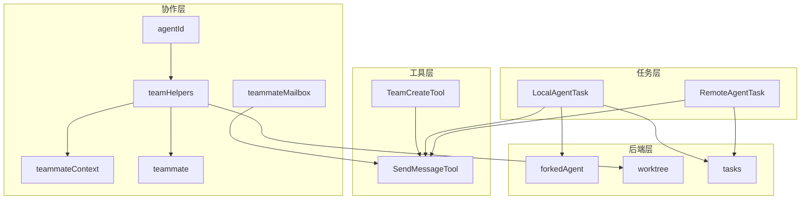
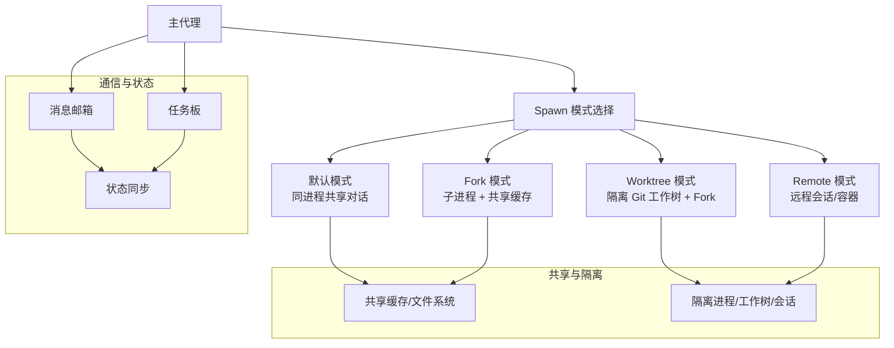
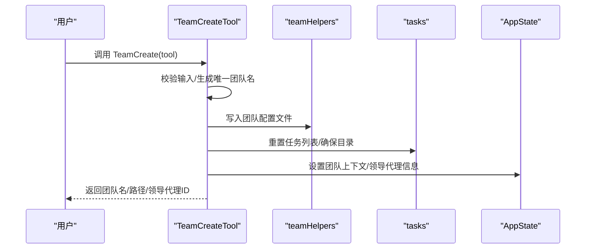
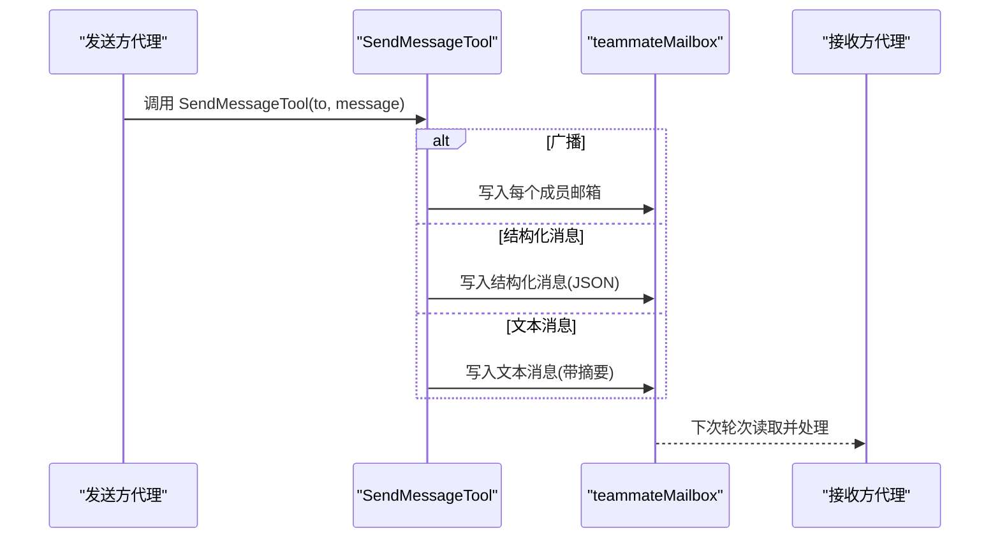
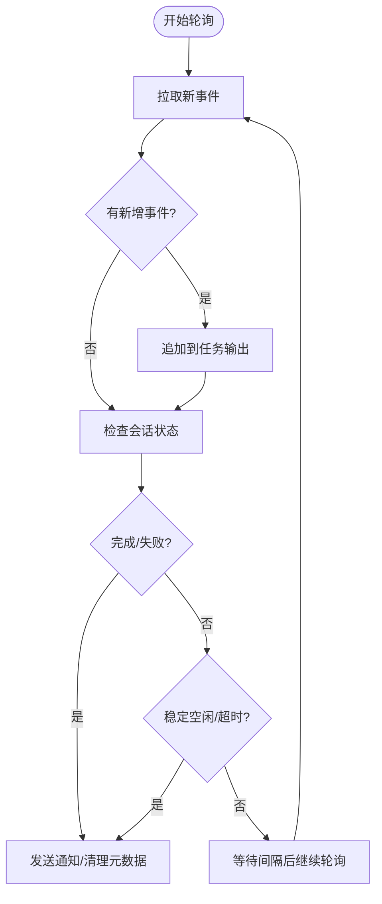
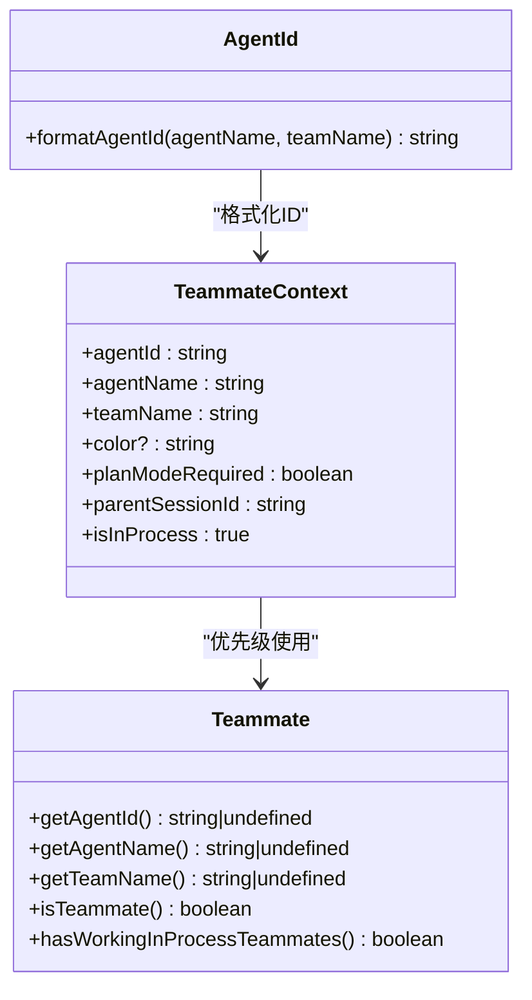
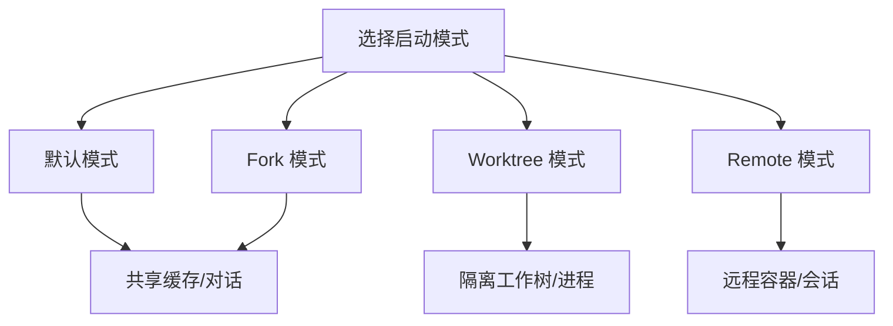
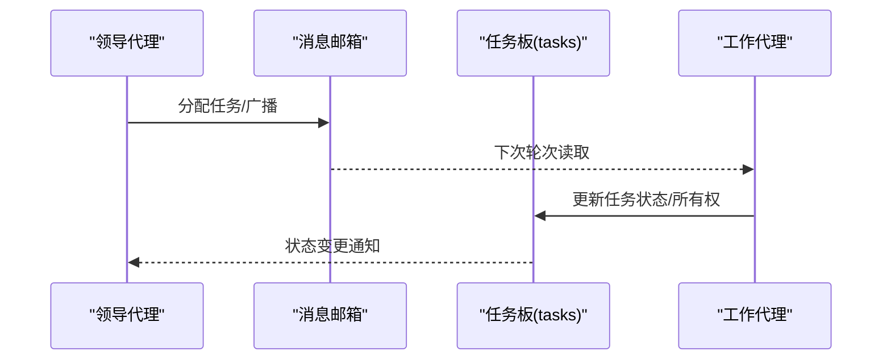
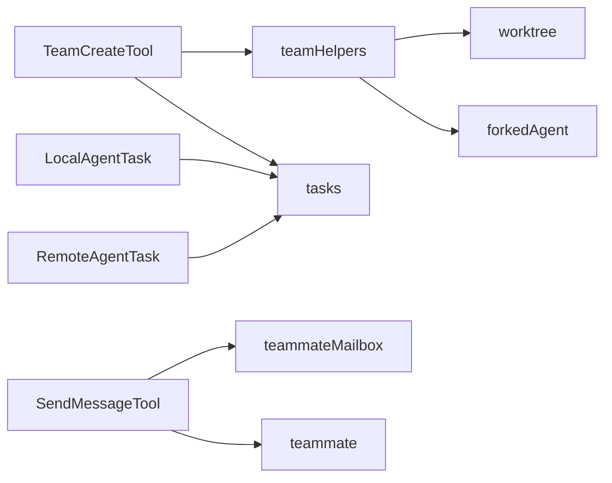

# 多代理协作系统

<cite>
**本文档引用的文件**
- [README.md](file://README.md)
- [TeamCreateTool.ts](file://src/tools/TeamCreateTool/TeamCreateTool.ts)
- [SendMessageTool.ts](file://src/tools/SendMessageTool/SendMessageTool.ts)
- [LocalAgentTask.tsx](file://src/tasks/LocalAgentTask/LocalAgentTask.tsx)
- [RemoteAgentTask.tsx](file://src/tasks/RemoteAgentTask/RemoteAgentTask.tsx)
- [teamHelpers.ts](file://src/utils/swarm/teamHelpers.ts)
- [constants.ts](file://src/utils/swarm/constants.ts)
- [teammate.ts](file://src/utils/teammate.ts)
- [teammateContext.ts](file://src/utils/teammateContext.ts)
- [agentId.ts](file://src/utils/agentId.ts)
- [teammateMailbox.ts](file://src/utils/teammateMailbox.ts)
- [forkedAgent.ts](file://src/utils/forkedAgent.ts)
- [worktree.ts](file://src/utils/worktree.ts)
- [tasks.ts](file://src/utils/tasks.ts)
- [teammateMailbox.ts](file://src/utils/teammateMailbox.ts)
- [directMemberMessage.ts](file://src/utils/directMemberMessage.ts)
- [useSwarmInitialization.ts](file://src/hooks/useSwarmInitialization.ts)
</cite>

## 目录
1. [简介](#简介)
2. [项目结构](#项目结构)
3. [核心组件](#核心组件)
4. [架构总览](#架构总览)
5. [详细组件分析](#详细组件分析)
6. [依赖关系分析](#依赖关系分析)
7. [性能考虑](#性能考虑)
8. [故障排查指南](#故障排查指南)
9. [结论](#结论)
10. [附录](#附录)

## 简介
本文件面向 Claude Code 的多代理协作系统，系统性阐述子代理创建与管理、远程代理会话、团队协作模式。重点覆盖四种代理启动模式（默认、fork、worktree、remote）、代理间通信机制（SendMessageTool、TaskCreate/Update、TeamCreate/Delete）、代理内存共享与隔离策略、状态同步、负载均衡与错误处理、资源管理、性能优化与最佳实践，以及调试与监控方法。

## 项目结构
多代理协作系统围绕以下层次组织：
- 工具层：提供可被模型调用的工具，如 TeamCreateTool、SendMessageTool、Task 相关工具等
- 任务层：抽象本地/远程代理执行单元，统一生命周期管理
- 协作层：团队配置、成员状态、消息邮箱、权限模式等
- 后端层：进程/容器/远程会话管理、工作树隔离、tmux 集成等

**图表来源**
- [TeamCreateTool.ts:128-237](file://src/tools/TeamCreateTool/TeamCreateTool.ts#L128-L237)
- [SendMessageTool.ts:520-799](file://src/tools/SendMessageTool/SendMessageTool.ts#L520-L799)
- [LocalAgentTask.tsx:270-276](file://src/tasks/LocalAgentTask/LocalAgentTask.tsx#L270-L276)
- [RemoteAgentTask.tsx:386-466](file://src/tasks/RemoteAgentTask/RemoteAgentTask.tsx#L386-L466)
- [teamHelpers.ts:64-90](file://src/utils/swarm/teamHelpers.ts#L64-L90)
- [teammateContext.ts:16-96](file://src/utils/teammateContext.ts#L16-L96)
- [teammate.ts:35-87](file://src/utils/teammate.ts#L35-L87)
- [agentId.ts:1-40](file://src/utils/agentId.ts#L1-L40)
- [teammateMailbox.ts:386-432](file://src/utils/teammateMailbox.ts#L386-L432)
- [forkedAgent.ts:301-428](file://src/utils/forkedAgent.ts#L301-L428)
- [worktree.ts:945-1140](file://src/utils/worktree.ts#L945-L1140)
- [tasks.ts:728-845](file://src/utils/tasks.ts#L728-L845)

**章节来源**
- [README.md:609-646](file://README.md#L609-L646)

## 核心组件
- 团队生命周期管理
  - TeamCreateTool：创建团队、初始化任务板、注册会话清理
  - teamHelpers：团队配置持久化、成员管理、工作树清理、会话清理
- 代理间通信
  - SendMessageTool：点对点/广播消息、计划审批、关机请求/批准
  - teammateMailbox：团队内消息邮箱、结构化通知
- 任务执行与状态
  - LocalAgentTask：本地异步代理任务生命周期、前台/后台切换、进度与摘要
  - RemoteAgentTask：远程会话轮询、输出追加、完成条件检查
- 身份与上下文
  - agentId：确定性代理 ID 格式
  - teammateContext：进程内异步存储上下文
  - teammate：动态上下文、运行态判断、活跃度检测

**章节来源**
- [TeamCreateTool.ts:128-237](file://src/tools/TeamCreateTool/TeamCreateTool.ts#L128-L237)
- [teamHelpers.ts:64-90](file://src/utils/swarm/teamHelpers.ts#L64-L90)
- [SendMessageTool.ts:520-799](file://src/tools/SendMessageTool/SendMessageTool.ts#L520-L799)
- [teammateMailbox.ts:386-432](file://src/utils/teammateMailbox.ts#L386-L432)
- [LocalAgentTask.tsx:270-276](file://src/tasks/LocalAgentTask/LocalAgentTask.tsx#L270-L276)
- [RemoteAgentTask.tsx:386-466](file://src/tasks/RemoteAgentTask/RemoteAgentTask.tsx#L386-L466)
- [agentId.ts:1-40](file://src/utils/agentId.ts#L1-L40)
- [teammateContext.ts:16-96](file://src/utils/teammateContext.ts#L16-L96)
- [teammate.ts:35-87](file://src/utils/teammate.ts#L35-L87)

## 架构总览
多代理协作采用“主代理 + 子代理”的分层结构，支持多种启动模式与隔离策略，并通过统一的任务框架与团队配置实现跨进程/容器的协作。

**图表来源**
- [README.md:609-646](file://README.md#L609-L646)
- [worktree.ts:945-1140](file://src/utils/worktree.ts#L945-L1140)
- [forkedAgent.ts:301-428](file://src/utils/forkedAgent.ts#L301-L428)

## 详细组件分析

### 组件 A：团队生命周期管理（TeamCreateTool）
- 功能要点
  - 生成唯一团队名、写入团队配置、重置/创建任务列表目录
  - 注册团队会话清理、更新 AppState 团队上下文
  - 记录分析事件，便于产品度量
- 关键流程

**图表来源**
- [TeamCreateTool.ts:128-237](file://src/tools/TeamCreateTool/TeamCreateTool.ts#L128-L237)
- [teamHelpers.ts:175-182](file://src/utils/swarm/teamHelpers.ts#L175-L182)
- [tasks.ts:728-845](file://src/utils/tasks.ts#L728-L845)

**章节来源**
- [TeamCreateTool.ts:128-237](file://src/tools/TeamCreateTool/TeamCreateTool.ts#L128-L237)
- [teamHelpers.ts:64-90](file://src/utils/swarm/teamHelpers.ts#L64-L90)

### 组件 B：代理间通信（SendMessageTool）
- 功能要点
  - 点对点消息、广播消息、结构化消息（关机请求/响应、计划审批）
  - 跨会话/跨机器消息（UDS/Bridge）发送与权限校验
  - 内部消息路由、颜色标记、摘要渲染
- 关键流程

**图表来源**
- [SendMessageTool.ts:520-799](file://src/tools/SendMessageTool/SendMessageTool.ts#L520-L799)
- [teammateMailbox.ts:386-432](file://src/utils/teammateMailbox.ts#L386-L432)

**章节来源**
- [SendMessageTool.ts:520-799](file://src/tools/SendMessageTool/SendMessageTool.ts#L520-L799)
- [teammateMailbox.ts:386-432](file://src/utils/teammateMailbox.ts#L386-L432)

### 组件 C：任务执行与状态（LocalAgentTask / RemoteAgentTask）
- LocalAgentTask
  - 异步代理任务生命周期：注册、前台/后台切换、中止、完成/失败、摘要与进度上报
  - 前台保留/回收策略、转储输出、SDK 进度事件
- RemoteAgentTask
  - 远程会话轮询、增量日志追加、完成条件检查、超时与失败通知
  - 特定任务类型（如 Ultrareview/PR 自动修复）的专用检查器

**图表来源**
- [RemoteAgentTask.tsx:538-799](file://src/tasks/RemoteAgentTask/RemoteAgentTask.tsx#L538-L799)

**章节来源**
- [LocalAgentTask.tsx:270-276](file://src/tasks/LocalAgentTask/LocalAgentTask.tsx#L270-L276)
- [RemoteAgentTask.tsx:386-466](file://src/tasks/RemoteAgentTask/RemoteAgentTask.tsx#L386-L466)

### 组件 D：身份与上下文（agentId / teammateContext / teammate）
- agentId：确定性代理 ID 格式（agentName@teamName），用于路由与重连
- teammateContext：进程内异步存储上下文，支持并发队友执行
- teammate：动态上下文（运行时加入团队）、活跃度检测、运行态判断

**图表来源**
- [agentId.ts:1-40](file://src/utils/agentId.ts#L1-L40)
- [teammateContext.ts:16-96](file://src/utils/teammateContext.ts#L16-L96)
- [teammate.ts:35-87](file://src/utils/teammate.ts#L35-L87)

**章节来源**
- [agentId.ts:1-40](file://src/utils/agentId.ts#L1-L40)
- [teammateContext.ts:16-96](file://src/utils/teammateContext.ts#L16-L96)
- [teammate.ts:35-87](file://src/utils/teammate.ts#L35-L87)

### 组件 E：启动模式与隔离策略
- 默认模式：同进程共享对话，适合轻量任务
- Fork 模式：子进程运行，共享文件缓存，避免干扰
- Worktree 模式：隔离 Git 工作树 + Fork，适合需要隔离代码状态的场景
- Remote 模式：远程会话/容器，通过桥接通道与本地交互

**图表来源**
- [README.md:609-646](file://README.md#L609-L646)
- [worktree.ts:945-1140](file://src/utils/worktree.ts#L945-L1140)
- [forkedAgent.ts:301-428](file://src/utils/forkedAgent.ts#L301-L428)

**章节来源**
- [README.md:609-646](file://README.md#L609-L646)
- [worktree.ts:945-1140](file://src/utils/worktree.ts#L945-L1140)
- [forkedAgent.ts:301-428](file://src/utils/forkedAgent.ts#L301-L428)

### 组件 F：状态同步与任务板
- 任务板：以团队名为任务列表 ID，统一管理任务所有权、状态与分配
- 状态同步：通过邮箱消息、任务通知、摘要与进度上报实现跨代理同步
- 成员状态：基于任务所有权统计代理忙碌/空闲状态

**图表来源**
- [tasks.ts:728-845](file://src/utils/tasks.ts#L728-L845)
- [teammateMailbox.ts:386-432](file://src/utils/teammateMailbox.ts#L386-L432)

**章节来源**
- [tasks.ts:728-845](file://src/utils/tasks.ts#L728-L845)
- [teammateMailbox.ts:386-432](file://src/utils/teammateMailbox.ts#L386-L432)

## 依赖关系分析
- 工具依赖
  - TeamCreateTool 依赖 teamHelpers、tasks、analytics
  - SendMessageTool 依赖 teammateMailbox、teammate、peerSessions（远程桥接）
- 任务依赖
  - LocalAgentTask 依赖 tasks 框架、abort 控制器、进度上报
  - RemoteAgentTask 依赖 teleport API、会话轮询、输出追加
- 协作依赖
  - teamHelpers 依赖 team 文件持久化、工作树管理、会话清理
  - teammateContext/teammate 提供运行态上下文与动态上下文

**图表来源**
- [TeamCreateTool.ts:128-237](file://src/tools/TeamCreateTool/TeamCreateTool.ts#L128-L237)
- [SendMessageTool.ts:520-799](file://src/tools/SendMessageTool/SendMessageTool.ts#L520-L799)
- [LocalAgentTask.tsx:270-276](file://src/tasks/LocalAgentTask/LocalAgentTask.tsx#L270-L276)
- [RemoteAgentTask.tsx:386-466](file://src/tasks/RemoteAgentTask/RemoteAgentTask.tsx#L386-L466)
- [teamHelpers.ts:64-90](file://src/utils/swarm/teamHelpers.ts#L64-L90)
- [worktree.ts:945-1140](file://src/utils/worktree.ts#L945-L1140)
- [forkedAgent.ts:301-428](file://src/utils/forkedAgent.ts#L301-L428)

**章节来源**
- [TeamCreateTool.ts:128-237](file://src/tools/TeamCreateTool/TeamCreateTool.ts#L128-L237)
- [SendMessageTool.ts:520-799](file://src/tools/SendMessageTool/SendMessageTool.ts#L520-L799)
- [LocalAgentTask.tsx:270-276](file://src/tasks/LocalAgentTask/LocalAgentTask.tsx#L270-L276)
- [RemoteAgentTask.tsx:386-466](file://src/tasks/RemoteAgentTask/RemoteAgentTask.tsx#L386-L466)
- [teamHelpers.ts:64-90](file://src/utils/swarm/teamHelpers.ts#L64-L90)

## 性能考虑
- 任务轮询与增量处理
  - RemoteAgentTask 使用增量事件合并与稳定空闲判定，减少无效轮询
  - LocalAgentTask 的前台保留与回收策略降低 UI 抖动与资源占用
- 缓存与隔离
  - Fork 模式共享文件缓存，避免重复计算；Worktree 模式隔离工作树，防止状态污染
- I/O 与网络
  - 远程会话轮询间隔固定，结合稳定空闲阈值，平衡实时性与开销
  - 结构化消息与摘要渲染在 UI 层进行，减少不必要的传输

[本节为通用指导，无需具体文件引用]

## 故障排查指南
- 团队创建失败
  - 检查团队名唯一性与目录写入权限；查看 teamHelpers 写入日志
- 代理无法接收消息
  - 确认 teammateMailbox 写入成功；检查 SendMessageTool 权限校验与地址解析
- 远程任务不结束
  - 查看 RemoteAgentTask 轮询日志与完成检查器；确认会话状态与超时设置
- 进程/工作树残留
  - 使用 teamHelpers 的清理函数或 worktree 清理逻辑；必要时手动删除

**章节来源**
- [teamHelpers.ts:641-683](file://src/utils/swarm/teamHelpers.ts#L641-L683)
- [worktree.ts:945-1140](file://src/utils/worktree.ts#L945-L1140)
- [RemoteAgentTask.tsx:538-799](file://src/tasks/RemoteAgentTask/RemoteAgentTask.tsx#L538-L799)

## 结论
多代理协作系统通过明确的启动模式、统一的任务框架、团队配置与消息邮箱，实现了跨进程/容器的高效协作。其隔离与共享策略兼顾性能与稳定性，配合完善的错误处理与清理机制，能够支撑复杂场景下的持续开发与维护。

[本节为总结，无需具体文件引用]

## 附录

### 实际应用场景与配置示例
- 多角色编排：使用 TeamCreateTool 创建团队，SendMessageTool 进行任务分配与状态同步
- 代码审查：RemoteAgentTask 执行远程审查，完成后注入结果到消息队列
- 隔离开发：Worktree 模式下为不同分支/需求创建独立工作树，避免相互影响

[本节为概念性内容，无需具体文件引用]

### 负载均衡与资源管理
- 负载均衡：根据任务所有权与代理忙碌状态进行任务再分配
- 资源管理：前台保留/回收、输出转储、会话清理、工作树销毁

[本节为通用指导，无需具体文件引用]

### 调试与监控
- 调试：启用调试日志、检查任务状态与消息邮箱内容
- 监控：关注任务完成率、远程会话超时、代理活跃度指标

[本节为通用指导，无需具体文件引用]