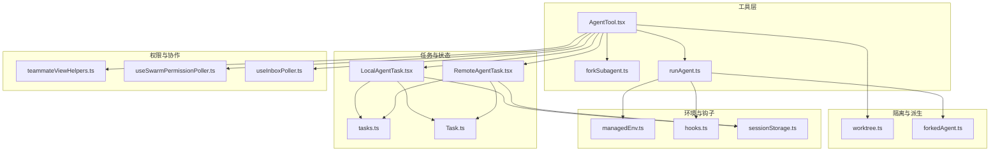
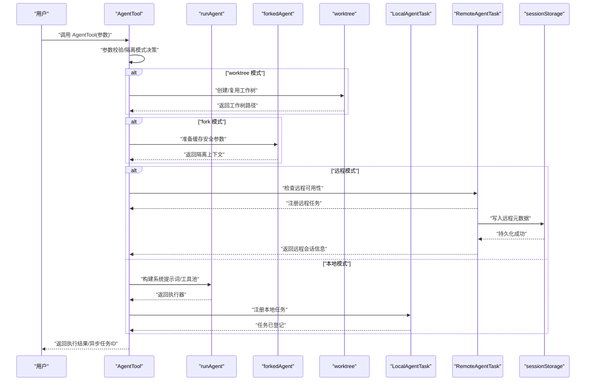
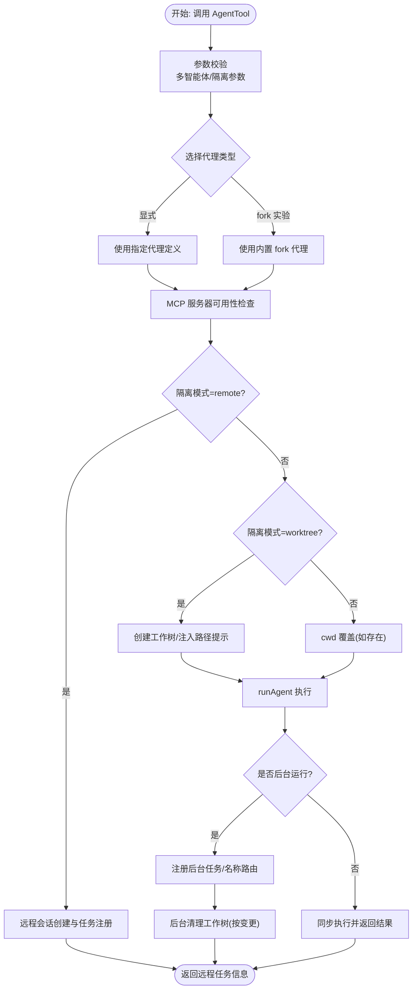
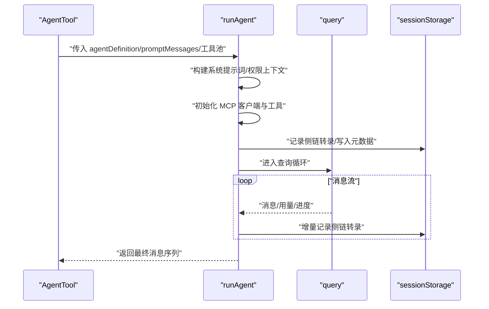
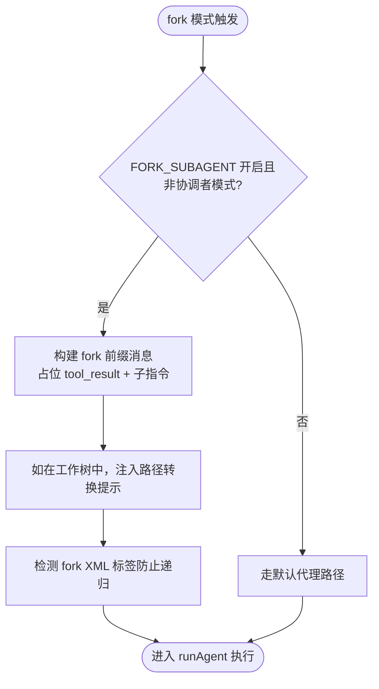
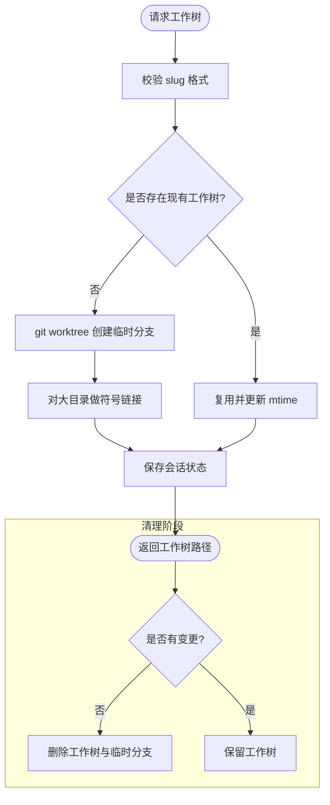
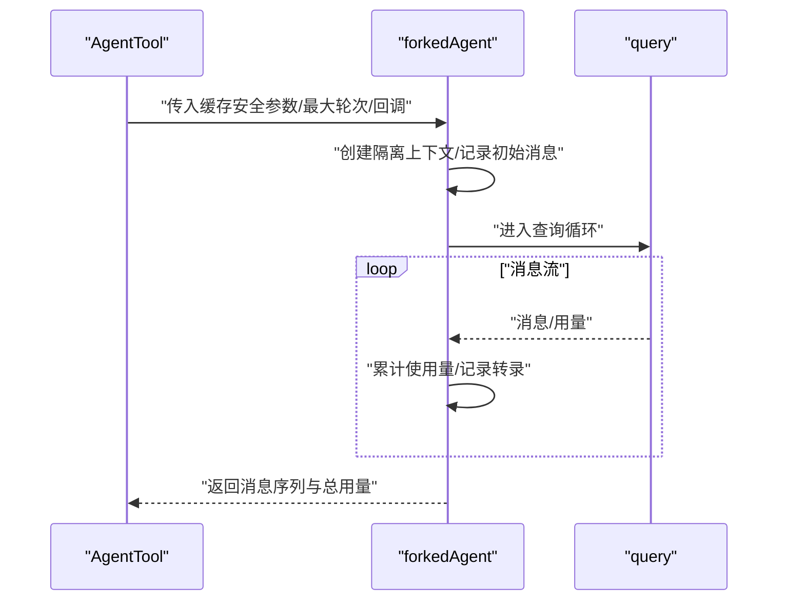
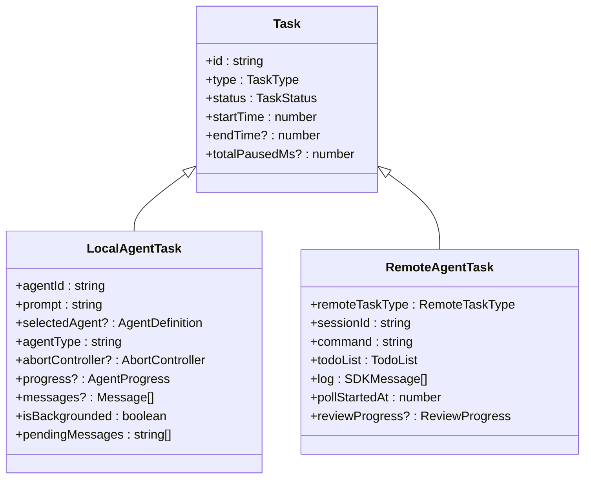
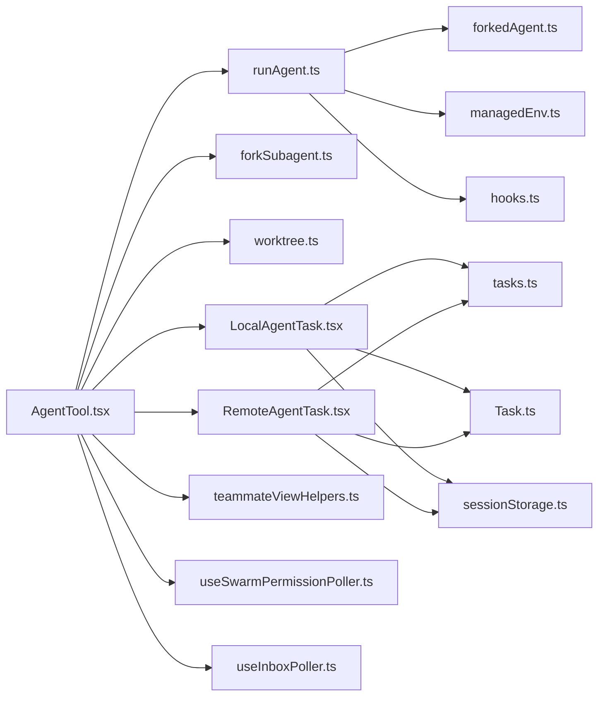

# 子代理管理系统

<cite>
**本文档引用的文件**
- [AgentTool.tsx](file://src/tools/AgentTool/AgentTool.tsx)
- [runAgent.ts](file://src/tools/AgentTool/runAgent.ts)
- [forkSubagent.ts](file://src/tools/AgentTool/forkSubagent.ts)
- [worktree.ts](file://src/utils/worktree.ts)
- [forkedAgent.ts](file://src/utils/forkedAgent.ts)
- [LocalAgentTask.tsx](file://src/tasks/LocalAgentTask/LocalAgentTask.tsx)
- [RemoteAgentTask.tsx](file://src/tasks/RemoteAgentTask/RemoteAgentTask.tsx)
- [sessionStorage.ts](file://src/utils/sessionStorage.ts)
- [managedEnv.ts](file://src/utils/managedEnv.ts)
- [hooks.ts](file://src/utils/hooks.ts)
- [tasks.ts](file://src/tasks.ts)
- [Task.ts](file://src/Task.ts)
- [teammateViewHelpers.ts](file://src/state/teammateViewHelpers.ts)
- [useSwarmPermissionPoller.ts](file://src/hooks/useSwarmPermissionPoller.ts)
- [useInboxPoller.ts](file://src/hooks/useInboxPoller.ts)
</cite>

## 目录
1. [简介](#简介)
2. [项目结构](#项目结构)
3. [核心组件](#核心组件)
4. [架构总览](#架构总览)
5. [详细组件分析](#详细组件分析)
6. [依赖关系分析](#依赖关系分析)
7. [性能考虑](#性能考虑)
8. [故障排除指南](#故障排除指南)
9. [结论](#结论)
10. [附录](#附录)

## 简介
本文件系统性阐述子代理管理系统的实现与使用方法，覆盖以下关键主题：
- 四种代理启动模式：默认模式（直接运行）、fork模式（进程派生）、worktree模式（工作树隔离）、remote模式（远程执行）
- 子代理生命周期管理、状态跟踪与资源分配
- AgentTool工具的实现细节：代理配置、参数传递、执行环境设置
- 实际使用示例与最佳实践
- 子代理间隔离机制、安全边界与权限控制
- 性能监控、故障恢复与错误处理方案

## 项目结构
子代理系统主要由以下模块构成：
- 工具层：AgentTool 负责接收用户输入、解析参数、选择代理类型并调度执行
- 执行层：runAgent 负责构建系统提示词、工具池、权限上下文并驱动查询循环
- 隔离与派生：forkedAgent 提供 fork 模式支持；worktree 提供工作树隔离能力
- 任务与状态：LocalAgentTask/RemoteAgentTask 管理本地与远程任务生命周期
- 环境与钩子：managedEnv、hooks 提供环境变量注入与钩子扩展点
- 共享基础设施：sessionStorage、tasks、Task 类型定义等

图表来源
- [AgentTool.tsx:196-800](file://src/tools/AgentTool/AgentTool.tsx#L196-L800)
- [runAgent.ts:248-800](file://src/tools/AgentTool/runAgent.ts#L248-L800)
- [forkSubagent.ts:1-211](file://src/tools/AgentTool/forkSubagent.ts#L1-L211)
- [worktree.ts:1-200](file://src/utils/worktree.ts#L1-L200)
- [forkedAgent.ts:1-690](file://src/utils/forkedAgent.ts#L1-L690)
- [LocalAgentTask.tsx:1-200](file://src/tasks/LocalAgentTask/LocalAgentTask.tsx#L1-L200)
- [RemoteAgentTask.tsx:1-200](file://src/tasks/RemoteAgentTask/RemoteAgentTask.tsx#L1-L200)
- [tasks.ts:1-39](file://src/tasks.ts#L1-L39)
- [Task.ts:1-53](file://src/Task.ts#L1-L53)
- [managedEnv.ts:162-199](file://src/utils/managedEnv.ts#L162-L199)
- [hooks.ts:897-928](file://src/utils/hooks.ts#L897-L928)
- [sessionStorage.ts:335-383](file://src/utils/sessionStorage.ts#L335-L383)
- [teammateViewHelpers.ts:114-141](file://src/state/teammateViewHelpers.ts#L114-L141)
- [useSwarmPermissionPoller.ts:81-167](file://src/hooks/useSwarmPermissionPoller.ts#L81-L167)
- [useInboxPoller.ts:296-337](file://src/hooks/useInboxPoller.ts#L296-L337)

章节来源
- [AgentTool.tsx:196-800](file://src/tools/AgentTool/AgentTool.tsx#L196-L800)
- [runAgent.ts:248-800](file://src/tools/AgentTool/runAgent.ts#L248-L800)
- [forkSubagent.ts:1-211](file://src/tools/AgentTool/forkSubagent.ts#L1-L211)
- [worktree.ts:1-200](file://src/utils/worktree.ts#L1-L200)
- [forkedAgent.ts:1-690](file://src/utils/forkedAgent.ts#L1-L690)
- [LocalAgentTask.tsx:1-200](file://src/tasks/LocalAgentTask/LocalAgentTask.tsx#L1-L200)
- [RemoteAgentTask.tsx:1-200](file://src/tasks/RemoteAgentTask/RemoteAgentTask.tsx#L1-L200)
- [tasks.ts:1-39](file://src/tasks.ts#L1-L39)
- [Task.ts:1-53](file://src/Task.ts#L1-L53)
- [managedEnv.ts:162-199](file://src/utils/managedEnv.ts#L162-L199)
- [hooks.ts:897-928](file://src/utils/hooks.ts#L897-L928)
- [sessionStorage.ts:335-383](file://src/utils/sessionStorage.ts#L335-L383)
- [teammateViewHelpers.ts:114-141](file://src/state/teammateViewHelpers.ts#L114-L141)
- [useSwarmPermissionPoller.ts:81-167](file://src/hooks/useSwarmPermissionPoller.ts#L81-L167)
- [useInboxPoller.ts:296-337](file://src/hooks/useInboxPoller.ts#L296-L337)

## 核心组件
- AgentTool：统一入口，负责参数校验、代理类型选择、隔离模式决策、异步/同步执行路径、工作树清理与远程代理注册
- runAgent：构建系统提示词、工具池、权限上下文，驱动 query 循环，记录侧链转录，管理使用量统计
- forkSubagent：fork 模式开关、合成子代理消息前缀、递归 fork 防护、工作树通知注入
- worktree：工作树创建/删除、变更检测、符号链接优化、会话状态管理
- forkedAgent：fork 子代理上下文隔离、缓存安全参数传递、使用量聚合与事件上报
- LocalAgentTask/RemoteAgentTask：本地/远程任务生命周期、输出文件管理、完成条件检查、通知队列
- managedEnv/hooks：受控环境变量注入、钩子脚本环境文件生成
- sessionStorage：远程代理元数据持久化、扫描与恢复
- 权限与协作：权限回调注册/注销、邮件箱轮询、团队成员视图辅助

章节来源
- [AgentTool.tsx:196-800](file://src/tools/AgentTool/AgentTool.tsx#L196-L800)
- [runAgent.ts:248-800](file://src/tools/AgentTool/runAgent.ts#L248-L800)
- [forkSubagent.ts:1-211](file://src/tools/AgentTool/forkSubagent.ts#L1-L211)
- [worktree.ts:1-200](file://src/utils/worktree.ts#L1-L200)
- [forkedAgent.ts:1-690](file://src/utils/forkedAgent.ts#L1-L690)
- [LocalAgentTask.tsx:1-200](file://src/tasks/LocalAgentTask/LocalAgentTask.tsx#L1-L200)
- [RemoteAgentTask.tsx:1-200](file://src/tasks/RemoteAgentTask/RemoteAgentTask.tsx#L1-L200)
- [managedEnv.ts:162-199](file://src/utils/managedEnv.ts#L162-L199)
- [hooks.ts:897-928](file://src/utils/hooks.ts#L897-L928)
- [sessionStorage.ts:335-383](file://src/utils/sessionStorage.ts#L335-L383)

## 架构总览
下图展示从用户调用到子代理执行与状态管理的关键交互：

图表来源
- [AgentTool.tsx:430-765](file://src/tools/AgentTool/AgentTool.tsx#L430-L765)
- [runAgent.ts:248-800](file://src/tools/AgentTool/runAgent.ts#L248-L800)
- [forkedAgent.ts:489-626](file://src/utils/forkedAgent.ts#L489-L626)
- [worktree.ts:896-1020](file://src/utils/worktree.ts#L896-L1020)
- [LocalAgentTask.tsx:1-200](file://src/tasks/LocalAgentTask/LocalAgentTask.tsx#L1-L200)
- [RemoteAgentTask.tsx:124-141](file://src/tasks/RemoteAgentTask/RemoteAgentTask.tsx#L124-L141)
- [sessionStorage.ts:335-383](file://src/utils/sessionStorage.ts#L335-L383)

## 详细组件分析

### 组件A：AgentTool（代理入口与编排）
- 功能要点
  - 参数模式：基础输入 + 多智能体参数 + 隔离参数（cwd 仅在特定特性开启时可见）
  - 代理类型选择：显式 subagent_type 或 fork 实验路径（隐式通用代理）
  - 隔离模式：worktree（工作树隔离）或 remote（远程执行），其余为默认/同目录模式
  - 异步策略：后台运行（run_in_background 或代理定义 background）或前台同步
  - 工作树集成：fork 模式下注入工作树路径转换提示；完成后按变更情况清理
  - 远程代理：前置条件检查、会话创建、任务注册、输出文件路径返回
- 关键流程
  - 输入校验与多智能体约束
  - 代理定义过滤与权限规则应用
  - MCP 服务器可用性检查与等待
  - 系统提示词增强与工具池装配
  - 工作树创建与 cwd 注入
  - runAgent 生命周期包装与上下文注入
  - 后台任务注册与名称路由表更新

图表来源
- [AgentTool.tsx:239-765](file://src/tools/AgentTool/AgentTool.tsx#L239-L765)

章节来源
- [AgentTool.tsx:81-125](file://src/tools/AgentTool/AgentTool.tsx#L81-L125)
- [AgentTool.tsx:239-765](file://src/tools/AgentTool/AgentTool.tsx#L239-L765)

### 组件B：runAgent（代理执行引擎）
- 功能要点
  - 系统提示词构建与增强（环境详情、额外工作目录）
  - 工具池解析与权限模式覆盖（bubble/acceptEdits 等）
  - 子代理上下文隔离（createSubagentContext）：克隆文件状态缓存、新 AbortController、无 UI 权限提示
  - MCP 服务器动态连接与工具合并
  - 查询循环（query）驱动，记录侧链转录，聚合使用量
  - 前后端指标上报（TTFT/OTPS 等）
- 关键流程
  - 解析工具与权限上下文
  - 初始化 MCP 客户端与工具
  - 构建初始消息与侧链转录
  - query 循环与消息记录
  - 使用量统计与元数据写入

图表来源
- [runAgent.ts:248-800](file://src/tools/AgentTool/runAgent.ts#L248-L800)
- [sessionStorage.ts:335-383](file://src/utils/sessionStorage.ts#L335-L383)

章节来源
- [runAgent.ts:248-800](file://src/tools/AgentTool/runAgent.ts#L248-L800)

### 组件C：forkSubagent（fork 模式）
- 功能要点
  - 实验开关：FORK_SUBAGENT 特性启用时，omit subagent_type 触发 fork 路径
  - 缓存安全：fork 子代理继承父代理完整对话历史，使用占位 tool_result 以最大化缓存命中
  - 递归防护：通过 XML 标签检测 fork 上下文，避免 fork 中再次 fork
  - 工作树提示：fork 子代理在工作树隔离时注入路径转换与文件重读建议
- 关键流程
  - 构建 fork 前缀消息（占位 tool_result + 子指令）
  - 注入工作树路径转换提示
  - 递归 fork 防护检测

图表来源
- [forkSubagent.ts:18-89](file://src/tools/AgentTool/forkSubagent.ts#L18-L89)
- [forkSubagent.ts:107-198](file://src/tools/AgentTool/forkSubagent.ts#L107-L198)

章节来源
- [forkSubagent.ts:18-89](file://src/tools/AgentTool/forkSubagent.ts#L18-L89)
- [forkSubagent.ts:107-198](file://src/tools/AgentTool/forkSubagent.ts#L107-L198)

### 组件D：worktree（工作树隔离）
- 功能要点
  - 工作树创建/复用：基于 slug 创建临时工作树，支持 hook-based 创建
  - 变更检测：比较 head commit，未变更则删除工作树以节省空间
  - 符号链接优化：对 node_modules 等大目录进行符号链接，避免磁盘膨胀
  - 会话状态：记录当前工作树会话，支持恢复
- 关键流程
  - slug 校验（防路径穿越）
  - git 工作树创建/删除
  - head commit 对比与变更检测
  - 清理与保留策略

图表来源
- [worktree.ts:66-138](file://src/utils/worktree.ts#L66-L138)
- [worktree.ts:896-1020](file://src/utils/worktree.ts#L896-L1020)

章节来源
- [worktree.ts:66-138](file://src/utils/worktree.ts#L66-L138)
- [worktree.ts:896-1020](file://src/utils/worktree.ts#L896-L1020)

### 组件E：forkedAgent（fork 子代理执行）
- 功能要点
  - 缓存安全参数：系统提示词、用户/系统上下文、工具上下文、fork 前缀消息
  - 上下文隔离：克隆文件状态缓存、新 AbortController、禁用 UI 权限提示
  - 使用量聚合：逐轮提取 usage 并累计，最终事件上报
  - 侧链转录：可选跳过转录（推测/临时场景）
- 关键流程
  - 准备缓存安全参数
  - 创建隔离上下文
  - query 循环与使用量统计
  - 事件日志与内存释放

图表来源
- [forkedAgent.ts:489-626](file://src/utils/forkedAgent.ts#L489-L626)

章节来源
- [forkedAgent.ts:489-626](file://src/utils/forkedAgent.ts#L489-L626)

### 组件F：任务与状态管理
- LocalAgentTask：本地子代理任务状态、进度追踪、输出文件管理、消息挂起与注入
- RemoteAgentTask：远程任务注册、条件检查、通知队列、元数据持久化与扫描恢复
- Task/任务框架：统一的任务类型、状态机、暂停/恢复、清理注册

图表来源
- [Task.ts:1-53](file://src/Task.ts#L1-L53)
- [LocalAgentTask.tsx:116-148](file://src/tasks/LocalAgentTask/LocalAgentTask.tsx#L116-L148)
- [RemoteAgentTask.tsx:22-59](file://src/tasks/RemoteAgentTask/RemoteAgentTask.tsx#L22-L59)

章节来源
- [Task.ts:1-53](file://src/Task.ts#L1-L53)
- [LocalAgentTask.tsx:116-148](file://src/tasks/LocalAgentTask/LocalAgentTask.tsx#L116-L148)
- [RemoteAgentTask.tsx:22-59](file://src/tasks/RemoteAgentTask/RemoteAgentTask.tsx#L22-L59)

### 组件G：环境与钩子
- managedEnv：安全环境变量白名单注入、危险变量延迟应用、代理重配置
- hooks：插件选项注入、技能根目录、环境脚本文件生成（跨 shell 兼容）

章节来源
- [managedEnv.ts:162-199](file://src/utils/managedEnv.ts#L162-L199)
- [hooks.ts:897-928](file://src/utils/hooks.ts#L897-L928)

## 依赖关系分析
- AgentTool 依赖 runAgent、forkSubagent、worktree、LocalAgentTask、RemoteAgentTask
- runAgent 依赖 query、forkedAgent（缓存安全 fork）、managedEnv、hooks
- forkedAgent 依赖 query、analytics、usage 统计
- 任务系统依赖 tasks.ts、Task.ts、sessionStorage.ts
- 权限与协作依赖 useSwarmPermissionPoller、useInboxPoller、teammateViewHelpers

图表来源
- [AgentTool.tsx:196-800](file://src/tools/AgentTool/AgentTool.tsx#L196-L800)
- [runAgent.ts:248-800](file://src/tools/AgentTool/runAgent.ts#L248-L800)
- [forkedAgent.ts:1-690](file://src/utils/forkedAgent.ts#L1-L690)
- [worktree.ts:1-200](file://src/utils/worktree.ts#L1-L200)
- [LocalAgentTask.tsx:1-200](file://src/tasks/LocalAgentTask/LocalAgentTask.tsx#L1-L200)
- [RemoteAgentTask.tsx:1-200](file://src/tasks/RemoteAgentTask/RemoteAgentTask.tsx#L1-L200)
- [tasks.ts:1-39](file://src/tasks.ts#L1-L39)
- [Task.ts:1-53](file://src/Task.ts#L1-L53)
- [managedEnv.ts:162-199](file://src/utils/managedEnv.ts#L162-L199)
- [hooks.ts:897-928](file://src/utils/hooks.ts#L897-L928)
- [sessionStorage.ts:335-383](file://src/utils/sessionStorage.ts#L335-L383)
- [teammateViewHelpers.ts:114-141](file://src/state/teammateViewHelpers.ts#L114-L141)
- [useSwarmPermissionPoller.ts:81-167](file://src/hooks/useSwarmPermissionPoller.ts#L81-L167)
- [useInboxPoller.ts:296-337](file://src/hooks/useInboxPoller.ts#L296-L337)

章节来源
- [tasks.ts:1-39](file://src/tasks.ts#L1-L39)
- [Task.ts:1-53](file://src/Task.ts#L1-L53)

## 性能考虑
- prompt 缓存共享：fork 模式通过缓存安全参数确保字节级一致的 API 请求前缀，最大化缓存命中率
- 使用量聚合：forkedAgent 在查询循环中逐轮提取 usage 并累计，最终事件上报，便于成本与性能分析
- 工作树优化：符号链接减少磁盘占用，提升 IO 效率；变更检测避免无谓保留
- 异步执行：后台任务不阻塞主回合并支持统一的通知模型，降低输入队列积压风险

## 故障排除指南
- 远程代理不可用
  - 检查前置条件：登录状态、云环境、git 仓库与远程、GitHub 应用安装、组织策略
  - 参考格式化错误信息用于用户指引
- 工作树清理失败
  - 确认 git 根目录与工作树路径正确；临时分支删除失败时记录错误日志
- 权限与协作
  - 权限回调未触发：确认请求 ID 注册与邮箱轮询逻辑
  - 团队成员视图：停止或移除代理时需处理任务状态与视图切换
- 任务争用与阻塞
  - 任务声明周期内原子性检查：避免并发争用与阻塞链路

章节来源
- [RemoteAgentTask.tsx:124-161](file://src/tasks/RemoteAgentTask/RemoteAgentTask.tsx#L124-L161)
- [worktree.ts:987-1020](file://src/utils/worktree.ts#L987-L1020)
- [useSwarmPermissionPoller.ts:81-167](file://src/hooks/useSwarmPermissionPoller.ts#L81-L167)
- [useInboxPoller.ts:296-337](file://src/hooks/useInboxPoller.ts#L296-L337)
- [teammateViewHelpers.ts:114-141](file://src/state/teammateViewHelpers.ts#L114-L141)

## 结论
子代理管理系统通过 AgentTool 统一入口，结合 runAgent 的执行引擎、forkedAgent 的缓存安全 fork、worktree 的工作树隔离以及 Local/Remote 任务的状态管理，实现了高隔离、高性能、可观测的子代理生命周期管理。配合受控环境变量注入与权限回调机制，系统在安全性与易用性之间取得平衡。

## 附录
- 实际使用示例与最佳实践
  - 默认模式：直接运行，适合一次性、轻量任务
  - fork 模式：需要与父代理共享上下文并追求 prompt 缓存命中时使用
  - worktree 模式：需要文件系统隔离与独立工作副本时使用
  - remote 模式：需要云端资源与后台执行能力时使用
- 安全与隔离
  - 子代理上下文隔离：文件状态缓存克隆、新 AbortController、禁用 UI 权限提示
  - 环境变量白名单：受控注入危险变量，代理重配置以适配新环境
  - 权限回调：通过邮件箱轮询与回调注册实现跨进程权限决策
- 性能监控
  - forkedAgent 事件上报包含输入/输出令牌、缓存读取令牌与命中率
  - 本地任务进度追踪：工具使用次数、令牌数、最近活动列表