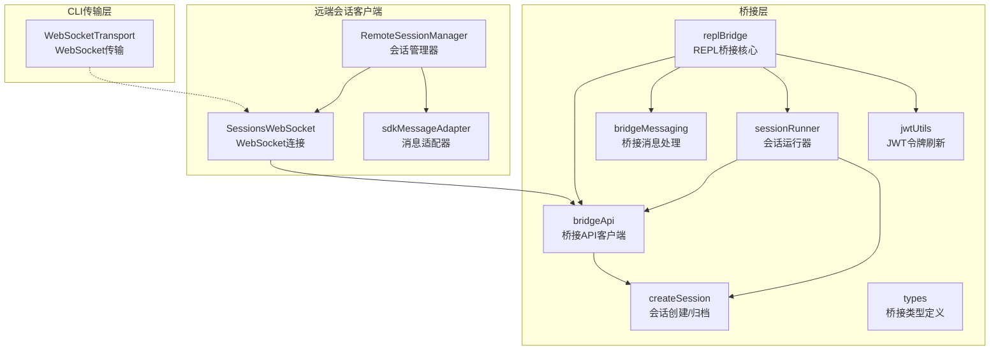
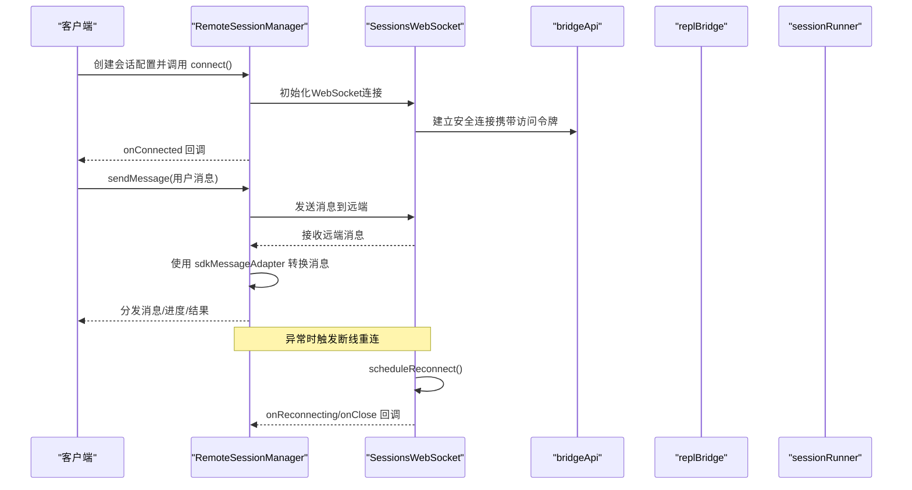
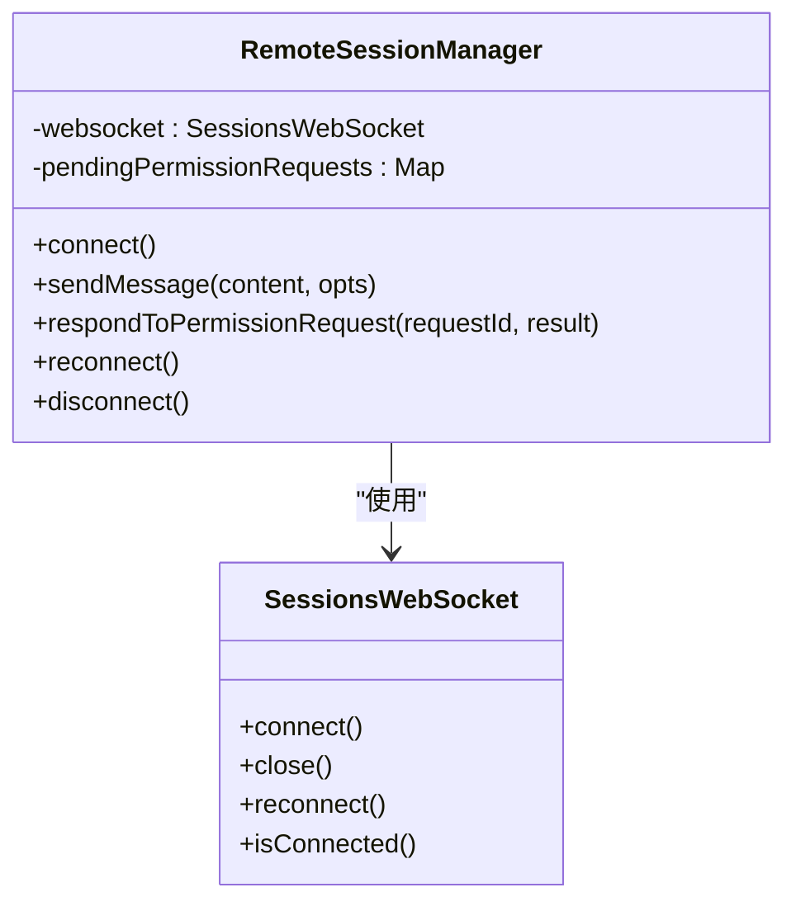
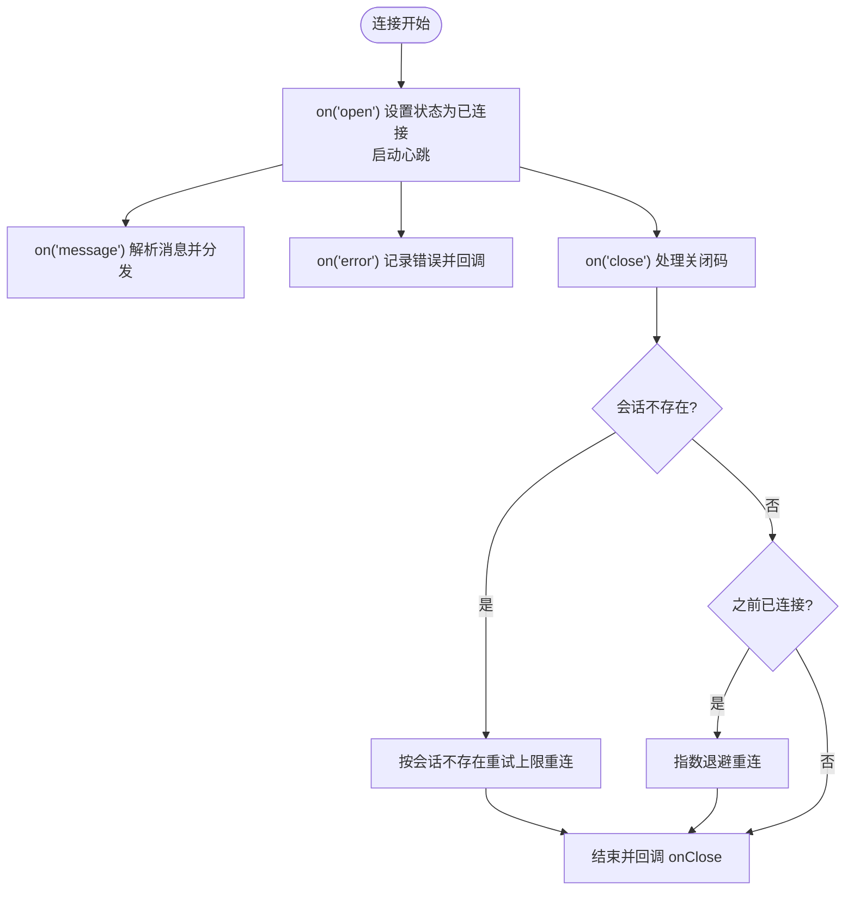
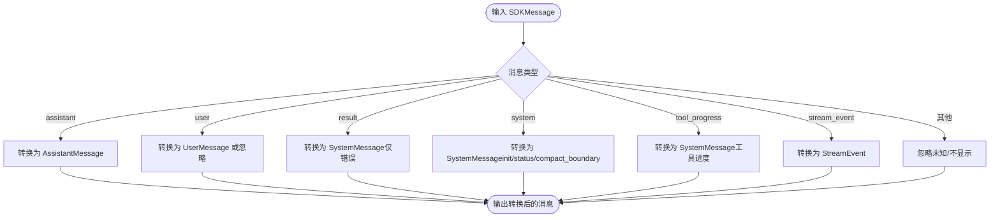
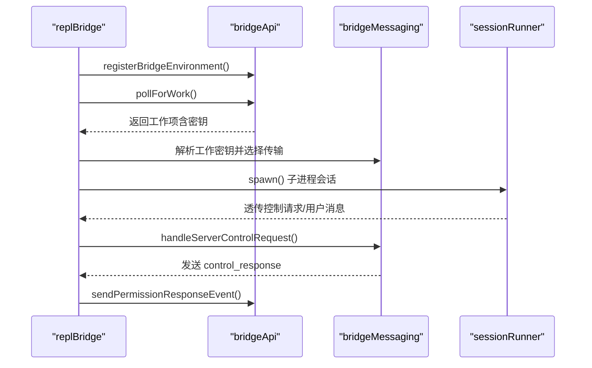
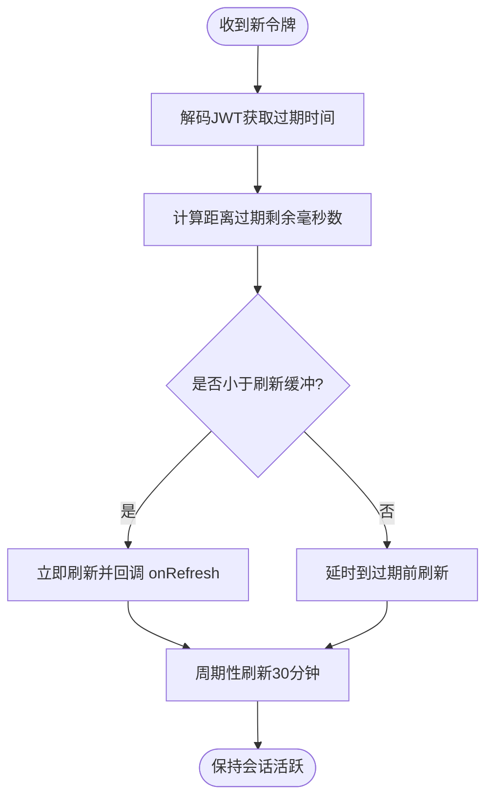
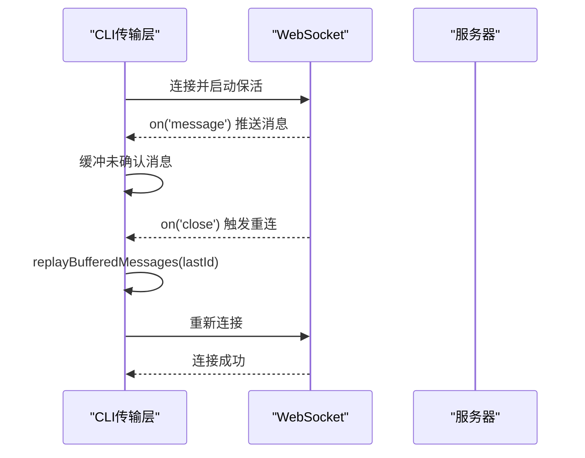
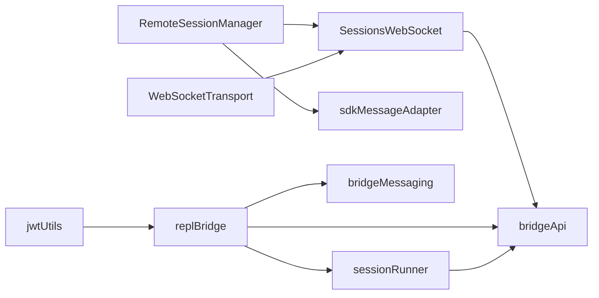

# 远程代理会话管理

<cite>
**本文档引用的文件**
- [RemoteSessionManager.ts](file://src/remote/RemoteSessionManager.ts)
- [SessionsWebSocket.ts](file://src/remote/SessionsWebSocket.ts)
- [sdkMessageAdapter.ts](file://src/remote/sdkMessageAdapter.ts)
- [bridgeApi.ts](file://src/bridge/bridgeApi.ts)
- [bridgeMessaging.ts](file://src/bridge/bridgeMessaging.ts)
- [jwtUtils.ts](file://src/bridge/jwtUtils.ts)
- [replBridge.ts](file://src/bridge/replBridge.ts)
- [sessionRunner.ts](file://src/bridge/sessionRunner.ts)
- [createSession.ts](file://src/bridge/createSession.ts)
- [types.ts](file://src/bridge/types.ts)
- [WebSocketTransport.ts](file://src/cli/transports/WebSocketTransport.ts)
- [sessionStorage.ts](file://src/utils/sessionStorage.ts)
</cite>

## 目录
1. [简介](#简介)
2. [项目结构](#项目结构)
3. [核心组件](#核心组件)
4. [架构总览](#架构总览)
5. [详细组件分析](#详细组件分析)
6. [依赖关系分析](#依赖关系分析)
7. [性能考虑](#性能考虑)
8. [故障排查指南](#故障排查指南)
9. [结论](#结论)
10. [附录](#附录)

## 简介
本技术文档围绕远程代理会话管理系统，系统性阐述远程代理的连接建立、会话管理与状态同步机制；深入解析JWT认证流程、会话令牌管理与安全连接建立；详解RemoteAgentTask（远程任务）的实现原理（远程任务调度、进度跟踪、结果回传）；文档化桥接层在远程协作中的作用（消息路由、数据传输、错误处理）；并提供远程会话配置示例、连接参数设置、超时处理策略，以及负载均衡、故障转移与断线重连机制；最后给出性能优化建议与监控方案。

## 项目结构
远程代理会话管理涉及两大子系统：
- 远端会话客户端：负责通过WebSocket与远端服务建立连接、发送/接收消息、权限请求响应、断线重连与状态上报。
- 桥接层（Bridge）：负责环境注册、工作项轮询、会话创建与归档、权限控制、令牌刷新、消息路由与传输等。

**图表来源**
- [RemoteSessionManager.ts:95-324](file://src/remote/RemoteSessionManager.ts#L95-L324)
- [SessionsWebSocket.ts:177-404](file://src/remote/SessionsWebSocket.ts#L177-L404)
- [sdkMessageAdapter.ts:168-278](file://src/remote/sdkMessageAdapter.ts#L168-L278)
- [bridgeApi.ts:141-451](file://src/bridge/bridgeApi.ts#L141-L451)
- [bridgeMessaging.ts:132-391](file://src/bridge/bridgeMessaging.ts#L132-L391)
- [replBridge.ts:260-800](file://src/bridge/replBridge.ts#L260-L800)
- [sessionRunner.ts:248-548](file://src/bridge/sessionRunner.ts#L248-L548)
- [createSession.ts:34-180](file://src/bridge/createSession.ts#L34-L180)
- [jwtUtils.ts:72-256](file://src/bridge/jwtUtils.ts#L72-L256)
- [types.ts:133-262](file://src/bridge/types.ts#L133-L262)
- [WebSocketTransport.ts:541-586](file://src/cli/transports/WebSocketTransport.ts#L541-L586)

**章节来源**
- [RemoteSessionManager.ts:1-343](file://src/remote/RemoteSessionManager.ts#L1-L343)
- [SessionsWebSocket.ts:177-404](file://src/remote/SessionsWebSocket.ts#L177-L404)
- [bridgeApi.ts:141-451](file://src/bridge/bridgeApi.ts#L141-L451)
- [bridgeMessaging.ts:132-391](file://src/bridge/bridgeMessaging.ts#L132-L391)
- [replBridge.ts:260-800](file://src/bridge/replBridge.ts#L260-L800)
- [sessionRunner.ts:248-548](file://src/bridge/sessionRunner.ts#L248-L548)
- [createSession.ts:34-180](file://src/bridge/createSession.ts#L34-L180)
- [jwtUtils.ts:72-256](file://src/bridge/jwtUtils.ts#L72-L256)
- [types.ts:133-262](file://src/bridge/types.ts#L133-L262)
- [WebSocketTransport.ts:541-586](file://src/cli/transports/WebSocketTransport.ts#L541-L586)

## 核心组件
- RemoteSessionManager：负责WebSocket连接、消息收发、权限请求响应、断线重连与关闭。
- SessionsWebSocket：封装WebSocket生命周期、心跳、重连策略与错误处理。
- sdkMessageAdapter：将SDK消息转换为内部消息格式，支持流式事件与状态消息。
- bridgeApi：桥接API客户端，提供环境注册、工作轮询、会话操作、权限事件上报等。
- bridgeMessaging：桥接消息处理，含入站消息解析、去重、控制请求响应与结果消息构建。
- replBridge：REPL桥接核心，协调环境注册、会话创建、轮询、传输切换、断线恢复与持久化。
- sessionRunner：会话运行器，负责子进程会话的启动、活动追踪、权限请求转发与令牌更新。
- createSession：会话创建、查询、归档与标题更新。
- jwtUtils：JWT令牌刷新调度，支持到期前刷新、失败重试与后续周期刷新。
- WebSocketTransport：CLI侧WebSocket传输，支持重放缓冲、重连与保活。
- sessionStorage：远程代理元数据持久化，用于恢复任务与重建会话。

**章节来源**
- [RemoteSessionManager.ts:95-324](file://src/remote/RemoteSessionManager.ts#L95-L324)
- [SessionsWebSocket.ts:177-404](file://src/remote/SessionsWebSocket.ts#L177-L404)
- [sdkMessageAdapter.ts:168-278](file://src/remote/sdkMessageAdapter.ts#L168-L278)
- [bridgeApi.ts:141-451](file://src/bridge/bridgeApi.ts#L141-L451)
- [bridgeMessaging.ts:132-391](file://src/bridge/bridgeMessaging.ts#L132-L391)
- [replBridge.ts:260-800](file://src/bridge/replBridge.ts#L260-L800)
- [sessionRunner.ts:248-548](file://src/bridge/sessionRunner.ts#L248-L548)
- [createSession.ts:34-180](file://src/bridge/createSession.ts#L34-L180)
- [jwtUtils.ts:72-256](file://src/bridge/jwtUtils.ts#L72-L256)
- [WebSocketTransport.ts:541-586](file://src/cli/transports/WebSocketTransport.ts#L541-L586)
- [sessionStorage.ts:335-383](file://src/utils/sessionStorage.ts#L335-L383)

## 架构总览
远程代理会话管理采用“桥接层 + 远端会话客户端”的双层架构：
- 桥接层负责与后端服务交互，完成环境注册、工作轮询、会话创建/归档、权限控制与心跳维持。
- 远端会话客户端负责与远端WebSocket建立连接，进行消息收发与状态同步，并在异常时触发断线重连。

**图表来源**
- [RemoteSessionManager.ts:108-127](file://src/remote/RemoteSessionManager.ts#L108-L127)
- [SessionsWebSocket.ts:290-299](file://src/remote/SessionsWebSocket.ts#L290-L299)
- [sdkMessageAdapter.ts:168-278](file://src/remote/sdkMessageAdapter.ts#L168-L278)
- [bridgeApi.ts:141-197](file://src/bridge/bridgeApi.ts#L141-L197)

**章节来源**
- [RemoteSessionManager.ts:108-127](file://src/remote/RemoteSessionManager.ts#L108-L127)
- [SessionsWebSocket.ts:290-299](file://src/remote/SessionsWebSocket.ts#L290-L299)
- [sdkMessageAdapter.ts:168-278](file://src/remote/sdkMessageAdapter.ts#L168-L278)
- [bridgeApi.ts:141-197](file://src/bridge/bridgeApi.ts#L141-L197)

## 详细组件分析

### RemoteSessionManager 组件分析
- 职责：管理远程会话生命周期，协调WebSocket订阅、HTTP消息发送、权限请求响应与错误回调。
- 关键能力：
  - connect()/disconnect()/reconnect()：连接建立、断开与强制重连。
  - sendMessage()：通过HTTP向远端发送用户消息。
  - respondToPermissionRequest()：对来自远端的权限请求进行响应。
  - 内部维护 pendingPermissionRequests 映射以匹配请求与响应。
- 错误处理：捕获WebSocket错误并记录日志，触发 onError 回调；在连接/断开/重连时分别触发对应回调。

**图表来源**
- [RemoteSessionManager.ts:95-324](file://src/remote/RemoteSessionManager.ts#L95-L324)
- [SessionsWebSocket.ts:362-403](file://src/remote/SessionsWebSocket.ts#L362-L403)

**章节来源**
- [RemoteSessionManager.ts:95-324](file://src/remote/RemoteSessionManager.ts#L95-L324)

### SessionsWebSocket 组件分析
- 职责：封装WebSocket连接细节，包括握手、心跳、错误处理与断线重连。
- 关键能力：
  - 生命周期：on('open'/'message'/'error'/'close')，在不同阶段触发回调。
  - 心跳：startPingInterval() 定期发送ping，确保连接存活。
  - 重连：scheduleReconnect() 基于指数退避策略进行重连，支持会话不存在场景的特殊重试。
  - 关闭：close() 清理定时器与事件监听，避免竞态。
- 断线策略：根据关闭码与重连尝试次数决定是否继续重连或直接关闭。

**图表来源**
- [SessionsWebSocket.ts:177-288](file://src/remote/SessionsWebSocket.ts#L177-L288)

**章节来源**
- [SessionsWebSocket.ts:177-288](file://src/remote/SessionsWebSocket.ts#L177-L288)

### sdkMessageAdapter 组件分析
- 职责：将远端SDK消息转换为内部消息格式，便于渲染与显示。
- 能力概览：
  - 支持 assistant、user、result、system、tool_progress、stream_event 等消息类型转换。
  - 提供 isSessionEndMessage()、getResultText() 等辅助判断与提取方法。
  - 对未知类型进行安全忽略，避免崩溃。
- 使用场景：在远端会话与本地渲染之间进行消息桥接。

**图表来源**
- [sdkMessageAdapter.ts:168-278](file://src/remote/sdkMessageAdapter.ts#L168-L278)

**章节来源**
- [sdkMessageAdapter.ts:168-278](file://src/remote/sdkMessageAdapter.ts#L168-L278)

### 桥接API（bridgeApi）与消息处理（bridgeMessaging）
- bridgeApi：
  - 提供 registerBridgeEnvironment、pollForWork、acknowledgeWork、stopWork、deregisterEnvironment、sendPermissionResponseEvent、archiveSession、reconnectSession、heartbeatWork 等接口。
  - 统一处理401/403/404/410/429等错误，区分致命错误与可恢复错误。
  - 支持带OAuth重试的请求模式，自动刷新令牌并重试一次。
- bridgeMessaging：
  - 入站消息解析与去重：基于 recentPostedUUIDs 与 recentInboundUUIDs 防止回声与重复消息。
  - 控制请求处理：对 initialize、set_model、set_max_thinking_tokens、set_permission_mode、interrupt 等进行快速响应，避免服务器挂起。
  - 结果消息构建：生成最小化的 SDKResultSuccess 用于会话归档。

**图表来源**
- [bridgeApi.ts:141-451](file://src/bridge/bridgeApi.ts#L141-L451)
- [bridgeMessaging.ts:132-391](file://src/bridge/bridgeMessaging.ts#L132-L391)
- [replBridge.ts:260-800](file://src/bridge/replBridge.ts#L260-L800)
- [sessionRunner.ts:248-548](file://src/bridge/sessionRunner.ts#L248-L548)

**章节来源**
- [bridgeApi.ts:141-451](file://src/bridge/bridgeApi.ts#L141-L451)
- [bridgeMessaging.ts:132-391](file://src/bridge/bridgeMessaging.ts#L132-L391)
- [replBridge.ts:260-800](file://src/bridge/replBridge.ts#L260-L800)
- [sessionRunner.ts:248-548](file://src/bridge/sessionRunner.ts#L248-L548)

### 令牌刷新（jwtUtils）与会话创建（createSession）
- jwtUtils：
  - 基于JWT解码与到期时间计算，提前一定时间（默认5分钟）发起刷新。
  - 支持失败重试（最多3次），并在无令牌时以60秒间隔重试。
  - 提供周期性刷新（默认30分钟），保障长会话持续有效。
- createSession：
  - 通过POST /v1/sessions创建会话，支持标题、初始事件、Git源信息与权限模式。
  - 提供会话查询、归档与标题更新接口，统一组织级头部与beta版本。

**图表来源**
- [jwtUtils.ts:72-256](file://src/bridge/jwtUtils.ts#L72-L256)
- [createSession.ts:34-180](file://src/bridge/createSession.ts#L34-L180)

**章节来源**
- [jwtUtils.ts:72-256](file://src/bridge/jwtUtils.ts#L72-L256)
- [createSession.ts:34-180](file://src/bridge/createSession.ts#L34-L180)

### CLI传输层（WebSocketTransport）与断线重连
- WebSocketTransport：
  - 支持重放缓冲（messageBuffer）与基于 lastId 的重放策略，保证消息顺序与完整性。
  - 提供 ping/keepalive 保活机制，异常关闭时记录诊断信息并触发关闭回调。
  - 在重连耗尽后标记状态为 closed 并通知回调。

**图表来源**
- [WebSocketTransport.ts:541-586](file://src/cli/transports/WebSocketTransport.ts#L541-L586)

**章节来源**
- [WebSocketTransport.ts:541-586](file://src/cli/transports/WebSocketTransport.ts#L541-L586)

### 远程会话配置与参数
- RemoteSessionManager 配置项：
  - sessionId：会话标识
  - getAccessToken：获取访问令牌的回调
  - orgUuid：组织UUID
  - hasInitialPrompt/viewerOnly：初始提示与只读模式
- 桥接层配置（BridgeConfig）：
  - dir、machineName、branch、gitRepoUrl、maxSessions、spawnMode、workerType、reuseEnvironmentId、apiBaseUrl、sessionIngressUrl、debugFile、sessionTimeoutMs
- 会话创建参数：
  - environmentId、title、events、gitRepoUrl、branch、signal、getAccessToken、permissionMode

**章节来源**
- [RemoteSessionManager.ts:50-85](file://src/remote/RemoteSessionManager.ts#L50-L85)
- [types.ts:81-115](file://src/bridge/types.ts#L81-L115)
- [createSession.ts:44-54](file://src/bridge/createSession.ts#L44-L54)

## 依赖关系分析
- RemoteSessionManager 依赖 SessionsWebSocket 与 sdkMessageAdapter，负责会话生命周期与消息转换。
- SessionsWebSocket 依赖 bridgeApi 的认证头与URL，负责连接与重连。
- replBridge 协调 bridgeApi、bridgeMessaging、sessionRunner，完成环境注册、会话创建与消息路由。
- sessionRunner 通过子进程承载实际任务执行，同时将权限请求转发至桥接层。
- jwtUtils 为桥接层与REPL桥接提供令牌刷新能力。
- WebSocketTransport 作为CLI侧传输，与远端WebSocket形成对称的连接与重连机制。

**图表来源**
- [RemoteSessionManager.ts:95-324](file://src/remote/RemoteSessionManager.ts#L95-L324)
- [SessionsWebSocket.ts:177-404](file://src/remote/SessionsWebSocket.ts#L177-L404)
- [bridgeApi.ts:141-451](file://src/bridge/bridgeApi.ts#L141-L451)
- [bridgeMessaging.ts:132-391](file://src/bridge/bridgeMessaging.ts#L132-L391)
- [replBridge.ts:260-800](file://src/bridge/replBridge.ts#L260-L800)
- [sessionRunner.ts:248-548](file://src/bridge/sessionRunner.ts#L248-L548)
- [jwtUtils.ts:72-256](file://src/bridge/jwtUtils.ts#L72-L256)
- [WebSocketTransport.ts:541-586](file://src/cli/transports/WebSocketTransport.ts#L541-L586)

**章节来源**
- [RemoteSessionManager.ts:95-324](file://src/remote/RemoteSessionManager.ts#L95-L324)
- [SessionsWebSocket.ts:177-404](file://src/remote/SessionsWebSocket.ts#L177-L404)
- [bridgeApi.ts:141-451](file://src/bridge/bridgeApi.ts#L141-L451)
- [bridgeMessaging.ts:132-391](file://src/bridge/bridgeMessaging.ts#L132-L391)
- [replBridge.ts:260-800](file://src/bridge/replBridge.ts#L260-L800)
- [sessionRunner.ts:248-548](file://src/bridge/sessionRunner.ts#L248-L548)
- [jwtUtils.ts:72-256](file://src/bridge/jwtUtils.ts#L72-L256)
- [WebSocketTransport.ts:541-586](file://src/cli/transports/WebSocketTransport.ts#L541-L586)

## 性能考虑
- 心跳与保活：定期ping与保活可降低空闲连接被中间设备回收的风险，减少重连抖动。
- 消息去重：通过BoundedUUIDSet与最近已发送/已接收UUID集合，避免回声与重复消息带来的额外处理开销。
- 刷新策略：令牌刷新缓冲与周期刷新结合，既避免频繁刷新，又确保长会话稳定。
- 重放缓冲：CLI传输层的消息缓冲与基于lastId的重放，减少网络抖动导致的数据丢失与重排。
- 轮询与心跳：桥接层的工作轮询与心跳维持，应根据业务负载动态调整轮询间隔，避免过度轮询造成服务器压力。

[本节为通用指导，无需特定文件引用]

## 故障排查指南
- 认证失败（401）：检查访问令牌有效性与刷新逻辑，确认 onAuth401 是否正确实现并返回新令牌。
- 权限拒绝（403）：确认组织权限与角色，必要时检查 isSuppressible403 的判定逻辑。
- 会话不存在（404/410）：确认会话ID与环境ID一致性，必要时触发 reconnectSession 或重新创建会话。
- 速率限制（429）：降低轮询频率或增加延迟，避免触发服务端限流。
- 断线重连：关注 SessionsWebSocket 的重连计数与延迟策略，必要时手动调用 reconnect()。
- 日志与诊断：启用调试日志与诊断日志，定位具体错误位置与上下文。

**章节来源**
- [bridgeApi.ts:454-500](file://src/bridge/bridgeApi.ts#L454-L500)
- [SessionsWebSocket.ts:267-288](file://src/remote/SessionsWebSocket.ts#L267-L288)

## 结论
远程代理会话管理系统通过桥接层与远端会话客户端的协同，实现了从环境注册、工作轮询、会话创建到消息路由与断线重连的完整闭环。JWT令牌刷新与消息去重机制保障了长时稳定的会话体验；CLI传输层的保活与重放策略进一步提升了可靠性。配合合理的超时与重连策略、性能优化与监控方案，系统可在复杂网络环境中保持高可用与高性能。

[本节为总结性内容，无需特定文件引用]

## 附录

### 远程代理会话配置示例
- 会话配置（RemoteSessionManager）：
  - sessionId：会话唯一标识
  - getAccessToken：返回当前访问令牌
  - orgUuid：组织UUID
  - hasInitialPrompt/viewerOnly：初始提示与只读模式
- 桥接配置（BridgeConfig）：
  - dir、machineName、branch、gitRepoUrl、maxSessions、spawnMode、workerType、reuseEnvironmentId、apiBaseUrl、sessionIngressUrl、debugFile、sessionTimeoutMs

**章节来源**
- [RemoteSessionManager.ts:50-85](file://src/remote/RemoteSessionManager.ts#L50-L85)
- [types.ts:81-115](file://src/bridge/types.ts#L81-L115)

### 连接参数与超时策略
- SessionsWebSocket：
  - 重连延迟与最大尝试次数、会话不存在重试上限
  - 心跳间隔与ping保活
- bridgeApi：
  - 请求超时（10~15秒）、状态校验与错误分类
- WebSocketTransport：
  - 重放缓冲与基于lastId的重放、保活与关闭回调

**章节来源**
- [SessionsWebSocket.ts:267-288](file://src/remote/SessionsWebSocket.ts#L267-L288)
- [bridgeApi.ts:181-183](file://src/bridge/bridgeApi.ts#L181-L183)
- [WebSocketTransport.ts:541-586](file://src/cli/transports/WebSocketTransport.ts#L541-L586)

### 负载均衡、故障转移与断线重连
- 负载均衡：通过多环境注册与工作轮询，后端可将工作项分发至不同环境实例。
- 故障转移：当环境被回收（404）时，replBridge 提供两种策略：原地重连（相同环境ID）与全新会话创建。
- 断线重连：SessionsWebSocket 与 WebSocketTransport 均提供指数退避与最大重试限制，确保在网络波动时尽快恢复。

**章节来源**
- [replBridge.ts:605-800](file://src/bridge/replBridge.ts#L605-L800)
- [SessionsWebSocket.ts:267-288](file://src/remote/SessionsWebSocket.ts#L267-L288)
- [WebSocketTransport.ts:541-586](file://src/cli/transports/WebSocketTransport.ts#L541-L586)

### 性能优化与监控建议
- 优化建议：
  - 合理设置轮询间隔与心跳周期，避免过度轮询。
  - 使用消息去重与缓冲策略，减少重复处理与网络抖动影响。
  - 令牌刷新采用缓冲与周期刷新结合，降低频繁刷新开销。
- 监控方案：
  - 记录连接状态变化、重连次数与延迟、消息去重命中率、权限请求响应时延。
  - 对401/403/429等错误进行聚合统计，及时发现认证与限流问题。

[本节为通用指导，无需特定文件引用]