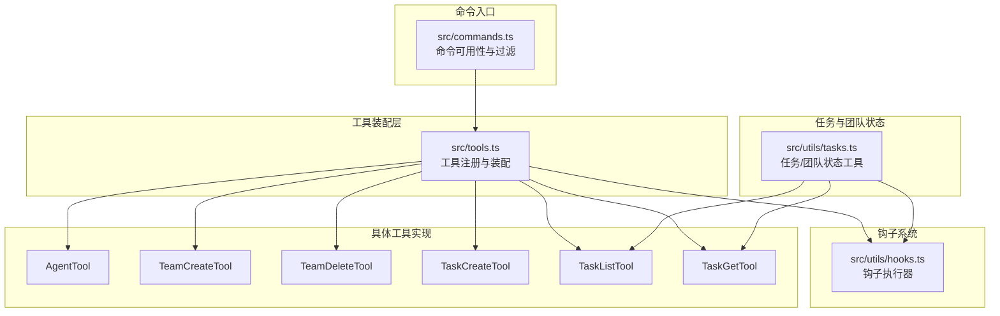
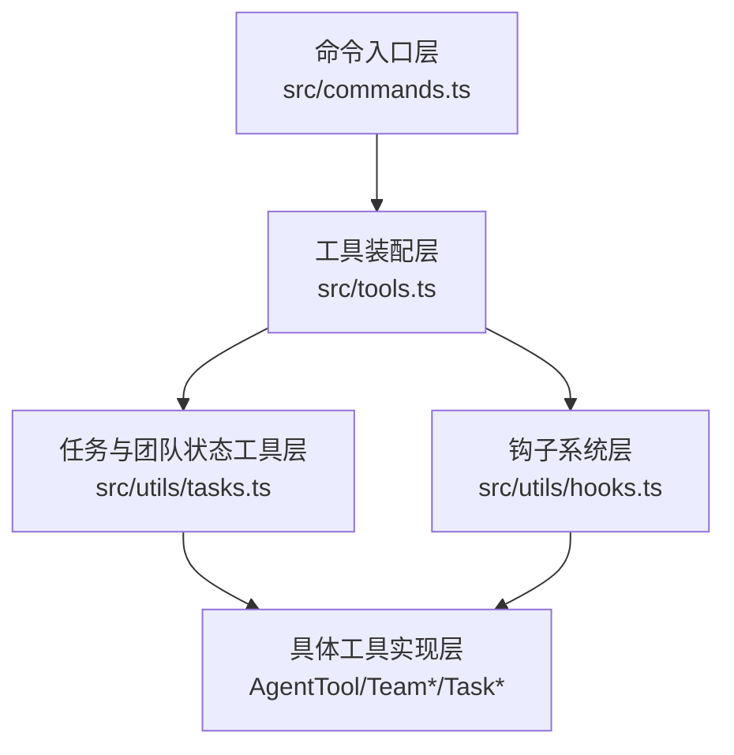
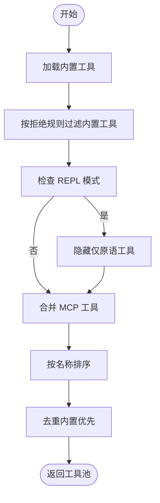
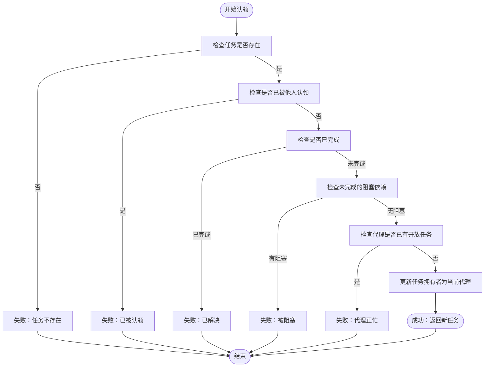
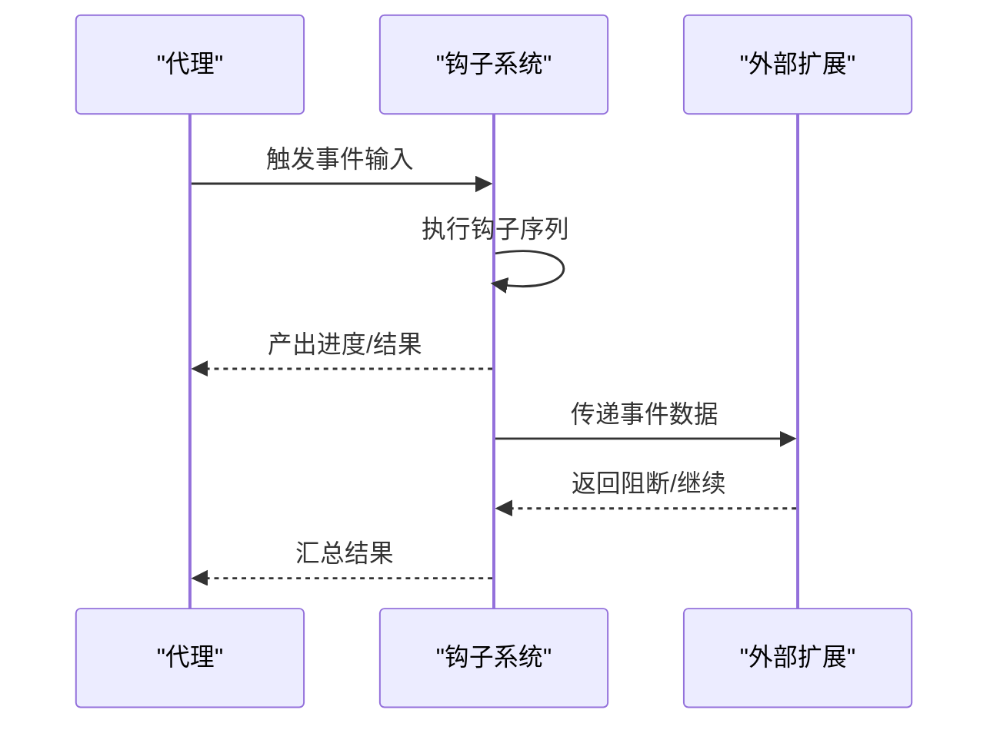
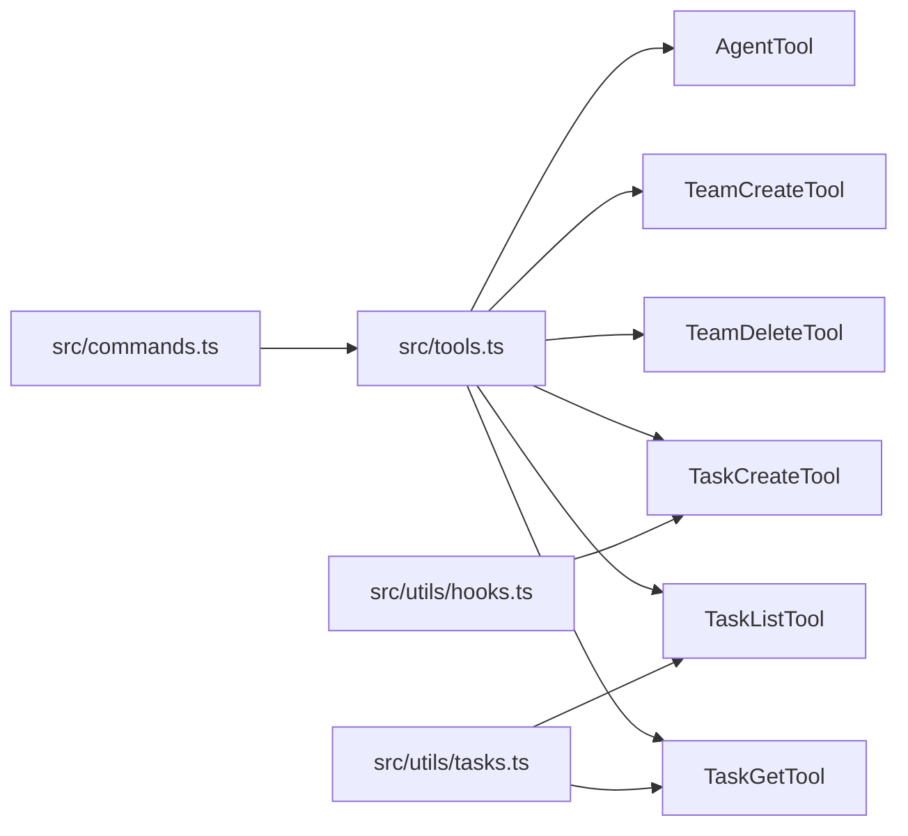

# 代理和团队工具

<cite>
**本文引用的文件**
- [src/tools.ts](file://src/tools.ts)
- [src/utils/tasks.ts](file://src/utils/tasks.ts)
- [src/utils/hooks.ts](file://src/utils/hooks.ts)
- [src/tools/AgentTool/AgentTool.tsx](file://src/tools/AgentTool/AgentTool.tsx)
- [src/tools/TeamCreateTool/TeamCreateTool.ts](file://src/tools/TeamCreateTool/TeamCreateTool.ts)
- [src/tools/TeamDeleteTool/TeamDeleteTool.ts](file://src/tools/TeamDeleteTool/TeamDeleteTool.ts)
- [src/tools/TaskCreateTool/TaskCreateTool.ts](file://src/tools/TaskCreateTool/TaskCreateTool.ts)
- [src/tools/TaskListTool/TaskListTool.ts](file://src/tools/TaskListTool/TaskListTool.ts)
- [src/tools/TaskGetTool/TaskGetTool.ts](file://src/tools/TaskGetTool/TaskGetTool.ts)
- [src/commands.ts](file://src/commands.ts)
</cite>

## 目录
1. [简介](#简介)
2. [项目结构](#项目结构)
3. [核心组件](#核心组件)
4. [架构总览](#架构总览)
5. [详细组件分析](#详细组件分析)
6. [依赖关系分析](#依赖关系分析)
7. [性能考量](#性能考量)
8. [故障排查指南](#故障排查指南)
9. [结论](#结论)
10. [附录](#附录)

## 简介
本技术文档聚焦于代理与团队协作工具体系，涵盖以下关键能力：
- 代理工具（AgentTool）：用于在多代理环境中进行代理管理与交互。
- 团队创建/删除工具：支持以团队维度组织代理并维护团队成员与配置。
- 任务创建/列表/获取工具：提供任务生命周期管理与状态查询。
- 多代理协作机制：通过任务所有权与阻塞关系实现协作与并发控制。
- 任务分配策略：基于“空闲优先”与“无阻塞”原则进行任务认领。
- 团队状态管理：根据任务所有权统计代理空闲/忙碌状态。
- 代理间通信协议：通过钩子系统与工具池装配实现跨代理协作。
- 代理生命周期管理：结合任务状态与钩子事件实现代理的启动、运行、下线与回收。
- 并发控制机制：通过任务阻塞、代理占用与互斥认领避免冲突。

## 项目结构
围绕代理与团队工具的相关模块主要分布在如下位置：
- 工具注册与装配：src/tools.ts
- 任务与团队状态工具：src/utils/tasks.ts
- 钩子执行器：src/utils/hooks.ts
- 具体工具实现：src/tools 下各工具目录
- 命令入口与可用性过滤：src/commands.ts

图表来源
- [src/tools.ts:193-251](file://src/tools.ts#L193-L251)
- [src/utils/tasks.ts:635-845](file://src/utils/tasks.ts#L635-L845)
- [src/utils/hooks.ts:3709-3776](file://src/utils/hooks.ts#L3709-L3776)
- [src/commands.ts:258-346](file://src/commands.ts#L258-L346)

章节来源
- [src/tools.ts:193-251](file://src/tools.ts#L193-L251)
- [src/utils/tasks.ts:635-845](file://src/utils/tasks.ts#L635-L845)
- [src/utils/hooks.ts:3709-3776](file://src/utils/hooks.ts#L3709-L3776)
- [src/commands.ts:258-346](file://src/commands.ts#L258-L346)

## 核心组件
- 工具装配与可用性过滤：统一从工具池生成可用工具集，支持权限规则与特性开关过滤。
- 任务与团队状态工具：提供任务认领、阻塞检测、代理状态统计与团队成员读取。
- 钩子系统：在任务生命周期与代理状态变化时触发可扩展的钩子流程。
- 具体工具：
  - AgentTool：代理管理与交互。
  - TeamCreateTool/TeamDeleteTool：团队创建与删除。
  - TaskCreateTool/TaskListTool/TaskGetTool：任务创建、列出与获取。

章节来源
- [src/tools.ts:271-327](file://src/tools.ts#L271-L327)
- [src/utils/tasks.ts:635-845](file://src/utils/tasks.ts#L635-L845)
- [src/utils/hooks.ts:3709-3776](file://src/utils/hooks.ts#L3709-L3776)

## 架构总览
整体架构由“工具装配层”、“任务与团队状态工具层”、“钩子系统层”和“具体工具实现层”构成。工具装配层负责按权限与特性生成最终可用工具集；任务与团队状态工具层提供任务所有权、阻塞关系与代理状态统计；钩子系统层在关键事件上提供扩展点；具体工具实现层承载业务逻辑。

图表来源
- [src/tools.ts:193-251](file://src/tools.ts#L193-L251)
- [src/utils/tasks.ts:635-845](file://src/utils/tasks.ts#L635-L845)
- [src/utils/hooks.ts:3709-3776](file://src/utils/hooks.ts#L3709-L3776)
- [src/commands.ts:258-346](file://src/commands.ts#L258-L346)

## 详细组件分析

### 组件一：工具装配与可用性过滤（src/tools.ts）
- 职责
  - 汇总内置工具与 MCP 工具，按权限规则与特性开关过滤，保证工具池一致性与安全性。
  - 提供工具集合的合并、去重与排序，确保提示缓存稳定性。
- 关键点
  - 条件导入：根据环境变量与特性开关动态启用/禁用工具。
  - 拒绝规则过滤：对工具名称或 MCP 前缀进行拒绝匹配，屏蔽特定工具。
  - 工具池合并：内置工具优先，MCP 工具补充，保持稳定排序。
- 使用示例
  - 在命令模式或 REPL 中调用工具池装配函数，获得当前会话可用工具集。

图表来源
- [src/tools.ts:345-367](file://src/tools.ts#L345-L367)
- [src/tools.ts:262-269](file://src/tools.ts#L262-L269)
- [src/tools.ts:314-323](file://src/tools.ts#L314-L323)

章节来源
- [src/tools.ts:193-251](file://src/tools.ts#L193-L251)
- [src/tools.ts:262-269](file://src/tools.ts#L262-L269)
- [src/tools.ts:345-367](file://src/tools.ts#L345-L367)

### 组件二：任务与团队状态工具（src/utils/tasks.ts）
- 职责
  - 任务认领与阻塞检测：防止重复认领、已完成任务认领、被阻塞任务认领以及代理同时处理多个开放任务。
  - 代理状态统计：基于任务所有权统计每个代理的空闲/忙碌状态。
  - 团队成员读取：从团队配置文件读取领导与成员信息。
  - 代理下线任务回收：当代理终止或关闭时，将未完成任务重新置为开放并通知。
- 关键点
  - 认领前置条件：任务存在、未被他人认领、未完成、无未完成的阻塞依赖、代理当前无其他开放任务。
  - 状态统计：兼容名称与 agentId 双索引，汇总代理当前拥有的开放任务。
  - 任务回收：遍历未完成任务，清空拥有者并重置状态为 pending。
- 使用示例
  - 代理在执行前调用认领接口，确认可认领后更新任务拥有者。
  - 团队协调器定期调用代理状态统计，选择空闲代理进行任务分发。

图表来源
- [src/utils/tasks.ts:635-692](file://src/utils/tasks.ts#L635-L692)

章节来源
- [src/utils/tasks.ts:635-692](file://src/utils/tasks.ts#L635-L692)
- [src/utils/tasks.ts:763-798](file://src/utils/tasks.ts#L763-L798)
- [src/utils/tasks.ts:818-845](file://src/utils/tasks.ts#L818-L845)

### 组件三：钩子系统（src/utils/hooks.ts）
- 职责
  - 在代理空闲、任务创建、任务完成等关键事件触发钩子，允许外部扩展行为（如通知、审计、策略干预）。
- 关键点
  - 异步生成器：逐段产出进度消息与阻断错误，便于前端反馈与中断。
  - 事件类型：TeammateIdle、TaskCreated、TaskCompleted 等。
  - 执行上下文：支持超时与取消信号，保障执行稳定性。
- 使用示例
  - 当代理进入空闲状态时，触发 TeammateIdle 钩子，协调器据此进行任务分发。

图表来源
- [src/utils/hooks.ts:3709-3776](file://src/utils/hooks.ts#L3709-L3776)

章节来源
- [src/utils/hooks.ts:3709-3776](file://src/utils/hooks.ts#L3709-L3776)

### 组件四：代理工具（AgentTool）
- 职责
  - 在多代理环境中提供代理管理与交互能力，作为工具池的一部分参与任务分发与执行。
- 关键点
  - 作为工具注册到工具装配层，受权限与特性过滤影响。
  - 与任务系统协同：在任务认领与状态统计中发挥作用。
- 使用示例
  - 在命令模式或 REPL 中通过工具池调用 AgentTool 进行代理相关操作。

章节来源
- [src/tools.ts:193-251](file://src/tools.ts#L193-L251)

### 组件五：团队创建/删除工具（TeamCreateTool/TeamDeleteTool）
- 职责
  - 创建团队并写入团队配置文件，包含领导与成员信息。
  - 删除团队并清理相关资源。
- 关键点
  - 条件注册：仅在启用代理集群特性时加入工具池。
  - 与工具装配层联动：通过懒加载避免循环依赖。
- 使用示例
  - 创建团队后，其他工具（任务工具、消息工具）可基于团队名进行任务分发与消息广播。

章节来源
- [src/tools.ts:63-72](file://src/tools.ts#L63-L72)
- [src/tools.ts:228-230](file://src/tools.ts#L228-L230)

### 组件六：任务创建/列表/获取工具（TaskCreateTool/TaskListTool/TaskGetTool）
- 职责
  - 创建任务：校验输入并持久化任务元数据。
  - 列出任务：按团队/任务列表维度返回任务清单。
  - 获取任务：按任务 ID 返回任务详情。
- 关键点
  - 与任务状态工具协同：认领与阻塞检测在任务生命周期中贯穿始终。
  - 与钩子系统协同：任务创建事件可触发外部钩子。
- 使用示例
  - 协调器创建任务后，通过 TaskListTool 获取开放任务，再通过 TaskGetTool 获取详情，最后由 AgentTool 与任务状态工具完成认领与执行。

章节来源
- [src/tools.ts:82-85](file://src/tools.ts#L82-L85)
- [src/utils/hooks.ts:3745-3773](file://src/utils/hooks.ts#L3745-L3773)

### 组件七：命令入口与可用性过滤（src/commands.ts）
- 职责
  - 统一管理命令集合，按可用性与启用状态筛选命令。
  - 支持远程模式安全命令白名单，保障移动端/远程控制的安全性。
- 关键点
  - 命令可用性：根据认证与提供商要求过滤命令。
  - 远程安全命令：限定可在远程模式下执行的本地命令集合。
- 使用示例
  - 在远程模式下，仅允许安全命令通过桥接通道执行，避免本地上下文依赖命令泄露风险。

章节来源
- [src/commands.ts:417-443](file://src/commands.ts#L417-L443)
- [src/commands.ts:619-676](file://src/commands.ts#L619-L676)

## 依赖关系分析
- 工具装配层依赖权限规则与特性开关，决定工具池内容。
- 任务与团队状态工具依赖任务列表与团队配置文件，提供状态查询与变更。
- 钩子系统在任务与代理事件上提供扩展点，增强协作与可观测性。
- 具体工具实现依赖工具装配层提供的工具池与权限上下文。
- 命令入口层对工具与命令进行统一可用性过滤，保障运行安全。

图表来源
- [src/tools.ts:193-251](file://src/tools.ts#L193-L251)
- [src/utils/tasks.ts:635-845](file://src/utils/tasks.ts#L635-L845)
- [src/utils/hooks.ts:3709-3776](file://src/utils/hooks.ts#L3709-L3776)
- [src/commands.ts:258-346](file://src/commands.ts#L258-L346)

章节来源
- [src/tools.ts:193-251](file://src/tools.ts#L193-L251)
- [src/utils/tasks.ts:635-845](file://src/utils/tasks.ts#L635-L845)
- [src/utils/hooks.ts:3709-3776](file://src/utils/hooks.ts#L3709-L3776)
- [src/commands.ts:258-346](file://src/commands.ts#L258-L346)

## 性能考量
- 工具池装配采用去重与排序策略，确保提示缓存命中率与稳定性。
- 任务认领与阻塞检测在内存中进行，复杂度与任务数量线性相关，建议合理控制任务规模。
- 钩子执行支持超时与取消，避免长时间阻塞主流程。
- 命令与工具的可用性过滤在会话初始化阶段完成，减少运行时判断开销。

## 故障排查指南
- 任务认领失败
  - 检查任务是否存在与状态是否已完成。
  - 确认任务是否被他人认领或存在未完成的阻塞依赖。
  - 排查代理是否已在处理其他开放任务。
- 代理状态统计异常
  - 确认团队配置文件存在且格式正确。
  - 检查任务所有权字段是否包含名称与 agentId 的双重索引。
- 钩子执行问题
  - 检查钩子事件输入参数是否完整。
  - 确认超时与取消信号设置合理，避免长时间阻塞。
- 命令不可用
  - 检查命令可用性要求与当前认证状态。
  - 确认远程模式下的安全命令白名单是否包含目标命令。

章节来源
- [src/utils/tasks.ts:635-692](file://src/utils/tasks.ts#L635-L692)
- [src/utils/tasks.ts:763-798](file://src/utils/tasks.ts#L763-L798)
- [src/utils/hooks.ts:3709-3776](file://src/utils/hooks.ts#L3709-L3776)
- [src/commands.ts:417-443](file://src/commands.ts#L417-L443)

## 结论
本工具体系通过“工具装配层—任务与团队状态工具层—钩子系统层—具体工具实现层”的分层设计，实现了多代理协作、任务分配与并发控制的闭环。工具装配层确保可用性与安全性，任务与团队状态工具层提供任务所有权与代理状态管理，钩子系统层提供扩展点，具体工具实现承载业务逻辑。配合命令入口层的可用性过滤与远程安全策略，整体方案具备良好的可扩展性与运行稳定性。

## 附录
- 使用示例（概念性说明）
  - 团队协作场景：创建团队 → 分配任务 → 代理认领 → 钩子触发 → 任务完成 → 状态更新。
  - 任务分发：协调器查询空闲代理 → 选择开放任务 → 代理认领 → 执行任务。
  - 代理协调：代理空闲钩子触发 → 协调器推送任务 → 代理执行 → 完成回调。