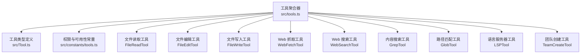
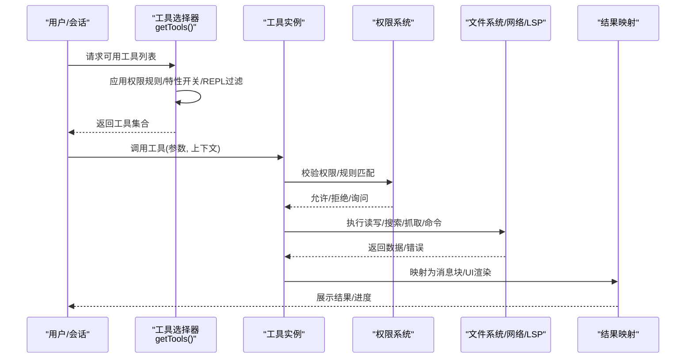
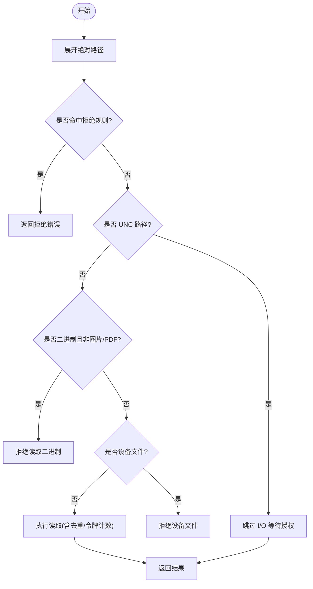
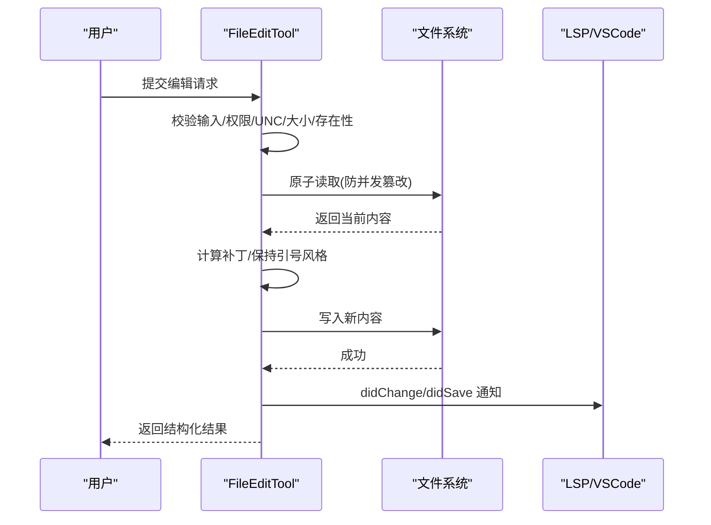
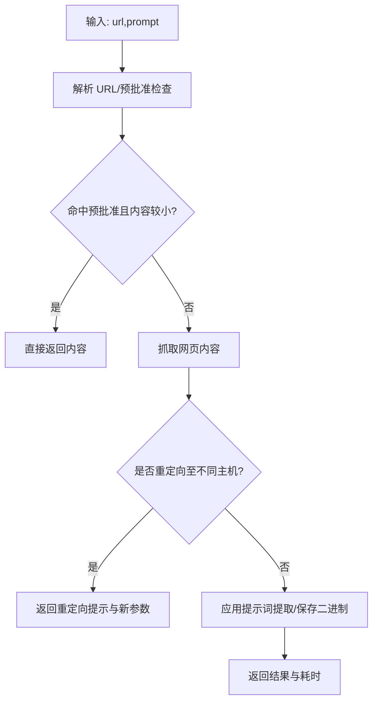
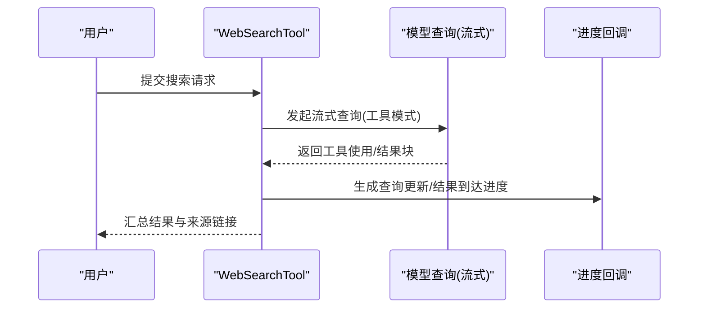
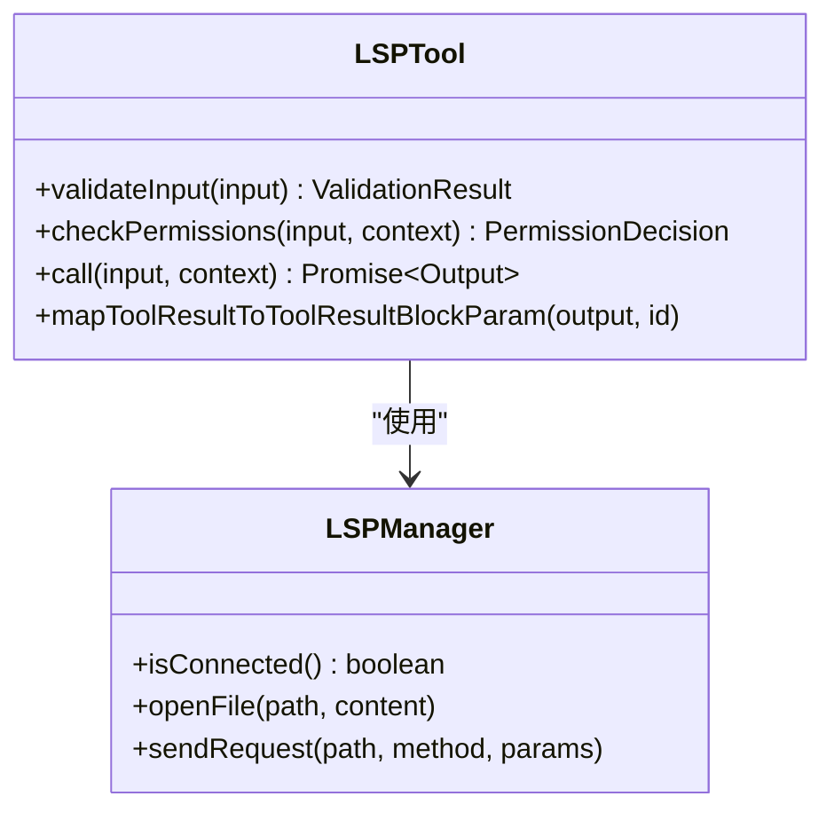
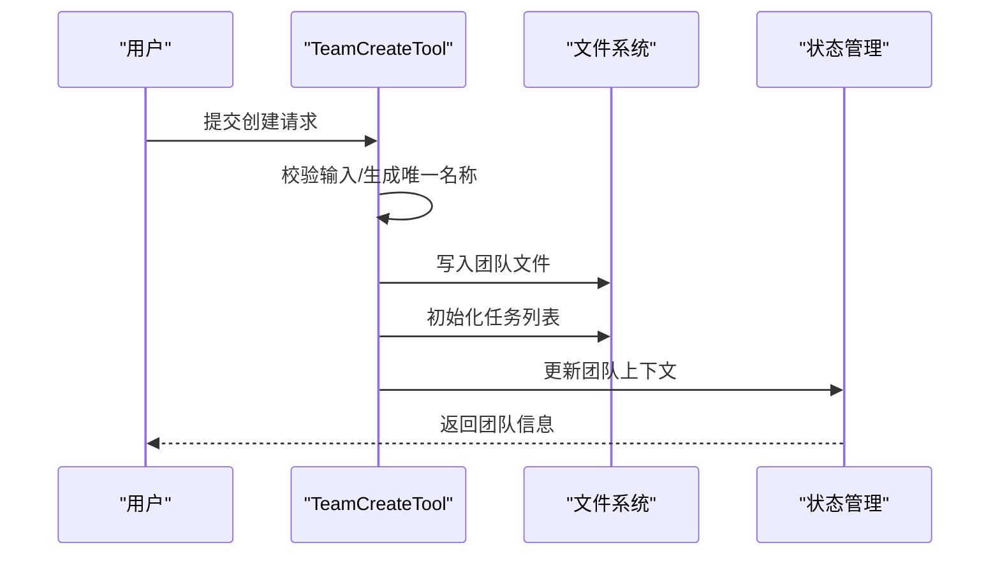
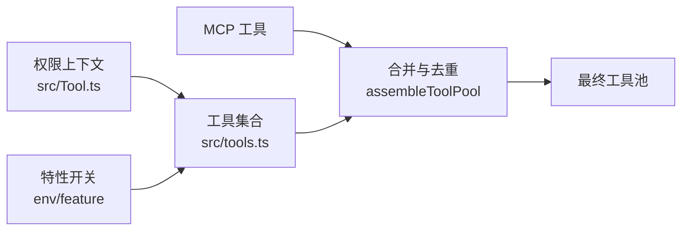

# 内置工具详解

<cite>
**本文档引用的文件**
- [src/tools.ts](file://src/tools.ts)
- [src/constants/tools.ts](file://src/constants/tools.ts)
- [src/Tool.ts](file://src/Tool.ts)
- [src/tools/FileReadTool/FileReadTool.ts](file://src/tools/FileReadTool/FileReadTool.ts)
- [src/tools/FileEditTool/FileEditTool.ts](file://src/tools/FileEditTool/FileEditTool.ts)
- [src/tools/FileWriteTool/FileWriteTool.ts](file://src/tools/FileWriteTool/FileWriteTool.ts)
- [src/tools/WebFetchTool/WebFetchTool.ts](file://src/tools/WebFetchTool/WebFetchTool.ts)
- [src/tools/WebSearchTool/WebSearchTool.ts](file://src/tools/WebSearchTool/WebSearchTool.ts)
- [src/tools/GrepTool/GrepTool.ts](file://src/tools/GrepTool/GrepTool.ts)
- [src/tools/GlobTool/GlobTool.ts](file://src/tools/GlobTool/GlobTool.ts)
- [src/tools/LSPTool/LSPTool.ts](file://src/tools/LSPTool/LSPTool.ts)
- [src/tools/TeamCreateTool/TeamCreateTool.ts](file://src/tools/TeamCreateTool/TeamCreateTool.ts)
</cite>

## 目录
1. [简介](#简介)
2. [项目结构](#项目结构)
3. [核心组件](#核心组件)
4. [架构总览](#架构总览)
5. [详细组件分析](#详细组件分析)
6. [依赖关系分析](#依赖关系分析)
7. [性能考量](#性能考量)
8. [故障排除指南](#故障排除指南)
9. [结论](#结论)

## 简介
本文件为 Claude Code 的 40+ 内置工具提供全面技术文档，覆盖文件操作工具（FileRead、FileEdit、FileWrite）、系统工具（Bash、PowerShell）、网络工具（WebFetch、WebSearch）、开发工具（Grep、Glob、LSP）、代理工具（AgentTool、TeamCreate）等。内容包含：
- 工具功能特性、使用场景与实现原理
- 输入参数、输出格式、权限要求与安全限制
- 使用示例与最佳实践
- 工具间的协作关系与组合使用方式

## 项目结构
内置工具的统一入口与装配逻辑集中在工具聚合模块中，按环境与权限动态组装可用工具集，并支持 MCP 工具合并。

图表来源
- [src/tools.ts:193-251](file://src/tools.ts#L193-L251)
- [src/Tool.ts:362-695](file://src/Tool.ts#L362-L695)
- [src/constants/tools.ts:36-113](file://src/constants/tools.ts#L36-L113)

章节来源
- [src/tools.ts:193-390](file://src/tools.ts#L193-L390)
- [src/Tool.ts:362-793](file://src/Tool.ts#L362-L793)
- [src/constants/tools.ts:1-113](file://src/constants/tools.ts#L1-L113)

## 核心组件
- 工具接口与默认行为：所有内置工具遵循统一的 Tool 接口，具备输入/输出模式、权限校验、并发安全、只读/破坏性标记、进度渲染、结果映射等能力。
- 工具装配与过滤：根据权限上下文、运行模式、特性开关与 REPL 环境，动态筛选与排序工具集合；支持 MCP 工具合并与去重。
- 权限与可用性：通过权限规则、工具启用状态、平台特性检测（如 LSP 连接、PowerShell 启用）控制工具可用性。

章节来源
- [src/Tool.ts:362-793](file://src/Tool.ts#L362-L793)
- [src/tools.ts:262-367](file://src/tools.ts#L262-L367)
- [src/constants/tools.ts:36-113](file://src/constants/tools.ts#L36-L113)

## 架构总览
工具调用链路从请求到执行的关键步骤如下：

图表来源
- [src/tools.ts:271-327](file://src/tools.ts#L271-L327)
- [src/Tool.ts:496-503](file://src/Tool.ts#L496-L503)

章节来源
- [src/tools.ts:271-327](file://src/tools.ts#L271-L327)
- [src/Tool.ts:496-503](file://src/Tool.ts#L496-L503)

## 详细组件分析

### 文件操作工具

#### FileReadTool（文件读取）
- 功能特性
  - 支持文本、图片、PDF、Jupyter Notebook 多媒体内容读取
  - 行号前缀、偏移范围读取、PDF 分页提取
  - 二进制扩展名检测、设备文件阻断、UNC 路径安全处理
  - 结果缓存去重、会话记忆新鲜度提示、令牌计数与上限控制
- 输入参数
  - file_path: 绝对路径
  - offset/limit: 行范围读取
  - pages: PDF 页码范围（如 "1-5"）
- 输出格式
  - 文本/图像/笔记本/PDF/部分提取/未变更占位
- 权限与安全
  - 读取权限检查、拒绝规则匹配、UNC 路径延迟 I/O 防止凭据泄露
- 最佳实践
  - 大文件优先使用 offset/limit 或 pages 参数分段读取
  - PDF 提取建议指定页范围，避免超大结果
  - 使用相对路径时注意工作目录与权限规则

图表来源
- [src/tools/FileReadTool/FileReadTool.ts:418-495](file://src/tools/FileReadTool/FileReadTool.ts#L418-L495)
- [src/tools/FileReadTool/FileReadTool.ts:594-651](file://src/tools/FileReadTool/FileReadTool.ts#L594-L651)

章节来源
- [src/tools/FileReadTool/FileReadTool.ts:227-335](file://src/tools/FileReadTool/FileReadTool.ts#L227-L335)
- [src/tools/FileReadTool/FileReadTool.ts:398-495](file://src/tools/FileReadTool/FileReadTool.ts#L398-L495)
- [src/tools/FileReadTool/FileReadTool.ts:594-651](file://src/tools/FileReadTool/FileReadTool.ts#L594-L651)

#### FileEditTool（文件编辑）
- 功能特性
  - 基于精确字符串替换的就地编辑，支持全量替换与逐次替换
  - 引号风格保持、引用计数统计、原子读改写保证
  - LSP 变更通知、VSCode Diff 通知、文件历史备份
- 输入参数
  - file_path: 目标文件
  - old_string/new_string: 替换对
  - replace_all: 是否全部替换
- 输出格式
  - 结构化补丁、原始内容、用户修改标记、可选 Git diff
- 权限与安全
  - 写入权限检查、UNC 路径延迟 I/O、空文件创建约束、笔记本文件保护
- 最佳实践
  - 编辑前先 Read，确保内容一致性
  - replace_all=false 时提供足够上下文以唯一定位
  - 大文件避免一次性替换，分步进行

图表来源
- [src/tools/FileEditTool/FileEditTool.ts:137-362](file://src/tools/FileEditTool/FileEditTool.ts#L137-L362)
- [src/tools/FileEditTool/FileEditTool.ts:387-574](file://src/tools/FileEditTool/FileEditTool.ts#L387-L574)

章节来源
- [src/tools/FileEditTool/FileEditTool.ts:86-132](file://src/tools/FileEditTool/FileEditTool.ts#L86-L132)
- [src/tools/FileEditTool/FileEditTool.ts:137-362](file://src/tools/FileEditTool/FileEditTool.ts#L137-L362)
- [src/tools/FileEditTool/FileEditTool.ts:387-574](file://src/tools/FileEditTool/FileEditTool.ts#L387-L574)

#### FileWriteTool（文件写入）
- 功能特性
  - 全量覆盖写入，保留显式行尾设置
  - LSP/VSCode 通知、文件历史备份、Git diff 可选计算
- 输入参数
  - file_path: 目标文件（绝对路径）
  - content: 新内容
- 输出格式
  - 创建/更新标识、结构化补丁、原始内容、可选 Git diff
- 权限与安全
  - 写入权限检查、UNC 路径延迟 I/O、未读先写拦截
- 最佳实践
  - 覆盖写入前先 Read，避免意外覆盖
  - 对脚本类文件注意行尾风格一致性

章节来源
- [src/tools/FileWriteTool/FileWriteTool.ts:56-91](file://src/tools/FileWriteTool/FileWriteTool.ts#L56-L91)
- [src/tools/FileWriteTool/FileWriteTool.ts:153-222](file://src/tools/FileWriteTool/FileWriteTool.ts#L153-L222)
- [src/tools/FileWriteTool/FileWriteTool.ts:223-417](file://src/tools/FileWriteTool/FileWriteTool.ts#L223-L417)

### 系统工具

#### BashTool（命令执行）
- 功能特性
  - 在受控环境中执行 shell 命令，支持中断行为、进度反馈
  - 与权限系统集成，支持 deny/ask/allow 规则
- 输入参数
  - 命令字符串与参数（由具体实现定义）
- 输出格式
  - 标准输出/错误、退出码、耗时、可选进度块
- 权限与安全
  - Shell 工具启用检测、UNC 路径安全、权限规则匹配
- 最佳实践
  - 优先使用最小权限命令，避免高风险操作
  - 大型输出建议配合分页或过滤

章节来源
- [src/tools.ts:193-251](file://src/tools.ts#L193-L251)
- [src/Tool.ts:416-417](file://src/Tool.ts#L416-L417)

#### PowerShellTool（Windows PowerShell）
- 功能特性
  - Windows 平台专用的 PowerShell 执行工具
  - 与 BashTool 类似的权限与安全机制
- 输入参数
  - PowerShell 命令与参数
- 输出格式
  - 标准输出/错误、退出码、耗时
- 权限与安全
  - PowerShell 工具启用检测、UNC 路径安全
- 最佳实践
  - 仅在 Windows 环境启用时使用
  - 注意脚本签名与执行策略限制

章节来源
- [src/tools.ts:150-155](file://src/tools.ts#L150-L155)
- [src/tools.ts:242](file://src/tools.ts#L242)

### 网络工具

#### WebFetchTool（网页抓取）
- 功能特性
  - 抓取 URL 内容并应用提示词提取摘要
  - 预批准主机白名单、重定向检测、二进制内容落盘提示
- 输入参数
  - url: 目标 URL
  - prompt: 应用于内容的提示词
- 输出格式
  - 字节大小、HTTP 状态码/文本、处理结果、耗时、原始 URL
- 权限与安全
  - 主机域名规则匹配、预批准主机豁免、ask/allow/deny 规则
- 最佳实践
  - 私有/认证页面需使用专门的 MCP 工具
  - 对重定向场景按提示重新发起请求

图表来源
- [src/tools/WebFetchTool/WebFetchTool.ts:208-299](file://src/tools/WebFetchTool/WebFetchTool.ts#L208-L299)

章节来源
- [src/tools/WebFetchTool/WebFetchTool.ts:24-48](file://src/tools/WebFetchTool/WebFetchTool.ts#L24-L48)
- [src/tools/WebFetchTool/WebFetchTool.ts:104-180](file://src/tools/WebFetchTool/WebFetchTool.ts#L104-L180)
- [src/tools/WebFetchTool/WebFetchTool.ts:208-299](file://src/tools/WebFetchTool/WebFetchTool.ts#L208-L299)

#### WebSearchTool（网络搜索）
- 功能特性
  - 通过模型流式执行 Web 搜索，最多 8 次搜索
  - 支持允许/阻止域过滤、进度事件、结果汇总
- 输入参数
  - query: 搜索关键词
  - allowed_domains/blocked_domains: 域名白名单/黑名单
- 输出格式
  - 查询、结果数组（链接/文本）、耗时
- 权限与安全
  - 第三方/Vertex/Foudry 平台模型支持检测、权限提示与建议
- 最佳实践
  - 合理使用 allowed_domains/blocked_domains 控制结果质量
  - 将来源以 Markdown 链接形式呈现给用户

图表来源
- [src/tools/WebSearchTool/WebSearchTool.ts:254-400](file://src/tools/WebSearchTool/WebSearchTool.ts#L254-L400)

章节来源
- [src/tools/WebSearchTool/WebSearchTool.ts:25-69](file://src/tools/WebSearchTool/WebSearchTool.ts#L25-L69)
- [src/tools/WebSearchTool/WebSearchTool.ts:152-229](file://src/tools/WebSearchTool/WebSearchTool.ts#L152-L229)
- [src/tools/WebSearchTool/WebSearchTool.ts:254-400](file://src/tools/WebSearchTool/WebSearchTool.ts#L254-L400)

### 开发工具

#### GrepTool（内容搜索）
- 功能特性
  - 基于 ripgrep 的正则搜索，支持上下文、行号、大小写不敏感、类型过滤
  - 输出模式：内容/文件列表/计数，带 head_limit/offset 分页
- 输入参数
  - pattern: 正则表达式
  - path/glob/type: 搜索范围与过滤
  - output_mode: 输出模式
  - -B/-A/-C/context/-n/-i/multiline/head_limit/offset
- 输出格式
  - 模式、文件数量、文件名列表/内容/计数、分页信息
- 权限与安全
  - 读取权限检查、UNC 路径安全、忽略模式应用
- 最佳实践
  - 使用 glob 与 type 提升效率
  - 大结果集使用 head_limit 与 offset 分页

章节来源
- [src/tools/GrepTool/GrepTool.ts:33-91](file://src/tools/GrepTool/GrepTool.ts#L33-L91)
- [src/tools/GrepTool/GrepTool.ts:160-240](file://src/tools/GrepTool/GrepTool.ts#L160-L240)
- [src/tools/GrepTool/GrepTool.ts:310-577](file://src/tools/GrepTool/GrepTool.ts#L310-L577)

#### GlobTool（路径匹配）
- 功能特性
  - 基于通配符的文件查找，默认限制 100 个结果
- 输入参数
  - pattern: 通配符模式
  - path: 搜索目录（可选）
- 输出格式
  - 耗时、文件数量、文件名列表、是否截断
- 权限与安全
  - 读取权限检查、UNC 路径安全
- 最佳实践
  - 使用更具体的路径或模式缩小结果集

章节来源
- [src/tools/GlobTool/GlobTool.ts:26-55](file://src/tools/GlobTool/GlobTool.ts#L26-L55)
- [src/tools/GlobTool/GlobTool.ts:57-134](file://src/tools/GlobTool/GlobTool.ts#L57-L134)
- [src/tools/GlobTool/GlobTool.ts:154-198](file://src/tools/GlobTool/GlobTool.ts#L154-L198)

#### LSPTool（语言服务器）
- 功能特性
  - 定义/引用/悬停/符号/实现/调用层级等代码智能操作
  - 自动等待 LSP 初始化、过滤 gitignore 结果、文件大小限制
- 输入参数
  - operation: 操作类型（goToDefinition/findReferences/hover/documentSymbol/workspaceSymbol/goToImplementation/prepareCallHierarchy/incomingCalls/outgoingCalls）
  - filePath/line/character: 位置信息（1 基）
- 输出格式
  - 操作名称、格式化结果、结果数量、文件数量
- 权限与安全
  - 读取权限检查、UNC 路径安全、文件存在性校验
- 最佳实践
  - 确保 LSP 连接可用，大型文件避免 LSP 分析

图表来源
- [src/tools/LSPTool/LSPTool.ts:127-224](file://src/tools/LSPTool/LSPTool.ts#L127-L224)
- [src/tools/LSPTool/LSPTool.ts:224-422](file://src/tools/LSPTool/LSPTool.ts#L224-L422)

章节来源
- [src/tools/LSPTool/LSPTool.ts:59-126](file://src/tools/LSPTool/LSPTool.ts#L59-L126)
- [src/tools/LSPTool/LSPTool.ts:155-209](file://src/tools/LSPTool/LSPTool.ts#L155-L209)
- [src/tools/LSPTool/LSPTool.ts:224-422](file://src/tools/LSPTool/LSPTool.ts#L224-L422)

### 代理工具

#### AgentTool（代理工具）
- 功能特性
  - 协调多代理任务、管理任务生命周期
  - 与权限常量中的禁用集合配合，防止递归与不安全组合
- 输入参数
  - 代理定义与任务参数（由具体实现定义）
- 输出格式
  - 任务状态、进度、结果
- 权限与安全
  - 严格限制异步代理可用工具集，禁止递归与高风险操作

章节来源
- [src/tools.ts:193-251](file://src/tools.ts#L193-L251)
- [src/constants/tools.ts:36-71](file://src/constants/tools.ts#L36-L71)

#### TeamCreateTool（团队创建）
- 功能特性
  - 创建多代理团队（Swarm），生成团队文件、任务列表、团队上下文
  - 限制每位领导者只能管理一个团队
- 输入参数
  - team_name: 团队名称
  - description: 描述（可选）
  - agent_type: 团队领导角色（可选）
- 输出格式
  - 团队名称、团队文件路径、领导代理 ID
- 权限与安全
  - 仅在启用代理 Swarm 时可用
- 最佳实践
  - 团队命名应语义明确，避免重复
  - 使用后及时清理不再使用的团队

图表来源
- [src/tools/TeamCreateTool/TeamCreateTool.ts:128-237](file://src/tools/TeamCreateTool/TeamCreateTool.ts#L128-L237)

章节来源
- [src/tools/TeamCreateTool/TeamCreateTool.ts:74-105](file://src/tools/TeamCreateTool/TeamCreateTool.ts#L74-L105)
- [src/tools/TeamCreateTool/TeamCreateTool.ts:128-237](file://src/tools/TeamCreateTool/TeamCreateTool.ts#L128-L237)

## 依赖关系分析
- 工具装配依赖
  - 权限上下文：全局拒绝规则、本地/远程规则、REPL 仅工具过滤
  - 特性开关：平台/功能特性决定工具可用性（如 PowerShell、LSP、Worktree、Agent Swarms）
  - MCP 工具：与内置工具合并，按名称去重，内置工具优先
- 工具间耦合
  - 文件读写工具与 LSP/VSCode 生态紧密耦合，确保编辑后同步
  - 搜索工具与 ripgrep、glob 实现强耦合，依赖权限忽略模式
  - Web 工具与权限规则、预批准主机列表耦合

图表来源
- [src/tools.ts:262-367](file://src/tools.ts#L262-L367)
- [src/Tool.ts:123-148](file://src/Tool.ts#L123-L148)

章节来源
- [src/tools.ts:262-367](file://src/tools.ts#L262-L367)
- [src/Tool.ts:123-148](file://src/Tool.ts#L123-L148)

## 性能考量
- 文件读取
  - 令牌计数与上限控制，避免超大文本进入模型
  - 去重缓存减少重复传输
- 搜索工具
  - 默认 head_limit 与 offset 限制结果规模，降低上下文占用
  - ripgrep 优化与忽略模式减少无效扫描
- Web 工具
  - 预批准主机与直接返回策略减少不必要的抓取
  - 流式搜索与进度事件提升交互体验
- LSP 工具
  - 文件大小限制与 gitignore 过滤避免无意义请求
  - 自动等待初始化，减少失败重试

## 故障排除指南
- 文件读取
  - “文件不存在”：检查路径、工作目录与权限规则；尝试相似文件建议
  - “设备文件/无限输出”：被阻断，更换目标
  - “超过最大令牌数”：使用 offset/limit 或 pages 分段
- 文件编辑
  - “文件已被修改”：先 Read 再写，或接受用户修改提示
  - “旧字符串未找到”：提供更多上下文或启用 replace_all
  - “笔记本文件”：使用 NotebookEditTool
- 文件写入
  - “未先读取”：先 Read 再写
- 搜索工具
  - “路径不存在”：检查目录与权限
  - “结果过多”：使用 head_limit/offset 或更精确的 glob/type
- Web 工具
  - “认证/私有页面”：使用 MCP 工具替代
  - “重定向至不同主机”：按提示重新发起请求
- LSP 工具
  - “LSP 未初始化/无可用服务器”：等待初始化或检查文件类型支持
  - “文件过大”：避免对超大文件进行 LSP 分析
- 团队工具
  - “已在团队中”：结束当前团队后再创建新团队

章节来源
- [src/tools/FileReadTool/FileReadTool.ts:418-495](file://src/tools/FileReadTool/FileReadTool.ts#L418-L495)
- [src/tools/FileEditTool/FileEditTool.ts:137-362](file://src/tools/FileEditTool/FileEditTool.ts#L137-L362)
- [src/tools/FileWriteTool/FileWriteTool.ts:153-222](file://src/tools/FileWriteTool/FileWriteTool.ts#L153-L222)
- [src/tools/GrepTool/GrepTool.ts:201-232](file://src/tools/GrepTool/GrepTool.ts#L201-L232)
- [src/tools/WebFetchTool/WebFetchTool.ts:216-249](file://src/tools/WebFetchTool/WebFetchTool.ts#L216-L249)
- [src/tools/LSPTool/LSPTool.ts:224-252](file://src/tools/LSPTool/LSPTool.ts#L224-L252)
- [src/tools/TeamCreateTool/TeamCreateTool.ts:132-140](file://src/tools/TeamCreateTool/TeamCreateTool.ts#L132-L140)

## 结论
Claude Code 的内置工具体系以统一的 Tool 接口为核心，结合严格的权限控制、平台特性检测与 MCP 工具融合，实现了安全、高效、可扩展的自动化能力。通过合理使用各工具的输入参数、输出格式与安全限制，并遵循最佳实践，可在复杂工程场景中实现稳健的组合使用与协作。