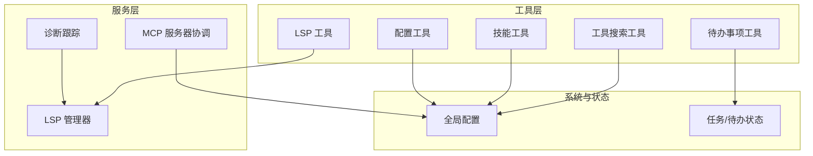
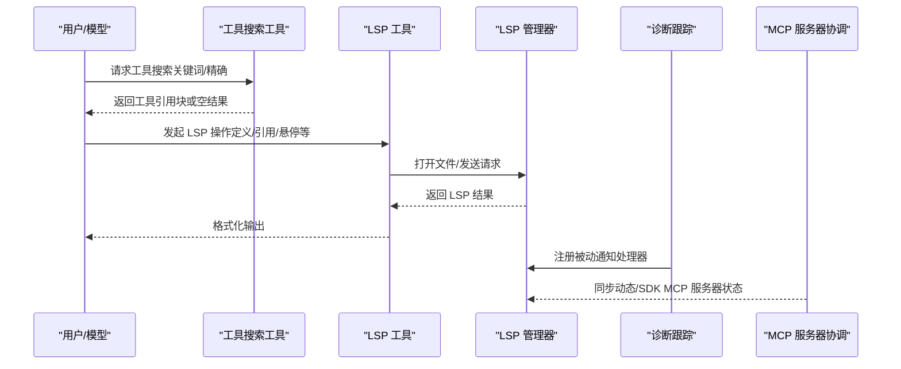
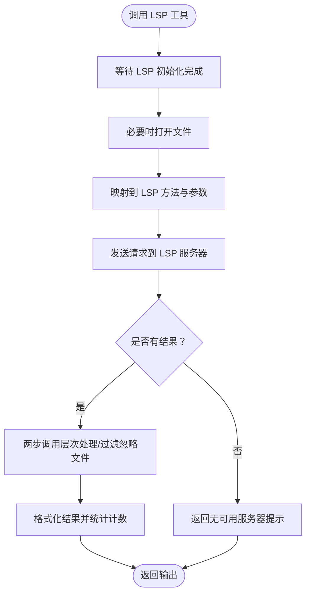
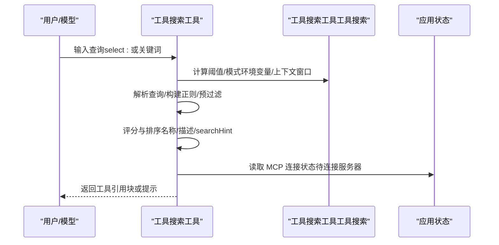
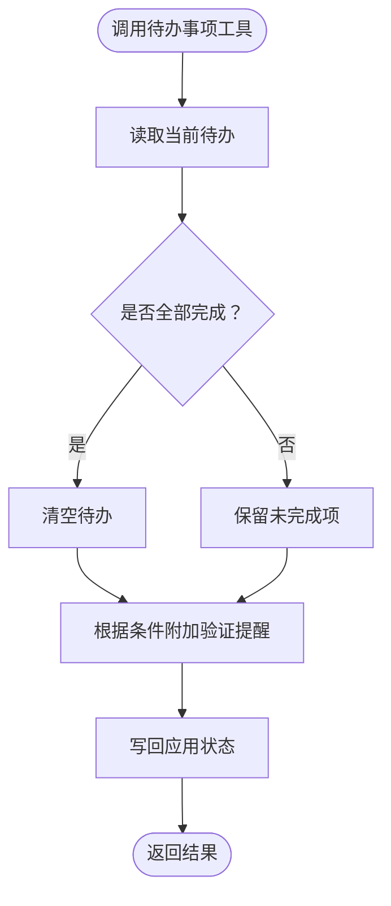
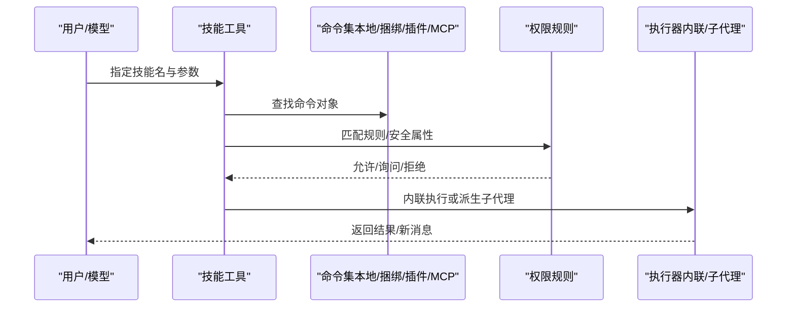
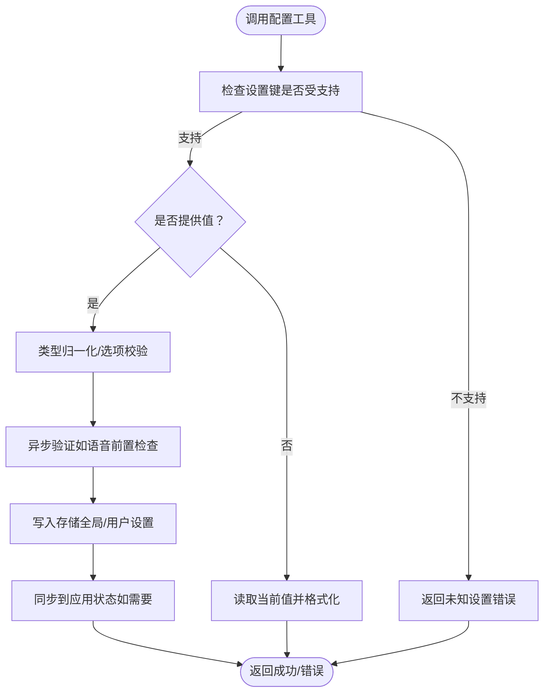
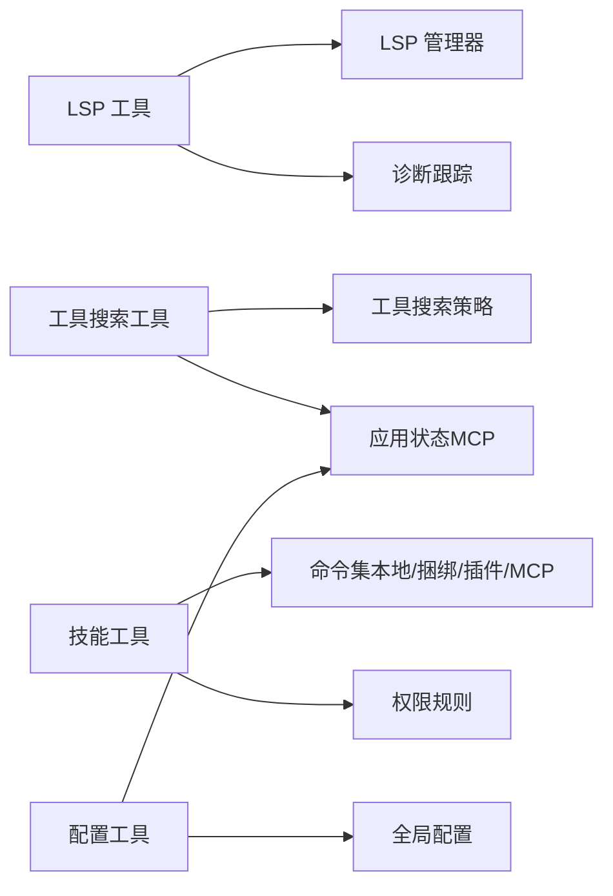

# 开发工具

<cite>
**本文引用的文件**
- [LSP 工具](file://src/tools/LSPTool/LSPTool.ts)
- [LSP 管理器](file://src/services/lsp/manager.ts)
- [工具搜索工具](file://src/tools/ToolSearchTool/ToolSearchTool.ts)
- [工具搜索工具（工具搜索）](file://src/utils/toolSearch.ts)
- [待办事项工具](file://src/tools/TodoWriteTool/TodoWriteTool.ts)
- [任务工具（任务列表）](file://src/utils/tasks.ts)
- [技能工具](file://src/tools/SkillTool/SkillTool.ts)
- [技能加载](file://src/skills/loadSkillsDir.ts)
- [配置工具](file://src/tools/ConfigTool/ConfigTool.ts)
- [全局配置](file://src/utils/config.ts)
- [MCP 服务器协调](file://src/cli/print.ts)
- [诊断跟踪](file://src/services/diagnosticTracking.ts)
- [附件生成](file://src/utils/attachments.ts)
</cite>

## 目录
1. [简介](#简介)
2. [项目结构](#项目结构)
3. [核心组件](#核心组件)
4. [架构总览](#架构总览)
5. [详细组件分析](#详细组件分析)
6. [依赖关系分析](#依赖关系分析)
7. [性能考量](#性能考量)
8. [故障排查指南](#故障排查指南)
9. [结论](#结论)
10. [附录](#附录)

## 简介
本技术文档面向开发工具的使用者与维护者，系统性阐述以下能力：语言服务器协议（LSP）工具、工具搜索工具、待办事项工具、技能工具与配置工具的功能特性与实现原理；解释 LSP 集成机制、符号导航、代码补全、错误诊断等能力；说明工具发现与选择机制、技能系统架构、配置管理策略；并提供可直接落地的使用示例，覆盖代码导航、工具组合使用、配置优化等典型开发场景。

## 项目结构
围绕“开发工具”的核心模块主要分布在如下目录：
- 工具层：LSP 工具、工具搜索工具、待办事项工具、技能工具、配置工具
- 服务层：LSP 管理器、诊断跟踪、MCP 服务器协调
- 工具搜索与技能系统：工具搜索工具与技能加载
- 配置与状态：全局配置、任务与待办状态

图表来源
- [LSP 工具:1-861](file://src/tools/LSPTool/LSPTool.ts#L1-L861)
- [LSP 管理器:1-290](file://src/services/lsp/manager.ts#L1-L290)
- [工具搜索工具:1-472](file://src/tools/ToolSearchTool/ToolSearchTool.ts#L1-L472)
- [工具搜索工具（工具搜索）:1-200](file://src/utils/toolSearch.ts#L1-L200)
- [待办事项工具:1-116](file://src/tools/TodoWriteTool/TodoWriteTool.ts#L1-L116)
- [任务工具（任务列表）:1-200](file://src/utils/tasks.ts#L1-L200)
- [技能工具:1-800](file://src/tools/SkillTool/SkillTool.ts#L1-L800)
- [技能加载:1-200](file://src/skills/loadSkillsDir.ts#L1-L200)
- [配置工具:1-468](file://src/tools/ConfigTool/ConfigTool.ts#L1-L468)
- [全局配置:1-200](file://src/utils/config.ts#L1-L200)
- [MCP 服务器协调:5446-5498](file://src/cli/print.ts#L5446-L5498)
- [诊断跟踪:81-132](file://src/services/diagnosticTracking.ts#L81-L132)

章节来源
- [LSP 工具:1-861](file://src/tools/LSPTool/LSPTool.ts#L1-L861)
- [LSP 管理器:1-290](file://src/services/lsp/manager.ts#L1-L290)
- [工具搜索工具:1-472](file://src/tools/ToolSearchTool/ToolSearchTool.ts#L1-L472)
- [工具搜索工具（工具搜索）:1-200](file://src/utils/toolSearch.ts#L1-L200)
- [待办事项工具:1-116](file://src/tools/TodoWriteTool/TodoWriteTool.ts#L1-L116)
- [任务工具（任务列表）:1-200](file://src/utils/tasks.ts#L1-L200)
- [技能工具:1-800](file://src/tools/SkillTool/SkillTool.ts#L1-L800)
- [技能加载:1-200](file://src/skills/loadSkillsDir.ts#L1-L200)
- [配置工具:1-468](file://src/tools/ConfigTool/ConfigTool.ts#L1-L468)
- [全局配置:1-200](file://src/utils/config.ts#L1-L200)
- [MCP 服务器协调:5446-5498](file://src/cli/print.ts#L5446-L5498)
- [诊断跟踪:81-132](file://src/services/diagnosticTracking.ts#L81-L132)

## 核心组件
- LSP 工具：封装 LSP 操作（定义跳转、引用查找、悬停信息、文档符号、工作区符号、调用层次等），负责文件打开、大小限制、结果过滤与格式化输出。
- 工具搜索工具：在延迟加载的工具集合中进行关键词检索与精确匹配，支持“select:”直接选择与“+要求词”筛选，返回工具引用块供模型调用。
- 待办事项工具：维护会话级待办清单，支持写入更新与验证提醒提示，兼容任务系统切换。
- 技能工具：按名称执行“斜杠命令式”技能，支持内联执行与子代理派生两种上下文模式，具备权限规则与遥测记录。
- 配置工具：统一读取/设置用户与全局配置项，支持选项校验、异步验证（如语音模式前置检查）、应用状态同步与遥测上报。

章节来源
- [LSP 工具:127-422](file://src/tools/LSPTool/LSPTool.ts#L127-L422)
- [工具搜索工具:304-471](file://src/tools/ToolSearchTool/ToolSearchTool.ts#L304-L471)
- [待办事项工具:31-115](file://src/tools/TodoWriteTool/TodoWriteTool.ts#L31-L115)
- [技能工具:331-800](file://src/tools/SkillTool/SkillTool.ts#L331-L800)
- [配置工具:67-434](file://src/tools/ConfigTool/ConfigTool.ts#L67-L434)

## 架构总览
LSP 工具通过 LSP 管理器与语言服务器交互；工具搜索工具基于工具搜索策略决定是否启用延迟加载与阈值；技能工具从本地/插件/MCP 加载命令集；配置工具与全局配置/应用状态联动；诊断跟踪与 LSP 管理器配合提供 IDE 诊断附件。

图表来源
- [工具搜索工具:328-434](file://src/tools/ToolSearchTool/ToolSearchTool.ts#L328-L434)
- [LSP 工具:224-414](file://src/tools/LSPTool/LSPTool.ts#L224-L414)
- [LSP 管理器:63-208](file://src/services/lsp/manager.ts#L63-L208)
- [诊断跟踪:81-132](file://src/services/diagnosticTracking.ts#L81-L132)
- [MCP 服务器协调:5446-5498](file://src/cli/print.ts#L5446-L5498)

## 详细组件分析

### LSP 工具与 LSP 集成机制
- 连接与初始化：LSP 管理器以单例方式初始化，支持等待初始化完成、检测连接状态、失败重试与重新初始化。
- 文件与大小限制：在请求前确保文件已打开，对超大文件（默认 10MB）进行拒绝处理。
- LSP 方法映射：将工具输入映射到标准 LSP 方法（如 textDocument/definition、textDocument/references、textDocument/hover、textDocument/documentSymbol、workspace/symbol、textDocument/implementation、textDocument/prepareCallHierarchy、incomingCalls/outgoingCalls）。
- Git 忽略过滤：对位置类结果（定义/引用/实现/工作区符号）过滤被 .gitignore 掉的文件，避免噪声。
- 结果格式化：根据操作类型格式化输出，统计结果数量与文件数量，便于后续展示与分析。
- 错误处理：捕获异常并记录日志，返回可读错误信息。

图表来源
- [LSP 工具:224-414](file://src/tools/LSPTool/LSPTool.ts#L224-L414)
- [LSP 管理器:145-208](file://src/services/lsp/manager.ts#L145-L208)

章节来源
- [LSP 工具:127-422](file://src/tools/LSPTool/LSPTool.ts#L127-L422)
- [LSP 管理器:63-208](file://src/services/lsp/manager.ts#L63-L208)

### 工具搜索工具与工具发现/选择机制
- 模式与阈值：支持三种模式（tst/tst-auto/standard），由环境变量与上下文窗口占用比例自动决定是否启用延迟加载。
- 关键词搜索：对工具名与描述进行分词与评分，支持“+要求词”精确匹配，区分 MCP 与常规工具命名。
- 直接选择：支持 select: 前缀直接选取一个或多个工具，若已在已加载集合中则视为“无副作用”选择。
- 结果输出：返回匹配工具名列表，并在无匹配时提示仍在连接中的 MCP 服务器。

图表来源
- [工具搜索工具:328-434](file://src/tools/ToolSearchTool/ToolSearchTool.ts#L328-L434)
- [工具搜索工具（工具搜索）:172-198](file://src/utils/toolSearch.ts#L172-L198)

章节来源
- [工具搜索工具:304-471](file://src/tools/ToolSearchTool/ToolSearchTool.ts#L304-L471)
- [工具搜索工具（工具搜索）:1-200](file://src/utils/toolSearch.ts#L1-L200)

### 待办事项工具与任务系统
- 待办写入：接收新的待办列表，若全部完成则清空，否则保留未完成项；在特定条件下附加验证提醒。
- 任务系统：当任务系统启用时，待办写入工具被禁用；任务系统提供更高阶的任务生命周期管理（创建、更新、阻塞关系等）。

图表来源
- [待办事项工具:65-103](file://src/tools/TodoWriteTool/TodoWriteTool.ts#L65-L103)
- [任务工具（任务列表）:133-139](file://src/utils/tasks.ts#L133-L139)

章节来源
- [待办事项工具:31-115](file://src/tools/TodoWriteTool/TodoWriteTool.ts#L31-L115)
- [任务工具（任务列表）:133-139](file://src/utils/tasks.ts#L133-L139)

### 技能工具与技能系统架构
- 命令解析：从本地/捆绑/插件/MCP 获取命令集，支持远程规范技能（实验性）。
- 权限控制：基于规则匹配（精确/前缀）与安全属性白名单，支持自动允许与建议添加规则。
- 执行模式：内联执行（直接扩展消息）与子代理派生（隔离上下文与预算）两种模式。
- 遥测与追踪：记录技能调用、来源、深度、插件信息等，支持发现标记与插件市场信息。

图表来源
- [技能工具:580-800](file://src/tools/SkillTool/SkillTool.ts#L580-L800)
- [技能加载:1-200](file://src/skills/loadSkillsDir.ts#L1-L200)

章节来源
- [技能工具:331-800](file://src/tools/SkillTool/SkillTool.ts#L331-L800)
- [技能加载:1-200](file://src/skills/loadSkillsDir.ts#L1-L200)

### 配置工具与配置管理策略
- 设置项：统一声明支持的设置键、路径、类型、选项与格式化回调；支持运行时特性门控（如语音模式）。
- 读取与设置：GET 直接读取，SET 支持布尔值归一化、选项校验、异步验证（如语音前置检查）、写入存储与应用状态同步。
- 安全与权限：读取默认放行，设置需权限决策；对敏感项（如远程控制启动）提供“默认”语义以恢复平台默认。
- 遥测与变更：记录变更事件，用于分析与审计。

图表来源
- [配置工具:111-411](file://src/tools/ConfigTool/ConfigTool.ts#L111-L411)
- [全局配置:1-200](file://src/utils/config.ts#L1-L200)

章节来源
- [配置工具:67-434](file://src/tools/ConfigTool/ConfigTool.ts#L67-L434)
- [全局配置:1-200](file://src/utils/config.ts#L1-L200)

## 依赖关系分析
- LSP 工具依赖 LSP 管理器与 LSP 服务器；与诊断跟踪协作提供 IDE 诊断附件。
- 工具搜索工具依赖工具搜索策略与应用状态（MCP 连接状态）。
- 技能工具依赖命令集（本地/捆绑/插件/MCP），并与权限系统、遥测与插件生态集成。
- 配置工具依赖全局配置与应用状态，与语音/桥接等特性门控耦合。

图表来源
- [LSP 工具:1-861](file://src/tools/LSPTool/LSPTool.ts#L1-L861)
- [LSP 管理器:1-290](file://src/services/lsp/manager.ts#L1-L290)
- [诊断跟踪:81-132](file://src/services/diagnosticTracking.ts#L81-L132)
- [工具搜索工具:1-472](file://src/tools/ToolSearchTool/ToolSearchTool.ts#L1-L472)
- [工具搜索工具（工具搜索）:1-200](file://src/utils/toolSearch.ts#L1-L200)
- [技能工具:1-800](file://src/tools/SkillTool/SkillTool.ts#L1-L800)
- [技能加载:1-200](file://src/skills/loadSkillsDir.ts#L1-L200)
- [配置工具:1-468](file://src/tools/ConfigTool/ConfigTool.ts#L1-L468)
- [全局配置:1-200](file://src/utils/config.ts#L1-L200)

章节来源
- [LSP 工具:1-861](file://src/tools/LSPTool/LSPTool.ts#L1-L861)
- [LSP 管理器:1-290](file://src/services/lsp/manager.ts#L1-L290)
- [工具搜索工具:1-472](file://src/tools/ToolSearchTool/ToolSearchTool.ts#L1-L472)
- [工具搜索工具（工具搜索）:1-200](file://src/utils/toolSearch.ts#L1-L200)
- [技能工具:1-800](file://src/tools/SkillTool/SkillTool.ts#L1-L800)
- [技能加载:1-200](file://src/skills/loadSkillsDir.ts#L1-L200)
- [配置工具:1-468](file://src/tools/ConfigTool/ConfigTool.ts#L1-L468)
- [全局配置:1-200](file://src/utils/config.ts#L1-L200)

## 性能考量
- LSP 大文件限制：默认 10MB，避免过大的文本分析导致内存与网络压力。
- 调用层次二次请求：incomingCalls/outgoingCalls 需先 prepareCallHierarchy，注意往返延迟。
- 工具搜索评分缓存：对工具描述采用记忆化缓存，当延迟工具集合变化时自动失效。
- MCP 服务器批量连接与去重：动态/SDK MCP 服务器在连接时进行去重与合并，减少重复工具与命令。
- 诊断附件清理：传递后清除已交付的诊断集合，防止内存泄漏。

章节来源
- [LSP 工具:265-278](file://src/tools/LSPTool/LSPTool.ts#L265-L278)
- [工具搜索工具:66-105](file://src/tools/ToolSearchTool/ToolSearchTool.ts#L66-L105)
- [MCP 服务器协调:5446-5498](file://src/cli/print.ts#L5446-L5498)
- [附件生成:2913-2920](file://src/utils/attachments.ts#L2913-L2920)

## 故障排查指南
- LSP 无服务器可用：检查 LSP 初始化状态与连接情况；确认文件已打开且未超过大小限制。
- 工具搜索无结果：确认工具搜索模式与阈值；查看是否存在仍处于“待连接”的 MCP 服务器。
- 技能执行被拒：检查权限规则（精确/前缀）与安全属性；根据建议添加规则或提升权限。
- 配置设置失败：核对设置键是否受支持、值是否符合选项与类型；关注异步验证（如语音前置检查）返回的错误信息。
- 诊断附件缺失：确认诊断跟踪已注册 LSP 通知处理器；检查 bash 工具可用性与诊断集合清理逻辑。

章节来源
- [LSP 工具:243-297](file://src/tools/LSPTool/LSPTool.ts#L243-L297)
- [工具搜索工具:334-434](file://src/tools/ToolSearchTool/ToolSearchTool.ts#L334-L434)
- [技能工具:432-578](file://src/tools/SkillTool/SkillTool.ts#L432-L578)
- [配置工具:216-308](file://src/tools/ConfigTool/ConfigTool.ts#L216-L308)
- [诊断跟踪:81-132](file://src/services/diagnosticTracking.ts#L81-L132)

## 结论
该开发工具体系以“延迟加载 + 智能搜索 + 可插拔技能 + 统一配置”为核心设计，既保证了在复杂项目中的可扩展性，又提供了强大的代码智能与工程化能力。LSP 工具与诊断跟踪保障了编辑体验与问题定位；工具搜索工具与技能工具提升了工具发现与复用效率；配置工具则提供了细粒度的运行时治理。通过合理的组合使用，开发者可在不同阶段高效完成代码导航、问题修复、流程自动化与团队协作。

## 附录
- 使用示例（概念性说明，不包含具体代码片段）
  - 代码导航：在 LSP 工具中选择“定义跳转/引用查找/悬停信息”，结合“工作区符号”快速定位目标。
  - 工具组合：先用工具搜索工具检索“mcp__server__action”或关键词，再通过 select: 直接调用；若无匹配，留意仍在连接中的 MCP 服务器。
  - 技能执行：使用技能工具指定技能名与参数，内联执行适合轻量任务，子代理执行适合复杂流程与独立预算。
  - 配置优化：通过配置工具读取/设置主题、模型、权限模式等；对语音等特性进行前置检查与授权。