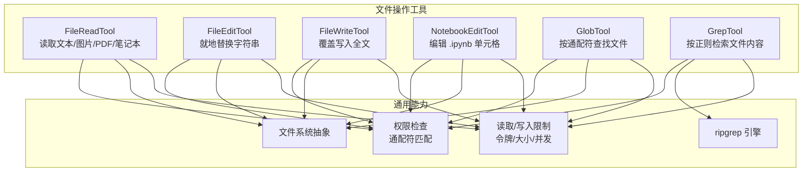
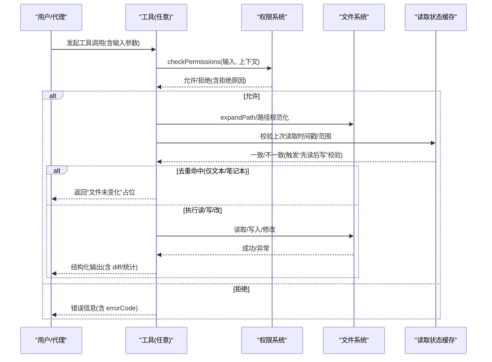
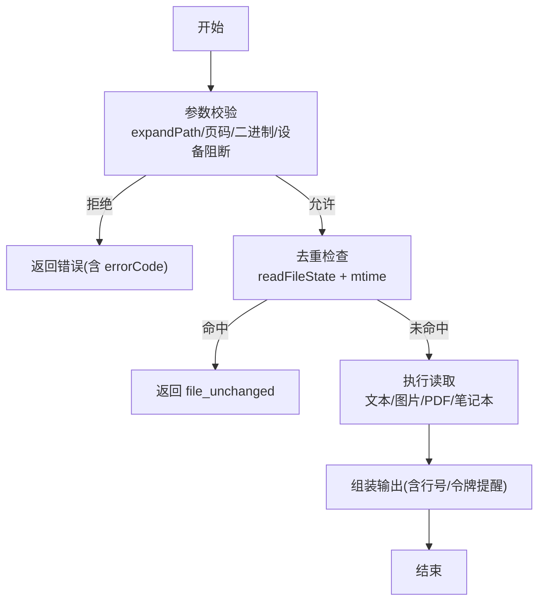
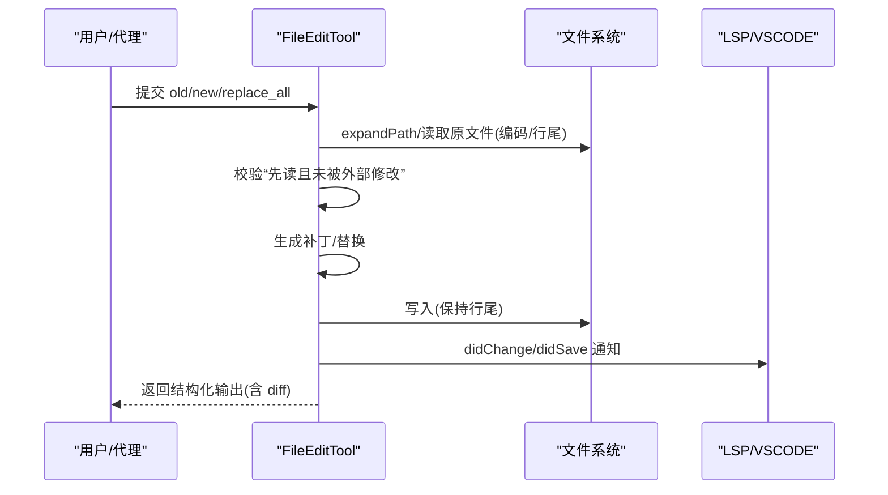
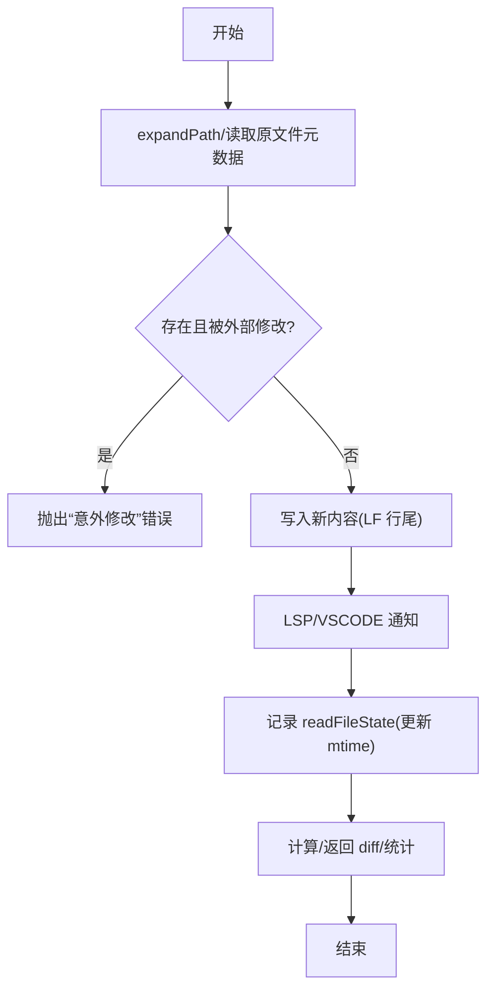
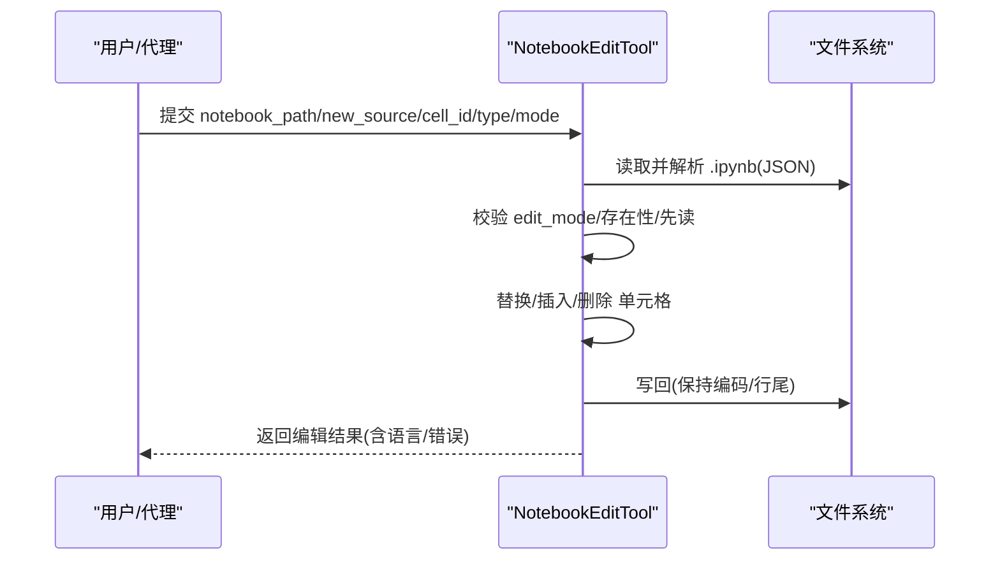
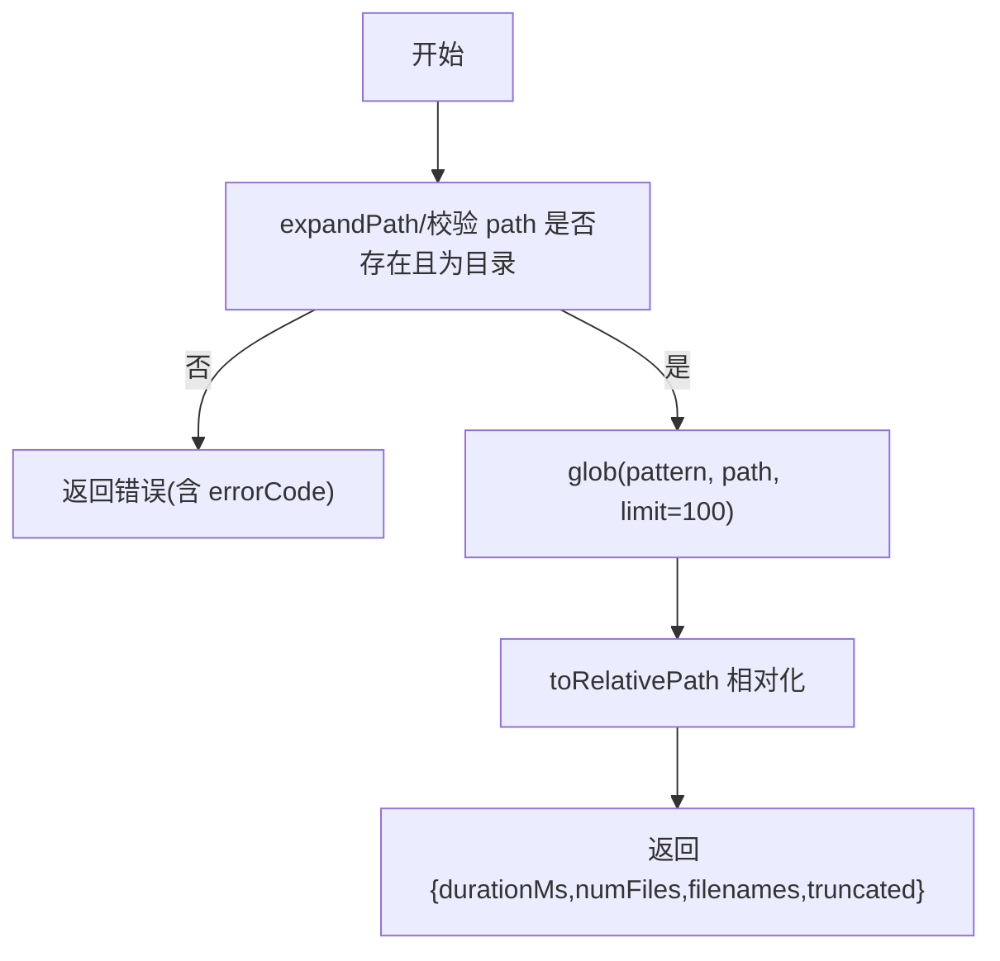
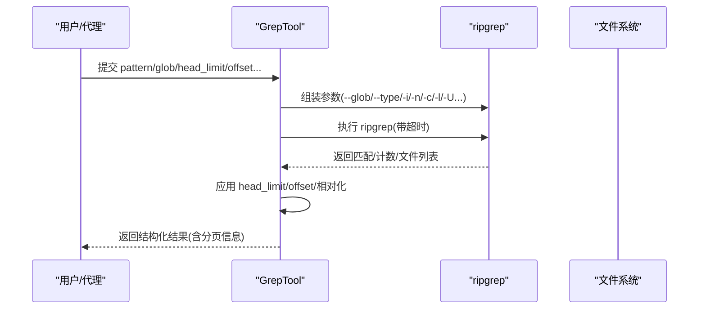
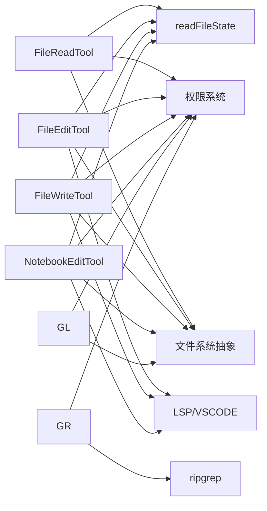

# 文件操作工具

<cite>
**本文引用的文件**
- [src/tools/FileReadTool/FileReadTool.ts](file://src/tools/FileReadTool/FileReadTool.ts)
- [src/tools/FileEditTool/FileEditTool.ts](file://src/tools/FileEditTool/FileEditTool.ts)
- [src/tools/FileWriteTool/FileWriteTool.ts](file://src/tools/FileWriteTool/FileWriteTool.ts)
- [src/tools/NotebookEditTool/NotebookEditTool.ts](file://src/tools/NotebookEditTool/NotebookEditTool.ts)
- [src/tools/GlobTool/GlobTool.ts](file://src/tools/GlobTool/GlobTool.ts)
- [src/tools/GrepTool/GrepTool.ts](file://src/tools/GrepTool/GrepTool.ts)
</cite>

## 目录
1. [简介](#简介)
2. [项目结构](#项目结构)
3. [核心组件](#核心组件)
4. [架构总览](#架构总览)
5. [详细组件分析](#详细组件分析)
6. [依赖分析](#依赖分析)
7. [性能考虑](#性能考虑)
8. [故障排查指南](#故障排查指南)
9. [结论](#结论)
10. [附录](#附录)

## 简介
本文件面向“文件操作工具”子系统，系统性梳理以下工具的实现原理、输入输出、权限控制、安全限制与错误处理策略，并给出典型使用场景与最佳实践：文件读取（FileRead）、文件编辑（FileEdit）、文件写入（FileWrite）、笔记本编辑（NotebookEdit）、文件搜索（Glob）与内容搜索（Grep）。文档同时阐明各工具之间的协作关系与调用顺序，帮助开发者与使用者在保证安全与性能的前提下高效完成批量文件操作、正则表达式搜索与内容修改。

## 项目结构
文件操作工具均位于 src/tools 下，按功能模块拆分，每个工具包含：
- 工具定义与调用逻辑（主文件）
- 输入/输出 Schema（类型约束）
- UI 渲染与摘要生成（用于对话与结果展示）
- 权限校验与规则匹配（基于通配符与路径规则）
- 安全与限制（UNC 路径跳过、二进制/设备文件阻断、大小/令牌限制）

图表来源
- [src/tools/FileReadTool/FileReadTool.ts:337-718](file://src/tools/FileReadTool/FileReadTool.ts#L337-L718)
- [src/tools/FileEditTool/FileEditTool.ts:86-595](file://src/tools/FileEditTool/FileEditTool.ts#L86-L595)
- [src/tools/FileWriteTool/FileWriteTool.ts:94-434](file://src/tools/FileWriteTool/FileWriteTool.ts#L94-L434)
- [src/tools/NotebookEditTool/NotebookEditTool.ts:90-490](file://src/tools/NotebookEditTool/NotebookEditTool.ts#L90-L490)
- [src/tools/GlobTool/GlobTool.ts:57-198](file://src/tools/GlobTool/GlobTool.ts#L57-L198)
- [src/tools/GrepTool/GrepTool.ts:160-577](file://src/tools/GrepTool/GrepTool.ts#L160-L577)

章节来源
- [src/tools/FileReadTool/FileReadTool.ts:1-1184](file://src/tools/FileReadTool/FileReadTool.ts#L1-L1184)
- [src/tools/FileEditTool/FileEditTool.ts:1-626](file://src/tools/FileEditTool/FileEditTool.ts#L1-L626)
- [src/tools/FileWriteTool/FileWriteTool.ts:1-435](file://src/tools/FileWriteTool/FileWriteTool.ts#L1-L435)
- [src/tools/NotebookEditTool/NotebookEditTool.ts:1-491](file://src/tools/NotebookEditTool/NotebookEditTool.ts#L1-L491)
- [src/tools/GlobTool/GlobTool.ts:1-199](file://src/tools/GlobTool/GlobTool.ts#L1-L199)
- [src/tools/GrepTool/GrepTool.ts:1-578](file://src/tools/GrepTool/GrepTool.ts#L1-L578)

## 核心组件
- FileReadTool：支持文本、图片、PDF、Jupyter 笔记本等多类型读取；内置令牌/大小限制、偏移范围读取、设备文件阻断、macOS 截图兼容路径解析、读取去重与会话文件分析标记。
- FileEditTool：在已读取基础上进行就地字符串替换，支持 replace_all、引号风格保留、变更前后对比、LSP/VSCODE 通知、历史备份与 Git Diff 计算。
- FileWriteTool：覆盖写入全文，严格要求先 Read 后 Write，避免并发写入冲突；保留行尾风格、统计增删行数、LSP/VSCODE 通知与 Git Diff。
- NotebookEditTool：专门编辑 .ipynb 单元格，支持 replace/insert/delete 模式，自动处理执行计数与输出清空，支持 cell_id 或 cell-N 索引定位。
- GlobTool：基于通配符模式查找文件，支持目录合法性校验与权限过滤，结果相对路径化以节省上下文。
- GrepTool：基于 ripgrep 的正则检索，支持 content/files_with_matches/count 三种输出模式、上下文行、大小写忽略、类型过滤、head_limit/offset 分页、忽略模式与 VCS 排除。

章节来源
- [src/tools/FileReadTool/FileReadTool.ts:337-718](file://src/tools/FileReadTool/FileReadTool.ts#L337-L718)
- [src/tools/FileEditTool/FileEditTool.ts:86-595](file://src/tools/FileEditTool/FileEditTool.ts#L86-L595)
- [src/tools/FileWriteTool/FileWriteTool.ts:94-434](file://src/tools/FileWriteTool/FileWriteTool.ts#L94-L434)
- [src/tools/NotebookEditTool/NotebookEditTool.ts:90-490](file://src/tools/NotebookEditTool/NotebookEditTool.ts#L90-L490)
- [src/tools/GlobTool/GlobTool.ts:57-198](file://src/tools/GlobTool/GlobTool.ts#L57-L198)
- [src/tools/GrepTool/GrepTool.ts:160-577](file://src/tools/GrepTool/GrepTool.ts#L160-L577)

## 架构总览
工具层通过统一的 buildTool 构建，共享以下通用能力：
- 权限系统：checkReadPermissionForTool/checkWritePermissionForTool + 通配符规则匹配
- 文件系统抽象：getFsImplementation 统一读写接口
- 读取状态缓存：readFileState 用于去重、并发一致性与“先读后写”校验
- UI 与摘要：renderToolUseMessage/renderToolResultMessage/UI 摘要
- 安全与限制：UNC 路径跳过、设备文件阻断、二进制扩展过滤、令牌/大小上限、并发安全标记

图表来源
- [src/tools/FileReadTool/FileReadTool.ts:398-495](file://src/tools/FileReadTool/FileReadTool.ts#L398-L495)
- [src/tools/FileEditTool/FileEditTool.ts:125-362](file://src/tools/FileEditTool/FileEditTool.ts#L125-L362)
- [src/tools/FileWriteTool/FileWriteTool.ts:135-222](file://src/tools/FileWriteTool/FileWriteTool.ts#L135-L222)
- [src/tools/NotebookEditTool/NotebookEditTool.ts:125-238](file://src/tools/NotebookEditTool/NotebookEditTool.ts#L125-L238)
- [src/tools/GlobTool/GlobTool.ts:135-134](file://src/tools/GlobTool/GlobTool.ts#L135-L134)
- [src/tools/GrepTool/GrepTool.ts:233-240](file://src/tools/GrepTool/GrepTool.ts#L233-L240)

## 详细组件分析

### FileReadTool（文件读取）
- 输入参数
  - file_path：绝对路径
  - offset/limit：行级偏移与长度（大文件分段读取）
  - pages：PDF 页码范围（如 "1-5,10"）
- 输出格式
  - 文本：type=text，包含 filePath/content/numLines/startLine/totalLines
  - 图片：type=image，base64 + MIME 类型 + 原始尺寸 + 可选维度
  - 笔记本：type=notebook，cells 数组
  - PDF：type=pdf，base64 + 原始大小
  - PDF 分页：type=parts，提取页数、输出目录
  - 未变化：type=file_unchanged，用于去重
- 权限与安全
  - 读取前进行 deny 规则匹配、UNC 路径跳过、二进制扩展过滤（PDF/图片/SVG 除外）、设备文件阻断
  - macOS 截图兼容：尝试薄空格与常规空格变体路径
- 错误处理
  - 文件不存在：建议相似文件或当前工作目录下的可能路径
  - 令牌超限：抛出 MaxFileReadTokenExceededError
  - 读取去重：若同一范围且 mtime 不变，返回 file_unchanged 占位
- 性能特性
  - 读取限制：默认最大字节/令牌可被覆盖
  - 行号前缀、安全提醒、内存文件新鲜度提示
  - 技能发现与条件技能激活（非简单模式）

图表来源
- [src/tools/FileReadTool/FileReadTool.ts:418-495](file://src/tools/FileReadTool/FileReadTool.ts#L418-L495)
- [src/tools/FileReadTool/FileReadTool.ts:594-651](file://src/tools/FileReadTool/FileReadTool.ts#L594-L651)
- [src/tools/FileReadTool/FileReadTool.ts:755-772](file://src/tools/FileReadTool/FileReadTool.ts#L755-L772)

章节来源
- [src/tools/FileReadTool/FileReadTool.ts:227-495](file://src/tools/FileReadTool/FileReadTool.ts#L227-L495)
- [src/tools/FileReadTool/FileReadTool.ts:594-718](file://src/tools/FileReadTool/FileReadTool.ts#L594-L718)

### FileEditTool（文件编辑）
- 输入参数
  - file_path：绝对路径
  - old_string/new_string：替换内容
  - replace_all：是否全部替换
- 输出格式
  - 包含 filePath/oldString/newString/originalFile/structuredPatch/userModified/replaceAll/gitDiff
- 权限与安全
  - 先读校验：必须已通过 FileReadTool 读取且未被外部修改
  - UNC 路径跳过、过大文件限制（1GiB）、.ipynb 交由 NotebookEditTool 处理
  - 团队记忆敏感内容检测
- 错误处理
  - 无差异替换、找不到旧串、多处匹配但未开启 replace_all、路径不存在/相似路径建议
- 性能特性
  - 引号风格保留、变更前后对比、LSP/VSCODE 通知、历史备份、Git Diff 计算

图表来源
- [src/tools/FileEditTool/FileEditTool.ts:137-362](file://src/tools/FileEditTool/FileEditTool.ts#L137-L362)
- [src/tools/FileEditTool/FileEditTool.ts:387-595](file://src/tools/FileEditTool/FileEditTool.ts#L387-L595)

章节来源
- [src/tools/FileEditTool/FileEditTool.ts:137-362](file://src/tools/FileEditTool/FileEditTool.ts#L137-L362)
- [src/tools/FileEditTool/FileEditTool.ts:387-595](file://src/tools/FileEditTool/FileEditTool.ts#L387-L595)

### FileWriteTool（文件写入）
- 输入参数
  - file_path：绝对路径
  - content：完整新内容
- 输出格式
  - type=create/update + filePath/content/structuredPatch/originalFile/gitDiff
- 权限与安全
  - 先读校验：必须已通过 FileReadTool 读取且未被外部修改
  - UNC 路径跳过、团队记忆敏感内容检测
- 错误处理
  - 未先读、被外部修改、路径不存在/相似路径建议
- 性能特性
  - 显式行尾 LF 写入、LSP/VSCODE 通知、历史备份、Git Diff 计算

图表来源
- [src/tools/FileWriteTool/FileWriteTool.ts:223-434](file://src/tools/FileWriteTool/FileWriteTool.ts#L223-L434)

章节来源
- [src/tools/FileWriteTool/FileWriteTool.ts:153-222](file://src/tools/FileWriteTool/FileWriteTool.ts#L153-L222)
- [src/tools/FileWriteTool/FileWriteTool.ts:223-434](file://src/tools/FileWriteTool/FileWriteTool.ts#L223-L434)

### NotebookEditTool（笔记本编辑）
- 输入参数
  - notebook_path：绝对 .ipynb 路径
  - cell_id：目标单元格 ID 或 cell-N 索引（插入时可省略）
  - new_source：新源代码/Markdown
  - cell_type：code/markdown（插入时必填）
  - edit_mode：replace/insert/delete（默认 replace）
- 输出格式
  - new_source/cell_id/cell_type/language/edit_mode/error + 原始/更新内容
- 权限与安全
  - 仅 .ipynb 文件；先读校验；UNC 路径跳过
- 错误处理
  - 非 .ipynb、非法 edit_mode、未指定 cell_id（非插入）、cell 不存在、JSON 解析失败
- 性能特性
  - 自动重置 code 单元格执行计数与输出；随机生成新 cell_id（nbformat>=4.5）

图表来源
- [src/tools/NotebookEditTool/NotebookEditTool.ts:176-294](file://src/tools/NotebookEditTool/NotebookEditTool.ts#L176-L294)
- [src/tools/NotebookEditTool/NotebookEditTool.ts:295-490](file://src/tools/NotebookEditTool/NotebookEditTool.ts#L295-L490)

章节来源
- [src/tools/NotebookEditTool/NotebookEditTool.ts:176-294](file://src/tools/NotebookEditTool/NotebookEditTool.ts#L176-L294)
- [src/tools/NotebookEditTool/NotebookEditTool.ts:295-490](file://src/tools/NotebookEditTool/NotebookEditTool.ts#L295-L490)

### GlobTool（文件搜索）
- 输入参数
  - pattern：glob 模式
  - path：可选目录（默认当前工作目录）
- 输出格式
  - durationMs/numFiles/filenames/truncated
- 权限与安全
  - 目录存在性校验（ENOENT 提示相似路径），UNC 跳过
- 错误处理
  - 非目录、目录不存在（含 CWD 建议）
- 性能特性
  - 默认最多 100 个结果；结果相对路径化

图表来源
- [src/tools/GlobTool/GlobTool.ts:94-134](file://src/tools/GlobTool/GlobTool.ts#L94-L134)
- [src/tools/GlobTool/GlobTool.ts:154-176](file://src/tools/GlobTool/GlobTool.ts#L154-L176)

章节来源
- [src/tools/GlobTool/GlobTool.ts:26-56](file://src/tools/GlobTool/GlobTool.ts#L26-L56)
- [src/tools/GlobTool/GlobTool.ts:94-134](file://src/tools/GlobTool/GlobTool.ts#L94-L134)
- [src/tools/GlobTool/GlobTool.ts:154-176](file://src/tools/GlobTool/GlobTool.ts#L154-L176)

### GrepTool（内容搜索）
- 输入参数
  - pattern：正则表达式
  - path：可选搜索根目录
  - glob：ripgrep --glob 过滤
  - output_mode：content/files_with_matches/count
  - 上下文：-B/-A/-C/context
  - -n：显示行号
  - -i：大小写忽略
  - type：文件类型过滤
  - head_limit/offset：分页与偏移
  - multiline：多行模式
- 输出格式
  - content 模式：content + numLines + appliedLimit/appliedOffset
  - count 模式：content(每文件计数) + numFiles/numMatches
  - files_with_matches：filenames + numFiles + appliedLimit/appliedOffset
- 权限与安全
  - UNC 跳过；忽略模式与 VCS 目录排除；WSL 超时由 ripgrep 处理
- 错误处理
  - 路径不存在（含 CWD 建议）
- 性能特性
  - 默认 head_limit=250；支持 -C/context 与 -n；结果相对路径化

图表来源
- [src/tools/GrepTool/GrepTool.ts:310-577](file://src/tools/GrepTool/GrepTool.ts#L310-L577)

章节来源
- [src/tools/GrepTool/GrepTool.ts:33-91](file://src/tools/GrepTool/GrepTool.ts#L33-L91)
- [src/tools/GrepTool/GrepTool.ts:310-577](file://src/tools/GrepTool/GrepTool.ts#L310-L577)

## 依赖分析
- 工具间依赖
  - FileEditTool/FileWriteTool/NotebookEditTool 均依赖 readFileState 进行“先读后写”一致性校验
  - FileReadTool 与 FileEditTool/FileWriteTool/NotebookEditTool 共享 expandPath 规范化与路径白名单/黑名单规则
  - GrepTool/GlobTool 使用 ripgrep 与通配符引擎，受 ignore patterns 与 VCS 排除影响
- 外部依赖
  - ripgrep：高性能正则检索
  - 文件系统抽象：统一 mkdir/stat/readFile/writeTextContent
  - LSP/VSCODE：didChange/didSave 与 diff 通知
  - 技能系统：根据文件路径动态加载/激活技能目录

图表来源
- [src/tools/FileReadTool/FileReadTool.ts:398-495](file://src/tools/FileReadTool/FileReadTool.ts#L398-L495)
- [src/tools/FileEditTool/FileEditTool.ts:125-362](file://src/tools/FileEditTool/FileEditTool.ts#L125-L362)
- [src/tools/FileWriteTool/FileWriteTool.ts:135-222](file://src/tools/FileWriteTool/FileWriteTool.ts#L135-L222)
- [src/tools/NotebookEditTool/NotebookEditTool.ts:125-238](file://src/tools/NotebookEditTool/NotebookEditTool.ts#L125-L238)
- [src/tools/GlobTool/GlobTool.ts:135-134](file://src/tools/GlobTool/GlobTool.ts#L135-L134)
- [src/tools/GrepTool/GrepTool.ts:233-240](file://src/tools/GrepTool/GrepTool.ts#L233-L240)

章节来源
- [src/tools/FileReadTool/FileReadTool.ts:398-495](file://src/tools/FileReadTool/FileReadTool.ts#L398-L495)
- [src/tools/FileEditTool/FileEditTool.ts:125-362](file://src/tools/FileEditTool/FileEditTool.ts#L125-L362)
- [src/tools/FileWriteTool/FileWriteTool.ts:135-222](file://src/tools/FileWriteTool/FileWriteTool.ts#L135-L222)
- [src/tools/NotebookEditTool/NotebookEditTool.ts:125-238](file://src/tools/NotebookEditTool/NotebookEditTool.ts#L125-L238)
- [src/tools/GlobTool/GlobTool.ts:135-134](file://src/tools/GlobTool/GlobTool.ts#L135-L134)
- [src/tools/GrepTool/GrepTool.ts:233-240](file://src/tools/GrepTool/GrepTool.ts#L233-L240)

## 性能考虑
- 令牌与大小限制：FileReadTool 对文本内容进行粗估与精确计数，超过阈值抛错；GrepTool 限制默认 head_limit=250，避免上下文膨胀。
- 去重与缓存：FileReadTool 在同一范围且 mtime 不变时返回 file_unchanged 占位，减少重复传输。
- 并发与原子性：FileEditTool/FileWriteTool 在写入前后严格校验 mtime，确保“先读后写”的原子性；必要时进行历史备份。
- I/O 优化：统一使用文件系统抽象与相对路径化，减少 stat 次数与上下文开销；ripgrep 参数优化（--max-columns、--hidden、VCS 排除）。
- WSL 性能：GrepTool 明确 WSL 读取性能较低，超时由 ripgrep 处理，避免中断代理循环。

## 故障排查指南
- “文件不存在/路径错误”
  - FileReadTool/GlobTool/GrepTool 在路径不存在时提供相似文件建议与 CWD 提示
  - FileEditTool/FileWriteTool/NotebookEditTool 在文件不存在时提示相似文件或当前工作目录建议
- “意外修改/需要先读”
  - FileEditTool/FileWriteTool/NotebookEditTool 若检测到外部修改或未先读，会明确提示“请先读取”
- “二进制/设备文件无法读取”
  - FileReadTool 对二进制扩展进行过滤，设备文件阻断（如 /dev/zero、/proc/self/fd/0 等）
- “UNC 路径泄漏风险”
  - 多个工具在 UNC 路径上跳过文件系统操作，防止 NTLM 凭证泄露
- “权限拒绝”
  - 检查 deny 规则与通配符匹配；必要时调整工具权限配置
- “正则/通配符无效”
  - GrepTool/GlobTool 对非法模式给出明确错误码与提示；注意 pattern 以负号开头需加 -e

章节来源
- [src/tools/FileReadTool/FileReadTool.ts:418-495](file://src/tools/FileReadTool/FileReadTool.ts#L418-L495)
- [src/tools/FileEditTool/FileEditTool.ts:275-362](file://src/tools/FileEditTool/FileEditTool.ts#L275-L362)
- [src/tools/FileWriteTool/FileWriteTool.ts:198-222](file://src/tools/FileWriteTool/FileWriteTool.ts#L198-L222)
- [src/tools/NotebookEditTool/NotebookEditTool.ts:218-294](file://src/tools/NotebookEditTool/NotebookEditTool.ts#L218-L294)
- [src/tools/GlobTool/GlobTool.ts:94-134](file://src/tools/GlobTool/GlobTool.ts#L94-L134)
- [src/tools/GrepTool/GrepTool.ts:201-240](file://src/tools/GrepTool/GrepTool.ts#L201-L240)

## 结论
文件操作工具通过统一的权限体系、严格的“先读后写”一致性校验与安全限制，实现了在复杂工程中的稳健与高效。结合去重、相对路径化、ripgrep 优化与 LSP/VSCODE 通知，工具链既能满足探索性搜索与批量修改需求，又能保障安全性与可观测性。建议在大规模批量操作中遵循“先 Glob/Grep → FileRead → FileEdit/FileWrite/NotebookEdit”的流程，并合理设置 head_limit/offset 与 pages/offset，以平衡性能与准确性。

## 附录
- 最佳实践
  - 批量文件操作：先用 Glob/Grep 精确定位，再 FileRead 获取上下文，最后 FileEdit/FileWrite/NotebookEdit 修改
  - 正则表达式搜索：优先使用 type/glob 过滤，配合 -i/-n/-C 上下文，head_limit 控制结果规模
  - 大文件处理：使用 FileRead 的 offset/limit 或 pages 参数分段读取
  - 安全与合规：启用权限规则与 deny 列表，避免敏感目录与二进制文件；团队记忆文件禁止写入敏感内容
  - 并发与一致性：避免并发写入同一文件；必要时开启历史备份与 Git Diff 记录