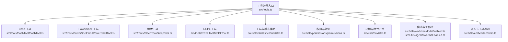
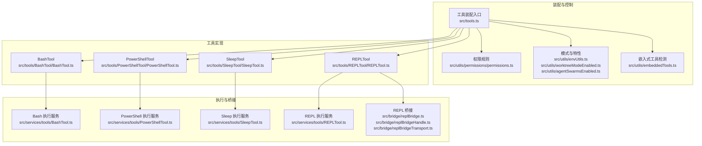
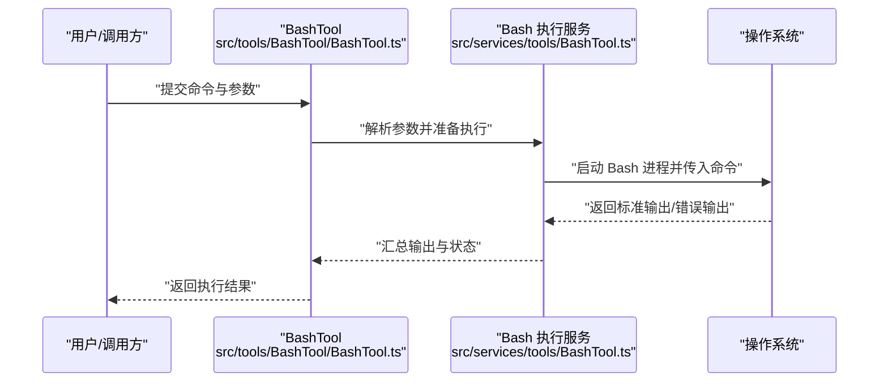
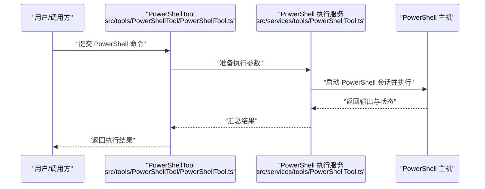
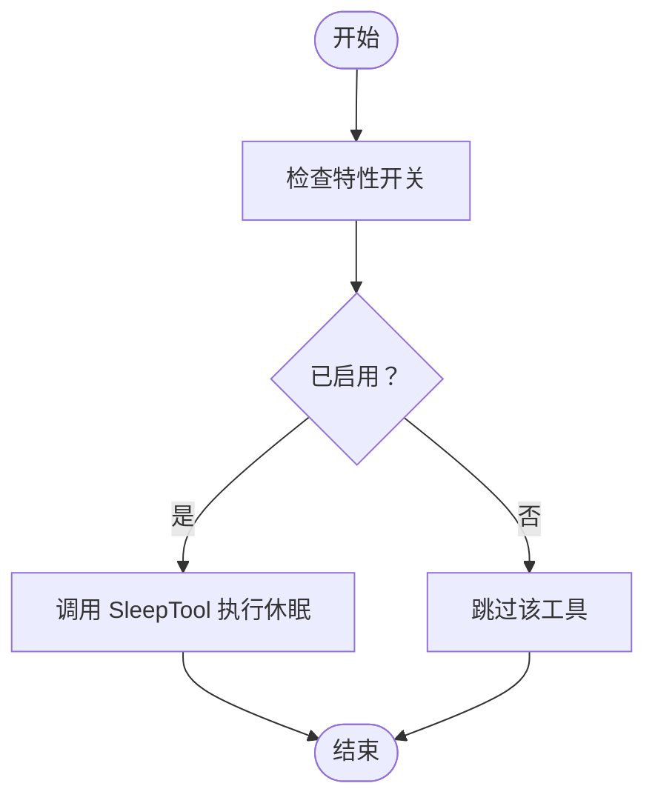
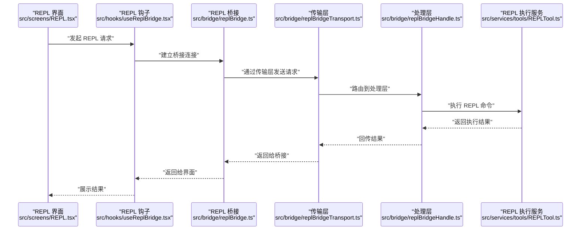
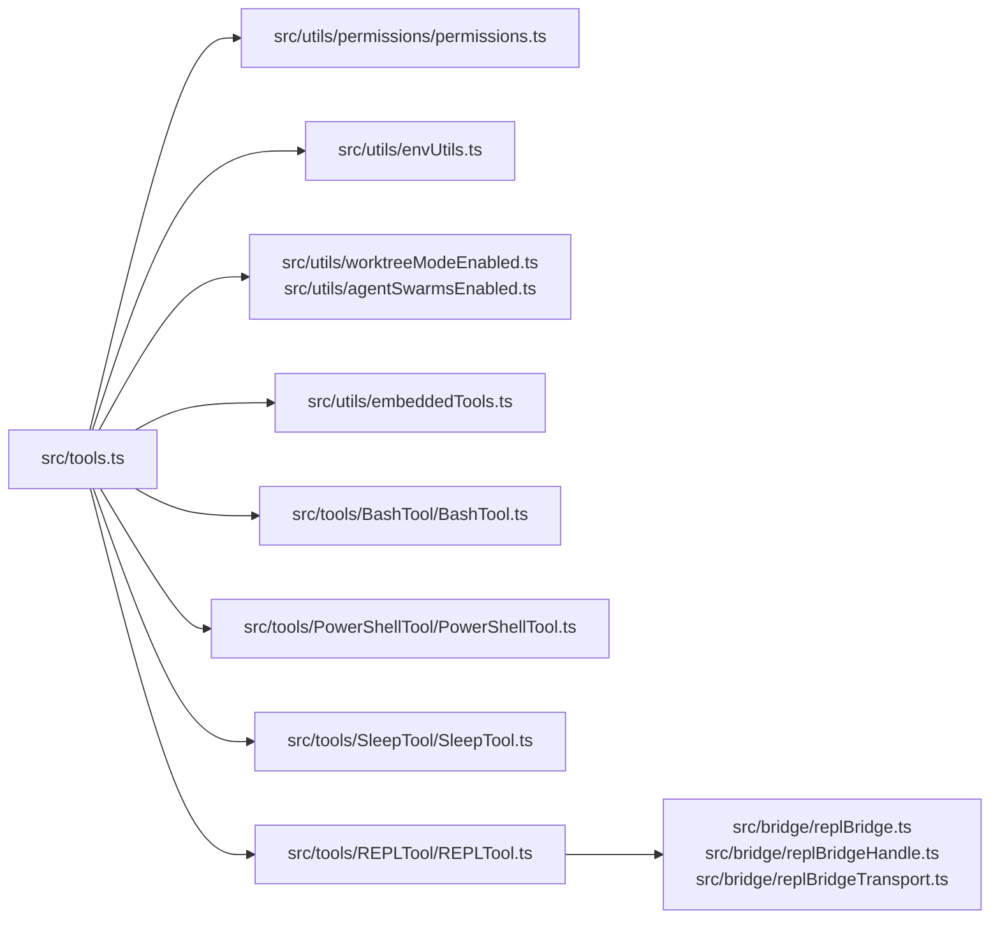

# 系统工具

<cite>
**本文引用的文件**
- [src/tools.ts](file://src/tools.ts)
- [src/tools/BashTool/BashTool.ts](file://src/tools/BashTool/BashTool.ts)
- [src/tools/PowerShellTool/PowerShellTool.ts](file://src/tools/PowerShellTool/PowerShellTool.ts)
- [src/tools/SleepTool/SleepTool.ts](file://src/tools/SleepTool/SleepTool.ts)
- [src/tools/REPLTool/REPLTool.ts](file://src/tools/REPLTool/REPLTool.ts)
- [src/tools/REPLTool/constants.ts](file://src/tools/REPLTool/constants.ts)
- [src/utils/shell/shellToolUtils.ts](file://src/utils/shell/shellToolUtils.ts)
- [src/Tool.ts](file://src/Tool.ts)
- [src/constants/tools.ts](file://src/constants/tools.ts)
- [src/utils/permissions/permissions.ts](file://src/utils/permissions/permissions.ts)
- [src/utils/envUtils.ts](file://src/utils/envUtils.ts)
- [src/utils/worktreeModeEnabled.ts](file://src/utils/worktreeModeEnabled.ts)
- [src/utils/agentSwarmsEnabled.ts](file://src/utils/agentSwarmsEnabled.ts)
- [src/utils/embeddedTools.ts](file://src/utils/embeddedTools.ts)
- [src/hooks/useReplBridge.tsx](file://src/hooks/useReplBridge.tsx)
- [src/screens/REPL.tsx](file://src/screens/REPL.tsx)
- [src/replLauncher.tsx](file://src/replLauncher.tsx)
- [src/bridge/replBridge.ts](file://src/bridge/replBridge.ts)
- [src/bridge/replBridgeHandle.ts](file://src/bridge/replBridgeHandle.ts)
- [src/bridge/replBridgeTransport.ts](file://src/bridge/replBridgeTransport.ts)
- [src/bridge/initReplBridge.ts](file://src/bridge/initReplBridge.ts)
- [src/components/sandbox/Sandbox.tsx](file://src/components/sandbox/Sandbox.tsx)
- [src/services/tools/BashTool.ts](file://src/services/tools/BashTool.ts)
- [src/services/tools/PowerShellTool.ts](file://src/services/tools/PowerShellTool.ts)
- [src/services/tools/SleepTool.ts](file://src/services/tools/SleepTool.ts)
- [src/services/tools/REPLTool.ts](file://src/services/tools/REPLTool.ts)
</cite>

## 目录
1. [简介](#简介)
2. [项目结构](#项目结构)
3. [核心组件](#核心组件)
4. [架构总览](#架构总览)
5. [详细组件分析](#详细组件分析)
6. [依赖关系分析](#依赖关系分析)
7. [性能考虑](#性能考虑)
8. [故障排除指南](#故障排除指南)
9. [结论](#结论)
10. [附录](#附录)

## 简介
本文件为系统工具的技术文档，聚焦以下内置工具的实现与使用：Bash 命令执行工具、PowerShell 工具、睡眠工具（SleepTool）与 REPL 工具（REPLTool）。文档从架构设计、数据与处理流程、安全机制（权限控制、路径验证、危险命令警告）、跨平台兼容性、命令解析与执行、输出与流式传输等方面进行深入说明，并提供常见命令执行场景示例（系统信息查询、进程管理、文件系统操作等），帮助开发者与使用者理解并正确使用这些工具。

## 项目结构
系统工具由统一的工具装配入口集中管理，按需加载与启用。关键结构如下：
- 工具装配入口：通过工具聚合函数统一收集内置工具与 MCP 工具，支持权限过滤与模式化裁剪（如简单模式、REPL 模式）。
- 平台工具：BashTool、PowerShellTool、SleepTool、REPLTool 分别位于各自目录，提供平台特定能力。
- 权限与模式：通过环境变量、特性开关与权限规则对工具可用性进行控制；REPL 模式下会隐藏部分原语工具，仅在虚拟机上下文中可用。
- 跨平台：Shell 工具的启用与行为受平台与环境配置影响，PowerShell 工具的启用由工具级工具函数判定。

图表来源
- [src/tools.ts:193-251](file://src/tools.ts#L193-L251)
- [src/utils/shell/shellToolUtils.ts](file://src/utils/shell/shellToolUtils.ts)
- [src/utils/permissions/permissions.ts](file://src/utils/permissions/permissions.ts)
- [src/utils/envUtils.ts](file://src/utils/envUtils.ts)
- [src/utils/worktreeModeEnabled.ts](file://src/utils/worktreeModeEnabled.ts)
- [src/utils/agentSwarmsEnabled.ts](file://src/utils/agentSwarmsEnabled.ts)
- [src/utils/embeddedTools.ts](file://src/utils/embeddedTools.ts)

章节来源
- [src/tools.ts:193-251](file://src/tools.ts#L193-L251)

## 核心组件
- BashTool：负责在目标平台上执行 Bash 命令，支持参数解析、输出捕获与流式传输、错误处理与超时控制。
- PowerShellTool：在 Windows 或支持 PowerShell 的环境中执行 PowerShell 命令，具备与 BashTool 类似的执行与输出处理能力。
- SleepTool：提供定时休眠能力，用于流程编排与延迟控制。
- REPLTool：在 REPL 模式中提供交互式命令执行与状态管理，支持桥接与虚拟机上下文。

章节来源
- [src/tools.ts:5](file://src/tools.ts#L5)
- [src/tools.ts:150-155](file://src/tools.ts#L150-L155)
- [src/tools.ts:25](file://src/tools.ts#L25-L28)
- [src/tools.ts:16](file://src/tools.ts#L16-L19)

## 架构总览
系统工具的整体架构围绕“工具装配—权限过滤—模式裁剪—执行服务—输出处理”展开。工具装配入口根据环境与特性动态组装工具列表，结合权限规则与模式设置决定最终可用工具集；各工具通过对应的服务层实现执行逻辑，并将结果以统一方式返回。

图表来源
- [src/tools.ts:193-251](file://src/tools.ts#L193-L251)
- [src/utils/permissions/permissions.ts](file://src/utils/permissions/permissions.ts)
- [src/utils/envUtils.ts](file://src/utils/envUtils.ts)
- [src/utils/worktreeModeEnabled.ts](file://src/utils/worktreeModeEnabled.ts)
- [src/utils/agentSwarmsEnabled.ts](file://src/utils/agentSwarmsEnabled.ts)
- [src/utils/embeddedTools.ts](file://src/utils/embeddedTools.ts)
- [src/services/tools/BashTool.ts](file://src/services/tools/BashTool.ts)
- [src/services/tools/PowerShellTool.ts](file://src/services/tools/PowerShellTool.ts)
- [src/services/tools/SleepTool.ts](file://src/services/tools/SleepTool.ts)
- [src/services/tools/REPLTool.ts](file://src/services/tools/REPLTool.ts)
- [src/bridge/replBridge.ts](file://src/bridge/replBridge.ts)
- [src/bridge/replBridgeHandle.ts](file://src/bridge/replBridgeHandle.ts)
- [src/bridge/replBridgeTransport.ts](file://src/bridge/replBridgeTransport.ts)

## 详细组件分析

### Bash 工具
- 组件职责
  - 在目标平台上执行 Bash 命令，支持参数解析、输出捕获与流式传输、错误处理与超时控制。
  - 与平台工具工具函数协作，确保在当前环境下启用与安全。
- 关键实现点
  - 工具注册与装配：在工具装配入口中注册 BashTool。
  - 条件启用：受平台与特性开关影响，必要时与嵌入式工具检测协同。
  - 执行服务：通过 Bash 执行服务封装底层命令执行逻辑。
- 安全与权限
  - 通过权限规则与模式裁剪，避免在受限或非允许模式下暴露原语工具。
  - 输出与错误处理遵循统一规范，便于审计与日志记录。
- 跨平台兼容性
  - 通过工具级工具函数与环境检测，适配不同平台的 Bash 可用性与行为差异。
- 典型使用场景
  - 系统信息查询：如获取内核版本、CPU/内存信息等。
  - 文件系统操作：如列出目录、统计文件数量、权限检查等。
  - 进程管理：如查询进程、终止进程等（需谨慎授权）。

图表来源
- [src/tools/BashTool/BashTool.ts](file://src/tools/BashTool/BashTool.ts)
- [src/services/tools/BashTool.ts](file://src/services/tools/BashTool.ts)

章节来源
- [src/tools.ts:5](file://src/tools.ts#L5)
- [src/tools.ts:193-201](file://src/tools.ts#L193-L201)
- [src/utils/shell/shellToolUtils.ts](file://src/utils/shell/shellToolUtils.ts)
- [src/utils/embeddedTools.ts](file://src/utils/embeddedTools.ts)

### PowerShell 工具
- 组件职责
  - 在支持 PowerShell 的环境中执行 PowerShell 命令，提供与 BashTool 类似的执行与输出处理能力。
- 关键实现点
  - 动态启用：通过工具级工具函数判断是否启用 PowerShell 工具。
  - 工具注册：在工具装配入口中按条件注册 PowerShellTool。
- 安全与权限
  - 同样遵循权限规则与模式裁剪，确保在受限环境下不被滥用。
- 跨平台兼容性
  - 主要面向 Windows 或具备 PowerShell 的环境，通过工具函数进行启用判断。
- 典型使用场景
  - Windows 系统管理：如查询服务状态、管理防火墙规则等。
  - 文件与目录操作：如复制、移动、权限变更等。
  - 脚本执行与自动化任务。

图表来源
- [src/tools/PowerShellTool/PowerShellTool.ts](file://src/tools/PowerShellTool/PowerShellTool.ts)
- [src/services/tools/PowerShellTool.ts](file://src/services/tools/PowerShellTool.ts)
- [src/utils/shell/shellToolUtils.ts](file://src/utils/shell/shellToolUtils.ts)

章节来源
- [src/tools.ts:150-155](file://src/tools.ts#L150-L155)
- [src/tools.ts:242](file://src/tools.ts#L242)

### 睡眠工具（SleepTool）
- 组件职责
  - 提供定时休眠能力，用于流程编排与延迟控制，避免过快的连续操作。
- 关键实现点
  - 条件启用：通过特性开关控制是否包含在工具集合中。
  - 工具注册：在工具装配入口中按条件注册 SleepTool。
- 使用建议
  - 在需要等待资源释放、缓存更新或外部系统响应时使用。
  - 避免长时间休眠导致交互体验下降。

图表来源
- [src/tools.ts:25-28](file://src/tools.ts#L25-L28)

章节来源
- [src/tools.ts:25-28](file://src/tools.ts#L25-L28)

### REPL 工具（REPLTool）
- 组件职责
  - 在 REPL 模式中提供交互式命令执行与状态管理，支持桥接与虚拟机上下文。
- 关键实现点
  - 模式集成：REPL 模式下隐藏部分原语工具，仅在虚拟机上下文中可用。
  - 桥接机制：通过 REPL 桥接模块实现前端与后端的通信。
  - 常量与模式：REPL 工具名称与仅 REPL 工具集合由常量定义，用于模式裁剪。
- 安全与权限
  - 通过权限规则与模式裁剪，限制直接调用原语工具，降低误用风险。
- 典型使用场景
  - 交互式调试与探索性命令执行。
  - 在虚拟机上下文中运行受限命令。

图表来源
- [src/screens/REPL.tsx](file://src/screens/REPL.tsx)
- [src/hooks/useReplBridge.tsx](file://src/hooks/useReplBridge.tsx)
- [src/bridge/replBridge.ts](file://src/bridge/replBridge.ts)
- [src/bridge/replBridgeTransport.ts](file://src/bridge/replBridgeTransport.ts)
- [src/bridge/replBridgeHandle.ts](file://src/bridge/replBridgeHandle.ts)
- [src/services/tools/REPLTool.ts](file://src/services/tools/REPLTool.ts)

章节来源
- [src/tools.ts:16-19](file://src/tools.ts#L16-L19)
- [src/tools.ts:314-323](file://src/tools.ts#L314-L323)
- [src/tools/REPLTool/constants.ts](file://src/tools/REPLTool/constants.ts)

## 依赖关系分析
- 工具装配入口依赖多处辅助模块：权限规则、环境与特性开关、模式与工作树、嵌入式工具检测等。
- 各工具依赖对应的服务层实现执行逻辑。
- REPL 工具依赖桥接模块完成前后端通信。

图表来源
- [src/tools.ts:193-251](file://src/tools.ts#L193-L251)
- [src/utils/permissions/permissions.ts](file://src/utils/permissions/permissions.ts)
- [src/utils/envUtils.ts](file://src/utils/envUtils.ts)
- [src/utils/worktreeModeEnabled.ts](file://src/utils/worktreeModeEnabled.ts)
- [src/utils/agentSwarmsEnabled.ts](file://src/utils/agentSwarmsEnabled.ts)
- [src/utils/embeddedTools.ts](file://src/utils/embeddedTools.ts)
- [src/bridge/replBridge.ts](file://src/bridge/replBridge.ts)
- [src/bridge/replBridgeHandle.ts](file://src/bridge/replBridgeHandle.ts)
- [src/bridge/replBridgeTransport.ts](file://src/bridge/replBridgeTransport.ts)

章节来源
- [src/tools.ts:193-251](file://src/tools.ts#L193-L251)

## 性能考虑
- 工具装配采用惰性加载与条件启用策略，减少不必要的初始化开销。
- 输出处理采用流式传输，避免大体量输出造成内存压力。
- 权限与模式裁剪在装配阶段完成，降低运行时决策成本。
- 对于 Bash 与 PowerShell 工具，建议合理设置超时与缓冲策略，防止阻塞与资源占用。

## 故障排除指南
- 工具不可用
  - 检查特性开关与环境变量是否满足工具启用条件。
  - 确认权限规则未对该工具进行全局拒绝。
- 执行失败
  - 查看输出与错误流，定位命令语法或权限问题。
  - 对于长耗时命令，考虑增加超时时间或拆分为多个短命令。
- REPL 无响应
  - 检查桥接连接状态与传输层日志。
  - 确认 REPL 模式下工具可见性与权限设置。

章节来源
- [src/tools.ts:262-269](file://src/tools.ts#L262-L269)
- [src/utils/permissions/permissions.ts](file://src/utils/permissions/permissions.ts)

## 结论
系统工具通过统一的装配入口与严格的权限、模式控制，实现了对 Bash、PowerShell、Sleep 与 REPL 工具的灵活组合与安全使用。其跨平台兼容性与流式输出处理机制，使得在不同环境下均能稳定执行常见命令与交互式任务。建议在生产环境中结合权限规则与模式裁剪，确保工具使用的安全性与可控性。

## 附录
- 常见命令执行场景示例（描述性说明）
  - 系统信息查询：使用 Bash/PowerShell 获取系统版本、内核信息、硬件资源等。
  - 文件系统操作：使用 Bash/PowerShell 列出目录、统计文件数量、变更权限等。
  - 进程管理：使用 Bash/PowerShell 查询与终止进程（需谨慎授权）。
  - 交互式调试：在 REPL 模式中进行探索性命令执行与结果验证。