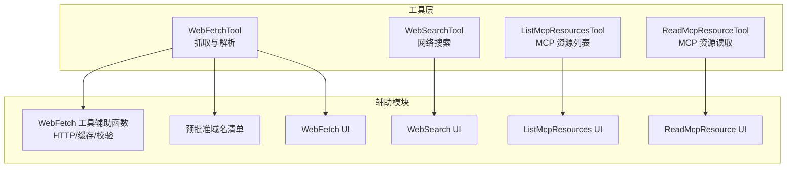
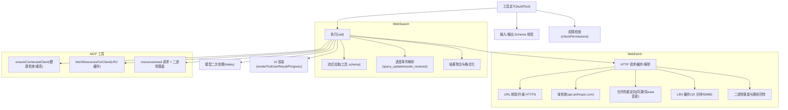
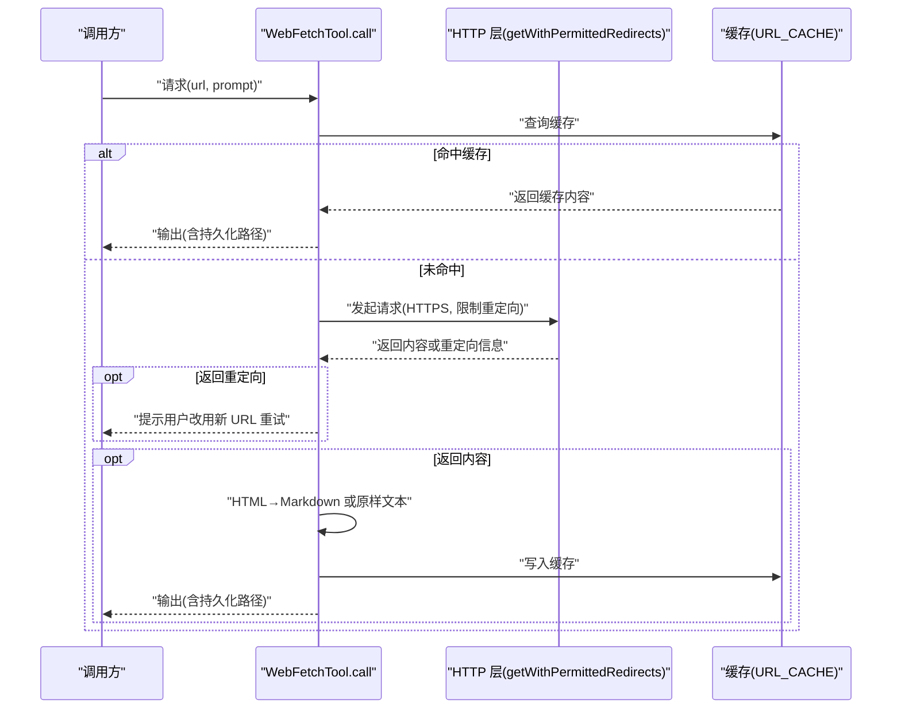
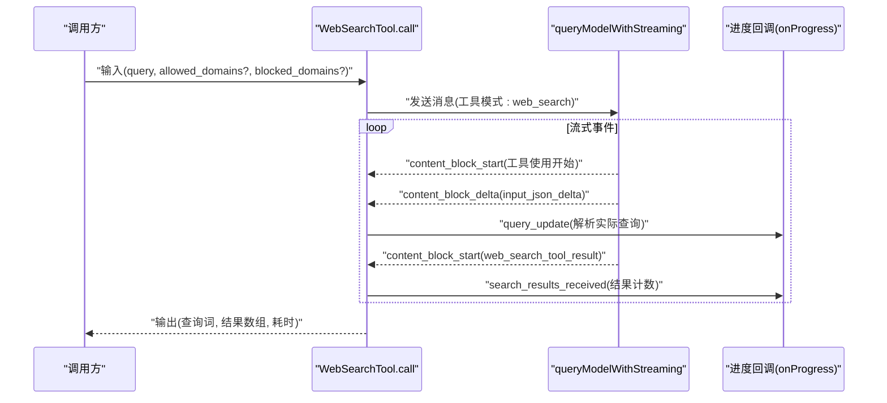
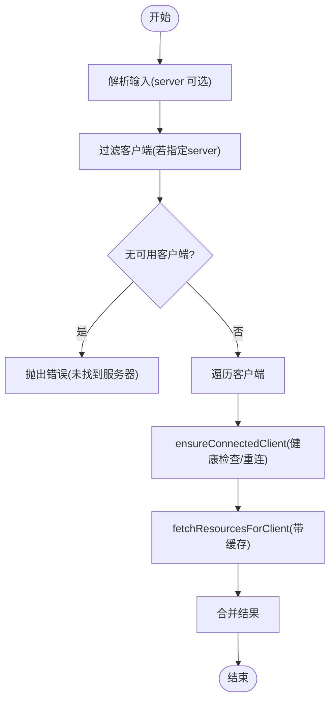
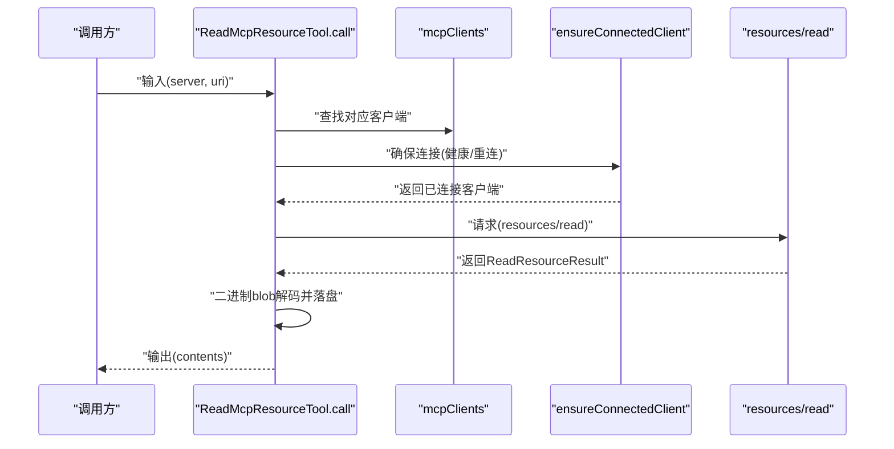
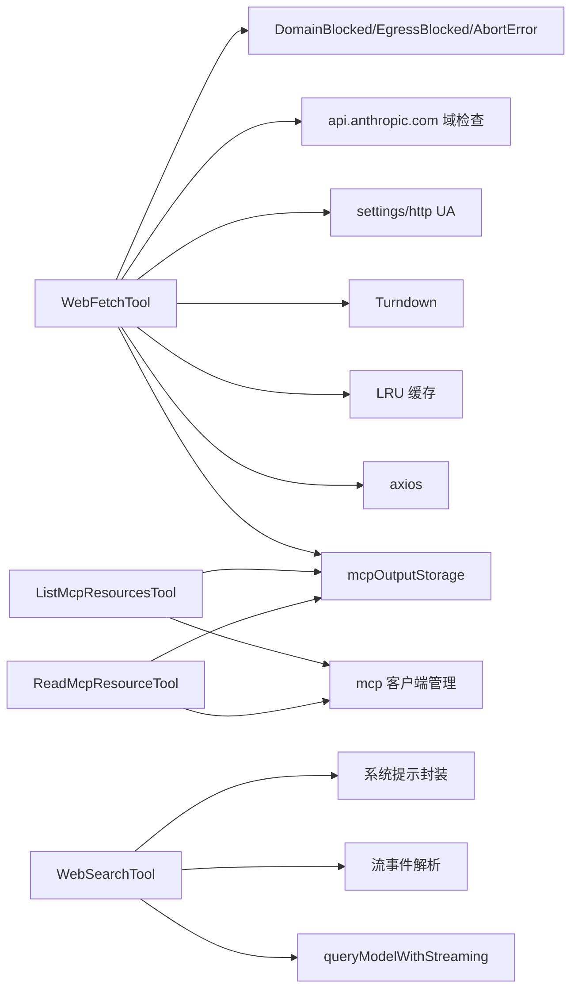

# 网络工具

<cite>
**本文引用的文件**
- [WebFetchTool 实现](file://src/tools/WebFetchTool/WebFetchTool.ts)
- [WebFetch 工具辅助函数](file://src/tools/WebFetchTool/utils.ts)
- [WebFetch 预批准域名清单](file://src/tools/WebFetchTool/preapproved.ts)
- [WebFetch UI 组件](file://src/tools/WebFetchTool/UI.tsx)
- [WebSearchTool 实现](file://src/tools/WebSearchTool/WebSearchTool.ts)
- [WebSearch UI 组件](file://src/tools/WebSearchTool/UI.tsx)
- [ListMcpResourcesTool 实现](file://src/tools/ListMcpResourcesTool/ListMcpResourcesTool.ts)
- [ListMcpResources UI 组件](file://src/tools/ListMcpResourcesTool/UI.tsx)
- [ReadMcpResourceTool 实现](file://src/tools/ReadMcpResourceTool/ReadMcpResourceTool.ts)
- [ReadMcpResource UI 组件](file://src/tools/ReadMcpResourceTool/UI.tsx)
</cite>

## 目录
1. [简介](#简介)
2. [项目结构](#项目结构)
3. [核心组件](#核心组件)
4. [架构总览](#架构总览)
5. [详细组件分析](#详细组件分析)
6. [依赖关系分析](#依赖关系分析)
7. [性能考量](#性能考量)
8. [故障排查指南](#故障排查指南)
9. [结论](#结论)
10. [附录：使用示例与最佳实践](#附录使用示例与最佳实践)

## 简介
本文件系统化梳理并深入解读四类网络工具的实现与应用：
- 网页抓取工具（WebFetch）：从 URL 抓取内容并可对 Markdown 内容执行二次提示处理；内置预批准域名白名单、URL 校验、重定向安全检查、内容类型识别与缓存、二进制内容落盘等安全与性能机制。
- 网络搜索工具（WebSearch）：通过模型流式调用执行网络搜索，支持域名白名单/黑名单过滤、进度回调、结果聚合与格式化输出。
- MCP 资源列表工具（ListMcpResourcesTool）：枚举已连接 MCP 服务器提供的资源清单，具备 LRU 缓存与健康重连策略。
- MCP 资源读取工具（ReadMcpResourceTool）：按服务器与 URI 读取 MCP 资源，自动处理二进制 blob 并落盘保存，便于后续人工审阅。

文档覆盖 HTTP 请求处理、URL 验证、内容解析、缓存机制、安全防护（预批准域名、内容过滤、速率限制、重定向限制、出口代理阻断检测）、权限与合规流程，并提供 API 调用与典型使用场景示例。

## 项目结构
网络工具位于 src/tools 下，每个工具由“工具实现 + UI + 辅助模块”构成，遵循统一的工具框架与渲染规范。

图表来源
- [WebFetchTool 实现:1-319](file://src/tools/WebFetchTool/WebFetchTool.ts#L1-L319)
- [WebFetch 工具辅助函数:1-531](file://src/tools/WebFetchTool/utils.ts#L1-L531)
- [WebFetch 预批准域名清单:1-167](file://src/tools/WebFetchTool/preapproved.ts#L1-L167)
- [WebFetch UI 组件:1-72](file://src/tools/WebFetchTool/UI.tsx#L1-L72)
- [WebSearchTool 实现:1-436](file://src/tools/WebSearchTool/WebSearchTool.ts#L1-L436)
- [WebSearch UI 组件:1-101](file://src/tools/WebSearchTool/UI.tsx#L1-L101)
- [ListMcpResourcesTool 实现:1-124](file://src/tools/ListMcpResourcesTool/ListMcpResourcesTool.ts#L1-L124)
- [ListMcpResources UI 组件:1-29](file://src/tools/ListMcpResourcesTool/UI.tsx#L1-L29)
- [ReadMcpResourceTool 实现:1-159](file://src/tools/ReadMcpResourceTool/ReadMcpResourceTool.ts#L1-L159)
- [ReadMcpResource UI 组件:1-37](file://src/tools/ReadMcpResourceTool/UI.tsx#L1-L37)

章节来源
- [WebFetchTool 实现:1-319](file://src/tools/WebFetchTool/WebFetchTool.ts#L1-L319)
- [WebSearchTool 实现:1-436](file://src/tools/WebSearchTool/WebSearchTool.ts#L1-L436)
- [ListMcpResourcesTool 实现:1-124](file://src/tools/ListMcpResourcesTool/ListMcpResourcesTool.ts#L1-L124)
- [ReadMcpResourceTool 实现:1-159](file://src/tools/ReadMcpResourceTool/ReadMcpResourceTool.ts#L1-L159)

## 核心组件
- WebFetchTool：负责单 URL 抓取、HTML 到 Markdown 转换、二次模型处理、缓存命中、二进制落盘、重定向拦截与安全域检查。
- WebSearchTool：负责构建工具模式、流式拉取搜索结果、进度事件解析、结果聚合与格式化输出。
- ListMcpResourcesTool：负责遍历已连接 MCP 客户端，获取资源清单，带缓存与错误隔离。
- ReadMcpResourceTool：负责按 URI 读取 MCP 资源，自动处理二进制 blob 并落盘，返回结构化内容。

章节来源
- [WebFetchTool 实现:66-307](file://src/tools/WebFetchTool/WebFetchTool.ts#L66-L307)
- [WebSearchTool 实现:152-435](file://src/tools/WebSearchTool/WebSearchTool.ts#L152-L435)
- [ListMcpResourcesTool 实现:40-123](file://src/tools/ListMcpResourcesTool/ListMcpResourcesTool.ts#L40-L123)
- [ReadMcpResourceTool 实现:49-158](file://src/tools/ReadMcpResourceTool/ReadMcpResourceTool.ts#L49-L158)

## 架构总览
整体架构围绕“工具定义 + 输入输出校验 + 权限与合规 + 执行器 + UI 渲染”的分层设计展开。WebFetch 与 WebSearch 均基于统一的工具框架，具备只读、并发安全、延迟执行等特性；MCP 工具通过客户端连接与能力协商完成资源发现与读取。

图表来源
- [WebFetch 工具辅助函数:176-482](file://src/tools/WebFetchTool/utils.ts#L176-L482)
- [WebSearchTool 实现:254-400](file://src/tools/WebSearchTool/WebSearchTool.ts#L254-L400)
- [ListMcpResourcesTool 实现:66-101](file://src/tools/ListMcpResourcesTool/ListMcpResourcesTool.ts#L66-L101)
- [ReadMcpResourceTool 实现:75-143](file://src/tools/ReadMcpResourceTool/ReadMcpResourceTool.ts#L75-L143)

## 详细组件分析

### WebFetchTool：网页抓取与内容解析
- 功能要点
  - 输入校验：URL 必须可解析且长度受限；禁止包含用户名/密码；主机名需可公开解析。
  - 域检查：通过 api.anthropic.com 查询是否允许抓取，失败或阻断时抛出明确错误。
  - 重定向安全：仅允许协议/端口一致、且主机名在“www. 变更或完全相同”的范围内；最多 10 次跳转。
  - 协议升级：http 自动升级为 https。
  - 缓存：LRU 缓存，15 分钟 TTL，50MB 总大小；命中直接返回缓存内容。
  - 内容处理：HTML 转 Markdown；二进制内容自动落盘并返回保存路径；超长内容截断后交由 Haiku 模型二次处理。
  - 输出：包含字节数、状态码、状态文本、处理结果、耗时、原始 URL。
- 安全与合规
  - 预批准域名白名单：仅针对 GET 请求放行，避免上传/修改等高风险操作。
  - 出口代理阻断检测：识别特定响应头并抛出 EgressBlockedError。
  - 权限决策：优先匹配预批准域名；否则按规则 deny/ask/allow 流程处理。
- 典型流程（抓取到重定向）

图表来源
- [WebFetchTool 实现:208-299](file://src/tools/WebFetchTool/WebFetchTool.ts#L208-L299)
- [WebFetch 工具辅助函数:262-482](file://src/tools/WebFetchTool/utils.ts#L262-L482)

章节来源
- [WebFetchTool 实现:104-180](file://src/tools/WebFetchTool/WebFetchTool.ts#L104-L180)
- [WebFetch 工具辅助函数:139-203](file://src/tools/WebFetchTool/utils.ts#L139-L203)
- [WebFetch 预批准域名清单:14-167](file://src/tools/WebFetchTool/preapproved.ts#L14-L167)
- [WebFetch UI 组件:9-72](file://src/tools/WebFetchTool/UI.tsx#L9-L72)

### WebSearchTool：网络搜索与结果聚合
- 功能要点
  - 工具模式：构造 web_search_20250305 工具模式，最大使用次数 8。
  - 输入校验：查询必填；不允许同时指定 allowed_domains 与 blocked_domains。
  - 执行：通过流式查询接口接收 server_tool_use 与 web_search_tool_result 事件，解析实际查询与结果数量，实时上报进度。
  - 结果聚合：将多个搜索块合并为统一结构，文本摘要与链接集合混合输出。
  - 输出：包含查询词、结果数组（文本摘要或链接集合）、耗时。
- 启用条件
  - 第三方提供方（firstParty）始终启用；
  - Vertex AI 提供方要求模型包含 claude-opus-4 / sonnet-4 / haiku-4；
  - Foundry 提供方默认支持。
- 进度与 UI
  - 支持 query_update 与 search_results_received 两类进度事件，用于 UI 实时反馈。

图表来源
- [WebSearchTool 实现:254-400](file://src/tools/WebSearchTool/WebSearchTool.ts#L254-L400)
- [WebSearch UI 组件:55-78](file://src/tools/WebSearchTool/UI.tsx#L55-L78)

章节来源
- [WebSearchTool 实现:152-253](file://src/tools/WebSearchTool/WebSearchTool.ts#L152-L253)
- [WebSearch UI 组件:25-101](file://src/tools/WebSearchTool/UI.tsx#L25-L101)

### ListMcpResourcesTool：MCP 资源列表
- 功能要点
  - 输入：可选 server 名称，用于筛选目标服务器。
  - 执行：遍历 mcpClients，对已连接客户端确保健康连接并拉取资源；失败不中断整体结果。
  - 缓存：LRU 缓存（按服务器名），命中即复用；连接关闭或收到资源变更通知时失效。
  - 输出：扁平化的资源数组（uri/name/mime/description/server）。
- UI 与截断
  - 当输出过大时进行终端行截断检测，避免 UI 卡顿。

图表来源
- [ListMcpResourcesTool 实现:66-101](file://src/tools/ListMcpResourcesTool/ListMcpResourcesTool.ts#L66-L101)

章节来源
- [ListMcpResourcesTool 实现:40-101](file://src/tools/ListMcpResourcesTool/ListMcpResourcesTool.ts#L40-L101)
- [ListMcpResources UI 组件:9-29](file://src/tools/ListMcpResourcesTool/UI.tsx#L9-L29)

### ReadMcpResourceTool：MCP 资源读取
- 功能要点
  - 输入：server 与 uri。
  - 执行：定位客户端 → 校验连接与能力 → 发起 resources/read 请求 → 处理二进制 blob 自动落盘 → 返回结构化内容。
  - 输出：contents 数组，包含 text 或 blob 的解码与保存路径。
- UI 与截断
  - 输出 JSON 化展示，支持 verbose 控制；过长时进行终端行截断检测。

图表来源
- [ReadMcpResourceTool 实现:75-143](file://src/tools/ReadMcpResourceTool/ReadMcpResourceTool.ts#L75-L143)

章节来源
- [ReadMcpResourceTool 实现:49-158](file://src/tools/ReadMcpResourceTool/ReadMcpResourceTool.ts#L49-L158)
- [ReadMcpResource UI 组件:10-37](file://src/tools/ReadMcpResourceTool/UI.tsx#L10-L37)

## 依赖关系分析
- 工具框架
  - 所有工具均通过统一的 buildTool 构建，具备输入/输出 Schema、描述、权限检查、只读与并发安全声明、延迟执行、UI 渲染钩子等。
- WebFetch 依赖
  - HTTP 客户端 axios、LRU 缓存、Turndown（HTML→Markdown）、二进制落盘工具、设置与 UA 工具、域检查 API、错误类型与安全常量。
- WebSearch 依赖
  - 模型流式查询、工具模式、进度事件解析、系统提示封装、特征开关（Thinking/Haiku）。
- MCP 工具依赖
  - MCP 客户端管理（ensureConnectedClient/fetchResourcesForClient）、二进制落盘工具、JSON 序列化。

图表来源
- [WebFetch 工具辅助函数:1-100](file://src/tools/WebFetchTool/utils.ts#L1-L100)
- [WebSearchTool 实现:1-20](file://src/tools/WebSearchTool/WebSearchTool.ts#L1-L20)
- [ListMcpResourcesTool 实现:1-12](file://src/tools/ListMcpResourcesTool/ListMcpResourcesTool.ts#L1-L12)
- [ReadMcpResourceTool 实现:1-15](file://src/tools/ReadMcpResourceTool/ReadMcpResourceTool.ts#L1-L15)

章节来源
- [WebFetch 工具辅助函数:1-531](file://src/tools/WebFetchTool/utils.ts#L1-L531)
- [WebSearchTool 实现:1-436](file://src/tools/WebSearchTool/WebSearchTool.ts#L1-L436)
- [ListMcpResourcesTool 实现:1-124](file://src/tools/ListMcpResourcesTool/ListMcpResourcesTool.ts#L1-L124)
- [ReadMcpResourceTool 实现:1-159](file://src/tools/ReadMcpResourceTool/ReadMcpResourceTool.ts#L1-L159)

## 性能考量
- 缓存策略
  - WebFetch：URL 级 LRU 缓存（15 分钟 TTL，50MB 限额），命中直接返回，减少重复网络与解析开销。
  - ListMcpResources：按服务器名缓存资源清单，连接关闭或收到资源变更通知时失效，保证一致性。
- 资源限制
  - 单次请求最大内容长度 10MB；HTTP 超时 60 秒；域检查超时 10 秒；重定向上限 10 次，防止循环跳转。
- 解析与内存
  - HTML→Markdown 使用惰性加载的 Turndown；二进制内容先落盘再在上下文中提示路径，避免大字符串直接进入会话上下文。
- 并发与只读
  - 工具声明并发安全与只读属性，降低锁竞争与副作用风险。

[本节为通用性能讨论，无需具体文件分析]

## 故障排查指南
- 域检查失败/被阻断
  - 现象：抛出 DomainCheckFailedError 或 DomainBlockedError。
  - 排查：确认目标域名是否在 api.anthropic.com 域检查结果中；企业网络可能通过出口代理阻断，出现 403 且特定响应头。
  - 处理：根据错误类型调整 URL 或联系网络管理员。
- 重定向异常
  - 现象：返回重定向信息而非内容，提示改用新 URL。
  - 排查：确认重定向是否满足“协议/端口一致且主机名允许变更（仅 www.）”。
- 缓存命中与一致性
  - 现象：多次请求返回相同内容。
  - 排查：确认 URL 是否一致；缓存 TTL 与大小限制；必要时清理缓存。
- MCP 客户端不可用
  - 现象：找不到服务器或连接非已连接状态。
  - 排查：确认 mcpClients 列表与服务器名称；检查 ensureConnectedClient 是否成功；查看日志中的错误信息。
- 二进制内容无法保存
  - 现象：提示二进制内容无法保存到磁盘。
  - 排查：检查存储目录权限与磁盘空间；查看持久化错误信息。

章节来源
- [WebFetch 工具辅助函数:176-203](file://src/tools/WebFetchTool/utils.ts#L176-L203)
- [WebFetch 工具辅助函数:316-329](file://src/tools/WebFetchTool/utils.ts#L316-L329)
- [ListMcpResourcesTool 实现:73-77](file://src/tools/ListMcpResourcesTool/ListMcpResourcesTool.ts#L73-L77)
- [ReadMcpResourceTool 实现:106-138](file://src/tools/ReadMcpResourceTool/ReadMcpResourceTool.ts#L106-L138)

## 结论
上述网络工具在保障安全的前提下，提供了从网页抓取、网络搜索到 MCP 资源发现与读取的完整能力。通过严格的 URL 校验、域检查、重定向限制、缓存与二进制落盘等机制，既提升了性能，也降低了数据泄露与滥用风险。建议在企业环境中结合本地权限规则与审计日志，进一步强化合规与安全管控。

[本节为总结性内容，无需具体文件分析]

## 附录：使用示例与最佳实践
- WebFetch：抓取网页并提取摘要
  - 步骤：准备 URL 与提示词；调用 WebFetchTool；若返回重定向，按提示改用新 URL；关注输出中的持久化路径（如存在二进制内容）。
  - 注意：对于需要认证的页面，应寻找具备认证能力的专用 MCP 工具。
- WebSearch：执行网络搜索并获取结果
  - 步骤：准备查询词与可选域名白/黑名单；调用 WebSearchTool；监听进度事件；最终输出包含文本摘要与链接集合。
  - 注意：输入不允许同时指定 allowed_domains 与 blocked_domains。
- MCP 资源列表：列出可用资源
  - 步骤：调用 ListMcpResourcesTool；若指定 server，则仅列出该服务器资源；注意输出可能为空（某些服务器提供工具但无资源）。
- MCP 资源读取：按 URI 获取内容
  - 步骤：调用 ReadMcpResourceTool；若返回二进制内容，查看输出中的保存路径以便人工审阅。

章节来源
- [WebFetchTool 实现:181-190](file://src/tools/WebFetchTool/WebFetchTool.ts#L181-L190)
- [WebSearchTool 实现:229-253](file://src/tools/WebSearchTool/WebSearchTool.ts#L229-L253)
- [ListMcpResourcesTool 实现:66-101](file://src/tools/ListMcpResourcesTool/ListMcpResourcesTool.ts#L66-L101)
- [ReadMcpResourceTool 实现:75-143](file://src/tools/ReadMcpResourceTool/ReadMcpResourceTool.ts#L75-L143)