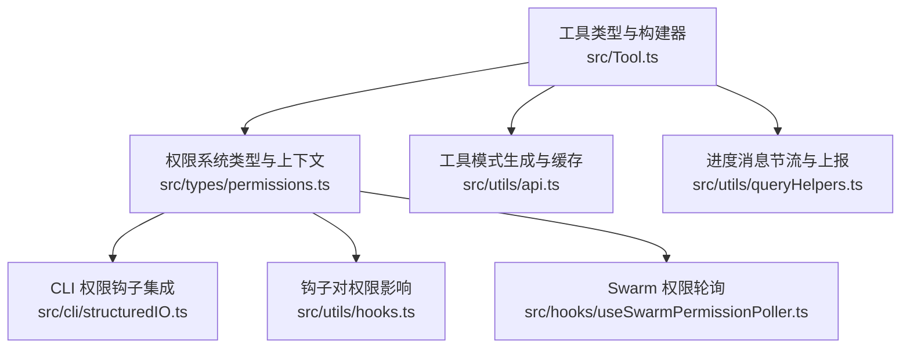
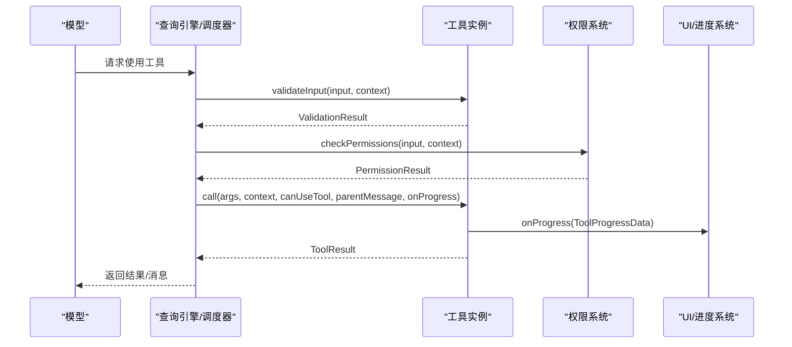
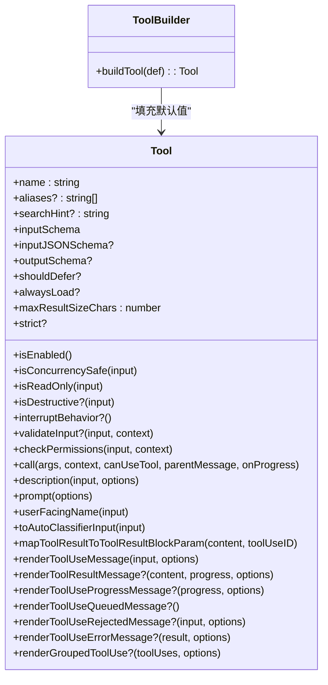
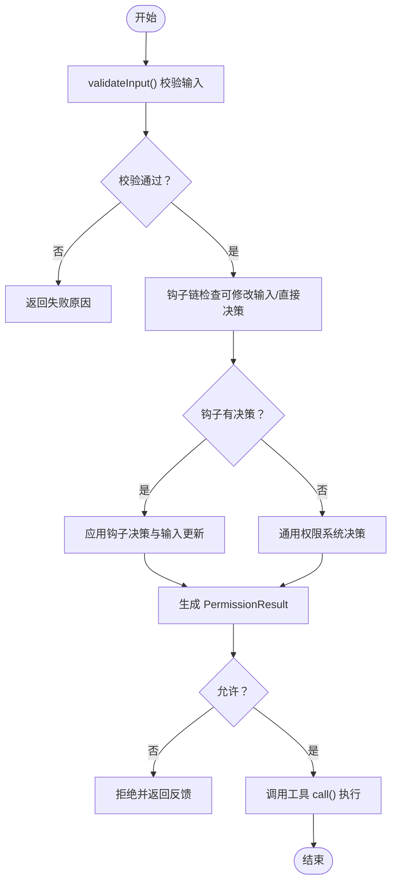
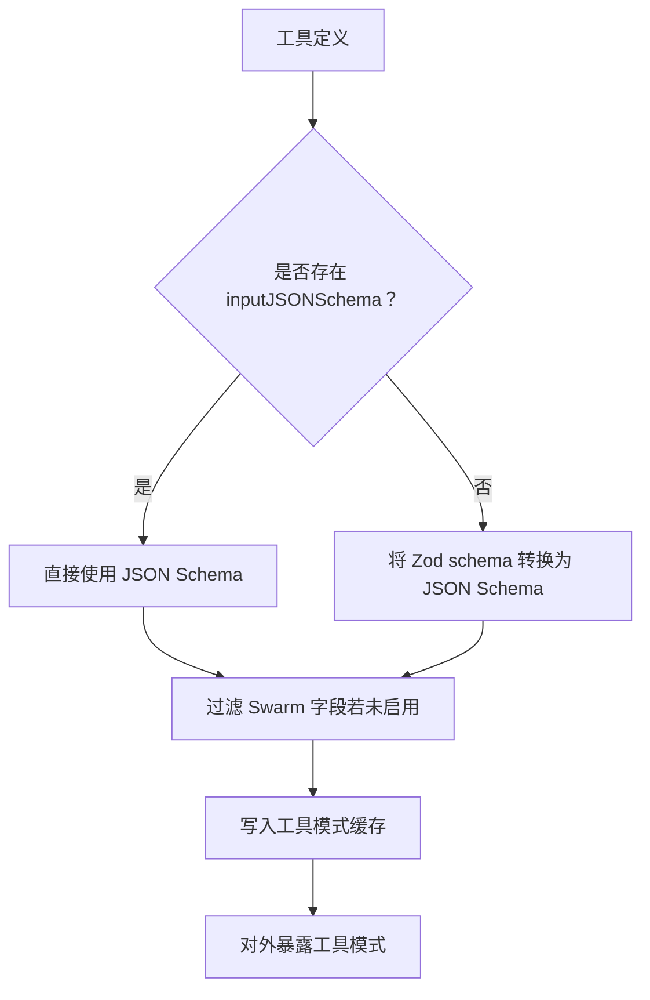
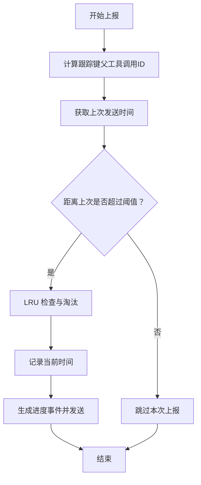
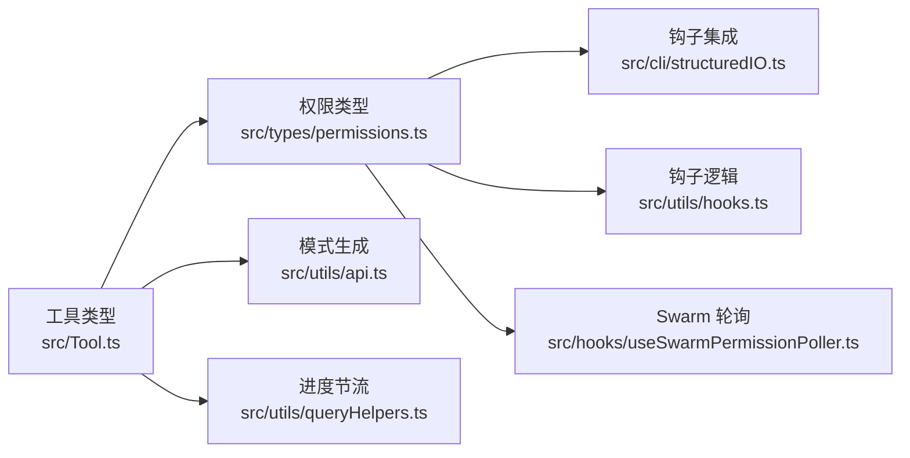

# 工具接口设计

<cite>
**本文引用的文件**
- [src/Tool.ts](file://src/Tool.ts)
- [src/types/permissions.ts](file://src/types/permissions.ts)
- [src/utils/api.ts](file://src/utils/api.ts)
- [src/utils/queryHelpers.ts](file://src/utils/queryHelpers.ts)
- [src/cli/structuredIO.ts](file://src/cli/structuredIO.ts)
- [src/utils/hooks.ts](file://src/utils/hooks.ts)
- [src/hooks/useSwarmPermissionPoller.ts](file://src/hooks/useSwarmPermissionPoller.ts)
</cite>

## 目录
1. [简介](#简介)
2. [项目结构](#项目结构)
3. [核心组件](#核心组件)
4. [架构总览](#架构总览)
5. [详细组件分析](#详细组件分析)
6. [依赖关系分析](#依赖关系分析)
7. [性能考量](#性能考量)
8. [故障排查指南](#故障排查指南)
9. [结论](#结论)
10. [附录](#附录)

## 简介
本文件面向 Claude Code 的工具接口设计，系统化阐述 Tool 类型定义、工具生命周期方法（validateInput、checkPermissions、call）、工具能力标识（isEnabled、isConcurrencySafe、isReadOnly、isDestructive）、输入输出模式（inputSchema、outputSchema）、工具权限上下文（ToolUseContext）、工具进度系统（ToolProgressData），并给出最佳实践、与查询引擎的交互方式以及在多代理协作中的作用。

## 项目结构
工具接口的核心位于统一的类型与工具构建器定义中，并通过权限系统、进度系统与查询辅助模块协同工作。关键文件如下：
- 工具类型与构建器：src/Tool.ts
- 权限系统类型与上下文：src/types/permissions.ts
- 工具模式生成与缓存：src/utils/api.ts
- 进度消息节流与上报：src/utils/queryHelpers.ts
- CLI 中的权限钩子集成：src/cli/structuredIO.ts
- 钩子对权限决策的影响：src/utils/hooks.ts
- 多代理（Swarm）权限轮询：src/hooks/useSwarmPermissionPoller.ts

**图表来源**
- [src/Tool.ts:1-793](file://src/Tool.ts#L1-L793)
- [src/types/permissions.ts:34-441](file://src/types/permissions.ts#L34-L441)
- [src/utils/api.ts:139-169](file://src/utils/api.ts#L139-L169)
- [src/utils/queryHelpers.ts:165-198](file://src/utils/queryHelpers.ts#L165-L198)
- [src/cli/structuredIO.ts:811-859](file://src/cli/structuredIO.ts#L811-L859)
- [src/utils/hooks.ts:2839-2874](file://src/utils/hooks.ts#L2839-L2874)
- [src/hooks/useSwarmPermissionPoller.ts:247-298](file://src/hooks/useSwarmPermissionPoller.ts#L247-L298)

**章节来源**
- [src/Tool.ts:1-793](file://src/Tool.ts#L1-L793)
- [src/types/permissions.ts:34-441](file://src/types/permissions.ts#L34-L441)
- [src/utils/api.ts:139-169](file://src/utils/api.ts#L139-L169)
- [src/utils/queryHelpers.ts:165-198](file://src/utils/queryHelpers.ts#L165-L198)
- [src/cli/structuredIO.ts:811-859](file://src/cli/structuredIO.ts#L811-L859)
- [src/utils/hooks.ts:2839-2874](file://src/utils/hooks.ts#L2839-L2874)
- [src/hooks/useSwarmPermissionPoller.ts:247-298](file://src/hooks/useSwarmPermissionPoller.ts#L247-L298)

## 核心组件
- Tool 类型与工具构建器
  - Tool 定义了工具的完整接口，包含生命周期方法、能力标识、输入输出模式、权限与描述、渲染与结果映射等。
  - buildTool 提供安全默认值，确保工具导出时具备一致行为，避免调用方需要显式判空。
- 工具权限上下文 ToolUseContext
  - 包含工具运行所需的上下文信息，如命令集合、思考配置、文件读取状态、会话状态、通知与进度回调等。
- 工具进度系统 ToolProgressData
  - 用于在工具执行过程中上报进度，支持节流与聚合，便于 UI 呈现与统计追踪。

**章节来源**
- [src/Tool.ts:362-695](file://src/Tool.ts#L362-L695)
- [src/Tool.ts:783-792](file://src/Tool.ts#L783-L792)
- [src/Tool.ts:158-300](file://src/Tool.ts#L158-L300)
- [src/Tool.ts:301-340](file://src/Tool.ts#L301-L340)

## 架构总览
工具接口围绕“类型定义 + 构建器 + 生命周期 + 权限 + 进度”展开，形成从模型到执行器的闭环。下图展示了工具调用的关键路径与参与模块：

**图表来源**
- [src/Tool.ts:389-503](file://src/Tool.ts#L389-L503)
- [src/types/permissions.ts:44-256](file://src/types/permissions.ts#L44-L256)
- [src/utils/queryHelpers.ts:165-198](file://src/utils/queryHelpers.ts#L165-L198)

## 详细组件分析

### 工具类型与生命周期
- 类型定义要点
  - 输入/输出模式：inputSchema（Zod）、inputJSONSchema（JSON Schema，MCP 工具可选）、outputSchema（可选）。
  - 能力标识：isEnabled、isConcurrencySafe、isReadOnly、isDestructive（可选）。
  - 生命周期方法：validateInput（校验输入）、checkPermissions（权限决策）、call（实际执行）。
  - 渲染与描述：description、renderToolUseMessage、renderToolResultMessage、mapToolResultToToolResultBlockParam 等。
  - 其他：interruptBehavior、shouldDefer、alwaysLoad、maxResultSizeChars、strict 等。
- 构建器与默认值
  - buildTool 将 TOOL_DEFAULTS 与用户定义合并，保证常用方法有安全默认，减少样板代码。
  - 默认策略（失败关闭）：启用、并发安全、只读、破坏性均为保守默认；权限默认放行但携带更新后的输入；自动分类输入默认为空字符串。

**图表来源**
- [src/Tool.ts:362-695](file://src/Tool.ts#L362-L695)
- [src/Tool.ts:783-792](file://src/Tool.ts#L783-L792)
- [src/Tool.ts:757-769](file://src/Tool.ts#L757-L769)

**章节来源**
- [src/Tool.ts:362-695](file://src/Tool.ts#L362-L695)
- [src/Tool.ts:783-792](file://src/Tool.ts#L783-L792)
- [src/Tool.ts:757-769](file://src/Tool.ts#L757-L769)

### 工具权限上下文与权限系统
- ToolUseContext
  - 汇集工具运行所需上下文：命令、调试、思考配置、工具集合、文件读写限制、消息与状态管理、进度回调、通知、会话 ID 等。
- 权限系统类型
  - PermissionBehavior：allow/deny/ask；PermissionResult：包含决策与更新后的输入；ToolPermissionContext：权限模式、规则来源、是否绕过权限等。
- 权限钩子与 CLI 集成
  - 钩子可修改输入或直接给出允许/拒绝；CLI 中的 PermissionRequest 钩子可持久化权限更新并即时刷新权限上下文。
- Swarm 权限轮询
  - 在多代理场景中，后台轮询响应文件，处理批准/拒绝与输入更新。

**图表来源**
- [src/Tool.ts:489-503](file://src/Tool.ts#L489-L503)
- [src/types/permissions.ts:44-256](file://src/types/permissions.ts#L44-L256)
- [src/cli/structuredIO.ts:811-859](file://src/cli/structuredIO.ts#L811-L859)
- [src/utils/hooks.ts:2839-2874](file://src/utils/hooks.ts#L2839-L2874)
- [src/hooks/useSwarmPermissionPoller.ts:247-298](file://src/hooks/useSwarmPermissionPoller.ts#L247-L298)

**章节来源**
- [src/Tool.ts:158-300](file://src/Tool.ts#L158-L300)
- [src/types/permissions.ts:44-256](file://src/types/permissions.ts#L44-L256)
- [src/cli/structuredIO.ts:811-859](file://src/cli/structuredIO.ts#L811-L859)
- [src/utils/hooks.ts:2839-2874](file://src/utils/hooks.ts#L2839-L2874)
- [src/hooks/useSwarmPermissionPoller.ts:247-298](file://src/hooks/useSwarmPermissionPoller.ts#L247-L298)

### 工具输入输出模式与模式生成
- 输入模式
  - inputSchema 使用 Zod 定义；MCP 工具可直接提供 inputJSONSchema。
- 输出模式
  - outputSchema 可选；工具通过 mapToolResultToToolResultBlockParam 将执行结果映射为 SDK/协议块参数。
- 模式生成与缓存
  - 工具模式生成时优先使用 inputJSONSchema（若存在），否则将 Zod schema 转换为 JSON Schema；同时考虑特性开关与 Swarm 字段过滤，以保持缓存稳定性与外部可见性一致性。

**图表来源**
- [src/utils/api.ts:139-169](file://src/utils/api.ts#L139-L169)
- [src/Tool.ts:394-400](file://src/Tool.ts#L394-L400)

**章节来源**
- [src/utils/api.ts:139-169](file://src/utils/api.ts#L139-L169)
- [src/Tool.ts:394-400](file://src/Tool.ts#L394-L400)

### 工具进度系统与节流
- 进度类型
  - ToolProgressData 作为进度载体，配合 ToolCallProgress 回调在工具执行期间持续上报。
- 节流与聚合
  - 进度消息按父工具调用 ID 聚合，采用时间阈值与 LRU 策略控制上报频率，避免过度刷新与资源浪费。
- 上报字段
  - 包含工具名、父工具调用 ID、耗时、任务 ID、会话 ID 等，便于后端统计与前端展示。

**图表来源**
- [src/utils/queryHelpers.ts:165-198](file://src/utils/queryHelpers.ts#L165-L198)
- [src/Tool.ts:307-340](file://src/Tool.ts#L307-L340)

**章节来源**
- [src/utils/queryHelpers.ts:165-198](file://src/utils/queryHelpers.ts#L165-L198)
- [src/Tool.ts:307-340](file://src/Tool.ts#L307-L340)

### 工具接口最佳实践
- 正确实现生命周期方法
  - validateInput：严格校验输入合法性与上下文约束，尽早失败。
  - checkPermissions：在通用权限系统之外补充工具特定规则；必要时提供 preparePermissionMatcher 支持模式匹配。
  - call：实现幂等与可中断；对非并发安全工具，合理使用 contextModifier 或中断行为。
- 异步与进度
  - 使用 onProgress 回调上报阶段性结果；对长耗时工具设置合理节流策略。
  - 对不可变只读工具标记 isReadOnly；对可能破坏性操作标记 isDestructive。
- 错误处理
  - 明确区分“输入错误”“权限拒绝”“执行异常”，分别通过 ValidationResult、PermissionResult 与错误 UI 呈现。
  - 自定义 renderToolUseErrorMessage 与 renderToolUseRejectedMessage，提升可读性与可诊断性。
- 渲染与描述
  - 提供清晰的 description 与 userFacingName；必要时实现 extractSearchText 以便索引与高亮。
- 与查询引擎交互
  - 通过 ToolUseContext 获取命令、文件状态、消息与状态变更；在非交互会话中注意 setAppState 的使用边界。
- 多代理协作
  - 在 Swarm 场景中，利用权限轮询与钩子链实现跨节点的权限协调与输入更新；必要时提供透明包装器（isTransparentWrapper）。

**章节来源**
- [src/Tool.ts:362-695](file://src/Tool.ts#L362-L695)
- [src/Tool.ts:158-300](file://src/Tool.ts#L158-L300)
- [src/hooks/useSwarmPermissionPoller.ts:247-298](file://src/hooks/useSwarmPermissionPoller.ts#L247-L298)

## 依赖关系分析
- 组件耦合
  - 工具类型强依赖权限系统类型与上下文；工具构建器与权限系统通过默认值与钩子链共同决定行为。
  - 进度系统与查询辅助模块解耦于工具实现，仅通过回调与节流策略耦合。
- 外部依赖
  - Zod 用于输入模式定义；SDK 类型用于结果映射；MCP 类型用于 MCP 工具扩展。
- 循环依赖规避
  - 权限类型与工具类型通过集中导出与深度不可变类型（DeepImmutable）避免循环导入。

**图表来源**
- [src/Tool.ts:1-793](file://src/Tool.ts#L1-L793)
- [src/types/permissions.ts:34-441](file://src/types/permissions.ts#L34-L441)
- [src/utils/api.ts:139-169](file://src/utils/api.ts#L139-L169)
- [src/utils/queryHelpers.ts:165-198](file://src/utils/queryHelpers.ts#L165-L198)
- [src/cli/structuredIO.ts:811-859](file://src/cli/structuredIO.ts#L811-L859)
- [src/utils/hooks.ts:2839-2874](file://src/utils/hooks.ts#L2839-L2874)
- [src/hooks/useSwarmPermissionPoller.ts:247-298](file://src/hooks/useSwarmPermissionPoller.ts#L247-L298)

**章节来源**
- [src/Tool.ts:1-793](file://src/Tool.ts#L1-L793)
- [src/types/permissions.ts:34-441](file://src/types/permissions.ts#L34-L441)
- [src/utils/api.ts:139-169](file://src/utils/api.ts#L139-L169)
- [src/utils/queryHelpers.ts:165-198](file://src/utils/queryHelpers.ts#L165-L198)
- [src/cli/structuredIO.ts:811-859](file://src/cli/structuredIO.ts#L811-L859)
- [src/utils/hooks.ts:2839-2874](file://src/utils/hooks.ts#L2839-L2874)
- [src/hooks/useSwarmPermissionPoller.ts:247-298](file://src/hooks/useSwarmPermissionPoller.ts#L247-L298)

## 性能考量
- 模式生成缓存
  - 依据工具名与 JSON Schema 内容生成缓存键，避免重复转换；在未启用 Swarm 时过滤相关字段，降低外部可见性开销。
- 进度节流
  - 基于父工具调用 ID 的 LRU 记录与固定时间阈值，限制高频进度上报，平衡可观测性与性能。
- 并发与中断
  - 合理标记 isConcurrencySafe 与 interruptBehavior，避免不必要的阻塞与资源竞争。

**章节来源**
- [src/utils/api.ts:139-169](file://src/utils/api.ts#L139-L169)
- [src/utils/queryHelpers.ts:165-198](file://src/utils/queryHelpers.ts#L165-L198)
- [src/Tool.ts:402-416](file://src/Tool.ts#L402-L416)

## 故障排查指南
- 输入校验失败
  - 检查 validateInput 的实现与输入模式；确认 Zod/JSON Schema 是否与调用方一致。
- 权限被拒绝
  - 查看钩子链与通用权限系统决策；确认是否由钩子直接拒绝或需要用户交互。
- 进度未显示
  - 确认 onProgress 回调是否注册；检查节流阈值与父工具调用 ID 是否正确。
- 多代理权限不一致
  - 检查 Swarm 轮询是否正常；确认权限更新是否已应用到 ToolUseContext。

**章节来源**
- [src/Tool.ts:489-503](file://src/Tool.ts#L489-L503)
- [src/utils/queryHelpers.ts:165-198](file://src/utils/queryHelpers.ts#L165-L198)
- [src/hooks/useSwarmPermissionPoller.ts:247-298](file://src/hooks/useSwarmPermissionPoller.ts#L247-L298)

## 结论
工具接口通过统一的类型定义、安全默认与完善的生命周期，为 Claude Code 提供了可扩展、可观察、可治理的工具体系。结合权限系统与进度系统，工具能够在复杂场景（多代理、长耗时、高并发）中稳定运行，并为用户提供一致的交互体验。

## 附录
- 关键类型与方法速览
  - Tool：生命周期、能力标识、输入输出模式、权限与描述、渲染与结果映射。
  - ToolUseContext：工具运行上下文与状态管理。
  - ToolProgressData：进度数据结构与回调。
  - 权限类型：PermissionBehavior、PermissionResult、ToolPermissionContext。

**章节来源**
- [src/Tool.ts:362-695](file://src/Tool.ts#L362-L695)
- [src/Tool.ts:158-300](file://src/Tool.ts#L158-L300)
- [src/Tool.ts:301-340](file://src/Tool.ts#L301-L340)
- [src/types/permissions.ts:44-256](file://src/types/permissions.ts#L44-L256)