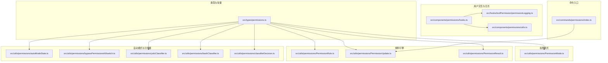
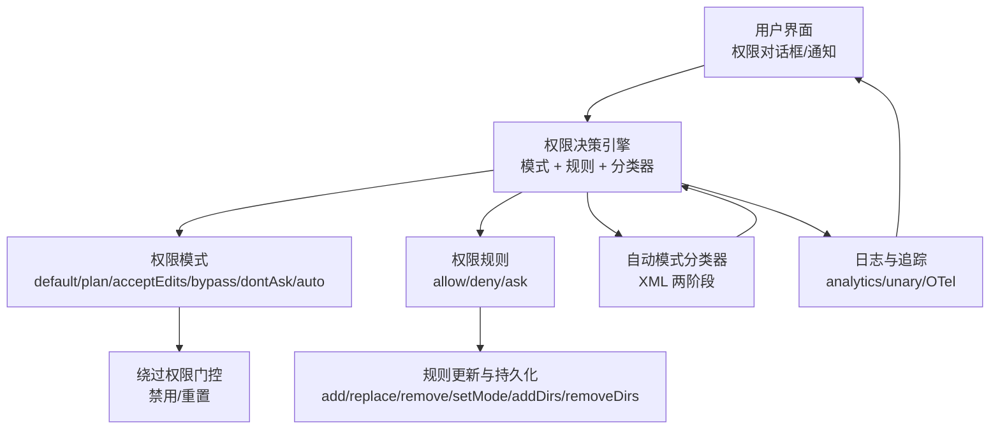
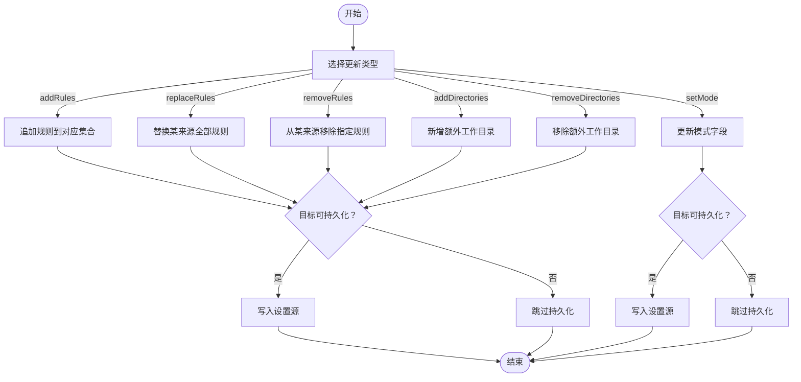
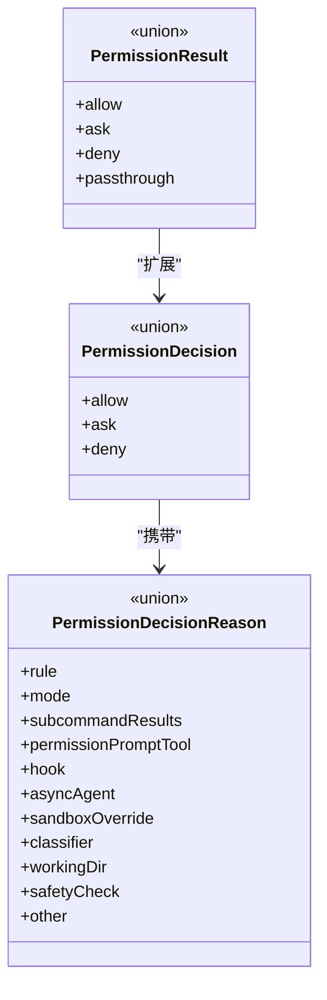
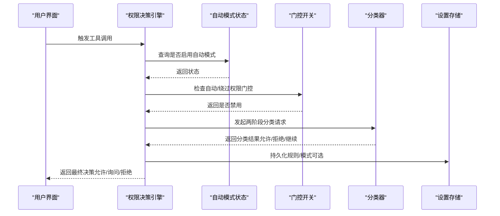
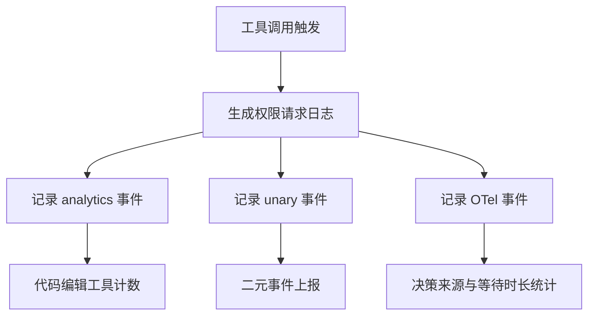
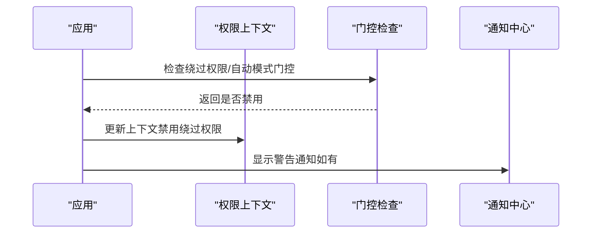
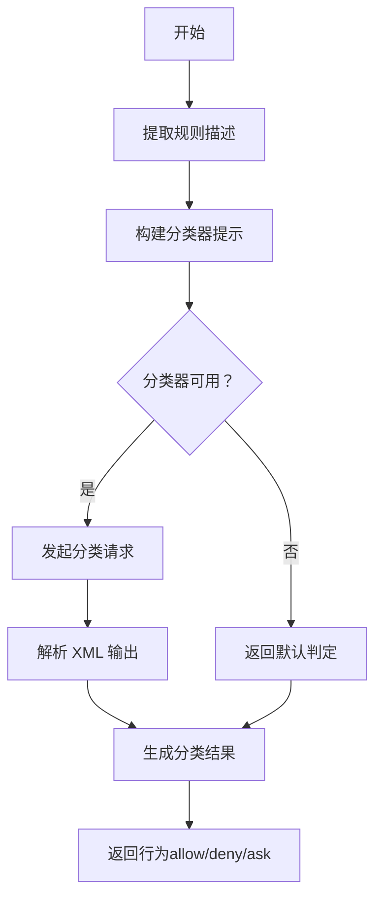
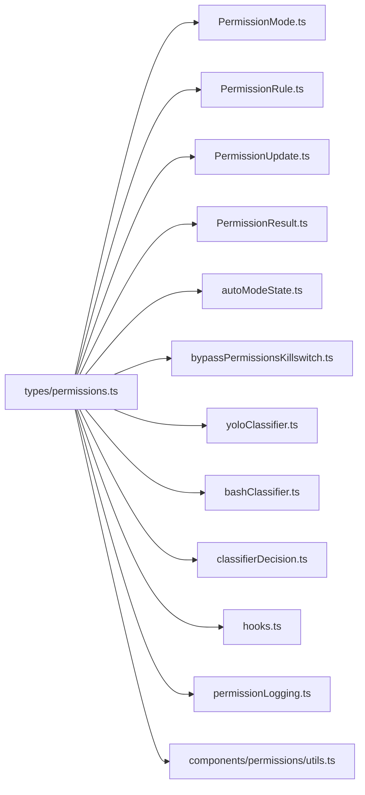

# 工具权限控制

<cite>
**本文档引用的文件**
- [PermissionMode.ts](file://src/utils/permissions/PermissionMode.ts)
- [PermissionRule.ts](file://src/utils/permissions/PermissionRule.ts)
- [permissions.ts](file://src/types/permissions.ts)
- [bashClassifier.ts](file://src/utils/permissions/bashClassifier.ts)
- [autoModeState.ts](file://src/utils/permissions/autoModeState.ts)
- [bypassPermissionsKillswitch.ts](file://src/utils/permissions/bypassPermissionsKillswitch.ts)
- [classifierDecision.ts](file://src/utils/permissions/classifierDecision.ts)
- [hooks.ts](file://src/components/permissions/hooks.ts)
- [permissionLogging.ts](file://src/hooks/toolPermission/permissionLogging.ts)
- [utils.ts](file://src/components/permissions/utils.ts)
- [PermissionUpdate.ts](file://src/utils/permissions/PermissionUpdate.ts)
- [PermissionResult.ts](file://src/utils/permissions/PermissionResult.ts)
- [yoloClassifier.ts](file://src/utils/permissions/yoloClassifier.ts)
- [index.ts](file://src/commands/permissions/index.ts)
</cite>

## 目录
1. [简介](#简介)
2. [项目结构](#项目结构)
3. [核心组件](#核心组件)
4. [架构总览](#架构总览)
5. [详细组件分析](#详细组件分析)
6. [依赖关系分析](#依赖关系分析)
7. [性能考量](#性能考量)
8. [故障排查指南](#故障排查指南)
9. [结论](#结论)
10. [附录](#附录)

## 简介
本文件面向 Claude Code 的工具权限控制系统，系统性阐述权限检查机制、规则引擎实现、用户交互流程设计与实现细节。重点覆盖以下主题：
- 权限模式（PermissionMode）与外部模式映射
- 权限规则（PermissionRule）与规则值（PermissionRuleValue）
- 危险模式检测与自动模式分类器（Auto Mode Classifier）
- 工具权限与系统权限的协调机制：绕过权限模式、自动模式权限、权限拒绝追踪
- 权限配置最佳实践：如何定义规则、处理冲突、实现安全的工具执行

## 项目结构
权限控制相关代码主要分布在以下模块：
- 类型与常量定义：src/types/permissions.ts
- 权限模式与外部模式映射：src/utils/permissions/PermissionMode.ts
- 规则定义与校验：src/utils/permissions/PermissionRule.ts
- 规则更新与持久化：src/utils/permissions/PermissionUpdate.ts
- 结果类型与决策原因：src/utils/permissions/PermissionResult.ts
- 自动模式状态与门控：src/utils/permissions/autoModeState.ts、src/utils/permissions/bypassPermissionsKillswitch.ts
- 分类器与危险模式检测：src/utils/permissions/yoloClassifier.ts、src/utils/permissions/bashClassifier.ts、src/utils/permissions/classifierDecision.ts
- 用户交互与日志：src/components/permissions/hooks.ts、src/hooks/toolPermission/permissionLogging.ts、src/components/permissions/utils.ts
- 命令入口：src/commands/permissions/index.ts



**图表来源**
- [permissions.ts](file://src/types/permissions.ts)
- [PermissionMode.ts](file://src/utils/permissions/PermissionMode.ts)
- [PermissionRule.ts](file://src/utils/permissions/PermissionRule.ts)
- [PermissionUpdate.ts](file://src/utils/permissions/PermissionUpdate.ts)
- [PermissionResult.ts](file://src/utils/permissions/PermissionResult.ts)
- [autoModeState.ts](file://src/utils/permissions/autoModeState.ts)
- [bypassPermissionsKillswitch.ts](file://src/utils/permissions/bypassPermissionsKillswitch.ts)
- [yoloClassifier.ts](file://src/utils/permissions/yoloClassifier.ts)
- [bashClassifier.ts](file://src/utils/permissions/bashClassifier.ts)
- [classifierDecision.ts](file://src/utils/permissions/classifierDecision.ts)
- [hooks.ts](file://src/components/permissions/hooks.ts)
- [permissionLogging.ts](file://src/hooks/toolPermission/permissionLogging.ts)
- [utils.ts](file://src/components/permissions/utils.ts)
- [index.ts](file://src/commands/permissions/index.ts)

**章节来源**
- [permissions.ts](file://src/types/permissions.ts)
- [PermissionMode.ts](file://src/utils/permissions/PermissionMode.ts)
- [PermissionRule.ts](file://src/utils/permissions/PermissionRule.ts)
- [PermissionUpdate.ts](file://src/utils/permissions/PermissionUpdate.ts)
- [PermissionResult.ts](file://src/utils/permissions/PermissionResult.ts)
- [autoModeState.ts](file://src/utils/permissions/autoModeState.ts)
- [bypassPermissionsKillswitch.ts](file://src/utils/permissions/bypassPermissionsKillswitch.ts)
- [yoloClassifier.ts](file://src/utils/permissions/yoloClassifier.ts)
- [bashClassifier.ts](file://src/utils/permissions/bashClassifier.ts)
- [classifierDecision.ts](file://src/utils/permissions/classifierDecision.ts)
- [hooks.ts](file://src/components/permissions/hooks.ts)
- [permissionLogging.ts](file://src/hooks/toolPermission/permissionLogging.ts)
- [utils.ts](file://src/components/permissions/utils.ts)
- [index.ts](file://src/commands/permissions/index.ts)

## 核心组件
- 权限模式（PermissionMode）：定义默认、计划模式、接受编辑、绕过权限、不询问、自动等模式，并提供模式标题、符号、颜色与外部模式映射。
- 权限规则（PermissionRule）：定义规则行为（允许/拒绝/询问）与规则值（工具名+可选内容），并提供 Zod 校验。
- 规则更新（PermissionUpdate）：支持添加/替换/移除规则、设置模式、增删额外工作目录，并可持久化到用户/项目/本地设置或会话。
- 结果与决策原因（PermissionResult/Reason）：统一抽象“允许/询问/拒绝/透传”结果及决策来源（规则、模式、子命令、分类器、hook 等）。
- 自动模式与分类器：在满足条件时启用自动模式，使用两阶段 XML 输出分类器对动作进行快速/思考决策；同时维护自动模式状态与门控开关。
- 绕过权限模式门控：根据组织策略动态禁用“绕过权限”模式，并在 UI 中提示。
- 用户交互与日志：记录权限请求事件、分类器决策、代码编辑工具计数与等待时长等。

**章节来源**
- [PermissionMode.ts](file://src/utils/permissions/PermissionMode.ts)
- [PermissionRule.ts](file://src/utils/permissions/PermissionRule.ts)
- [permissions.ts](file://src/types/permissions.ts)
- [PermissionUpdate.ts](file://src/utils/permissions/PermissionUpdate.ts)
- [PermissionResult.ts](file://src/utils/permissions/PermissionResult.ts)
- [autoModeState.ts](file://src/utils/permissions/autoModeState.ts)
- [bypassPermissionsKillswitch.ts](file://src/utils/permissions/bypassPermissionsKillswitch.ts)
- [yoloClassifier.ts](file://src/utils/permissions/yoloClassifier.ts)
- [hooks.ts](file://src/components/permissions/hooks.ts)
- [permissionLogging.ts](file://src/hooks/toolPermission/permissionLogging.ts)

## 架构总览
权限控制采用“模式驱动 + 规则优先 + 分类器辅助”的分层架构：
- 模式层：决定全局权限策略（默认/计划/绕过/不询问/自动）。
- 规则层：按来源（用户设置/项目设置/本地设置/策略/命令行/会话）定义允许/拒绝/询问规则。
- 分类器层：在自动模式下对动作进行快速/思考两阶段分类，减少人工确认成本。
- 交互与日志层：记录权限请求、决策来源、等待时间、代码编辑工具统计等。



**图表来源**
- [PermissionMode.ts](file://src/utils/permissions/PermissionMode.ts)
- [permissions.ts](file://src/types/permissions.ts)
- [PermissionUpdate.ts](file://src/utils/permissions/PermissionUpdate.ts)
- [yoloClassifier.ts](file://src/utils/permissions/yoloClassifier.ts)
- [bypassPermissionsKillswitch.ts](file://src/utils/permissions/bypassPermissionsKillswitch.ts)
- [hooks.ts](file://src/components/permissions/hooks.ts)
- [permissionLogging.ts](file://src/hooks/toolPermission/permissionLogging.ts)

## 详细组件分析

### 权限模式（PermissionMode）
- 外部模式映射：内部模式包含 auto/bubble，但对外仅暴露 acceptEdits/bypassPermissions/default/dontAsk/plan。
- 模式配置：提供标题、短标题、符号、颜色与外部模式映射，用于 UI 展示与外部集成。
- 字符串解析与判断：支持从字符串解析模式、判断是否默认模式、获取短标题与颜色。
- 特性开关：当启用 TRANSCRIPT_CLASSIFIER 时，auto 模式可用；否则仅内部存在。

```mermaid
classDiagram
class PermissionMode {
+toExternalPermissionMode(mode) ExternalPermissionMode
+permissionModeFromString(str) PermissionMode
+permissionModeTitle(mode) string
+permissionModeShortTitle(mode) string
+permissionModeSymbol(mode) string
+getModeColor(mode) ModeColorKey
+isDefaultMode(mode) boolean
}
class ExternalPermissionMode {
<<enum>>
"acceptEdits"
"bypassPermissions"
"default"
"dontAsk"
"plan"
}
PermissionMode --> ExternalPermissionMode : "映射"
```

**图表来源**
- [PermissionMode.ts](file://src/utils/permissions/PermissionMode.ts)
- [permissions.ts](file://src/types/permissions.ts)

**章节来源**
- [PermissionMode.ts](file://src/utils/permissions/PermissionMode.ts)
- [permissions.ts](file://src/types/permissions.ts)

### 权限规则（PermissionRule）与规则值（PermissionRuleValue）
- 行为定义：allow/deny/ask 三种行为，分别表示允许、拒绝与强制弹窗确认。
- 规则值：包含工具名与可选规则内容，工具可在自身 checkPermissions 中自定义解析。
- 校验：通过 Zod Schema 对行为与规则值进行运行时校验，避免错误配置导致的异常。

```mermaid
classDiagram
class PermissionRule {
+source : PermissionRuleSource
+ruleBehavior : PermissionBehavior
+ruleValue : PermissionRuleValue
}
class PermissionRuleValue {
+toolName : string
+ruleContent? : string
}
class PermissionBehavior {
<<enum>>
"allow"
"deny"
"ask"
}
PermissionRule --> PermissionRuleValue : "包含"
PermissionRule --> PermissionBehavior : "使用"
```

**图表来源**
- [PermissionRule.ts](file://src/utils/permissions/PermissionRule.ts)
- [permissions.ts](file://src/types/permissions.ts)

**章节来源**
- [PermissionRule.ts](file://src/utils/permissions/PermissionRule.ts)
- [permissions.ts](file://src/types/permissions.ts)

### 规则更新（PermissionUpdate）与持久化
- 支持操作：
  - 添加/替换/移除规则（按行为分类存储于 alwaysAllowRules/alwaysDenyRules/alwaysAskRules）
  - 设置模式（setMode）
  - 增加/删除额外工作目录（additionalWorkingDirectories）
- 持久化：仅对用户/项目/本地设置源进行持久化，会话内变更仅临时生效。
- 调试日志：对每一步更新进行调试输出，便于问题定位。



**图表来源**
- [PermissionUpdate.ts](file://src/utils/permissions/PermissionUpdate.ts)
- [permissions.ts](file://src/types/permissions.ts)

**章节来源**
- [PermissionUpdate.ts](file://src/utils/permissions/PermissionUpdate.ts)
- [permissions.ts](file://src/types/permissions.ts)

### 结果与决策原因（PermissionResult/Reason）
- 结果类型：
  - 允许：可能携带更新输入、用户修改标记、决策原因、工具使用 ID、反馈内容块等。
  - 询问：消息、建议（含规则建议）、阻断路径、元数据、异步分类器检查等。
  - 拒绝：消息、决策原因、工具使用 ID。
  - 透传：用于绕过权限但仍保留建议与原因。
- 决策原因：支持规则、模式、子命令结果、权限提示工具、hook、异步代理、沙箱覆盖、分类器、工作目录、安全检查等多种来源。



**图表来源**
- [permissions.ts](file://src/types/permissions.ts)
- [PermissionResult.ts](file://src/utils/permissions/PermissionResult.ts)

**章节来源**
- [permissions.ts](file://src/types/permissions.ts)
- [PermissionResult.ts](file://src/utils/permissions/PermissionResult.ts)

### 自动模式与分类器（Auto Mode & Classifier）
- 自动模式状态：维护是否处于自动模式、CLI 标记、电路断开状态，支持重置以便测试。
- 门控开关：根据组织策略动态禁用自动模式与绕过权限模式，首次查询后只检查一次，后续通过重置标志重新评估。
- 分类器：
  - 两阶段 XML 输出：快速阶段（max_tokens 较小，带停止序列）与思考阶段（chain-of-thought）。
  - 输出格式：XML 标签 <block>/<reason>，解析阶段剥离思考内容以避免误匹配。
  - 使用统计：记录输入/输出 token、缓存命中、请求 ID、消息 ID、阶段耗时等，便于审计与优化。
  - 安全边界：对敏感路径（如 .claude/、.git/、shell 配置）与跨机桥接消息采用不同策略，允许分类器在特定场景下自动批准。



**图表来源**
- [autoModeState.ts](file://src/utils/permissions/autoModeState.ts)
- [bypassPermissionsKillswitch.ts](file://src/utils/permissions/bypassPermissionsKillswitch.ts)
- [yoloClassifier.ts](file://src/utils/permissions/yoloClassifier.ts)
- [PermissionUpdate.ts](file://src/utils/permissions/PermissionUpdate.ts)

**章节来源**
- [autoModeState.ts](file://src/utils/permissions/autoModeState.ts)
- [bypassPermissionsKillswitch.ts](file://src/utils/permissions/bypassPermissionsKillswitch.ts)
- [yoloClassifier.ts](file://src/utils/permissions/yoloClassifier.ts)
- [classifierDecision.ts](file://src/utils/permissions/classifierDecision.ts)

### 用户交互与日志（Hooks 与 Logging）
- 请求日志：记录权限请求事件，包含工具名、是否 MCP、决策原因类型、沙箱状态等；对 Bash 工具在无规则建议时进行专项日志。
- 分类器日志：区分分类器来源与原因，便于审计。
- 代码编辑工具计数：针对编辑/写入/笔记本编辑工具，按语言维度统计决策来源与等待时长。
- 二元事件：记录权限请求的响应事件，包含平台信息与消息 ID。



**图表来源**
- [hooks.ts](file://src/components/permissions/hooks.ts)
- [permissionLogging.ts](file://src/hooks/toolPermission/permissionLogging.ts)
- [utils.ts](file://src/components/permissions/utils.ts)

**章节来源**
- [hooks.ts](file://src/components/permissions/hooks.ts)
- [permissionLogging.ts](file://src/hooks/toolPermission/permissionLogging.ts)
- [utils.ts](file://src/components/permissions/utils.ts)

### 绕过权限模式与自动模式门控
- 绕过权限门控：在应用启动或登录后，检查组织策略，若需要禁用“绕过权限”模式，则更新权限上下文，确保用户无法直接绕过安全限制。
- 自动模式门控：在模型切换或快速模式变化时，重新验证自动模式访问，必要时发出通知并更新上下文。



**图表来源**
- [bypassPermissionsKillswitch.ts](file://src/utils/permissions/bypassPermissionsKillswitch.ts)
- [permissions.ts](file://src/types/permissions.ts)

**章节来源**
- [bypassPermissionsKillswitch.ts](file://src/utils/permissions/bypassPermissionsKillswitch.ts)
- [permissions.ts](file://src/types/permissions.ts)

### 危险模式检测与 Bash 分类器
- Bash 分类器：在启用 BASH_CLASSIFIER 时，基于描述列表对 Bash 命令进行 deny/ask/allow 判定；在外部构建中默认禁用。
- 描述提取与规则：支持从规则内容中提取描述，生成通用描述，便于分类器理解意图。
- 分类器决策：结合 allow/ask/deny 描述与当前上下文，返回匹配结果、置信度与原因。



**图表来源**
- [bashClassifier.ts](file://src/utils/permissions/bashClassifier.ts)
- [yoloClassifier.ts](file://src/utils/permissions/yoloClassifier.ts)
- [classifierDecision.ts](file://src/utils/permissions/classifierDecision.ts)

**章节来源**
- [bashClassifier.ts](file://src/utils/permissions/bashClassifier.ts)
- [yoloClassifier.ts](file://src/utils/permissions/yoloClassifier.ts)
- [classifierDecision.ts](file://src/utils/permissions/classifierDecision.ts)

## 依赖关系分析
- 类型解耦：权限类型与常量集中于 types/permissions.ts，避免循环依赖，工具实现与 UI 组件通过该文件导入类型。
- 功能模块化：权限模式、规则、更新、结果、分类器、门控与日志各自独立，通过工具权限上下文进行组合。
- 外部集成：外部模式映射与特性开关（TRANSCRIPT_CLASSIFIER/BASH_CLASSIFIER）影响可用能力与 UI 表现。



**图表来源**
- [permissions.ts](file://src/types/permissions.ts)
- [PermissionMode.ts](file://src/utils/permissions/PermissionMode.ts)
- [PermissionRule.ts](file://src/utils/permissions/PermissionRule.ts)
- [PermissionUpdate.ts](file://src/utils/permissions/PermissionUpdate.ts)
- [PermissionResult.ts](file://src/utils/permissions/PermissionResult.ts)
- [autoModeState.ts](file://src/utils/permissions/autoModeState.ts)
- [bypassPermissionsKillswitch.ts](file://src/utils/permissions/bypassPermissionsKillswitch.ts)
- [yoloClassifier.ts](file://src/utils/permissions/yoloClassifier.ts)
- [bashClassifier.ts](file://src/utils/permissions/bashClassifier.ts)
- [classifierDecision.ts](file://src/utils/permissions/classifierDecision.ts)
- [hooks.ts](file://src/components/permissions/hooks.ts)
- [permissionLogging.ts](file://src/hooks/toolPermission/permissionLogging.ts)
- [utils.ts](file://src/components/permissions/utils.ts)

**章节来源**
- [permissions.ts](file://src/types/permissions.ts)
- [PermissionMode.ts](file://src/utils/permissions/PermissionMode.ts)
- [PermissionRule.ts](file://src/utils/permissions/PermissionRule.ts)
- [PermissionUpdate.ts](file://src/utils/permissions/PermissionUpdate.ts)
- [PermissionResult.ts](file://src/utils/permissions/PermissionResult.ts)
- [autoModeState.ts](file://src/utils/permissions/autoModeState.ts)
- [bypassPermissionsKillswitch.ts](file://src/utils/permissions/bypassPermissionsKillswitch.ts)
- [yoloClassifier.ts](file://src/utils/permissions/yoloClassifier.ts)
- [bashClassifier.ts](file://src/utils/permissions/bashClassifier.ts)
- [classifierDecision.ts](file://src/utils/permissions/classifierDecision.ts)
- [hooks.ts](file://src/components/permissions/hooks.ts)
- [permissionLogging.ts](file://src/hooks/toolPermission/permissionLogging.ts)
- [utils.ts](file://src/components/permissions/utils.ts)

## 性能考量
- 分类器两阶段设计：快速阶段降低平均延迟，思考阶段提升准确性；通过缓存控制与提示词优化减少 token 消耗。
- 仅对安全工具白名单跳过分类器：避免不必要的 API 调用，提高吞吐。
- 异步分类器检查：在用户未确认前后台评估，缩短等待时间。
- 日志与调试：提供调试输出与错误转储路径，便于定位性能瓶颈与错误。

[本节为通用指导，无需具体文件分析]

## 故障排查指南
- 无规则建议的 Bash 请求：在 ANT 构建中，若权限请求无规则建议，将记录专项事件，便于识别应被允许却被阻断的调用。
- 分类器不可用：在外部构建中分类器默认禁用，需检查特性开关与组织策略。
- 门控禁用：若发现“绕过权限”或“自动模式”不可用，检查门控检查是否已执行且结果为禁用。
- 日志审计：通过 analytics、unary、OTel 事件与决策来源，定位权限决策链路中的异常点。

**章节来源**
- [hooks.ts](file://src/components/permissions/hooks.ts)
- [permissionLogging.ts](file://src/hooks/toolPermission/permissionLogging.ts)
- [bypassPermissionsKillswitch.ts](file://src/utils/permissions/bypassPermissionsKillswitch.ts)
- [yoloClassifier.ts](file://src/utils/permissions/yoloClassifier.ts)

## 结论
Claude Code 的工具权限控制系统通过“模式 + 规则 + 分类器 + 门控 + 日志”的多层协同，实现了灵活、可审计、可扩展的安全控制。其设计兼顾用户体验（自动模式、异步分类器）与安全边界（绕过权限门控、危险模式检测），并通过完善的日志与追踪机制支撑持续优化。

[本节为总结，无需具体文件分析]

## 附录

### 权限配置最佳实践
- 定义规则：
  - 使用“添加规则”在用户/项目/本地设置中建立 allow/deny/ask 规则，工具名与规则内容由工具自定义解析。
  - 使用“替换规则”批量更新某来源的规则集，避免遗漏。
- 处理冲突：
  - 规则按来源聚合，优先级由工具实现决定；若存在冲突，建议通过更具体的规则（如精确路径）覆盖泛化规则。
- 实现安全的工具执行：
  - 默认使用“默认/计划/不询问”模式，谨慎开启“绕过权限”。
  - 在自动模式下，利用分类器减少人工确认；对敏感路径与跨机桥接消息保持严格策略。
  - 记录并分析权限拒绝原因，持续优化规则与分类器提示。

**章节来源**
- [PermissionUpdate.ts](file://src/utils/permissions/PermissionUpdate.ts)
- [permissions.ts](file://src/types/permissions.ts)
- [yoloClassifier.ts](file://src/utils/permissions/yoloClassifier.ts)
- [bypassPermissionsKillswitch.ts](file://src/utils/permissions/bypassPermissionsKillswitch.ts)