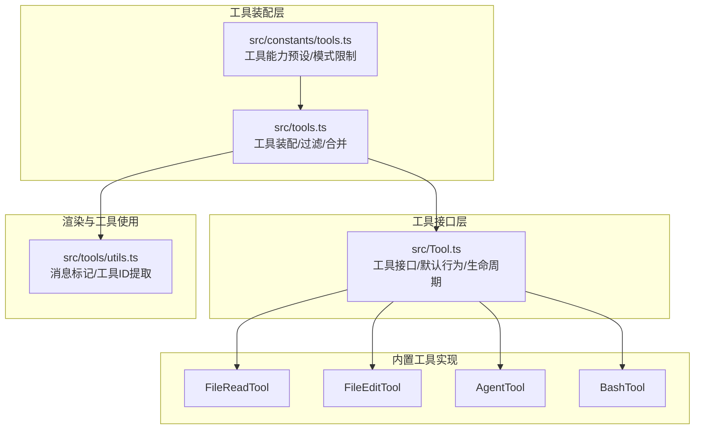
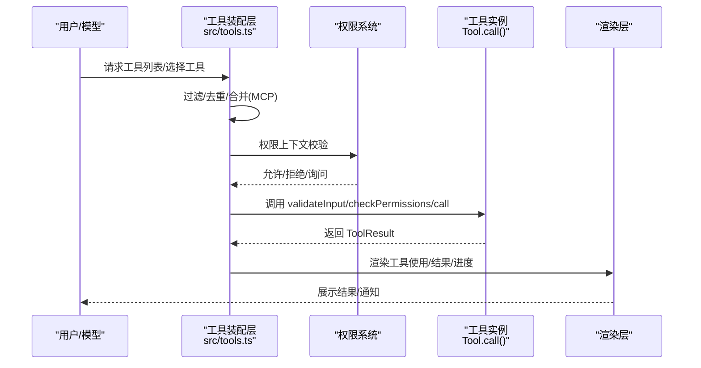
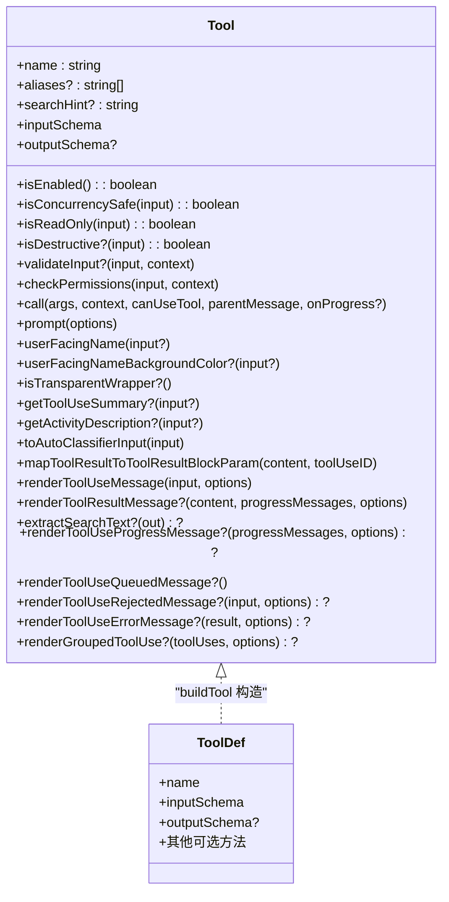
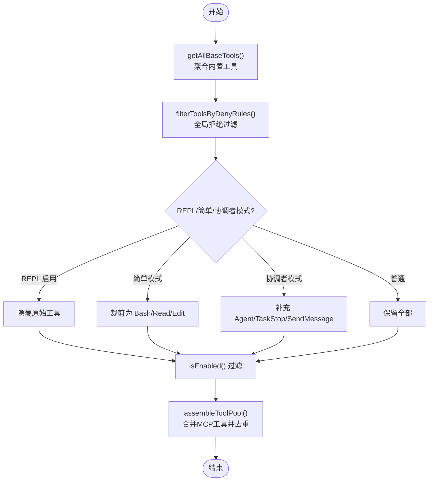
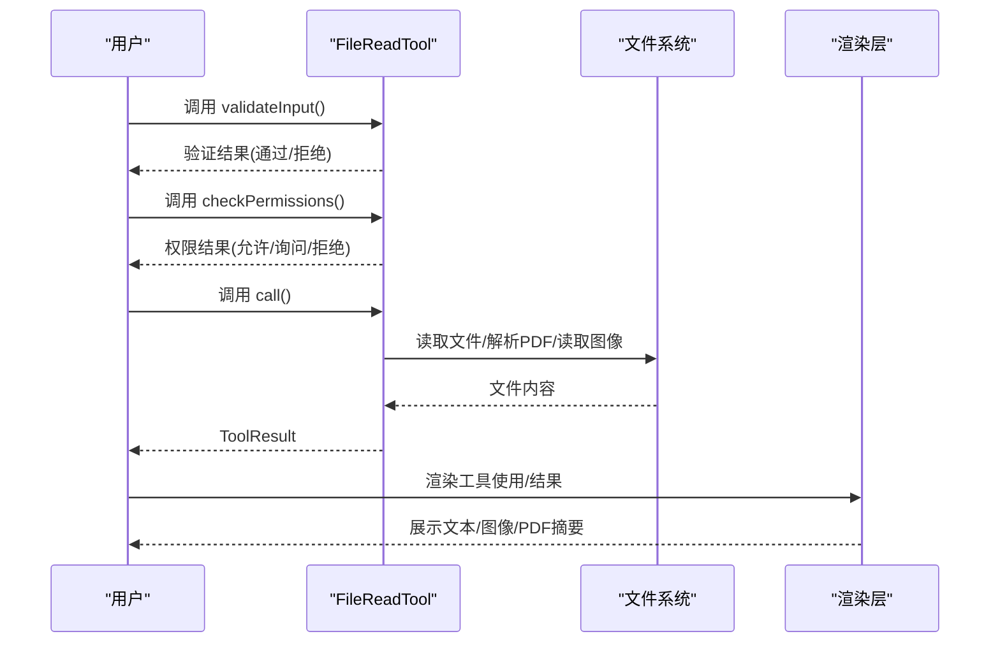
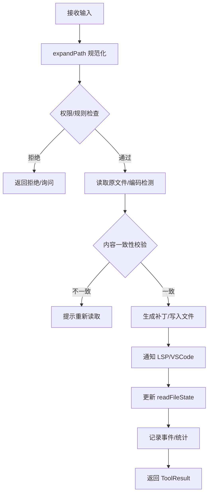
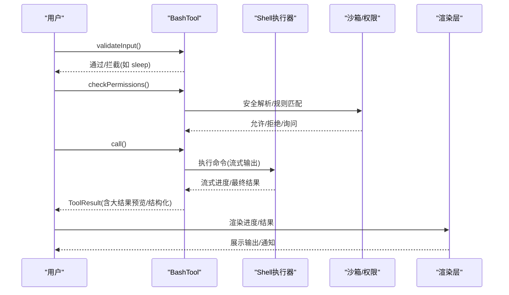
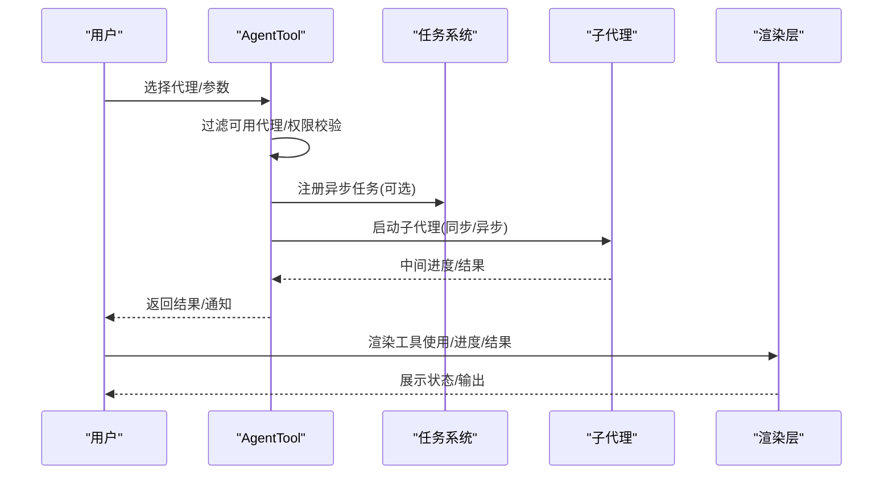
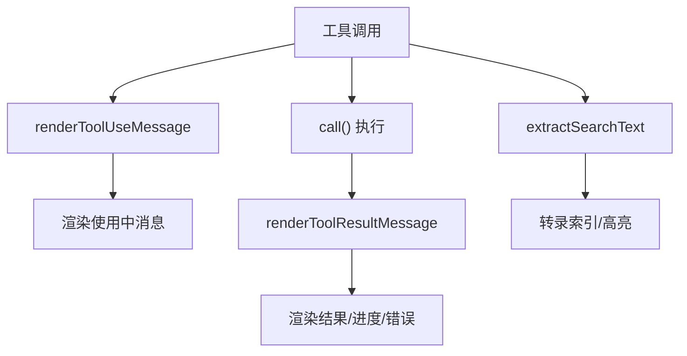
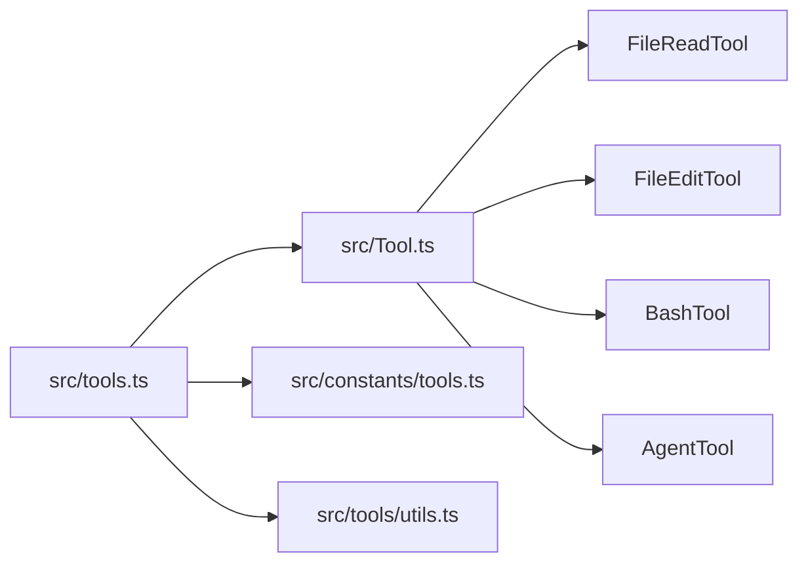

# 工具系统

<cite>
**本文引用的文件**
- [src/tools.ts](file://src/tools.ts)
- [src/Tool.ts](file://src/Tool.ts)
- [src/constants/tools.ts](file://src/constants/tools.ts)
- [src/tools/FileReadTool/FileReadTool.ts](file://src/tools/FileReadTool/FileReadTool.ts)
- [src/tools/FileEditTool/FileEditTool.ts](file://src/tools/FileEditTool/FileEditTool.ts)
- [src/tools/AgentTool/AgentTool.tsx](file://src/tools/AgentTool/AgentTool.tsx)
- [src/tools/BashTool/BashTool.tsx](file://src/tools/BashTool/BashTool.tsx)
- [src/tools/utils.ts](file://src/tools/utils.ts)
</cite>

## 目录
1. [简介](#简介)
2. [项目结构](#项目结构)
3. [核心组件](#核心组件)
4. [架构总览](#架构总览)
5. [详细组件分析](#详细组件分析)
6. [依赖关系分析](#依赖关系分析)
7. [性能考虑](#性能考虑)
8. [故障排查指南](#故障排查指南)
9. [结论](#结论)
10. [附录](#附录)

## 简介
本文件系统性阐述 Claude Code 的工具系统：包括工具接口设计、内置工具实现机制、工具注册与发现流程、工具生命周期（validateInput、checkPermissions、call）、工具能力标识（isEnabled、isConcurrencySafe、isReadOnly、isDestructive）、工具渲染体系（renderToolUseMessage、renderToolResultMessage），并结合多代理协作场景说明工具系统与权限控制、服务层的交互方式，最后给出性能优化建议与最佳实践。

## 项目结构
工具系统围绕统一的工具接口抽象展开，所有内置工具通过集中装配函数统一注册，并支持基于权限规则的过滤、MCP 工具合并、以及 REPL 模式下的特殊处理。核心文件如下：
- 工具接口与默认行为：src/Tool.ts
- 工具装配与注册：src/tools.ts
- 工具能力预设与模式限制：src/constants/tools.ts
- 典型工具实现示例：FileReadTool、FileEditTool、AgentTool、BashTool
- 工具渲染辅助：src/tools/utils.ts

**图表来源**
- [src/tools.ts:193-390](file://src/tools.ts#L193-L390)
- [src/Tool.ts:362-793](file://src/Tool.ts#L362-L793)
- [src/constants/tools.ts:36-113](file://src/constants/tools.ts#L36-L113)
- [src/tools/utils.ts:12-41](file://src/tools/utils.ts#L12-L41)

**章节来源**
- [src/tools.ts:193-390](file://src/tools.ts#L193-L390)
- [src/Tool.ts:362-793](file://src/Tool.ts#L362-L793)
- [src/constants/tools.ts:36-113](file://src/constants/tools.ts#L36-L113)
- [src/tools/utils.ts:12-41](file://src/tools/utils.ts#L12-L41)

## 核心组件
- 工具接口与默认行为
  - 工具类型定义包含生命周期方法（validateInput、checkPermissions、call）、能力标识（isEnabled、isConcurrencySafe、isReadOnly、isDestructive）、渲染钩子（renderToolUseMessage、renderToolResultMessage 等）以及输入/输出模式（inputSchema、outputSchema、mapToolResultToToolResultBlockParam）。
  - 提供 buildTool 构造器，自动填充常用默认值，确保工具实现最小化样板代码。
- 工具装配与过滤
  - getAllBaseTools：按环境特征与特性开关聚合所有内置工具。
  - getTools：根据权限上下文过滤工具，支持 REPL 模式隐藏原始工具、简单模式裁剪工具集。
  - assembleToolPool：合并内置工具与 MCP 工具，去重并保持提示缓存稳定性。
  - filterToolsByDenyRules：依据权限规则对工具进行“全局拒绝”过滤。
- 工具能力与模式限制
  - ALL_AGENT_DISALLOWED_TOOLS、ASYNC_AGENT_ALLOWED_TOOLS、COORDINATOR_MODE_ALLOWED_TOOLS 等集合用于限制不同运行模式下可用工具。
- 渲染与工具使用
  - 工具渲染接口统一，支持普通/压缩视图、进度消息、拒绝/错误 UI、分组渲染等。
  - 工具结果映射到 SDK 的 tool_result 块参数，支持大结果持久化与预览。

**章节来源**
- [src/Tool.ts:362-793](file://src/Tool.ts#L362-L793)
- [src/tools.ts:193-390](file://src/tools.ts#L193-L390)
- [src/constants/tools.ts:36-113](file://src/constants/tools.ts#L36-L113)

## 架构总览
工具系统的调用链路从“装配与过滤”开始，到“权限校验与执行”，再到“渲染与结果映射”。典型顺序如下：

**图表来源**
- [src/tools.ts:271-327](file://src/tools.ts#L271-L327)
- [src/Tool.ts:489-503](file://src/Tool.ts#L489-L503)
- [src/Tool.ts:379-385](file://src/Tool.ts#L379-L385)

## 详细组件分析

### 工具接口与生命周期
- 生命周期方法
  - validateInput：输入级校验，返回验证结果；常用于早期拒绝（如路径非法、参数越界）。
  - checkPermissions：工具级权限决策，结合通用权限系统与工具特定规则。
  - call：实际执行逻辑，返回 ToolResult，可附加新消息、上下文修改器等。
- 能力标识
  - isEnabled：是否启用该工具。
  - isConcurrencySafe：是否允许并发调用（影响缓存与并发策略）。
  - isReadOnly：是否只读操作（影响 UI 与安全分类）。
  - isDestructive：是否具有破坏性（删除/覆盖/发送等）。
- 渲染与描述
  - renderToolUseMessage/renderToolResultMessage：分别渲染“工具使用中”和“结果”。
  - renderToolUseProgressMessage/renderToolUseQueuedMessage：进度与排队态。
  - renderToolUseRejectedMessage/renderToolUseErrorMessage：拒绝/错误 UI。
  - userFacingName/getToolUseSummary/getActivityDescription：面向用户的名称、摘要与活动描述。
- 结果映射
  - mapToolResultToToolResultBlockParam：将工具输出映射为 SDK 的 tool_result 块参数，支持结构化内容与大结果持久化。

**图表来源**
- [src/Tool.ts:362-793](file://src/Tool.ts#L362-L793)

**章节来源**
- [src/Tool.ts:362-793](file://src/Tool.ts#L362-L793)

### 工具装配与注册流程
- getAllBaseTools：按特性开关与环境变量聚合内置工具，避免不必要的构建产物。
- getTools：应用权限规则过滤、REPL 模式隐藏原始工具、简单模式裁剪工具集，并再次应用 isEnabled 过滤。
- assembleToolPool：合并内置与 MCP 工具，按名称去重（内置优先），并对两部分分别排序以保证提示缓存稳定。
- filterToolsByDenyRules：对工具名或 MCP 服务器前缀进行全局拒绝匹配，避免模型看到被禁用工具。

**图表来源**
- [src/tools.ts:193-390](file://src/tools.ts#L193-L390)
- [src/tools.ts:262-367](file://src/tools.ts#L262-L367)

**章节来源**
- [src/tools.ts:193-390](file://src/tools.ts#L193-L390)

### 文件读取工具（FileReadTool）
- 输入/输出模式
  - 输入：文件路径、偏移/行数、PDF 页范围等；输出：文本/图片/笔记本/PDF 部分/未变更占位等。
- 安全与合规
  - validateInput：校验页范围、二进制扩展名、设备路径、UNC 路径等；deny 规则检查。
  - checkPermissions：基于文件系统权限规则的读取授权。
- 性能与体验
  - 读取去重：基于 readFileState 的上次读取时间戳与范围判断，避免重复传输。
  - 大文件令牌计数：先粗估再精确计数，超限时抛出异常。
  - 技能发现：读取文件时异步发现/激活技能目录，非阻塞。
- 渲染与结果映射
  - renderToolUseMessage/renderToolResultMessage：按类型渲染摘要与内容。
  - mapToolResultToToolResultBlockParam：将不同类型结果映射为 SDK 块参数，含 PDF 文档块与图像块。

**图表来源**
- [src/tools/FileReadTool/FileReadTool.ts:418-495](file://src/tools/FileReadTool/FileReadTool.ts#L418-L495)
- [src/tools/FileReadTool/FileReadTool.ts:496-718](file://src/tools/FileReadTool/FileReadTool.ts#L496-L718)

**章节来源**
- [src/tools/FileReadTool/FileReadTool.ts:418-718](file://src/tools/FileReadTool/FileReadTool.ts#L418-L718)

### 文件编辑工具（FileEditTool）
- 输入/输出模式
  - 输入：旧字符串、新字符串、替换策略、目标路径；输出：结构化补丁、更新后的内容摘要、可选 Git Diff。
- 安全与一致性
  - validateInput：检测团队内存敏感内容、空文件创建、UNC 路径、过大文件、未读取即写、内容不一致等。
  - checkPermissions：基于文件系统权限规则的写入授权。
- 并发与原子性
  - 读取-校验-写入-通知 LSP/VSCode 的原子步骤，确保并发安全。
  - 更新 readFileState 以失效过期写入。
- 渲染与结果映射
  - renderToolUseMessage/renderToolResultMessage：显示编辑摘要与用户修改提示。
  - mapToolResultToToolResultBlockParam：生成简洁的结果文本。

**图表来源**
- [src/tools/FileEditTool/FileEditTool.ts:137-362](file://src/tools/FileEditTool/FileEditTool.ts#L137-L362)
- [src/tools/FileEditTool/FileEditTool.ts:387-595](file://src/tools/FileEditTool/FileEditTool.ts#L387-L595)

**章节来源**
- [src/tools/FileEditTool/FileEditTool.ts:137-595](file://src/tools/FileEditTool/FileEditTool.ts#L137-L595)

### Bash 工具（BashTool）
- 只读判定与搜索/读取命令识别
  - isReadOnly：基于命令语义与 cd 使用约束判断是否只读。
  - isSearchOrReadCommand：解析管道与操作符，识别搜索/读取/列表命令，支持 UI 折叠。
- 权限与沙箱
  - checkPermissions：基于安全解析与规则匹配的权限决策。
  - shouldUseSandbox：动态决定是否启用沙箱，支持指示器显示。
- 输出处理与大结果
  - 大输出落地磁盘并生成预览，映射为 SDK 结构化内容或文本块。
  - 解释退出码与常见错误，必要时追加 stderr 提示。
- 自动后台与前台切换
  - run_in_background 控制后台执行；长阻塞命令在助手模式下自动后台化。

**图表来源**
- [src/tools/BashTool/BashTool.tsx:524-541](file://src/tools/BashTool/BashTool.tsx#L524-L541)
- [src/tools/BashTool/BashTool.tsx:624-800](file://src/tools/BashTool/BashTool.tsx#L624-L800)

**章节来源**
- [src/tools/BashTool/BashTool.tsx:524-800](file://src/tools/BashTool/BashTool.tsx#L524-L800)

### Agent 工具（AgentTool）
- 多代理与隔离
  - 支持子代理、团队代理、工作树隔离、远程隔离（外部构建）。
  - 根据权限模式与 MCP 服务器要求筛选可用代理。
- 生命周期与异步执行
  - 同步/异步两种执行路径；异步任务注册与进度跟踪，支持后台通知。
- 系统提示与工具池
  - fork 子代理路径复用父系统提示与工具集，保证缓存命中；常规路径按工作目录与权限模式构建系统提示与工具池。

**图表来源**
- [src/tools/AgentTool/AgentTool.tsx:196-800](file://src/tools/AgentTool/AgentTool.tsx#L196-L800)

**章节来源**
- [src/tools/AgentTool/AgentTool.tsx:196-800](file://src/tools/AgentTool/AgentTool.tsx#L196-L800)

### 工具渲染系统
- 统一渲染接口
  - renderToolUseMessage：渲染“工具使用中”的消息。
  - renderToolResultMessage：渲染“工具结果”的消息。
  - renderToolUseProgressMessage/renderToolUseQueuedMessage：进度与排队态。
  - renderToolUseRejectedMessage/renderToolUseErrorMessage：拒绝/错误 UI。
  - renderGroupedToolUse：批量工具使用分组渲染。
- 搜索文本抽取
  - extractSearchText：用于转录索引的文本抽取，确保渲染可见性与索引一致性。
- 工具使用标记
  - 工具使用 ID 标记用户消息，防止 UI 重复显示“正在运行”。

**图表来源**
- [src/Tool.ts:566-667](file://src/Tool.ts#L566-L667)
- [src/tools/utils.ts:12-41](file://src/tools/utils.ts#L12-L41)

**章节来源**
- [src/Tool.ts:566-667](file://src/Tool.ts#L566-L667)
- [src/tools/utils.ts:12-41](file://src/tools/utils.ts#L12-L41)

## 依赖关系分析
- 工具装配层依赖工具接口与权限常量，负责工具聚合、过滤与合并。
- 工具实现依赖工具接口与工具装配层提供的上下文（ToolUseContext），并在各自模块内实现 validateInput/checkPermissions/call。
- 渲染层依赖工具实现的渲染钩子，统一处理 UI 展示与交互。
- 权限系统贯穿 validateInput 与 checkPermissions，结合 deny 规则与工具特定匹配器。

**图表来源**
- [src/tools.ts:193-390](file://src/tools.ts#L193-L390)
- [src/Tool.ts:362-793](file://src/Tool.ts#L362-L793)
- [src/constants/tools.ts:36-113](file://src/constants/tools.ts#L36-L113)
- [src/tools/utils.ts:12-41](file://src/tools/utils.ts#L12-L41)

**章节来源**
- [src/tools.ts:193-390](file://src/tools.ts#L193-L390)
- [src/Tool.ts:362-793](file://src/Tool.ts#L362-L793)
- [src/constants/tools.ts:36-113](file://src/constants/tools.ts#L36-L113)
- [src/tools/utils.ts:12-41](file://src/tools/utils.ts#L12-L41)

## 性能考虑
- 输入级早拒绝：在 validateInput 中尽早拒绝非法参数与受限路径，减少后续昂贵 I/O。
- 读取去重：FileReadTool 基于 readFileState 的时间戳与范围判断，避免重复传输，显著节省缓存创建开销。
- 大结果持久化：BashTool 与 FileReadTool 对超阈值输出进行落盘并生成预览，避免内存与缓存压力。
- 并发安全：isConcurrencySafe 与 isReadOnly 标识帮助系统选择合适的并发策略与 UI 行为。
- 提示缓存稳定性：assembleToolPool 对内置与 MCP 工具分别排序并去重，避免缓存键抖动。
- 渲染与索引一致性：extractSearchText 与渲染钩子配合，确保索引与 UI 显示一致，避免 phantom/under-count。

[本节为通用指导，无需具体文件引用]

## 故障排查指南
- 文件读取失败
  - 现象：报错“文件不存在/路径错误”。
  - 排查：确认 expandPath 是否正确；检查 deny 规则；UNC 路径需谨慎；macOS 截图路径可能使用不同空格字符。
  - 参考：FileReadTool.validateInput 与 call 内的错误处理与替代路径尝试。
- 文件写入失败
  - 现象：提示“文件已被修改/未读取即写/过大/空旧字符串但文件已存在”等。
  - 排查：先使用 FileReadTool 读取；确认内容未被外部修改；检查权限与 deny 规则；避免对大文件直接编辑。
  - 参考：FileEditTool.validateInput 与原子写入流程。
- Bash 命令被拦截
  - 现象：提示“长时间阻塞命令需后台执行/禁止 sleep 独立使用”。
  - 排查：使用 run_in_background 或改用 Monitor 工具；缩短延迟至 2 秒以下。
  - 参考：BashTool.validateInput 的 sleep 检测与自动后台预算。
- 权限相关问题
  - 现象：工具被拒绝或弹出权限对话框。
  - 排查：检查 deny 规则、工具特定匹配器、MCP 服务器认证状态；必要时使用 alwaysAllow/alwaysAsk 规则。
  - 参考：checkPermissions 与权限匹配器实现。

**章节来源**
- [src/tools/FileReadTool/FileReadTool.ts:418-495](file://src/tools/FileReadTool/FileReadTool.ts#L418-L495)
- [src/tools/FileEditTool/FileEditTool.ts:137-362](file://src/tools/FileEditTool/FileEditTool.ts#L137-L362)
- [src/tools/BashTool/BashTool.tsx:524-541](file://src/tools/BashTool/BashTool.tsx#L524-L541)

## 结论
Claude Code 的工具系统以统一接口为核心，通过严格的生命周期与能力标识、完善的权限与渲染体系，实现了可扩展、可审计、可观察的工具生态。工具装配层负责在不同运行模式与特性开关下动态组装工具集合，并与 MCP 工具无缝融合。内置工具（如 FileReadTool、FileEditTool、BashTool、AgentTool）展示了输入校验、权限决策、并发安全、结果映射与 UI 渲染的最佳实践。在多代理协作场景中，工具系统与权限控制、服务层协同，保障了安全性与用户体验。

[本节为总结，无需具体文件引用]

## 附录
- 工具开发示例（步骤指引）
  - 定义输入/输出模式：使用 lazySchema 定义 zod 模式，明确字段含义与约束。
  - 实现 validateInput：在不触发 I/O 的前提下完成参数与路径合法性检查。
  - 实现 checkPermissions：结合工具特定规则与权限匹配器，返回允许/询问/拒绝。
  - 实现 call：执行业务逻辑，注意并发安全与资源清理；必要时使用 context.readFileState 与工具结果映射。
  - 实现渲染钩子：renderToolUseMessage/renderToolResultMessage 等，确保 UI 与索引一致。
  - 注册与装配：通过 buildTool 构造工具对象，加入工具装配层（如需），并按需参与 assembleToolPool。
- 最佳实践
  - 尽量在 validateInput 中完成早期拒绝，减少后续开销。
  - 使用 isReadOnly/isConcurrencySafe 正确标注工具能力，便于系统优化。
  - 对大结果采用持久化与预览策略，避免内存与缓存压力。
  - 在多代理场景中，遵循权限模式与 MCP 服务器要求，确保工具可用性与安全性。

[本节为通用指导，无需具体文件引用]